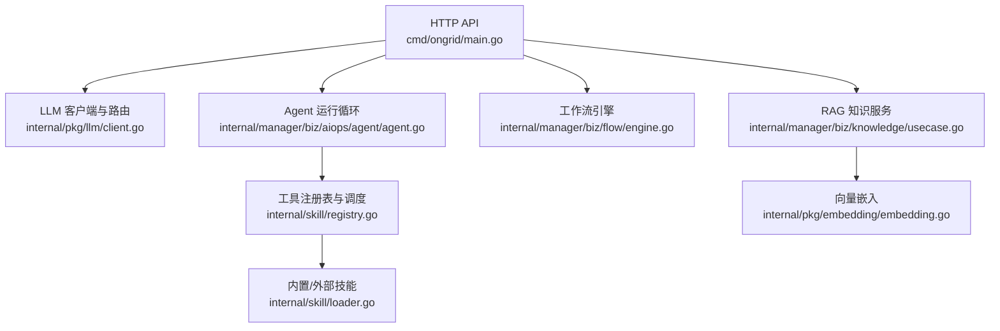
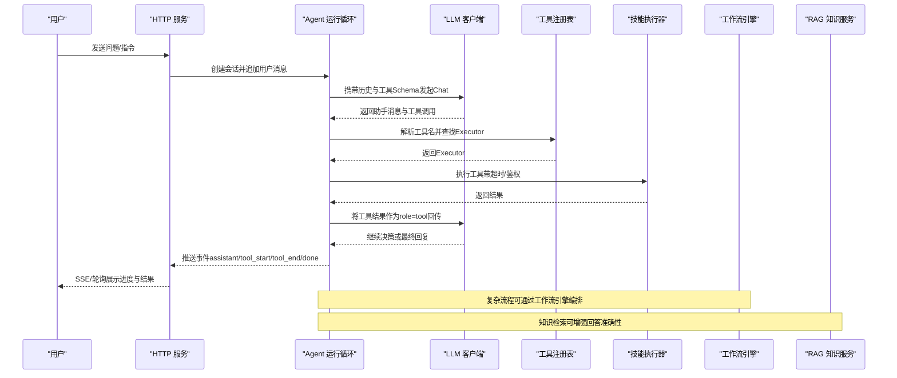
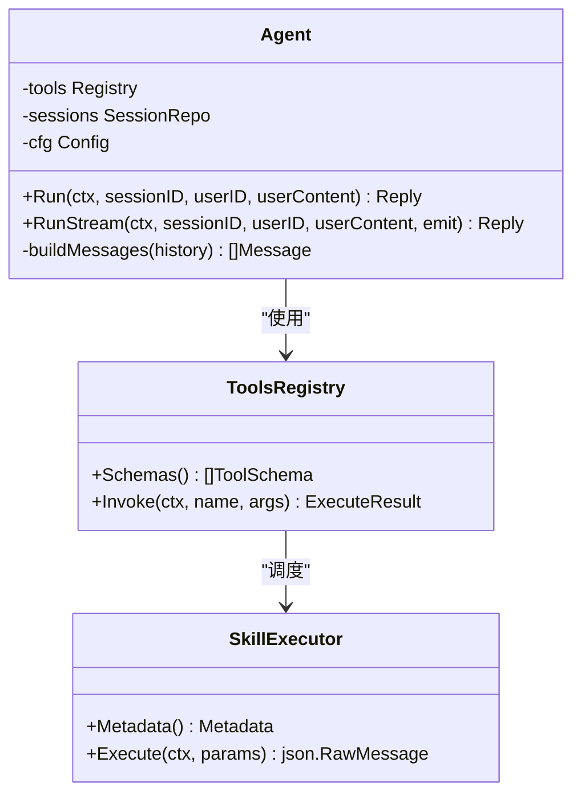
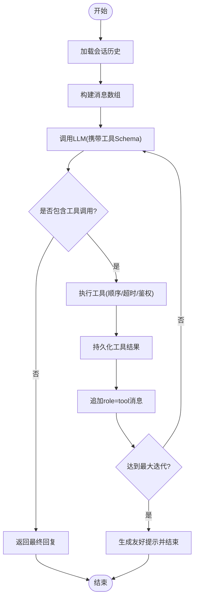
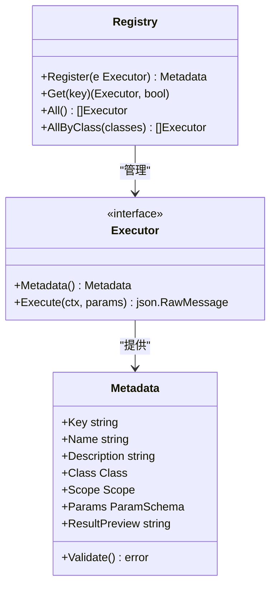
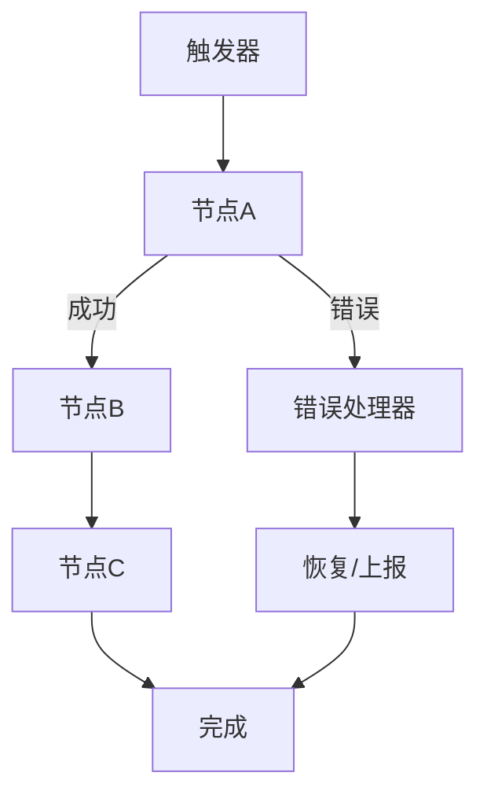
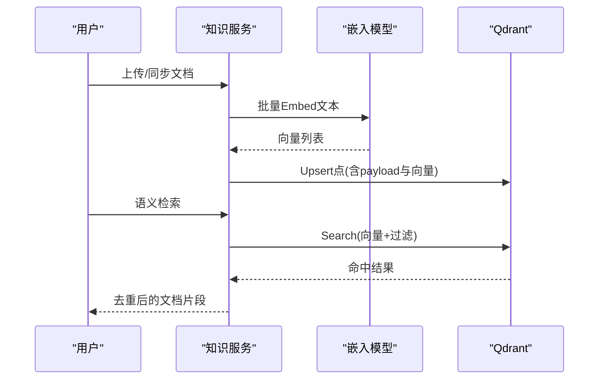
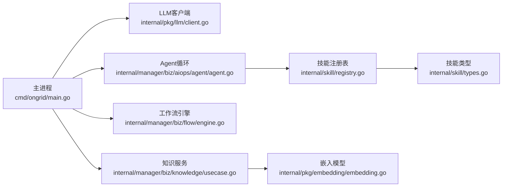

# AI Agent 系统

<cite>
**本文引用的文件**
- [README.md](file://README.md)
- [cmd/ongrid/main.go](file://cmd/ongrid/main.go)
- [internal/pkg/llm/client.go](file://internal/pkg/llm/client.go)
- [internal/skill/types.go](file://internal/skill/types.go)
- [internal/skill/registry.go](file://internal/skill/registry.go)
- [internal/skill/loader.go](file://internal/skill/loader.go)
- [internal/manager/biz/aiops/agent/agent.go](file://internal/manager/biz/aiops/agent/agent.go)
- [internal/manager/biz/flow/engine.go](file://internal/manager/biz/flow/engine.go)
- [internal/manager/biz/knowledge/usecase.go](file://internal/manager/biz/knowledge/usecase.go)
- [internal/pkg/embedding/embedding.go](file://internal/pkg/embedding/embedding.go)
- [agents/specialist-ops.md](file://agents/specialist-ops.md)
</cite>

## 目录
1. [简介](#简介)
2. [项目结构](#项目结构)
3. [核心组件](#核心组件)
4. [架构总览](#架构总览)
5. [详细组件分析](#详细组件分析)
6. [依赖关系分析](#依赖关系分析)
7. [性能考量](#性能考量)
8. [故障排查指南](#故障排查指南)
9. [结论](#结论)
10. [附录](#附录)

## 简介
本技术文档围绕 Ongrid 的 AI Agent 系统，系统性阐述“协调器 + 专家 Agent”的架构模式、任务分发与工具调用机制、会话管理、工作流引擎（节点类型、执行流程、状态管理）、RAG 知识系统与代码搜索能力，并给出扩展自定义工具、构建复杂自动化工作流的实践建议与性能优化要点。

## 项目结构
- 入口与服务装配：主进程负责加载配置、初始化数据库、注册 LLM 客户端与多模型路由、启动 HTTP API、集成审计与通知等。
- Agent 运行时：基于 OpenAI 风格的 Chat 接口实现工具调用循环，维护会话历史、工具调用记录与事件流。
- 技能（Skill）体系：统一的工具抽象、注册表、权限分级（safe/mutating/dangerous）、宿主范围（host/manager），支持内置与外部子进程技能包。
- 工作流引擎：DAG 执行器，触发器驱动、并发控制、错误分支、变量与作用域管理。
- RAG 知识系统：文档入库、向量嵌入、向量检索、去重与过滤，结合 Qdrant 提供语义检索。
- 多模型路由：统一封装不同 LLM 提供商，支持动态配置与热切换。

图表来源
- [cmd/ongrid/main.go:208-772](file://cmd/ongrid/main.go#L208-L772)
- [internal/pkg/llm/client.go:176-507](file://internal/pkg/llm/client.go#L176-L507)
- [internal/manager/biz/aiops/agent/agent.go:331-723](file://internal/manager/biz/aiops/agent/agent.go#L331-L723)
- [internal/skill/registry.go:10-127](file://internal/skill/registry.go#L10-L127)
- [internal/skill/loader.go:75-160](file://internal/skill/loader.go#L75-L160)
- [internal/manager/biz/flow/engine.go:59-113](file://internal/manager/biz/flow/engine.go#L59-L113)
- [internal/manager/biz/knowledge/usecase.go:125-170](file://internal/manager/biz/knowledge/usecase.go#L125-L170)
- [internal/pkg/embedding/embedding.go:72-131](file://internal/pkg/embedding/embedding.go#L72-L131)

章节来源
- [README.md:43-128](file://README.md#L43-L128)
- [cmd/ongrid/main.go:208-772](file://cmd/ongrid/main.go#L208-L772)

## 核心组件
- LLM 客户端与多模型路由：统一 Chat 接口、预算检查、超时保护、指标采集、Zhipu JWT 适配、推理模型参数自适应。
- Agent 运行循环：会话历史加载、消息持久化、工具调用循环、事件流（assistant/tool_start/tool_end/done/approval_pending）。
- 技能（Skill）框架：Executor 接口、元数据校验、权限分类、作用域（host/manager）、全局注册表、外部子进程技能加载。
- 工作流引擎：触发器驱动、DAG 执行、并发限制、错误端口处理、变量与作用域、节点状态持久化。
- RAG 知识系统：文档切片、向量化、Qdrant 存储与检索、去重策略、索引与过滤。

章节来源
- [internal/pkg/llm/client.go:176-507](file://internal/pkg/llm/client.go#L176-L507)
- [internal/manager/biz/aiops/agent/agent.go:331-723](file://internal/manager/biz/aiops/agent/agent.go#L331-L723)
- [internal/skill/types.go:100-241](file://internal/skill/types.go#L100-L241)
- [internal/skill/registry.go:10-127](file://internal/skill/registry.go#L10-L127)
- [internal/skill/loader.go:75-160](file://internal/skill/loader.go#L75-L160)
- [internal/manager/biz/flow/engine.go:59-260](file://internal/manager/biz/flow/engine.go#L59-L260)
- [internal/manager/biz/knowledge/usecase.go:125-170](file://internal/manager/biz/knowledge/usecase.go#L125-L170)

## 架构总览
系统采用“协调器 + 专家 Agent”的模式：协调器负责理解用户意图、拆分任务、选择专家 Agent 或工具进行执行；专家 Agent 专注特定领域（运维、网络、磁盘等），通过工具集完成具体操作。工作流引擎用于编排复杂自动化流程，RAG 提供知识增强与代码检索能力。

图表来源
- [internal/manager/biz/aiops/agent/agent.go:331-723](file://internal/manager/biz/aiops/agent/agent.go#L331-L723)
- [internal/pkg/llm/client.go:387-507](file://internal/pkg/llm/client.go#L387-L507)
- [internal/skill/registry.go:31-82](file://internal/skill/registry.go#L31-L82)
- [internal/manager/biz/flow/engine.go:59-113](file://internal/manager/biz/flow/engine.go#L59-L113)
- [internal/manager/biz/knowledge/usecase.go:781-823](file://internal/manager/biz/knowledge/usecase.go#L781-L823)

## 详细组件分析

### 协调器与专家 Agent
- 协调器职责：接收用户输入，维护会话上下文，决定调用哪些工具或委派给专家 Agent；在需要时启用 web_search 或受限写操作。
- 专家 Agent：按领域划分（如 specialist-ops），具备限定工具集与最大轮次限制，适合聚焦特定场景的深度诊断。
- 工具暴露策略：默认不暴露 web_search，避免浪费配额；K8s 写操作需管理员权限。

图表来源
- [internal/manager/biz/aiops/agent/agent.go:255-301](file://internal/manager/biz/aiops/agent/agent.go#L255-L301)
- [internal/skill/types.go:190-203](file://internal/skill/types.go#L190-L203)

章节来源
- [internal/manager/biz/aiops/agent/agent.go:331-723](file://internal/manager/biz/aiops/agent/agent.go#L331-L723)
- [agents/specialist-ops.md:1-35](file://agents/specialist-ops.md#L1-L35)

### 工具调用与会话管理
- 会话管理：每次运行先持久化用户消息，再加载历史（含 tool_calls 回放），构造 llm.Message 数组；助手消息与工具结果均持久化，保证可重放。
- 工具调用循环：最多 MaxIterations 轮；每轮调用 LLM，若存在 ToolCalls 则顺序执行，记录开始/结束事件，并将 role=tool 结果回传给 LLM。
- 安全门控：对 mutating 工具在旧内核中通过名称白名单拒绝；新图运行时通过 ReviewGate 装饰器实现 SOP 双签审批。

图表来源
- [internal/manager/biz/aiops/agent/agent.go:331-723](file://internal/manager/biz/aiops/agent/agent.go#L331-L723)

章节来源
- [internal/manager/biz/aiops/agent/agent.go:331-723](file://internal/manager/biz/aiops/agent/agent.go#L331-L723)

### 技能框架与工具注册表
- 技能抽象：Executor 接口定义元数据与执行方法；Metadata 描述 Key、Name、Description、Class、Scope、Params、ResultPreview。
- 权限分类：safe（只读）、mutating（可逆修改）、dangerous（不可逆/集群影响）；scope 决定在 host 或 manager 执行。
- 注册表：全局单例，init 阶段注册，运行时并发读取；重复 Key 会 panic，确保作者级错误尽早暴露。
- 外部技能：通过 skill.json 清单加载为 SubprocessSkill，限制 entry 路径在白名单目录内，支持环境变量白名单与超时控制。

图表来源
- [internal/skill/registry.go:10-127](file://internal/skill/registry.go#L10-L127)
- [internal/skill/types.go:100-241](file://internal/skill/types.go#L100-L241)

章节来源
- [internal/skill/types.go:100-241](file://internal/skill/types.go#L100-L241)
- [internal/skill/registry.go:10-127](file://internal/skill/registry.go#L10-L127)
- [internal/skill/loader.go:75-160](file://internal/skill/loader.go#L75-L160)

### 工作流引擎：节点类型、执行流程与状态管理
- 触发器：流程从 trigger 节点启动，可按 entryType 筛选（如 alert_fired）。
- 执行语义：每个节点完成后仅触发一个控制端口；fan-out 并行执行受 maxConcurrentNodes 限制；OR-join 且 execute-once。
- 错误处理：节点错误可触发 error 端口分支；若无 error 边则标记 run 失败，但允许已运行分支完成。
- 状态管理：runState 维护 RunContext（Trigger、Nodes、Vars），节点输出与变量写入在锁下合并；节点状态持久化为 FlowRunNode。

图表来源
- [internal/manager/biz/flow/engine.go:59-113](file://internal/manager/biz/flow/engine.go#L59-L113)
- [internal/manager/biz/flow/engine.go:161-260](file://internal/manager/biz/flow/engine.go#L161-L260)

章节来源
- [internal/manager/biz/flow/engine.go:59-260](file://internal/manager/biz/flow/engine.go#L59-L260)

### RAG 知识系统与代码搜索
- 文档入库：手动文档或 Git 仓库同步，切片后向量化并 upsert 到 Qdrant；集合维度由 Embedder 提供。
- 检索与去重：相似度检索后按 parent_url/url 去重，优先展示高分片段；支持 source_type、repo_id、path、tags 等过滤。
- 嵌入模型：OpenAI 兼容 /v1/embeddings，支持 Zhipu JWT 认证；可配置本地 ONNX 实现以离线部署。

图表来源
- [internal/manager/biz/knowledge/usecase.go:125-170](file://internal/manager/biz/knowledge/usecase.go#L125-L170)
- [internal/manager/biz/knowledge/usecase.go:781-823](file://internal/manager/biz/knowledge/usecase.go#L781-L823)
- [internal/pkg/embedding/embedding.go:72-131](file://internal/pkg/embedding/embedding.go#L72-L131)

章节来源
- [internal/manager/biz/knowledge/usecase.go:125-170](file://internal/manager/biz/knowledge/usecase.go#L125-L170)
- [internal/pkg/embedding/embedding.go:72-131](file://internal/pkg/embedding/embedding.go#L72-L131)

## 依赖关系分析
- 主进程依赖 LLM 客户端、技能注册表、工作流引擎、知识服务、IAM、设置服务等。
- Agent 依赖 LLM 客户端与工具注册表；工具注册表依赖技能元数据与执行器。
- 知识服务依赖嵌入模型与向量数据库；嵌入模型可对接多种提供商。

图表来源
- [cmd/ongrid/main.go:208-772](file://cmd/ongrid/main.go#L208-L772)
- [internal/manager/biz/aiops/agent/agent.go:331-723](file://internal/manager/biz/aiops/agent/agent.go#L331-L723)
- [internal/skill/registry.go:10-127](file://internal/skill/registry.go#L10-L127)
- [internal/manager/biz/knowledge/usecase.go:125-170](file://internal/manager/biz/knowledge/usecase.go#L125-L170)
- [internal/pkg/embedding/embedding.go:72-131](file://internal/pkg/embedding/embedding.go#L72-L131)

章节来源
- [cmd/ongrid/main.go:208-772](file://cmd/ongrid/main.go#L208-L772)

## 性能考量
- LLM 请求超时：默认 120s，避免长尾阻塞；推理模型自动剔除采样参数，减少无效重试。
- 并发控制：工作流引擎限制最大并发节点数，防止扇出爆炸。
- 缓存与复用：LLM SDK 客户端按 (apiKey, baseURL) 缓存；Resolver 结果 TTL 缓存，降低 DB 查询开销。
- 预算与指标：调用前估算 token 数做预算门控，成功后记录用量；Prometheus 指标覆盖请求时长与 token 计数。
- 向量检索：过取并去重，避免同一文档多次命中；有效负载索引提升过滤性能。

[本节为通用指导，无需特定文件引用]

## 故障排查指南
- LLM 无密钥：当未配置 API Key 时返回 ErrNoAPIKey；检查环境变量或设置项。
- 推理模型参数错误：若 provider 返回 temperature/top_p 不支持，客户端自动移除并重试一次。
- 工具调用被拒：旧内核对 mutating 工具按名称拒绝；需切换到图运行时或使用审批流程。
- 工作流失败：节点错误若无 error 边则标记 run 失败；查看 FlowRunNode 的 error 字段定位原因。
- 知识检索为空：确认 Qdrant 集合与维度一致，检查 payload 索引是否建立。

章节来源
- [internal/pkg/llm/client.go:176-220](file://internal/pkg/llm/client.go#L176-L220)
- [internal/pkg/llm/client.go:434-447](file://internal/pkg/llm/client.go#L434-L447)
- [internal/manager/biz/aiops/agent/agent.go:574-630](file://internal/manager/biz/aiops/agent/agent.go#L574-L630)
- [internal/manager/biz/flow/engine.go:212-260](file://internal/manager/biz/flow/engine.go#L212-L260)
- [internal/manager/biz/knowledge/usecase.go:151-170](file://internal/manager/biz/knowledge/usecase.go#L151-L170)

## 结论
Ongrid 的 AI Agent 系统通过“协调器 + 专家 Agent”的架构实现了灵活的任务分发与工具调用，配合工作流引擎与 RAG 知识系统，能够支撑复杂的自动化运维场景。技能框架提供了安全的工具扩展机制，多模型路由与性能优化保障了系统的稳定性与可扩展性。建议在实践中合理配置超时、并发与预算，充分利用审批门控与日志审计，确保生产环境的安全与可靠。

[本节为总结性内容，无需特定文件引用]

## 附录
- 配置选项示例：
  - LLM 提供商：OpenAI、Anthropic、智谱 GLM、Gemini、DeepSeek、Kimi，可在设置页动态编辑并生效。
  - 嵌入模型：支持 OpenAI 兼容 /v1/embeddings，也可配置本地 ONNX 实现。
  - 工作流并发：maxConcurrentNodes 限制并行节点数，避免资源争用。
- 最佳实践：
  - 明确工具权限分类，敏感操作走审批流程。
  - 合理使用 web_search，仅在必要时开启。
  - 对工作流中的关键节点添加错误分支与监控告警。
  - 定期清理与归档知识文档，保持向量库规模可控。

[本节为补充信息，无需特定文件引用]