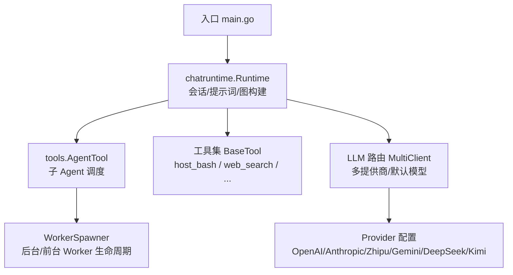
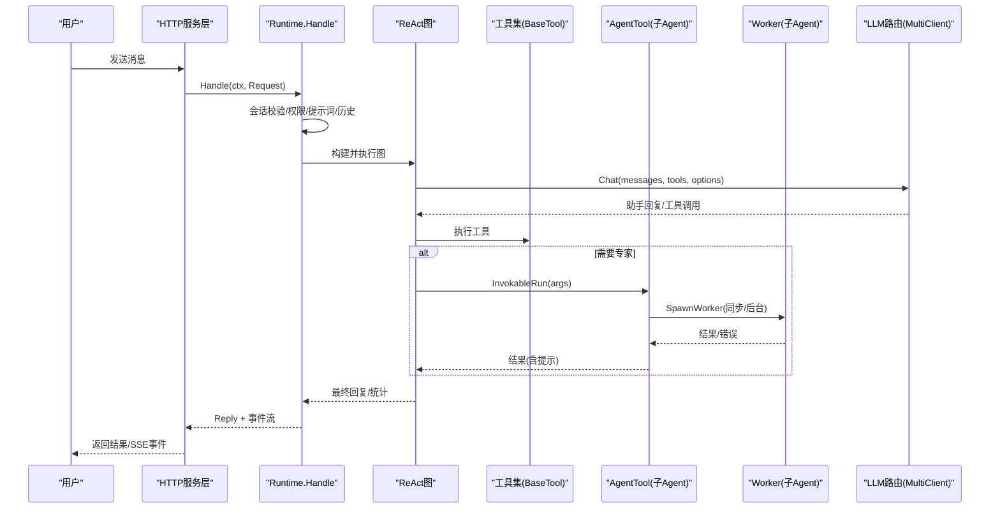
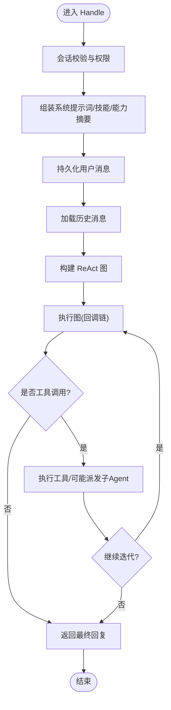
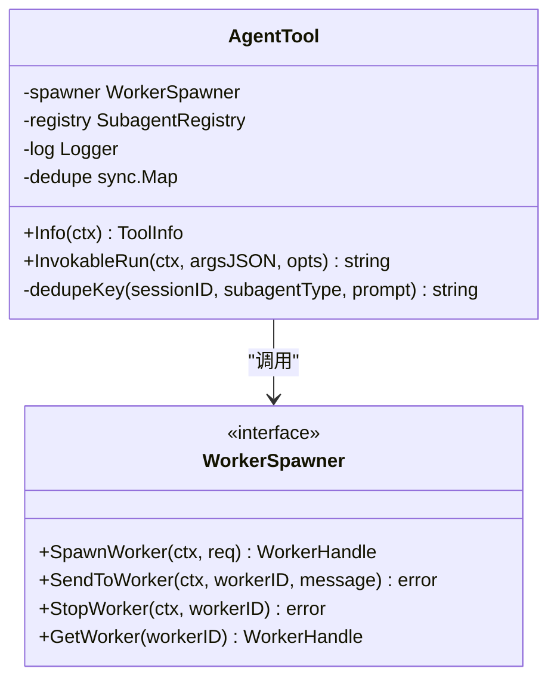
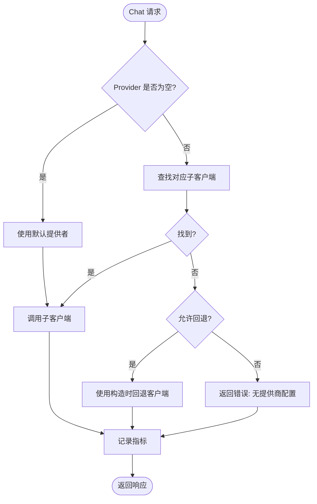
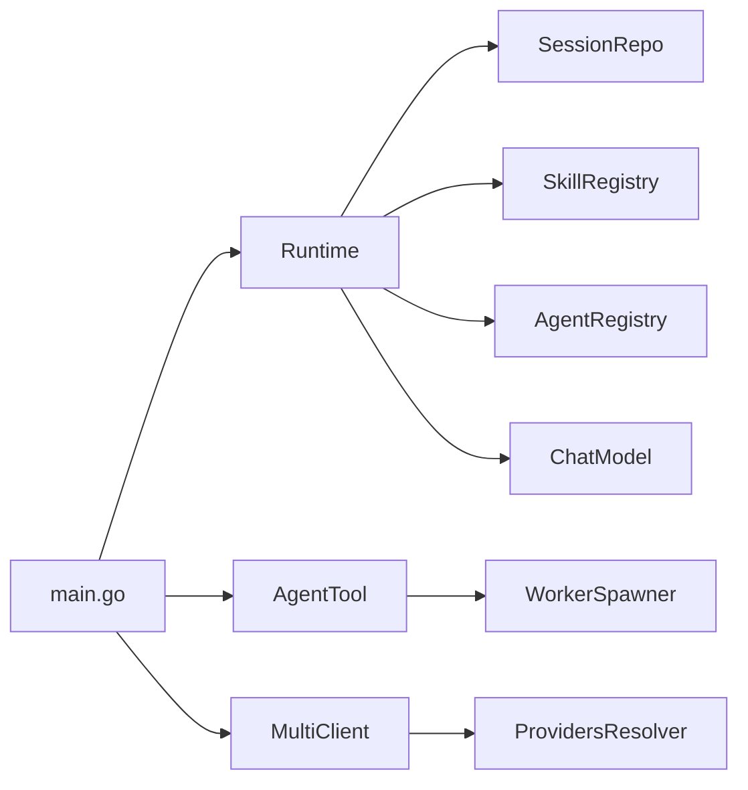

# Agent 协调器

<cite>
**本文引用的文件**
- [cmd/ongrid/main.go](file://cmd/ongrid/main.go)
- [internal/manager/biz/aiops/chatruntime/runtime.go](file://internal/manager/biz/aiops/chatruntime/runtime.go)
- [internal/manager/biz/aiops/tools/agent_tool.go](file://internal/manager/biz/aiops/tools/agent_tool.go)
- [internal/pkg/llm/router.go](file://internal/pkg/llm/router.go)
- [internal/pkg/llm/eino_routing.go](file://internal/pkg/llm/eino_routing.go)
- [internal/manager/biz/aiops/agent/agent.go](file://internal/manager/biz/aiops/agent/agent.go)
- [internal/edgeagent/biz/agent.go](file://internal/edgeagent/biz/agent.go)
</cite>

## 目录
1. [简介](#简介)
2. [项目结构](#项目结构)
3. [核心组件](#核心组件)
4. [架构总览](#架构总览)
5. [详细组件分析](#详细组件分析)
6. [依赖关系分析](#依赖关系分析)
7. [性能考量](#性能考量)
8. [故障排查指南](#故障排查指南)
9. [结论](#结论)
10. [附录](#附录)

## 简介
本技术文档聚焦于 Agent 协调器的设计与实现，围绕以下目标展开：
- 任务分发与会话管理：解释如何基于会话上下文进行消息路由、工具调用编排与状态同步。
- Agent 生命周期管理：从协调器到子 Agent（专家）的启动、运行、终止与结果回传。
- 多 Agent 协作模式：协调器如何通过工具将复杂问题拆解并分派给不同领域的专家 Agent。
- 负载均衡与故障转移：LLM 提供商路由、默认提供者选择与错误降级策略。
- 配置与使用：如何在主进程中注册自定义 Agent、装配工具集、设置模型选择策略。
- 监控与优化：关键指标、可观测性建议与性能调优方向。

## 项目结构
Agent 协调器位于管理器进程内，由入口程序组装运行时、工具集与 LLM 路由；协调器通过图式执行引擎驱动 ReAct 循环，并在需要时通过专用工具触发子 Agent 工作流。

图表来源
- [cmd/ongrid/main.go:1584-1596](file://cmd/ongrid/main.go#L1584-L1596)
- [internal/manager/biz/aiops/chatruntime/runtime.go:179-245](file://internal/manager/biz/aiops/chatruntime/runtime.go#L179-L245)
- [internal/manager/biz/aiops/tools/agent_tool.go:18-97](file://internal/manager/biz/aiops/tools/agent_tool.go#L18-L97)
- [internal/pkg/llm/router.go:30-87](file://internal/pkg/llm/router.go#L30-L87)

章节来源
- [cmd/ongrid/main.go:208-250](file://cmd/ongrid/main.go#L208-L250)
- [internal/manager/biz/aiops/chatruntime/runtime.go:1-36](file://internal/manager/biz/aiops/chatruntime/runtime.go#L1-L36)

## 核心组件
- chatruntime.Runtime：协调器运行时，负责会话校验、系统提示词组装、历史回放、图构建与回调链（持久化、SSE、审计、预算）。
- tools.AgentTool：协调器专用工具，用于派发子 Agent 任务，具备去重与提示引导，避免重复派活。
- llm.MultiClient：多提供商路由，支持动态解析与缓存，提供默认提供者选择与每请求覆盖。
- agent.Agent（旧内核）：兼容路径，保留事件形态与 SSE 协议一致性。
- edgeagent.Agent：边缘侧 Agent 心跳与注册恢复机制，保障连接稳定性。

章节来源
- [internal/manager/biz/aiops/chatruntime/runtime.go:179-245](file://internal/manager/biz/aiops/chatruntime/runtime.go#L179-L245)
- [internal/manager/biz/aiops/tools/agent_tool.go:99-163](file://internal/manager/biz/aiops/tools/agent_tool.go#L99-L163)
- [internal/pkg/llm/router.go:61-129](file://internal/pkg/llm/router.go#L61-L129)
- [internal/manager/biz/aiops/agent/agent.go:1-15](file://internal/manager/biz/aiops/agent/agent.go#L1-L15)
- [internal/edgeagent/biz/agent.go:530-558](file://internal/edgeagent/biz/agent.go#L530-L558)

## 架构总览
协调器以“会话为中心”组织一次用户请求的生命周期：
- 会话校验与权限控制：按用户 ID 校验所有权，结合角色与写操作开关裁剪工具集。
- 系统提示词与技能装配：根据会话绑定的 Agent 人格、活跃技能与全局基础提示词生成系统提示。
- 历史回放与消息持久化：先持久化用户消息，再加载历史，保证崩溃恢复一致性。
- 图构建与回调链：构建 ReAct 图，注入回调处理持久化、SSE 流式输出、审计与预算限制。
- 工具调用与子 Agent 派发：协调器在必要时调用 AgentTool 派发专家任务，等待结果或异步通知。
- LLM 路由与模型选择：每请求可指定 Provider/Model，未指定则走默认提供者与默认模型。

图表来源
- [internal/manager/biz/aiops/chatruntime/runtime.go:516-800](file://internal/manager/biz/aiops/chatruntime/runtime.go#L516-L800)
- [internal/manager/biz/aiops/tools/agent_tool.go:228-317](file://internal/manager/biz/aiops/tools/agent_tool.go#L228-L317)
- [internal/pkg/llm/router.go:274-329](file://internal/pkg/llm/router.go#L274-L329)

## 详细组件分析

### 协调器运行时（chatruntime.Runtime）
职责与流程：
- 会话与权限：校验 Session 归属，按角色与写开关裁剪工具集，确保只读视图不可调用写工具。
- 提示词与技能：根据会话 Agent 人格、活跃技能与基础提示词组合系统提示，附加能力摘要与专家目录。
- 历史与消息：先持久化用户消息，再加载历史，保证异常恢复后对话一致。
- 图构建与回调：构建 ReAct 图，注入回调链完成持久化、SSE 流式输出、审计与预算控制。
- 动态提示与边界：计算动态提示，限制最大迭代次数，防止无限循环。
- 工具过滤与上下文：将当前图可见的工具集注入上下文，供工具搜索与执行使用。

图表来源
- [internal/manager/biz/aiops/chatruntime/runtime.go:516-800](file://internal/manager/biz/aiops/chatruntime/runtime.go#L516-L800)

章节来源
- [internal/manager/biz/aiops/chatruntime/runtime.go:179-245](file://internal/manager/biz/aiops/chatruntime/runtime.go#L179-L245)
- [internal/manager/biz/aiops/chatruntime/runtime.go:516-800](file://internal/manager/biz/aiops/chatruntime/runtime.go#L516-L800)

### 子 Agent 派发工具（tools.AgentTool）
职责与特性：
- 参数校验与去重：校验 subagent_type 与 prompt，基于会话+类型+提示哈希进行短期去重，避免重复派活。
- 同步派发：默认同步模式，等待子 Agent 返回结果；若为后台模式，通过 SSE 推送 task_notification。
- 提示引导：每次返回附带自然语言提示，指导协调器整合证据而非重复调用。
- 注册表校验：可选校验 subagent_type 是否在已注册 Agent 列表中。

图表来源
- [internal/manager/biz/aiops/tools/agent_tool.go:18-97](file://internal/manager/biz/aiops/tools/agent_tool.go#L18-L97)
- [internal/manager/biz/aiops/tools/agent_tool.go:99-163](file://internal/manager/biz/aiops/tools/agent_tool.go#L99-L163)
- [internal/manager/biz/aiops/tools/agent_tool.go:228-317](file://internal/manager/biz/aiops/tools/agent_tool.go#L228-L317)

章节来源
- [internal/manager/biz/aiops/tools/agent_tool.go:99-163](file://internal/manager/biz/aiops/tools/agent_tool.go#L99-L163)
- [internal/manager/biz/aiops/tools/agent_tool.go:228-317](file://internal/manager/biz/aiops/tools/agent_tool.go#L228-L317)

### LLM 提供商路由与模型选择（llm.MultiClient）
职责与策略：
- 多提供商支持：OpenAI、Anthropic、Zhipu、Gemini、DeepSeek、Kimi，以及自定义 OpenAI 兼容端点。
- 动态解析与缓存：通过 ProvidersResolver 读取系统设置，60s TTL 缓存，管理员编辑即时生效。
- 默认提供者选择：未显式指定 Provider 时回退到默认提供者；若无默认，按字母序取首个可用提供者。
- 每请求覆盖：可在调用时传入 Provider/Model 选项，实现会话级模型选择。
- 指标与降级：记录调用状态（ok/timeout/rate_limited/error），便于仪表盘观察。

图表来源
- [internal/pkg/llm/router.go:274-329](file://internal/pkg/llm/router.go#L274-L329)
- [internal/pkg/llm/router.go:155-225](file://internal/pkg/llm/router.go#L155-L225)
- [internal/pkg/llm/eino_routing.go:38-76](file://internal/pkg/llm/eino_routing.go#L38-L76)

章节来源
- [internal/pkg/llm/router.go:61-129](file://internal/pkg/llm/router.go#L61-L129)
- [internal/pkg/llm/router.go:274-329](file://internal/pkg/llm/router.go#L274-L329)
- [internal/pkg/llm/eino_routing.go:38-76](file://internal/pkg/llm/eino_routing.go#L38-L76)

### 会话管理与消息路由
- 会话所有权：每个会话绑定用户 ID，非所有者访问返回未找到，避免信息泄露。
- 消息持久化顺序：先持久化用户消息，再加载历史，保证崩溃恢复一致性。
- 历史回放：将持久化的消息转换为 LLM 消息数组，保持 tool_calls 与 role=tool 的顺序正确。
- 事件流：assistant/tool/done/error/task_notification/approval_pending 等事件通过 SSE 推送前端。

章节来源
- [internal/manager/biz/aiops/chatruntime/runtime.go:516-800](file://internal/manager/biz/aiops/chatruntime/runtime.go#L516-L800)
- [internal/manager/biz/aiops/agent/agent.go:331-429](file://internal/manager/biz/aiops/agent/agent.go#L331-L429)

### 错误处理与故障转移
- 会话与权限错误：未找到会话或非所有者访问返回统一错误，避免指纹探测。
- LLM 路由错误：未配置提供商或未找到子客户端时返回明确错误；允许回退到构造时客户端。
- 工具执行超时：为每个工具调用设置超时，避免阻塞整个 Agent 循环。
- 边缘侧心跳与注册恢复：边缘 Agent 持续心跳，失败时重试注册，避免长期离线。

章节来源
- [internal/manager/biz/aiops/chatruntime/runtime.go:516-545](file://internal/manager/biz/aiops/chatruntime/runtime.go#L516-L545)
- [internal/pkg/llm/router.go:274-329](file://internal/pkg/llm/router.go#L274-L329)
- [internal/edgeagent/biz/agent.go:530-558](file://internal/edgeagent/biz/agent.go#L530-L558)

## 依赖关系分析
- 入口 main.go 负责装配 Runtime、工具集与 LLM 路由，并将协调器专用工具（AgentTool、SendMessageTool、TaskStopTool）追加到工具集中。
- Runtime 依赖 SessionRepo、SkillRegistry、AgentRegistry、ChatModel 与工具集，构建 ReAct 图并执行。
- AgentTool 通过 WorkerSpawner 接口与 Runtime 解耦，避免循环依赖。
- LLM 路由通过 ProvidersResolver 动态获取提供商配置，支持运行时更新。

图表来源
- [cmd/ongrid/main.go:1584-1596](file://cmd/ongrid/main.go#L1584-L1596)
- [internal/manager/biz/aiops/chatruntime/runtime.go:179-245](file://internal/manager/biz/aiops/chatruntime/runtime.go#L179-L245)
- [internal/manager/biz/aiops/tools/agent_tool.go:18-97](file://internal/manager/biz/aiops/tools/agent_tool.go#L18-L97)
- [internal/pkg/llm/router.go:51-87](file://internal/pkg/llm/router.go#L51-L87)

章节来源
- [cmd/ongrid/main.go:1584-1596](file://cmd/ongrid/main.go#L1584-L1596)
- [internal/manager/biz/aiops/chatruntime/runtime.go:179-245](file://internal/manager/biz/aiops/chatruntime/runtime.go#L179-L245)
- [internal/manager/biz/aiops/tools/agent_tool.go:18-97](file://internal/manager/biz/aiops/tools/agent_tool.go#L18-L97)
- [internal/pkg/llm/router.go:51-87](file://internal/pkg/llm/router.go#L51-L87)

## 性能考量
- 工具集裁剪：按角色与写开关过滤工具，减少 LLM 看到的工具数量，降低误用概率。
- 历史长度限制：HistoryLimit 控制回放消息数，避免上下文过大导致延迟上升。
- 迭代上限：MaxIterations 限制 ReAct 循环次数，防止无限工具调用。
- 去重机制：AgentTool 对相同任务的短期去重，避免重复派活。
- 提供商缓存：MultiClient 对动态解析结果进行 TTL 缓存，减少 DB 查询。
- 指标观测：记录 LLM 调用状态、耗时与 token 用量，便于定位瓶颈。

[本节为通用性能建议，不直接分析具体文件]

## 故障排查指南
- 会话访问被拒：检查 Session 是否存在且属于当前用户；非所有者访问会返回未找到。
- 工具调用失败：查看工具执行结果与错误信息，确认权限与设备可达性。
- LLM 路由错误：检查提供商配置是否有效，默认提供者是否正确；查看指标面板中的错误分类。
- 子 Agent 派发无效：确认 subagent_type 已注册，提示词完整；检查去重命中情况。
- 边缘侧连接不稳定：关注心跳与注册重试日志，确认网络与上游服务健康。

章节来源
- [internal/manager/biz/aiops/chatruntime/runtime.go:516-545](file://internal/manager/biz/aiops/chatruntime/runtime.go#L516-L545)
- [internal/manager/biz/aiops/tools/agent_tool.go:228-317](file://internal/manager/biz/aiops/tools/agent_tool.go#L228-L317)
- [internal/pkg/llm/router.go:274-329](file://internal/pkg/llm/router.go#L274-L329)
- [internal/edgeagent/biz/agent.go:530-558](file://internal/edgeagent/biz/agent.go#L530-L558)

## 结论
Agent 协调器以会话为核心，结合图式执行引擎与工具集，实现了灵活的任务分发与多 Agent 协作。通过 LLM 路由与动态提供商解析，系统支持多模型与实时配置更新。协调器内置权限控制、提示词装配、历史回放与事件流，确保一致性与可观测性。未来可进一步优化工具集缓存、图构建缓存与子 Agent 生命周期管理，以提升吞吐与稳定性。

[本节为总结，不直接分析具体文件]

## 附录

### 配置与使用示例（路径引用）
- 装配协调器与追加工具：参见入口程序中对 Runtime 的构建与 AppendToolBag 调用。
- 注册自定义 Agent：通过 AgentRegistry 注册新的人格与系统提示词，并在会话中绑定。
- 设置 LLM 提供商与默认模型：通过 ProvidersResolver 与系统设置行，支持运行时更新。
- 每请求模型选择：在 Request 中指定 Provider 与 Model，实现会话级切换。

章节来源
- [cmd/ongrid/main.go:1584-1596](file://cmd/ongrid/main.go#L1584-L1596)
- [internal/manager/biz/aiops/chatruntime/runtime.go:374-414](file://internal/manager/biz/aiops/chatruntime/runtime.go#L374-L414)
- [internal/pkg/llm/router.go:51-87](file://internal/pkg/llm/router.go#L51-L87)
- [internal/pkg/llm/router.go:274-329](file://internal/pkg/llm/router.go#L274-L329)