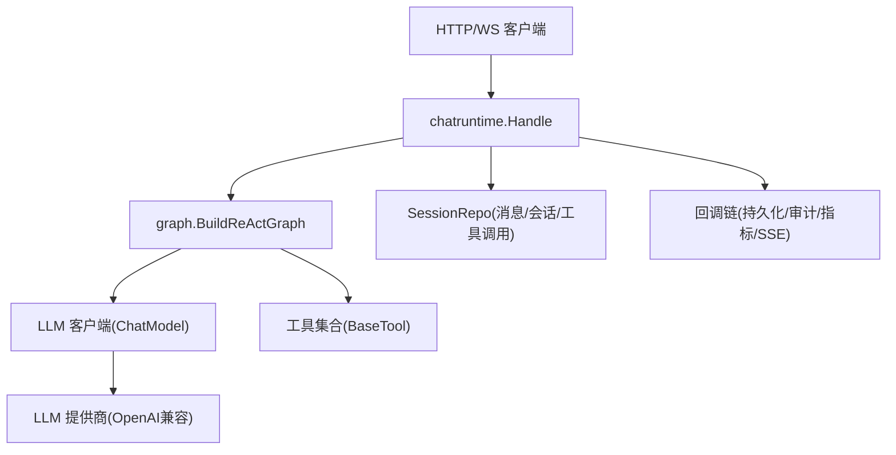
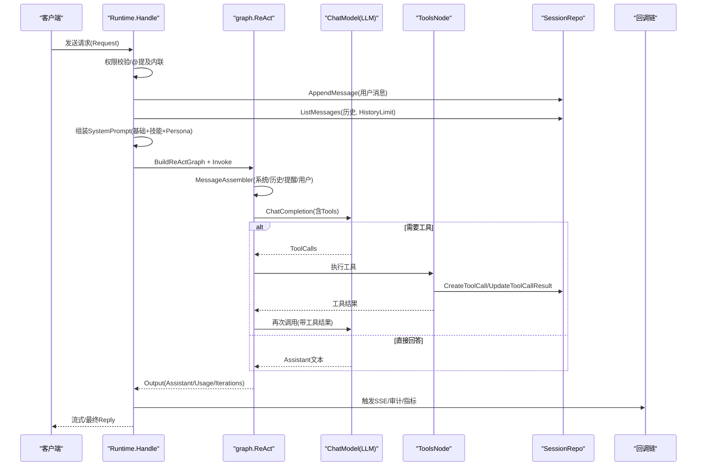
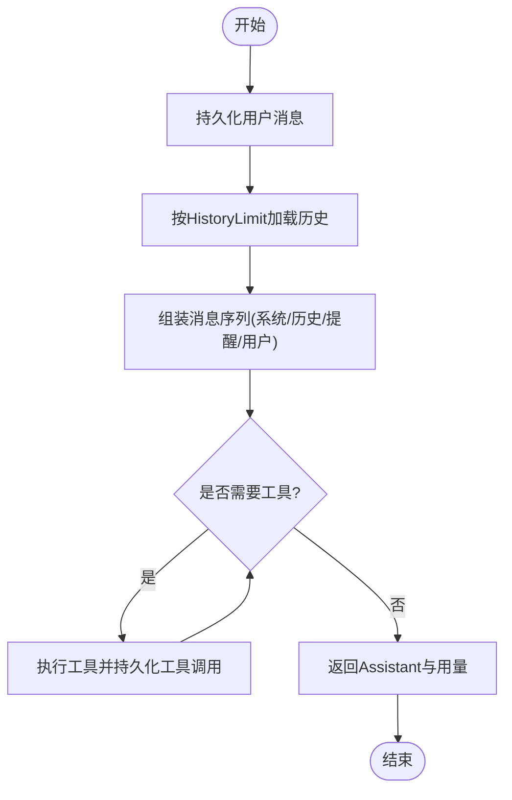
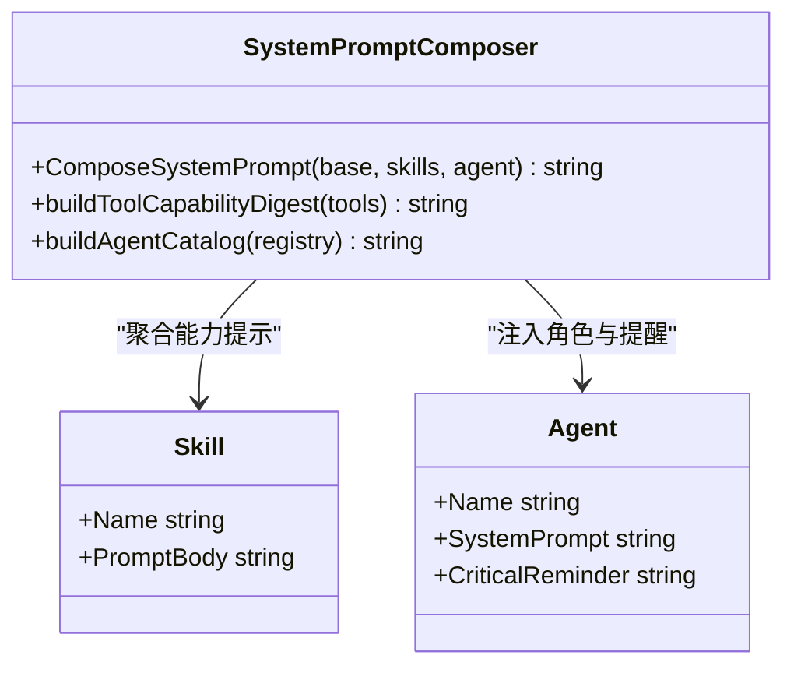
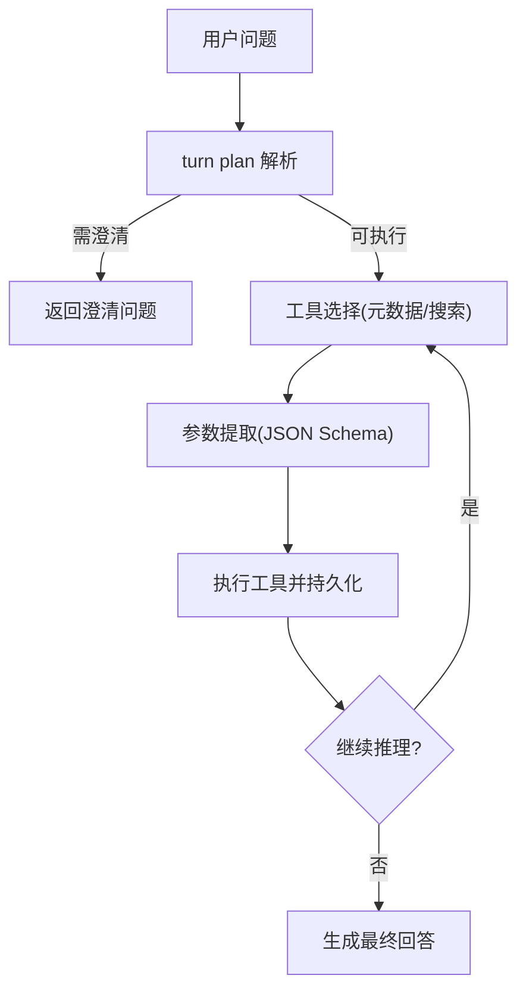
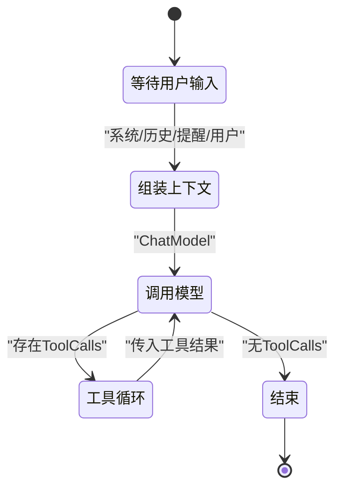
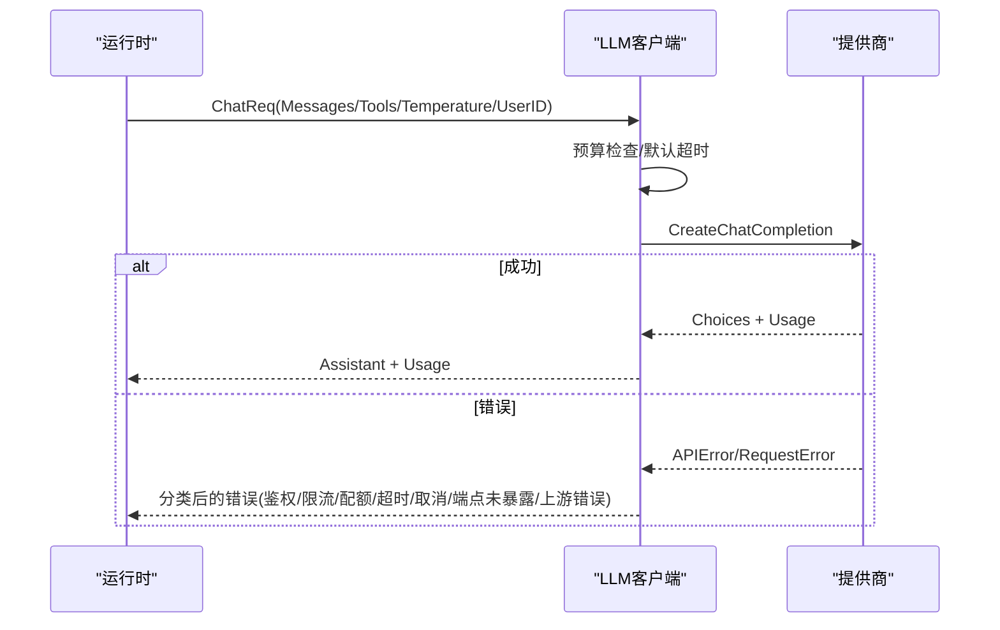
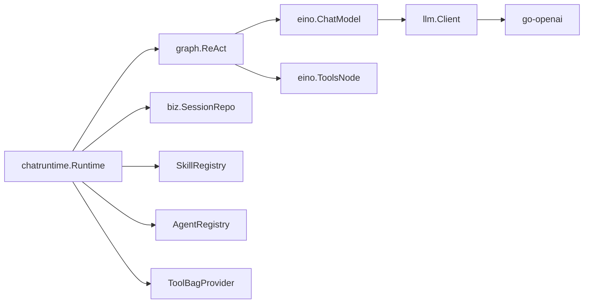

# 对话运行时

<cite>
**本文引用的文件**
- [runtime.go](file://internal/manager/biz/aiops/chatruntime/runtime.go)
- [system_prompt.go](file://internal/manager/biz/aiops/chatruntime/system_prompt.go)
- [react.go](file://internal/manager/biz/aiops/graph/react.go)
- [client.go](file://internal/pkg/llm/client.go)
- [tool_search_tool.go](file://internal/manager/biz/aiops/tools/tool_search_tool.go)
- [basetool.go](file://internal/manager/biz/aiops/tools/basetool/basetool.go)
- [session_test.go](file://internal/manager/data/aiops/store/session_test.go)
- [persistence_test.go](file://internal/manager/biz/aiops/graph/callbacks/persistence_test.go)
- [runtime_test.go](file://internal/manager/biz/aiops/chatruntime/runtime_test.go)
- [service_kernel_test.go](file://internal/manager/service/aiops/service_kernel_test.go)
- [llm_probe.go](file://internal/manager/biz/setting/llm_probe.go)
</cite>

## 目录
1. [简介](#简介)
2. [项目结构](#项目结构)
3. [核心组件](#核心组件)
4. [架构总览](#架构总览)
5. [详细组件分析](#详细组件分析)
6. [依赖关系分析](#依赖关系分析)
7. [性能考量](#性能考量)
8. [故障排查指南](#故障排查指南)
9. [结论](#结论)
10. [附录](#附录)

## 简介
本技术文档聚焦“对话运行时”的实现与使用，覆盖以下关键主题：
- 对话上下文维护：消息历史管理、上下文窗口控制、记忆存储策略
- 系统提示词管理与动态生成：角色定义、约束条件、环境信息注入
- 决策引擎：意图识别、工具选择、参数提取
- 对话流程控制：多轮对话、中断处理、状态恢复
- LLM 服务交互：请求构造、响应解析、错误处理
- 对话质量评估与用户反馈收集机制

该运行时基于图编排（ReAct）实现，将“系统提示词 + 技能能力 + 会话历史 + 每轮动态提醒”组装为模型输入，驱动工具调用闭环，并通过回调链完成持久化、审计、指标与预算控制。

## 项目结构
对话运行时的核心位于 manager 的 AIOps 子域，围绕 chatruntime、graph、tools、llm 等模块协作：
- chatruntime：单轮请求入口、权限与工具集裁剪、系统提示词组装、图构建与执行、事件流式输出
- graph：封装 eino ReAct 子图，负责消息组装、工具节点、迭代控制
- tools：工具注册、搜索、元数据描述（名称、描述、何时使用、参数 Schema）
- llm：OpenAI 兼容客户端，负责鉴权、超时、预算、指标、错误分类
- store/callbacks：会话/消息/工具调用的持久化与回写

图表来源
- [runtime.go:516-800](file://internal/manager/biz/aiops/chatruntime/runtime.go#L516-L800)
- [react.go:45-188](file://internal/manager/biz/aiops/graph/react.go#L45-L188)
- [client.go:387-507](file://internal/pkg/llm/client.go#L387-L507)

章节来源
- [runtime.go:1-800](file://internal/manager/biz/aiops/chatruntime/runtime.go#L1-L800)
- [react.go:1-188](file://internal/manager/biz/aiops/graph/react.go#L1-L188)

## 核心组件
- 运行时 Runtime：接收请求、权限校验、@提及内联、历史加载、系统提示词组装、图构建与执行、事件发射、回复翻译
- 图 Graph：MessageAssembler → ReActSubgraph → OutputProjector；内置未知工具处理、最大步数保护
- 工具系统：BaseTool 元数据（名称/描述/WhenToUse/Schema）、工具搜索 ToolSearchTool、按角色/Persona 过滤
- LLM 客户端：预算检查、默认超时、动态凭据解析、重试去采样参数、指标记录
- 持久化与回调：消息/工具调用行写入、SSE 流式事件、审计与指标

章节来源
- [runtime.go:149-245](file://internal/manager/biz/aiops/chatruntime/runtime.go#L149-L245)
- [react.go:18-188](file://internal/manager/biz/aiops/graph/react.go#L18-L188)
- [basetool.go:58-85](file://internal/manager/biz/aiops/tools/basetool/basetool.go#L58-L85)
- [tool_search_tool.go:125-157](file://internal/manager/biz/aiops/tools/tool_search_tool.go#L125-L157)
- [client.go:97-128](file://internal/pkg/llm/client.go#L97-L128)

## 架构总览
下图展示一次用户消息从进入运行到返回结果的完整链路，包括系统提示词组装、历史回放、工具调用循环、结果回写与 SSE 推送。

图表来源
- [runtime.go:516-800](file://internal/manager/biz/aiops/chatruntime/runtime.go#L516-L800)
- [react.go:137-188](file://internal/manager/biz/aiops/graph/react.go#L137-L188)
- [persistence_test.go:116-148](file://internal/manager/biz/aiops/graph/callbacks/persistence_test.go#L116-L148)

## 详细组件分析

### 对话上下文维护：消息历史、上下文窗口、记忆存储
- 历史加载与窗口控制
  - 每次请求先持久化用户消息，再按 HistoryLimit 加载历史（默认 50），避免重复回放最新一轮
  - 历史在 MessageAssembler 中按顺序回放，确保模型看到一致的上下文
- 记忆存储策略
  - 会话、消息、工具调用通过 SessionRepo 持久化；测试用例展示了创建会话、追加消息、查询消息、更新工具调用结果的生命周期
  - 回调链支持同步工具持久化，保证工具结果可靠落库
- @提及内联
  - 将 @-mention 解析为 Markdown 要点并前置到用户内容，保持与旧内核一致的历史回放语义

图表来源
- [runtime.go:561-578](file://internal/manager/biz/aiops/chatruntime/runtime.go#L561-L578)
- [react.go:190-248](file://internal/manager/biz/aiops/graph/react.go#L190-L248)
- [session_test.go:101-119](file://internal/manager/data/aiops/store/session_test.go#L101-L119)
- [persistence_test.go:116-148](file://internal/manager/biz/aiops/graph/callbacks/persistence_test.go#L116-L148)

章节来源
- [runtime.go:516-800](file://internal/manager/biz/aiops/chatruntime/runtime.go#L516-L800)
- [session_test.go:89-119](file://internal/manager/data/aiops/store/session_test.go#L89-L119)
- [persistence_test.go:1-168](file://internal/manager/biz/aiops/graph/callbacks/persistence_test.go#L1-L168)

### 系统提示词管理与动态生成
- 分层组装
  - 基础提示词（BasePrompt）
  - 协调器路由规则（仅对协调器生效）
  - Persona 的系统提示与关键提醒（CriticalReminder）
  - 激活技能的提示体（[能力: xxx] 标题 + PromptBody）
- 动态能力摘要
  - 根据当前可见工具集生成“本轮可见能力”，包含来源、类别、简要描述，限制条目数量，避免过长
- 每轮反漂移提醒
  - 在用户消息前注入 <system-reminder> 块，包含语言指令、web_search 开关、失败重试策略、迭代次数阈值等
- 语言指令
  - 根据 Locale 注入英文或中文回复指令，贯穿系统提示与提醒块

图表来源
- [system_prompt.go:37-91](file://internal/manager/biz/aiops/chatruntime/system_prompt.go#L37-L91)
- [system_prompt.go:93-199](file://internal/manager/biz/aiops/chatruntime/system_prompt.go#L93-L199)
- [system_prompt.go:237-276](file://internal/manager/biz/aiops/chatruntime/system_prompt.go#L237-L276)
- [react.go:250-355](file://internal/manager/biz/aiops/graph/react.go#L250-L355)

章节来源
- [system_prompt.go:1-276](file://internal/manager/biz/aiops/chatruntime/system_prompt.go#L1-L276)
- [react.go:190-355](file://internal/manager/biz/aiops/graph/react.go#L190-L355)

### 决策引擎：意图识别、工具选择、参数提取
- 意图识别与澄清
  - 在调用 LLM 之前进行 turn plan 解析，必要时直接返回澄清问题，避免无效工具调用
- 工具选择
  - 工具集由 Persona 与角色权限共同裁剪（viewer 只读、全局写操作门控）
  - 工具元数据包含 WhenToUse 用于消歧；ToolSearchTool 支持按 query 精确匹配或关键词扫描，返回稳定 JSON
- 参数提取
  - 工具参数以 JSON Schema 声明，模型在工具调用时生成参数；工具实现侧按需反序列化
  - 工具搜索要求 query 必填，空查询会报错，促使模型补全参数

图表来源
- [runtime.go:582-595](file://internal/manager/biz/aiops/chatruntime/runtime.go#L582-L595)
- [tool_search_tool.go:125-157](file://internal/manager/biz/aiops/tools/tool_search_tool.go#L125-L157)
- [basetool.go:58-85](file://internal/manager/biz/aiops/tools/basetool/basetool.go#L58-L85)

章节来源
- [runtime.go:582-800](file://internal/manager/biz/aiops/chatruntime/runtime.go#L582-L800)
- [tool_search_tool.go:125-157](file://internal/manager/biz/aiops/tools/tool_search_tool.go#L125-L157)
- [basetool.go:58-85](file://internal/manager/biz/aiops/tools/basetool/basetool.go#L58-L85)

### 对话流程控制：多轮、中断、状态恢复
- 多轮对话
  - ReAct 子图内部循环：ChatModel ↔ Branch(tool_calls?) ↔ ToolsNode，直到无工具调用或达到 MaxIterations
  - 外层 wrapper 图提供 MessageAssembler 与 OutputProjector，统一输入输出形态
- 中断处理
  - 超时与取消：LLM 客户端在未设置 deadline 时应用默认超时；context 取消会传播至网络层
  - 工具未知处理：当模型请求了不在当前工具集中的工具，UnknownToolsHandler 返回友好提示，避免整轮崩溃
- 状态恢复
  - 用户消息先持久化，即使下游崩溃也能保证历史一致性
  - 工具调用生命周期：CreateToolCall → UpdateToolCallResult（成功/错误/超时），支持 FinalizePendingToolCalls 清理挂起任务

图表来源
- [react.go:45-188](file://internal/manager/biz/aiops/graph/react.go#L45-L188)
- [persistence_test.go:124-148](file://internal/manager/biz/aiops/graph/callbacks/persistence_test.go#L124-L148)

章节来源
- [react.go:45-188](file://internal/manager/biz/aiops/graph/react.go#L45-L188)
- [persistence_test.go:1-168](file://internal/manager/biz/aiops/graph/callbacks/persistence_test.go#L1-L168)

### 与 LLM 服务的交互模式：请求构造、响应解析、错误处理
- 请求构造
  - 将内部 Message 转换为 OpenAI 兼容请求；自动处理 Reasoning 模型的采样参数（temperature/top_p/n/penalties）
  - 支持 BaseURL 归一化（自动补 /v1），适配 Ollama/LM Studio/vLLM 等
  - Zhipu 特殊处理：自定义 HTTP Transport 重写 Authorization 为 JWT
- 响应解析
  - 将 Choices 中的 assistant 消息与 ToolCalls 映射回内部结构；统计 Usage（prompt/completion/total tokens）
- 错误处理
  - 预算超限：在请求前估算 token 并拦截
  - 网络/鉴权/限流/配额/模型不存在/端点未暴露/超时/取消等错误分类
  - 针对推理模型拒绝采样参数的情况，自动去除采样参数并重试一次

图表来源
- [client.go:387-507](file://internal/pkg/llm/client.go#L387-L507)
- [client.go:509-568](file://internal/pkg/llm/client.go#L509-L568)
- [llm_probe.go:382-453](file://internal/manager/biz/setting/llm_probe.go#L382-L453)

章节来源
- [client.go:1-732](file://internal/pkg/llm/client.go#L1-L732)
- [llm_probe.go:382-453](file://internal/manager/biz/setting/llm_probe.go#L382-L453)

### 对话质量评估与用户反馈收集
- 质量信号
  - 迭代次数与工具调用次数：Output.Iterations 与工具调用行数可作为复杂度与稳定性指标
  - 工具失败率与连续失败提示：动态提醒中包含“同一工具失败两次请换思路”
  - 预算与配额：预算检查与配额/限流错误分类有助于评估可用性
- 用户反馈
  - SSE 事件流：assistant/tool/done/error 等事件可用于前端渲染与埋点
  - 错误消息本地化：将上游错误转译为友好的中文提示，便于用户理解与截图反馈

章节来源
- [react.go:110-130](file://internal/manager/biz/aiops/graph/types.go#L110-L130)
- [runtime.go:78-147](file://internal/manager/biz/aiops/chatruntime/runtime.go#L78-L147)
- [runtime.go:1728-1754](file://internal/manager/biz/aiops/chatruntime/runtime.go#L1728-L1754)

## 依赖关系分析
- 松耦合设计
  - Runtime 通过接口依赖 SessionRepo、SkillRegistry、AgentRegistry、ToolBagProvider、MentionResolver、CredentialBinder，便于替换与扩展
  - Graph 与 Tools 解耦：工具通过 Info(ctx) 暴露 Schema，图在编译期装配
  - LLM 客户端封装提供商差异，对外暴露统一 Chat 接口
- 潜在循环依赖规避
  - chatruntime 不直接导入 tools 包，而是通过 ToolBagProvider 接口，避免 cmd 侧装配时的循环
- 外部依赖
  - eino 框架：ReAct 子图、回调机制、工具节点
  - OpenAI SDK：聊天补全、工具调用、错误类型
  - Prometheus：指标采集（请求时长、token 用量、成功率）

图表来源
- [runtime.go:279-304](file://internal/manager/biz/aiops/chatruntime/runtime.go#L279-L304)
- [react.go:78-188](file://internal/manager/biz/aiops/graph/react.go#L78-L188)
- [client.go:125-128](file://internal/pkg/llm/client.go#L125-L128)

章节来源
- [runtime.go:279-514](file://internal/manager/biz/aiops/chatruntime/runtime.go#L279-L514)
- [react.go:78-188](file://internal/manager/biz/aiops/graph/react.go#L78-L188)
- [client.go:125-128](file://internal/pkg/llm/client.go#L125-L128)

## 性能考量
- 默认超时与预算
  - 未设置 deadline 的请求默认 120s，避免长时间阻塞；预算检查在请求前估算 token，减少无效调用
- 工具集裁剪
  - 按角色与 Persona 过滤工具，减少模型可选空间，降低幻觉与无效调用
- 图步骤上限
  - 外层 MaxRunSteps 与内层 MaxStep 配合，防止无限循环；MaxIterations 经换算后对应 ChatModel 调用次数
- 缓存与复用
  - LLM 客户端按 (apiKey, baseURL) 缓存 SDK 实例；Resolver 结果 TTL 缓存，降低配置读取开销

章节来源
- [client.go:37-45](file://internal/pkg/llm/client.go#L37-L45)
- [client.go:130-161](file://internal/pkg/llm/client.go#L130-L161)
- [client.go:222-250](file://internal/pkg/llm/client.go#L222-L250)
- [react.go:111-123](file://internal/manager/biz/aiops/graph/react.go#L111-L123)

## 故障排查指南
- 常见问题定位
  - 鉴权失败/模型不存在/端点未暴露/限流/配额不足：通过错误分类快速判断配置或账户问题
  - 超时/取消：检查上下文 deadline 与网络状况
  - 工具不可用：确认工具是否在 Persona/角色允许范围内；UnknownToolsHandler 会给出提示
- 日志与指标
  - LLM 客户端记录请求时长、token 用量、工具调用次数；Prometheus 指标可用于监控
  - 回调链支持审计与 SSE 事件，便于追踪工具执行与异常
- 建议操作
  - 检查 Provider 配置（API Key/BaseURL/模型名）
  - 调整 HistoryLimit 与 MaxIterations 平衡上下文长度与成本
  - 启用 WebSearch 或关闭，依据业务需求

章节来源
- [llm_probe.go:382-453](file://internal/manager/biz/setting/llm_probe.go#L382-L453)
- [client.go:449-507](file://internal/pkg/llm/client.go#L449-L507)
- [react.go:101-110](file://internal/manager/biz/aiops/graph/react.go#L101-L110)

## 结论
该对话运行时通过图编排实现了稳定的多轮对话与工具调用闭环，结合系统提示词分层组装、动态能力摘要与每轮反漂移提醒，有效提升了长会话的一致性与可控性。权限与 Persona 驱动的工具体系确保了安全与专注度；LLM 客户端提供了健壮的鉴权、超时、预算与错误处理能力。整体架构清晰、可扩展性强，适合在生产环境中承载复杂的 AI 运维对话场景。

## 附录
- 术语
  - 协调器（Coordinator）：顶层会话，负责总体调度与最终答复
  - 专家（Worker/Persona）：特定领域的工作会话，受限于工具集与提醒
  - 技能（Skill）：可插拔的能力描述，影响系统提示词与工具可见性
- 最佳实践
  - 合理设置 HistoryLimit 与 MaxIterations，避免上下文溢出与过度迭代
  - 明确 Persona 的工具白名单，减少无关工具干扰
  - 使用 ToolSearch 辅助模型选择合适工具，提高准确率
  - 关注预算与配额，结合指标与日志优化成本与稳定性