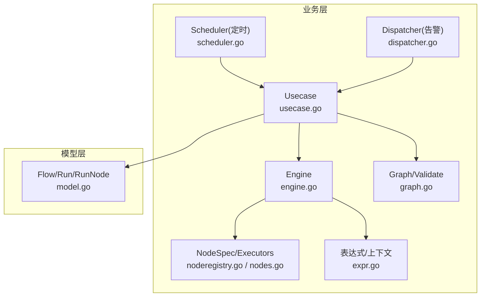
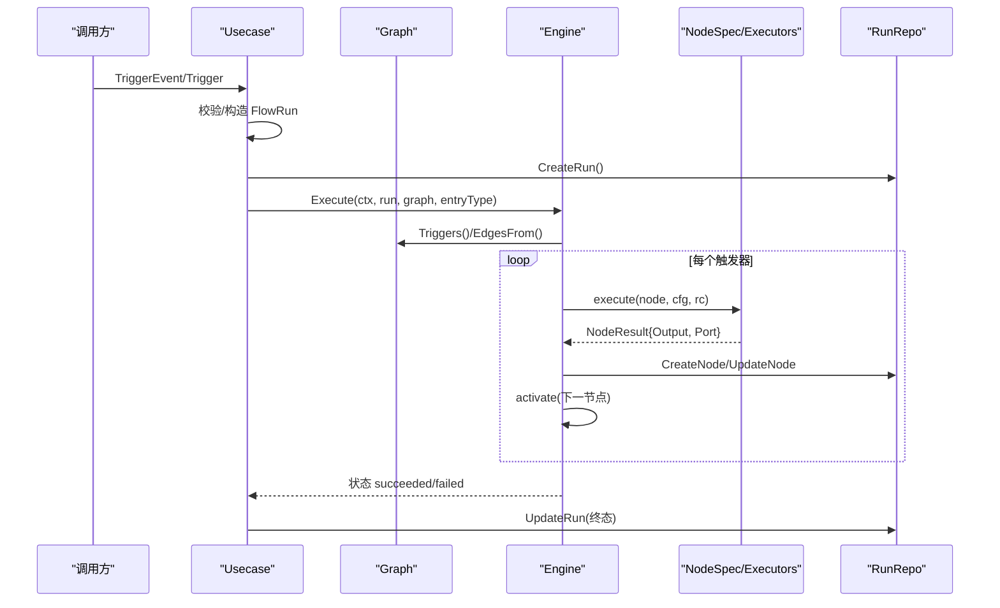
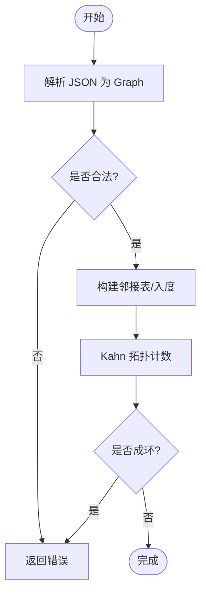
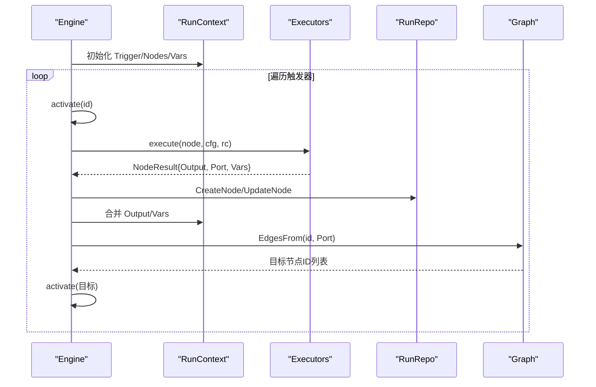
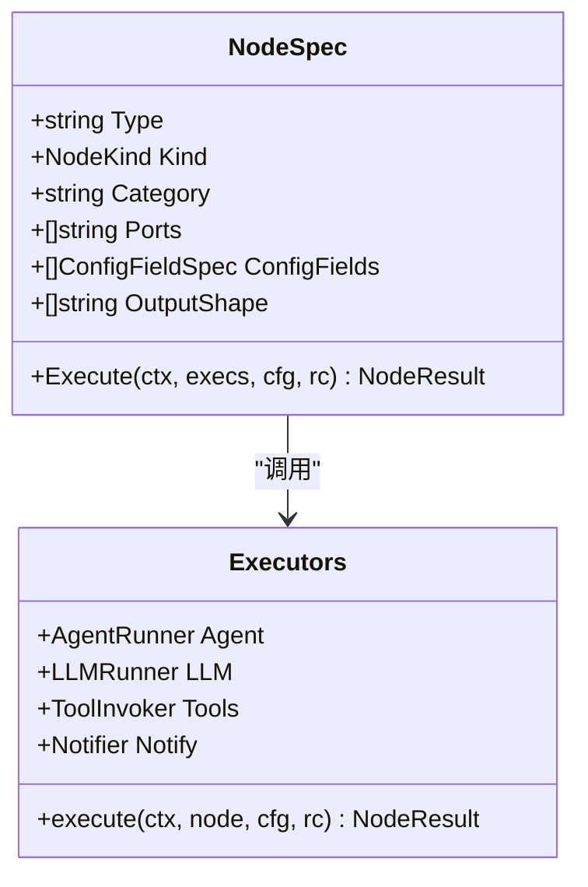
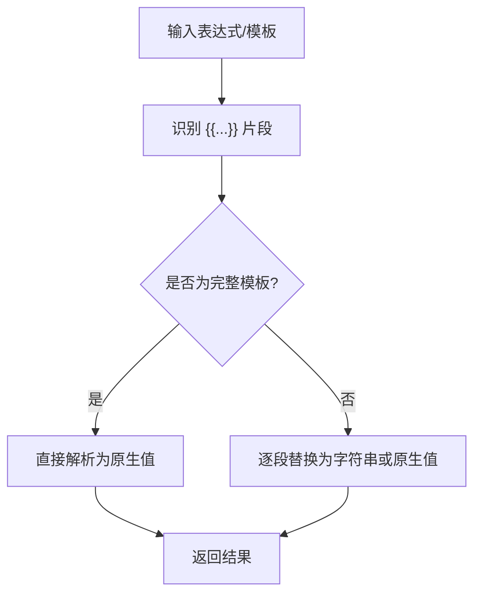
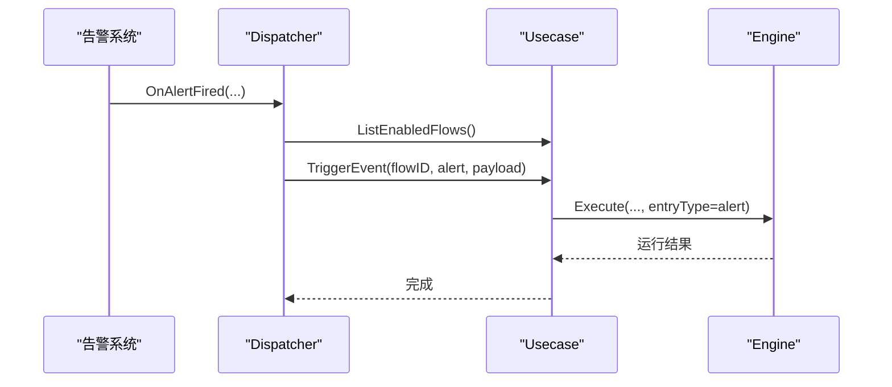
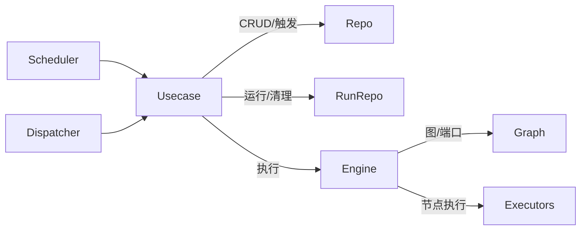

# 工作流引擎

<cite>
**本文引用的文件**
- [engine.go](file://internal/manager/biz/flow/engine.go)
- [graph.go](file://internal/manager/biz/flow/graph.go)
- [nodes.go](file://internal/manager/biz/flow/nodes.go)
- [noderegistry.go](file://internal/manager/biz/flow/noderegistry.go)
- [scheduler.go](file://internal/manager/biz/flow/scheduler.go)
- [dispatcher.go](file://internal/manager/biz/flow/dispatcher.go)
- [usecase.go](file://internal/manager/biz/flow/usecase.go)
- [expr.go](file://internal/manager/biz/flow/expr.go)
- [model.go](file://internal/manager/model/flow/model.go)
- [workflow-catalog.md](file://docs/workflow-catalog.md)
- [workflow_test.go](file://tests/e2e/workflow_test.go)
</cite>

## 目录
1. [简介](#简介)
2. [项目结构](#项目结构)
3. [核心组件](#核心组件)
4. [架构总览](#架构总览)
5. [详细组件分析](#详细组件分析)
6. [依赖关系分析](#依赖关系分析)
7. [性能与并发](#性能与并发)
8. [故障排查指南](#故障排查指南)
9. [结论](#结论)
10. [附录：开发指南与最佳实践](#附录：开发指南与最佳实践)

## 简介
本工作流引擎以“触发器 → 节点”的可视化 DAG 为核心，支持手动、定时、告警三类触发方式；节点类型涵盖工具调用、Agent、LLM、条件分支、通知、变量设置与字段转换等。数据通过运行上下文在节点间传递，边仅承载控制流（next/true/false/error）。引擎具备执行计划构建、并行执行限制、错误端口处理、版本化快照与历史清理能力，并提供单节点试跑与端到端测试用例。

## 项目结构
工作流相关代码集中在 internal/manager/biz/flow 与 internal/manager/model/flow，辅以 docs/workflow-catalog.md 的能力目录与 tests/e2e/workflow_test.go 的端到端验证。

**图表来源**
- [usecase.go:179-343](file://internal/manager/biz/flow/usecase.go#L179-L343)
- [engine.go:67-113](file://internal/manager/biz/flow/engine.go#L67-L113)
- [graph.go:97-187](file://internal/manager/biz/flow/graph.go#L97-L187)
- [noderegistry.go:93-197](file://internal/manager/biz/flow/noderegistry.go#L93-L197)
- [scheduler.go:44-130](file://internal/manager/biz/flow/scheduler.go#L44-L130)
- [dispatcher.go:38-81](file://internal/manager/biz/flow/dispatcher.go#L38-L81)
- [expr.go:14-23](file://internal/manager/biz/flow/expr.go#L14-L23)
- [model.go:54-118](file://internal/manager/model/flow/model.go#L54-L118)

**章节来源**
- [usecase.go:179-343](file://internal/manager/biz/flow/usecase.go#L179-L343)
- [engine.go:67-113](file://internal/manager/biz/flow/engine.go#L67-L113)
- [graph.go:97-187](file://internal/manager/biz/flow/graph.go#L97-L187)
- [noderegistry.go:93-197](file://internal/manager/biz/flow/noderegistry.go#L93-L197)
- [scheduler.go:44-130](file://internal/manager/biz/flow/scheduler.go#L44-L130)
- [dispatcher.go:38-81](file://internal/manager/biz/flow/dispatcher.go#L38-L81)
- [expr.go:14-23](file://internal/manager/biz/flow/expr.go#L14-L23)
- [model.go:54-118](file://internal/manager/model/flow/model.go#L54-L118)

## 核心组件
- 图与校验：定义节点类型、边、端口与图结构，提供解析与循环检测。
- 执行引擎：从触发器启动，按边扇出执行，维护执行一次语义与并发上限。
- 节点注册表：声明式注册节点类型、端口、配置表单与执行函数。
- 调度器：定时触发（cron）扫描并触发匹配流程。
- 分发器：告警事件驱动，匹配规则后触发流程。
- 用例编排：创建/更新/启用/删除流程，触发运行，查询运行与节点结果，清理历史。
- 表达式与上下文：模板解析 {{trigger.*}}/{{nodes.<id>.output.*}}/{{vars.*}} 与条件表达式求值。
- 数据模型：Flow、FlowRun、FlowRunNode 的状态机与持久化契约。

**章节来源**
- [graph.go:24-76](file://internal/manager/biz/flow/graph.go#L24-L76)
- [engine.go:34-113](file://internal/manager/biz/flow/engine.go#L34-L113)
- [noderegistry.go:18-86](file://internal/manager/biz/flow/noderegistry.go#L18-L86)
- [scheduler.go:20-41](file://internal/manager/biz/flow/scheduler.go#L20-L41)
- [dispatcher.go:20-33](file://internal/manager/biz/flow/dispatcher.go#L20-L33)
- [usecase.go:23-65](file://internal/manager/biz/flow/usecase.go#L23-L65)
- [expr.go:14-23](file://internal/manager/biz/flow/expr.go#L14-L23)
- [model.go:29-118](file://internal/manager/model/flow/model.go#L29-L118)

## 架构总览
工作流由“触发器→节点”的有向无环图构成。引擎在每次运行时重新解析并校验图，保证即使手工修改数据库行也不会导致执行崩溃。执行采用“OR-join + execute-once”策略：任一入边到达即首次执行该节点，后续激活视为空操作；未连接 error 口的节点错误将标记运行失败，已连接的 error 口则继续下游处理。

**图表来源**
- [usecase.go:264-343](file://internal/manager/biz/flow/usecase.go#L264-L343)
- [engine.go:67-113](file://internal/manager/biz/flow/engine.go#L67-L113)
- [graph.go:189-213](file://internal/manager/biz/flow/graph.go#L189-L213)
- [nodes.go:77-86](file://internal/manager/biz/flow/nodes.go#L77-L86)

## 详细组件分析

### 图与 DAG 构建算法
- 节点类型常量与端口约定：触发器、工具、Agent、LLM、条件、通知、变量、字段映射、HTTP 请求；控制端口 next/true/false/error。
- 解析与校验：
  - 唯一且合法的节点 ID；已知类型；边引用存在；禁止指向触发器的入边；端口合法性检查。
  - 使用 Kahn 算法进行拓扑排序检测环。
- 辅助方法：Triggers()、EdgesFrom(id, port)。

**图表来源**
- [graph.go:97-187](file://internal/manager/biz/flow/graph.go#L97-L187)

**章节来源**
- [graph.go:24-76](file://internal/manager/biz/flow/graph.go#L24-L76)
- [graph.go:97-187](file://internal/manager/biz/flow/graph.go#L97-L187)

### 执行引擎与并发控制
- 入口 Execute：选择匹配的触发器集合，初始化运行上下文、执行记录与并发信号量。
- 激活与执行：activate 负责去重与并发限流（最大并发节点数），runNode 负责：
  - 解析配置模板（受锁保护）
  - 持久化节点运行行（输入/输出/状态/端口）
  - 调用 Executors.execute 执行具体节点
  - 根据结果写入上下文与输出，沿边激活下游
  - 错误处理：若无 error 口则标记运行失败；若有 error 口则将错误写入上下文并继续下游
- 恢复与健壮性：goroutine 级 recover 捕获 panic，避免进程崩溃。

**图表来源**
- [engine.go:67-113](file://internal/manager/biz/flow/engine.go#L67-L113)
- [engine.go:161-260](file://internal/manager/biz/flow/engine.go#L161-L260)
- [nodes.go:77-86](file://internal/manager/biz/flow/nodes.go#L77-L86)

**章节来源**
- [engine.go:34-113](file://internal/manager/biz/flow/engine.go#L34-L113)
- [engine.go:115-260](file://internal/manager/biz/flow/engine.go#L115-L260)

### 节点类型与实现
- 触发器：manual/alert_fired/cron，统一输出 trigger payload。
- Agent：可带 persona/instruction/output_schema，结构化输出经解析后注入 structured 字段。
- LLM：单次对话，支持 system/prompt/output_schema。
- Tool：按名称调用工具，参数来自 BaseTool schema；非 JSON 输出保持字符串。
- Condition：表达式求值，输出 true/false 端口。
- Notify：发送通知消息到配置的渠道。
- Set：设置全局变量（通过 Vars 写回）。
- Transform：字段映射，重组上游数据。
- HTTP Request：发起外部 HTTP 请求，支持超时与动态头/体。

**图表来源**
- [noderegistry.go:18-61](file://internal/manager/biz/flow/noderegistry.go#L18-L61)
- [nodes.go:47-86](file://internal/manager/biz/flow/nodes.go#L47-L86)

**章节来源**
- [noderegistry.go:93-197](file://internal/manager/biz/flow/noderegistry.go#L93-L197)
- [nodes.go:17-86](file://internal/manager/biz/flow/nodes.go#L17-L86)
- [nodes.go:201-371](file://internal/manager/biz/flow/noderegistry.go#L201-L371)

### 表达式与上下文
- 运行上下文 RunContext：包含 Trigger、Nodes、Vars。
- 模板解析 ResolveString/ResolveValue：支持 {{trigger.x}}、{{nodes.<id>.output.<path>}}、{{vars.<name>}}，整串模板保留原生类型。
- 路径查找 lookup：支持对象键与数组下标，如 result.results[0].host_load.cpu_pct。
- 条件表达式 EvalCondition：支持 ==、!=、>、>=、<、<=、contains，以及裸表达式的真值判断。

**图表来源**
- [expr.go:27-84](file://internal/manager/biz/flow/expr.go#L27-L84)
- [expr.go:86-139](file://internal/manager/biz/flow/expr.go#L86-L139)
- [expr.go:183-206](file://internal/manager/biz/flow/expr.go#L183-L206)

**章节来源**
- [expr.go:14-23](file://internal/manager/biz/flow/expr.go#L14-L23)
- [expr.go:27-84](file://internal/manager/biz/flow/expr.go#L27-L84)
- [expr.go:86-139](file://internal/manager/biz/flow/expr.go#L86-L139)
- [expr.go:183-206](file://internal/manager/biz/flow/expr.go#L183-L206)

### 触发器与调度
- 手动触发：通过 API 传入 input，作为 {{trigger.*}}。
- 告警触发：当新事件产生时，Dispatcher 扫描所有启用的流程，匹配 rule/min_severity 后触发。
- 定时触发：Scheduler 每 30 秒扫描启用的流程，解析 cron 表达式，计算下次触发时间并在到期时触发。

**图表来源**
- [dispatcher.go:38-81](file://internal/manager/biz/flow/dispatcher.go#L38-L81)
- [usecase.go:264-343](file://internal/manager/biz/flow/usecase.go#L264-L343)
- [engine.go:67-113](file://internal/manager/biz/flow/engine.go#L67-L113)

**章节来源**
- [dispatcher.go:38-81](file://internal/manager/biz/flow/dispatcher.go#L38-L81)
- [scheduler.go:44-130](file://internal/manager/biz/flow/scheduler.go#L44-L130)
- [usecase.go:264-343](file://internal/manager/biz/flow/usecase.go#L264-L343)

### 状态持久化、恢复与版本管理
- Flow 版本：每次图变更递增 Version，运行快照 FlowVersion，避免旧运行被新图影响。
- 运行状态机：pending → running → succeeded/failed/canceled；重启时扫描并修复残留 running/pending。
- 节点运行记录：保存输入/输出/端口/错误/时间戳，用于查看与调试。
- 历史清理：按保留天数定期清理已完成的历史运行。

**章节来源**
- [model.go:29-118](file://internal/manager/model/flow/model.go#L29-L118)
- [usecase.go:372-409](file://internal/manager/biz/flow/usecase.go#L372-L409)

## 依赖关系分析
- 模块内耦合：
  - Engine 依赖 Graph、Executors、RunRepo；Executors 通过接口解耦 Agent/LLM/Tools/Notify。
  - Usecase 聚合 Repo、RunRepo、Engine，对外暴露 CRUD、触发、查询与清理。
  - Scheduler/Dispatcher 通过 Usecase 触发运行，不直接访问 Engine。
- 外部依赖：
  - cron 表达式解析（robfig/cron）
  - UUID 生成（google/uuid）
  - 日志（log/slog）
  - 数据库（gorm）

**图表来源**
- [usecase.go:23-65](file://internal/manager/biz/flow/usecase.go#L23-L65)
- [engine.go:34-47](file://internal/manager/biz/flow/engine.go#L34-L47)
- [scheduler.go:25-41](file://internal/manager/biz/flow/scheduler.go#L25-L41)
- [dispatcher.go:20-33](file://internal/manager/biz/flow/dispatcher.go#L20-L33)

**章节来源**
- [usecase.go:23-65](file://internal/manager/biz/flow/usecase.go#L23-L65)
- [engine.go:34-47](file://internal/manager/biz/flow/engine.go#L34-L47)
- [scheduler.go:25-41](file://internal/manager/biz/flow/scheduler.go#L25-L41)
- [dispatcher.go:20-33](file://internal/manager/biz/flow/dispatcher.go#L20-L33)

## 性能与并发
- 并发控制：最大并发节点数限制（默认 4），防止宽图引发资源耗尽。
- 超时策略：普通节点 2 分钟，Agent 节点 15 分钟，LLM 节点 3 分钟。
- 执行计划：基于图的边与端口进行扇出，无需显式 merge；OR-join 避免死锁。
- I/O 分离：配置模板解析在锁内快速完成，实际执行（Agent/工具/HTTP）在锁外进行。
- 历史清理：后台定时任务按保留期清理历史运行，降低存储压力。

**章节来源**
- [engine.go:30-33](file://internal/manager/biz/flow/engine.go#L30-L33)
- [nodes.go:68-75](file://internal/manager/biz/flow/nodes.go#L68-L75)
- [scheduler.go:51-69](file://internal/manager/biz/flow/scheduler.go#L51-L69)
- [usecase.go:388-409](file://internal/manager/biz/flow/usecase.go#L388-L409)

## 故障排查指南
- 常见错误定位：
  - 未知节点类型/端口：检查节点注册表与边端口合法性。
  - 表达式错误：确认模板路径是否存在、数组索引越界、根路径类型正确。
  - 工具不可用：确保工具注册与权限；写类工具不支持单节点试跑。
  - 运行卡住：检查外部依赖（如 Pod 日志需 Running、metrics-server 可用）。
- 恢复机制：
  - 服务重启后，残留 running/pending 会被标记为 failed。
  - 历史运行按保留期自动清理。
- 调试建议：
  - 使用“单节点试跑”验证节点输出形状与模板解析。
  - 查看 FlowRunNode 的 InputJSON/OutputJSON/FiredPort/Error 字段定位问题。

**章节来源**
- [graph.go:117-187](file://internal/manager/biz/flow/graph.go#L117-L187)
- [expr.go:86-139](file://internal/manager/biz/flow/expr.go#L86-L139)
- [usecase.go:185-221](file://internal/manager/biz/flow/usecase.go#L185-L221)
- [usecase.go:372-386](file://internal/manager/biz/flow/usecase.go#L372-L386)
- [workflow-catalog.md:113-132](file://docs/workflow-catalog.md#L113-L132)

## 结论
该工作流引擎以声明式节点注册与图校验为基础，结合 OR-join 与 execute-once 的执行语义，提供了稳定可控的 DAG 执行能力。通过触发器扩展（手动/告警/定时）、丰富的节点类型与表达式系统，满足多种自动化场景。配合版本化、历史清理与健壮的恢复机制，适合在生产环境中长期运行。

## 附录：开发指南与最佳实践

### DSL 语法与节点开发
- 图格式：nodes（含 id/type/config/position）+ edges（source/target/sourcePort）。
- 节点类型：通过 RegisterNode 声明 Type、Kind、Category、Ports、ConfigFields、OutputShape 与 Execute。
- 表达式：使用 {{trigger.*}}、{{nodes.<id>.output.<path>}}、{{vars.<name>}}；条件表达式支持比较与 contains。
- 端口约定：next/true/false/error；条件节点显式输出 true/false。

**章节来源**
- [graph.go:24-76](file://internal/manager/biz/flow/graph.go#L24-L76)
- [noderegistry.go:18-86](file://internal/manager/biz/flow/noderegistry.go#L18-L86)
- [expr.go:27-84](file://internal/manager/biz/flow/expr.go#L27-L84)
- [expr.go:183-206](file://internal/manager/biz/flow/expr.go#L183-L206)

### 节点开发与调试
- 单节点试跑：通过 TestNode 接口在不触发副作用的情况下验证输出形状与模板解析。
- 安全限制：通知与写类工具不允许单节点试跑，需在完整流程中执行。
- 调试信息：关注 FlowRunNode 的 InputJSON/OutputJSON/FiredPort/Error 与运行状态。

**章节来源**
- [usecase.go:185-221](file://internal/manager/biz/flow/usecase.go#L185-L221)
- [usecase.go:223-253](file://internal/manager/biz/flow/usecase.go#L223-L253)

### 监控与告警
- 日志：关键路径（触发、执行、错误、清理）均记录 slog 日志，便于追踪。
- 指标：可在上层接入 Prometheus 指标（如运行时长、成功率、错误率）。
- 告警：结合告警触发器，对异常运行或外部依赖失败进行通知。

**章节来源**
- [engine.go:67-74](file://internal/manager/biz/flow/engine.go#L67-L74)
- [engine.go:139-154](file://internal/manager/biz/flow/engine.go#L139-L154)
- [scheduler.go:71-118](file://internal/manager/biz/flow/scheduler.go#L71-L118)
- [dispatcher.go:45-81](file://internal/manager/biz/flow/dispatcher.go#L45-L81)

### 端到端示例
- e2e 测试覆盖了节点类型目录、工具目录、流程 CRUD、单节点试跑与完整运行，可作为参考样例。

**章节来源**
- [workflow_test.go:26-135](file://tests/e2e/workflow_test.go#L26-L135)
- [workflow-catalog.md:97-132](file://docs/workflow-catalog.md#L97-L132)