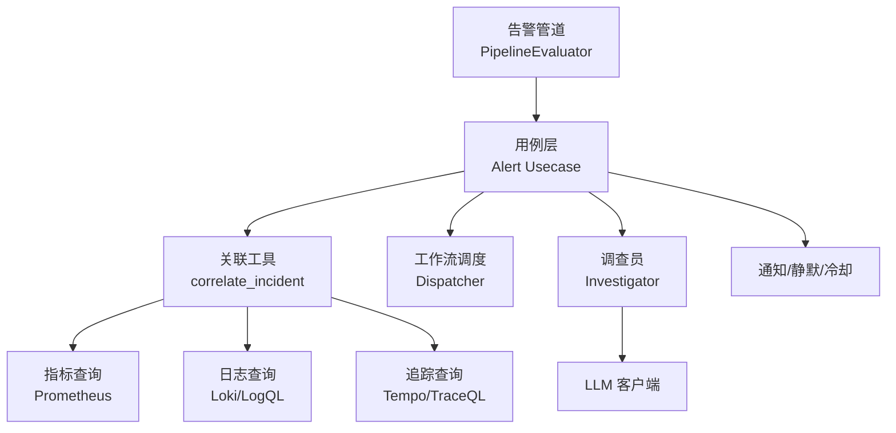
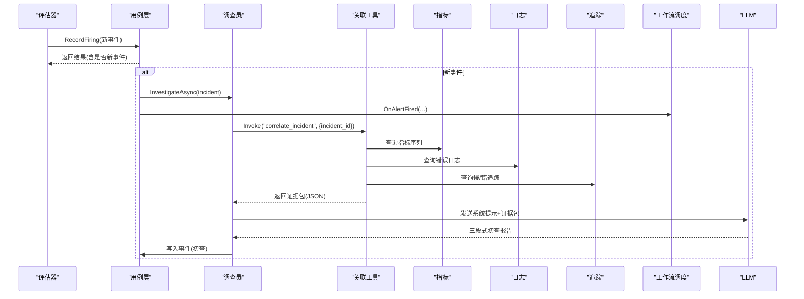
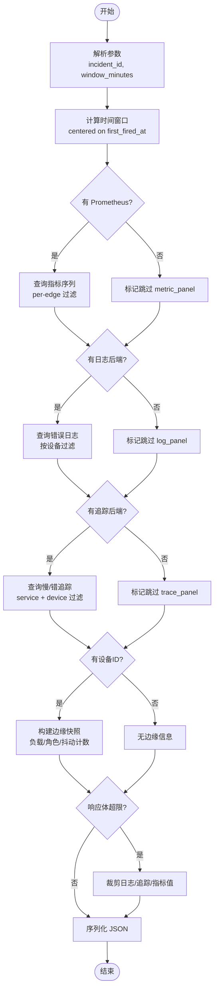
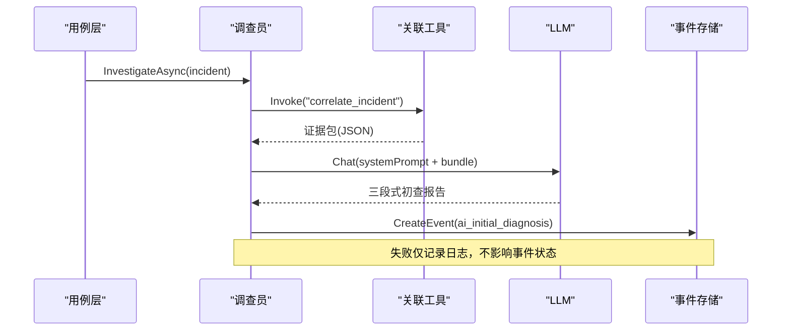
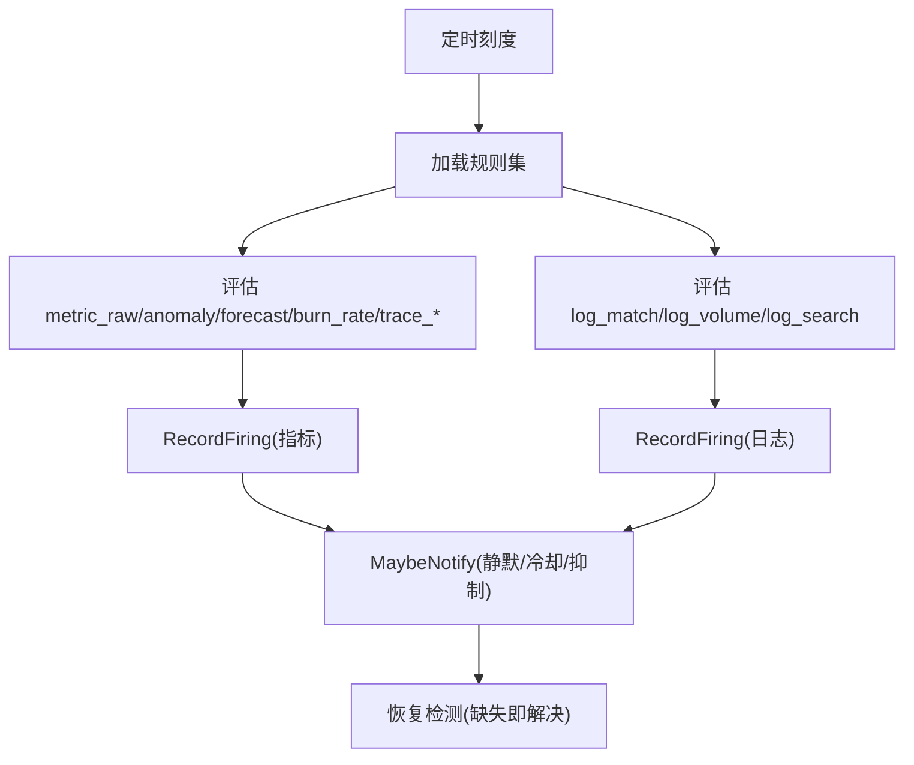
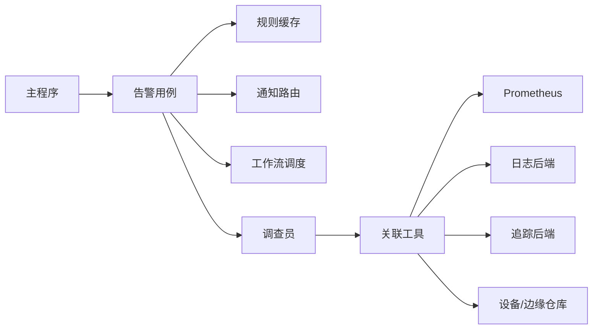

# 事件关联工具

<cite>
**本文引用的文件**
- [README.md](file://README.md)
- [correlate_incident.go](file://internal/manager/biz/aiops/tools/correlate_incident.go)
- [investigator.go](file://internal/manager/biz/aiops/investigator/investigator.go)
- [incident-investigator.md](file://agents/incident-investigator.md)
- [usecase.go](file://internal/manager/biz/alert/usecase.go)
- [pipeline.go](file://internal/manager/biz/alert/pipeline.go)
- [dispatcher.go](file://internal/manager/biz/flow/dispatcher.go)
- [main.go](file://cmd/ongrid/main.go)
</cite>

## 目录
1. [简介](#简介)
2. [项目结构](#项目结构)
3. [核心组件](#核心组件)
4. [架构总览](#架构总览)
5. [详细组件分析](#详细组件分析)
6. [依赖关系分析](#依赖关系分析)
7. [性能考量](#性能考量)
8. [故障排查指南](#故障排查指南)
9. [结论](#结论)
10. [附录](#附录)

## 简介
本技术文档面向“事件关联工具”，聚焦多源数据（指标、日志、追踪、拓扑与变更）的统一关联视图，以及告警驱动的根因分析自动化流程。系统通过“关联工具”将一次告警在时间窗口内拉取指标序列、错误日志、慢/错链路追踪和边缘设备快照，形成结构化证据包；随后由“调查员”以单轮大模型推理输出初查报告，并持久化为事件时间线的一部分。同时，告警触发可自动启动工作流进行处置或协同。

## 项目结构
围绕事件关联的关键代码分布在以下模块：
- AIOPS 工具层：提供 correlate_incident 等复合工具，聚合多源数据。
- AIOPS 调查员：后台异步发起 LLM 推理，产出初查报告。
- 告警域：负责事件生命周期、规则评估、通知与静默、冷却策略。
- 工作流调度：基于 trigger.alert_fired 将告警事件分发到工作流执行。
- 启动装配：主程序组装各子系统与依赖。

**图表来源**
- [pipeline.go:172-224](file://internal/manager/biz/alert/pipeline.go#L172-L224)
- [usecase.go:349-513](file://internal/manager/biz/alert/usecase.go#L349-L513)
- [correlate_incident.go:158-300](file://internal/manager/biz/aiops/tools/correlate_incident.go#L158-L300)
- [dispatcher.go:35-81](file://internal/manager/biz/flow/dispatcher.go#L35-L81)
- [investigator.go:166-293](file://internal/manager/biz/aiops/investigator/investigator.go#L166-L293)

**章节来源**
- [README.md:43-56](file://README.md#L43-L56)
- [pipeline.go:172-224](file://internal/manager/biz/alert/pipeline.go#L172-L224)
- [usecase.go:349-513](file://internal/manager/biz/alert/usecase.go#L349-L513)
- [dispatcher.go:35-81](file://internal/manager/biz/flow/dispatcher.go#L35-L81)
- [investigator.go:166-293](file://internal/manager/biz/aiops/investigator/investigator.go#L166-L293)

## 核心组件
- 关联工具 correlate_incident：以 incident_id 为中心，按时间窗口聚合指标、日志、追踪与边缘快照，返回统一 JSON 证据包，供 LLM 一次性推理。
- 调查员 Investigator：在告警首次产生时异步调用关联工具，将结果连同固定提示词发送给 LLM，生成三段式初查报告并写入事件时间线。
- 告警用例 Usecase：管理事件创建、重开、静默、通知、冷却、重复抑制，并在首次新建事件时触发调查员与工作流。
- 管道评估器 PipelineEvaluator：周期性扫描规则（PromQL/日志匹配/搜索等），将命中项转化为事件记录，驱动后续通知与自动化。
- 工作流调度 Dispatcher：监听 alert_fired 事件，匹配工作流触发条件后异步启动工作流运行。

**章节来源**
- [correlate_incident.go:23-68](file://internal/manager/biz/aiops/tools/correlate_incident.go#L23-L68)
- [investigator.go:62-104](file://internal/manager/biz/aiops/investigator/investigator.go#L62-L104)
- [usecase.go:121-139](file://internal/manager/biz/alert/usecase.go#L121-L139)
- [pipeline.go:96-170](file://internal/manager/biz/alert/pipeline.go#L96-L170)
- [dispatcher.go:20-43](file://internal/manager/biz/flow/dispatcher.go#L20-L43)

## 架构总览
事件从规则评估进入用例层，若为新事件则并行触发两项非阻塞动作：
- 调查员：拉取关联数据并调用 LLM 生成初查报告，写入事件时间线。
- 工作流调度：根据规则名与严重级别匹配工作流，异步启动处置流程。

**图表来源**
- [usecase.go:476-504](file://internal/manager/biz/alert/usecase.go#L476-L504)
- [investigator.go:227-293](file://internal/manager/biz/aiops/investigator/investigator.go#L227-L293)
- [correlate_incident.go:158-300](file://internal/manager/biz/aiops/tools/correlate_incident.go#L158-L300)
- [dispatcher.go:35-81](file://internal/manager/biz/flow/dispatcher.go#L35-L81)

## 详细组件分析

### 关联工具 correlate_incident
职责
- 接收 incident_id 与可选时间窗口，计算中心对称窗口。
- 拉取指标面板（Prometheus）、日志面板（Loki/后端适配）、追踪面板（Tempo/TraceQL）与边缘快照。
- 对响应体做大小裁剪，避免撑爆 LLM 上下文。
- 返回稳定结构的 JSON 证据包，包含 incident/window/metric_panel/log_panel/trace_panel/edge/skipped/truncated。

关键实现要点
- 指标表达式推导：根据 incident 的 rule_key/labels/annotations 推断 closed-set 指标名称，构造 per-edge 过滤的 PromQL 范围查询，并按幅度选取 Top 3 系列。
- 日志查询：按设备维度检索 error/panic/oom/fatal/fail 等关键字，限制条数并排序。
- 追踪查询：基于 service 标签与设备 ID 过滤，提取 traceID、rootServiceName、durationMs 等关键字段。
- 边缘快照：获取 edge 基本信息、当前负载（CPU/Mem/Up）与近 24h 告警抖动计数。
- 响应裁剪：超过阈值先压缩日志，再压缩追踪，最后丢弃指标值仅保留标签，并在 truncated 中记录被裁剪情况。

复杂度与性能
- 指标查询：O(N) 解析矩阵结果，Top-K 排序 K≤3。
- 日志/追踪：受限于 limit（日志 50、追踪 20），整体 O(L+T)。
- 超时控制：整体工具调用设置上限，子查询各自短超时，避免上游慢导致整体阻塞。

**图表来源**
- [correlate_incident.go:158-300](file://internal/manager/biz/aiops/tools/correlate_incident.go#L158-L300)
- [correlate_incident.go:302-374](file://internal/manager/biz/aiops/tools/correlate_incident.go#L302-L374)
- [correlate_incident.go:376-448](file://internal/manager/biz/aiops/tools/correlate_incident.go#L376-L448)
- [correlate_incident.go:542-595](file://internal/manager/biz/aiops/tools/correlate_incident.go#L542-L595)
- [correlate_incident.go:597-678](file://internal/manager/biz/aiops/tools/correlate_incident.go#L597-L678)
- [correlate_incident.go:705-755](file://internal/manager/biz/aiops/tools/correlate_incident.go#L705-L755)

**章节来源**
- [correlate_incident.go:23-68](file://internal/manager/biz/aiops/tools/correlate_incident.go#L23-L68)
- [correlate_incident.go:158-300](file://internal/manager/biz/aiops/tools/correlate_incident.go#L158-L300)
- [correlate_incident.go:302-374](file://internal/manager/biz/aiops/tools/correlate_incident.go#L302-L374)
- [correlate_incident.go:376-448](file://internal/manager/biz/aiops/tools/correlate_incident.go#L376-L448)
- [correlate_incident.go:542-595](file://internal/manager/biz/aiops/tools/correlate_incident.go#L542-L595)
- [correlate_incident.go:597-678](file://internal/manager/biz/aiops/tools/correlate_incident.go#L597-L678)
- [correlate_incident.go:705-755](file://internal/manager/biz/aiops/tools/correlate_incident.go#L705-L755)

### 调查员 Investigator（主动式根因分析）
职责
- 在告警首次产生时，异步调用关联工具收集证据包。
- 使用固定中文系统提示词，要求 LLM 输出三段式初查报告（定性、可能根因、立即可执行步骤）。
- 将 LLM 回复作为 system 事件写入事件时间线，便于前端展示。

处理流程
- 入队：非阻塞，队列满时丢弃并记录警告，确保告警路径不被拖慢。
- 执行：独立上下文与超时，解耦于请求上下文。
- 失败模式：任何阶段失败均记录日志并退出，不改变事件状态。

**图表来源**
- [investigator.go:166-293](file://internal/manager/biz/aiops/investigator/investigator.go#L166-L293)
- [investigator.go:295-329](file://internal/manager/biz/aiops/investigator/investigator.go#L295-L329)

**章节来源**
- [investigator.go:1-32](file://internal/manager/biz/aiops/investigator/investigator.go#L1-L32)
- [investigator.go:62-104](file://internal/manager/biz/aiops/investigator/investigator.go#L62-L104)
- [investigator.go:166-293](file://internal/manager/biz/aiops/investigator/investigator.go#L166-L293)
- [investigator.go:295-329](file://internal/manager/biz/aiops/investigator/investigator.go#L295-L329)

### 告警用例与管道评估器
职责
- 用例层：事件创建/重开/静默/通知/冷却/重复抑制；在新事件时触发调查员与工作流。
- 管道评估器：周期扫描规则（metric_raw、log_match、log_volume、log_search、trace_*），将命中转为事件，并驱动通知与恢复。

关键点
- 去重键：基于 scope/device/rule 组合，支持自定义覆盖。
- 恢复机制：上一周期存在而本周期消失的 dedupe key，系统自动解决事件。
- 通知策略：静默、冷却、抑制共同作用，仅影响通知，不影响事件记录。

**图表来源**
- [pipeline.go:172-224](file://internal/manager/biz/alert/pipeline.go#L172-L224)
- [pipeline.go:282-408](file://internal/manager/biz/alert/pipeline.go#L282-L408)
- [pipeline.go:410-454](file://internal/manager/biz/alert/pipeline.go#L410-L454)
- [usecase.go:349-513](file://internal/manager/biz/alert/usecase.go#L349-L513)

**章节来源**
- [pipeline.go:96-170](file://internal/manager/biz/alert/pipeline.go#L96-L170)
- [pipeline.go:172-224](file://internal/manager/biz/alert/pipeline.go#L172-L224)
- [pipeline.go:282-408](file://internal/manager/biz/alert/pipeline.go#L282-L408)
- [pipeline.go:410-454](file://internal/manager/biz/alert/pipeline.go#L410-L454)
- [usecase.go:349-513](file://internal/manager/biz/alert/usecase.go#L349-L513)

### 工作流调度（自动处置入口）
职责
- 监听 alert_fired 事件，匹配工作流触发条件（规则名、最小严重级别），异步启动工作流运行。
- 将 incident_id、rule、severity、edge/device、labels、fired_at 作为触发上下文注入工作流。

特点
- 非阻塞：OnAlertFired 立即返回，内部 goroutine 执行匹配与触发。
- 幂等：每个工作流在每个告警仅触发一次。

**章节来源**
- [dispatcher.go:20-43](file://internal/manager/biz/flow/dispatcher.go#L20-L43)
- [dispatcher.go:45-81](file://internal/manager/biz/flow/dispatcher.go#L45-L81)
- [dispatcher.go:83-109](file://internal/manager/biz/flow/dispatcher.go#L83-L109)

### 人员与智能体协作
- 调查员智能体（incident-investigator）：具备读取 incident、关联信号、拓扑与变更的能力，限定只读权限，禁止危险操作。
- 协调者：在用户提问或告警场景下分派调查员 worker，产出因果链与置信度。

**章节来源**
- [incident-investigator.md:1-46](file://agents/incident-investigator.md#L1-L46)

## 依赖关系分析
- 关联工具对外部数据源的依赖：
  - Prometheus：指标查询（QueryRange/Instant）。
  - Loki/日志后端：日志查询（LogQL/后端适配）。
  - Tempo/追踪后端：追踪搜索（TraceQL/OTLP 形状）。
  - 设备/边缘仓库：边缘快照与角色信息。
- 用例层依赖：
  - 规则提供者：缓存规则集，定期刷新。
  - 通知路由：通道选择、静默、冷却、抑制。
  - 工作流调度：alert_fired 触发。
  - 调查员：可选，未配置时不启用。
- 启动装配：
  - 主程序初始化告警仓库、规则缓存、通道解析器、抑制器、管道评估器，并注入各依赖。

**图表来源**
- [main.go:972-1001](file://cmd/ongrid/main.go#L972-L1001)
- [usecase.go:80-119](file://internal/manager/biz/alert/usecase.go#L80-L119)
- [pipeline.go:63-94](file://internal/manager/biz/alert/pipeline.go#L63-L94)
- [correlate_incident.go:70-84](file://internal/manager/biz/aiops/tools/correlate_incident.go#L70-L84)

**章节来源**
- [main.go:972-1001](file://cmd/ongrid/main.go#L972-L1001)
- [usecase.go:80-119](file://internal/manager/biz/alert/usecase.go#L80-L119)
- [pipeline.go:63-94](file://internal/manager/biz/alert/pipeline.go#L63-L94)
- [correlate_incident.go:70-84](file://internal/manager/biz/aiops/tools/correlate_incident.go#L70-L84)

## 性能考量
- 超时与限流
  - 关联工具整体超时与子查询短超时，防止上游慢导致阻塞。
  - 调查员队列深度与并发 Worker 数量可调，队列满时丢弃并告警，保障告警路径不受影响。
- 数据裁剪
  - 关联工具对响应体进行字节级裁剪，优先压缩日志与追踪，必要时丢弃指标值，保证 LLM 上下文安全。
  - 调查员对用户消息长度二次裁剪，附加截断标记。
- 评估周期
  - 管道评估器默认间隔与冷却时间可配置，减少频繁告警风暴。
- 资源隔离
  - 调查员使用独立上下文与超时，与请求上下文解耦，避免长尾影响。

[本节为通用指导，无需特定文件引用]

## 故障排查指南
常见问题与定位建议
- 关联工具部分面板为空或被跳过
  - 检查 skipped 字段说明（如“prom query failed”“log query client not configured”“no service label on incident”）。
  - 确认对应后端已配置且可达（Prom/Loki/Tempo）。
- 调查员未产出初查报告
  - 检查队列是否已满（backlog full 日志）。
  - 检查 LLM 是否配置（ErrNoAPIKey 会跳过）。
  - 查看 LLM 调用是否返回空内容。
- 告警未触发工作流
  - 检查工作流是否启用，trigger.alert_fired 配置是否匹配 rule 与 min_severity。
  - 查看调度日志中的匹配与触发结果。
- 事件未恢复
  - 检查 metric_raw 规则表达式是否正确，PromQL 比较是否能在恢复时过滤掉 series。
  - 查看恢复逻辑是否执行（上一周期存在而本周期缺失的 dedupe key 应被系统解决）。

**章节来源**
- [correlate_incident.go:225-283](file://internal/manager/biz/aiops/tools/correlate_incident.go#L225-L283)
- [correlate_incident.go:705-755](file://internal/manager/biz/aiops/tools/correlate_incident.go#L705-L755)
- [investigator.go:178-199](file://internal/manager/biz/aiops/investigator/investigator.go#L178-L199)
- [investigator.go:249-293](file://internal/manager/biz/aiops/investigator/investigator.go#L249-L293)
- [dispatcher.go:45-81](file://internal/manager/biz/flow/dispatcher.go#L45-L81)
- [pipeline.go:383-408](file://internal/manager/biz/alert/pipeline.go#L383-L408)

## 结论
事件关联工具通过“关联工具 + 调查员 + 告警用例 + 工作流调度”的组合，实现了从告警到多源证据聚合、AI 初查、自动化处置的闭环。其设计强调：
- 非阻塞与降级：告警路径不被 AI 或外部服务拖慢。
- 可观测性：所有关键路径均有日志与度量支撑。
- 可扩展性：新增数据源或规则类型只需扩展对应接口与评估分支。
- 人机协同：AI 提供快速初查，人工可在时间线上补充判断与处置。

[本节为总结，无需特定文件引用]

## 附录
- 术语
  - incident：告警事件，承载规则、严重级别、设备/范围、时间线与状态。
  - dedupe key：用于合并同一告警的多条样本，避免重复事件。
  - 静默/冷却/抑制：通知层面的降噪策略，不影响事件记录。
- 最佳实践
  - 合理设置时间窗口与 limit，平衡证据完整性与响应体积。
  - 为规则添加清晰的 labels/annotations，提升关联工具命中率。
  - 在工作流中定义审批与写门控，确保高风险操作受控。

[本节为概念性内容，无需特定文件引用]