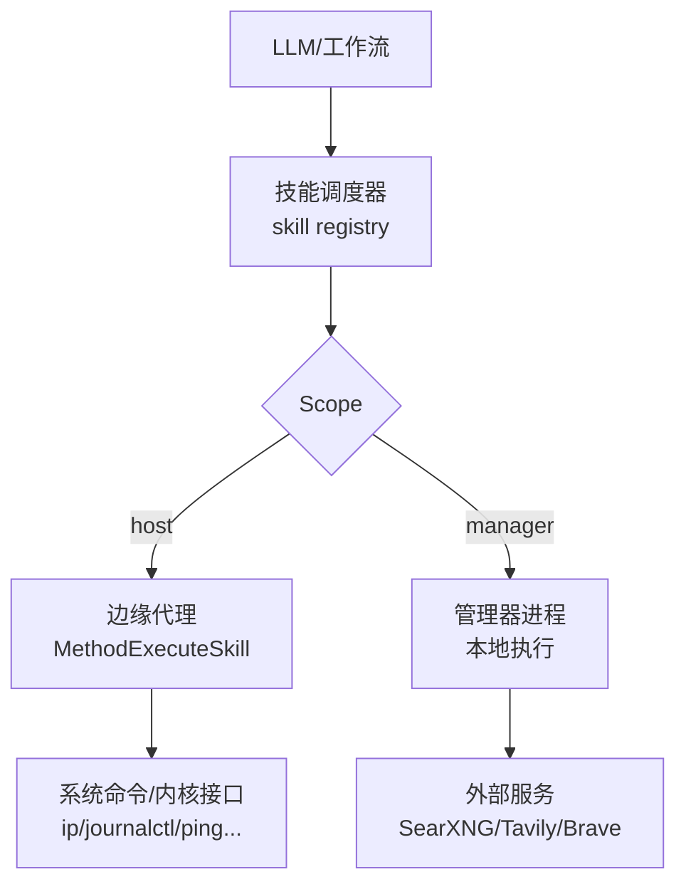
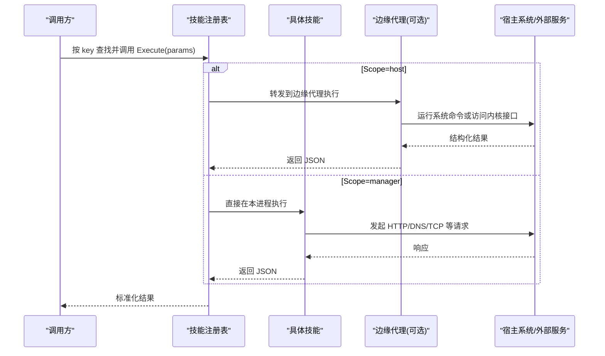
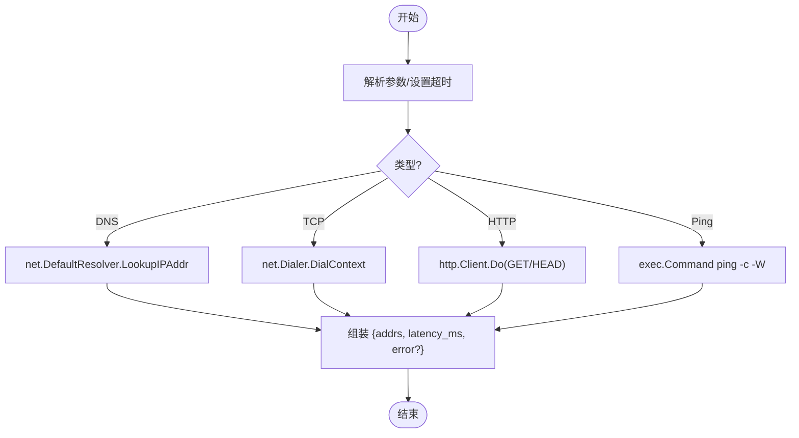
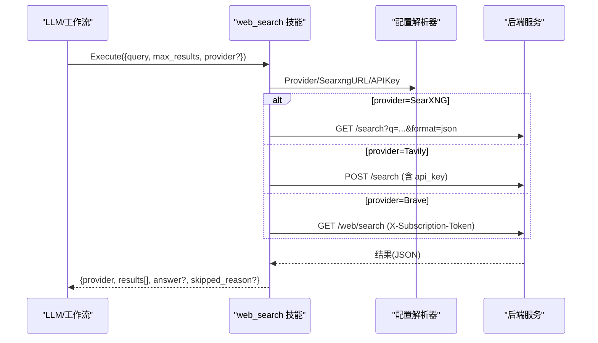
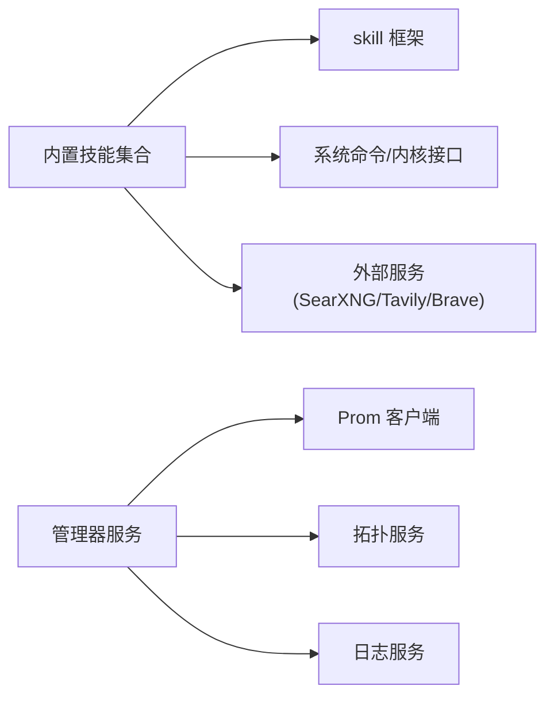

# 内置工具集

<cite>
**本文引用的文件**
- [internal/skill/types.go](file://internal/skill/types.go)
- [internal/skill/builtin/doc.go](file://internal/skill/builtin/doc.go)
- [internal/skill/loader.go](file://internal/skill/loader.go)
- [internal/skill/builtin/host_netns_inspect.go](file://internal/skill/builtin/host_netns_inspect.go)
- [internal/skill/builtin/probe_http.go](file://internal/skill/builtin/probe_http.go)
- [internal/skill/builtin/probe_dns.go](file://internal/skill/builtin/probe_dns.go)
- [internal/skill/builtin/probe_ping.go](file://internal/skill/builtin/probe_ping.go)
- [internal/skill/builtin/probe_tcp.go](file://internal/skill/builtin/probe_tcp.go)
- [internal/skill/builtin/read_journal.go](file://internal/skill/builtin/read_journal.go)
- [internal/skill/builtin/tail_file.go](file://internal/skill/builtin/tail_file.go)
- [internal/skill/builtin/web_search.go](file://internal/skill/builtin/web_search.go)
- [internal/skill/builtin/capture_pcap.go](file://internal/skill/builtin/capture_pcap.go)
</cite>

## 目录
1. [简介](#简介)
2. [项目结构](#项目结构)
3. [核心组件](#核心组件)
4. [架构总览](#架构总览)
5. [详细组件分析](#详细组件分析)
6. [依赖关系分析](#依赖关系分析)
7. [性能考虑](#性能考虑)
8. [故障诊断指南](#故障诊断指南)
9. [结论](#结论)
10. [附录：参数与返回值速查](#附录参数与返回值速查)

## 简介
本技术文档面向系统内置工具集，聚焦以下能力：主机负载/网络探测、PromQL 查询（通过统一 Prom 客户端）、拓扑获取（通过统一 Topology 服务）、事件关联分析（结合日志/指标/拓扑/告警的编排思路）。文档以“技能（Skill）”框架为核心，说明每个工具的参数定义、使用示例、返回值格式、组合模式与高级场景，并提供性能调优与故障诊断建议。

## 项目结构
内置工具以“技能”形式注册到全局注册表，支持两类执行范围：
- ScopeHost：在边缘节点执行（如网络探测、文件读取、抓包等）
- ScopeManager：在管理器进程内执行（如联网搜索、调用外部 API）

所有内置技能通过 init() 自注册，新增技能只需实现 Metadata 与 Execute，并注册即可被 LLM 工具、HTTP 路由和 UI 表单自动发现。

图表来源
- [internal/skill/types.go:47-61](file://internal/skill/types.go#L47-L61)
- [internal/skill/builtin/doc.go:1-26](file://internal/skill/builtin/doc.go#L1-L26)

章节来源
- [internal/skill/types.go:1-27](file://internal/skill/types.go#L1-L27)
- [internal/skill/builtin/doc.go:1-26](file://internal/skill/builtin/doc.go#L1-L26)

## 核心组件
- 技能元数据与执行模型：统一的 Metadata、ParamSchema、Executor 接口，以及权限分级（safe/mutating/dangerous）和执行范围（host/manager）。
- 内置技能集合：网络探测（DNS/TCP/HTTP/PING）、命名空间探查、日志读取、文件尾部读取、联网搜索、抓包任务管理。
- 外部技能加载：通过 skill.json 清单动态加载子进程技能，限制入口路径与环境变量白名单。

章节来源
- [internal/skill/types.go:63-203](file://internal/skill/types.go#L63-L203)
- [internal/skill/loader.go:13-53](file://internal/skill/loader.go#L13-L53)
- [internal/skill/loader.go:75-160](file://internal/skill/loader.go#L75-L160)

## 架构总览
技能从注册到执行的端到端流程如下：

图表来源
- [internal/skill/types.go:47-61](file://internal/skill/types.go#L47-L61)
- [internal/skill/types.go:190-203](file://internal/skill/types.go#L190-L203)

## 详细组件分析

### 主机负载与系统信息（间接能力）
- 能力说明：系统提供对主机侧能力的统一接入点（如文件读取、日志读取、网络命名空间探查），可配合上层编排完成“主机负载/状态”的综合评估。
- 典型工具：
  - 文件尾部读取：安全地读取文件最后 N 行，带大小限制与截断标记。
  - Journald 日志读取：仅 Linux，支持 unit 过滤、时间回溯与行数限制。
  - 网络命名空间探查：列出 /var/run/netns 下命名空间，并输出地址/路由/链路信息。
- 返回值要点：均返回结构化 JSON，包含错误字段用于非致命异常；部分返回 total_lines/file_size/truncated 等元信息。

章节来源
- [internal/skill/builtin/tail_file.go:23-46](file://internal/skill/builtin/tail_file.go#L23-L46)
- [internal/skill/builtin/read_journal.go:23-47](file://internal/skill/builtin/read_journal.go#L23-L47)
- [internal/skill/builtin/host_netns_inspect.go:54-81](file://internal/skill/builtin/host_netns_inspect.go#L54-L81)

### 网络连通性探测（DNS/TCP/HTTP/PING）
- DNS 解析：基于系统解析器，返回 A/AAAA 记录与延迟。
- TCP 连通性：拨号目标 host:port，返回连通性与延迟。
- HTTP 探测：HEAD/GET 请求，返回状态码、延迟与内容长度（TLS 校验跳过，便于内部自签证书场景）。
- Ping 探测：短时 ICMP 探测，返回退出码、耗时与原始输出。

图表来源
- [internal/skill/builtin/probe_dns.go:19-38](file://internal/skill/builtin/probe_dns.go#L19-L38)
- [internal/skill/builtin/probe_tcp.go:19-38](file://internal/skill/builtin/probe_tcp.go#L19-L38)
- [internal/skill/builtin/probe_http.go:23-46](file://internal/skill/builtin/probe_http.go#L23-L46)
- [internal/skill/builtin/probe_ping.go:20-43](file://internal/skill/builtin/probe_ping.go#L20-L43)

章节来源
- [internal/skill/builtin/probe_dns.go:19-84](file://internal/skill/builtin/probe_dns.go#L19-L84)
- [internal/skill/builtin/probe_tcp.go:19-82](file://internal/skill/builtin/probe_tcp.go#L19-L82)
- [internal/skill/builtin/probe_http.go:15-119](file://internal/skill/builtin/probe_http.go#L15-L119)
- [internal/skill/builtin/probe_ping.go:14-124](file://internal/skill/builtin/probe_ping.go#L14-L124)

### 联网搜索（Web Search）
- 支持多后端：SearXNG（默认，无需 Key）、Tavily（需 API Key，可返回 answer）、Brave（需 API Key）。
- 配置注入：通过 WebSearchConfigResolver 注入 Provider、URL 与密钥；测试可通过 SetWebSearchHTTPClient 替换 HTTP 客户端。
- 容错策略：不可达或未配置时返回 skipped_reason 而非错误，便于 LLM 引导用户修复。

图表来源
- [internal/skill/builtin/web_search.go:161-195](file://internal/skill/builtin/web_search.go#L161-L195)
- [internal/skill/builtin/web_search.go:225-283](file://internal/skill/builtin/web_search.go#L225-L283)
- [internal/skill/builtin/web_search.go:287-374](file://internal/skill/builtin/web_search.go#L287-L374)
- [internal/skill/builtin/web_search.go:391-455](file://internal/skill/builtin/web_search.go#L391-L455)
- [internal/skill/builtin/web_search.go:485-543](file://internal/skill/builtin/web_search.go#L485-L543)

章节来源
- [internal/skill/builtin/web_search.go:21-159](file://internal/skill/builtin/web_search.go#L21-L159)
- [internal/skill/builtin/web_search.go:161-283](file://internal/skill/builtin/web_search.go#L161-L283)
- [internal/skill/builtin/web_search.go:287-543](file://internal/skill/builtin/web_search.go#L287-L543)

### 抓包任务（PCAP）
- 启动抓包：在边缘节点启动受控抓包，支持过滤器、时长、字节数、包数、snaplen、混杂模式等参数。
- 查询状态：查询任务 ID 的状态、停止原因、文件大小与错误详情。
- 权限与安全：属于 mutating 类能力，需在授权后执行。

章节来源
- [internal/skill/builtin/capture_pcap.go:21-72](file://internal/skill/builtin/capture_pcap.go#L21-L72)

### PromQL 查询（通过 Prom 客户端）
- 能力说明：系统提供统一的 Prometheus 客户端封装，供上层服务进行 PromQL 查询与写入。该封装位于 internal/pkg/promquery 与 internal/pkg/promwrite，供 manager 层服务调用。
- 使用方式：在服务中注入 promquery 客户端，构造 PromQL 表达式并执行查询；写入则通过 promwrite 客户端上报指标。
- 注意：PromQL 的具体查询逻辑由上层业务编排，此处强调工具链的可复用性与一致性。

章节来源
- [internal/pkg/promquery/client.go](file://internal/pkg/promquery/client.go)
- [internal/pkg/promwrite/client.go](file://internal/pkg/promwrite/client.go)

### 拓扑获取（通过 Topology 服务）
- 能力说明：系统提供拓扑服务，用于获取设备/集群/网络的拓扑关系，支撑可视化与根因定位。
- 使用方式：在 manager 层通过对应服务接口获取拓扑数据，通常与指标、日志、告警联合分析。
- 注意：具体拓扑模型与接口细节由服务层定义，此处强调与其他工具的协作关系。

章节来源
- [internal/manager/service/topology](file://internal/manager/service/topology)
- [internal/manager/server/topology](file://internal/manager/server/topology)

### 事件关联分析（组合模式）
- 思路：将“指标（PromQL）+ 日志（Journald/文件）+ 拓扑 + 告警”串联，形成事件关联分析流水线。
- 典型步骤：
  1) 通过 PromQL 定位异常时段与关键指标。
  2) 用 journald/文件尾部读取拉取相关日志片段。
  3) 借助拓扑服务确定受影响节点/服务关系。
  4) 结合告警上下文生成根因报告。
- 优势：跨域数据融合，提升定位效率与准确性。

[本节为概念性说明，不直接分析具体文件]

## 依赖关系分析
- 技能框架依赖：所有内置技能依赖 skill 框架提供的元数据、注册表与执行模型。
- 外部依赖：
  - 系统命令：ip、journalctl、ping 等（host 范围技能）。
  - 外部服务：SearXNG/Tavily/Brave（manager 范围技能）。
  - 存储/服务：PromQL 客户端、拓扑服务、日志服务等（manager 层）。

图表来源
- [internal/skill/types.go:190-203](file://internal/skill/types.go#L190-L203)
- [internal/skill/builtin/web_search.go:161-195](file://internal/skill/builtin/web_search.go#L161-L195)

章节来源
- [internal/skill/types.go:190-203](file://internal/skill/types.go#L190-L203)
- [internal/skill/builtin/web_search.go:161-195](file://internal/skill/builtin/web_search.go#L161-L195)

## 性能考虑
- 超时控制：
  - DNS/TCP/HTTP/PING 均支持超时参数，避免阻塞调度器。
  - 命名空间探查与 journald 读取设置合理超时，防止长时间 IO。
- 资源限制：
  - 文件读取限制最大字节数与行数，避免大文件导致内存膨胀。
  - 抓包任务限制时长、包数与每包 snaplen，防止磁盘与带宽耗尽。
- 并发与批处理：
  - 批量探测（如多命名空间）建议分片与限流，避免瞬时压力。
- 缓存与复用：
  - 联网搜索的配置解析器应缓存，减少配置读取开销。
  - PromQL 查询结果可按维度缓存，降低重复计算。

[本节提供通用指导，不直接分析具体文件]

## 故障诊断指南
- 常见错误与排查：
  - DNS 解析失败：检查系统解析器与网络连通性。
  - TCP 连接失败：确认目标可达、端口开放与防火墙策略。
  - HTTP 探测失败：检查 URL、方法、超时与 TLS 策略（当前跳过验证）。
  - Ping 失败：检查 ICMP 是否被拦截、目标是否存在。
  - 命名空间探查失败：确认 iproute2 可用、/var/run/netns 存在且权限足够。
  - journald 读取失败：仅在 Linux 支持，检查 journalctl 与权限。
  - 文件读取失败：路径必须绝对且不含 ..，确保可读权限。
  - 联网搜索不可达：SearXNG 未启动或网络不通；Tavily/Brave 未配置 API Key。
  - 抓包任务失败：检查网卡名、权限（混杂模式需 CAP_NET_ADMIN）、过滤器语法。
- 定位建议：
  - 优先查看各技能的 error 字段与返回结构。
  - 结合拓扑与日志缩小影响面。
  - 使用 PromQL 快速验证指标异常是否与工具返回一致。

章节来源
- [internal/skill/builtin/host_netns_inspect.go:135-205](file://internal/skill/builtin/host_netns_inspect.go#L135-L205)
- [internal/skill/builtin/probe_http.go:65-119](file://internal/skill/builtin/probe_http.go#L65-L119)
- [internal/skill/builtin/probe_dns.go:55-84](file://internal/skill/builtin/probe_dns.go#L55-L84)
- [internal/skill/builtin/probe_ping.go:60-99](file://internal/skill/builtin/probe_ping.go#L60-L99)
- [internal/skill/builtin/probe_tcp.go:55-82](file://internal/skill/builtin/probe_tcp.go#L55-L82)
- [internal/skill/builtin/read_journal.go:65-111](file://internal/skill/builtin/read_journal.go#L65-L111)
- [internal/skill/builtin/tail_file.go:64-132](file://internal/skill/builtin/tail_file.go#L64-L132)
- [internal/skill/builtin/web_search.go:225-283](file://internal/skill/builtin/web_search.go#L225-L283)
- [internal/skill/builtin/capture_pcap.go:21-72](file://internal/skill/builtin/capture_pcap.go#L21-L72)

## 结论
内置工具集以“技能”框架为核心，提供稳定、安全、可扩展的主机与网络探测能力，并通过 manager 层的 Prom 客户端与拓扑服务，形成完整的可观测性与排障闭环。推荐在生产环境中：
- 明确技能权限分类与审批流程（mutating/dangerous）。
- 合理设置超时与资源上限，避免资源耗尽。
- 将 PromQL、日志、拓扑与告警串联，构建事件关联分析流水线。
- 定期演练故障场景，验证工具链的健壮性与可恢复性。

[本节为总结性内容，不直接分析具体文件]

## 附录：参数与返回值速查
- 文件尾部读取（tail_file）
  - 参数：path（必填）、lines（默认 100）、max_bytes（默认 1MiB）
  - 返回：lines、total_lines_returned、file_size、truncated、error?
  - 参考：[internal/skill/builtin/tail_file.go:23-46](file://internal/skill/builtin/tail_file.go#L23-L46)
- Journald 日志读取（read_journal）
  - 参数：unit（可选）、since（默认 10m）、lines（默认 200）
  - 返回：lines、total_lines、command、error?
  - 参考：[internal/skill/builtin/read_journal.go:23-47](file://internal/skill/builtin/read_journal.go#L23-L47)
- 网络命名空间探查（host_netns_inspect）
  - 参数：namespace（可选）、include_routes（默认 true）、include_links（默认 false）
  - 返回：namespaces[{name, addrs, routes, links?, error?}]
  - 参考：[internal/skill/builtin/host_netns_inspect.go:54-81](file://internal/skill/builtin/host_netns_inspect.go#L54-L81)
- DNS 解析（probe_dns）
  - 参数：host（必填）、timeout_ms（默认 3000）
  - 返回：addrs[]、latency_ms、error?
  - 参考：[internal/skill/builtin/probe_dns.go:19-38](file://internal/skill/builtin/probe_dns.go#L19-L38)
- TCP 连通性（probe_tcp）
  - 参数：target（必填）、timeout_ms（默认 3000）
  - 返回：ok、latency_ms、error?
  - 参考：[internal/skill/builtin/probe_tcp.go:19-38](file://internal/skill/builtin/probe_tcp.go#L19-L38)
- HTTP 探测（probe_http）
  - 参数：url（必填）、method（默认 HEAD）、timeout_ms（默认 5000）
  - 返回：status_code、latency_ms、content_length、error?
  - 参考：[internal/skill/builtin/probe_http.go:23-46](file://internal/skill/builtin/probe_http.go#L23-L46)
- Ping 探测（probe_ping）
  - 参数：host（必填）、count（默认 4）、timeout_ms（默认 3000）
  - 返回：ok、exit_code、duration_ms、stdout、stderr、error?
  - 参考：[internal/skill/builtin/probe_ping.go:20-43](file://internal/skill/builtin/probe_ping.go#L20-L43)
- 联网搜索（web_search）
  - 参数：query（必填）、max_results（默认 5）、include_domains（可选）、exclude_domains（可选）、provider（可选）
  - 返回：provider、results[{title,url,snippet,published_date}], answer?, skipped_reason?
  - 参考：[internal/skill/builtin/web_search.go:161-195](file://internal/skill/builtin/web_search.go#L161-L195)
- 抓包任务（capture_pcap/get_packet_capture）
  - 启动参数：interface（必填）、filter（可选）、duration_seconds（默认 30）、max_bytes（默认 64MiB）、max_packets（默认 100k）、snaplen（默认 1514）、promiscuous（默认 false）
  - 查询参数：capture_id（必填）
  - 返回：id、state、created_at / id、state、result、error?
  - 参考：[internal/skill/builtin/capture_pcap.go:21-72](file://internal/skill/builtin/capture_pcap.go#L21-L72)