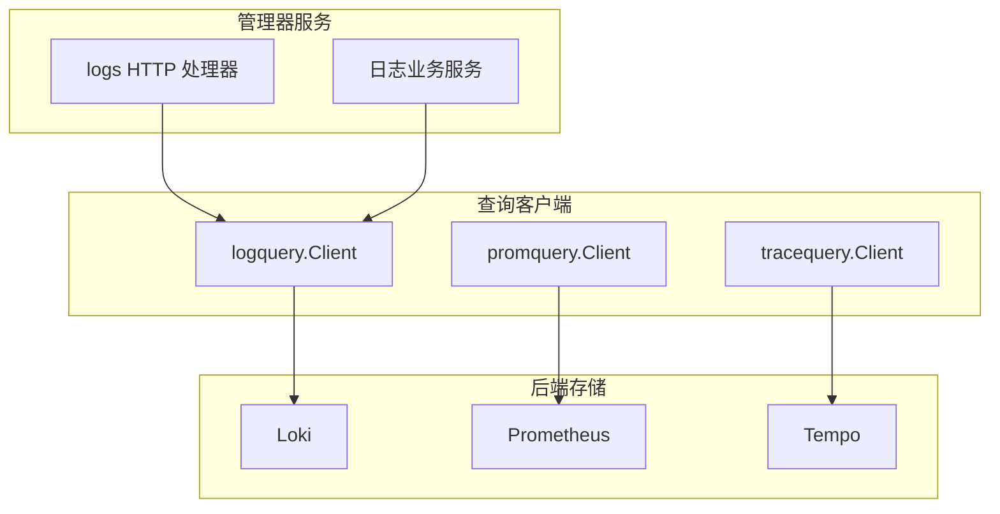
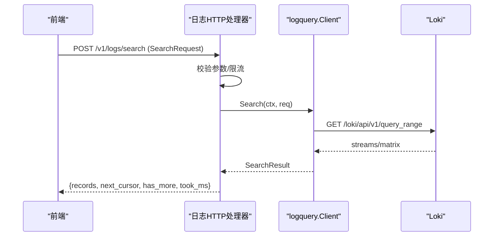
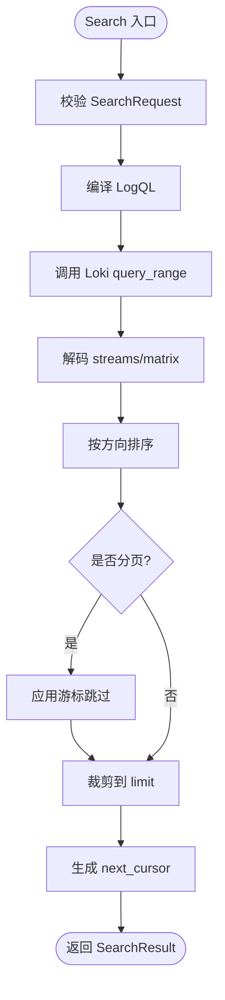
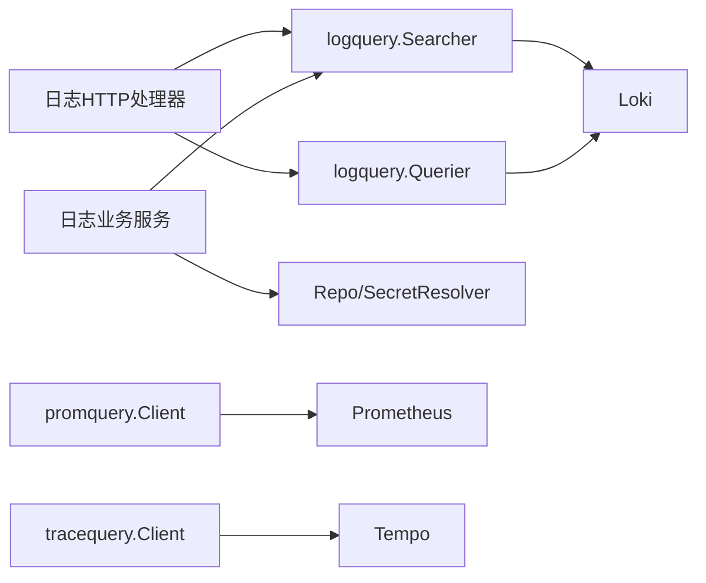

# 数据查询工具

<cite>
**本文引用的文件**
- [internal/pkg/logquery/client.go](file://internal/pkg/logquery/client.go)
- [internal/pkg/logquery/search.go](file://internal/pkg/logquery/search.go)
- [internal/pkg/logquery/loki_search.go](file://internal/pkg/logquery/loki_search.go)
- [internal/pkg/logquery/runtime_client.go](file://internal/pkg/logquery/runtime_client.go)
- [internal/pkg/promquery/client.go](file://internal/pkg/promquery/client.go)
- [internal/pkg/tracequery/client.go](file://internal/pkg/tracequery/client.go)
- [api/manager/logs/v1/logs.proto](file://api/manager/logs/v1/logs.proto)
- [api/manager/metric/v1/metric.proto](file://api/manager/metric/v1/metric.proto)
- [internal/manager/server/logs/http.go](file://internal/manager/server/logs/http.go)
- [internal/manager/biz/logs/service.go](file://internal/manager/biz/logs/service.go)
- [internal/manager/server/aiops/query_translate.go](file://internal/manager/server/aiops/query_translate.go)
</cite>

## 目录
1. [简介](#简介)
2. [项目结构](#项目结构)
3. [核心组件](#核心组件)
4. [架构总览](#架构总览)
5. [详细组件分析](#详细组件分析)
6. [依赖关系分析](#依赖关系分析)
7. [性能与优化](#性能与优化)
8. [故障排查指南](#故障排查指南)
9. [结论](#结论)
10. [附录](#附录)

## 简介
本技术文档面向数据查询工具，覆盖 PromQL、LogQL、TraceQL 三种查询语言在系统中的使用方法、语法规范、查询优化技巧、性能调参、结果缓存机制、复杂查询构建与调试方法，以及查询结果的可视化与导出。同时解释不同查询语言的适用场景与统一处理机制。

## 项目结构
系统围绕三类可插拔的查询客户端实现：
- 日志查询（LogQL）：通过 Loki API 提供结构化日志检索、字段枚举、直方图聚合等能力，并提供后端无关的 Searcher 抽象，支持后续扩展到其他日志后端。
- 指标查询（PromQL）：封装 Prometheus /api/v1/query 与 /api/v1/query_range，返回原始 JSON 以便上层灵活消费。
- 链路查询（TraceQL）：封装 Tempo /api/search 与 /api/traces/<id>，支持 TraceQL 表达式与标签过滤。

图表来源
- [internal/pkg/logquery/client.go:1-120](file://internal/pkg/logquery/client.go#L1-L120)
- [internal/pkg/promquery/client.go:1-120](file://internal/pkg/promquery/client.go#L1-L120)
- [internal/pkg/tracequery/client.go:1-120](file://internal/pkg/tracequery/client.go#L1-L120)
- [internal/manager/server/logs/http.go:97-119](file://internal/manager/server/logs/http.go#L97-L119)
- [internal/manager/biz/logs/service.go:230-265](file://internal/manager/biz/logs/service.go#L230-L265)

章节来源
- [internal/pkg/logquery/client.go:1-120](file://internal/pkg/logquery/client.go#L1-L120)
- [internal/pkg/promquery/client.go:1-120](file://internal/pkg/promquery/client.go#L1-L120)
- [internal/pkg/tracequery/client.go:1-120](file://internal/pkg/tracequery/client.go#L1-L120)
- [internal/manager/server/logs/http.go:97-119](file://internal/manager/server/logs/http.go#L97-L119)
- [internal/manager/biz/logs/service.go:230-265](file://internal/manager/biz/logs/service.go#L230-L265)

## 核心组件
- LogQL 查询客户端
  - 提供 QueryRange、LabelNames、LabelValues 等基础能力；默认超时 30s；请求体限制 8MiB；单租户通过 X-Scope-OrgID 隔离。
  - 后端无关的 Searcher 接口定义统一的搜索、计数、字段、值列表、直方图等能力，便于替换或扩展后端。
  - RuntimeClient 支持运行时解析 Loki 端点、Basic Auth、TLS 设置，并缓存底层 HTTP 客户端以减少重建开销。
- PromQL 查询客户端
  - 封装瞬时查询与范围查询，返回 InstantResult（包含 resultType 与 raw result），便于上层直接透传给 AI 或前端。
  - 默认超时 30s；对非 2xx 响应进行错误包装，保留 errorType。
- TraceQL 查询客户端
  - 封装 /api/search 与 /api/traces/<id>，支持 TraceQL 表达式与标签过滤；返回原始 JSON，兼容不同版本 Tempo 的差异。
  - 默认超时 30s；读取体限制 16MiB 以容纳较大 trace。

章节来源
- [internal/pkg/logquery/client.go:1-120](file://internal/pkg/logquery/client.go#L1-L120)
- [internal/pkg/logquery/search.go:138-159](file://internal/pkg/logquery/search.go#L138-L159)
- [internal/pkg/logquery/runtime_client.go:16-83](file://internal/pkg/logquery/runtime_client.go#L16-L83)
- [internal/pkg/promquery/client.go:17-117](file://internal/pkg/promquery/client.go#L17-L117)
- [internal/pkg/tracequery/client.go:16-157](file://internal/pkg/tracequery/client.go#L16-L157)

## 架构总览
查询入口与路由：
- 日志：HTTP 处理器暴露 /v1/logs/* 路由，包括 search、cursor/close、fields、field-values、histogram、context、backend 管理、以及 query_range/labels 代理。
- 指标：MetricService 提供按边设备查询主机指标的 RPC，自动选择分辨率表（raw/5m/1h）。
- 链路：通过 tracequery.Client 调用 Tempo 搜索与详情接口。

图表来源
- [internal/manager/server/logs/http.go:306-332](file://internal/manager/server/logs/http.go#L306-L332)
- [internal/pkg/logquery/loki_search.go:31-118](file://internal/pkg/logquery/loki_search.go#L31-L118)
- [internal/pkg/logquery/client.go:120-171](file://internal/pkg/logquery/client.go#L120-L171)

章节来源
- [internal/manager/server/logs/http.go:97-119](file://internal/manager/server/logs/http.go#L97-L119)
- [internal/pkg/logquery/loki_search.go:31-118](file://internal/pkg/logquery/loki_search.go#L31-L118)
- [internal/pkg/logquery/client.go:120-171](file://internal/pkg/logquery/client.go#L120-L171)

## 详细组件分析

### LogQL 查询与后端无关抽象
- Searcher 接口
  - Search：分页搜索日志，支持方向、游标、关键词匹配、字段过滤、作用域筛选。
  - Count：精确计数，使用 count_over_time 在区间末端瞬时查询，避免重叠桶重复计数。
  - Fields/FieldValues：列出可用字段与字段值，优先走索引 label 接口，否则扫描记录去重。
  - Histogram：将匹配日志按时间间隔聚合为直方图，内部对齐 step 网格并处理部分桶。
- 编译 LogQL
  - 将产品级 Scope/Filters/Keywords 转换为 Loki stream selector 与行过滤器，确保仅使用已知标签映射，避免注入非法标签。
  - 对 message 字段支持相等、包含、前缀、存在性、排除等语义，并正确转义正则。
- 游标与分页
  - 基于时间戳与跳过数生成游标，保证前后向排序一致性与不丢不漏。
- 直方图与计数
  - 使用 count_over_time + sum by 分组，保持与 Elasticsearch OTel 文档一致的边界约定。

图表来源
- [internal/pkg/logquery/loki_search.go:31-118](file://internal/pkg/logquery/loki_search.go#L31-L118)
- [internal/pkg/logquery/search.go:257-338](file://internal/pkg/logquery/search.go#L257-L338)
- [internal/pkg/logquery/loki_search.go:390-526](file://internal/pkg/logquery/loki_search.go#L390-L526)

章节来源
- [internal/pkg/logquery/search.go:138-159](file://internal/pkg/logquery/search.go#L138-L159)
- [internal/pkg/logquery/loki_search.go:31-118](file://internal/pkg/logquery/loki_search.go#L31-L118)
- [internal/pkg/logquery/loki_search.go:390-526](file://internal/pkg/logquery/loki_search.go#L390-L526)

### PromQL 查询客户端
- 瞬时查询与范围查询
  - 支持 time 参数与 step 步长；step 必须大于 0；end 必须晚于 start。
  - 返回 InstantResult，resultType 可为 vector/matrix/scalar，result 为原始 JSON，便于上层直接使用。
- 错误处理
  - 对 400 状态码也尝试解码错误信息（errorType/error），其他非 2xx 视为传输或服务失败。

章节来源
- [internal/pkg/promquery/client.go:93-117](file://internal/pkg/promquery/client.go#L93-L117)
- [internal/pkg/promquery/client.go:119-167](file://internal/pkg/promquery/client.go#L119-L167)

### TraceQL 查询客户端
- 搜索与详情
  - SearchTraces：支持 TraceQL 表达式或 legacy tags 过滤；limit 默认 100；可选 start/end/minDuration/maxDuration。
  - TagValues：获取某 tag 的值列表，用于 UI 下拉框。
  - GetTrace：按 ID 获取完整 trace，返回原始 JSON。
- 兼容性
  - 对旧版 Tempo 返回裸数组或包裹形式的兼容处理，尽量保留原始 body 供上层判断。

章节来源
- [internal/pkg/tracequery/client.go:89-157](file://internal/pkg/tracequery/client.go#L89-L157)
- [internal/pkg/tracequery/client.go:159-201](file://internal/pkg/tracequery/client.go#L159-L201)

### 日志后端管理与运行时切换
- 后端类型
  - 内置 Loki 路径与外部 Elasticsearch 路径；支持保存、测试、选择后端，以及连接检查。
- 运行时配置
  - RuntimeClient 每次操作前解析 Loki 端点，若变化则重建 HTTP 客户端并复用连接池；支持 Basic Auth 与 TLS 跳过验证（仅测试环境）。
- 安全与权限
  - 写与读凭据分离；禁止相同 API Key；受管密钥通过引用管理，避免明文落库。

章节来源
- [internal/manager/biz/logs/service.go:303-507](file://internal/manager/biz/logs/service.go#L303-L507)
- [internal/pkg/logquery/runtime_client.go:53-116](file://internal/pkg/logquery/runtime_client.go#L53-L116)

### HTTP 路由与限流
- 路由
  - /v1/logs/search、/v1/logs/cursor/close、/v1/logs/fields、/v1/logs/field-values、/v1/logs/histogram、/v1/logs/context、/v1/logs/backend/*、/v1/logs/query_range、/v1/logs/labels、/v1/logs/labels/{name}/values。
- 限流与超时
  - 并发结构化搜索槽位限制（默认 8），等待 1s 后拒绝过多请求；各接口设置合理超时（15-30s）。
- 错误映射
  - 将上下文超时、无效参数、后端错误映射为统一 API 错误码与消息。

章节来源
- [internal/manager/server/logs/http.go:97-119](file://internal/manager/server/logs/http.go#L97-L119)
- [internal/manager/server/logs/http.go:357-397](file://internal/manager/server/logs/http.go#L357-L397)
- [internal/manager/server/logs/http.go:731-748](file://internal/manager/server/logs/http.go#L731-L748)

## 依赖关系分析
- 组件耦合
  - HTTP 处理器依赖 logquery.Searcher 与 Querier；业务服务依赖 Repo、SecretResolver、GrafanaSyncer 等接口，降低与具体实现的耦合。
  - 三个查询客户端均通过 BaseURLResolver 解耦后端地址，支持运行时变更。
- 外部依赖
  - Loki、Prometheus、Tempo 的 HTTP API；必要时 Grafana 数据源同步。
- 潜在循环依赖
  - 通过接口与包名隔离（logquery/promquery/tracequery 各自独立），避免循环导入。

图表来源
- [internal/manager/server/logs/http.go:39-87](file://internal/manager/server/logs/http.go#L39-L87)
- [internal/manager/biz/logs/service.go:51-107](file://internal/manager/biz/logs/service.go#L51-L107)
- [internal/pkg/logquery/client.go:46-59](file://internal/pkg/logquery/client.go#L46-L59)
- [internal/pkg/promquery/client.go:27-41](file://internal/pkg/promquery/client.go#L27-L41)
- [internal/pkg/tracequery/client.go:32-45](file://internal/pkg/tracequery/client.go#L32-L45)

章节来源
- [internal/manager/server/logs/http.go:39-87](file://internal/manager/server/logs/http.go#L39-L87)
- [internal/manager/biz/logs/service.go:51-107](file://internal/manager/biz/logs/service.go#L51-L107)

## 性能与优化
- 查询优化技巧
  - 日志查询
    - 优先使用索引标签作为 stream selector，减少全量扫描；message 字段使用正则时注意复杂度控制。
    - 合理使用 limit 与 direction，避免大窗口无界查询；利用 cursor 分页。
    - 直方图聚合使用 count_over_time + sum by，避免跨桶重复计数；interval 需合理，避免过细导致大量桶。
  - 指标查询
    - 范围查询指定合适的 step，避免过小导致数据点爆炸；使用 PROMQL 函数进行预聚合（如 rate、sum）。
  - 链路查询
    - 使用 TraceQL 表达式限定 service、duration、status 等条件，缩小搜索空间；必要时使用 minDuration/maxDuration。
- 性能调参
  - 超时：客户端默认 30s；HTTP 层对结构化搜索设置并发上限与等待时间，防止雪崩。
  - 内存：响应体限制 8MiB（日志）、16MiB（链路），避免 OOM；过大查询应缩小时间窗口或增加过滤。
  - 连接池：RuntimeClient 缓存 HTTP 客户端，仅在端点变化时重建，减少握手开销。
- 结果缓存机制
  - 当前实现未引入服务端查询结果缓存；通过游标与分页减少重复拉取；业务侧可按需实现查询结果缓存（例如基于查询指纹与时间窗口的本地缓存）。
  - 指标查询的分辨率自动选择（raw/5m/1h）可减少历史长窗口查询的数据量。

章节来源
- [internal/pkg/logquery/client.go:61-64](file://internal/pkg/logquery/client.go#L61-L64)
- [internal/pkg/logquery/client.go:257-271](file://internal/pkg/logquery/client.go#L257-L271)
- [internal/pkg/tracequery/client.go:47-49](file://internal/pkg/tracequery/client.go#L47-L49)
- [internal/pkg/tracequery/client.go:228-241](file://internal/pkg/tracequery/client.go#L228-L241)
- [internal/manager/server/logs/http.go:35-37](file://internal/manager/server/logs/http.go#L35-L37)
- [internal/manager/server/logs/http.go:595-604](file://internal/manager/server/logs/http.go#L595-L604)
- [api/manager/metric/v1/metric.proto:12-17](file://api/manager/metric/v1/metric.proto#L12-L17)

## 故障排查指南
- 常见错误
  - 空查询或时间范围无效：LogQL 客户端会返回明确错误；HTTP 层将映射为 LOG_QUERY_INVALID。
  - 后端不可用或认证失败：HTTP 层返回 LOG_BACKEND_ERROR 或 UNAUTHORIZED/FORBIDDEN。
  - 超时：上下文超时映射为 LOG_QUERY_TIMEOUT；建议缩小窗口或增加过滤。
  - 游标无效：当游标损坏或越界时返回 invalid cursor；前端应重置游标重新请求。
- 诊断步骤
  - 检查请求参数（start/end/limit/direction）是否符合约束。
  - 查看后端健康状态与连接检查结果（Select/Test/ConnectionCheck）。
  - 对于日志查询，确认使用的标签是否存在且已索引；message 正则是否过于宽泛。
  - 对于链路查询，确认 TraceQL 表达式语法与标签名称是否正确。

章节来源
- [internal/manager/server/logs/http.go:731-748](file://internal/manager/server/logs/http.go#L731-L748)
- [internal/pkg/logquery/search.go:257-338](file://internal/pkg/logquery/search.go#L257-L338)
- [internal/manager/biz/logs/service.go:450-507](file://internal/manager/biz/logs/service.go#L450-L507)

## 结论
本系统提供了统一的查询工具集，覆盖日志、指标、链路三大信号。通过后端无关的抽象与运行时可配置的客户端，实现了高内聚、低耦合的可扩展架构。结合严格的参数校验、限流与错误映射，保障了查询的稳定性和可观测性。未来可在业务层引入查询结果缓存与更智能的查询重写，进一步提升性能与用户体验。

## 附录

### 查询语言特点与适用场景
- PromQL
  - 适用于时序指标分析与告警规则；擅长聚合、速率计算、窗口统计。
  - 示例参考：[internal/manager/server/aiops/query_translate.go:60-86](file://internal/manager/server/aiops/query_translate.go#L60-L86)
- LogQL
  - 适用于结构化日志检索与聚合；支持标签过滤、行过滤、直方图统计。
  - 示例参考：[internal/manager/server/aiops/query_translate.go:60-86](file://internal/manager/server/aiops/query_translate.go#L60-L86)
- TraceQL
  - 适用于分布式链路追踪；支持 span 属性过滤、持续时间比较、状态过滤。
  - 示例参考：[internal/manager/server/aiops/query_translate.go:60-86](file://internal/manager/server/aiops/query_translate.go#L60-L86)

### 统一处理机制
- 结果形状
  - 日志：SearchResult（records、next_cursor、has_more、took_ms、backends）。
  - 指标：InstantResult（resultType、result 原始 JSON）。
  - 链路：SearchResult（traces、metrics 原始 JSON）与 TraceResult（body 原始 JSON）。
- 错误与状态
  - 统一通过 HTTP 层映射为 code/message/data 结构，便于前端展示与重试。

章节来源
- [internal/pkg/logquery/search.go:103-109](file://internal/pkg/logquery/search.go#L103-L109)
- [internal/pkg/promquery/client.go:17-25](file://internal/pkg/promquery/client.go#L17-L25)
- [internal/pkg/tracequery/client.go:16-30](file://internal/pkg/tracequery/client.go#L16-L30)
- [internal/manager/server/logs/http.go:284-288](file://internal/manager/server/logs/http.go#L284-L288)