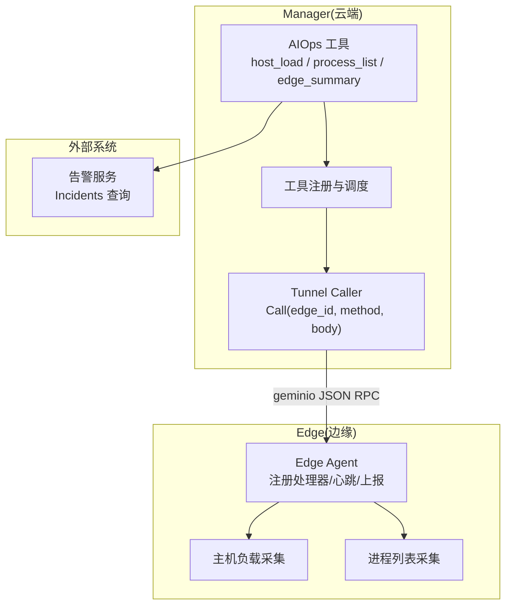
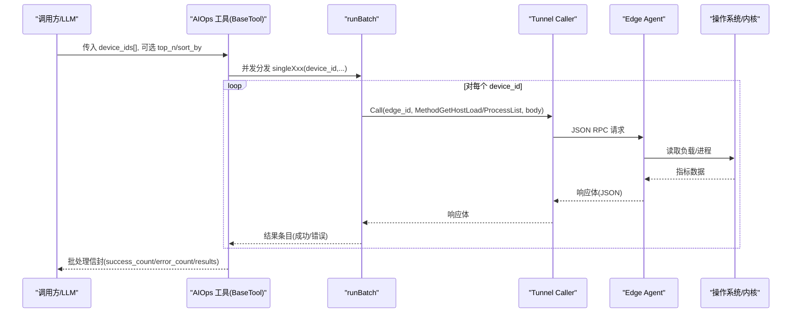
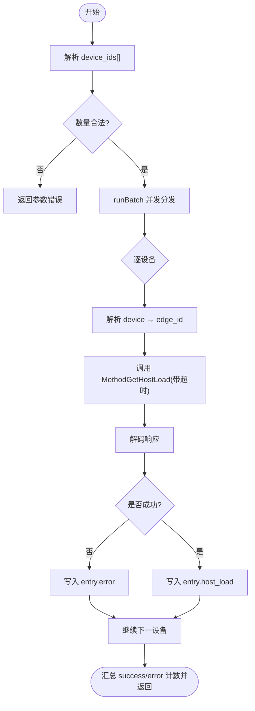
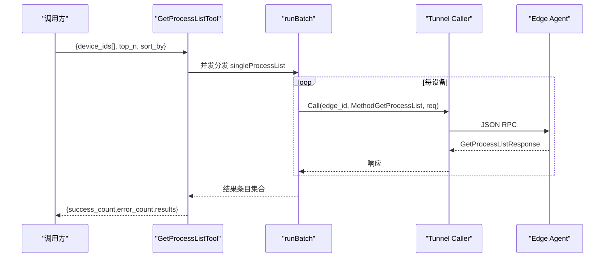
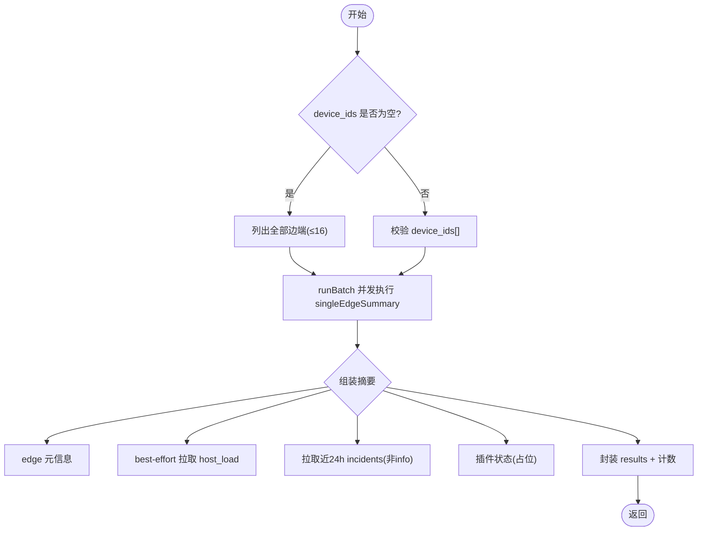
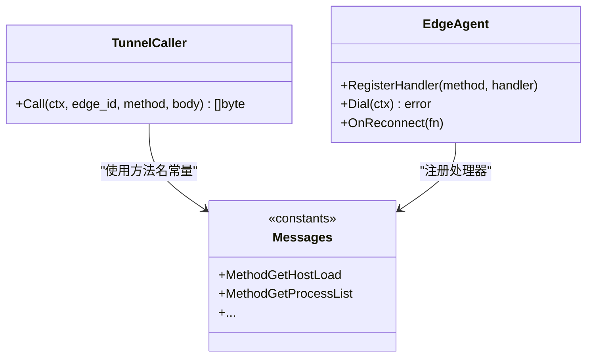
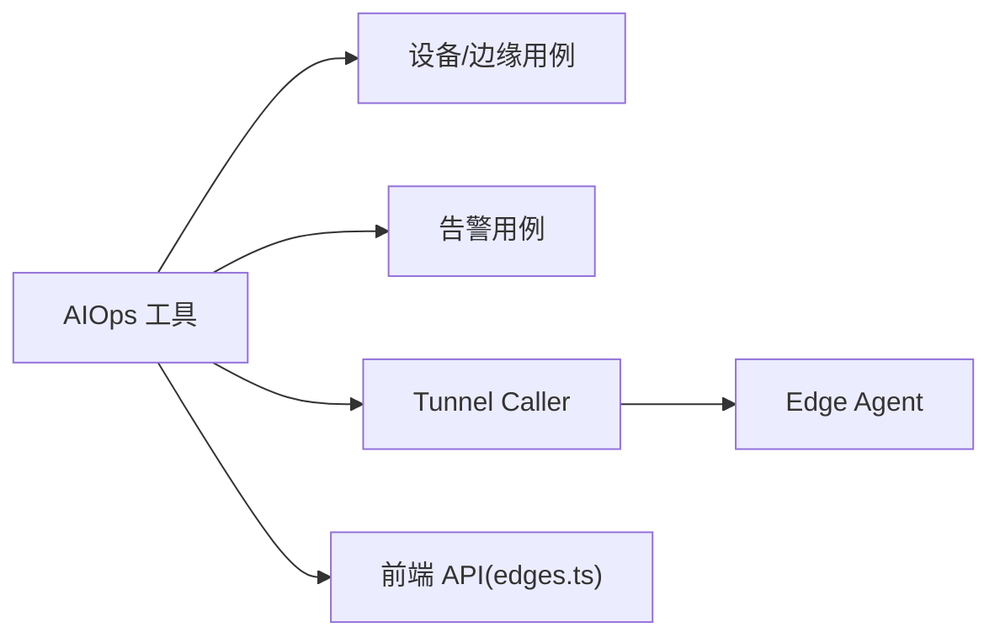
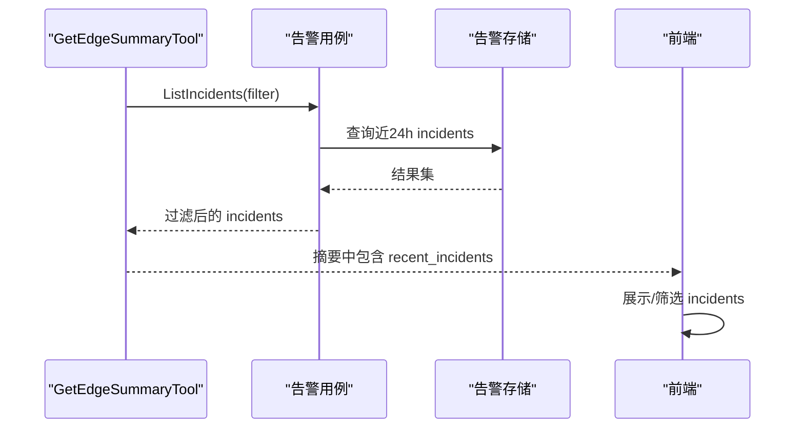

# 系统监控工具

<cite>
**本文引用的文件**
- [host_load_basetool.go](file://internal/manager/biz/aiops/tools/host_load_basetool.go)
- [host_processes_basetool.go](file://internal/manager/biz/aiops/tools/host_processes_basetool.go)
- [get_edge_summary_basetool.go](file://internal/manager/biz/aiops/tools/get_edge_summary_basetool.go)
- [host_load.go](file://internal/manager/biz/aiops/tools/host_load.go)
- [messages.go](file://internal/pkg/tunnel/messages.go)
- [types.go](file://internal/pkg/tunnel/types.go)
- [tunnel.proto](file://api/tunnel/v1/tunnel.proto)
- [edge.proto](file://api/manager/edge/v1/edge.proto)
- [edges.ts](file://web/src/api/edges.ts)
- [batch_helper_test.go](file://internal/manager/biz/aiops/tools/batch_helper_test.go)
- [agent.go](file://internal/edgeagent/biz/agent.go)
- [metrics_batch.go](file://internal/edgeagent/k8s/metrics_batch.go)
- [http.go](file://internal/manager/server/integration/http.go)
- [alerts.ts](file://web/src/api/alerts.ts)
</cite>

## 目录
1. [简介](#简介)
2. [项目结构](#项目结构)
3. [核心组件](#核心组件)
4. [架构总览](#架构总览)
5. [详细组件分析](#详细组件分析)
6. [依赖关系分析](#依赖关系分析)
7. [性能与并发](#性能与并发)
8. [实时性与准确性](#实时性与准确性)
9. [告警集成](#告警集成)
10. [故障排查指南](#故障排查指南)
11. [结论](#结论)

## 简介
本技术文档面向“系统监控工具”，覆盖主机负载查询、进程列表获取、边缘节点摘要三大能力。重点说明：
- 每个工具的监控指标含义、查询语法与结果解读
- 批量查询机制（device_ids 数组、并发策略、错误处理）
- 与边缘代理的通信机制与数据传输格式
- 实时性与准确性保证
- 监控告警集成方法与性能优化建议

## 项目结构
监控工具位于 Manager 侧 AIOps 工具层，通过隧道协议向 Edge Agent 发起反向调用；Edge Agent 采集本地指标并返回。前端通过 REST API 访问边缘进程等数据。

图表来源
- [host_load_basetool.go:111-151](file://internal/manager/biz/aiops/tools/host_load_basetool.go#L111-L151)
- [host_processes_basetool.go:112-150](file://internal/manager/biz/aiops/tools/host_processes_basetool.go#L112-L150)
- [get_edge_summary_basetool.go:113-202](file://internal/manager/biz/aiops/tools/get_edge_summary_basetool.go#L113-L202)
- [messages.go:18-96](file://internal/pkg/tunnel/messages.go#L18-L96)
- [agent.go:186-210](file://internal/edgeagent/biz/agent.go#L186-L210)

章节来源
- [host_load_basetool.go:1-185](file://internal/manager/biz/aiops/tools/host_load_basetool.go#L1-L185)
- [host_processes_basetool.go:1-193](file://internal/manager/biz/aiops/tools/host_processes_basetool.go#L1-L193)
- [get_edge_summary_basetool.go:1-313](file://internal/manager/biz/aiops/tools/get_edge_summary_basetool.go#L1-L313)
- [messages.go:1-96](file://internal/pkg/tunnel/messages.go#L1-L96)
- [agent.go:173-210](file://internal/edgeagent/biz/agent.go#L173-L210)

## 核心组件
- 主机负载查询工具：一次性批量获取多台设备的 CPU%、内存%、1/5/15 分钟负载均值
- 进程列表获取工具：批量获取每台设备 top-N 进程，支持按 CPU 或内存排序
- 边缘节点摘要工具：批量汇总设备元信息、实时 host_load、近 24h 告警事件摘要、插件状态
- 批量执行器：runBatch，控制并发度、保持顺序、聚合成功/失败计数
- 隧道通信：基于 geminio 的 JSON RPC，方法名常量定义在 messages.go

章节来源
- [host_load_basetool.go:56-99](file://internal/manager/biz/aiops/tools/host_load_basetool.go#L56-L99)
- [host_processes_basetool.go:47-99](file://internal/manager/biz/aiops/tools/host_processes_basetool.go#L47-L99)
- [get_edge_summary_basetool.go:55-111](file://internal/manager/biz/aiops/tools/get_edge_summary_basetool.go#L55-L111)
- [messages.go:18-96](file://internal/pkg/tunnel/messages.go#L18-L96)

## 架构总览
监控工具统一通过 BaseTool 形式暴露，参数以 device_ids[] 为主，内部使用 runBatch 并发分发到各设备。每条请求经 tunnel.Call 发送到对应 edge_id，由 Edge Agent 的处理器执行本地采集并返回。

图表来源
- [host_load_basetool.go:153-185](file://internal/manager/biz/aiops/tools/host_load_basetool.go#L153-L185)
- [host_processes_basetool.go:152-193](file://internal/manager/biz/aiops/tools/host_processes_basetool.go#L152-L193)
- [messages.go:18-96](file://internal/pkg/tunnel/messages.go#L18-L96)
- [agent.go:186-210](file://internal/edgeagent/biz/agent.go#L186-L210)

## 详细组件分析

### 主机负载查询（get_host_load）
- 指标含义
  - CPU%：当前 CPU 使用率
  - Mem%：当前内存使用率
  - Load1/5/15：1/5/15 分钟平均负载
- 查询语法（BaseTool 批量）
  - 参数：device_ids[]（1..16），共享超时与并发策略
  - 返回值：results 中每项包含 device_id、host_load 或 error；信封含 success_count、error_count
- 结果解读
  - 若某项存在 error，表示该设备解析失败、无 host-edge 关联、或隧道调用/解码失败
  - 成功项可直接用于横向对比（哪台 CPU 最高、内存占用异常等）
- 关键实现要点
  - 单条调用带超时（15s），避免长尾阻塞
  - 通过 device → edge 解析后调用 MethodGetHostLoad
  - 错误折叠进 results，不中断整批

图表来源
- [host_load_basetool.go:111-185](file://internal/manager/biz/aiops/tools/host_load_basetool.go#L111-L185)
- [host_load.go:37-77](file://internal/manager/biz/aiops/tools/host_load.go#L37-L77)

章节来源
- [host_load_basetool.go:1-185](file://internal/manager/biz/aiops/tools/host_load_basetool.go#L1-L185)
- [host_load.go:1-78](file://internal/manager/biz/aiops/tools/host_load.go#L1-L78)

### 进程列表获取（get_process_list）
- 指标含义
  - PID、名称、命令行、CPU%、内存%、用户
- 查询语法（BaseTool 批量）
  - 参数：device_ids[]（1..16）、top_n（默认 10，最大 100）、sort_by（cpu 或 mem，默认 cpu）
  - 返回值：results 中每项包含 device_id、process_list 或 error；信封含 success_count、error_count
- 结果解读
  - 适合 fleet 视角对比多设备进程资源占用
  - 单设备深查建议使用 host_bash + ps 更灵活
- 关键实现要点
  - 构造 GetProcessListRequest，调用 MethodGetProcessList
  - 单条调用带超时（15s）
  - sort_by 校验为 cpu/mem，否则返回错误

图表来源
- [host_processes_basetool.go:112-193](file://internal/manager/biz/aiops/tools/host_processes_basetool.go#L112-L193)
- [messages.go:18-96](file://internal/pkg/tunnel/messages.go#L18-L96)

章节来源
- [host_processes_basetool.go:1-193](file://internal/manager/biz/aiops/tools/host_processes_basetool.go#L1-L193)

### 边缘节点摘要（get_edge_summary）
- 内容组成
  - 设备元信息（edge id/name/status/roles/时间戳）
  - 实时 host_load（best-effort，在线才拉取）
  - 近 24h 告警事件摘要（过滤 info 级别，限制条数）
  - 插件状态（当前占位值）
- 查询语法（BaseTool 批量）
  - 参数：device_ids[]（可省略，省略时自动汇总全部边端，最多 16 个）
  - 返回值：results 中每项包含 device_id、summary 或 error；信封含 success_count、error_count
- 结果解读
  - 适合巡检/体检所有设备，无需先查设备清单
  - 若 host_load 或 incidents 拉取失败，仍会返回部分 summary（降级）
- 关键实现要点
  - 外层批次超时 90s，内层 per-id 超时 30s
  - 并发度 batchConcurrency=4，防止慢设备拖垮整体
  - 当 device_ids 为空时，自动列出全部边端并截断至上限

图表来源
- [get_edge_summary_basetool.go:113-247](file://internal/manager/biz/aiops/tools/get_edge_summary_basetool.go#L113-L247)

章节来源
- [get_edge_summary_basetool.go:1-313](file://internal/manager/biz/aiops/tools/get_edge_summary_basetool.go#L1-L313)

### 与边缘代理的通信机制与数据传输格式
- 通信通道
  - 基于 geminio 的隧道连接，JSON 编码传输（MVP）
  - 方法名常量集中管理，如 MethodGetHostLoad、MethodGetProcessList
- 认证与会话
  - Edge 侧通过 AccessKey/SecretKey 建立会话，Manager 侧验证并绑定 EdgeID
- 典型流程
  - Manager 工具通过 tunnel.Call 发送请求
  - Edge Agent 注册处理器接收请求，采集本地指标后返回
  - 支持重连回调，确保重新注册 edge 身份

图表来源
- [messages.go:18-96](file://internal/pkg/tunnel/messages.go#L18-L96)
- [types.go:68-105](file://internal/pkg/tunnel/types.go#L68-L105)
- [agent.go:186-210](file://internal/edgeagent/biz/agent.go#L186-L210)

章节来源
- [messages.go:1-96](file://internal/pkg/tunnel/messages.go#L1-L96)
- [types.go:1-119](file://internal/pkg/tunnel/types.go#L1-L119)
- [agent.go:173-210](file://internal/edgeagent/biz/agent.go#L173-L210)

## 依赖关系分析
- 工具层依赖
  - 设备与边缘业务用例：用于 device → edge 解析与边缘信息查询
  - 隧道调用：通过 Caller.Call 进行跨边界 RPC
  - 告警用例：用于 edge_summary 中的 incidents 拉取
- 数据流
  - 工具 → 解析设备 → 调用隧道 → Edge 采集 → 返回结果 → 聚合信封
- 外部依赖
  - Prometheus/Loki/Tempo 集成接口（Manager 侧 HTTP 路由）
  - 前端 API（edges.ts 提供进程列表查询）

图表来源
- [host_load_basetool.go:111-151](file://internal/manager/biz/aiops/tools/host_load_basetool.go#L111-L151)
- [get_edge_summary_basetool.go:113-202](file://internal/manager/biz/aiops/tools/get_edge_summary_basetool.go#L113-L202)
- [edges.ts:268-296](file://web/src/api/edges.ts#L268-L296)

章节来源
- [host_load_basetool.go:1-185](file://internal/manager/biz/aiops/tools/host_load_basetool.go#L1-L185)
- [get_edge_summary_basetool.go:1-313](file://internal/manager/biz/aiops/tools/get_edge_summary_basetool.go#L1-L313)
- [edges.ts:268-296](file://web/src/api/edges.ts#L268-L296)

## 性能与并发
- 批量并发策略
  - runBatch 控制并发度（测试验证峰值 ≤ batchConcurrency），保持输入顺序输出
  - 主机负载与进程列表单条调用超时（15s），避免阻塞
  - 边缘摘要外层批次超时 90s，内层 per-id 超时 30s，并发度 4
- 错误处理模式
  - 单设备失败折叠为 result.entry.error，不影响其他设备
  - 统计 success_count/error_count，便于上层决策重试或降级
- 性能优化建议
  - 合理设置 batch size（≤16），避免单次过大导致超时
  - 优先使用批量接口减少 LLM 轮次与网络往返
  - 对慢设备采用分批重试或隔离策略

章节来源
- [batch_helper_test.go:12-118](file://internal/manager/biz/aiops/tools/batch_helper_test.go#L12-L118)
- [host_load_basetool.go:111-185](file://internal/manager/biz/aiops/tools/host_load_basetool.go#L111-L185)
- [host_processes_basetool.go:112-193](file://internal/manager/biz/aiops/tools/host_processes_basetool.go#L112-L193)
- [get_edge_summary_basetool.go:19-36](file://internal/manager/biz/aiops/tools/get_edge_summary_basetool.go#L19-L36)

## 实时性与准确性
- 实时性
  - 主机负载与进程列表为即时采集，受限于 Edge 侧采集频率与网络延迟
  - 边缘摘要中的 host_load 为 best-effort，离线设备将缺失该项
- 准确性
  - 指标来源于操作系统/内核，Edge Agent 负责采集与上报
  - 历史趋势通过 Prometheus/Loki 等后端，而非实时工具
- 数据一致性
  - 通过 device → edge 解析确保目标正确
  - 错误路径明确记录原因，便于定位问题

章节来源
- [host_load_basetool.go:111-151](file://internal/manager/biz/aiops/tools/host_load_basetool.go#L111-L151)
- [get_edge_summary_basetool.go:113-202](file://internal/manager/biz/aiops/tools/get_edge_summary_basetool.go#L113-L202)

## 告警集成
- 边缘节点摘要集成
  - 拉取近 24h 告警事件，过滤 info 级别，限制条数，生成 trimmed envelope
- 告警查询
  - 前端提供 incident 列表与详情接口，支持按状态、严重级别、分页查询
- 集成点
  - Manager 侧 HTTP 路由提供 Grafana/Prometheus/Loki/Tempo 测试与同步接口
  - 工具层通过告警用例查询 incidents，嵌入摘要

图表来源
- [get_edge_summary_basetool.go:168-197](file://internal/manager/biz/aiops/tools/get_edge_summary_basetool.go#L168-L197)
- [alerts.ts:1-43](file://web/src/api/alerts.ts#L1-L43)
- [http.go:122-143](file://internal/manager/server/integration/http.go#L122-L143)

章节来源
- [get_edge_summary_basetool.go:113-202](file://internal/manager/biz/aiops/tools/get_edge_summary_basetool.go#L113-L202)
- [alerts.ts:1-43](file://web/src/api/alerts.ts#L1-L43)
- [http.go:122-143](file://internal/manager/server/integration/http.go#L122-L143)

## 故障排查指南
- 常见问题
  - device_id 无效或缺少 host-edge 关联：检查设备与边缘的链接配置
  - 隧道调用失败：检查 Edge Agent 是否在线、证书/密钥是否正确
  - 超时：检查网络延迟与 Edge 侧负载情况
- 排查步骤
  - 查看 results 中 error 字段，定位具体失败设备
  - 检查 Edge Agent 日志与心跳状态
  - 使用前端 API 验证进程列表是否正常返回
- 相关实现
  - 错误折叠与计数统计
  - 超时控制与上下文取消
  - 重连回调与重新注册

章节来源
- [host_load_basetool.go:111-185](file://internal/manager/biz/aiops/tools/host_load_basetool.go#L111-L185)
- [host_processes_basetool.go:112-193](file://internal/manager/biz/aiops/tools/host_processes_basetool.go#L112-L193)
- [agent.go:186-210](file://internal/edgeagent/biz/agent.go#L186-L210)

## 结论
本系统监控工具通过统一的 BaseTool 与批量机制，实现了高效、可扩展的主机负载、进程列表与边缘节点摘要能力。借助隧道协议与 Edge Agent，保证了数据的实时性与准确性；通过并发控制、超时与错误折叠，提升了鲁棒性与性能。结合告警集成与前端 API，形成了完整的监控闭环。建议在生产环境中合理配置批量大小与并发度，并结合 Prometheus/Loki 等后端进行历史趋势分析。