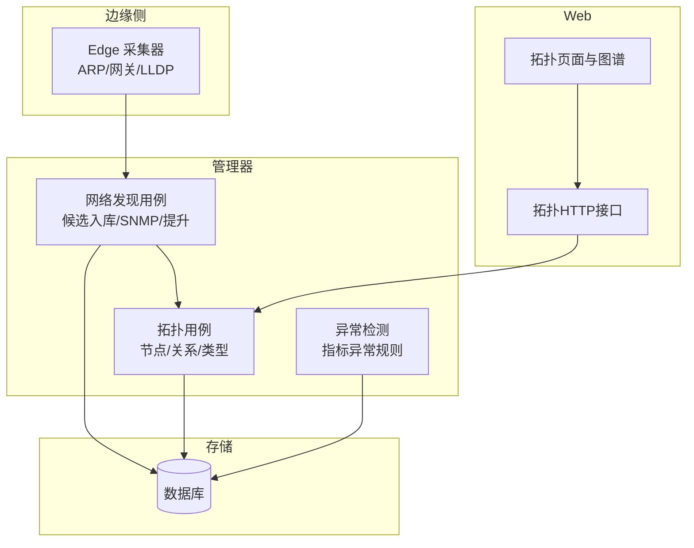
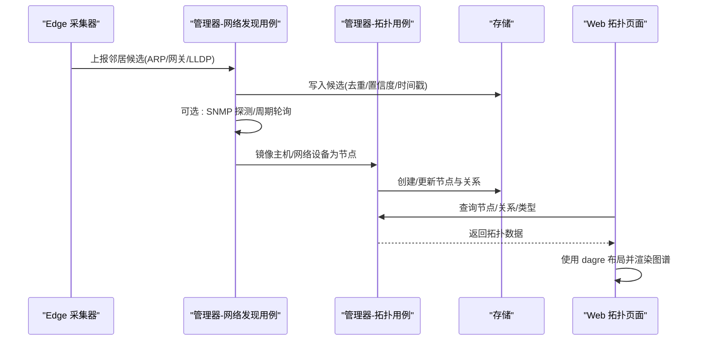
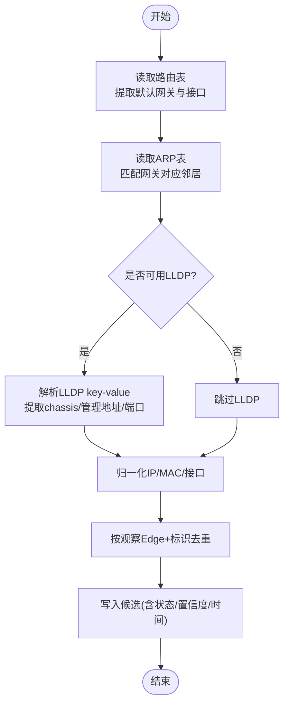
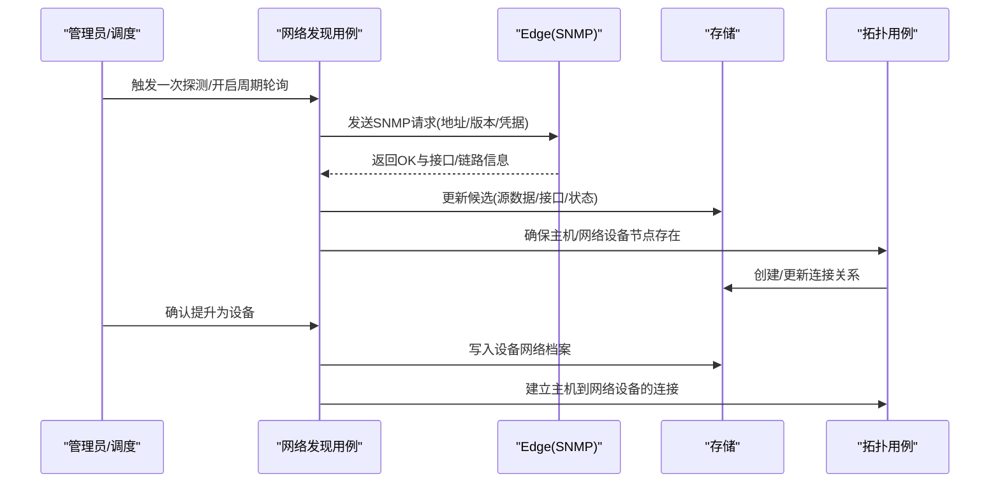
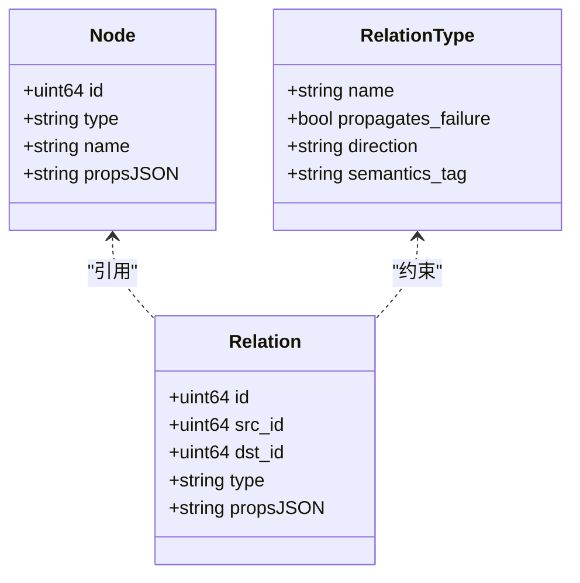
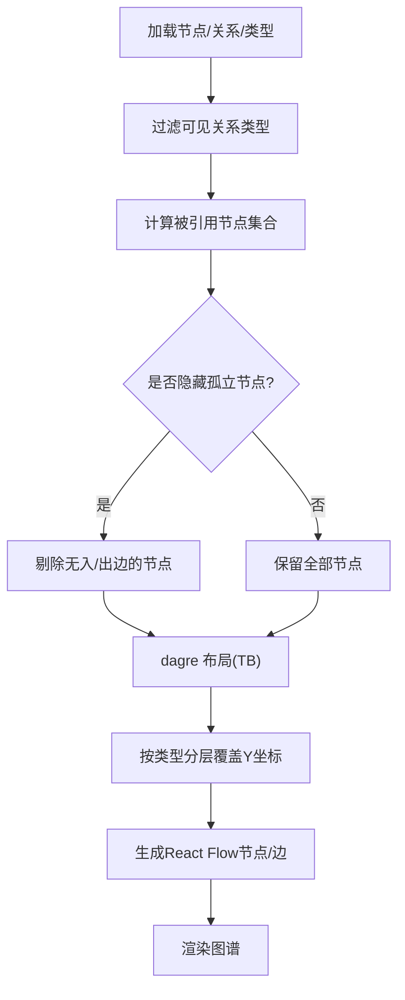
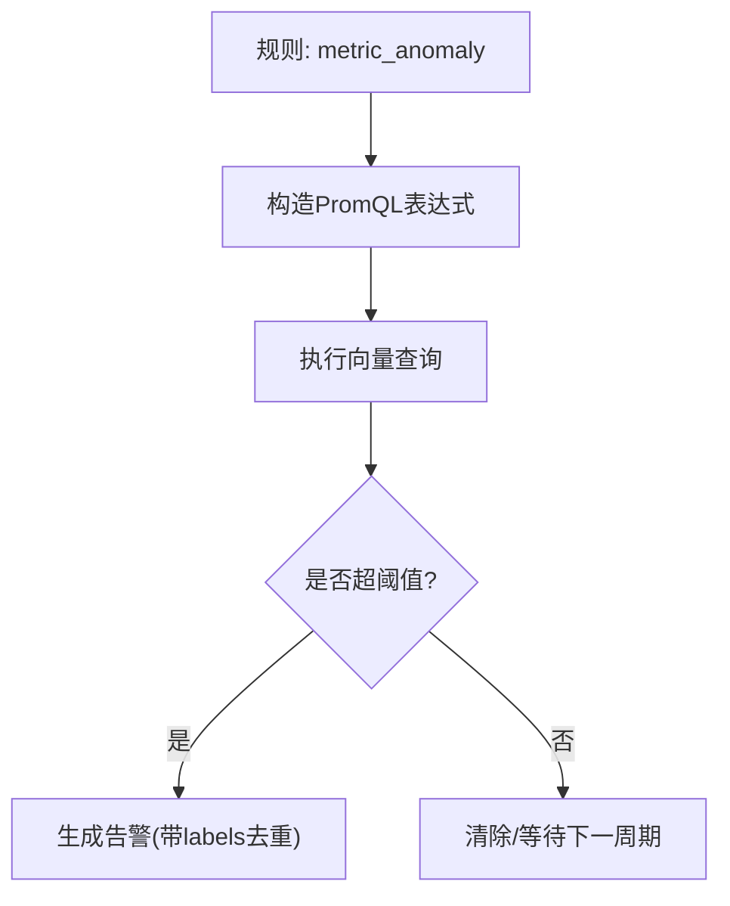
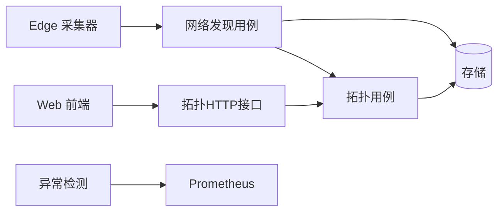

# 网络分析工具

<cite>
**本文引用的文件**
- [README.md](file://README.md)
- [internal/edgeagent/collector/network_discovery.go](file://internal/edgeagent/collector/network_discovery.go)
- [internal/manager/biz/device/network_discovery.go](file://internal/manager/biz/device/network_discovery.go)
- [internal/manager/biz/topology/usecase.go](file://internal/manager/biz/topology/usecase.go)
- [internal/manager/model/topology/model.go](file://internal/manager/model/topology/model.go)
- [internal/manager/server/topology/http.go](file://internal/manager/server/topology/http.go)
- [web/src/api/topology.ts](file://web/src/api/topology.ts)
- [web/src/components/topology/Graph.tsx](file://web/src/components/topology/Graph.tsx)
- [web/src/pages/Topology.tsx](file://web/src/pages/Topology.tsx)
- [internal/manager/biz/alert/rules.go](file://internal/manager/biz/alert/rules.go)
- [internal/manager/biz/alert/evaluators_phaseA.go](file://internal/manager/biz/alert/evaluators_phaseA.go)
</cite>

## 目录
1. [简介](#简介)
2. [项目结构](#项目结构)
3. [核心组件](#核心组件)
4. [架构总览](#架构总览)
5. [详细组件分析](#详细组件分析)
6. [依赖关系分析](#依赖关系分析)
7. [性能考量](#性能考量)
8. [故障排查指南](#故障排查指南)
9. [结论](#结论)
10. [附录](#附录)

## 简介
本技术文档面向网络分析能力，覆盖拓扑发现、异常边检测、网络清单与可视化展示、性能分析与故障定位方法、优化建议与最佳实践，以及拓扑数据更新机制与缓存策略。系统通过 Edge 侧被动采集邻居信息（ARP、网关、LLDP），在管理器侧进行候选去重、SNMP 增强与设备提升，最终映射到通用拓扑图；同时提供指标异常检测规则（z-score/MAD）用于网络性能告警与根因定位。

## 项目结构
- 边缘采集：Edge 进程读取本地路由表、ARP 表与 LLDP 输出，生成“邻居候选”上报。
- 管理器业务层：接收候选并持久化，支持 SNMP 探测、设备提升、周期性轮询与接口同步。
- 拓扑服务：将物理邻接关系镜像为通用节点/关系图，并提供 HTTP API。
- Web 前端：拓扑图谱渲染、节点/关系管理、类型注册与过滤。
- 异常检测：基于 Prometheus 的指标异常规则（z-score/MAD）实现阈值告警。

图表来源
- [internal/edgeagent/collector/network_discovery.go:18-113](file://internal/edgeagent/collector/network_discovery.go#L18-L113)
- [internal/manager/biz/device/network_discovery.go:82-129](file://internal/manager/biz/device/network_discovery.go#L82-L129)
- [internal/manager/biz/topology/usecase.go:15-38](file://internal/manager/biz/topology/usecase.go#L15-L38)
- [internal/manager/server/topology/http.go:48-76](file://internal/manager/server/topology/http.go#L48-L76)
- [web/src/components/topology/Graph.tsx:208-231](file://web/src/components/topology/Graph.tsx#L208-L231)

章节来源
- [README.md:43-57](file://README.md#L43-L57)

## 核心组件
- 网络发现采集器：从 Linux 内核态读取路由与 ARP，解析 LLDP key-value，过滤虚拟接口，归一化 MAC/IP，生成候选上报。
- 网络发现用例：对候选进行去重、置信度评估、状态推进，支持一次性 SNMP 探测与周期性轮询，维护设备网络档案与接口快照。
- 拓扑镜像与关系：将主机与网络设备映射为拓扑节点，建立“连接”关系；提供节点/关系/类型的 CRUD 与校验。
- Web 拓扑视图：使用 dagre + React Flow 布局，按层级分层显示，支持隐藏孤立节点、关系类型过滤与拖拽位置保持。
- 异常检测：基于 PromQL 的滚动基线（均值±n×标准差或中位数±MAD）计算偏离度，触发指标异常告警。

章节来源
- [internal/edgeagent/collector/network_discovery.go:18-113](file://internal/edgeagent/collector/network_discovery.go#L18-L113)
- [internal/manager/biz/device/network_discovery.go:82-129](file://internal/manager/biz/device/network_discovery.go#L82-L129)
- [internal/manager/biz/topology/usecase.go:150-246](file://internal/manager/biz/topology/usecase.go#L150-L246)
- [web/src/components/topology/Graph.tsx:311-383](file://web/src/components/topology/Graph.tsx#L311-L383)
- [internal/manager/biz/alert/evaluators_phaseA.go:148-202](file://internal/manager/biz/alert/evaluators_phaseA.go#L148-L202)

## 架构总览
系统采用“边缘采集 + 管理器处理 + 通用拓扑图 + Web 可视化 + 异常检测”的分层架构。Edge 仅做被动采集，不发送凭证；管理器负责候选治理、SNMP 增强、拓扑镜像与对外 API；Web 通过统一拓扑 API 获取节点与关系进行渲染。

图表来源
- [internal/edgeagent/collector/network_discovery.go:43-113](file://internal/edgeagent/collector/network_discovery.go#L43-L113)
- [internal/manager/biz/device/network_discovery.go:544-591](file://internal/manager/biz/device/network_discovery.go#L544-L591)
- [internal/manager/biz/topology/usecase.go:294-370](file://internal/manager/biz/topology/usecase.go#L294-L370)
- [internal/manager/server/topology/http.go:169-199](file://internal/manager/server/topology/http.go#L169-L199)
- [web/src/components/topology/Graph.tsx:311-383](file://web/src/components/topology/Graph.tsx#L311-L383)

## 详细组件分析

### 拓扑发现与候选入库
- 采集来源
  - 网关与 ARP：解析 /proc/net/route 与 /proc/net/arp，仅保留非虚拟接口，聚合网关与其 ARP 邻居。
  - LLDP：调用 lldpctl 解析 key-value，提取 chassis ID、管理地址、远端端口等，优先选择 IPv4 管理地址。
- 去重与标准化
  - 以“观察 Edge + IP/MAC/接口”作为稳定键，避免重复入库。
  - 归一化 MAC 格式，过滤无效条目。
- 入库与状态
  - 候选记录包含来源、源数据、接口与链路 JSON、状态与置信度。
  - 强身份（如 LLDP chassis ID、SNMP engine ID、桥基MAC）可提升置信度与状态。

图表来源
- [internal/edgeagent/collector/network_discovery.go:73-113](file://internal/edgeagent/collector/network_discovery.go#L73-L113)
- [internal/edgeagent/collector/network_discovery.go:149-203](file://internal/edgeagent/collector/network_discovery.go#L149-L203)
- [internal/edgeagent/collector/network_discovery.go:205-275](file://internal/edgeagent/collector/network_discovery.go#L205-L275)
- [internal/manager/biz/device/network_discovery.go:544-591](file://internal/manager/biz/device/network_discovery.go#L544-L591)

章节来源
- [internal/edgeagent/collector/network_discovery.go:18-113](file://internal/edgeagent/collector/network_discovery.go#L18-L113)
- [internal/manager/biz/device/network_discovery.go:544-591](file://internal/manager/biz/device/network_discovery.go#L544-L591)

### SNMP 增强与设备提升
- 一次性探测：通过隧道调用 Edge 执行只读 SNMP 探测，合并 sysName、sysDescription、引擎ID、接口列表与链路信息，更新候选并推进状态。
- 周期轮询：配置轮询间隔与凭据名（明文值不落盘），定时拉取接口统计与可达性，更新设备档案与最近可达时间。
- 设备提升：管理员确认后，将候选提升为设备，建立与观测主机的拓扑连接，并标记设备类型为 network。

图表来源
- [internal/manager/biz/device/network_discovery.go:232-289](file://internal/manager/biz/device/network_discovery.go#L232-L289)
- [internal/manager/biz/device/network_discovery.go:310-380](file://internal/manager/biz/device/network_discovery.go#L310-L380)
- [internal/manager/biz/device/network_discovery.go:422-461](file://internal/manager/biz/device/network_discovery.go#L422-L461)
- [internal/manager/biz/topology/usecase.go:294-370](file://internal/manager/biz/topology/usecase.go#L294-L370)

章节来源
- [internal/manager/biz/device/network_discovery.go:138-289](file://internal/manager/biz/device/network_discovery.go#L138-L289)
- [internal/manager/biz/device/network_discovery.go:310-380](file://internal/manager/biz/device/network_discovery.go#L310-L380)
- [internal/manager/biz/device/network_discovery.go:422-461](file://internal/manager/biz/device/network_discovery.go#L422-L461)

### 拓扑构建算法与可视化
- 节点与关系模型：通用有向图，节点承载实体（device/service/cluster/app 等），关系携带语义标签（传播方向、是否传播故障）。
- 镜像逻辑：设备注册时确保节点存在；网络设备节点额外标记 device_kind=network；主机与网络设备之间建立“connected_to”关系。
- 前端布局：使用 dagre 自上而下布局，按类型分层；隐藏无关联节点；支持关系类型过滤与拖拽位置保持。

图表来源
- [internal/manager/model/topology/model.go:1-18](file://internal/manager/model/topology/model.go#L1-L18)
- [internal/manager/biz/topology/usecase.go:150-246](file://internal/manager/biz/topology/usecase.go#L150-L246)

图表来源
- [web/src/components/topology/Graph.tsx:311-383](file://web/src/components/topology/Graph.tsx#L311-L383)

章节来源
- [internal/manager/biz/topology/usecase.go:294-370](file://internal/manager/biz/topology/usecase.go#L294-L370)
- [web/src/components/topology/Graph.tsx:208-231](file://web/src/components/topology/Graph.tsx#L208-L231)
- [web/src/components/topology/Graph.tsx:311-383](file://web/src/components/topology/Graph.tsx#L311-L383)

### 网络清单与邻居查询
- 清单能力：列出已验证的网络设备（SNMP 身份、可达性、管理地址、发现来源、接口/链路计数），不包含敏感凭据。
- 邻居查询：针对某网络设备，返回已验证的邻接主机或对端节点、发现来源、观察者 Edge 与最近观察时间。
- 限制与保护：调用超时、分页上限、参数规范化，避免大结果集影响性能。

章节来源
- [internal/manager/biz/aiops/tools/network_inventory_basetool.go:18-48](file://internal/manager/biz/aiops/tools/network_inventory_basetool.go#L18-L48)
- [internal/manager/biz/aiops/tools/network_inventory_basetool.go:119-150](file://internal/manager/biz/aiops/tools/network_inventory_basetool.go#L119-L150)
- [internal/manager/biz/aiops/tools/network_inventory_basetool.go:339-385](file://internal/manager/biz/aiops/tools/network_inventory_basetool.go#L339-L385)

### 异常边检测与指标异常
- 规则定义：支持 metric_anomaly 规则，指定指标、选择器、方法（zscore/mad）、基线窗口与步长、偏差倍数与持续时间。
- 评估过程：将规则编译为 PromQL，计算当前值相对基线的偏离度；当超过阈值持续 for_seconds 则触发告警。
- 作用范围：不同边（标签组合）独立去重，便于定位具体网络路径上的异常。

图表来源
- [internal/manager/biz/alert/rules.go:48-70](file://internal/manager/biz/alert/rules.go#L48-L70)
- [internal/manager/biz/alert/rules.go:567-575](file://internal/manager/biz/alert/rules.go#L567-L575)
- [internal/manager/biz/alert/evaluators_phaseA.go:148-202](file://internal/manager/biz/alert/evaluators_phaseA.go#L148-L202)

章节来源
- [internal/manager/biz/alert/rules.go:48-70](file://internal/manager/biz/alert/rules.go#L48-L70)
- [internal/manager/biz/alert/rules.go:567-575](file://internal/manager/biz/alert/rules.go#L567-L575)
- [internal/manager/biz/alert/evaluators_phaseA.go:148-202](file://internal/manager/biz/alert/evaluators_phaseA.go#L148-L202)

### 拓扑数据更新机制与缓存策略
- 更新机制
  - 候选入库：批量去重后 upsert，保证同一观察视角下的重复邻居幂等。
  - 拓扑镜像：设备注册与网络设备提升时确保节点存在并更新属性；连接关系去重与属性更新。
  - 周期轮询：按间隔拉取 SNMP 接口与可达性，更新设备档案与最近可达时间。
- 缓存策略
  - 未发现显式内存缓存；通过“幂等 upsert + 最小化变更”减少写放大。
  - Web 侧通过 React 状态与 useMemo 缓存布局结果，避免重复计算。
  - 前端对节点详情邻居采用并行 GET 填充名称，减少往返次数。

章节来源
- [internal/manager/biz/device/network_discovery.go:544-591](file://internal/manager/biz/device/network_discovery.go#L544-L591)
- [internal/manager/biz/topology/usecase.go:222-246](file://internal/manager/biz/topology/usecase.go#L222-L246)
- [web/src/components/topology/Graph.tsx:219-231](file://web/src/components/topology/Graph.tsx#L219-L231)
- [web/src/pages/Topology.tsx:370-397](file://web/src/pages/Topology.tsx#L370-L397)

## 依赖关系分析
- 模块耦合
  - Edge 采集器仅依赖系统文件与 lldpctl，不依赖管理器。
  - 管理器网络发现用例依赖存储、拓扑镜像与凭据解析，但不直接引入设置域，降低耦合。
  - 拓扑用例封装节点/关系/类型操作，对外暴露统一 Usecase。
- 外部集成点
  - Prometheus：指标异常规则查询。
  - SNMP：通过 Edge 隧道访问网络设备。
  - Web 前端：通过 REST API 获取拓扑数据。

图表来源
- [internal/edgeagent/collector/network_discovery.go:18-113](file://internal/edgeagent/collector/network_discovery.go#L18-L113)
- [internal/manager/biz/device/network_discovery.go:82-129](file://internal/manager/biz/device/network_discovery.go#L82-L129)
- [internal/manager/biz/topology/usecase.go:15-38](file://internal/manager/biz/topology/usecase.go#L15-L38)
- [internal/manager/server/topology/http.go:48-76](file://internal/manager/server/topology/http.go#L48-L76)
- [internal/manager/biz/alert/evaluators_phaseA.go:148-202](file://internal/manager/biz/alert/evaluators_phaseA.go#L148-L202)

章节来源
- [internal/manager/biz/device/network_discovery.go:82-129](file://internal/manager/biz/device/network_discovery.go#L82-L129)
- [internal/manager/biz/topology/usecase.go:15-38](file://internal/manager/biz/topology/usecase.go#L15-L38)
- [internal/manager/server/topology/http.go:48-76](file://internal/manager/server/topology/http.go#L48-L76)

## 性能考量
- 采集阶段
  - 过滤虚拟接口，避免噪声。
  - 批量去重与上限控制，防止候选爆炸。
- 管理器阶段
  - 周期轮询串行化，避免拥塞 Edge 通道。
  - 仅更新必要字段，减少写放大。
- 前端阶段
  - 使用 dagre 布局并缓存结果，避免重复计算。
  - 隐藏孤立节点，减少视觉噪音与渲染压力。
  - 并行获取邻居节点名称，降低 RTT。

## 故障排查指南
- 候选未入库
  - 检查 Edge 是否启用网络发现、候选数量是否超限、观察时间是否在合理范围内。
- SNMP 失败
  - 检查凭据是否可用、版本与社区/用户名是否正确、目标地址是否存在。
- 拓扑未更新
  - 确认设备已提升为网络节点、主机与网络设备之间存在连接关系。
- 异常未触发
  - 检查指标是否在闭集中、选择器是否匹配、基线窗口与步长是否合理、偏差倍数与持续时间是否过严。

章节来源
- [internal/manager/biz/device/network_discovery.go:138-206](file://internal/manager/biz/device/network_discovery.go#L138-L206)
- [internal/manager/biz/device/network_discovery.go:232-299](file://internal/manager/biz/device/network_discovery.go#L232-L299)
- [internal/manager/biz/alert/evaluators_phaseA.go:148-202](file://internal/manager/biz/alert/evaluators_phaseA.go#L148-L202)

## 结论
该网络分析工具通过 Edge 被动采集与管理器主动增强相结合，构建了稳健的拓扑发现与可视化体系；结合指标异常检测，实现了从“发现—建模—可视—告警—定位”的闭环。建议在大规模部署中关注候选去重、SNMP 轮询节流与前端布局性能，并通过合理的异常规则调参与拓扑类型语义设计，提升根因定位效率。

## 附录
- 最佳实践
  - 合理设置 SNMP 轮询间隔（30s~86400s），避免频繁扫描。
  - 使用强身份（LLDP chassis ID、SNMP engine ID、桥基MAC）提升设备识别准确性。
  - 在前端隐藏无关关系类型，聚焦故障传播路径（depends_on/routes_to）。
  - 指标异常规则优先使用 z-score，必要时切换 MAD 以提升鲁棒性。
- 参考 API
  - 拓扑节点/关系/类型：见前端 API 客户端定义。

章节来源
- [web/src/api/topology.ts:1-227](file://web/src/api/topology.ts#L1-L227)