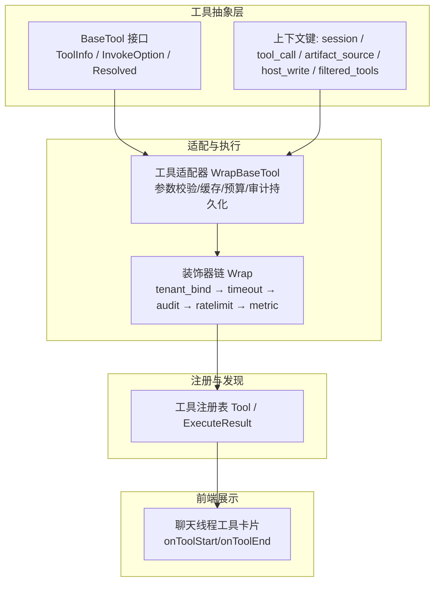
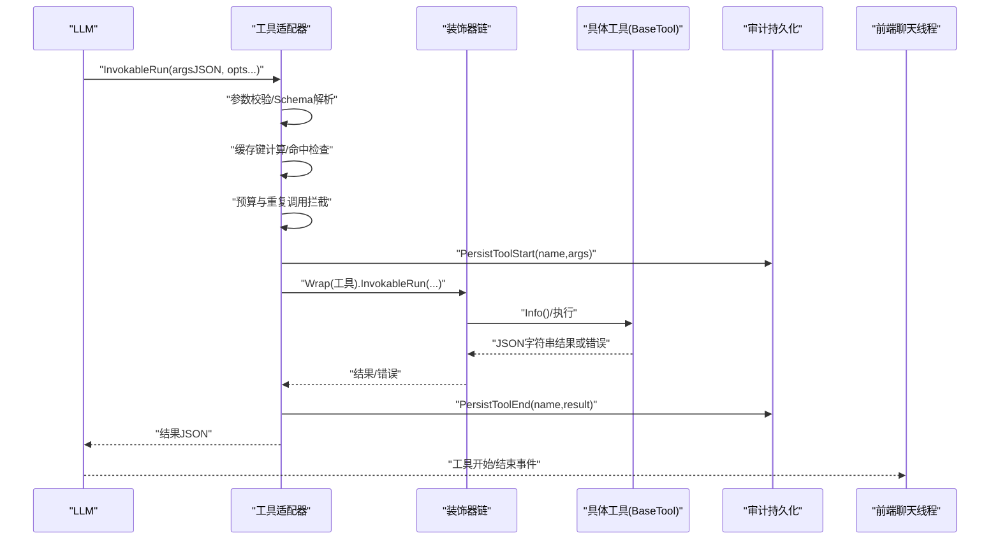
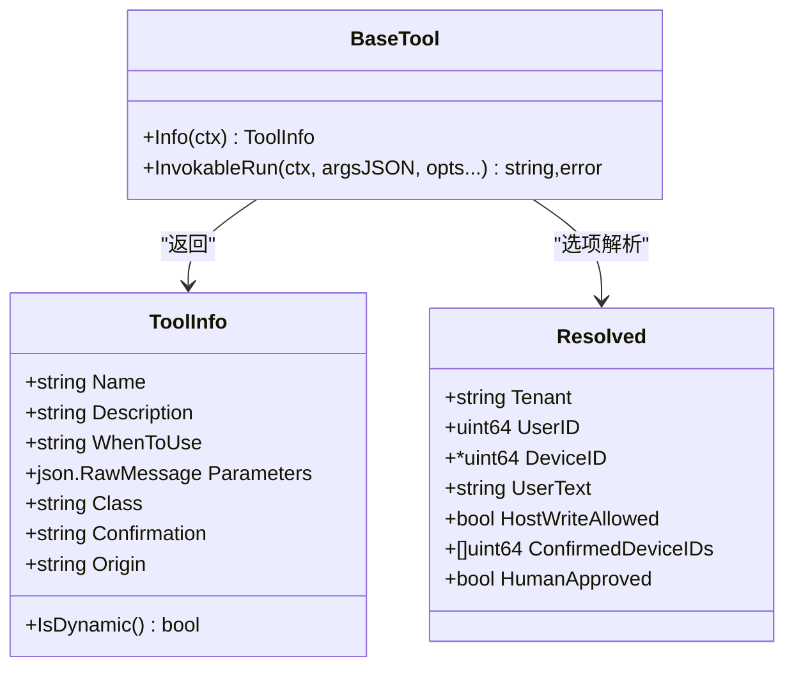
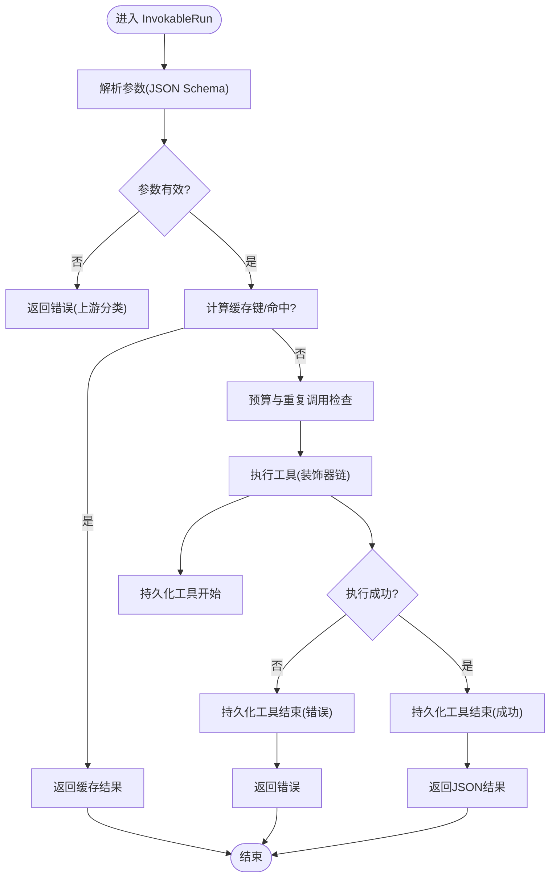
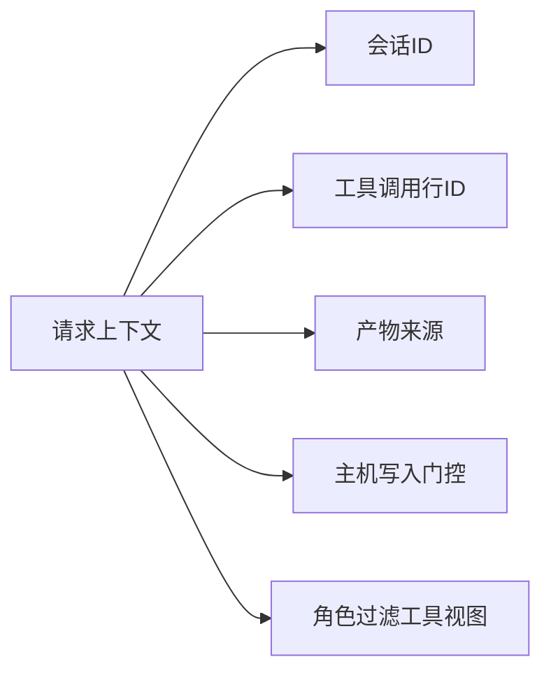
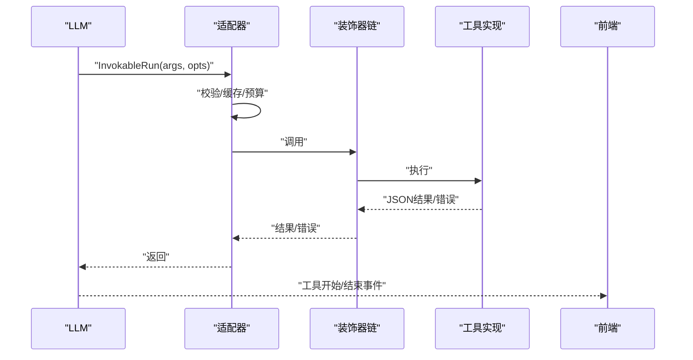
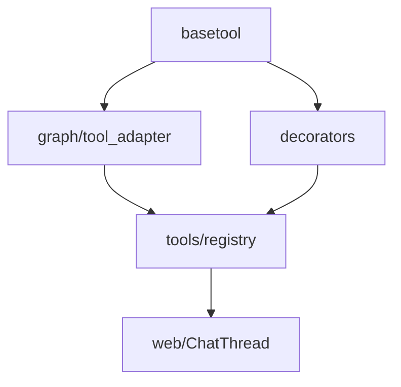

# 基础工具框架

<cite>
**本文引用的文件**
- [basetool.go](file://internal/manager/biz/aiops/tools/basetool/basetool.go)
- [session.go](file://internal/manager/biz/aiops/tools/basetool/session.go)
- [tool_call.go](file://internal/manager/biz/aiops/tools/basetool/tool_call.go)
- [artifact_source.go](file://internal/manager/biz/aiops/tools/basetool/artifact_source.go)
- [host_write.go](file://internal/manager/biz/aiops/tools/basetool/host_write.go)
- [filtered_tools.go](file://internal/manager/biz/aiops/tools/basetool/filtered_tools.go)
- [operation.go](file://internal/manager/biz/aiops/tools/basetool/operation.go)
- [tool_adapter.go](file://internal/manager/biz/aiops/graph/tool_adapter.go)
- [registry.go](file://internal/manager/biz/aiops/tools/registry.go)
- [decorators_test.go](file://internal/manager/biz/aiops/tools/decorators/decorators_test.go)
- [basetool_decorated_test.go](file://internal/manager/biz/aiops/tools/basetool_decorated_test.go)
- [ChatThread.tsx](file://web/src/pages/ChatThread.tsx)
- [types.go](file://internal/skill/types.go)
</cite>

## 目录
1. [简介](#简介)
2. [项目结构](#项目结构)
3. [核心组件](#核心组件)
4. [架构总览](#架构总览)
5. [详细组件分析](#详细组件分析)
6. [依赖关系分析](#依赖关系分析)
7. [性能考量](#性能考量)
8. [故障排查指南](#故障排查指南)
9. [结论](#结论)
10. [附录](#附录)

## 简介
本技术文档围绕 ongrid 的基础工具框架，系统性阐述 BaseTool 基类的设计模式、参数验证与错误处理、结果格式化、会话上下文传递、状态保持与资源清理、工具调用的标准化生命周期、工具间通信机制、自定义工具开发模板与最佳实践，以及性能优化与安全控制要点。文档以代码级为依据，提供可视化图示与可追溯的源码定位，帮助读者快速理解并安全扩展该框架。

## 项目结构
基础工具框架位于 manager 侧 AIOPS 子系统中，核心由“工具抽象层（basetool）+ 适配器层（graph）+ 装饰器链（decorators）+ 注册表（tools registry）”构成，并在前端通过聊天线程事件驱动工具卡片展示。

图表来源
- [basetool.go:30-111](file://internal/manager/biz/aiops/tools/basetool/basetool.go#L30-L111)
- [tool_adapter.go:271-439](file://internal/manager/biz/aiops/graph/tool_adapter.go#L271-L439)
- [registry.go:38-59](file://internal/manager/biz/aiops/tools/registry.go#L38-L59)
- [ChatThread.tsx:281-314](file://web/src/pages/ChatThread.tsx#L281-L314)

章节来源
- [basetool.go:30-259](file://internal/manager/biz/aiops/tools/basetool/basetool.go#L30-L259)
- [tool_adapter.go:271-439](file://internal/manager/biz/aiops/graph/tool_adapter.go#L271-L439)
- [registry.go:38-59](file://internal/manager/biz/aiops/tools/registry.go#L38-L59)
- [ChatThread.tsx:281-314](file://web/src/pages/ChatThread.tsx#L281-L314)

## 核心组件
- BaseTool 接口：统一描述工具的元信息与可调用入口，包含 Info 与 InvokableRun 两个方法，分别负责声明式能力与执行式能力。
- ToolInfo：描述工具名称、描述、使用场景提示、参数 JSON Schema、影响类别、确认策略与来源标记。
- InvokeOption/Resolved：跨装饰器与工具执行的细粒度上下文注入（租户、用户、设备、人类审批等）。
- 上下文键：会话ID、工具调用行ID、产物来源、主机写入权限、按角色过滤的工具视图等，均以 context 值形式在请求内传播。
- 工具适配器：对 BaseTool 进行包装，实现参数校验、缓存、预算限制、审计持久化等横切逻辑。
- 装饰器链：将通用横切关注点（租户绑定、超时、审计、限流、指标）以组合方式应用到每个工具。
- 注册表：定义工具的结构与执行结果类型，支撑统一的工具发现与调用。

章节来源
- [basetool.go:30-259](file://internal/manager/biz/aiops/tools/basetool/basetool.go#L30-L259)
- [session.go:17-34](file://internal/manager/biz/aiops/tools/basetool/session.go#L17-L34)
- [tool_call.go:5-22](file://internal/manager/biz/aiops/tools/basetool/tool_call.go#L5-L22)
- [artifact_source.go:16-40](file://internal/manager/biz/aiops/tools/basetool/artifact_source.go#L16-L40)
- [host_write.go:17-41](file://internal/manager/biz/aiops/tools/basetool/host_write.go#L17-L41)
- [filtered_tools.go:12-33](file://internal/manager/biz/aiops/tools/basetool/filtered_tools.go#L12-L33)
- [registry.go:38-59](file://internal/manager/biz/aiops/tools/registry.go#L38-L59)

## 架构总览
下图展示了从 LLM 调用到工具执行、再到结果返回与审计记录的完整流程，包括参数校验、缓存命中、预算控制、审计持久化与前端展示。

图表来源
- [tool_adapter.go:271-439](file://internal/manager/biz/aiops/graph/tool_adapter.go#L271-L439)
- [decorators_test.go:413-441](file://internal/manager/biz/aiops/tools/decorators/decorators_test.go#L413-L441)
- [ChatThread.tsx:281-314](file://web/src/pages/ChatThread.tsx#L281-L314)

## 详细组件分析

### BaseTool 基类与工具元数据
- BaseTool 提供统一的能力声明与执行入口，确保所有工具遵循一致的契约。
- ToolInfo 中的 Parameters 字段承载 JSON Schema，用于 LLM 函数调用与 UI 表单生成；Class 与 Confirmation 共同决定是否需要人工审批或二次签名。
- Origin 字段区分内置工具与运行时发现的动态工具，便于路由策略与白名单管理。

图表来源
- [basetool.go:30-111](file://internal/manager/biz/aiops/tools/basetool/basetool.go#L30-L111)
- [basetool.go:134-259](file://internal/manager/biz/aiops/tools/basetool/basetool.go#L134-L259)

章节来源
- [basetool.go:30-259](file://internal/manager/biz/aiops/tools/basetool/basetool.go#L30-L259)

### 参数验证、错误处理与结果格式化
- 参数验证：通过 ToolInfo.Parameters 的 JSON Schema 在适配器层进行解析与校验，非法输入直接返回错误，避免进入业务逻辑。
- 错误处理：工具执行错误向上抛出，由上层统一分类为 success/error/timeout，并记录审计。
- 结果格式化：工具返回 JSON 字符串，作为 role=tool 消息回传给 LLM；同时适配器在边界处持久化开始与结束记录，保证审计一致性。

图表来源
- [tool_adapter.go:271-439](file://internal/manager/biz/aiops/graph/tool_adapter.go#L271-L439)

章节来源
- [tool_adapter.go:271-439](file://internal/manager/biz/aiops/graph/tool_adapter.go#L271-L439)

### 会话管理与上下文传递
- 会话ID：通过 WithSessionID/SessionIDFromContext 在请求上下文中传递，支持异步任务与工作区隔离。
- 工具调用行ID：WithToolCallID/ToolCallIDFromContext 用于关联审计行，便于审批卡片与流式工具卡片的绑定。
- 产物来源：ArtifactSource 标识页面或产物由聊天或工作流生成，便于 UI 展示来源列。
- 主机写入权限：AgentWriteAllowed/HostWriteAllowed 在上下文中传递全局写门控，控制 host_bash 是否走受限路径。
- 角色过滤工具视图：FilteredTools 在 persona 维度裁剪可用工具集合，避免并发共享状态竞争。

图表来源
- [session.go:17-34](file://internal/manager/biz/aiops/tools/basetool/session.go#L17-L34)
- [tool_call.go:5-22](file://internal/manager/biz/aiops/tools/basetool/tool_call.go#L5-L22)
- [artifact_source.go:16-40](file://internal/manager/biz/aiops/tools/basetool/artifact_source.go#L16-L40)
- [host_write.go:17-41](file://internal/manager/biz/aiops/tools/basetool/host_write.go#L17-L41)
- [filtered_tools.go:12-33](file://internal/manager/biz/aiops/tools/basetool/filtered_tools.go#L12-L33)

章节来源
- [session.go:17-34](file://internal/manager/biz/aiops/tools/basetool/session.go#L17-L34)
- [tool_call.go:5-22](file://internal/manager/biz/aiops/tools/basetool/tool_call.go#L5-L22)
- [artifact_source.go:16-40](file://internal/manager/biz/aiops/tools/basetool/artifact_source.go#L16-L40)
- [host_write.go:17-41](file://internal/manager/biz/aiops/tools/basetool/host_write.go#L17-L41)
- [filtered_tools.go:12-33](file://internal/manager/biz/aiops/tools/basetool/filtered_tools.go#L12-L33)

### 工具调用标准化流程（生命周期）
- 入口：LLM 调用 InvokableRun，携带参数 JSON 与可选上下文选项。
- 预处理：适配器进行参数校验、缓存键计算、预算与重复调用拦截。
- 执行：装饰器链依次应用租户绑定、超时、审计、限流、指标采集，最终调用具体工具。
- 后处理：持久化工具开始与结束记录，返回 JSON 结果给 LLM。
- 前端：聊天线程监听 onToolStart/onToolEnd 更新工具卡片状态与耗时。

图表来源
- [tool_adapter.go:271-439](file://internal/manager/biz/aiops/graph/tool_adapter.go#L271-L439)
- [decorators_test.go:413-441](file://internal/manager/biz/aiops/tools/decorators/decorators_test.go#L413-L441)
- [ChatThread.tsx:281-314](file://web/src/pages/ChatThread.tsx#L281-L314)

章节来源
- [tool_adapter.go:271-439](file://internal/manager/biz/aiops/graph/tool_adapter.go#L271-L439)
- [decorators_test.go:413-441](file://internal/manager/biz/aiops/tools/decorators/decorators_test.go#L413-L441)
- [ChatThread.tsx:281-314](file://web/src/pages/ChatThread.tsx#L281-L314)

### 工具间通信机制与数据传递
- 通过 BaseTool 的 ToolInfo.Parameters 传递结构化参数，确保 LLM 与 UI 一致。
- 通过 InvokeOption/Resolved 传递跨工具共享的上下文（租户、用户、设备、人类审批等），避免全局可变状态。
- 通过上下文键（会话ID、工具调用行ID、产物来源、主机写入门控、角色过滤工具视图）实现无侵入的数据传递。
- 通过 ExecuteResult.ResultJSON 与 DeviceID 将工具输出与目标设备关联，便于审计与追踪。

章节来源
- [basetool.go:134-259](file://internal/manager/biz/aiops/tools/basetool/basetool.go#L134-L259)
- [registry.go:38-59](file://internal/manager/biz/aiops/tools/registry.go#L38-L59)
- [session.go:17-34](file://internal/manager/biz/aiops/tools/basetool/session.go#L17-L34)
- [tool_call.go:5-22](file://internal/manager/biz/aiops/tools/basetool/tool_call.go#L5-L22)
- [artifact_source.go:16-40](file://internal/manager/biz/aiops/tools/basetool/artifact_source.go#L16-L40)
- [host_write.go:17-41](file://internal/manager/biz/aiops/tools/basetool/host_write.go#L17-L41)
- [filtered_tools.go:12-33](file://internal/manager/biz/aiops/tools/basetool/filtered_tools.go#L12-L33)

### 自定义工具开发模板与最佳实践
- 实现 BaseTool 接口：提供 Info 与 InvokableRun，确保参数 Schema 与描述清晰。
- 使用 ToolInfo.Class 与 Confirmation 明确影响范围与审批策略。
- 利用 InvokeOption 注入租户、用户、设备等信息，避免硬编码。
- 借助装饰器链获得统一的超时、审计、限流与指标能力。
- 通过上下文键传递会话ID、工具调用行ID、产物来源等，确保可观测性与可审计性。
- 参考 Skill 元数据模型（key/name/description/class/scope/params）组织能力，便于自动注册与 UI 渲染。

章节来源
- [basetool.go:30-259](file://internal/manager/biz/aiops/tools/basetool/basetool.go#L30-L259)
- [types.go:99-224](file://internal/skill/types.go#L99-L224)

## 依赖关系分析
- 工具抽象层（basetool）被适配器层（graph）与装饰器链（decorators）依赖，形成稳定的契约面。
- 适配器层依赖审计持久化接口，确保工具调用生命周期可追踪。
- 注册表（tools registry）提供统一的工具结构与执行结果类型，支撑工具发现与调用。
- 前端通过聊天线程事件与后端工具执行结果联动，形成端到端闭环。

图表来源
- [basetool.go:30-259](file://internal/manager/biz/aiops/tools/basetool/basetool.go#L30-L259)
- [tool_adapter.go:271-439](file://internal/manager/biz/aiops/graph/tool_adapter.go#L271-L439)
- [registry.go:38-59](file://internal/manager/biz/aiops/tools/registry.go#L38-L59)
- [ChatThread.tsx:281-314](file://web/src/pages/ChatThread.tsx#L281-L314)

章节来源
- [basetool.go:30-259](file://internal/manager/biz/aiops/tools/basetool/basetool.go#L30-L259)
- [tool_adapter.go:271-439](file://internal/manager/biz/aiops/graph/tool_adapter.go#L271-L439)
- [registry.go:38-59](file://internal/manager/biz/aiops/tools/registry.go#L38-L59)
- [ChatThread.tsx:281-314](file://web/src/pages/ChatThread.tsx#L281-L314)

## 性能考量
- 参数校验与缓存：适配器层基于 JSON Schema 进行参数校验，并通过缓存键减少重复执行开销。
- 预算与重复调用拦截：针对同一工具的多次调用进行预算控制，防止无限循环调用。
- 装饰器链顺序：租户绑定→超时→审计→限流→指标，确保关键横切逻辑生效且可观测。
- 上下文传递：通过 context 值传递轻量信息，避免全局可变状态带来的竞争与锁开销。

章节来源
- [tool_adapter.go:271-439](file://internal/manager/biz/aiops/graph/tool_adapter.go#L271-L439)
- [decorators_test.go:413-441](file://internal/manager/biz/aiops/tools/decorators/decorators_test.go#L413-L441)
- [basetool_decorated_test.go:131-155](file://internal/manager/biz/aiops/tools/basetool_decorated_test.go#L131-L155)

## 故障排查指南
- 参数无效：检查 ToolInfo.Parameters 的 JSON Schema 是否与传入参数匹配，适配器会在解析阶段报错。
- 超时：确认装饰器链中的超时设置是否合理，超时发生在审计之前，审计仍会记录开始时间。
- 限流拒绝：检查令牌桶配置与调用频率，限流拒绝也会产生审计记录。
- 审计缺失：确认适配器是否在边界处调用持久化工具开始与结束；若未调用，可能导致审计不完整。
- 前端工具卡片不更新：检查聊天线程是否正确订阅 onToolStart/onToolEnd 事件并更新状态。

章节来源
- [tool_adapter.go:271-439](file://internal/manager/biz/aiops/graph/tool_adapter.go#L271-L439)
- [decorators_test.go:413-441](file://internal/manager/biz/aiops/tools/decorators/decorators_test.go#L413-L441)
- [basetool_decorated_test.go:131-155](file://internal/manager/biz/aiops/tools/basetool_decorated_test.go#L131-L155)
- [ChatThread.tsx:281-314](file://web/src/pages/ChatThread.tsx#L281-L314)

## 结论
基础工具框架通过 BaseTool 统一契约、装饰器链横切关注点、适配器层参数校验与审计持久化、以及丰富的上下文键机制，实现了工具调用的标准化、可观测与可扩展。结合 Skill 元数据模型，开发者可以以最小成本新增能力，并确保安全、性能与可维护性。

## 附录
- 操作结果封装：Operation 提供稳定信封，便于客户端渲染进度、导航与后续动作。
- 工具来源标记：Origin 区分内置与动态工具，便于策略路由与白名单管理。
- 会话与工作区：会话ID用于异步任务与工作区隔离，确保命令执行环境持久化。

章节来源
- [operation.go:1-22](file://internal/manager/biz/aiops/tools/basetool/operation.go#L1-L22)
- [basetool.go:119-132](file://internal/manager/biz/aiops/tools/basetool/basetool.go#L119-L132)
- [session.go:17-34](file://internal/manager/biz/aiops/tools/basetool/session.go#L17-L34)