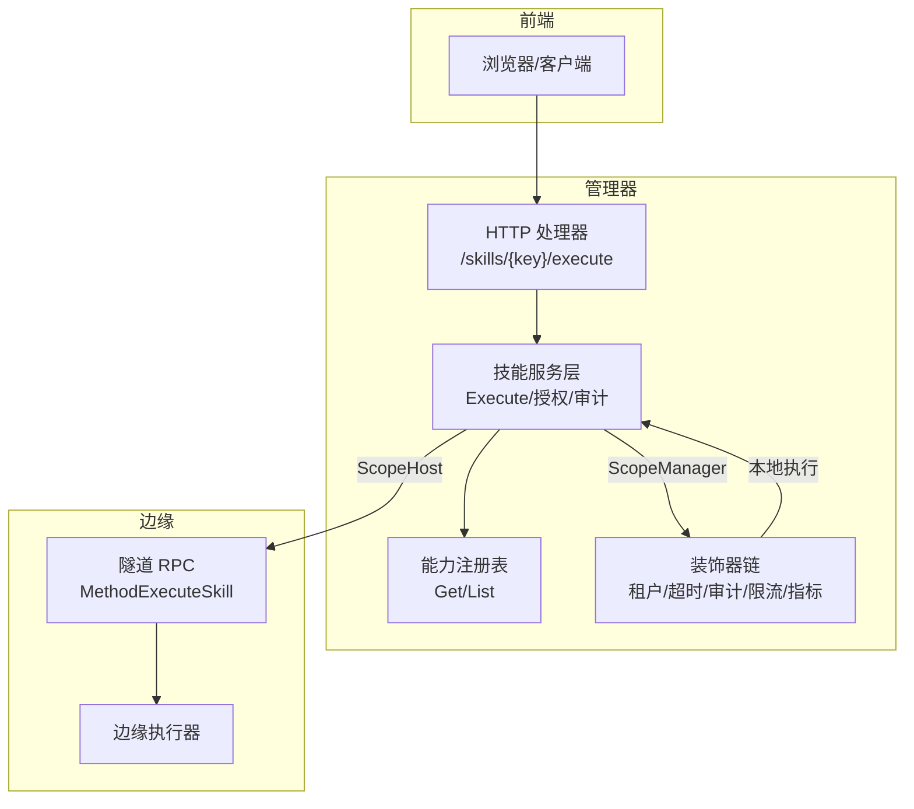
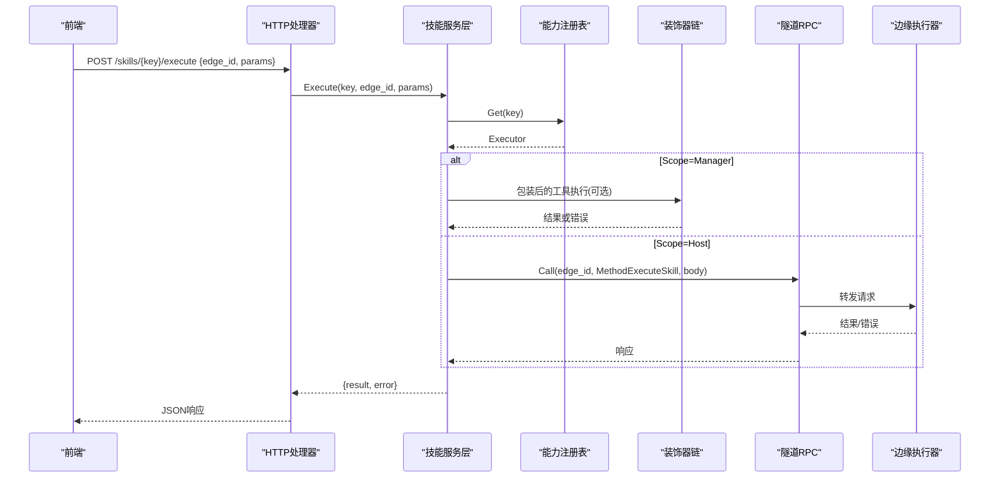
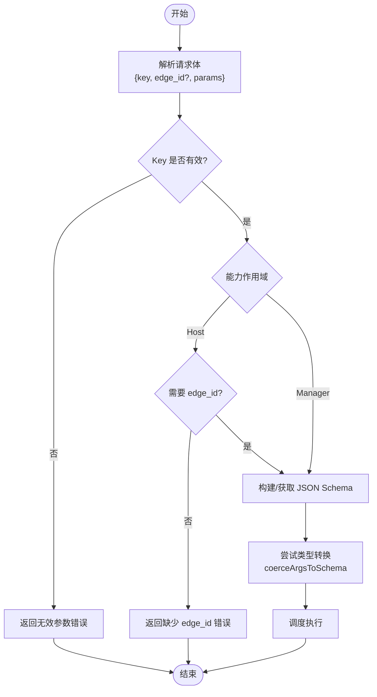
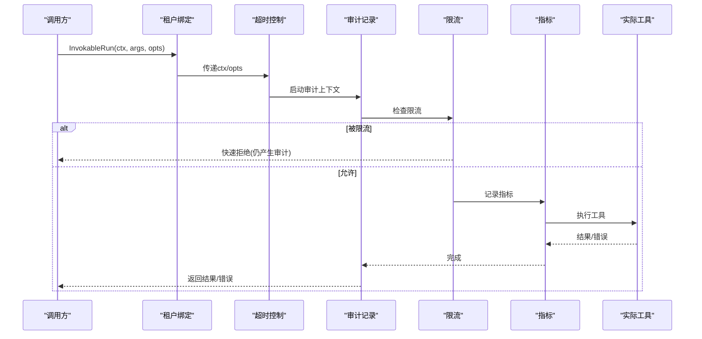
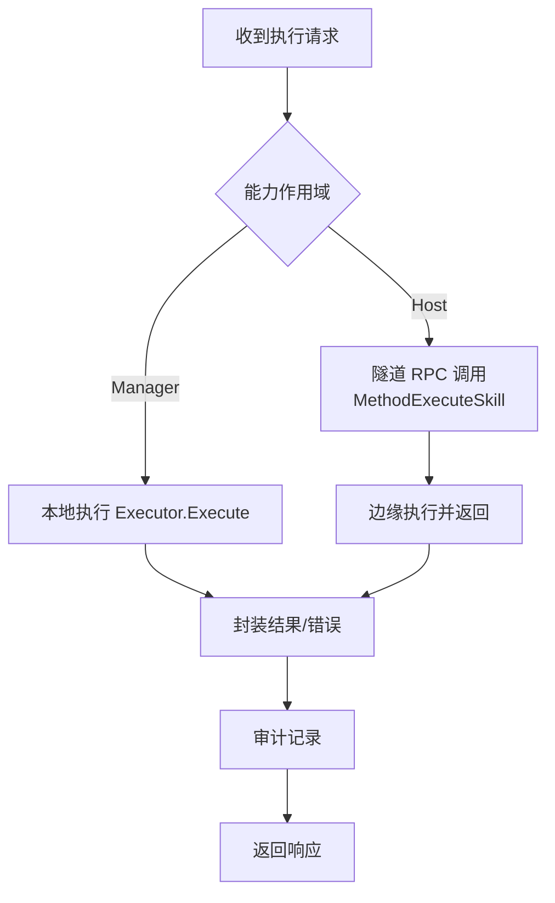
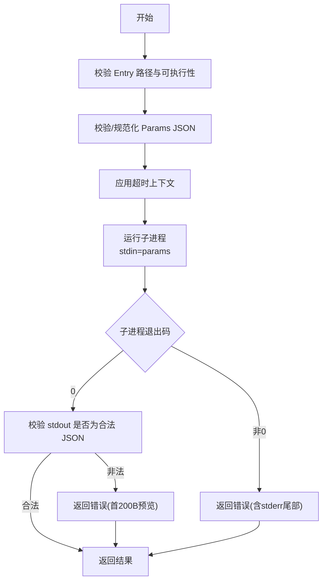
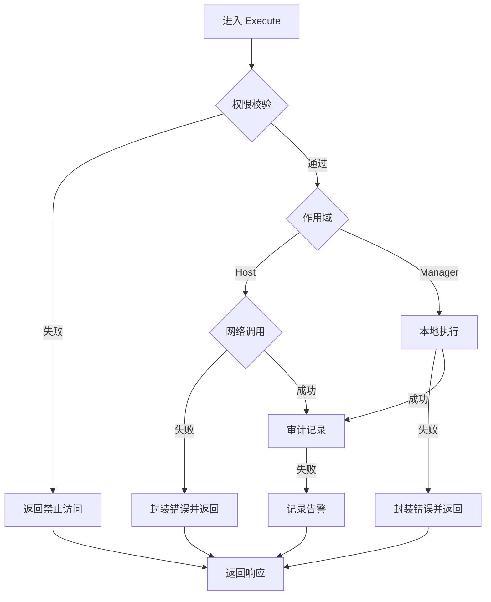
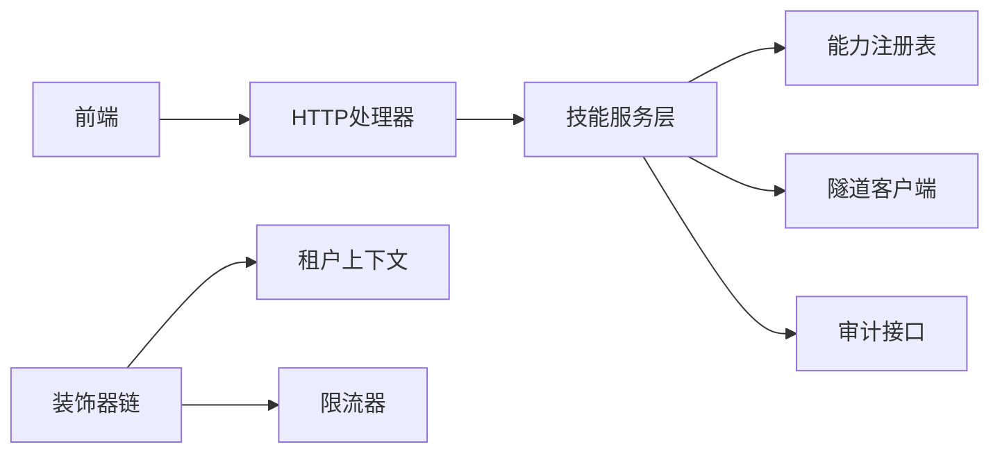

# 工具执行生命周期

<cite>
**本文引用的文件**
- [internal/skill/types.go](file://internal/skill/types.go)
- [internal/skill/schema.go](file://internal/skill/schema.go)
- [internal/skill/registry.go](file://internal/skill/registry.go)
- [internal/skill/subprocess.go](file://internal/skill/subprocess.go)
- [internal/manager/biz/skill/service.go](file://internal/manager/biz/skill/service.go)
- [internal/manager/server/skill/http.go](file://internal/manager/server/skill/http.go)
- [internal/manager/biz/aiops/tools/decorators/tenant_bind.go](file://internal/manager/biz/aiops/tools/decorators/tenant_bind.go)
- [internal/manager/biz/aiops/tools/decorators/ratelimit.go](file://internal/manager/biz/aiops/tools/decorators/ratelimit.go)
- [internal/manager/biz/aiops/tools/decorators/decorators_test.go](file://internal/manager/biz/aiops/tools/decorators/decorators_test.go)
- [internal/manager/biz/aiops/tools/basetool_decorated_test.go](file://internal/manager/biz/aiops/tools/basetool_decorated_test.go)
- [internal/pkg/tunnel/types.go](file://internal/pkg/tunnel/types.go)
- [cmd/ongrid/main.go](file://cmd/ongrid/main.go)
- [web/src/api/skills.ts](file://web/src/api/skills.ts)
</cite>

## 目录
1. [简介](#简介)
2. [项目结构](#项目结构)
3. [核心组件](#核心组件)
4. [架构总览](#架构总览)
5. [详细组件分析](#详细组件分析)
6. [依赖关系分析](#依赖关系分析)
7. [性能考量](#性能考量)
8. [故障排查指南](#故障排查指南)
9. [结论](#结论)
10. [附录](#附录)

## 简介
本文件聚焦“工具执行生命周期”，从参数解析、JSON Schema 校验、装饰器链（租户绑定、超时控制、审计、限流、指标）到结果返回的完整流程进行系统化说明。文档同时覆盖错误传播与异常处理策略、性能优化与资源管理最佳实践，以及执行跟踪与调试方法，帮助读者在理解代码实现的同时掌握可操作的运维与排障要点。

## 项目结构
围绕“技能（Skill）”这一能力单元，系统分为：
- 能力定义与注册：统一的能力元数据、参数 Schema、全局注册表
- 管理器侧编排：HTTP 入口、服务层调度、权限与审计、远程调用
- 边缘侧执行：通过隧道 RPC 分发并执行具体能力
- AI 工具装饰器链：为通用工具注入租户上下文、超时、审计、限流、指标等横切关注点
- 前端交互：构造请求体并调用后端执行接口

图表来源
- [internal/manager/server/skill/http.go:82-133](file://internal/manager/server/skill/http.go#L82-L133)
- [internal/manager/biz/skill/service.go:187-288](file://internal/manager/biz/skill/service.go#L187-L288)
- [internal/skill/registry.go:10-47](file://internal/skill/registry.go#L10-L47)
- [internal/pkg/tunnel/types.go:68-105](file://internal/pkg/tunnel/types.go#L68-L105)

章节来源
- [internal/skill/types.go:1-27](file://internal/skill/types.go#L1-L27)
- [internal/skill/registry.go:10-47](file://internal/skill/registry.go#L10-L47)
- [internal/manager/server/skill/http.go:82-133](file://internal/manager/server/skill/http.go#L82-L133)
- [internal/manager/biz/skill/service.go:187-288](file://internal/manager/biz/skill/service.go#L187-L288)
- [internal/pkg/tunnel/types.go:68-105](file://internal/pkg/tunnel/types.go#L68-L105)

## 核心组件
- 能力元数据与参数 Schema：描述能力名称、类别、作用域、参数类型与必填项，并生成 LLM 可用的 JSON Schema
- 全局注册表：进程内维护能力集合，提供按 Key 查找、枚举、分类过滤
- 管理器服务层：负责鉴权、路由（本地或远程）、审计记录、错误封装
- 装饰器链：对通用工具进行横切增强（租户绑定、超时、审计、限流、指标）
- 子进程能力：以独立进程运行外部脚本，具备输入输出限制与环境白名单
- 隧道通信：管理器与边缘之间的 RPC 通道，用于 ScopeHost 能力的远程执行

章节来源
- [internal/skill/types.go:63-125](file://internal/skill/types.go#L63-L125)
- [internal/skill/schema.go:5-20](file://internal/skill/schema.go#L5-L20)
- [internal/skill/registry.go:10-47](file://internal/skill/registry.go#L10-L47)
- [internal/manager/biz/skill/service.go:187-288](file://internal/manager/biz/skill/service.go#L187-L288)
- [internal/skill/subprocess.go:30-78](file://internal/skill/subprocess.go#L30-L78)
- [internal/pkg/tunnel/types.go:68-105](file://internal/pkg/tunnel/types.go#L68-L105)

## 架构总览
下图展示了从前端发起执行到最终返回结果的端到端流程，包括管理器与服务层、装饰器链、注册表、隧道与边缘执行器的协作。

图表来源
- [internal/manager/server/skill/http.go:82-133](file://internal/manager/server/skill/http.go#L82-L133)
- [internal/manager/biz/skill/service.go:187-288](file://internal/manager/biz/skill/service.go#L187-L288)
- [internal/skill/registry.go:35-47](file://internal/skill/registry.go#L35-L47)
- [internal/pkg/tunnel/types.go:68-105](file://internal/pkg/tunnel/types.go#L68-L105)

## 详细组件分析

### 参数解析与 JSON Schema 验证
- 能力参数由 ParamSchema 声明，ToJSONSchema 将其转换为 OpenAI 函数调用所需的 JSON Schema（object + properties + required），支持 string/int/float/bool/duration/enum/array 等类型映射
- 若能力实现 RawSchemaProvider，则使用其提供的原始 JSON Schema；否则基于 Metadata.Params 推导
- 管理器在执行前会进行基础校验（Key 非空、EdgeID 要求等），并在 ScopeHost 时强制要求 EdgeID
- 前端在构造请求时根据能力作用域决定是否携带 edge_id

图表来源
- [internal/skill/schema.go:5-20](file://internal/skill/schema.go#L5-L20)
- [internal/skill/schema.go:22-95](file://internal/skill/schema.go#L22-L95)
- [internal/manager/biz/skill/service.go:187-219](file://internal/manager/biz/skill/service.go#L187-L219)
- [cmd/ongrid/main.go:4967-5054](file://cmd/ongrid/main.go#L4967-L5054)
- [web/src/api/skills.ts:303-314](file://web/src/api/skills.ts#L303-L314)

章节来源
- [internal/skill/schema.go:5-20](file://internal/skill/schema.go#L5-L20)
- [internal/skill/schema.go:22-95](file://internal/skill/schema.go#L22-L95)
- [internal/manager/biz/skill/service.go:187-219](file://internal/manager/biz/skill/service.go#L187-L219)
- [cmd/ongrid/main.go:4967-5054](file://cmd/ongrid/main.go#L4967-L5054)
- [web/src/api/skills.ts:303-314](file://web/src/api/skills.ts#L303-L314)

### 装饰器链的执行顺序与作用机制
装饰器链以固定顺序包裹工具执行，确保横切功能一致生效：
- 租户绑定：从上下文读取租户信息，必要时向参数注入 tenant_id，并将用户 ID 与租户信息透传到后续装饰器
- 超时控制：为执行设置截止时间，避免长时间阻塞
- 审计记录：无论成功、失败或被限流，均记录审计事件
- 限流：按（工具名，用户）维度进行令牌桶限流，拒绝超限请求
- 指标：采集执行指标（如耗时、成功率）

测试用例明确断言了该顺序，并验证了即使超时或被限流，审计仍会被触发。

图表来源
- [internal/manager/biz/aiops/tools/decorators/decorators_test.go:413-441](file://internal/manager/biz/aiops/tools/decorators/decorators_test.go#L413-L441)
- [internal/manager/biz/aiops/tools/basetool_decorated_test.go:131-155](file://internal/manager/biz/aiops/tools/basetool_decorated_test.go#L131-L155)
- [internal/manager/biz/aiops/tools/decorators/tenant_bind.go:31-85](file://internal/manager/biz/aiops/tools/decorators/tenant_bind.go#L31-L85)
- [internal/manager/biz/aiops/tools/decorators/ratelimit.go:66-96](file://internal/manager/biz/aiops/tools/decorators/ratelimit.go#L66-L96)

章节来源
- [internal/manager/biz/aiops/tools/decorators/decorators_test.go:413-441](file://internal/manager/biz/aiops/tools/decorators/decorators_test.go#L413-L441)
- [internal/manager/biz/aiops/tools/basetool_decorated_test.go:131-155](file://internal/manager/biz/aiops/tools/basetool_decorated_test.go#L131-L155)
- [internal/manager/biz/aiops/tools/decorators/tenant_bind.go:31-85](file://internal/manager/biz/aiops/tools/decorators/tenant_bind.go#L31-L85)
- [internal/manager/biz/aiops/tools/decorators/ratelimit.go:66-96](file://internal/manager/biz/aiops/tools/decorators/ratelimit.go#L66-L96)

### 能力执行路径（本地 vs 远程）
- ScopeManager：在管理器进程内直接执行能力（例如 web_search、子进程能力）。错误以结构化 Error 字段返回，Result 为空
- ScopeHost：管理器通过隧道 RPC 将请求转发到边缘执行，边缘返回的结果同样以 {result, error} 形式回传

图表来源
- [internal/manager/biz/skill/service.go:187-288](file://internal/manager/biz/skill/service.go#L187-L288)
- [internal/pkg/tunnel/types.go:68-105](file://internal/pkg/tunnel/types.go#L68-L105)

章节来源
- [internal/manager/biz/skill/service.go:187-288](file://internal/manager/biz/skill/service.go#L187-L288)
- [internal/pkg/tunnel/types.go:68-105](file://internal/pkg/tunnel/types.go#L68-L105)

### 子进程能力执行与资源限制
子进程能力以独立进程运行外部脚本，具备以下安全与资源保护：
- 输入参数校验：空参数转为 "{}"，非法 JSON 直接报错
- 超时控制：默认超时时间，可通过配置覆盖
- 输出限制：stdout 最大字节数限制，stderr 仅保留尾部片段用于诊断
- 环境隔离：仅白名单环境变量传递给子进程
- 退出码处理：非零退出码视为错误，附带 stderr 摘要

图表来源
- [internal/skill/subprocess.go:99-172](file://internal/skill/subprocess.go#L99-L172)
- [internal/skill/subprocess.go:174-205](file://internal/skill/subprocess.go#L174-L205)
- [internal/skill/subprocess.go:207-268](file://internal/skill/subprocess.go#L207-L268)

章节来源
- [internal/skill/subprocess.go:99-172](file://internal/skill/subprocess.go#L99-L172)
- [internal/skill/subprocess.go:174-205](file://internal/skill/subprocess.go#L174-L205)
- [internal/skill/subprocess.go:207-268](file://internal/skill/subprocess.go#L207-L268)

### 错误传播与异常处理策略
- 管理器服务层：
  - 参数校验失败：返回无效参数错误
  - 未知能力：返回未找到错误
  - 作用域为 Host 且缺少 EdgeID：返回无效参数错误
  - 远程调用失败：将错误字符串写入 Error 字段并向上返回
  - 审计记录失败：记录告警日志但不中断主流程
- 子进程能力：
  - 参数非法、路径不可执行、超时、非零退出码、stdout 非 JSON 等均返回错误
- 前端友好提示：
  - 将 Go JSON 反序列化错误转换为更友好的提示（如数组类型不匹配）

图表来源
- [internal/manager/biz/skill/service.go:187-288](file://internal/manager/biz/skill/service.go#L187-L288)
- [internal/skill/subprocess.go:99-172](file://internal/skill/subprocess.go#L99-L172)
- [cmd/ongrid/main.go:4967-5054](file://cmd/ongrid/main.go#L4967-L5054)

章节来源
- [internal/manager/biz/skill/service.go:187-288](file://internal/manager/biz/skill/service.go#L187-L288)
- [internal/skill/subprocess.go:99-172](file://internal/skill/subprocess.go#L99-L172)
- [cmd/ongrid/main.go:4967-5054](file://cmd/ongrid/main.go#L4967-L5054)

## 依赖关系分析
- 管理器服务层依赖：
  - 能力注册表：用于按 Key 查找 Executor
  - 隧道客户端：用于 ScopeHost 的远程调用
  - 审计接口：用于记录执行事件
- 装饰器链依赖：
  - 租户上下文：用于注入 tenant_id 和用户标识
  - 限流器：按（工具名，用户）维度进行速率控制
- 前端依赖：
  - 根据能力作用域决定是否携带 edge_id

图表来源
- [internal/manager/server/skill/http.go:82-133](file://internal/manager/server/skill/http.go#L82-L133)
- [internal/manager/biz/skill/service.go:187-288](file://internal/manager/biz/skill/service.go#L187-L288)
- [internal/skill/registry.go:35-47](file://internal/skill/registry.go#L35-L47)
- [internal/manager/biz/aiops/tools/decorators/tenant_bind.go:31-85](file://internal/manager/biz/aiops/tools/decorators/tenant_bind.go#L31-L85)
- [internal/manager/biz/aiops/tools/decorators/ratelimit.go:66-96](file://internal/manager/biz/aiops/tools/decorators/ratelimit.go#L66-L96)
- [web/src/api/skills.ts:303-314](file://web/src/api/skills.ts#L303-L314)

章节来源
- [internal/manager/server/skill/http.go:82-133](file://internal/manager/server/skill/http.go#L82-L133)
- [internal/manager/biz/skill/service.go:187-288](file://internal/manager/biz/skill/service.go#L187-L288)
- [internal/skill/registry.go:35-47](file://internal/skill/registry.go#L35-L47)
- [internal/manager/biz/aiops/tools/decorators/tenant_bind.go:31-85](file://internal/manager/biz/aiops/tools/decorators/tenant_bind.go#L31-L85)
- [internal/manager/biz/aiops/tools/decorators/ratelimit.go:66-96](file://internal/manager/biz/aiops/tools/decorators/ratelimit.go#L66-L96)
- [web/src/api/skills.ts:303-314](file://web/src/api/skills.ts#L303-L314)

## 性能考量
- 参数类型自动转换：在调用前尝试将字符串值转换为目标类型（数组、数字、布尔、对象），减少下游反序列化失败与重试
- 子进程资源限制：
  - stdout 最大字节限制，防止内存膨胀
  - stderr 仅保留尾部片段，降低内存占用
  - 默认超时控制，避免长时间挂起
- 装饰器链中的限流：按（工具名，用户）维度进行令牌桶限流，快速拒绝超限请求，避免雪崩
- 审计记录失败不影响主流程：仅记录告警，保证高可用

[本节为通用指导，无需特定文件引用]

## 故障排查指南
- 参数类型不匹配：
  - 现象：Go JSON 反序列化错误，如期望数组但收到标量
  - 处理：前端会将错误转换为友好提示，建议检查字段类型或使用数组包裹
- 子进程能力失败：
  - 现象：非零退出码、stdout 非 JSON、超时
  - 处理：查看错误消息中的 stderr 尾部与首 200B 输出，定位脚本问题
- 远程调用失败：
  - 现象：Error 字段包含网络或远端错误信息
  - 处理：检查 EdgeID、网络连接、边缘服务状态
- 审计记录失败：
  - 现象：日志中出现审计记录失败的告警
  - 处理：检查审计存储可用性，不影响主流程

章节来源
- [cmd/ongrid/main.go:4967-5054](file://cmd/ongrid/main.go#L4967-L5054)
- [internal/skill/subprocess.go:99-172](file://internal/skill/subprocess.go#L99-L172)
- [internal/manager/biz/skill/service.go:261-288](file://internal/manager/biz/skill/service.go#L261-L288)

## 结论
本系统通过统一的“能力”抽象与装饰器链，实现了从参数解析、Schema 校验、横切关注点到结果返回的完整生命周期管理。管理器与服务层解耦清晰，支持本地与远程两种执行路径，并通过严格的资源限制与错误封装保障稳定性。结合审计与指标，便于追踪与优化。

[本节为总结，无需特定文件引用]

## 附录
- 关键流程图与序列图已在各小节中给出，便于对照源码理解执行路径
- 如需进一步调试，建议：
  - 启用详细日志与审计记录
  - 检查装饰器链顺序与限流配置
  - 针对子进程能力，捕获 stderr 与 stdout 片段进行分析

[本节为补充说明，无需特定文件引用]