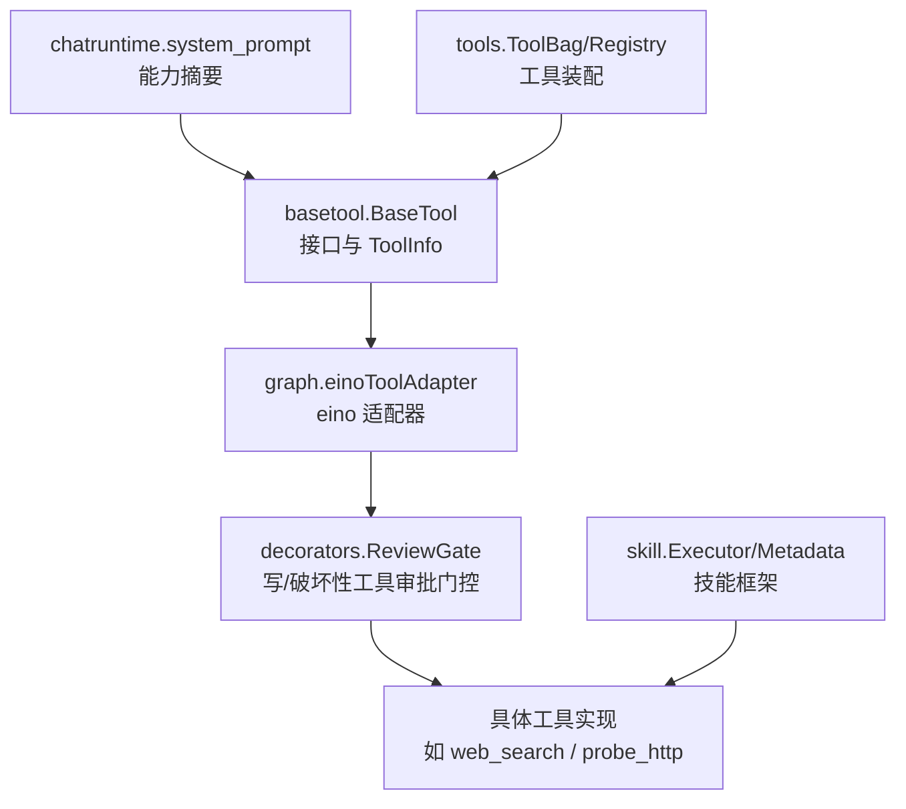
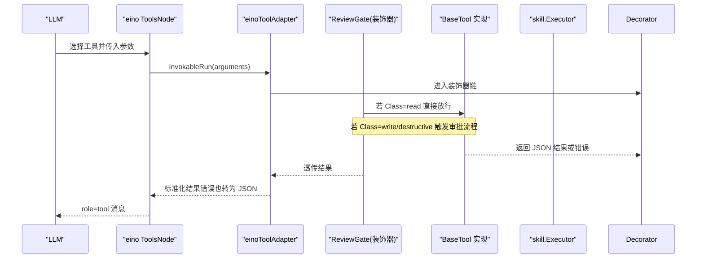
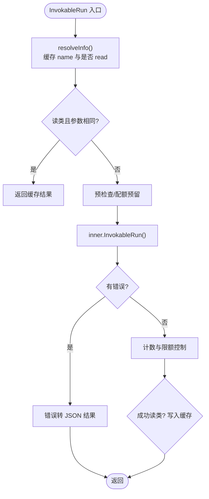
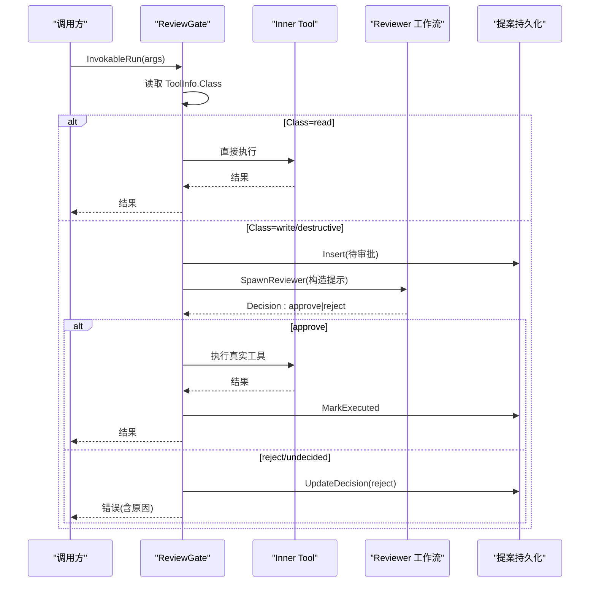
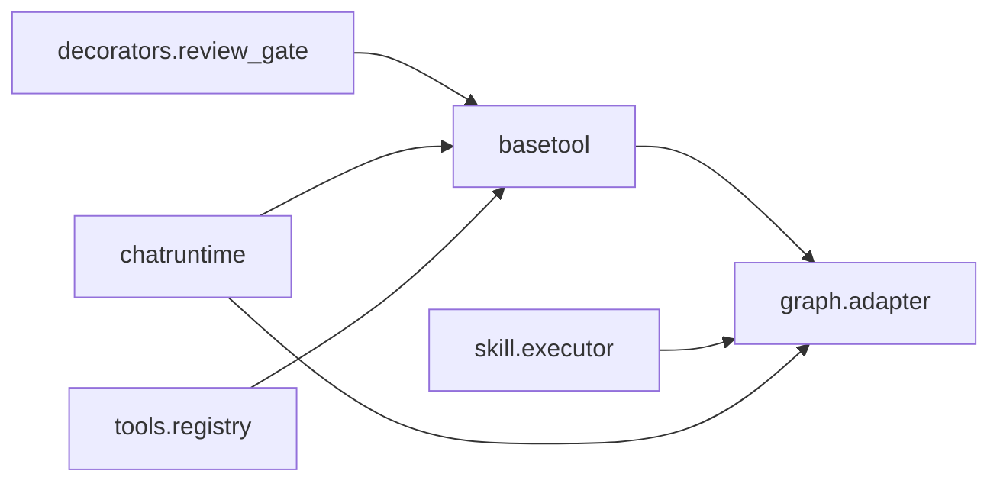

# 工具接口设计

<cite>
**本文引用的文件**
- [basetool.go](file://internal/manager/biz/aiops/tools/basetool/basetool.go)
- [tool_adapter.go](file://internal/manager/biz/aiops/graph/tool_adapter.go)
- [review_gate.go](file://internal/manager/biz/aiops/tools/decorators/review_gate.go)
- [types.go](file://internal/skill/types.go)
- [schema.go](file://internal/skill/schema.go)
- [web_search.go](file://internal/skill/builtin/web_search.go)
- [probe_http.go](file://internal/skill/builtin/probe_http.go)
- [system_prompt.go](file://internal/manager/biz/aiops/chatruntime/system_prompt.go)
- [toolbag.go](file://internal/manager/biz/aiops/tools/toolbag.go)
- [registry_basetool.go](file://internal/manager/biz/aiops/tools/registry_basetool.go)
- [runtime.go](file://internal/manager/biz/aiops/chatruntime/runtime.go)
</cite>

## 目录
1. [简介](#简介)
2. [项目结构](#项目结构)
3. [核心组件](#核心组件)
4. [架构总览](#架构总览)
5. [详细组件分析](#详细组件分析)
6. [依赖关系分析](#依赖关系分析)
7. [性能考量](#性能考量)
8. [故障排查指南](#故障排查指南)
9. [结论](#结论)
10. [附录](#附录)

## 简介
本技术文档聚焦于 ongrid 的“工具接口设计”，围绕 BaseTool 接口与 eino 对齐策略展开，解释 Info 方法与 InvokableRun 的职责分离、ToolInfo 元数据字段（Name、Description、WhenToUse）的最佳实践、工具分类系统（read/write/destructive）与确认机制、工具来源标识（OriginBuiltin/OriginMCP/OriginSkill）及动态工具处理策略，并提供自定义工具实现示例与最佳实践。

## 项目结构
仓库中与工具接口相关的关键位置：
- 接口与值类型定义：internal/manager/biz/aiops/tools/basetool
- 与 eino 的适配层：internal/manager/biz/aiops/graph
- 装饰器链（审计、超时、限流、指标、审批门控等）：internal/manager/biz/aiops/tools/decorators
- 技能框架（设备侧能力封装）：internal/skill
- 运行时工具装配与提示词生成：internal/manager/biz/aiops/chatruntime
- 工具注册与集合管理：internal/manager/biz/aiops/tools

图表来源
- [basetool.go:30-56](file://internal/manager/biz/aiops/tools/basetool/basetool.go#L30-L56)
- [tool_adapter.go:241-380](file://internal/manager/biz/aiops/graph/tool_adapter.go#L241-L380)
- [review_gate.go:15-60](file://internal/manager/biz/aiops/tools/decorators/review_gate.go#L15-L60)
- [types.go:100-125](file://internal/skill/types.go#L100-L125)
- [system_prompt.go:93-139](file://internal/manager/biz/aiops/chatruntime/system_prompt.go#L93-L139)
- [registry_basetool.go:72-81](file://internal/manager/biz/aiops/tools/registry_basetool.go#L72-L81)

章节来源
- [basetool.go:30-56](file://internal/manager/biz/aiops/tools/basetool/basetool.go#L30-L56)
- [tool_adapter.go:241-380](file://internal/manager/biz/aiops/graph/tool_adapter.go#L241-L380)
- [review_gate.go:15-60](file://internal/manager/biz/aiops/tools/decorators/review_gate.go#L15-L60)
- [types.go:100-125](file://internal/skill/types.go#L100-L125)
- [system_prompt.go:93-139](file://internal/manager/biz/aiops/chatruntime/system_prompt.go#L93-L139)
- [registry_basetool.go:72-81](file://internal/manager/biz/aiops/tools/registry_basetool.go#L72-L81)

## 核心组件
- BaseTool 接口：统一对外暴露 Info 与 InvokableRun，分别承担“元数据描述”和“可执行调用”职责，便于装饰器链组合与 eino 集成。
- ToolInfo：承载 Name、Description、WhenToUse、Parameters、Class、Confirmation、Origin 等元数据，驱动路由、审批、审计与 UI 展示。
- eino 适配器：将 BaseTool 适配为 eino 的 InvokableTool，合并 WhenToUse 到描述，并实现错误转 JSON 结果、幂等缓存与调用限额。
- 装饰器链：tenant_bind → ReviewGate → timeout → audit → ratelimit → metric，提供租户绑定、审批门控、超时、审计、限流与指标采集。
- 技能框架：以 skill.Executor + Metadata 的方式封装设备侧能力，自动生成 LLM 工具 Schema、表单与权限门控。

章节来源
- [basetool.go:30-138](file://internal/manager/biz/aiops/tools/basetool/basetool.go#L30-L138)
- [tool_adapter.go:338-380](file://internal/manager/biz/aiops/graph/tool_adapter.go#L338-L380)
- [review_gate.go:15-60](file://internal/manager/biz/aiops/tools/decorators/review_gate.go#L15-L60)
- [types.go:100-125](file://internal/skill/types.go#L100-L125)

## 架构总览
下图展示了从 LLM 调用到工具执行的完整链路，包括 eino 适配、装饰器链、审批门控与技能执行。

图表来源
- [tool_adapter.go:398-489](file://internal/manager/biz/aiops/graph/tool_adapter.go#L398-L489)
- [review_gate.go:263-350](file://internal/manager/biz/aiops/tools/decorators/review_gate.go#L263-L350)
- [types.go:190-203](file://internal/skill/types.go#L190-L203)

## 详细组件分析

### BaseTool 接口与 ToolInfo 元数据
- BaseTool.Info：纯函数式元数据查询，不得访问外部系统；用于构建工具 Schema、路由提示与权限判断。
- BaseTool.InvokableRun：执行入口，接收 LLM 生成的 arguments JSON，返回 JSON 字符串给 LLM；错误被上层转换为 JSON 结果以便模型自愈。
- ToolInfo 关键字段：
  - Name：稳定 wire 名，snake_case，无空格，必须与 tool_call.function.name 一致。
  - Description：面向 LLM 的“做什么”一句话说明。
  - WhenToUse：在兄弟工具间做选择的“何时使用”提示，与 Description 分离，便于系统提示词渲染与覆盖。
  - Parameters：JSON Schema，供装饰器注入与工具解析。
  - Class：read/write/destructive，决定是否需要人类审批。
  - Confirmation：required/not-required/self-managed，细化审批策略。
  - Origin：OriginBuiltin/OriginMCP/OriginSkill，区分内置与动态来源，影响路由与白名单。

章节来源
- [basetool.go:30-138](file://internal/manager/biz/aiops/tools/basetool/basetool.go#L30-L138)

### eino 对齐与适配器
- Info 合并：当存在 WhenToUse 时，将其追加到 Description，使 LLM 通过标准 schema 字段同时看到“做什么”和“何时用”。
- 参数 Schema：将 basetool 的 raw JSON Schema 解析为 eino 的 ParamsOneOf，保证编译期校验上游 Schema 合法性。
- 错误归一化：InvokableRun 中任何 Go 错误都会被序列化为 JSON 结果（包含 error/status），避免终止整个图执行。
- 幂等缓存：仅对 read 类工具进行相同参数的结果缓存，避免重复执行昂贵查询。
- 每工具调用限额：同一用户轮次内限制单工具执行次数，超限返回合成指令引导模型收敛。

图表来源
- [tool_adapter.go:326-380](file://internal/manager/biz/aiops/graph/tool_adapter.go#L326-L380)
- [tool_adapter.go:398-489](file://internal/manager/biz/aiops/graph/tool_adapter.go#L398-L489)

章节来源
- [tool_adapter.go:326-380](file://internal/manager/biz/aiops/graph/tool_adapter.go#L326-L380)
- [tool_adapter.go:398-489](file://internal/manager/biz/aiops/graph/tool_adapter.go#L398-L489)

### 工具分类系统与确认机制
- 分类：
  - read：只读查询，默认安全。
  - write：修改 ongrid 内部状态。
  - destructive：修改外部状态（如重启服务）。
- 确认机制：
  - Confirmation 字段可覆盖默认策略：required（强制审批）、not-required（豁免内部写操作）、self-managed（工具自身已有审批协议）。
  - ReviewGate 装饰器拦截 write/destructive 调用：
    - 确定性审批：特定场景（如 apply_config_change 创建告警规则）按策略自动批准。
    - 人工二审：否则启动 reviewer 工作流，解析 Decision: approve|reject，拒绝则返回错误，批准后才执行真实工具。
  - 审计记录：插入提案行、更新决策、标记执行时间，失败不阻塞主流程。

图表来源
- [review_gate.go:263-350](file://internal/manager/biz/aiops/tools/decorators/review_gate.go#L263-L350)
- [review_gate.go:420-466](file://internal/manager/biz/aiops/tools/decorators/review_gate.go#L420-L466)

章节来源
- [review_gate.go:15-60](file://internal/manager/biz/aiops/tools/decorators/review_gate.go#L15-L60)
- [review_gate.go:263-350](file://internal/manager/biz/aiops/tools/decorators/review_gate.go#L263-L350)
- [review_gate.go:420-466](file://internal/manager/biz/aiops/tools/decorators/review_gate.go#L420-L466)

### 工具来源标识与动态工具处理
- 来源常量：
  - OriginBuiltin：编译期内置工具。
  - OriginMCP：由 MCP 服务器暴露的动态工具。
  - OriginSkill：由已安装技能/扩展提供的动态工具。
- 动态工具策略：
  - IsDynamic：非 OriginBuiltin 即视为动态，不能列入 persona 静态白名单，需路由至专家代理而非协调器。
  - 运行时替换：Runtime.ReplaceToolsByNamePrefix 支持按前缀替换动态工具集，避免一次刷新影响其他服务器工具。
  - 能力摘要：system_prompt 根据 Origin 与 Class 生成“本轮可见能力”摘要，帮助 LLM 理解当前可用工具集。

章节来源
- [basetool.go:119-132](file://internal/manager/biz/aiops/tools/basetool/basetool.go#L119-L132)
- [runtime.go:416-454](file://internal/manager/biz/aiops/chatruntime/runtime.go#L416-L454)
- [system_prompt.go:93-139](file://internal/manager/biz/aiops/chatruntime/system_prompt.go#L93-L139)

### 自定义工具实现示例与最佳实践
- 基于 skill.Executor 的技能实现：
  - 定义 Metadata（Key、Name、Description、Class、Scope、Category、Params、ResultPreview）。
  - 实现 Execute(params json.RawMessage) 返回标准化 JSON 结果。
  - 在 init 中注册到全局 registry。
- 基于 BaseTool 的工具实现：
  - Info 返回 ToolInfo，确保 Name 稳定、Schema 合法、Class 明确、WhenToUse 清晰。
  - InvokableRun 解析 argsJSON，执行业务逻辑，返回 JSON 字符串；错误尽量转为结构化结果以便 LLM 自愈。
  - 通过装饰器链获得租户绑定、超时、审计、限流与指标能力。
- 最佳实践：
  - 将 WhenToUse 与 Description 分离，前者用于路由选择，后者用于功能说明。
  - 对写/破坏性工具设置合适的 Class 与 Confirmation，必要时接入 ReviewGate。
  - 动态工具明确标注 Origin，便于运行时路由与能力摘要。
  - 参数 Schema 保持最小必要字段，枚举类型限定取值范围，提升 LLM 填充准确性。

章节来源
- [types.go:100-125](file://internal/skill/types.go#L100-L125)
- [types.go:190-203](file://internal/skill/types.go#L190-L203)
- [schema.go:5-20](file://internal/skill/schema.go#L5-L20)
- [web_search.go:161-195](file://internal/skill/builtin/web_search.go#L161-L195)
- [probe_http.go:23-47](file://internal/skill/builtin/probe_http.go#L23-L47)
- [basetool.go:30-138](file://internal/manager/biz/aiops/tools/basetool/basetool.go#L30-L138)

## 依赖关系分析
- 模块耦合：
  - graph.tool_adapter 依赖 basetool 接口与 eino 组件，作为唯一胶水点。
  - decorators.review_gate 依赖 basetool 元数据与可选 spawner/sink 抽象，保持低耦合。
  - skill 框架独立于 manager 业务，通过 Executor/Metadata 提供设备侧能力。
  - chatruntime 依赖 basetool 与 toolbag，负责运行时装配与提示词生成。
- 循环依赖：
  - 装饰器包不引入 biz 层，避免循环依赖；通过接口（spawner/sink）解耦。
- 外部依赖：
  - eino 组件用于工具节点调度与选项传递。
  - JSON Schema 用于参数校验与 LLM 工具发现。

图表来源
- [tool_adapter.go:241-380](file://internal/manager/biz/aiops/graph/tool_adapter.go#L241-L380)
- [review_gate.go:15-60](file://internal/manager/biz/aiops/tools/decorators/review_gate.go#L15-L60)
- [types.go:190-203](file://internal/skill/types.go#L190-L203)
- [system_prompt.go:93-139](file://internal/manager/biz/aiops/chatruntime/system_prompt.go#L93-L139)
- [registry_basetool.go:72-81](file://internal/manager/biz/aiops/tools/registry_basetool.go#L72-L81)

章节来源
- [tool_adapter.go:241-380](file://internal/manager/biz/aiops/graph/tool_adapter.go#L241-L380)
- [review_gate.go:15-60](file://internal/manager/biz/aiops/tools/decorators/review_gate.go#L15-L60)
- [types.go:190-203](file://internal/skill/types.go#L190-L203)
- [system_prompt.go:93-139](file://internal/manager/biz/aiops/chatruntime/system_prompt.go#L93-L139)
- [registry_basetool.go:72-81](file://internal/manager/biz/aiops/tools/registry_basetool.go#L72-L81)

## 性能考量
- 读类工具幂等缓存：相同工具+相同参数在单次运行内复用结果，减少重复网络/计算开销。
- 每工具调用限额：防止模型陷入同工具多参循环，超限返回合成指令促使收敛。
- 错误转 JSON：避免图级异常导致 SSE 中断，降低重试成本。
- 动态工具替换：按前缀替换不影响其他来源工具，减少重建成本。
- 提示词能力摘要：压缩工具列表，控制上下文窗口占用。

[本节为通用指导，无需引用具体文件]

## 故障排查指南
- 工具报错未生效：检查 InvokableRun 是否正确将错误序列化为 JSON 结果，确保 LLM 能消费。
- 写操作未触发审批：确认 ToolInfo.Class 是否为 write/destructive，且 ReviewGate 已正确接入装饰器链。
- 动态工具未生效：检查 Origin 是否设置，运行时是否调用 ReplaceToolsByNamePrefix 完成替换。
- 能力摘要缺失：确认 system_prompt 构建时遍历了工具集，且 Name/Class/Origin 有效。
- 性能问题：观察是否出现大量重复调用，检查幂等缓存与限额是否生效。

章节来源
- [tool_adapter.go:398-489](file://internal/manager/biz/aiops/graph/tool_adapter.go#L398-L489)
- [review_gate.go:263-350](file://internal/manager/biz/aiops/tools/decorators/review_gate.go#L263-L350)
- [runtime.go:416-454](file://internal/manager/biz/aiops/chatruntime/runtime.go#L416-L454)
- [system_prompt.go:93-139](file://internal/manager/biz/aiops/chatruntime/system_prompt.go#L93-L139)

## 结论
本设计通过 BaseTool 接口与 ToolInfo 元数据实现了工具描述与执行的清晰分离，借助 eino 适配器完成生态对接，并通过装饰器链与 ReviewGate 提供统一的横切能力与审批门控。工具分类与来源标识支撑了安全的动态工具管理与路由策略。结合 skill 框架，开发者可以以声明式方式快速构建可审计、可审批、可观测的工具能力。

[本节为总结，无需引用具体文件]

## 附录
- 参考实现路径：
  - 技能实现示例：web_search、probe_http
  - 工具装配与注册：registry_basetool、toolbag
  - 运行时替换与能力摘要：runtime、system_prompt

章节来源
- [web_search.go:161-195](file://internal/skill/builtin/web_search.go#L161-L195)
- [probe_http.go:23-47](file://internal/skill/builtin/probe_http.go#L23-L47)
- [registry_basetool.go:72-81](file://internal/manager/biz/aiops/tools/registry_basetool.go#L72-L81)
- [toolbag.go:310-348](file://internal/manager/biz/aiops/tools/toolbag.go#L310-L348)
- [runtime.go:416-454](file://internal/manager/biz/aiops/chatruntime/runtime.go#L416-L454)
- [system_prompt.go:93-139](file://internal/manager/biz/aiops/chatruntime/system_prompt.go#L93-L139)