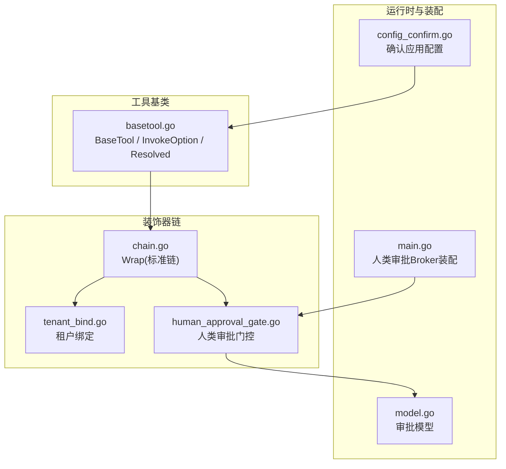
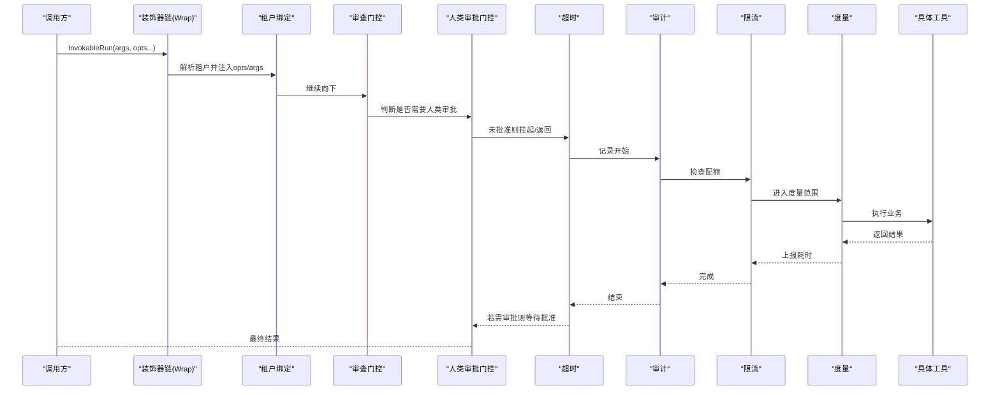
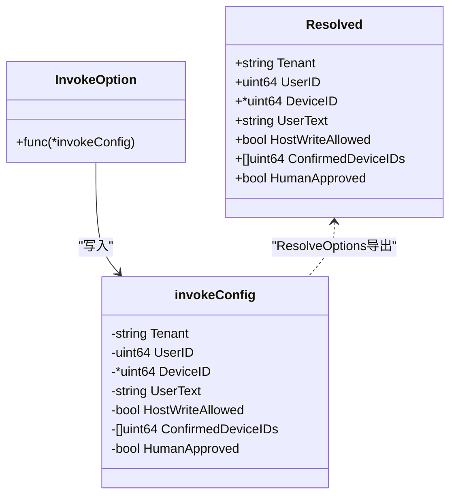
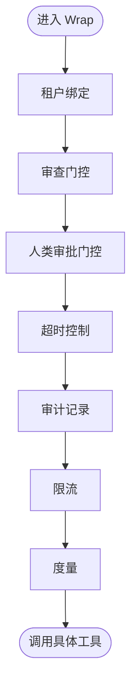
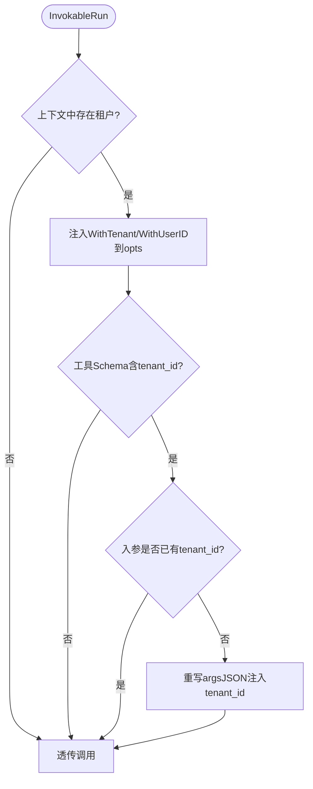
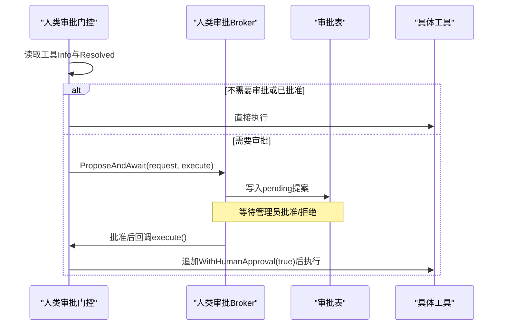
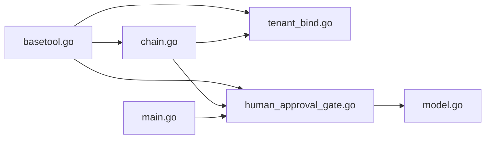

# 调用选项系统

<cite>
**本文引用的文件**
- [basetool.go](file://internal/manager/biz/aiops/tools/basetool/basetool.go)
- [chain.go](file://internal/manager/biz/aiops/tools/decorators/chain.go)
- [tenant_bind.go](file://internal/manager/biz/aiops/tools/decorators/tenant_bind.go)
- [human_approval_gate.go](file://internal/manager/biz/aiops/tools/decorators/human_approval_gate.go)
- [config_confirm.go](file://internal/manager/biz/aiops/chatruntime/config_confirm.go)
- [main.go](file://cmd/ongrid/main.go)
- [model.go](file://internal/manager/model/approval/model.go)
</cite>

## 目录
1. [简介](#简介)
2. [项目结构](#项目结构)
3. [核心组件](#核心组件)
4. [架构总览](#架构总览)
5. [详细组件分析](#详细组件分析)
6. [依赖关系分析](#依赖关系分析)
7. [性能考虑](#性能考虑)
8. [故障排查指南](#故障排查指南)
9. [结论](#结论)
10. [附录](#附录)

## 简介
本技术文档聚焦于“调用选项系统”，围绕 InvokeOption 函数式选项模式的设计与实现，系统性说明上下文传递、权限控制、设备选择与人工审批等关键能力。该体系通过统一的装饰器链将租户绑定、超时、审计、限流、度量以及人类审批等横切关注点以可组合的方式注入到工具调用中，确保跨层一致性与可观测性。

## 项目结构
调用选项系统主要位于 AIOPS 工具层的基类与装饰器模块：
- 基类定义工具接口、调用选项与解析结果（basetool）
- 装饰器链负责组装横切逻辑（chain）
- 具体装饰器实现租户绑定、人类审批门控等（tenant_bind、human_approval_gate）
- 聊天运行时在确认场景下构造并传入选项（config_confirm）
- 主进程将人类审批与持久化审批箱进行装配（main）
- 审批模型用于持久化提案（approval model）

图表来源
- [basetool.go:30-56](file://internal/manager/biz/aiops/tools/basetool/basetool.go#L30-L56)
- [chain.go:56-131](file://internal/manager/biz/aiops/tools/decorators/chain.go#L56-L131)
- [tenant_bind.go:31-85](file://internal/manager/biz/aiops/tools/decorators/tenant_bind.go#L31-L85)
- [human_approval_gate.go:45-83](file://internal/manager/biz/aiops/tools/decorators/human_approval_gate.go#L45-L83)
- [config_confirm.go:22-79](file://internal/manager/biz/aiops/chatruntime/config_confirm.go#L22-L79)
- [main.go:3475-3548](file://cmd/ongrid/main.go#L3475-L3548)
- [model.go:18-59](file://internal/manager/model/approval/model.go#L18-L59)

章节来源
- [basetool.go:30-56](file://internal/manager/biz/aiops/tools/basetool/basetool.go#L30-L56)
- [chain.go:56-131](file://internal/manager/biz/aiops/tools/decorators/chain.go#L56-L131)

## 核心组件
- BaseTool 与 InvokableRun：统一工具入口，支持通过 opts 传递每调用上下文。
- InvokeOption：函数式选项类型，用于设置租户、用户、设备、用户文本、主机写入权限、已确认设备列表、人类审批标记等。
- invokeConfig 与 ResolveOptions：内部配置结构与解析方法，对外暴露只读的 Resolved 供装饰器读取。
- 装饰器链 Wrap：按固定顺序组合 tenant_bind → review_gate → human_approval → timeout → audit → ratelimit → metric。
- 租户绑定装饰器：从上下文提取租户并注入 args 与 opts。
- 人类审批门控：根据工具元数据决定是否进入持久化审批流程，并在批准后注入一次性 HumanApproved 标记。

章节来源
- [basetool.go:134-258](file://internal/manager/biz/aiops/tools/basetool/basetool.go#L134-L258)
- [chain.go:56-131](file://internal/manager/biz/aiops/tools/decorators/chain.go#L56-L131)
- [tenant_bind.go:31-85](file://internal/manager/biz/aiops/tools/decorators/tenant_bind.go#L31-L85)
- [human_approval_gate.go:45-83](file://internal/manager/biz/aiops/tools/decorators/human_approval_gate.go#L45-L83)

## 架构总览
调用选项系统在工具执行路径上形成“外层上下文注入 + 内层业务执行”的清晰分层。所有横切关注点以装饰器形式叠加，保证职责单一且可独立测试。

图表来源
- [chain.go:56-131](file://internal/manager/biz/aiops/tools/decorators/chain.go#L56-L131)
- [tenant_bind.go:50-85](file://internal/manager/biz/aiops/tools/decorators/tenant_bind.go#L50-L85)
- [human_approval_gate.go:56-83](file://internal/manager/biz/aiops/tools/decorators/human_approval_gate.go#L56-L83)

## 详细组件分析

### 调用选项与上下文传递
- WithTenant：设置租户标识，配合租户绑定装饰器在参数中注入 tenant_id。
- WithUserID：设置认证用户ID，供限流与审计使用。
- WithDeviceID：可选设备ID，用于审计记录与目标定位。
- WithUserText：携带当前用户轮次原文，便于工具做基于真实请求的校验。
- WithConfirmedDeviceIDs：承载用户在界面显式选择的设备集合，作为执行证据。
- WithHostWritePermission：管理员写权限门控，允许走边缘侧无限制执行路径（但变更命令仍需单独审批）。
- WithHumanApproval：由审批门控在批准后注入的一次性标记，避免重复审批。
- ResolveOptions：将一组选项应用到临时配置并返回只读 Resolved，供装饰器读取。

图表来源
- [basetool.go:134-258](file://internal/manager/biz/aiops/tools/basetool/basetool.go#L134-L258)

章节来源
- [basetool.go:178-258](file://internal/manager/biz/aiops/tools/basetool/basetool.go#L178-L258)

### 装饰器链与执行顺序
标准链顺序为：tenant_bind → review_gate → human_approval → timeout → audit → ratelimit → metric。该顺序确保：
- 租户信息最先注入，下游均可见；
- 审查门控在超时之外，避免误杀长时审查；
- 人类审批在审计之前，拒绝不产生执行日志；
- 审计在限流之前，拒绝也会被记录；
- 度量在最内层，仅统计工具实际耗时。

图表来源
- [chain.go:56-131](file://internal/manager/biz/aiops/tools/decorators/chain.go#L56-L131)

章节来源
- [chain.go:56-131](file://internal/manager/biz/aiops/tools/decorators/chain.go#L56-L131)

### 租户绑定与参数注入
- 从上下文解析租户，并将 UserID 与字符串化租户 ID 注入 opts，使审计与限流可直接读取。
- 若工具声明了 tenant_id 字段且入参未提供，则自动注入，保证 LLM 生成的 tool_call.arguments 自包含。

图表来源
- [tenant_bind.go:50-85](file://internal/manager/biz/aiops/tools/decorators/tenant_bind.go#L50-L85)

章节来源
- [tenant_bind.go:31-85](file://internal/manager/biz/aiops/tools/decorators/tenant_bind.go#L31-L85)

### 人类审批流程集成
- 人类审批门控依据工具元数据的 Class 与 Confirmation 字段决定是否需要审批。
- 需要审批时，创建持久化提案并阻塞等待审批结果；批准后注入 WithHumanApproval(true) 再次调用内部工具，避免二次审批。
- 主进程装配人类审批 Broker，将待执行能力与持久化审批箱连接，失败关闭策略确保安全。

图表来源
- [human_approval_gate.go:56-83](file://internal/manager/biz/aiops/tools/decorators/human_approval_gate.go#L56-L83)
- [main.go:3475-3548](file://cmd/ongrid/main.go#L3475-L3548)
- [model.go:18-59](file://internal/manager/model/approval/model.go#L18-L59)

章节来源
- [human_approval_gate.go:56-83](file://internal/manager/biz/aiops/tools/decorators/human_approval_gate.go#L56-L83)
- [main.go:3475-3548](file://cmd/ongrid/main.go#L3475-L3548)
- [model.go:18-59](file://internal/manager/model/approval/model.go#L18-L59)

### HostWriteAllowed 权限控制
- WithHostWritePermission 将管理员写权限门控值带入每次调用。
- 启用后，宿主侧工具可使用边缘侧无限制执行路径；但变更命令仍受独立审批流程约束。
- 该选项用于绕过某些常规限制，但不替代审批策略。

章节来源
- [basetool.go:208-213](file://internal/manager/biz/aiops/tools/basetool/basetool.go#L208-L213)

### ConfirmedDeviceIDs 设备选择机制
- WithConfirmedDeviceIDs 携带用户在当前对话轮次显式选择的设备集合。
- 这些设备ID作为“执行证据”，区别于前序工具发现或模型推断的设备。
- 适用于需要明确宿主目标的工具，确保操作对象不可歧义。

章节来源
- [basetool.go:171-175](file://internal/manager/biz/aiops/tools/basetool/basetool.go#L171-L175)
- [basetool.go:202-206](file://internal/manager/biz/aiops/tools/basetool/basetool.go#L202-L206)

### 选项组合使用示例
- 聊天运行时在确认应用配置时，会构造 apply_config_change 工具调用，并传入 WithUserID 与 WithUserText，确保审计与校验基于真实用户输入。
- 典型组合包括：WithTenant + WithUserID + WithDeviceID + WithConfirmedDeviceIDs + WithHostWritePermission（必要时）+ WithHumanApproval（批准后由门控注入）。

章节来源
- [config_confirm.go:22-79](file://internal/manager/biz/aiops/chatruntime/config_confirm.go#L22-L79)

## 依赖关系分析
- basetool 被装饰器与运行时共同依赖，提供统一选项与解析能力。
- 装饰器链依赖 basetool 的 ResolveOptions 与工具元信息。
- 人类审批门控依赖持久化审批模型与主进程装配的 Broker。
- 租户绑定依赖上下文中的租户信息，并向下游装饰器传播。

图表来源
- [basetool.go:30-56](file://internal/manager/biz/aiops/tools/basetool/basetool.go#L30-L56)
- [chain.go:56-131](file://internal/manager/biz/aiops/tools/decorators/chain.go#L56-L131)
- [tenant_bind.go:31-85](file://internal/manager/biz/aiops/tools/decorators/tenant_bind.go#L31-L85)
- [human_approval_gate.go:45-83](file://internal/manager/biz/aiops/tools/decorators/human_approval_gate.go#L45-L83)
- [model.go:18-59](file://internal/manager/model/approval/model.go#L18-L59)
- [main.go:3475-3548](file://cmd/ongrid/main.go#L3475-L3548)

章节来源
- [chain.go:56-131](file://internal/manager/biz/aiops/tools/decorators/chain.go#L56-L131)
- [basetool.go:134-258](file://internal/manager/biz/aiops/tools/basetool/basetool.go#L134-L258)

## 性能考虑
- 装饰器顺序优化：度量置于最内层，避免统计装饰器开销；审计在限流之前，确保拒绝也被记录。
- 租户绑定仅在 Schema 声明 tenant_id 时重写 JSON，减少不必要的编解码。
- 人类审批门控在未需要审批时直接透传，避免额外开销。
- 超时控制在审计之后，确保即使超时也能产出分类信息。
- 限流在度量之前，防止拒绝调用污染延迟直方图。

章节来源
- [chain.go:56-131](file://internal/manager/biz/aiops/tools/decorators/chain.go#L56-L131)
- [tenant_bind.go:68-85](file://internal/manager/biz/aiops/tools/decorators/tenant_bind.go#L68-L85)
- [human_approval_gate.go:56-83](file://internal/manager/biz/aiops/tools/decorators/human_approval_gate.go#L56-L83)

## 故障排查指南
- 人类审批不可用：当工具需要确认但未装配人类审批 Broker 时，会返回错误，需检查主进程装配是否正确。
- 租户未注入：若上下文缺失租户，租户绑定将透传；如需强制隔离，应在上游中间件设置租户上下文。
- 设备选择不生效：确认已通过 WithConfirmedDeviceIDs 传入显式设备列表，并确保工具消费该选项。
- 审计缺失：检查审计装饰器是否接入，以及是否在链中处于正确位置。
- 限流误判：确认限流器配置与键空间（工具名+用户ID）是否符合预期。

章节来源
- [human_approval_gate.go:13-15](file://internal/manager/biz/aiops/tools/decorators/human_approval_gate.go#L13-L15)
- [tenant_bind.go:50-58](file://internal/manager/biz/aiops/tools/decorators/tenant_bind.go#L50-L58)
- [chain.go:56-131](file://internal/manager/biz/aiops/tools/decorators/chain.go#L56-L131)

## 结论
调用选项系统通过函数式选项与装饰器链实现了高内聚、低耦合的横切能力编排。租户绑定、人类审批、权限控制与设备选择等关键特性均以可组合的方式注入到工具调用中，既保证了安全性与可观测性，又提供了灵活的扩展点。建议在新增功能时优先复用现有选项与装饰器，保持链路一致性与可维护性。

## 附录
- 调试建议：
  - 开启审计与度量，观察调用链各层行为。
  - 在人类审批门控前后打印 Resolved 内容，确认选项是否正确传递。
  - 对租户绑定，检查工具 Schema 是否声明 tenant_id，以及入参是否已被重写。
- 监控指标：
  - 工具调用次数、成功率、超时率、拒绝率、平均耗时。
  - 人类审批通过率、平均等待时间、拒绝原因分布。
  - 限流触发次数与峰值时段。