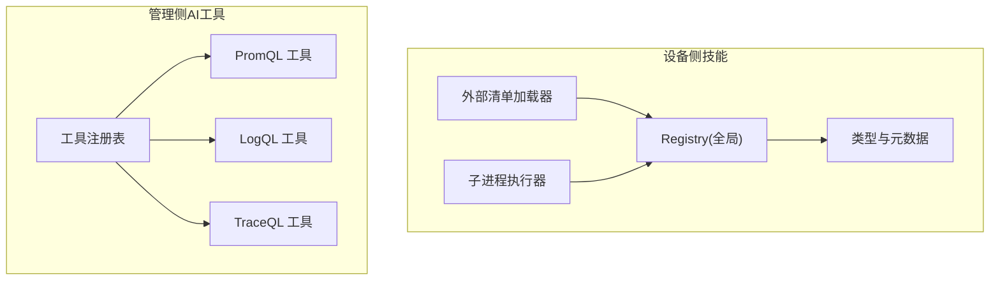
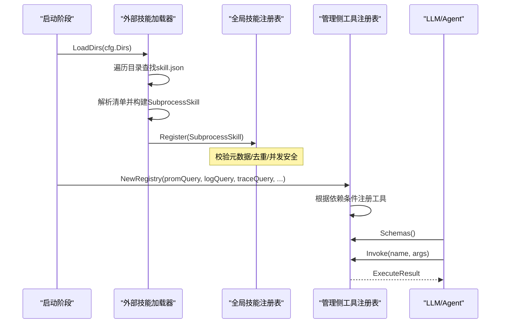
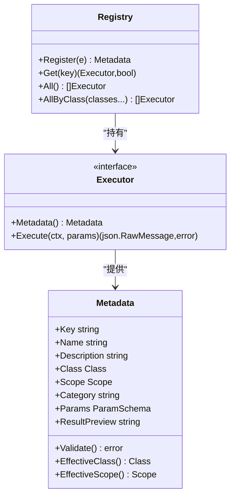
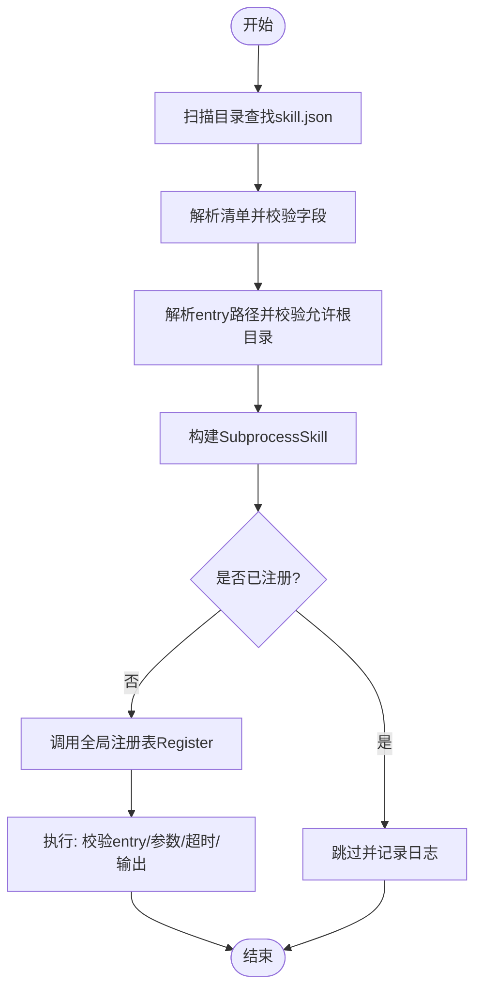
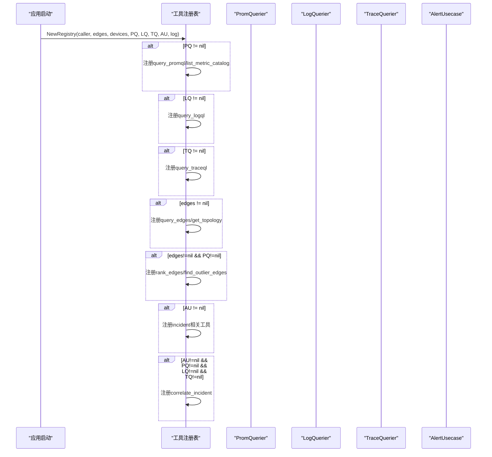
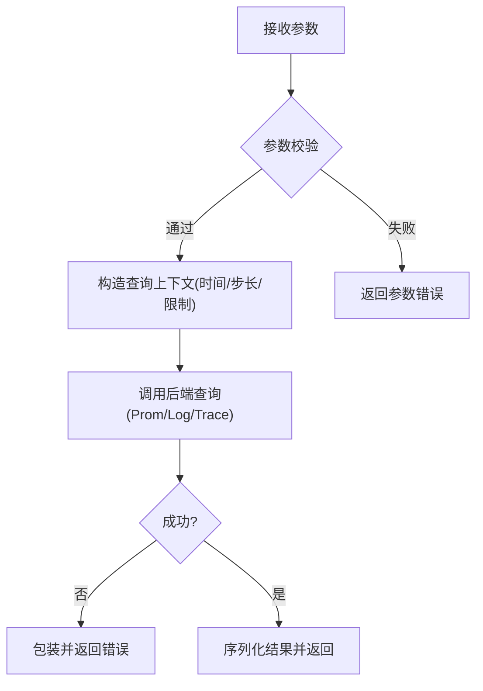
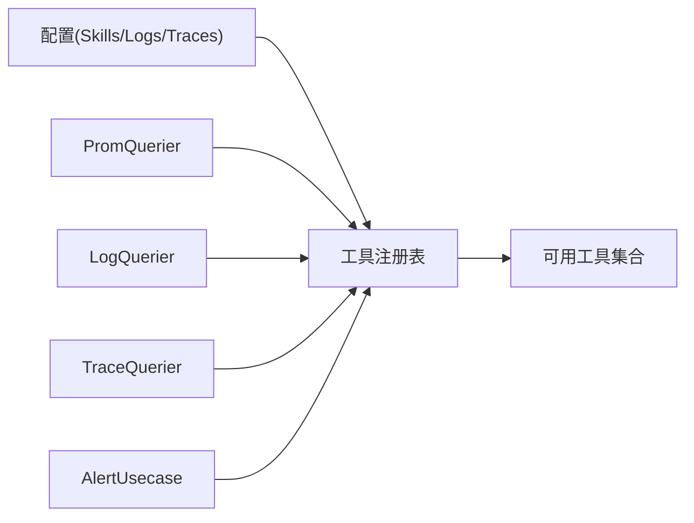
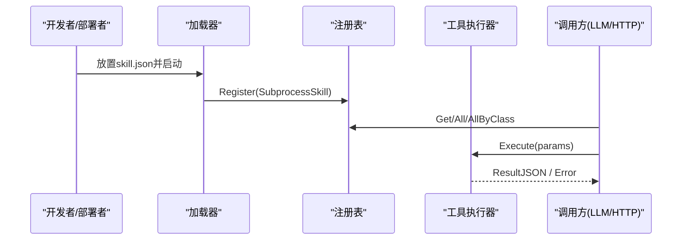

# 工具注册表

<cite>
**本文引用的文件**
- [internal/skill/registry.go](file://internal/skill/registry.go)
- [internal/skill/types.go](file://internal/skill/types.go)
- [internal/skill/loader.go](file://internal/skill/loader.go)
- [internal/skill/subprocess.go](file://internal/skill/subprocess.go)
- [internal/manager/biz/aiops/tools/registry.go](file://internal/manager/biz/aiops/tools/registry.go)
- [internal/manager/biz/aiops/tools/query_promql.go](file://internal/manager/biz/aiops/tools/query_promql.go)
- [internal/manager/biz/aiops/tools/query_logql.go](file://internal/manager/biz/aiops/tools/query_logql.go)
- [internal/manager/biz/aiops/tools/query_traceql.go](file://internal/manager/biz/aiops/tools/query_traceql.go)
- [internal/pkg/config/config.go](file://internal/pkg/config/config.go)
</cite>

## 目录
1. [简介](#简介)
2. [项目结构](#项目结构)
3. [核心组件](#核心组件)
4. [架构总览](#架构总览)
5. [详细组件分析](#详细组件分析)
6. [依赖关系分析](#依赖关系分析)
7. [性能考量](#性能考量)
8. [故障排查指南](#故障排查指南)
9. [结论](#结论)
10. [附录](#附录)

## 简介
本技术文档聚焦于“工具注册表”的设计与实现，覆盖两类注册体系：
- 设备侧技能注册表（Skill Registry）：用于在边缘端动态发现、注册并执行“技能”，支持进程内 Go 实现与外部子进程实现。
- 管理侧 AI 工具注册表（Tools Registry）：用于向 LLM/Agent 暴露可调用工具，包含条件注册（如 promQuery、logQuery、traceQuery）和组合工具装配。

重点说明：
- 工具的动态加载机制（含外部 skill.json 清单扫描）、版本管理与依赖解析策略。
- 工具生命周期：从注册到执行的完整流程。
- 条件注册机制：可选依赖的注册开关与降级行为。
- 工具间依赖关系与初始化顺序。
- 最佳实践与扩展指南。
- 工具发现、查询与调用的 API 接口说明。

## 项目结构
本项目将“工具注册表”拆分为两个层次：
- internal/skill：设备侧技能框架，提供全局注册表、元数据模型、外部子进程技能加载器与执行器。
- internal/manager/biz/aiops/tools：管理侧 AI 工具注册表，提供工具 Schema、执行器与按依赖条件注册的工具集合。

图表来源
- [internal/skill/registry.go:10-47](file://internal/skill/registry.go#L10-L47)
- [internal/skill/types.go:99-175](file://internal/skill/types.go#L99-L175)
- [internal/skill/loader.go:69-160](file://internal/skill/loader.go#L69-L160)
- [internal/skill/subprocess.go:30-78](file://internal/skill/subprocess.go#L30-L78)
- [internal/manager/biz/aiops/tools/registry.go:274-410](file://internal/manager/biz/aiops/tools/registry.go#L274-L410)

章节来源
- [internal/skill/registry.go:10-47](file://internal/skill/registry.go#L10-L47)
- [internal/manager/biz/aiops/tools/registry.go:274-410](file://internal/manager/biz/aiops/tools/registry.go#L274-L410)

## 核心组件
- 全局技能注册表（Registry）：进程级单例，维护 Key→Executor 映射，提供 Register/Get/All/AllByClass 等能力。
- 技能元数据（Metadata）：描述工具名称、分类、作用域、参数 Schema、权限等级等，并在注册时进行校验。
- 外部技能加载器（Loader）：扫描指定目录下的 skill.json 清单，构建 SubprocessSkill 并注册到全局注册表。
- 子进程执行器（SubprocessSkill）：以独立进程方式运行外部二进制，通过 stdin/stdout 传递 JSON 参数与结果，具备超时、输出限流与环境白名单控制。
- 管理侧工具注册表（Tools Registry）：集中注册 PromQL/LogQL/TraceQL 等工具，按依赖条件启用或禁用，并提供 Schemas() 与 Invoke(name, args) 统一入口。

章节来源
- [internal/skill/registry.go:10-127](file://internal/skill/registry.go#L10-L127)
- [internal/skill/types.go:99-241](file://internal/skill/types.go#L99-L241)
- [internal/skill/loader.go:13-160](file://internal/skill/loader.go#L13-L160)
- [internal/skill/subprocess.go:30-172](file://internal/skill/subprocess.go#L30-L172)
- [internal/manager/biz/aiops/tools/registry.go:52-143](file://internal/manager/biz/aiops/tools/registry.go#L52-L143)

## 架构总览
下图展示从启动到工具可调用的整体流程：配置驱动的外部技能目录扫描、清单解析、注册；以及管理侧工具按依赖条件注册，最终对外暴露 Schemas 与 Invoke。

图表来源
- [internal/skill/loader.go:69-160](file://internal/skill/loader.go#L69-L160)
- [internal/skill/registry.go:56-116](file://internal/skill/registry.go#L56-L116)
- [internal/manager/biz/aiops/tools/registry.go:274-410](file://internal/manager/biz/aiops/tools/registry.go#L274-L410)

## 详细组件分析

### 全局技能注册表（Registry）
- 设计要点
  - 进程级单例，使用读写锁保护并发访问。
  - 注册阶段在 init() 完成（单线程），运行时读取为并发安全。
  - 对重复 Key 与无效元数据采用 panic 快速失败，避免运行时静默错误。
- 关键能力
  - Register(e): 注册 Executor，返回 Metadata。
  - Get(key): 按 Key 获取 Executor，未找到返回 (nil, false)。
  - All()/AllByClass(classes...): 枚举所有或按权限类过滤的技能，排序后返回。
- 复杂度
  - 注册 O(1)，查询 O(1)，枚举 O(n) 且排序 O(n log n)。

图表来源
- [internal/skill/registry.go:21-116](file://internal/skill/registry.go#L21-L116)
- [internal/skill/types.go:99-241](file://internal/skill/types.go#L99-L241)

章节来源
- [internal/skill/registry.go:10-127](file://internal/skill/registry.go#L10-L127)
- [internal/skill/types.go:99-241](file://internal/skill/types.go#L99-L241)

### 外部技能加载器（Loader）与子进程执行器（SubprocessSkill）
- 加载流程
  - 扫描配置的允许目录，递归查找 skill.json。
  - 解析清单，校验 name/description/entry/class/category。
  - 解析 entry 路径，强制位于允许根目录下（防逃逸）。
  - 构建 SubprocessSkill，设置默认超时、作用域为 manager。
  - 若已存在同名技能则跳过（避免部署期新旧清单重叠导致冲突）。
  - 调用全局注册表 Register，捕获 panic 防止启动崩溃。
- 执行流程
  - 校验 entry 绝对路径与可执行权限。
  - 参数为空时转为 "{}"，确保子进程可读。
  - 设置上下文超时，限制 stdout/stderr 内存占用。
  - 非零退出码或非法 JSON 输出视为错误，附带 stderr 尾部便于诊断。
- 安全性
  - 环境变量白名单注入，默认不继承父进程环境。
  - 输出大小上限，防止恶意二进制耗尽内存。

图表来源
- [internal/skill/loader.go:69-160](file://internal/skill/loader.go#L69-L160)
- [internal/skill/loader.go:176-254](file://internal/skill/loader.go#L176-L254)
- [internal/skill/subprocess.go:112-172](file://internal/skill/subprocess.go#L112-L172)

章节来源
- [internal/skill/loader.go:13-274](file://internal/skill/loader.go#L13-L274)
- [internal/skill/subprocess.go:17-268](file://internal/skill/subprocess.go#L17-L268)

### 管理侧工具注册表（Tools Registry）
- 设计要点
  - 集中管理工具定义（名称、描述、JSON Schema、执行器）。
  - 通过构造函数传入可选依赖（promQuery/logQuery/traceQuery/alertUC），按需注册对应工具。
  - 提供 Schemas() 供 LLM 发现可用工具，Invoke(name, args) 统一调度执行。
- 条件注册
  - query_promql：当 promQuery != nil 时注册。
  - query_logql：当 logQuery != nil 时注册。
  - query_traceql：当 traceQuery != nil 时注册。
  - correlate_incident：当 promQuery、logQuery、traceQuery、alertUC 全部非空时注册。
- 扩展点
  - 通过 Set* 方法在构造后注入更多依赖（如拓扑图、审计列表、通知发送器等），再触发相应工具注册。

图表来源
- [internal/manager/biz/aiops/tools/registry.go:274-410](file://internal/manager/biz/aiops/tools/registry.go#L274-L410)

章节来源
- [internal/manager/biz/aiops/tools/registry.go:52-484](file://internal/manager/biz/aiops/tools/registry.go#L52-L484)

### 条件工具实现细节（PromQL/LogQL/TraceQL）
- query_promql
  - 参数校验：expr 必填，lookback_seconds 有上下界。
  - 自动计算 step，限制最大回溯时长。
  - 调用 PromQuerier.QueryRange 并返回原始响应。
- query_logql
  - 支持 device_id 注入到 LogQL 流选择器，冲突检测。
  - 时间解析支持 now-/now+ 与 RFC3339。
  - 限制 limit，方向默认 backward。
- query_traceql
  - 支持 service/operation/min/max_duration 过滤。
  - 支持 device_id 注入到 TraceQL spanset，冲突检测。
  - 至少需要一个过滤条件，防止无界搜索。

图表来源
- [internal/manager/biz/aiops/tools/query_promql.go:79-118](file://internal/manager/biz/aiops/tools/query_promql.go#L79-L118)
- [internal/manager/biz/aiops/tools/query_logql.go:157-237](file://internal/manager/biz/aiops/tools/query_logql.go#L157-L237)
- [internal/manager/biz/aiops/tools/query_traceql.go:185-274](file://internal/manager/biz/aiops/tools/query_traceql.go#L185-L274)

章节来源
- [internal/manager/biz/aiops/tools/query_promql.go:1-132](file://internal/manager/biz/aiops/tools/query_promql.go#L1-L132)
- [internal/manager/biz/aiops/tools/query_logql.go:1-245](file://internal/manager/biz/aiops/tools/query_logql.go#L1-L245)
- [internal/manager/biz/aiops/tools/query_traceql.go:1-285](file://internal/manager/biz/aiops/tools/query_traceql.go#L1-L285)

## 依赖关系分析
- 外部依赖注入
  - PromQuerier、LogQuerier、TraceQuerier、AlertUsecase 作为可选依赖，决定工具是否注册。
  - 拓扑信息（ManagerVersion、Configured URLs）通过 SetTopologyInfo 注入，影响 get_topology 工具。
- 配置驱动
  - SkillsConfig.ExternalDirs 控制外部技能目录扫描范围。
  - LogsConfig.URL、TracesConfig.URL 控制日志/追踪后端可用性，间接影响工具注册。
- 工具间依赖
  - correlate_incident 依赖四个信号源同时可用，否则不注册，避免半可用状态误导 LLM。

图表来源
- [internal/pkg/config/config.go:65-103](file://internal/pkg/config/config.go#L65-L103)
- [internal/manager/biz/aiops/tools/registry.go:274-410](file://internal/manager/biz/aiops/tools/registry.go#L274-L410)

章节来源
- [internal/pkg/config/config.go:65-103](file://internal/pkg/config/config.go#L65-L103)
- [internal/manager/biz/aiops/tools/registry.go:274-410](file://internal/manager/biz/aiops/tools/registry.go#L274-L410)

## 性能考量
- 并发安全
  - 技能注册表使用 RWMutex，读多写少场景高效。
- 资源限制
  - 子进程 stdout/stderr 限制，防止异常输出耗尽内存。
  - 工具调用统一超时控制，避免长时间阻塞。
- 枚举与排序
  - All/AllByClass 返回有序列表，便于 UI/LLM 稳定展示。

[本节为通用指导，无需特定文件引用]

## 故障排查指南
- 常见错误与定位
  - 未知工具名：Invoke 返回“not found”，检查工具是否因依赖缺失而未注册。
  - 参数校验失败：检查 JSON Schema 与必填字段。
  - 子进程执行失败：查看 stderr 尾部与退出码，确认 entry 可执行与环境变量白名单。
  - 外部清单错误：loader 会记录解析/构建错误并跳过，不影响其他技能加载。
- 建议步骤
  - 确认配置中 ExternalDirs 指向有效目录。
  - 检查 promQuery/logQuery/traceQuery 是否按预期注入。
  - 查看日志中关于“skip non-absolute dir”“already registered”等提示。

章节来源
- [internal/skill/loader.go:75-160](file://internal/skill/loader.go#L75-L160)
- [internal/skill/subprocess.go:112-172](file://internal/skill/subprocess.go#L112-L172)
- [internal/manager/biz/aiops/tools/registry.go:470-484](file://internal/manager/biz/aiops/tools/registry.go#L470-L484)

## 结论
本注册表体系通过“设备侧技能”与“管理侧工具”两层解耦，实现了：
- 动态加载与条件注册：外部技能清单与可选依赖驱动的工具体系。
- 安全与健壮性：严格的元数据校验、路径白名单、超时与输出限制。
- 可扩展性：通过 Set* 方法与接口抽象，轻松接入新工具与新依赖。
- 可观测性：清晰的错误信息与日志，便于运维排障。

遵循本文的最佳实践与扩展指南，可在保证系统稳定性的前提下，持续扩展工具生态。

## 附录

### 工具生命周期（从注册到执行）

图表来源
- [internal/skill/loader.go:69-160](file://internal/skill/loader.go#L69-L160)
- [internal/skill/registry.go:56-116](file://internal/skill/registry.go#L56-L116)
- [internal/skill/subprocess.go:112-172](file://internal/skill/subprocess.go#L112-L172)

### 条件注册机制（promQuery/logQuery/traceQuery）
- 当依赖不可用时，对应工具不会注册，调用将返回“not found”。
- 组合工具（如 correlate_incident）要求所有依赖均满足，否则不注册。

章节来源
- [internal/manager/biz/aiops/tools/registry.go:307-409](file://internal/manager/biz/aiops/tools/registry.go#L307-L409)

### 工具发现、查询与调用 API
- 工具发现
  - Schemas(): 返回工具名称、描述与参数 Schema，供 LLM 选择。
- 工具查询
  - Get(key)/All()/AllByClass(): 获取技能或按权限类筛选。
- 工具调用
  - Invoke(name, args): 统一入口，返回 ExecuteResult。
  - Executor.Execute(ctx, params): 设备侧技能执行接口。

章节来源
- [internal/manager/biz/aiops/tools/registry.go:456-484](file://internal/manager/biz/aiops/tools/registry.go#L456-L484)
- [internal/skill/registry.go:35-116](file://internal/skill/registry.go#L35-L116)
- [internal/skill/types.go:190-203](file://internal/skill/types.go#L190-L203)

### 最佳实践与扩展指南
- 新增内部技能
  - 实现 Executor 接口，提供 Metadata 与 Execute。
  - 在 init() 中调用 Register，确保 Key 唯一且元数据合法。
- 新增外部技能
  - 编写 skill.json，确保 name/description/entry/class 正确。
  - 将目录加入 SkillsConfig.ExternalDirs，启动时自动加载。
- 新增管理侧工具
  - 定义 Tool{Name, Description, Schema, Execute}。
  - 在 NewRegistry 或 Set* 中按依赖条件注册。
- 依赖与版本管理
  - 通过可选依赖控制工具可用性，避免半可用状态。
  - 对工具输入进行严格校验，保持向后兼容的 Schema。

章节来源
- [internal/skill/types.go:99-203](file://internal/skill/types.go#L99-L203)
- [internal/skill/loader.go:13-160](file://internal/skill/loader.go#L13-L160)
- [internal/manager/biz/aiops/tools/registry.go:274-410](file://internal/manager/biz/aiops/tools/registry.go#L274-L410)