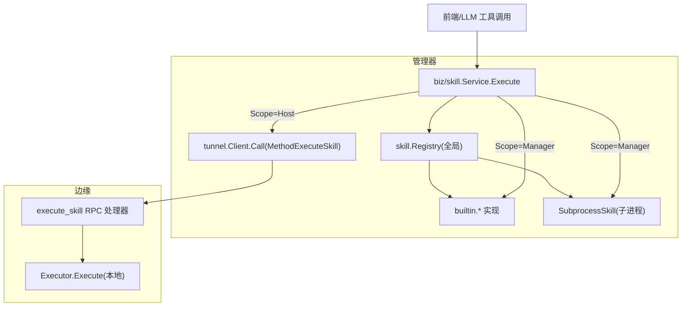
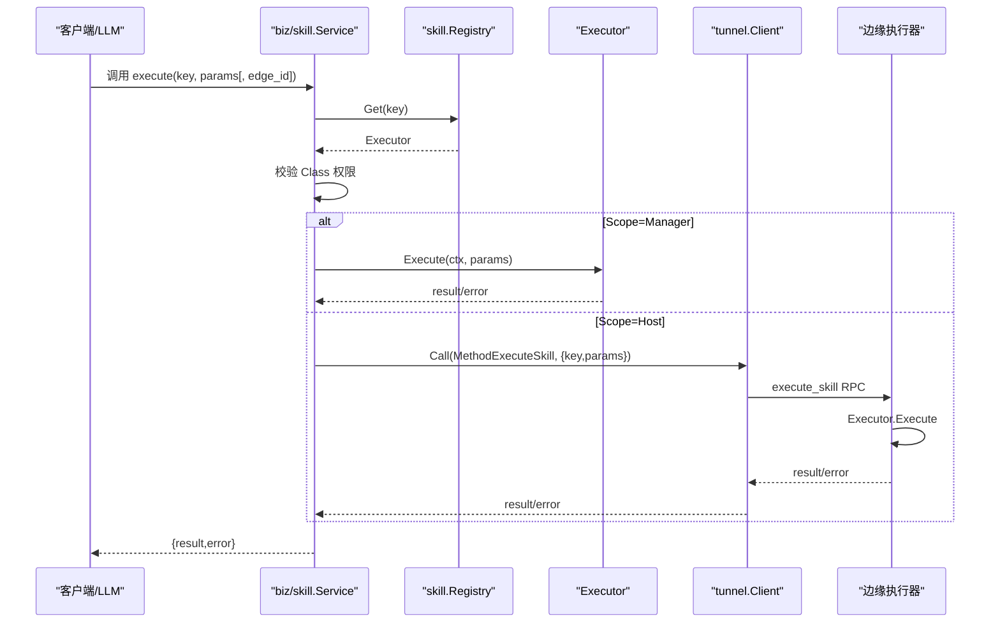
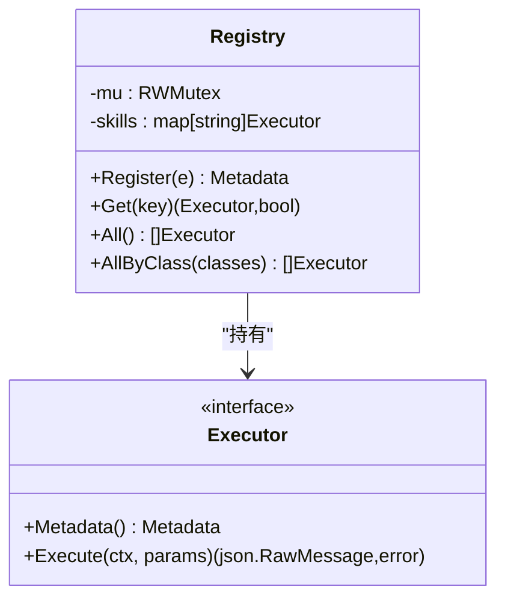
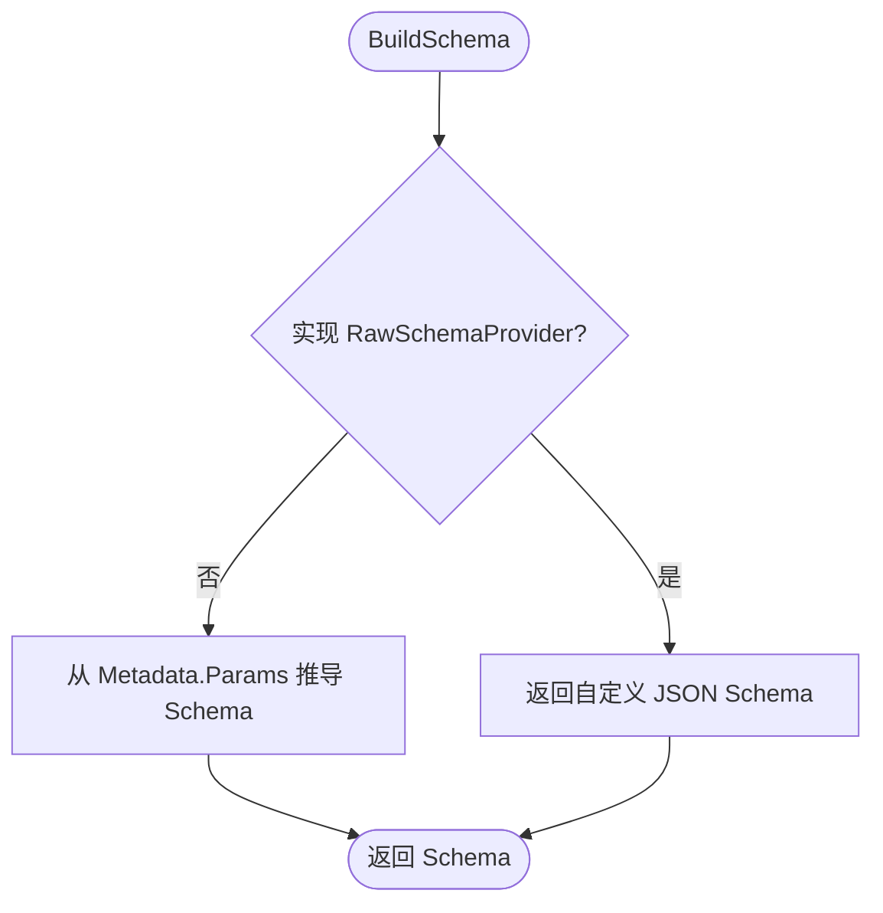
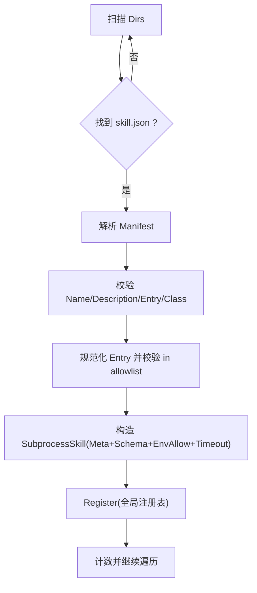
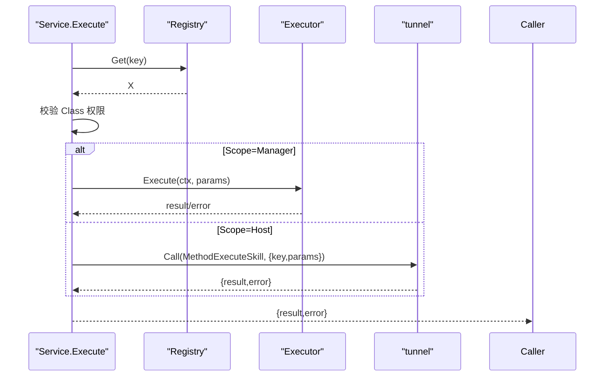
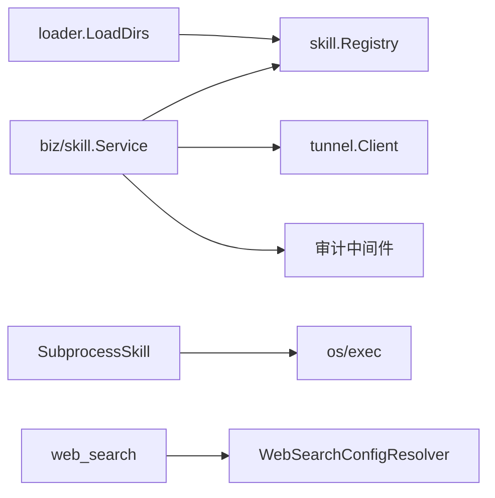

# 工具系统

<cite>
**本文引用的文件**
- [internal/skill/types.go](file://internal/skill/types.go)
- [internal/skill/registry.go](file://internal/skill/registry.go)
- [internal/skill/loader.go](file://internal/skill/loader.go)
- [internal/skill/schema.go](file://internal/skill/schema.go)
- [internal/skill/subprocess.go](file://internal/skill/subprocess.go)
- [internal/skill/builtin/probe_http.go](file://internal/skill/builtin/probe_http.go)
- [internal/skill/builtin/web_search.go](file://internal/skill/builtin/web_search.go)
- [internal/skill/builtin/capture_pcap.go](file://internal/skill/builtin/capture_pcap.go)
- [internal/manager/biz/skill/service.go](file://internal/manager/biz/skill/service.go)
- [internal/pkg/tunnel/messages.go](file://internal/pkg/tunnel/messages.go)
- [internal/pkg/tunnel/types.go](file://internal/pkg/tunnel/types.go)
- [web/src/api/skills.test.ts](file://web/src/api/skills.test.ts)
</cite>

## 目录
1. [简介](#简介)
2. [项目结构](#项目结构)
3. [核心组件](#核心组件)
4. [架构总览](#架构总览)
5. [详细组件分析](#详细组件分析)
6. [依赖关系分析](#依赖关系分析)
7. [性能考量](#性能考量)
8. [故障排查指南](#故障排查指南)
9. [结论](#结论)
10. [附录：自定义工具开发指南](#附录自定义工具开发指南)

## 简介
本技术文档系统化阐述 ongrid 的“工具系统”（Skill）设计，覆盖注册表、动态加载、版本与权限分类、参数校验、错误处理、结果格式化、装饰器式横切关注点（鉴权、限流、审计）、以及工具间通信机制。同时提供完整的自定义工具开发指南与最佳实践，帮助开发者安全高效地扩展能力。

## 项目结构
工具系统以 internal/skill 为核心，定义统一的 Executor 接口、元数据与参数 Schema，并提供全局注册表、外部子进程技能加载器与内置实现。管理器侧通过 biz/skill 服务进行调度、鉴权与审计；边缘侧通过 tunnel RPC 执行 host 作用域的技能。前端通过 REST API 调用并携带 edge_id（host 作用域时）。

图表来源
- [internal/manager/biz/skill/service.go:187-261](file://internal/manager/biz/skill/service.go#L187-L261)
- [internal/skill/registry.go:10-119](file://internal/skill/registry.go#L10-L119)
- [internal/skill/subprocess.go:30-78](file://internal/skill/subprocess.go#L30-L78)
- [internal/pkg/tunnel/messages.go:243-256](file://internal/pkg/tunnel/messages.go#L243-L256)

章节来源
- [internal/skill/types.go:1-27](file://internal/skill/types.go#L1-L27)
- [internal/skill/registry.go:10-119](file://internal/skill/registry.go#L10-L119)
- [internal/manager/biz/skill/service.go:187-261](file://internal/manager/biz/skill/service.go#L187-L261)

## 核心组件
- 工具元数据与参数 Schema：统一描述工具名称、描述、权限类别、作用域、参数类型与默认值，并生成 LLM 可用的 JSON Schema。
- 执行器接口：每个工具实现 Metadata() 与 Execute(ctx, params)，框架负责调度、鉴权、审计与结果封装。
- 全局注册表：进程级工具目录，支持按 Key 查找、按类别过滤、排序枚举。
- 动态加载器：扫描外部 skill.json 清单，构建 SubprocessSkill 并注册到全局注册表，限制入口路径与环境变量白名单。
- 子进程执行器：以独立进程运行外部可执行文件，严格限制超时、输出大小、环境变量继承，并将非零退出码转换为结构化错误。
- 管理器调度服务：根据 Scope 决定在管理器内执行或经隧道转发到边缘执行；基于 Class 做最小权限控制；记录审计日志。
- 隧道消息协议：定义 execute_skill 的请求/响应信封，确保 key 与 params 在云边之间可靠传递。

章节来源
- [internal/skill/types.go:63-175](file://internal/skill/types.go#L63-L175)
- [internal/skill/registry.go:21-119](file://internal/skill/registry.go#L21-L119)
- [internal/skill/loader.go:13-74](file://internal/skill/loader.go#L13-L74)
- [internal/skill/subprocess.go:17-78](file://internal/skill/subprocess.go#L17-L78)
- [internal/manager/biz/skill/service.go:187-261](file://internal/manager/biz/skill/service.go#L187-L261)
- [internal/pkg/tunnel/messages.go:243-256](file://internal/pkg/tunnel/messages.go#L243-L256)

## 架构总览
工具系统采用“声明式元数据 + 统一执行器 + 注册表 + 调度服务”的分层架构。工具作者只需实现一个 Executor 并在 init 中注册；框架自动完成 LLM 工具注册、HTTP 路由、UI 表单、权限门控与审计。

图表来源
- [internal/manager/biz/skill/service.go:187-261](file://internal/manager/biz/skill/service.go#L187-L261)
- [internal/skill/registry.go:35-47](file://internal/skill/registry.go#L35-L47)
- [internal/pkg/tunnel/messages.go:243-256](file://internal/pkg/tunnel/messages.go#L243-L256)

## 详细组件分析

### 注册表与并发模型
- 全局注册表使用读写锁保护，注册阶段单线程（init），运行时并发读取。
- Register 会校验元数据并拒绝重复 Key；Get 返回 (Executor, bool)；All/AllByClass 用于枚举与按类别过滤。
- 测试可通过 NewRegistryForTest 获取隔离实例。

图表来源
- [internal/skill/registry.go:21-119](file://internal/skill/registry.go#L21-L119)

章节来源
- [internal/skill/registry.go:10-119](file://internal/skill/registry.go#L10-L119)

### 元数据、参数与 Schema 推导
- Metadata 包含 Key、Name、Description、Class、Scope、Category、Params、ResultPreview。
- ParamSchema 将声明式参数映射为 OpenAI function-calling 兼容的 JSON Schema；支持 string/int/float/bool/duration/enum/array。
- RawSchemaProvider 允许工具提供自定义 JSON Schema，覆盖默认推导。

图表来源
- [internal/skill/schema.go:5-20](file://internal/skill/schema.go#L5-L20)
- [internal/skill/types.go:63-175](file://internal/skill/types.go#L63-L175)

章节来源
- [internal/skill/types.go:63-175](file://internal/skill/types.go#L63-L175)
- [internal/skill/schema.go:5-96](file://internal/skill/schema.go#L5-L96)

### 动态加载与外部子进程工具
- LoaderConfig.Dirs 指定允许扫描的外部目录；LoadDirs 递归查找 skill.json 并构建 SubprocessSkill。
- 安全约束：Entry 必须绝对路径且位于 allowlist 根目录下（含符号链接解析）；EnvAllow 白名单注入环境变量；TimeoutSeconds 限制执行时长。
- 子进程执行：stdin 传入 params JSON，stdout 作为结果 JSON；对 stderr 保留尾部片段便于诊断；超时会返回错误；非零退出码包装 stderr 提示。

图表来源
- [internal/skill/loader.go:69-160](file://internal/skill/loader.go#L69-L160)
- [internal/skill/loader.go:176-254](file://internal/skill/loader.go#L176-L254)
- [internal/skill/subprocess.go:99-172](file://internal/skill/subprocess.go#L99-L172)

章节来源
- [internal/skill/loader.go:13-274](file://internal/skill/loader.go#L13-L274)
- [internal/skill/subprocess.go:17-268](file://internal/skill/subprocess.go#L17-L268)

### 管理器调度与权限/作用域
- Service.Execute 根据 Meta.EffectiveClass() 做最小权限控制：safe 允许认证用户，mutating 需要管理员，dangerous 暂拒（需 SOP 签名）。
- 根据 EffectiveScope() 选择执行位置：
  - ScopeManager：在管理器进程内直接调用 Executor.Execute。
  - ScopeHost：通过 tunnel.Client.Call(MethodExecuteSkill) 转发到边缘执行，要求 EdgeID 非空。
- 结果统一封装为 {result,error}，错误信息透传以便上层展示。

图表来源
- [internal/manager/biz/skill/service.go:187-261](file://internal/manager/biz/skill/service.go#L187-L261)
- [internal/pkg/tunnel/messages.go:243-256](file://internal/pkg/tunnel/messages.go#L243-L256)

章节来源
- [internal/manager/biz/skill/service.go:187-261](file://internal/manager/biz/skill/service.go#L187-L261)

### 内置工具示例
- HTTP 探测：仅 HEAD/GET，跳过 TLS 验证以适应内网自签证书，返回状态码、延迟与内容长度。
- 联网搜索：多后端（SearXNG/Tavily/Brave），通过配置解析器选择 provider，未配置时返回 skipped_reason 而非错误，便于 LLM 引导用户修复。
- PCAP 抓包：声明为 host 作用域，实际执行在边缘；管理器仅暴露元数据与查询接口。

章节来源
- [internal/skill/builtin/probe_http.go:15-120](file://internal/skill/builtin/probe_http.go#L15-L120)
- [internal/skill/builtin/web_search.go:19-283](file://internal/skill/builtin/web_search.go#L19-L283)
- [internal/skill/builtin/capture_pcap.go:11-73](file://internal/skill/builtin/capture_pcap.go#L11-L73)

### 工具间通信与数据传递
- 管理器到边缘：通过 tunnel.MethodExecuteSkill 发送 ExecuteSkillRequest{Key, Params}，返回 ExecuteSkillResponse{Result, Error}。
- 前端到管理器：REST 接口 /api/v1/skills/{key}/execute，host 作用域时请求体包含 edge_id，manager 作用域时不包含。
- 参数与结果均以 JSON 传输；参数由框架先按 Schema 校验，再交给 Executor 防御性反序列化。

章节来源
- [internal/pkg/tunnel/messages.go:243-256](file://internal/pkg/tunnel/messages.go#L243-L256)
- [web/src/api/skills.test.ts:8-39](file://web/src/api/skills.test.ts#L8-L39)

## 依赖关系分析
- 管理器 biz/skill.Service 依赖 skill.Registry 获取 Executor，依赖 tunnel.Client 进行远程执行，依赖审计中间件记录操作。
- loader 依赖文件系统与 JSON 解析，构建 SubprocessSkill 后注册到全局注册表。
- 内置工具依赖网络库与可选的配置解析器，保持松耦合。

图表来源
- [internal/manager/biz/skill/service.go:187-261](file://internal/manager/biz/skill/service.go#L187-L261)
- [internal/skill/loader.go:69-160](file://internal/skill/loader.go#L69-L160)
- [internal/skill/subprocess.go:207-238](file://internal/skill/subprocess.go#L207-L238)
- [internal/skill/builtin/web_search.go:48-87](file://internal/skill/builtin/web_search.go#L48-L87)

章节来源
- [internal/manager/biz/skill/service.go:187-261](file://internal/manager/biz/skill/service.go#L187-L261)
- [internal/skill/loader.go:69-160](file://internal/skill/loader.go#L69-L160)
- [internal/skill/subprocess.go:207-238](file://internal/skill/subprocess.go#L207-L238)
- [internal/skill/builtin/web_search.go:48-87](file://internal/skill/builtin/web_search.go#L48-L87)

## 性能考量
- 子进程输出限制：stdout 最大 16 MiB，stderr 仅保留尾部 4 KiB，避免恶意或异常输出耗尽内存。
- 超时控制：子进程默认 30 秒，可通过 manifest 配置；上下文取消传播至子进程。
- 并发安全：注册表读多写少，使用 RWMutex；注册阶段 panic 快速失败，避免脏状态。
- 网络 I/O：HTTP 探测与搜索均设置超时；搜索响应体限制读取，防止大响应阻塞。
- 枚举与排序：All/AllByClass 返回有序列表，便于 UI 稳定展示。

章节来源
- [internal/skill/subprocess.go:17-28](file://internal/skill/subprocess.go#L17-L28)
- [internal/skill/subprocess.go:145-172](file://internal/skill/subprocess.go#L145-L172)
- [internal/skill/registry.go:84-116](file://internal/skill/registry.go#L84-L116)
- [internal/skill/builtin/probe_http.go:62-120](file://internal/skill/builtin/probe_http.go#L62-L120)
- [internal/skill/builtin/web_search.go:225-283](file://internal/skill/builtin/web_search.go#L225-L283)

## 故障排查指南
- 找不到工具：Get 返回 false，调度层返回 not_found；检查 Key 是否正确注册。
- 参数无效：Schema 校验失败或 JSON 非法；检查前端传参与 ParamSchema 定义。
- 子进程错误：非零退出码会附带 stderr 尾部；检查 entry 是否可执行、环境变量是否允许、超时是否过短。
- 权限不足：Class 为 mutating/dangerous 但角色不满足；调整角色或审批流程。
- 作用域错误：host 作用域缺少 edge_id；在请求中补充 edge_id。
- 网络问题：搜索不可达返回 skipped_reason；检查 SearXNG/Tavily/Brave 配置与连通性。

章节来源
- [internal/skill/registry.go:35-47](file://internal/skill/registry.go#L35-L47)
- [internal/skill/types.go:127-175](file://internal/skill/types.go#L127-L175)
- [internal/skill/subprocess.go:112-172](file://internal/skill/subprocess.go#L112-L172)
- [internal/manager/biz/skill/service.go:187-261](file://internal/manager/biz/skill/service.go#L187-L261)
- [internal/skill/builtin/web_search.go:285-374](file://internal/skill/builtin/web_search.go#L285-L374)

## 结论
该工具系统通过统一的元数据与执行器抽象，结合注册表与调度服务，实现了工具的可插拔、跨端执行与安全治理。动态加载与子进程沙箱化进一步提升了可扩展性与安全性。配合权限分类、审计与限流等横切关注点，形成了完整的企业级工具生态。

## 附录：自定义工具开发指南

### 工具接口定义
- 实现 Executor 接口：
  - Metadata()：返回工具元数据（Key、Name、Description、Class、Scope、Category、Params、ResultPreview）。
  - Execute(ctx, params)：接收已按 Schema 校验的参数，返回 JSON 结果或错误。
- 可选实现 RawSchemaProvider：提供自定义 JSON Schema，适用于复杂参数形状。

章节来源
- [internal/skill/types.go:177-203](file://internal/skill/types.go#L177-L203)
- [internal/skill/schema.go:5-20](file://internal/skill/schema.go#L5-L20)

### 实现示例要点
- 简单本地工具：如 HTTP 探测，注意参数校验、超时与结果结构。
- 外部子进程工具：编写 skill.json 清单，定义 entry、env_allow、timeout_seconds、class；确保 entry 在允许目录内。
- 边缘执行工具：设置 Scope=host，并在管理器侧通过 edge_id 调用；边缘侧实现对应逻辑。

章节来源
- [internal/skill/builtin/probe_http.go:15-120](file://internal/skill/builtin/probe_http.go#L15-L120)
- [internal/skill/loader.go:13-74](file://internal/skill/loader.go#L13-L74)
- [internal/skill/builtin/capture_pcap.go:11-73](file://internal/skill/builtin/capture_pcap.go#L11-L73)

### 测试方法
- 单元测试：使用 NewRegistryForTest 创建隔离注册表，注册待测工具，断言行为。
- 子进程测试：通过 runner 注入替身，模拟 stdout/stderr/exit code。
- 集成测试：mock 外部 HTTP 服务（如 web_search 的 providers），验证端到端流程。

章节来源
- [internal/skill/registry.go:121-127](file://internal/skill/registry.go#L121-L127)
- [internal/skill/subprocess.go:75-85](file://internal/skill/subprocess.go#L75-L85)
- [internal/skill/builtin/web_search.go:122-148](file://internal/skill/builtin/web_search.go#L122-L148)

### 权限、限流与审计（横切关注点）
- 权限：依据 Class 控制调用者角色（safe/mutating/dangerous）。
- 限流：登录等敏感路径实施速率限制，失败时记录审计事件。
- 审计：中间件收集请求上下文（用户、租户、IP、UA、请求 ID），统一写入审计存储。

章节来源
- [internal/manager/biz/skill/service.go:187-261](file://internal/manager/biz/skill/service.go#L187-L261)
- [internal/iam/server/http.go:221-269](file://internal/iam/server/http.go#L221-L269)
- [internal/manager/server/middleware/audit.go:79-144](file://internal/manager/server/middleware/audit.go#L79-L144)

### 安全最佳实践
- 最小权限原则：明确设置 Class，避免危险能力被误用。
- 输入防御：Execute 中对 params 进行防御性反序列化与边界检查。
- 子进程隔离：严格限制 entry 路径与环境变量；设置合理超时与输出上限。
- 网络访问：对外部请求设置超时与响应体限制；必要时跳过 TLS 验证仅限内网场景。

章节来源
- [internal/skill/types.go:127-175](file://internal/skill/types.go#L127-L175)
- [internal/skill/subprocess.go:112-172](file://internal/skill/subprocess.go#L112-L172)
- [internal/skill/builtin/probe_http.go:62-120](file://internal/skill/builtin/probe_http.go#L62-L120)
- [internal/skill/builtin/web_search.go:225-283](file://internal/skill/builtin/web_search.go#L225-L283)