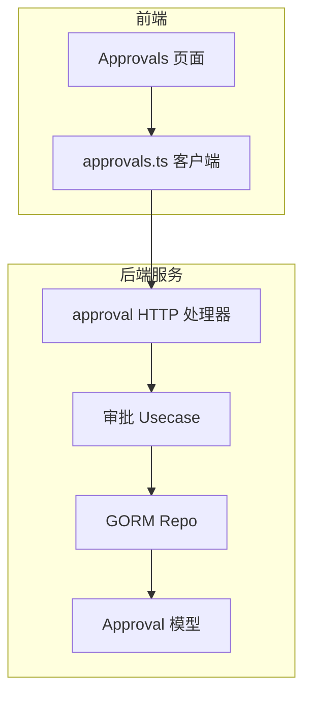
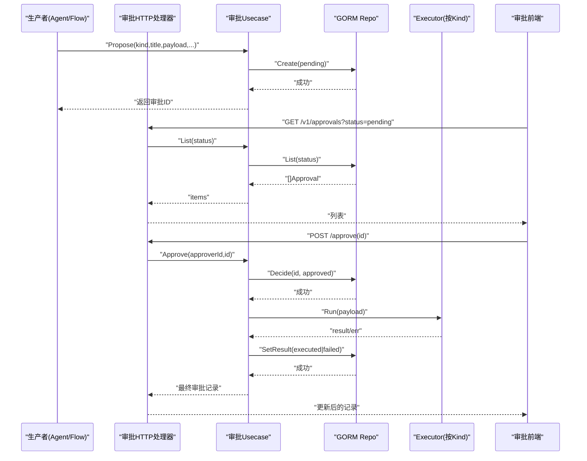
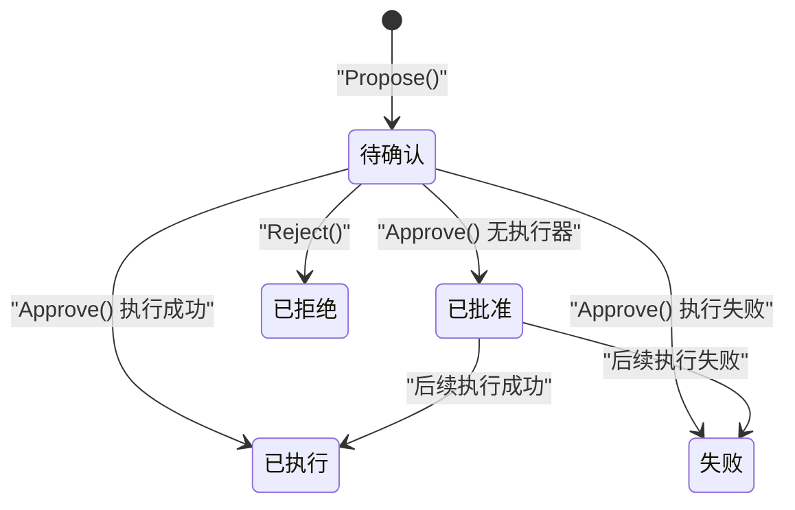
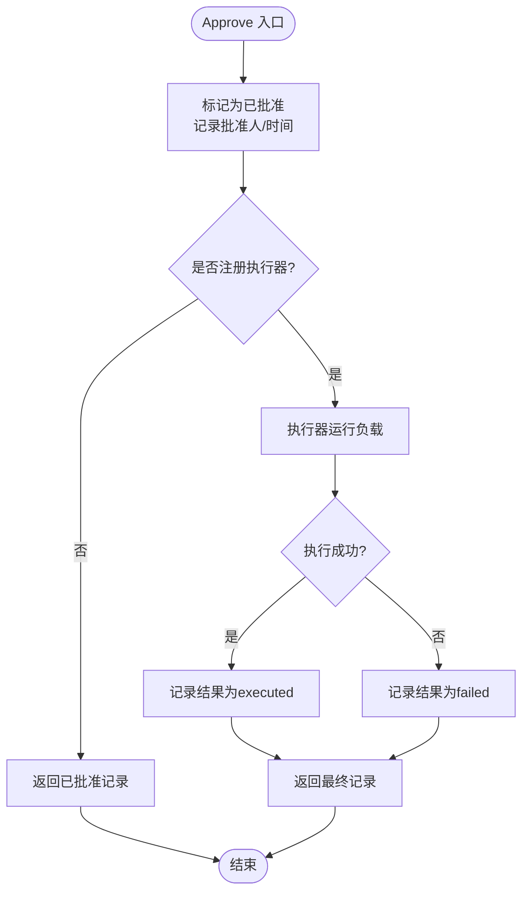
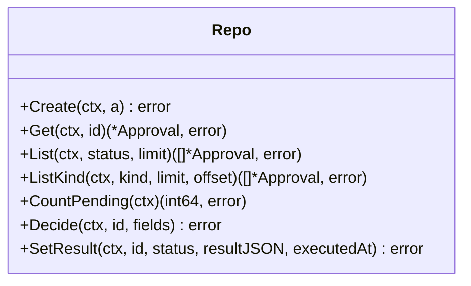
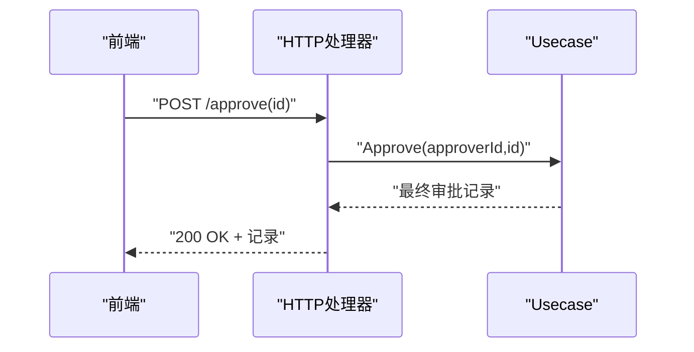
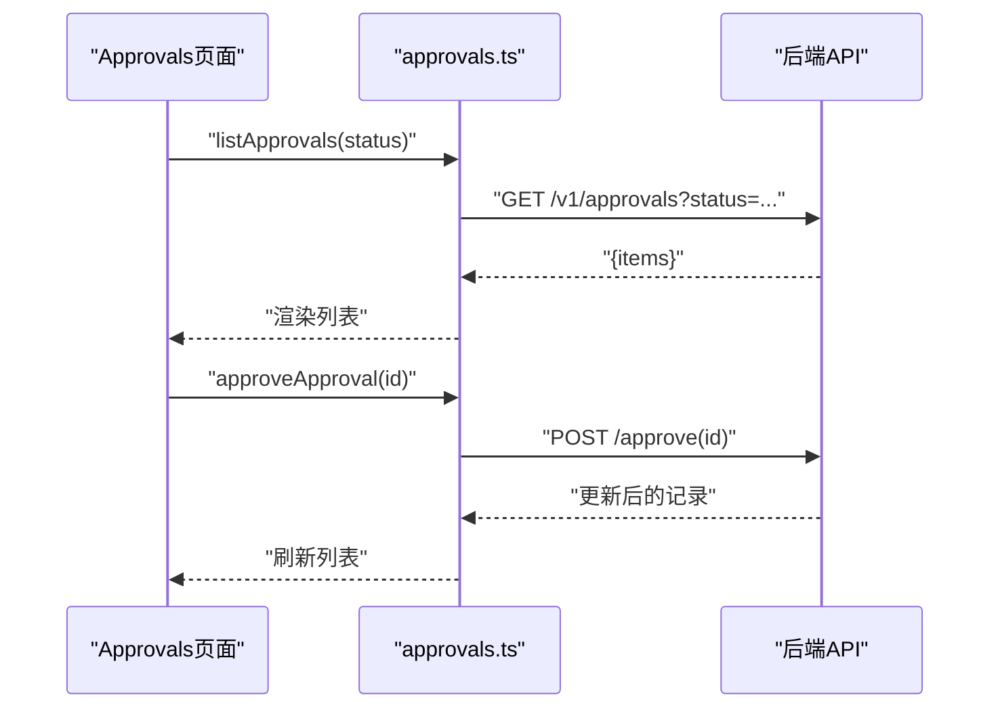
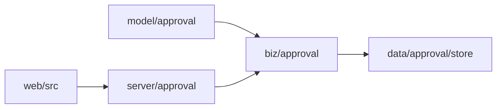

# 人类审批门控

<cite>
**本文引用的文件**
- [internal/manager/biz/approval/usecase.go](file://internal/manager/biz/approval/usecase.go)
- [internal/manager/model/approval/model.go](file://internal/manager/model/approval/model.go)
- [internal/manager/data/approval/store/repo.go](file://internal/manager/data/approval/store/repo.go)
- [internal/manager/server/approval/http.go](file://internal/manager/server/approval/http.go)
- [web/src/pages/Approvals.tsx](file://web/src/pages/Approvals.tsx)
- [web/src/api/approvals.ts](file://web/src/api/approvals.ts)
</cite>

## 目录
1. [简介](#简介)
2. [项目结构](#项目结构)
3. [核心组件](#核心组件)
4. [架构总览](#架构总览)
5. [详细组件分析](#详细组件分析)
6. [依赖关系分析](#依赖关系分析)
7. [性能考虑](#性能考虑)
8. [故障排查指南](#故障排查指南)
9. [结论](#结论)
10. [附录](#附录)

## 简介
本技术文档围绕“人类审批门控”（Human-in-the-Loop Approval Gate）展开，聚焦于危险操作的提议-确认机制：由系统或智能体发起的敏感操作必须进入审批队列，经管理员在界面中批准或拒绝后，才可能执行。文档覆盖以下方面：
- 审批请求的创建、状态跟踪与决策处理机制
- 审批界面的集成方式：消息推送、状态同步与用户交互
- 审批策略的配置选项：审批人指定、超时处理、自动批准规则
- 监控指标与审计日志方法

该设计遵循“严格增量”原则：新增一张 approvals 表与配套包，不改动现有运行路径；只有当生产者显式调用 Propose 时，动作才会进入审批流。

## 项目结构
审批子系统采用分层组织：
- 模型层：定义审批实体与状态常量
- 业务层：封装提议、查询、批准、拒绝等用例
- 数据层：基于 GORM 的持久化实现
- 服务层：HTTP 路由暴露 API
- 前端：审批收件箱页面与 API 客户端

图表来源
- [internal/manager/server/approval/http.go:24-30](file://internal/manager/server/approval/http.go#L24-L30)
- [internal/manager/biz/approval/usecase.go:21-30](file://internal/manager/biz/approval/usecase.go#L21-L30)
- [internal/manager/data/approval/store/repo.go:15-24](file://internal/manager/data/approval/store/repo.go#L15-L24)
- [internal/manager/model/approval/model.go:18-56](file://internal/manager/model/approval/model.go#L18-L56)
- [web/src/pages/Approvals.tsx:23-38](file://web/src/pages/Approvals.tsx#L23-L38)
- [web/src/api/approvals.ts:25-44](file://web/src/api/approvals.ts#L25-L44)

章节来源
- [internal/manager/server/approval/http.go:24-30](file://internal/manager/server/approval/http.go#L24-L30)
- [internal/manager/biz/approval/usecase.go:21-30](file://internal/manager/biz/approval/usecase.go#L21-L30)
- [internal/manager/data/approval/store/repo.go:15-24](file://internal/manager/data/approval/store/repo.go#L15-L24)
- [internal/manager/model/approval/model.go:18-56](file://internal/manager/model/approval/model.go#L18-L56)
- [web/src/pages/Approvals.tsx:23-38](file://web/src/pages/Approvals.tsx#L23-L38)
- [web/src/api/approvals.ts:25-44](file://web/src/api/approvals.ts#L25-L44)

## 核心组件
- 模型 Approval：描述一次待决/已决的危险操作，包含 kind、title、summary、payload、source、session_id、status、proposed_by、approved_by、reason、result、时间戳等字段，并提供状态与来源常量。
- 业务用例 Usecase：提供 Propose、List/Get/CountPending、Approve、Reject 等方法；通过注册 Executor 将不同 kind 的执行逻辑解耦。
- 存储 Repo：基于 GORM 的 CRUD、按状态/类型分页查询、乐观锁式 Decide 防止重复决策、记录执行结果。
- HTTP 处理器：挂载 /v1/approvals/* 路由，列表、计数、详情、批准、拒绝接口，读/决策端点需管理员权限。
- 前端页面与客户端：展示待确认收件箱，支持按状态筛选、批准/拒绝交互、错误提示与刷新。

章节来源
- [internal/manager/model/approval/model.go:18-83](file://internal/manager/model/approval/model.go#L18-L83)
- [internal/manager/biz/approval/usecase.go:59-148](file://internal/manager/biz/approval/usecase.go#L59-L148)
- [internal/manager/data/approval/store/repo.go:21-101](file://internal/manager/data/approval/store/repo.go#L21-L101)
- [internal/manager/server/approval/http.go:24-43](file://internal/manager/server/approval/http.go#L24-L43)
- [web/src/pages/Approvals.tsx:14-64](file://web/src/pages/Approvals.tsx#L14-L64)
- [web/src/api/approvals.ts:7-44](file://web/src/api/approvals.ts#L7-L44)

## 架构总览
审批门控的关键流程如下：
- 生产者（如 Agent 命令、工作流节点）调用 Propose 创建一条 pending 状态的审批记录
- 管理员在 UI 中查看并选择批准或拒绝
- 批准后，若存在对应 kind 的 Executor，则执行并记录结果；否则仅标记为 approved
- 拒绝则直接标记 rejected，不执行

图表来源
- [internal/manager/biz/approval/usecase.go:72-138](file://internal/manager/biz/approval/usecase.go#L72-L138)
- [internal/manager/data/approval/store/repo.go:21-101](file://internal/manager/data/approval/store/repo.go#L21-L101)
- [internal/manager/server/approval/http.go:24-43](file://internal/manager/server/approval/http.go#L24-L43)
- [web/src/pages/Approvals.tsx:40-64](file://web/src/pages/Approvals.tsx#L40-L64)
- [web/src/api/approvals.ts:25-44](file://web/src/api/approvals.ts#L25-L44)

## 详细组件分析

### 模型与状态机
- 实体 Approval：唯一标识、kind、标题、摘要、负载、来源、会话、状态、提议者、批准者、原因、结果、时间戳
- 状态常量：pending → approved/executed/rejected/failed
- 来源常量：agent、flow

图表来源
- [internal/manager/model/approval/model.go:69-83](file://internal/manager/model/approval/model.go#L69-L83)
- [internal/manager/biz/approval/usecase.go:108-148](file://internal/manager/biz/approval/usecase.go#L108-L148)

章节来源
- [internal/manager/model/approval/model.go:18-83](file://internal/manager/model/approval/model.go#L18-L83)

### 业务用例（Usecase）
- Propose：校验必填项，序列化 payload，写入 pending 记录，记录日志
- List/Get/CountPending：面向收件箱的读取能力
- Approve：先标记 approved 并记录批准人与时间；若注册了 executor，则执行并记录结果；未注册 executor 时仅标记 approved
- Reject：标记 rejected，记录原因与时间

图表来源
- [internal/manager/biz/approval/usecase.go:108-148](file://internal/manager/biz/approval/usecase.go#L108-L148)

章节来源
- [internal/manager/biz/approval/usecase.go:59-148](file://internal/manager/biz/approval/usecase.go#L59-L148)

### 数据持久化（Repo）
- Create/Get/List/ListKind：基础读写与过滤、分页
- CountPending：用于导航徽标计数
- Decide：仅在 pending 状态下更新，避免重复决策
- SetResult：记录执行结果与执行时间

图表来源
- [internal/manager/data/approval/store/repo.go:15-101](file://internal/manager/data/approval/store/repo.go#L15-L101)

章节来源
- [internal/manager/data/approval/store/repo.go:21-101](file://internal/manager/data/approval/store/repo.go#L21-L101)

### HTTP 接口
- GET /v1/approvals：列出审批，支持 status 过滤
- GET /v1/approvals/count：待处理数量
- GET /v1/approvals/{id}：获取单条详情
- POST /v1/approvals/{id}/approve：批准并触发执行
- POST /v1/approvals/{id}/reject：拒绝并记录原因
- 所有读/决策接口需管理员权限

图表来源
- [internal/manager/server/approval/http.go:24-43](file://internal/manager/server/approval/http.go#L24-L43)
- [internal/manager/biz/approval/usecase.go:108-138](file://internal/manager/biz/approval/usecase.go#L108-L138)

章节来源
- [internal/manager/server/approval/http.go:24-43](file://internal/manager/server/approval/http.go#L24-L43)

### 前端集成
- 收件箱页面：默认显示 pending，支持按状态切换、刷新、展开详情、批准/拒绝交互
- API 客户端：封装 list、count、get、approve、reject 调用
- 错误处理：捕获 API 错误并展示

图表来源
- [web/src/pages/Approvals.tsx:23-64](file://web/src/pages/Approvals.tsx#L23-L64)
- [web/src/api/approvals.ts:25-44](file://web/src/api/approvals.ts#L25-L44)

章节来源
- [web/src/pages/Approvals.tsx:14-64](file://web/src/pages/Approvals.tsx#L14-L64)
- [web/src/api/approvals.ts:7-44](file://web/src/api/approvals.ts#L7-L44)

## 依赖关系分析
- 耦合与内聚：
  - Usecase 通过 Repo 接口与存储解耦，便于替换实现
  - Executor 以 Kind 为键注册，生产者在启动时注入，保持高内聚低耦合
- 外部依赖：
  - GORM 作为 ORM
  - chi 作为 HTTP 路由
  - slog 用于结构化日志
- 潜在循环依赖：
  - 当前分层清晰，未发现循环导入

图表来源
- [internal/manager/model/approval/model.go:1-16](file://internal/manager/model/approval/model.go#L1-L16)
- [internal/manager/biz/approval/usecase.go:9-19](file://internal/manager/biz/approval/usecase.go#L9-L19)
- [internal/manager/data/approval/store/repo.go:4-13](file://internal/manager/data/approval/store/repo.go#L4-L13)
- [internal/manager/server/approval/http.go:5-15](file://internal/manager/server/approval/http.go#L5-L15)
- [web/src/api/approvals.ts:1-6](file://web/src/api/approvals.ts#L1-L6)

章节来源
- [internal/manager/model/approval/model.go:1-16](file://internal/manager/model/approval/model.go#L1-L16)
- [internal/manager/biz/approval/usecase.go:9-19](file://internal/manager/biz/approval/usecase.go#L9-L19)
- [internal/manager/data/approval/store/repo.go:4-13](file://internal/manager/data/approval/store/repo.go#L4-L13)
- [internal/manager/server/approval/http.go:5-15](file://internal/manager/server/approval/http.go#L5-L15)
- [web/src/api/approvals.ts:1-6](file://web/src/api/approvals.ts#L1-L6)

## 性能考虑
- 列表查询：默认限制 100 条，可按状态过滤，减少不必要的数据加载
- 计数接口：独立 COUNT 查询，避免全表扫描
- 乐观锁：Decide 仅在 pending 状态更新，避免并发冲突导致的重复执行
- 执行器异步化建议：对耗时执行可考虑异步任务队列，避免阻塞 HTTP 响应
- 前端轮询：建议合理设置刷新频率，避免频繁请求

[本节为通用指导，无需特定文件引用]

## 故障排查指南
- 无法批准（重复决策）：
  - 现象：批准接口返回未找到或无影响
  - 原因：记录已非 pending（已被批准/拒绝）
  - 定位：检查 Decide 的 WHERE 条件与 RowsAffected
- 批准但未执行：
  - 现象：状态停留在 approved
  - 原因：未为该 kind 注册 Executor
  - 定位：检查启动时 RegisterExecutor 调用
- 执行失败：
  - 现象：状态为 failed，result 包含错误信息
  - 原因：Executor 抛出异常
  - 定位：查看 SetResult 写入的 result 与日志
- 前端报错：
  - 现象：页面显示错误消息
  - 原因：API 返回错误
  - 定位：检查浏览器网络面板与 ApiError 捕获

章节来源
- [internal/manager/data/approval/store/repo.go:80-94](file://internal/manager/data/approval/store/repo.go#L80-L94)
- [internal/manager/biz/approval/usecase.go:122-135](file://internal/manager/biz/approval/usecase.go#L122-L135)
- [web/src/pages/Approvals.tsx:29-33](file://web/src/pages/Approvals.tsx#L29-L33)

## 结论
人类审批门控通过清晰的模型、用例、存储与服务层划分，实现了安全可控的危险操作执行机制。其关键优势包括：
- 严格增量：不影响现有运行路径
- 可扩展：通过 Kind + Executor 注册机制扩展新操作
- 可观测：结构化日志与结果记录便于审计
- 易用：前端收件箱提供直观的状态管理与交互

建议在后续迭代中补充：
- 超时自动处理策略
- 自动批准规则引擎
- 更丰富的监控指标与告警
- 通知渠道集成（邮件/IM）

[本节为总结性内容，无需特定文件引用]

## 附录

### 审批流程设计原理
- 提议阶段：生产者提交 kind、title、summary、payload、source、session_id、proposed_by，生成 pending 记录
- 决策阶段：管理员批准或拒绝；批准后根据是否有执行器决定状态流转
- 执行阶段：执行器运行负载，记录结果与执行时间

章节来源
- [internal/manager/biz/approval/usecase.go:72-138](file://internal/manager/biz/approval/usecase.go#L72-L138)
- [internal/manager/model/approval/model.go:18-56](file://internal/manager/model/approval/model.go#L18-L56)

### 审批界面集成方式
- 消息推送：可通过通知通道在批准/拒绝后发送提醒（需在业务层扩展）
- 状态同步：前端通过列表与详情接口拉取最新状态
- 用户交互：支持按状态筛选、展开详情、批准/拒绝操作与错误提示

章节来源
- [web/src/pages/Approvals.tsx:23-64](file://web/src/pages/Approvals.tsx#L23-L64)
- [web/src/api/approvals.ts:25-44](file://web/src/api/approvals.ts#L25-L44)

### 审批策略配置选项
- 审批人指定：当前接口使用调用者身份作为 approver；可在上层鉴权中间件或业务层扩展角色/组策略
- 超时处理：当前未内置超时；可在存储层增加超时字段并在定时任务中处理
- 自动批准规则：可在 Usecase 层增加规则判断，满足条件时自动批准并执行

[本节为概念性说明，无需特定文件引用]

### 监控指标与审计日志方法
- 指标建议：
  - 待处理数量：CountPending
  - 批准/拒绝速率：统计 approve/reject 接口调用次数
  - 执行成功率：executed vs failed 比例
- 审计日志：
  - 结构化日志：记录 id、kind、title、approver、result
  - 结果字段：result_json 保存执行输出或错误信息

章节来源
- [internal/manager/biz/approval/usecase.go:92-93](file://internal/manager/biz/approval/usecase.go#L92-L93)
- [internal/manager/biz/approval/usecase.go:127-135](file://internal/manager/biz/approval/usecase.go#L127-L135)
- [internal/manager/data/approval/store/repo.go:72-78](file://internal/manager/data/approval/store/repo.go#L72-L78)