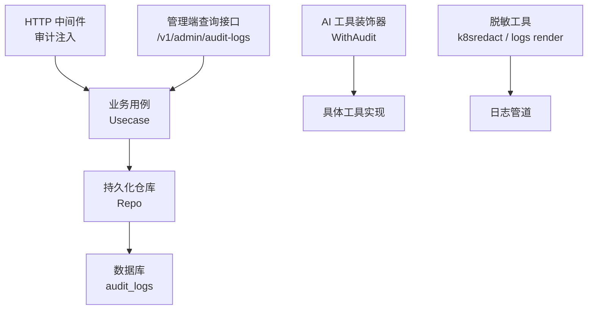
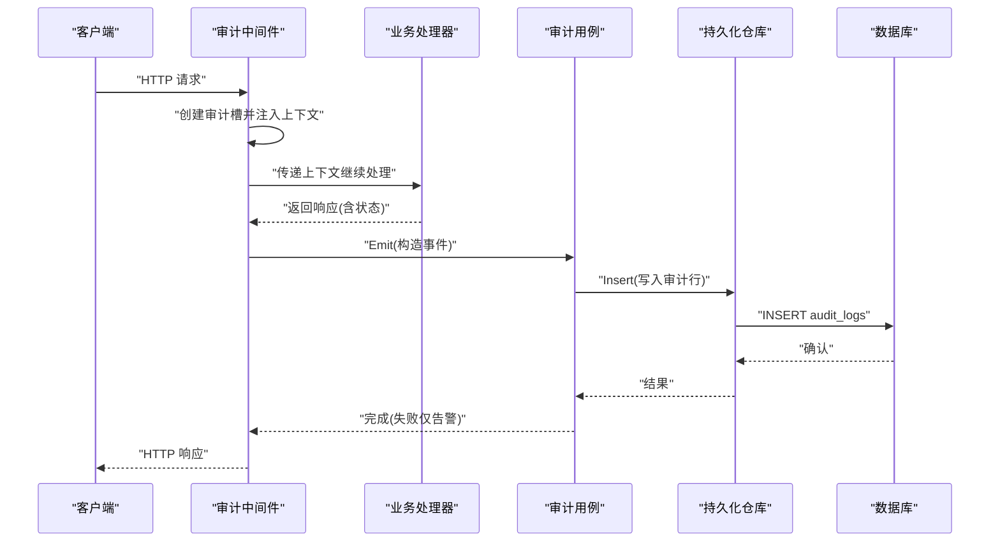
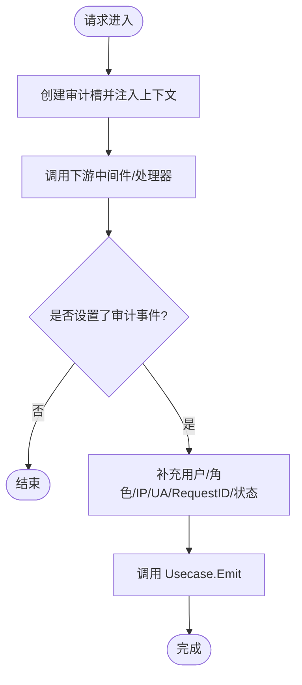
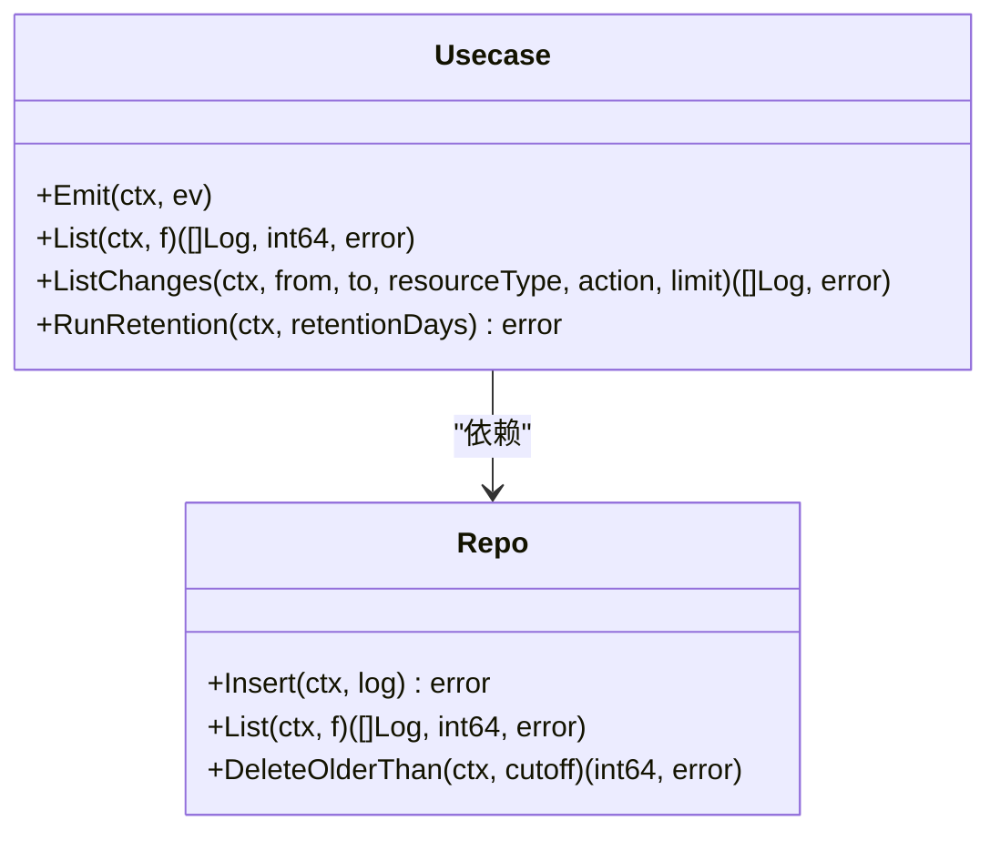
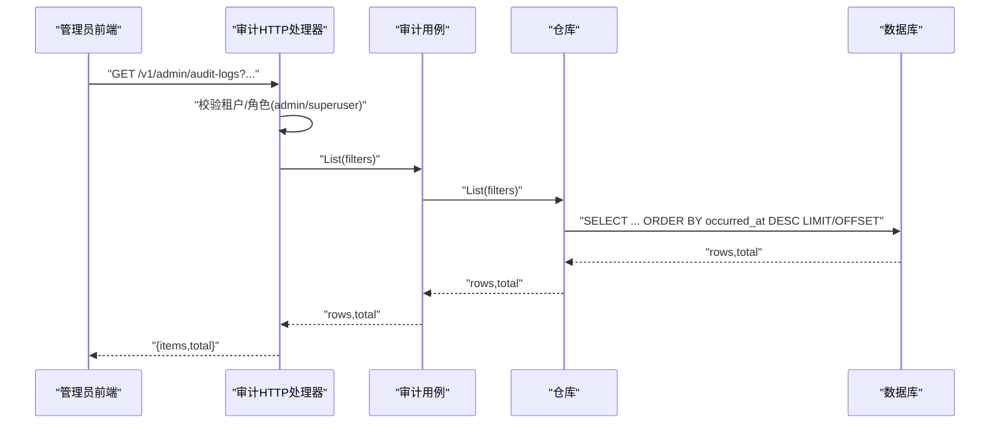
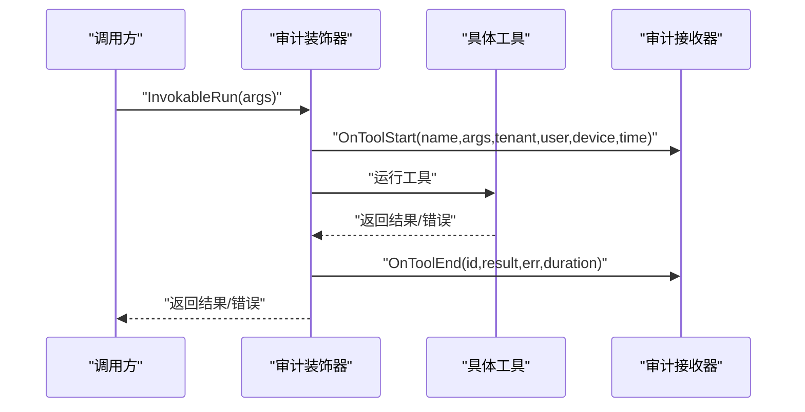
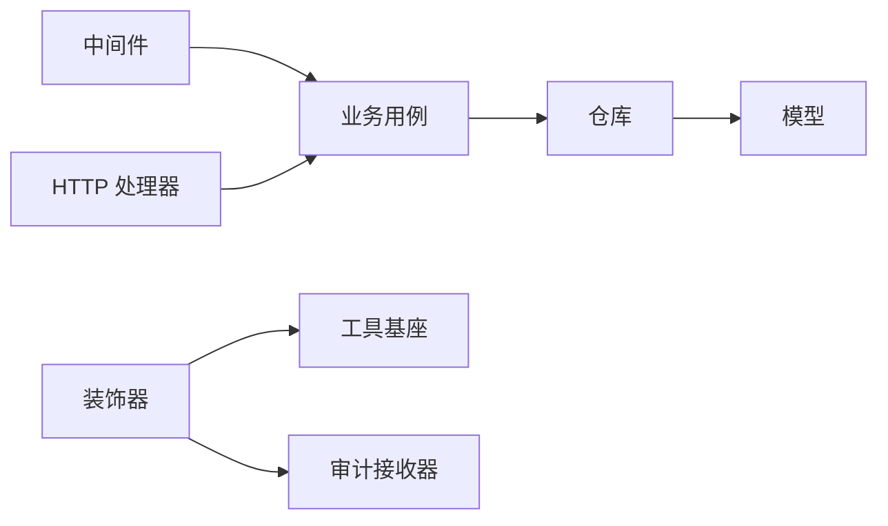

# 审计追踪

<cite>
**本文引用的文件**
- [internal/manager/server/middleware/audit.go](file://internal/manager/server/middleware/audit.go)
- [internal/manager/biz/audit/usecase.go](file://internal/manager/biz/audit/usecase.go)
- [internal/manager/model/audit/log.go](file://internal/manager/model/audit/log.go)
- [internal/manager/data/audit/store/repo.go](file://internal/manager/data/audit/store/repo.go)
- [internal/manager/data/audit/store/migrate.go](file://internal/manager/data/audit/store/migrate.go)
- [internal/manager/server/audit/http.go](file://internal/manager/server/audit/http.go)
- [internal/pkg/k8sredact/redact.go](file://internal/pkg/k8sredact/redact.go)
- [internal/edgeagent/plugins/logs/render.go](file://internal/edgeagent/plugins/logs/render.go)
- [internal/manager/biz/skill/audit.go](file://internal/manager/biz/skill/audit.go)
- [internal/manager/biz/aiops/tools/decorators/audit.go](file://internal/manager/biz/aiops/tools/decorators/audit.go)
</cite>

## 目录
1. [简介](#简介)
2. [项目结构](#项目结构)
3. [核心组件](#核心组件)
4. [架构总览](#架构总览)
5. [详细组件分析](#详细组件分析)
6. [依赖关系分析](#依赖关系分析)
7. [性能考量](#性能考量)
8. [故障排查指南](#故障排查指南)
9. [结论](#结论)
10. [附录](#附录)

## 简介
本文件面向“审计追踪”能力，系统性说明审计数据的采集、存储、查询与脱敏机制，并给出可操作的报告与分析方法。重点覆盖：
- 操作记录：通过中间件与装饰器在请求/工具调用生命周期中捕获行为。
- 参数捕获与结果存储：结构化事件模型与负载字段设计。
- 日志结构化格式与查询接口：统一的数据模型与分页过滤 API。
- 敏感信息脱敏与隐私保护：文本与键名级别的脱敏策略。
- 分析与报告生成：基于审计数据的变化回溯与报表流水线。

## 项目结构
审计功能横跨 HTTP 中间件、业务用例、持久化层、HTTP 查询接口以及若干装饰器与脱敏工具：
- 中间件层：在请求进入时注入审计槽，并在响应后填充上下文信息并触发写入。
- 业务层：定义事件模型、Emit/List/ListChanges/Retention 等能力。
- 持久化层：GORM 仓库实现增删查与保留清理。
- HTTP 接口：管理员只读查询审计日志（不自我审计）。
- 装饰器：对 AI 工具调用进行开始/结束审计。
- 脱敏工具：对日志体与属性键进行敏感信息替换。

图表来源
- [internal/manager/server/middleware/audit.go:16-104](file://internal/manager/server/middleware/audit.go#L16-L104)
- [internal/manager/biz/audit/usecase.go:72-116](file://internal/manager/biz/audit/usecase.go#L72-L116)
- [internal/manager/data/audit/store/repo.go:26-101](file://internal/manager/data/audit/store/repo.go#L26-L101)
- [internal/manager/server/audit/http.go:30-110](file://internal/manager/server/audit/http.go#L30-L110)
- [internal/manager/biz/aiops/tools/decorators/audit.go:59-121](file://internal/manager/biz/aiops/tools/decorators/audit.go#L59-L121)
- [internal/pkg/k8sredact/redact.go:11-42](file://internal/pkg/k8sredact/redact.go#L11-L42)
- [internal/edgeagent/plugins/logs/render.go:147-165](file://internal/edgeagent/plugins/logs/render.go#L147-L165)

章节来源
- [internal/manager/server/middleware/audit.go:16-104](file://internal/manager/server/middleware/audit.go#L16-L104)
- [internal/manager/biz/audit/usecase.go:72-116](file://internal/manager/biz/audit/usecase.go#L72-L116)
- [internal/manager/data/audit/store/repo.go:26-101](file://internal/manager/data/audit/store/repo.go#L26-L101)
- [internal/manager/server/audit/http.go:30-110](file://internal/manager/server/audit/http.go#L30-L110)
- [internal/manager/biz/aiops/tools/decorators/audit.go:59-121](file://internal/manager/biz/aiops/tools/decorators/audit.go#L59-L121)
- [internal/pkg/k8sredact/redact.go:11-42](file://internal/pkg/k8sredact/redact.go#L11-L42)
- [internal/edgeagent/plugins/logs/render.go:147-165](file://internal/edgeagent/plugins/logs/render.go#L147-L165)

## 核心组件
- 审计事件模型：包含操作者、资源、动作、状态、错误码、错误消息、负载 JSON 与请求 ID 等字段；提供成功/失败/拒绝三类状态与一组标准动作常量。
- 业务用例 Usecase：负责将事件落库、列表查询、变更回溯与定期保留清理；写入失败仅告警不阻塞业务。
- 持久化仓库 Repo：封装 GORM 的插入、带过滤的分页查询、按时间删除旧数据。
- HTTP 查询接口：管理员权限校验后的分页查询，返回标准化 JSON。
- 中间件审计槽：在请求上下文中维护可变槽，确保后续中间件或处理器可安全写入审计事件。
- 工具装饰器：为 AI 工具调用提供 OnToolStart/OnToolEnd 审计钩子。
- 脱敏工具：对文本与键名进行正则匹配替换，避免敏感信息泄露。

章节来源
- [internal/manager/model/audit/log.go:10-136](file://internal/manager/model/audit/log.go#L10-L136)
- [internal/manager/biz/audit/usecase.go:29-116](file://internal/manager/biz/audit/usecase.go#L29-L116)
- [internal/manager/data/audit/store/repo.go:14-101](file://internal/manager/data/audit/store/repo.go#L14-L101)
- [internal/manager/server/audit/http.go:22-110](file://internal/manager/server/audit/http.go#L22-L110)
- [internal/manager/server/middleware/audit.go:16-104](file://internal/manager/server/middleware/audit.go#L16-L104)
- [internal/manager/biz/aiops/tools/decorators/audit.go:10-121](file://internal/manager/biz/aiops/tools/decorators/audit.go#L10-L121)
- [internal/pkg/k8sredact/redact.go:11-42](file://internal/pkg/k8sredact/redact.go#L11-L42)

## 架构总览
审计追踪采用“中间件注入 + 业务用例 + 持久化仓库 + 管理端查询”的分层架构，辅以工具装饰器与脱敏工具保障可观测性与隐私安全。

图表来源
- [internal/manager/server/middleware/audit.go:16-104](file://internal/manager/server/middleware/audit.go#L16-L104)
- [internal/manager/biz/audit/usecase.go:72-116](file://internal/manager/biz/audit/usecase.go#L72-L116)
- [internal/manager/data/audit/store/repo.go:26-33](file://internal/manager/data/audit/store/repo.go#L26-L33)

## 详细组件分析

### 中间件审计槽与事件收集
- 在请求进入时创建可变审计槽并放入上下文，保证后续中间件或处理器即使使用 r.WithContext 也能共享同一指针。
- 处理器可通过 SetAuditEvent 显式设置要审计的事件；中间件在响应阶段从上下文提取事件，并从租户上下文与请求信息中补充用户、角色、IP、User-Agent、RequestID、状态桶等。
- 最终调用业务用例 Emit 完成写入；写入失败仅记录警告，不阻断业务。

图表来源
- [internal/manager/server/middleware/audit.go:16-104](file://internal/manager/server/middleware/audit.go#L16-L104)
- [internal/manager/server/middleware/audit.go:106-144](file://internal/manager/server/middleware/audit.go#L106-L144)

章节来源
- [internal/manager/server/middleware/audit.go:16-144](file://internal/manager/server/middleware/audit.go#L16-L144)

### 业务用例：事件模型与写入流程
- Event 输入：操作者、资源、动作、状态、错误信息、负载等；负载需由调用方在传入前完成脱敏。
- Emit：校验必填字段，构造 Log 行，序列化负载，调用仓库 Insert；失败仅告警。
- List：按过滤器分页查询，支持用户邮箱、动作、资源类型、状态、时间范围、限制与偏移。
- ListChanges：RCA 场景下按时间窗口与资源/动作筛选变更事件。
- RunRetention：每日定时清理过期数据，支持配置保留天数。

图表来源
- [internal/manager/biz/audit/usecase.go:29-183](file://internal/manager/biz/audit/usecase.go#L29-L183)
- [internal/manager/data/audit/store/repo.go:14-101](file://internal/manager/data/audit/store/repo.go#L14-L101)

章节来源
- [internal/manager/biz/audit/usecase.go:29-183](file://internal/manager/biz/audit/usecase.go#L29-L183)
- [internal/manager/data/audit/store/repo.go:14-101](file://internal/manager/data/audit/store/repo.go#L14-L101)

### 数据模型与结构化格式
- 审计日志表字段：发生时间、用户标识、邮箱、角色、IP、User-Agent、动作、资源类型/ID/名称、状态、错误码/消息、负载 JSON、请求 ID、创建时间。
- 状态枚举：success/failure/denied。
- 动作常量：以动词_资源命名，如 user_create、device_update、setting_update 等；具体差异通过负载体现。
- 资源类型：user/device/incident/setting/rule/channel/repo/skill/llm/git_ssh_key/grafana/rag/audit/auth。

章节来源
- [internal/manager/model/audit/log.go:10-136](file://internal/manager/model/audit/log.go#L10-L136)

### 查询接口设计与管理端访问
- 路由：GET /v1/admin/audit-logs
- 鉴权：必须为 admin 或超级用户；非管理员直接返回 403，且该读取行为不产生审计行以避免噪音。
- 查询参数：user_email、action、resource_type、status、from、to、limit、offset；时间使用 RFC3339。
- 返回：items 数组与 total 总数；内部将模型映射为 wireLog 输出。

图表来源
- [internal/manager/server/audit/http.go:30-110](file://internal/manager/server/audit/http.go#L30-L110)
- [internal/manager/data/audit/store/repo.go:49-93](file://internal/manager/data/audit/store/repo.go#L49-L93)

章节来源
- [internal/manager/server/audit/http.go:30-110](file://internal/manager/server/audit/http.go#L30-L110)
- [internal/manager/data/audit/store/repo.go:49-93](file://internal/manager/data/audit/store/repo.go#L49-L93)

### 工具调用审计装饰器
- WithAudit：包装 BaseTool，在 InvokableRun 前后分别调用 OnToolStart/OnToolEnd。
- OnToolStart：记录工具名、参数 JSON、租户、用户、设备、开始时间；若前置检查失败（如配额）可直接中止调用。
- OnToolEnd：记录结果 JSON、错误、结束时间、耗时；失败仅记录，不影响工具执行结果。
- 适用场景：AIOps 工具链的可观测性审计，便于事后归因与合规审查。

图表来源
- [internal/manager/biz/aiops/tools/decorators/audit.go:59-121](file://internal/manager/biz/aiops/tools/decorators/audit.go#L59-L121)

章节来源
- [internal/manager/biz/aiops/tools/decorators/audit.go:10-121](file://internal/manager/biz/aiops/tools/decorators/audit.go#L10-L121)

### 敏感信息脱敏与隐私保护
- 文本脱敏：对常见内联凭据（如 authorization/token/password/secret/api-key 等）进行正则替换，URL 中的用户名密码也会被隐藏。
- 键名脱敏：对 Kubernetes 标签/注解等键名进行敏感标记判断，命中则整体替换为占位符。
- 日志管道：在日志渲染阶段对 body 与属性键进行模式匹配替换，并限制属性数量与长度，降低泄露面。
- 最佳实践：业务侧在构造审计负载前主动脱敏；系统侧在日志管道与展示层二次防护。

章节来源
- [internal/pkg/k8sredact/redact.go:11-42](file://internal/pkg/k8sredact/redact.go#L11-L42)
- [internal/edgeagent/plugins/logs/render.go:147-165](file://internal/edgeagent/plugins/logs/render.go#L147-L165)

### 技能执行审计（辅助）
- 针对技能执行记录独立表 skill_executions，记录技能键、边缘节点、调用者、角色、类、参数/结果 JSON、错误、起止时间等。
- 用于技能编排与执行的审计追踪，与主审计日志互补。

章节来源
- [internal/manager/biz/skill/audit.go:13-72](file://internal/manager/biz/skill/audit.go#L13-L72)

## 依赖关系分析
- 中间件依赖租户上下文与请求 ID 中间件，以便在响应阶段补全审计元数据。
- 业务用例依赖仓库接口，屏蔽底层 GORM 细节；测试时可替换为假实现。
- 仓库依赖 GORM 与模型定义；迁移由 dbx 组合执行。
- HTTP 处理器依赖业务用例与错误码工具；鉴权由租户上下文提供。
- 装饰器依赖工具基座与审计接收器接口；生产绑定到具体实现，测试可注入假接收器。

图表来源
- [internal/manager/server/middleware/audit.go:16-104](file://internal/manager/server/middleware/audit.go#L16-L104)
- [internal/manager/biz/audit/usecase.go:17-23](file://internal/manager/biz/audit/usecase.go#L17-L23)
- [internal/manager/data/audit/store/repo.go:14-33](file://internal/manager/data/audit/store/repo.go#L14-L33)
- [internal/manager/server/audit/http.go:22-34](file://internal/manager/server/audit/http.go#L22-L34)
- [internal/manager/biz/aiops/tools/decorators/audit.go:10-76](file://internal/manager/biz/aiops/tools/decorators/audit.go#L10-L76)

章节来源
- [internal/manager/server/middleware/audit.go:16-104](file://internal/manager/server/middleware/audit.go#L16-L104)
- [internal/manager/biz/audit/usecase.go:17-23](file://internal/manager/biz/audit/usecase.go#L17-L23)
- [internal/manager/data/audit/store/repo.go:14-33](file://internal/manager/data/audit/store/repo.go#L14-L33)
- [internal/manager/server/audit/http.go:22-34](file://internal/manager/server/audit/http.go#L22-L34)
- [internal/manager/biz/aiops/tools/decorators/audit.go:10-76](file://internal/manager/biz/aiops/tools/decorators/audit.go#L10-L76)

## 性能考量
- 写入路径：Emit 失败不阻塞业务，仅记录警告，避免对请求延迟产生影响。
- 查询路径：仓库层对 Limit 做上限控制（默认 50，最大 500），防止大结果集拖垮后端。
- 索引优化：occurred_at、action、resource_type、status 等列建立索引，提升过滤与排序效率。
- 保留清理：每日定时任务删除过期数据，控制表规模与查询成本。
- 负载大小：PayloadJSON 建议保持精简，仅包含形状信息与必要提示，避免过大负载影响 IO。

[本节为通用指导，无需特定文件引用]

## 故障排查指南
- 写入失败：检查仓库 Insert 返回值与日志告警；确认数据库连接与表结构正确。
- 查询为空：核对过滤器条件（用户邮箱、动作、资源类型、状态、时间范围）与分页参数。
- 权限问题：确认当前租户角色是否为 admin 或 superuser；非管理员将被拒绝且不产生审计行。
- 脱敏异常：检查负载是否在写入前已脱敏；确认日志管道规则是否生效。
- 装饰器未生效：确认工具已通过 WithAudit 包装，且 sink 已正确注入。

章节来源
- [internal/manager/biz/audit/usecase.go:72-116](file://internal/manager/biz/audit/usecase.go#L72-L116)
- [internal/manager/server/audit/http.go:60-73](file://internal/manager/server/audit/http.go#L60-L73)
- [internal/manager/data/audit/store/repo.go:49-93](file://internal/manager/data/audit/store/repo.go#L49-L93)
- [internal/pkg/k8sredact/redact.go:11-42](file://internal/pkg/k8sredact/redact.go#L11-L42)
- [internal/manager/biz/aiops/tools/decorators/audit.go:59-121](file://internal/manager/biz/aiops/tools/decorators/audit.go#L59-L121)

## 结论
本审计追踪方案通过中间件与装饰器在关键路径上无侵入地采集行为，结合结构化事件模型与受限的查询接口，既满足合规审计需求，又兼顾性能与隐私保护。配合定期保留清理与脱敏策略，可在大规模环境中稳定运行。对于 RCA 与报表生成，可利用 ListChanges 与报表流水线进一步挖掘变更线索与趋势。

[本节为总结性内容，无需特定文件引用]

## 附录

### 审计数据字段与含义
- 基础信息：id、occurred_at、created_at
- 操作者：user_id、user_email、role、ip、user_agent、request_id
- 行为描述：action、resource_type、resource_id、resource_name
- 结果：status、error_code、error_message
- 扩展：payload_json

章节来源
- [internal/manager/model/audit/log.go:10-47](file://internal/manager/model/audit/log.go#L10-L47)

### 查询接口参数说明
- GET /v1/admin/audit-logs
- 参数：user_email、action、resource_type、status、from(RFC3339)、to(RFC3339)、limit(默认50, 最大500)、offset(默认0)
- 返回：{ items: [...], total: number }

章节来源
- [internal/manager/server/audit/http.go:60-110](file://internal/manager/server/audit/http.go#L60-L110)
- [internal/manager/data/audit/store/repo.go:35-93](file://internal/manager/data/audit/store/repo.go#L35-L93)

### 报告与分析方法
- 变更回溯：使用 ListChanges 获取指定时间窗口内的变更事件，结合资源类型与动作过滤，定位潜在根因。
- 报表生成：结合报表流水线，将审计事实聚合为指标与摘要，驱动自动化报告。
- 可视化：将审计数据接入日志/指标平台，构建仪表盘与告警规则。

章节来源
- [internal/manager/biz/audit/usecase.go:126-147](file://internal/manager/biz/audit/usecase.go#L126-L147)
- [internal/manager/biz/report/generator.go:126-172](file://internal/manager/biz/report/generator.go#L126-L172)