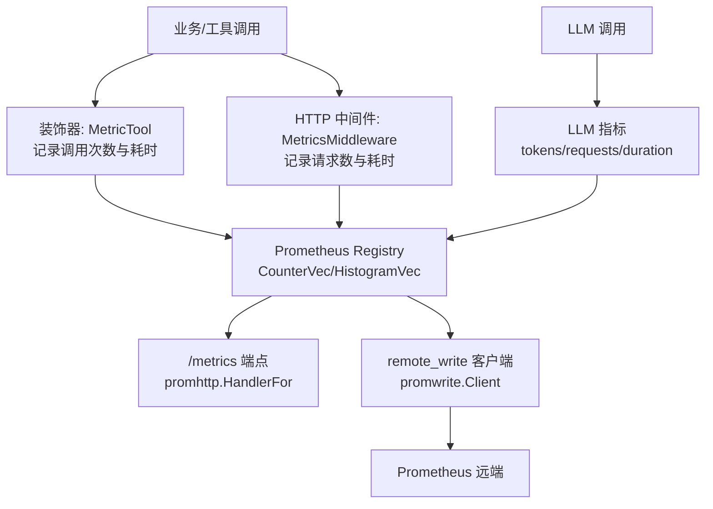
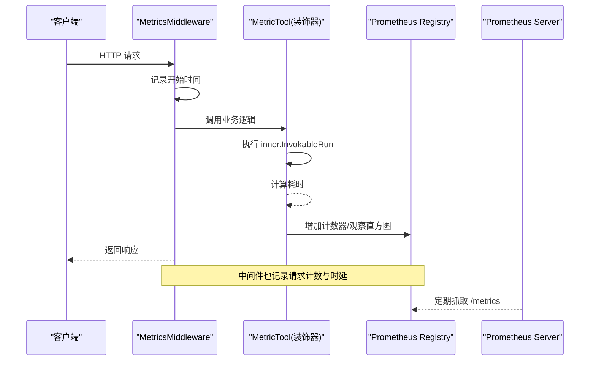
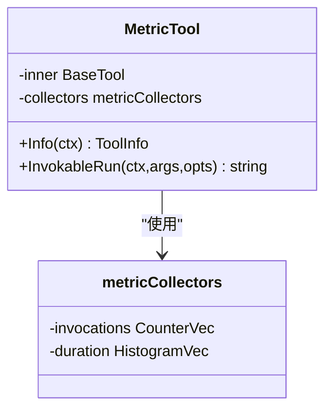
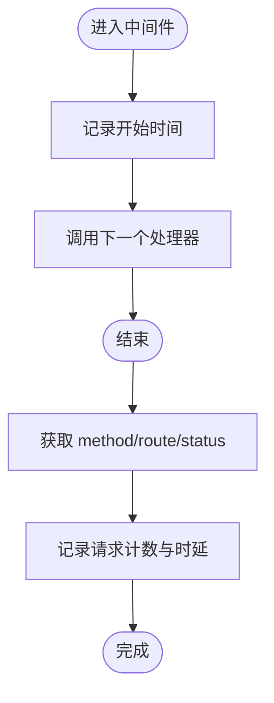
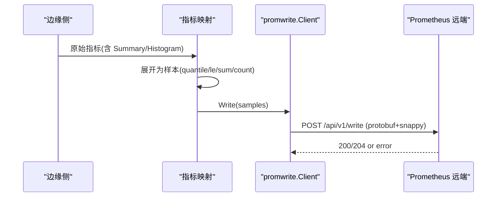
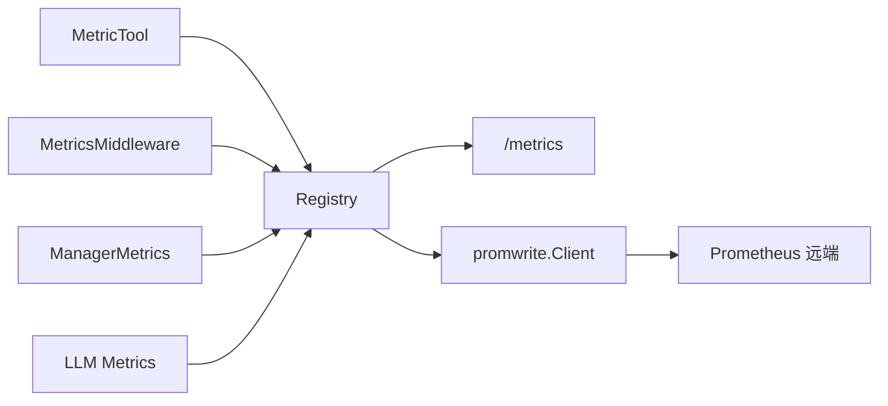

# 指标收集

<cite>
**本文引用的文件**
- [internal/pkg/prom/prom.go](file://internal/pkg/prom/prom.go)
- [internal/pkg/prom/manager_metrics.go](file://internal/pkg/prom/manager_metrics.go)
- [internal/manager/server/middleware/metrics.go](file://internal/manager/server/middleware/metrics.go)
- [internal/manager/biz/aiops/tools/decorators/metric.go](file://internal/manager/biz/aiops/tools/decorators/metric.go)
- [internal/manager/biz/aiops/graph/callbacks/metrics.go](file://internal/manager/biz/aiops/graph/callbacks/metrics.go)
- [internal/pkg/llm/metrics.go](file://internal/pkg/llm/metrics.go)
- [internal/pkg/promwrite/client.go](file://internal/pkg/promwrite/client.go)
- [internal/edgeagent/collector/mapper.go](file://internal/edgeagent/collector/mapper.go)
</cite>

## 目录
1. [简介](#简介)
2. [项目结构](#项目结构)
3. [核心组件](#核心组件)
4. [架构总览](#架构总览)
5. [详细组件分析](#详细组件分析)
6. [依赖关系分析](#依赖关系分析)
7. [性能考量](#性能考量)
8. [故障排查指南](#故障排查指南)
9. [结论](#结论)
10. [附录](#附录)

## 简介
本技术文档聚焦于本项目中的“指标收集装饰器”与 Prometheus 指标体系，系统性说明：
- 指标的定义与注册机制（计数器、直方图、摘要）
- 标签设计与维度选择原则（控制基数、避免高基数）
- 指标的导出与聚合方法（本地 /metrics 与 remote_write）
- 监控最佳实践与性能优化建议

本仓库在多处实现了统一的指标采集模式：通过装饰器或中间件对关键路径进行无侵入式观测，统一注册到进程级 Registry，并通过 HTTP /metrics 暴露或由 remote_write 上报。

## 项目结构
与指标收集相关的代码主要分布在以下位置：
- 进程级 Registry 与 /metrics 处理器：internal/pkg/prom
- 管理器自观测指标定义与注册：internal/pkg/prom/manager_metrics.go
- HTTP 中间件埋点：internal/manager/server/middleware/metrics.go
- AI 工具调用装饰器（计数器+直方图）：internal/manager/biz/aiops/tools/decorators/metric.go
- 图回调层指标（与装饰器共享 collector）：internal/manager/biz/aiops/graph/callbacks/metrics.go
- LLM 包指标（计数器+直方图）：internal/pkg/llm/metrics.go
- remote_write 客户端（上报样本）：internal/pkg/promwrite/client.go
- 边缘侧指标映射（摘要/直方图展开为样本）：internal/edgeagent/collector/mapper.go

图表来源
- [internal/pkg/prom/prom.go:16-29](file://internal/pkg/prom/prom.go#L16-L29)
- [internal/manager/server/middleware/metrics.go:18-34](file://internal/manager/server/middleware/metrics.go#L18-L34)
- [internal/manager/biz/aiops/tools/decorators/metric.go:79-122](file://internal/manager/biz/aiops/tools/decorators/metric.go#L79-L122)
- [internal/pkg/llm/metrics.go:20-68](file://internal/pkg/llm/metrics.go#L20-L68)
- [internal/pkg/promwrite/client.go:126-176](file://internal/pkg/promwrite/client.go#L126-L176)

章节来源
- [internal/pkg/prom/prom.go:1-29](file://internal/pkg/prom/prom.go#L1-L29)
- [internal/manager/server/middleware/metrics.go:1-35](file://internal/manager/server/middleware/metrics.go#L1-L35)

## 核心组件
- 进程级 Registry 与 /metrics 处理器
  - 创建包含 Go 运行时与进程采集器的独立 Registry，并提供 promhttp.Handler 暴露 /metrics。
- 管理器自观测指标
  - 集中注册 HTTP 请求计数与时延、数据库连接池、LLM 调用、告警评估等指标，提供便捷观察函数。
- HTTP 中间件
  - 基于 chi 路由模板统计请求量与耗时，未知路由归入 "unknown" 以控制基数。
- 工具调用装饰器
  - 对每个工具调用记录 ongrid_tool_invocations_total 与 ongrid_tool_duration_seconds。
- 图回调指标
  - 从图执行视角复用同一 collector，实现“双观测”但不重复注册。
- LLM 指标
  - 记录 tokens、请求次数、时延，严格限制标签维度。
- remote_write 客户端
  - 将样本编码为 protobuf + snappy 并 POST 至远端 Prometheus。
- 边缘侧指标映射
  - 将 Summary/Histogram 展开为可上报的样本（含分位、桶、sum/count）。

章节来源
- [internal/pkg/prom/prom.go:16-29](file://internal/pkg/prom/prom.go#L16-L29)
- [internal/pkg/prom/manager_metrics.go:155-317](file://internal/pkg/prom/manager_metrics.go#L155-L317)
- [internal/manager/server/middleware/metrics.go:18-34](file://internal/manager/server/middleware/metrics.go#L18-L34)
- [internal/manager/biz/aiops/tools/decorators/metric.go:79-122](file://internal/manager/biz/aiops/tools/decorators/metric.go#L79-L122)
- [internal/manager/biz/aiops/graph/callbacks/metrics.go:44-85](file://internal/manager/biz/aiops/graph/callbacks/metrics.go#L44-L85)
- [internal/pkg/llm/metrics.go:20-68](file://internal/pkg/llm/metrics.go#L20-L68)
- [internal/pkg/promwrite/client.go:126-176](file://internal/pkg/promwrite/client.go#L126-L176)
- [internal/edgeagent/collector/mapper.go:98-133](file://internal/edgeagent/collector/mapper.go#L98-L133)

## 架构总览
指标收集采用“装饰器/中间件 + 统一 Registry + 多出口”的架构：
- 入口埋点：HTTP 中间件、工具装饰器、LLM 调用等
- 指标注册：各模块按约定注册 CounterVec/HistogramVec/GaugeVec
- 数据出口：
  - 本地 /metrics 拉取（Prometheus scrape）
  - 远端 remote_write 推送（适用于边缘或特定场景）

图表来源
- [internal/manager/server/middleware/metrics.go:18-34](file://internal/manager/server/middleware/metrics.go#L18-L34)
- [internal/manager/biz/aiops/tools/decorators/metric.go:79-122](file://internal/manager/biz/aiops/tools/decorators/metric.go#L79-L122)
- [internal/pkg/prom/prom.go:26-29](file://internal/pkg/prom/prom.go#L26-L29)

## 详细组件分析

### 装饰器：MetricTool（工具调用指标）
- 功能：在每个工具调用前后记录调用次数与耗时，结果分为 success/error。
- 指标：
  - ongrid_tool_invocations_total{name, result}
  - ongrid_tool_duration_seconds{name}
- 设计要点：
  - 使用 CounterVec 与 HistogramVec
  - 标签仅 name/result，避免用户/租户/设备等高基数标签
  - 通过 per Registerer 缓存 collectors，避免重复注册导致 panic
  - 支持 nil registerer 回退到默认注册器

图表来源
- [internal/manager/biz/aiops/tools/decorators/metric.go:14-27](file://internal/manager/biz/aiops/tools/decorators/metric.go#L14-L27)
- [internal/manager/biz/aiops/tools/decorators/metric.go:79-122](file://internal/manager/biz/aiops/tools/decorators/metric.go#L79-L122)

章节来源
- [internal/manager/biz/aiops/tools/decorators/metric.go:79-122](file://internal/manager/biz/aiops/tools/decorators/metric.go#L79-L122)

### HTTP 中间件：MetricsMiddleware（API 请求指标）
- 功能：记录每个 API 请求的方法、路由模板、状态码类别与时延。
- 指标：
  - ongrid_http_requests_total{method, route, status}
  - ongrid_http_request_duration_seconds{method, route}
- 设计要点：
  - 使用 chi.RoutePattern 作为 route 标签，保证有限基数
  - 未知路由归入 "unknown"，防止扫描器产生无限系列
  - 状态码归类为 2xx/3xx/4xx/5xx，降低 cardinality

图表来源
- [internal/manager/server/middleware/metrics.go:18-34](file://internal/manager/server/middleware/metrics.go#L18-L34)
- [internal/pkg/prom/manager_metrics.go:355-363](file://internal/pkg/prom/manager_metrics.go#L355-L363)

章节来源
- [internal/manager/server/middleware/metrics.go:18-34](file://internal/manager/server/middleware/metrics.go#L18-L34)
- [internal/pkg/prom/manager_metrics.go:355-377](file://internal/pkg/prom/manager_metrics.go#L355-L377)

### 管理器自观测指标（Manager Metrics）
- 覆盖范围：HTTP 请求、数据库连接池、LLM 调用、告警评估、边设备连接等
- 指标示例：
  - alert_evaluator_latency_seconds{kind,result}
  - prom_write_total{result}
  - device_last_seen_seconds_ago{device_id,device_name}
  - ongrid_http_requests_total{method,routing,status}
  - ongrid_llm_calls_total{provider,model,status}
  - ongrid_llm_call_duration_seconds{provider,model}
  - ongrid_llm_router_tokens_total{provider,model,kind}
  - ongrid_chatruntime_worker_sessions{status}
  - ongrid_alert_eval_ticks_total{rule_kind,status}
  - ongrid_edge_connections{status}
  - ongrid_investigator_inflight
- 设计要点：
  - 所有指标均通过 registerOrExisting* 包装，AlreadyRegisteredError 降级为复用已有 collector
  - 提供便捷观察函数（如 ObserveHTTP、ObserveLLMCall、IncAlertEvalTick 等）
  - 明确标注标签集合与基数约束

章节来源
- [internal/pkg/prom/manager_metrics.go:155-317](file://internal/pkg/prom/manager_metrics.go#L155-L317)
- [internal/pkg/prom/manager_metrics.go:319-532](file://internal/pkg/prom/manager_metrics.go#L319-L532)

### LLM 指标（内部包）
- 指标：
  - ongrid_llm_tokens_total{model,kind}
  - ongrid_llm_requests_total{model,result}
  - ongrid_llm_request_duration_seconds{model}
- 设计要点：
  - 限制标签为 model/kind/result，禁止用户/会话等高基数标签
  - 使用 exponential buckets 适配长尾延迟

章节来源
- [internal/pkg/llm/metrics.go:20-68](file://internal/pkg/llm/metrics.go#L20-L68)

### 图回调指标（与装饰器共享 collector）
- 目标：从图执行视角观测工具调用与聊天轮次，复用同一 collector 避免重复注册
- 指标：
  - ongrid_tool_invocations_total{name,result}
  - ongrid_tool_duration_seconds{name}
  - ongrid_graph_iterations_total{result}
  - ongrid_graph_chat_turns_total{result}
- 设计要点：
  - 通过 getMetricsCollectors 按 Registerer 缓存 collectors
  - regOrExist 处理 AlreadyRegisteredError，确保幂等注册

章节来源
- [internal/manager/biz/aiops/graph/callbacks/metrics.go:44-85](file://internal/manager/biz/aiops/graph/callbacks/metrics.go#L44-L85)
- [internal/manager/biz/aiops/graph/callbacks/metrics.go:96-140](file://internal/manager/biz/aiops/graph/callbacks/metrics.go#L96-L140)

### 指标导出与聚合
- 本地导出：通过 promhttp.HandlerFor 暴露 /metrics，供 Prometheus 抓取
- 远端写入：promwrite.Client 将样本编码为 protobuf + snappy，POST 到远端 Prometheus
- 边缘侧映射：将 Summary/Histogram 展开为可上报样本（quantile/le/bucket/sum/count）

图表来源
- [internal/edgeagent/collector/mapper.go:98-133](file://internal/edgeagent/collector/mapper.go#L98-L133)
- [internal/pkg/promwrite/client.go:126-176](file://internal/pkg/promwrite/client.go#L126-L176)

章节来源
- [internal/pkg/prom/prom.go:26-29](file://internal/pkg/prom/prom.go#L26-L29)
- [internal/pkg/promwrite/client.go:126-176](file://internal/pkg/promwrite/client.go#L126-L176)
- [internal/edgeagent/collector/mapper.go:98-133](file://internal/edgeagent/collector/mapper.go#L98-L133)

## 依赖关系分析
- 装饰器依赖 basetool.BaseTool 接口，注入 metricsCollectors
- 中间件依赖 chi 路由上下文与 prom.ObserveHTTP
- 管理器指标集中注册，被多个子系统复用
- LLM 指标与装饰器指标相互独立但遵循相同标签约束
- remote_write 客户端依赖 EndpointResolver 动态解析写端点

图表来源
- [internal/manager/biz/aiops/tools/decorators/metric.go:79-122](file://internal/manager/biz/aiops/tools/decorators/metric.go#L79-L122)
- [internal/manager/server/middleware/metrics.go:18-34](file://internal/manager/server/middleware/metrics.go#L18-L34)
- [internal/pkg/prom/manager_metrics.go:155-317](file://internal/pkg/prom/manager_metrics.go#L155-L317)
- [internal/pkg/llm/metrics.go:20-68](file://internal/pkg/llm/metrics.go#L20-L68)
- [internal/pkg/prom/prom.go:26-29](file://internal/pkg/prom/prom.go#L26-L29)
- [internal/pkg/promwrite/client.go:126-176](file://internal/pkg/promwrite/client.go#L126-L176)

章节来源
- [internal/manager/biz/aiops/tools/decorators/metric.go:79-122](file://internal/manager/biz/aiops/tools/decorators/metric.go#L79-L122)
- [internal/manager/server/middleware/metrics.go:18-34](file://internal/manager/server/middleware/metrics.go#L18-L34)
- [internal/pkg/prom/manager_metrics.go:155-317](file://internal/pkg/prom/manager_metrics.go#L155-L317)
- [internal/pkg/llm/metrics.go:20-68](file://internal/pkg/llm/metrics.go#L20-L68)
- [internal/pkg/prom/prom.go:26-29](file://internal/pkg/prom/prom.go#L26-L29)
- [internal/pkg/promwrite/client.go:126-176](file://internal/pkg/promwrite/client.go#L126-L176)

## 性能考量
- 标签基数控制
  - 禁止使用 org_id/user_id/edge_id/完整 URL 路径等高基数标签
  - 允许标签：method、code、status、model、direction、result、plan_bucket 等
- 直方图桶配置
  - 工具耗时：指数桶 0.05..~25s
  - HTTP 请求：细粒度到粗粒度的多档桶
  - LLM 调用：侧重秒级长尾
- 观察者频率
  - 每调用一次记录一次；对于高频路径建议使用批量或采样策略
- 注册幂等
  - 通过 registerOrExisting 系列函数避免重复注册导致的 panic
- 远端写入
  - 单样本单 series，减少服务端聚合压力
  - 使用 snappy 压缩与固定超时，提升吞吐与稳定性

[本节为通用指导，不直接分析具体文件]

## 故障排查指南
- 重复注册错误
  - 现象：AlreadyRegisteredError
  - 处理：使用 registerOrExisting 系列函数，自动复用已有 collector
- 高基数标签导致内存增长
  - 现象：Series 数量激增、查询变慢
  - 处理：检查标签是否包含用户/租户/设备/URL 等，改为分类或丢弃
- remote_write 失败
  - 现象：非 2xx 响应
  - 处理：查看日志中 status/samples/body 片段，确认端点与认证
- 未知路由导致额外系列
  - 现象：route="unknown" 增多
  - 处理：检查是否有未注册路由或扫描器访问

章节来源
- [internal/pkg/prom/manager_metrics.go:319-353](file://internal/pkg/prom/manager_metrics.go#L319-L353)
- [internal/pkg/promwrite/client.go:164-176](file://internal/pkg/promwrite/client.go#L164-L176)
- [internal/manager/server/middleware/metrics.go:22-33](file://internal/manager/server/middleware/metrics.go#L22-L33)

## 结论
本项目通过装饰器与中间件实现了统一、低侵入的指标收集，结合严格的标签基数控制与幂等注册机制，确保了可扩展性与稳定性。指标既可通过 /metrics 本地抓取，也可通过 remote_write 上报远端。建议在新增指标时遵循现有命名与标签规范，优先使用 CounterVec/HistogramVec，谨慎引入新标签，并结合业务场景选择合适的桶与采样策略。

[本节为总结性内容，不直接分析具体文件]

## 附录

### 指标类型与使用场景
- 计数器（Counter）
  - 适用：累计事件计数（如工具调用次数、HTTP 请求数、LLM 调用次数）
  - 示例：ongrid_tool_invocations_total、ongrid_http_requests_total、ongrid_llm_calls_total
- 直方图（Histogram）
  - 适用：时延分布观测（如工具耗时、HTTP 请求时延、LLM 调用时延）
  - 示例：ongrid_tool_duration_seconds、ongrid_http_request_duration_seconds、ongrid_llm_call_duration_seconds
- 摘要（Summary）
  - 适用：需要服务端计算分位数（如 P95/P99）的场景
  - 在本项目中，边缘侧会将 Summary 展开为 quantile/sum/count 样本以便上报

章节来源
- [internal/manager/biz/aiops/tools/decorators/metric.go:43-59](file://internal/manager/biz/aiops/tools/decorators/metric.go#L43-L59)
- [internal/pkg/prom/manager_metrics.go:203-248](file://internal/pkg/prom/manager_metrics.go#L203-L248)
- [internal/pkg/llm/metrics.go:35-66](file://internal/pkg/llm/metrics.go#L35-L66)
- [internal/edgeagent/collector/mapper.go:106-133](file://internal/edgeagent/collector/mapper.go#L106-L133)

### 标签设计与维度选择原则
- 红线标签：禁止使用 org_id/user_id/edge_id/完整 URL 路径
- 推荐标签：method、code、status、model、direction、result、plan_bucket
- 路由标签：使用 chi 编译后的 RoutePattern，未知路由归入 "unknown"
- 结果标签：success/error/ok/fail 等有限集合

章节来源
- [internal/pkg/prom/prom.go:1-7](file://internal/pkg/prom/prom.go#L1-L7)
- [internal/manager/server/middleware/metrics.go:18-33](file://internal/manager/server/middleware/metrics.go#L18-L33)
- [internal/pkg/llm/metrics.go:10-18](file://internal/pkg/llm/metrics.go#L10-L18)

### 最佳实践与性能优化建议
- 使用装饰器/中间件统一埋点，避免散乱的业务内嵌代码
- 严格控制标签基数，避免高基数标签导致内存与查询压力
- 合理设置直方图桶，兼顾精度与存储成本
- 使用幂等注册机制，确保测试与多实例部署安全
- 对高频路径考虑采样或批量化上报
- 远端写入时注意超时与重试策略，避免雪崩

[本节为通用指导，不直接分析具体文件]