# 装饰器模式实现

<cite>
**本文引用的文件**
- [chain.go](file://internal/manager/biz/aiops/tools/decorators/chain.go)
- [timeout.go](file://internal/manager/biz/aiops/tools/decorators/timeout.go)
- [audit.go](file://internal/manager/biz/aiops/tools/decorators/audit.go)
- [ratelimit.go](file://internal/manager/biz/aiops/tools/decorators/ratelimit.go)
- [metric.go](file://internal/manager/biz/aiops/tools/decorators/metric.go)
- [tenant_bind.go](file://internal/manager/biz/aiops/tools/decorators/tenant_bind.go)
- [review_gate.go](file://internal/manager/biz/aiops/tools/decorators/review_gate.go)
- [human_approval_gate.go](file://internal/manager/biz/aiops/tools/decorators/human_approval_gate.go)
- [decorators_test.go](file://internal/manager/biz/aiops/tools/decorators/decorators_test.go)
- [basetool_decorated_test.go](file://internal/manager/biz/aiops/tools/basetool_decorated_test.go)
</cite>

## 目录
1. [简介](#简介)
2. [项目结构](#项目结构)
3. [核心组件](#核心组件)
4. [架构总览](#架构总览)
5. [详细组件分析](#详细组件分析)
6. [依赖关系分析](#依赖关系分析)
7. [性能考量](#性能考量)
8. [故障排查指南](#故障排查指南)
9. [结论](#结论)
10. [附录](#附录)

## 简介
本技术文档围绕装饰器模式在工具调用链中的落地实现，系统性阐述以下要点：
- 装饰器链的设计原理与执行顺序
- 依赖注入机制（Deps）与各横切关注点的集成方式
- 超时控制、审计、限流、审查、人类审批、指标采集等横切能力的组合策略
- 调用栈管理与上下文传递（租户绑定、用户ID、会话ID）
- 自定义装饰器的开发指南与最佳实践

该实现以统一的接口抽象为基础，通过可插拔的装饰器将横切关注点与具体业务工具解耦，保证可测试性、可观测性与安全性。

## 项目结构
装饰器相关代码集中在 decorators 包中，围绕 basetool.BaseTool 接口进行包装，形成标准调用链。关键文件职责如下：
- chain.go：定义 Deps 配置与 Wrap 组装顺序，是装饰器链的“装配中心”
- timeout.go：为每次调用提供超时边界
- audit.go：记录工具调用的开始与结束事件
- ratelimit.go：基于令牌桶的按（工具名, 用户ID）限流
- metric.go：暴露 Prometheus 计数器与时序直方图
- tenant_bind.go：从上下文解析租户并注入参数与选项
- review_gate.go：对写/破坏类工具实施策略审批或人工审核门控
- human_approval_gate.go：对需要确认的工具接入持久化的人类审批流程

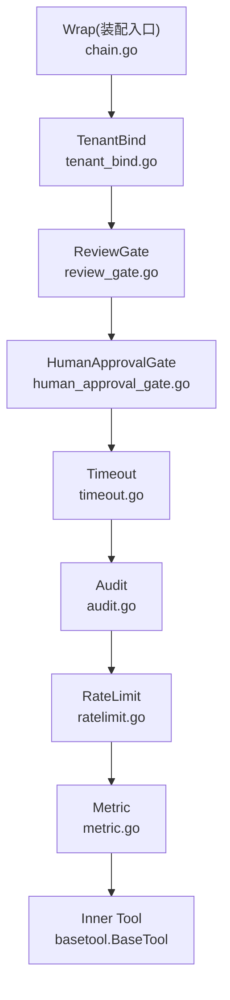

**图表来源**
- [chain.go:56-131](file://internal/manager/biz/aiops/tools/decorators/chain.go#L56-L131)
- [tenant_bind.go:41-85](file://internal/manager/biz/aiops/tools/decorators/tenant_bind.go#L41-L85)
- [review_gate.go:235-350](file://internal/manager/biz/aiops/tools/decorators/review_gate.go#L235-L350)
- [human_approval_gate.go:45-83](file://internal/manager/biz/aiops/tools/decorators/human_approval_gate.go#L45-L83)
- [timeout.go:42-78](file://internal/manager/biz/aiops/tools/decorators/timeout.go#L42-L78)
- [audit.go:71-121](file://internal/manager/biz/aiops/tools/decorators/audit.go#L71-L121)
- [ratelimit.go:109-135](file://internal/manager/biz/aiops/tools/decorators/ratelimit.go#L109-L135)
- [metric.go:91-122](file://internal/manager/biz/aiops/tools/decorators/metric.go#L91-L122)

**章节来源**
- [chain.go:11-54](file://internal/manager/biz/aiops/tools/decorators/chain.go#L11-L54)
- [chain.go:56-131](file://internal/manager/biz/aiops/tools/decorators/chain.go#L56-L131)

## 核心组件
- Deps 配置对象：集中注入超时、审计、限流、指标注册器、审查门控、人类审批等横切能力
- 标准装饰器链：由 Wrap 统一组装，确保一致的调用顺序与行为
- 各装饰器：各自封装单一横切关注点，保持无状态与线程安全

**章节来源**
- [chain.go:11-54](file://internal/manager/biz/aiops/tools/decorators/chain.go#L11-L54)

## 架构总览
装饰器链的执行顺序遵循“外层先入后出”的原则，确保横切逻辑正确覆盖业务调用。标准顺序为：
tenant_bind → review_gate → human_approval_gate → timeout → audit → ratelimit → metric → inner tool

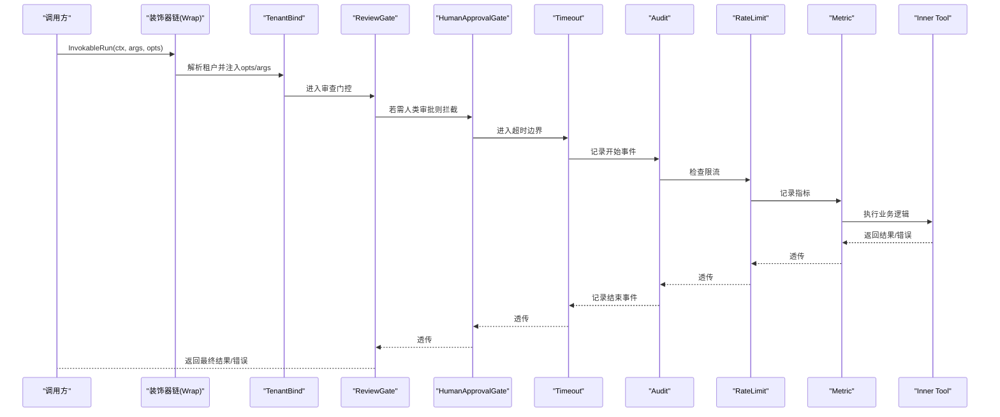

**图表来源**
- [chain.go:56-131](file://internal/manager/biz/aiops/tools/decorators/chain.go#L56-L131)
- [tenant_bind.go:50-85](file://internal/manager/biz/aiops/tools/decorators/tenant_bind.go#L50-L85)
- [review_gate.go:263-350](file://internal/manager/biz/aiops/tools/decorators/review_gate.go#L263-L350)
- [human_approval_gate.go:56-83](file://internal/manager/biz/aiops/tools/decorators/human_approval_gate.go#L56-L83)
- [timeout.go:55-78](file://internal/manager/biz/aiops/tools/decorators/timeout.go#L55-L78)
- [audit.go:84-121](file://internal/manager/biz/aiops/tools/decorators/audit.go#L84-L121)
- [ratelimit.go:121-135](file://internal/manager/biz/aiops/tools/decorators/ratelimit.go#L121-L135)
- [metric.go:103-122](file://internal/manager/biz/aiops/tools/decorators/metric.go#L103-L122)

## 详细组件分析

### 依赖注入与装配（Deps 与 Wrap）
- Deps 聚合了所有横切依赖，零值具备安全默认行为（如默认超时、空审计、空限流、默认注册器等），使最小化装配也能产生健壮的工具包装
- Wrap 负责按固定顺序组装装饰器，确保：
  - tenant_bind 在最外层，保证后续层能读取到租户与用户信息
  - review_gate 在 timeout 与 audit 之外，避免拒绝决策污染执行审计
  - timeout 在 audit 之外，确保即使超时也能写入审计开始行
  - audit 在 ratelimit 之外，确保被限流的拒绝也被审计
  - ratelimit 在 metric 之外，避免拒绝开销污染耗时直方图
  - metric 最内层，仅统计真实工具调用耗时

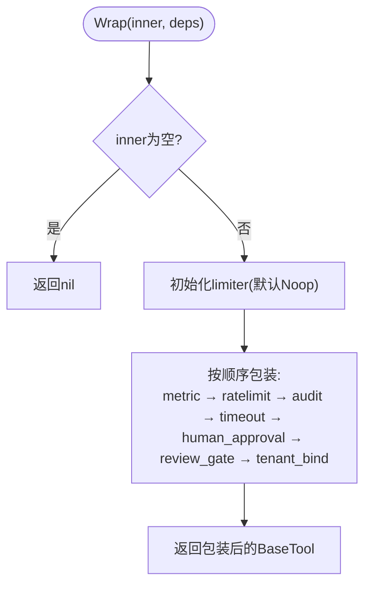

**图表来源**
- [chain.go:106-131](file://internal/manager/biz/aiops/tools/decorators/chain.go#L106-L131)

**章节来源**
- [chain.go:11-54](file://internal/manager/biz/aiops/tools/decorators/chain.go#L11-L54)
- [chain.go:56-131](file://internal/manager/biz/aiops/tools/decorators/chain.go#L56-L131)

### 超时控制（Timeout）
- 为每次调用设置 context.WithTimeout，并在超时时返回明确的错误类型以便上层分类
- 即使内部工具忽略上下文，也会在返回前再次检查截止时间，防止逃逸

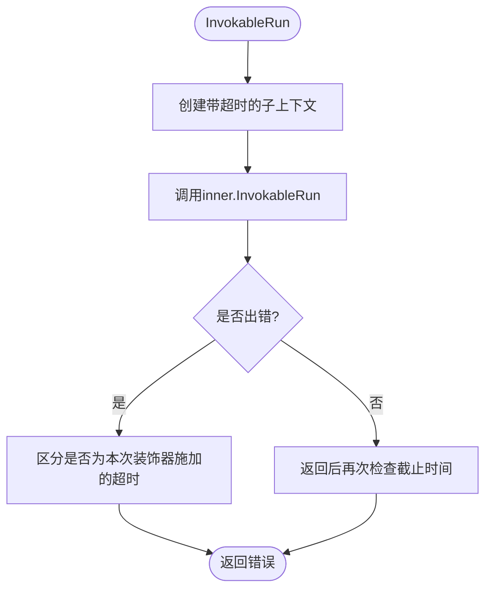

**图表来源**
- [timeout.go:42-78](file://internal/manager/biz/aiops/tools/decorators/timeout.go#L42-L78)

**章节来源**
- [timeout.go:22-78](file://internal/manager/biz/aiops/tools/decorators/timeout.go#L22-L78)

### 审计（Audit）
- 在调用开始前记录开始事件，包含工具名、参数、租户、用户、设备等上下文
- 在调用结束后记录结束事件，包含结果、错误、耗时；审计失败不反作用于工具结果
- OnToolStart 允许短路（例如配额不足），直接返回错误而不执行工具

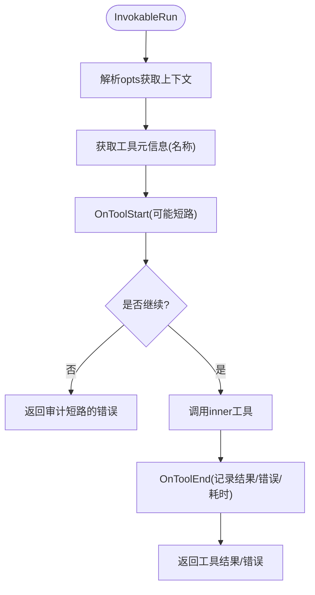

**图表来源**
- [audit.go:71-121](file://internal/manager/biz/aiops/tools/decorators/audit.go#L71-L121)

**章节来源**
- [audit.go:10-121](file://internal/manager/biz/aiops/tools/decorators/audit.go#L10-L121)

### 限流（RateLimit）
- 基于令牌桶实现 per-(tool, user) 的每分钟调用预算
- 非阻塞拒绝，返回明确错误类型便于上层分类
- 支持 NoopLimiter 用于测试或禁用场景

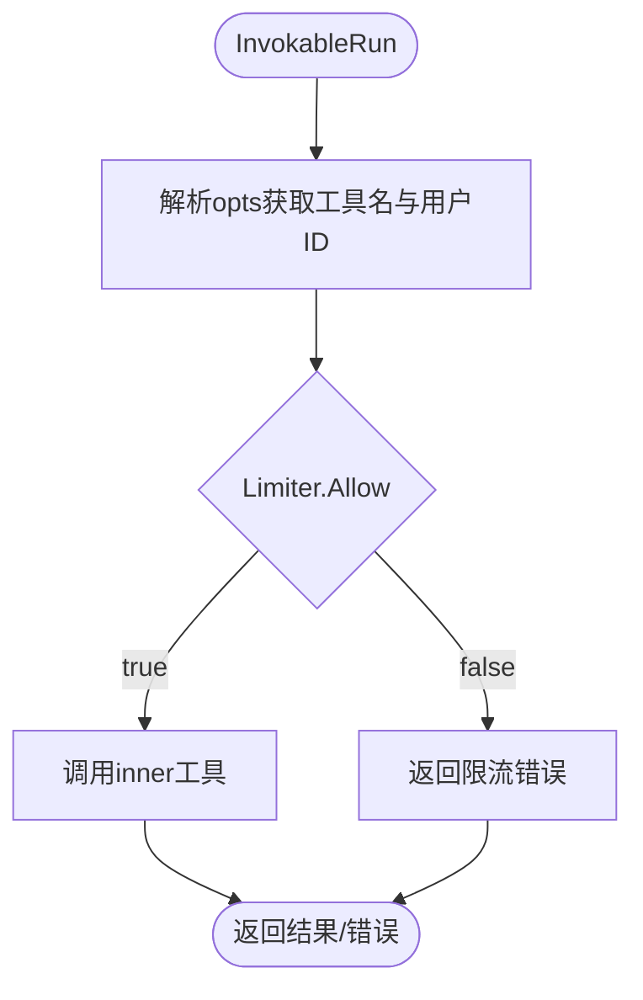

**图表来源**
- [ratelimit.go:109-135](file://internal/manager/biz/aiops/tools/decorators/ratelimit.go#L109-L135)

**章节来源**
- [ratelimit.go:14-135](file://internal/manager/biz/aiops/tools/decorators/ratelimit.go#L14-L135)

### 指标（Metric）
- 使用 Prometheus 计数器与时序直方图记录工具调用次数与耗时
- 标签仅包含 name/result，避免高基数问题
- 同一 Registerer 下的收集器复用，避免重复注册

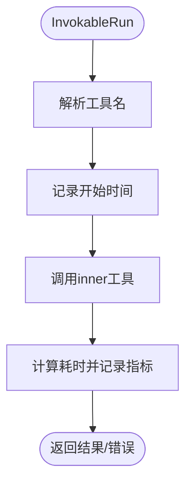

**图表来源**
- [metric.go:91-122](file://internal/manager/biz/aiops/tools/decorators/metric.go#L91-L122)

**章节来源**
- [metric.go:14-122](file://internal/manager/biz/aiops/tools/decorators/metric.go#L14-L122)

### 租户绑定（TenantBind）
- 从上下文解析租户，并将用户ID与租户ID注入到 InvokeOption
- 若工具声明了 tenant_id 参数且未显式传入，则自动注入
- 无租户时透明透传，兼容公共端点与测试

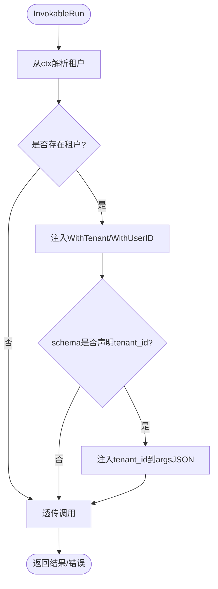

**图表来源**
- [tenant_bind.go:50-85](file://internal/manager/biz/aiops/tools/decorators/tenant_bind.go#L50-L85)

**章节来源**
- [tenant_bind.go:13-129](file://internal/manager/biz/aiops/tools/decorators/tenant_bind.go#L13-L129)

### 审查门控（ReviewGate）
- 对写/破坏类工具进行策略审批或人工审核
- 支持确定性策略快速放行（如特定配置的创建操作）
- 审核失败或无法解析决定时，默认拒绝以保证安全
- 独立于工具超时的审核超时，避免限制审核工作负载

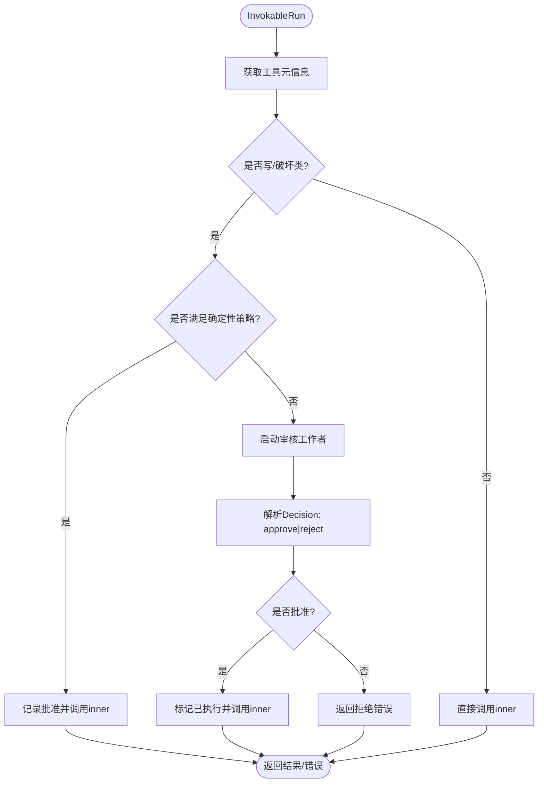

**图表来源**
- [review_gate.go:235-350](file://internal/manager/biz/aiops/tools/decorators/review_gate.go#L235-L350)

**章节来源**
- [review_gate.go:15-612](file://internal/manager/biz/aiops/tools/decorators/review_gate.go#L15-L612)

### 人类审批（HumanApprovalGate）
- 对需要确认的工具发起持久化的人类审批流程
- 审批通过后，携带 WithHumanApproval(true) 重新执行工具
- 未配置审批通道时失败关闭，避免静默放行

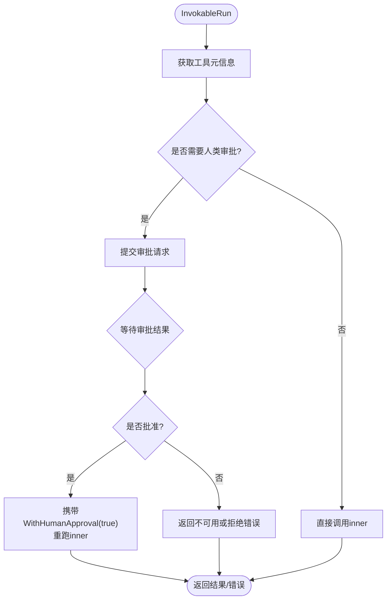

**图表来源**
- [human_approval_gate.go:45-83](file://internal/manager/biz/aiops/tools/decorators/human_approval_gate.go#L45-L83)

**章节来源**
- [human_approval_gate.go:13-107](file://internal/manager/biz/aiops/tools/decorators/human_approval_gate.go#L13-L107)

## 依赖关系分析
装饰器之间通过 basetool.BaseTool 接口松耦合，依赖通过 Deps 注入，降低模块间耦合度。关键依赖关系如下：
- Timeout 依赖 context 与 basetool
- Audit 依赖 AuditSink 接口
- RateLimit 依赖 Limiter 接口与 basetool
- Metric 依赖 prometheus.Registerer
- TenantBind 依赖 tenantctx 与 basetool
- ReviewGate 依赖 ReviewSpawner 与 MutatingProposalSink
- HumanApprovalGate 依赖 HumanApprovalProposer

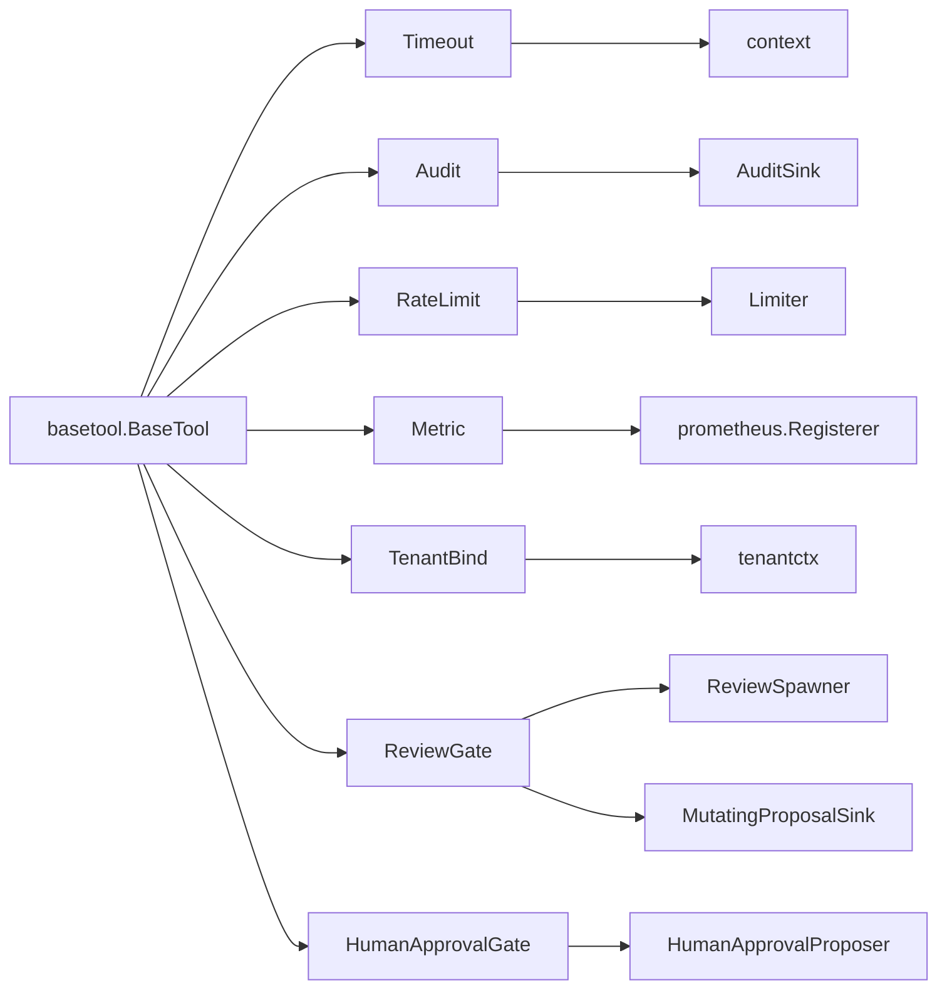

**图表来源**
- [timeout.go:13-20](file://internal/manager/biz/aiops/tools/decorators/timeout.go#L13-L20)
- [audit.go:3-8](file://internal/manager/biz/aiops/tools/decorators/audit.go#L3-L8)
- [ratelimit.go:3-12](file://internal/manager/biz/aiops/tools/decorators/ratelimit.go#L3-L12)
- [metric.go:3-12](file://internal/manager/biz/aiops/tools/decorators/metric.go#L3-L12)
- [tenant_bind.go:3-11](file://internal/manager/biz/aiops/tools/decorators/tenant_bind.go#L3-L11)
- [review_gate.go:3-13](file://internal/manager/biz/aiops/tools/decorators/review_gate.go#L3-L13)
- [human_approval_gate.go:3-11](file://internal/manager/biz/aiops/tools/decorators/human_approval_gate.go#L3-L11)

**章节来源**
- [chain.go:106-131](file://internal/manager/biz/aiops/tools/decorators/chain.go#L106-L131)

## 性能考量
- 指标标签维度严格控制为 {name, result}，避免高基数导致的内存与查询压力
- 限流采用非阻塞判断，快速失败减少无效调用
- 审计结束事件错误被吞掉，避免影响主路径性能与正确性
- 指标收集器按 Registerer 复用，避免重复注册带来的开销
- 审查门控拥有独立超时，避免审核工作负载受工具超时约束

[本节为通用指导，无需引用具体文件]

## 故障排查指南
- 超时错误：可通过错误类型识别是否为装饰器施加的超时，定位上游是否设置了过短的超时
- 限流错误：检查 per-(tool, user) 的令牌桶配置与调用频率，必要时调整速率或合并调用
- 审计缺失：确认 AuditSink 已正确注入；注意 OnToolStart 短路会阻止工具执行
- 指标异常：检查 Registerer 是否正确注入；确认标签维度未引入高基数字段
- 审查拒绝：查看审核输出是否包含明确的 Decision 行；确认 spawner 与 sink 已正确接线
- 人类审批不可用：确认 HumanApprovalProposer 已注入；否则将失败关闭

**章节来源**
- [timeout.go:28-31](file://internal/manager/biz/aiops/tools/decorators/timeout.go#L28-L31)
- [ratelimit.go:24-27](file://internal/manager/biz/aiops/tools/decorators/ratelimit.go#L24-L27)
- [audit.go:30-34](file://internal/manager/biz/aiops/tools/decorators/audit.go#L30-L34)
- [review_gate.go:96-113](file://internal/manager/biz/aiops/tools/decorators/review_gate.go#L96-L113)
- [human_approval_gate.go:13-15](file://internal/manager/biz/aiops/tools/decorators/human_approval_gate.go#L13-L15)

## 结论
通过统一的装饰器链与 Deps 注入机制，系统实现了高度可组合、可观测、安全的工具调用模型。标准顺序确保了横切关注点的一致性与正确性，同时为扩展提供了清晰的边界与契约。生产环境可按需启用或替换各装饰器，以满足不同的 SLO 与安全要求。

[本节为总结性内容，无需引用具体文件]

## 附录

### 装饰器组合与执行顺序设计原则
- 外层优先：tenant_bind 最先解析身份，确保下游可见
- 安全优先：review_gate 在 timeout 与 audit 之前，避免拒绝污染执行审计
- 可观测优先：audit 在 ratelimit 之前，确保拒绝也被审计
- 度量准确：metric 最内层，仅统计真实工具耗时
- 可配置优先：Deps 零值安全默认，便于最小化装配与测试

**章节来源**
- [chain.go:56-105](file://internal/manager/biz/aiops/tools/decorators/chain.go#L56-L105)

### 自定义装饰器开发指南与最佳实践
- 实现基线：实现 basetool.BaseTool 的 Info 与 InvokableRun，保持无状态与线程安全
- 依赖注入：通过构造函数或外部装配注入依赖（如审计、限流、注册器）
- 错误处理：装饰器错误应明确语义，避免掩盖底层错误；审计失败不应反作用主路径
- 上下文传递：尊重 ctx 的取消与超时，必要时注入必要上下文（如租户、用户）
- 指标与审计：仅在必要时增加标签维度；审计事件应包含足够上下文但避免敏感信息
- 测试建议：使用 NoopLimiter、Fake AuditSink、Mock Spawner 等简化测试环境

**章节来源**
- [timeout.go:42-78](file://internal/manager/biz/aiops/tools/decorators/timeout.go#L42-L78)
- [audit.go:71-121](file://internal/manager/biz/aiops/tools/decorators/audit.go#L71-L121)
- [ratelimit.go:109-135](file://internal/manager/biz/aiops/tools/decorators/ratelimit.go#L109-L135)
- [metric.go:91-122](file://internal/manager/biz/aiops/tools/decorators/metric.go#L91-L122)
- [tenant_bind.go:41-85](file://internal/manager/biz/aiops/tools/decorators/tenant_bind.go#L41-L85)
- [review_gate.go:235-350](file://internal/manager/biz/aiops/tools/decorators/review_gate.go#L235-L350)
- [human_approval_gate.go:45-83](file://internal/manager/biz/aiops/tools/decorators/human_approval_gate.go#L45-L83)

### 验证与回归测试参考
- 装饰器链顺序验证：通过审计与指标断言确认执行顺序
- 超时与限流行为：验证超时错误类型与限流拒绝行为
- 租户绑定：验证 schema 驱动的参数注入与 opts 注入

**章节来源**
- [decorators_test.go:413-441](file://internal/manager/biz/aiops/tools/decorators/decorators_test.go#L413-L441)
- [basetool_decorated_test.go:131-173](file://internal/manager/biz/aiops/tools/basetool_decorated_test.go#L131-L173)
- [basetool_decorated_test.go:39-88](file://internal/manager/biz/aiops/tools/basetool_decorated_test.go#L39-L88)