# 装饰器链

<cite>
**本文引用的文件**
- [chain.go](file://internal/manager/biz/aiops/tools/decorators/chain.go)
- [timeout.go](file://internal/manager/biz/aiops/tools/decorators/timeout.go)
- [audit.go](file://internal/manager/biz/aiops/tools/decorators/audit.go)
- [ratelimit.go](file://internal/manager/biz/aiops/tools/decorators/ratelimit.go)
- [metric.go](file://internal/manager/biz/aiops/tools/decorators/metric.go)
- [human_approval_gate.go](file://internal/manager/biz/aiops/tools/decorators/human_approval_gate.go)
- [review_gate.go](file://internal/manager/biz/aiops/tools/decorators/review_gate.go)
- [tenant_bind.go](file://internal/manager/biz/aiops/tools/decorators/tenant_bind.go)
- [basetool.go](file://internal/manager/biz/aiops/tools/basetool/basetool.go)
- [decorators_test.go](file://internal/manager/biz/aiops/tools/decorators/decorators_test.go)
- [basetool_decorated_test.go](file://internal/manager/biz/aiops/tools/basetool/basetool_decorated_test.go)
</cite>

## 目录
1. [简介](#简介)
2. [项目结构](#项目结构)
3. [核心组件](#核心组件)
4. [架构总览](#架构总览)
5. [详细组件分析](#详细组件分析)
6. [依赖关系分析](#依赖关系分析)
7. [性能考量](#性能考量)
8. [故障排除指南](#故障排除指南)
9. [结论](#结论)
10. [附录](#附录)

## 简介
本文件系统性阐述 ongrid 的“装饰器链”设计与实现，聚焦以下目标：
- 解释装饰器模式在工具调用路径中的落地方式与执行顺序。
- 说明链式调用的执行流程、错误传播机制与可观测性保障。
- 详解内置装饰器的职责：人类审批门控、限流控制、审计日志、超时处理、指标统计、租户绑定等。
- 提供自定义装饰器的开发指南（接口契约、组合模式）。
- 给出组合策略、执行顺序原则、性能优化与故障排查的最佳实践。

## 项目结构
装饰器链位于 AIOPS 工具的横切关注点层，围绕统一的 BaseTool 接口进行包装，形成标准链：
- 入口组装：通过统一 Wrap 函数将多个装饰器按固定顺序组合。
- 横切能力：超时、审计、限流、指标、租户绑定、人类审批、审查门控等。
- 基础契约：BaseTool 定义 Info 与 InvokableRun 两个方法，所有装饰器均实现该接口以透明组合。

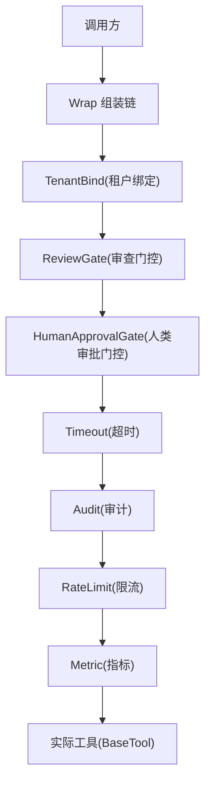

图表来源
- [chain.go:56-131](file://internal/manager/biz/aiops/tools/decorators/chain.go#L56-L131)

章节来源
- [chain.go:11-131](file://internal/manager/biz/aiops/tools/decorators/chain.go#L11-L131)
- [basetool.go:30-56](file://internal/manager/biz/aiops/tools/basetool/basetool.go#L30-L56)

## 核心组件
- 统一接口 BaseTool：定义工具元数据与可执行入口，保证装饰器可自由组合。
- 装饰器装配器 Deps/Wrap：集中配置超时、审计、限流、指标、人类审批、审查门控等横切能力，并确定执行顺序。
- 各装饰器：各自封装单一横切关注点，保持无状态或最小状态，线程安全。

关键要点
- 每个装饰器返回 BaseTool，便于层层嵌套而不泄露具体类型。
- 默认值策略：未注入的依赖使用安全默认（如默认超时、空限流、默认注册器等），使最小化调用也能正常工作。
- 错误语义：各装饰器定义明确的错误类型（如超时、限流、审查拒绝），便于上层分类与展示。

章节来源
- [basetool.go:30-56](file://internal/manager/biz/aiops/tools/basetool/basetool.go#L30-L56)
- [chain.go:11-54](file://internal/manager/biz/aiops/tools/decorators/chain.go#L11-L54)

## 架构总览
标准装饰器链的执行顺序由 Wrap 决定，从外到内依次为：
- 租户绑定 → 审查门控 → 人类审批门控 → 超时 → 审计 → 限流 → 指标 → 实际工具

设计理由（节选）
- 租户绑定在最外层，确保后续层能看到解析后的用户/租户信息。
- 审查门控在超时之外，因为审查本身可能涉及多轮 LLM 交互，需要独立超时预算。
- 审计在限流之外，以便被限流的拒绝也能记录为一次尝试。
- 指标在内层，避免把装饰器开销计入工具耗时直方图。

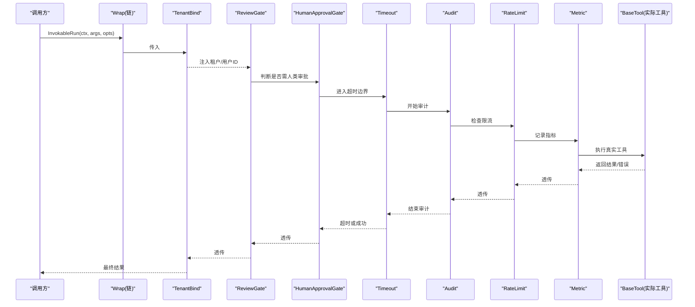

图表来源
- [chain.go:56-131](file://internal/manager/biz/aiops/tools/decorators/chain.go#L56-L131)
- [timeout.go:40-79](file://internal/manager/biz/aiops/tools/decorators/timeout.go#L40-L79)
- [audit.go:59-122](file://internal/manager/biz/aiops/tools/decorators/audit.go#L59-L122)
- [ratelimit.go:98-136](file://internal/manager/biz/aiops/tools/decorators/ratelimit.go#L98-L136)
- [metric.go:79-123](file://internal/manager/biz/aiops/tools/decorators/metric.go#L79-L123)
- [human_approval_gate.go:45-83](file://internal/manager/biz/aiops/tools/decorators/human_approval_gate.go#L45-L83)
- [review_gate.go:220-350](file://internal/manager/biz/aiops/tools/decorators/review_gate.go#L220-L350)
- [tenant_bind.go:31-85](file://internal/manager/biz/aiops/tools/decorators/tenant_bind.go#L31-L85)

## 详细组件分析

### 租户绑定装饰器（TenantBind）
- 职责：从上下文解析租户，向下游注入用户ID与租户标识；若工具声明了 tenant_id 参数且未显式传入，则自动注入。
- 位置：最外层，确保后续装饰器可见正确的身份上下文。
- 行为：不改变工具元数据；仅在 InvokableRun 时修改参数与选项。

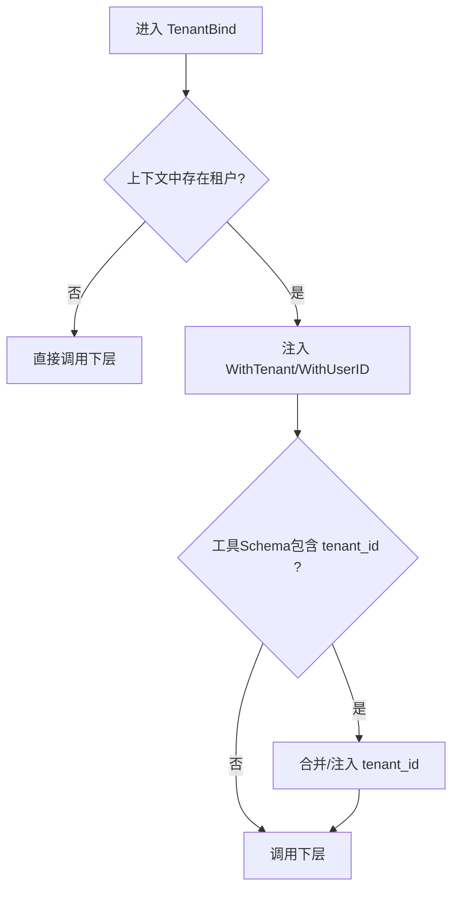

图表来源
- [tenant_bind.go:31-85](file://internal/manager/biz/aiops/tools/decorators/tenant_bind.go#L31-L85)

章节来源
- [tenant_bind.go:13-129](file://internal/manager/biz/aiops/tools/decorators/tenant_bind.go#L13-L129)

### 超时装饰器（Timeout）
- 职责：为每次调用设置超时边界，超时时返回明确的可识别错误。
- 位置：在审计之前，确保即使超时也会写入审计行。
- 错误：超时错误可被上层识别，用于分类 chat_tool_calls 的状态。

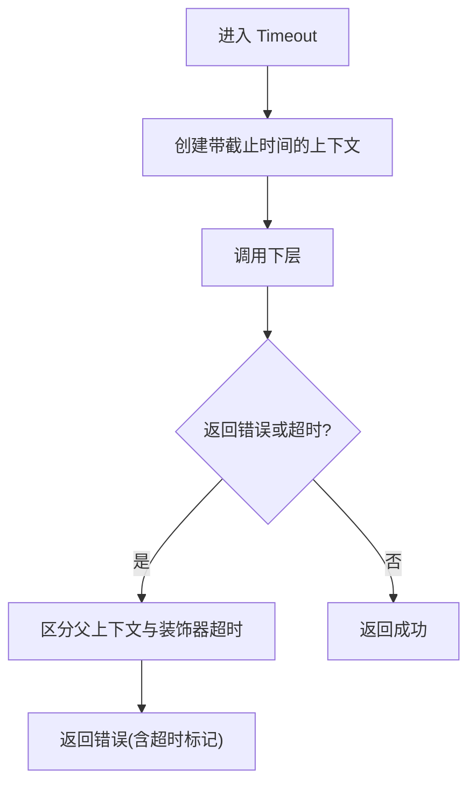

图表来源
- [timeout.go:40-79](file://internal/manager/biz/aiops/tools/decorators/timeout.go#L40-L79)

章节来源
- [timeout.go:1-79](file://internal/manager/biz/aiops/tools/decorators/timeout.go#L1-L79)

### 审计装饰器（Audit）
- 职责：在调用前后记录开始/结束事件，包括工具名、参数、租户、用户、设备、耗时与结果/错误。
- 位置：在限流之前，确保被限流的拒绝也被记录为一次尝试。
- 容错：结束阶段错误不会覆盖工具自身结果，遵循“审计失败不影响业务”的原则。

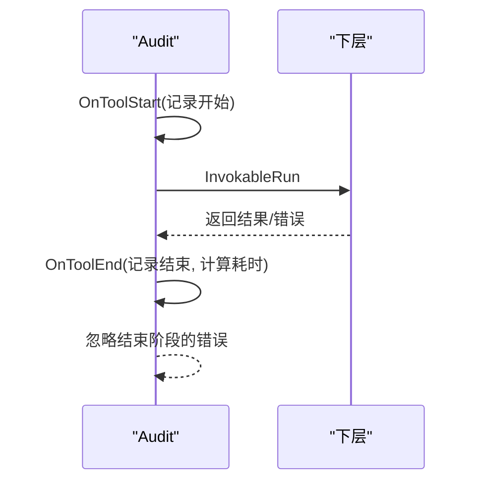

图表来源
- [audit.go:59-122](file://internal/manager/biz/aiops/tools/decorators/audit.go#L59-L122)

章节来源
- [audit.go:1-122](file://internal/manager/biz/aiops/tools/decorators/audit.go#L1-L122)

### 限流装饰器（RateLimit）
- 职责：基于 (工具名, 用户ID) 维度进行令牌桶限流，超出配额快速失败。
- 位置：在指标之前，避免被限流的拒绝污染耗时直方图。
- 错误：返回可识别的限流错误，供上层分类。

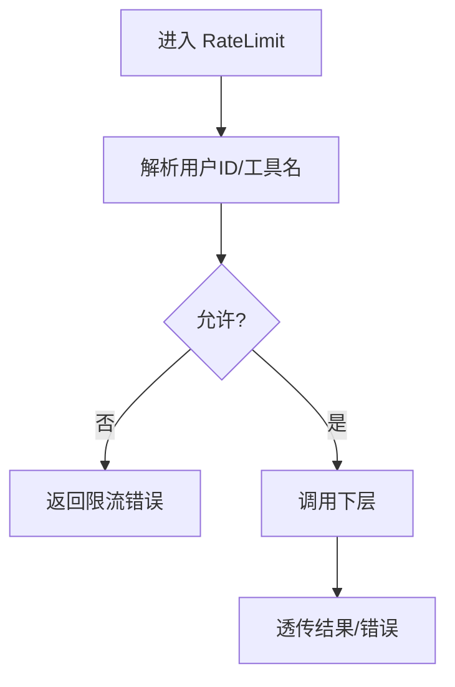

图表来源
- [ratelimit.go:98-136](file://internal/manager/biz/aiops/tools/decorators/ratelimit.go#L98-L136)

章节来源
- [ratelimit.go:1-136](file://internal/manager/biz/aiops/tools/decorators/ratelimit.go#L1-L136)

### 指标装饰器（Metric）
- 职责：记录调用总量与耗时分布，标签仅包含工具名与结果，避免高基数。
- 位置：最内层，只统计真实工具执行时间，不含装饰器开销。
- 注册：懒加载并复用 Prometheus 收集器，避免重复注册。

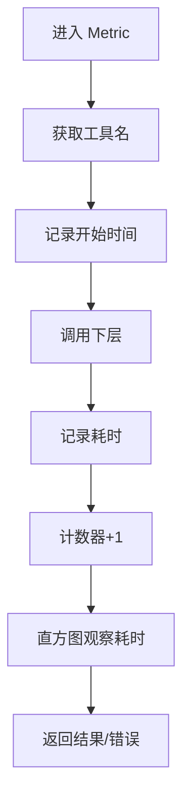

图表来源
- [metric.go:79-123](file://internal/manager/biz/aiops/tools/decorators/metric.go#L79-L123)

章节来源
- [metric.go:1-123](file://internal/manager/biz/aiops/tools/decorators/metric.go#L1-L123)

### 人类审批门控（HumanApprovalGate）
- 职责：对需要确认的工具发起持久化审批流程，等待人工批准后再执行。
- 触发条件：工具元数据要求确认，且尚未被人类批准。
- 行为：构造审批提案摘要，调用审批代理；批准后以标记选项再次调用下层。

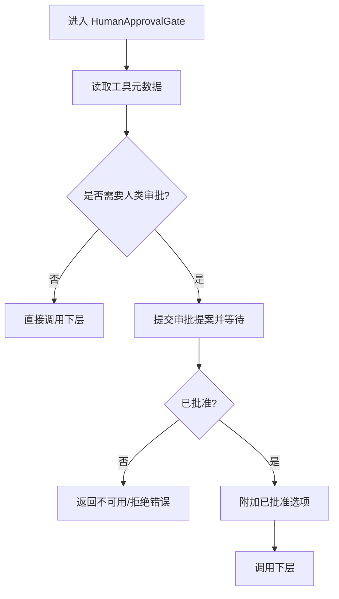

图表来源
- [human_approval_gate.go:45-83](file://internal/manager/biz/aiops/tools/decorators/human_approval_gate.go#L45-L83)

章节来源
- [human_approval_gate.go:1-107](file://internal/manager/biz/aiops/tools/decorators/human_approval_gate.go#L1-L107)

### 审查门控（ReviewGate）
- 职责：对写/破坏类工具进行 SOP 双重把关：确定性策略快速放行，否则启动审查工作流，解析“Decision: approve|reject”。
- 位置：在超时之外，拥有独立的审查超时；在审计之外，避免拒绝产生虚假执行行。
- 行为：插入待决提案、启动审查、解析决策、记录决策、必要时标记执行完成。

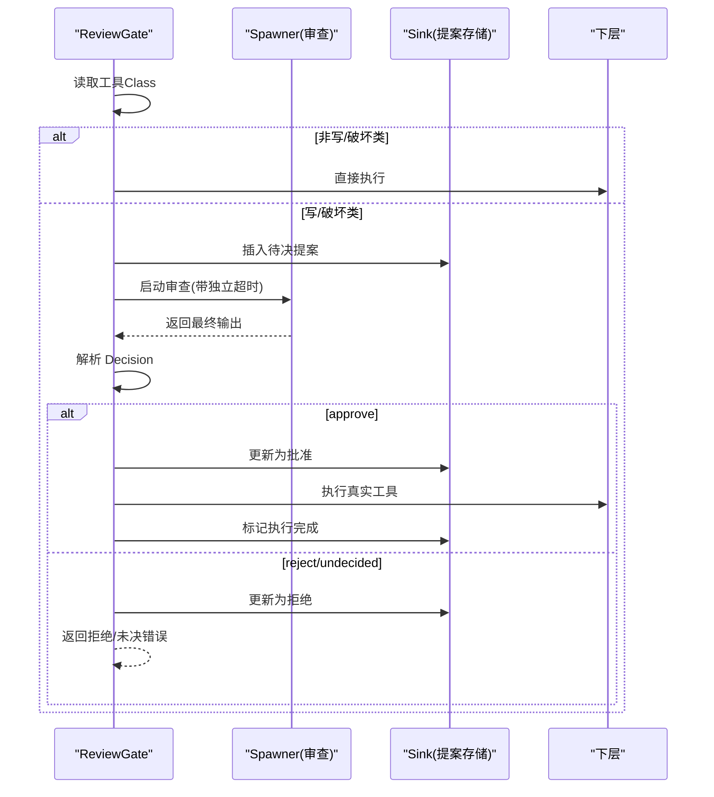

图表来源
- [review_gate.go:220-350](file://internal/manager/biz/aiops/tools/decorators/review_gate.go#L220-L350)

章节来源
- [review_gate.go:1-612](file://internal/manager/biz/aiops/tools/decorators/review_gate.go#L1-L612)

### 链式组合与执行顺序
- 组合入口：Wrap(inner, deps) 负责装配标准链。
- 顺序原则：
  - 租户绑定在外层，确保下游可见身份。
  - 审查门控在超时之外，拥有独立超时预算。
  - 人类审批门控在超时之前，确保审批通过后仍受超时约束。
  - 审计在限流之前，确保拒绝也可审计。
  - 指标在内层，仅统计真实工具耗时。

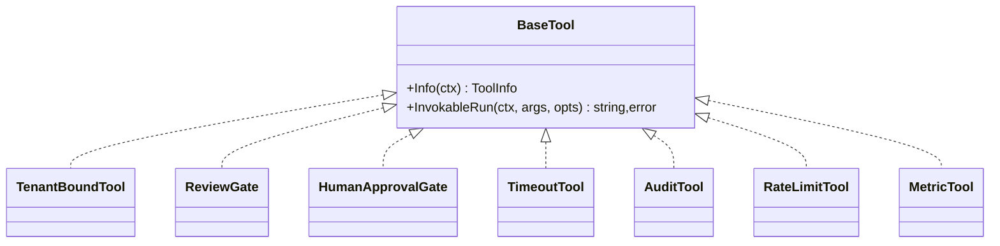

图表来源
- [basetool.go:30-56](file://internal/manager/biz/aiops/tools/basetool/basetool.go#L30-L56)
- [chain.go:106-131](file://internal/manager/biz/aiops/tools/decorators/chain.go#L106-L131)

章节来源
- [chain.go:56-131](file://internal/manager/biz/aiops/tools/decorators/chain.go#L56-L131)

## 依赖关系分析
- 对外依赖：Prometheus 指标注册、golang.org/x/time/rate 限流、eino 工具调用ID（可选）。
- 内部依赖：basetool 接口、tenantctx 租户上下文、审计/提案存储接口（通过接口解耦）。
- 耦合点：
  - 装饰器包不直接依赖 biz 仓库，通过 AuditSink/MutatingProposalSink 等接口隔离。
  - 指标收集器按 Registerer 复用，避免重复注册。

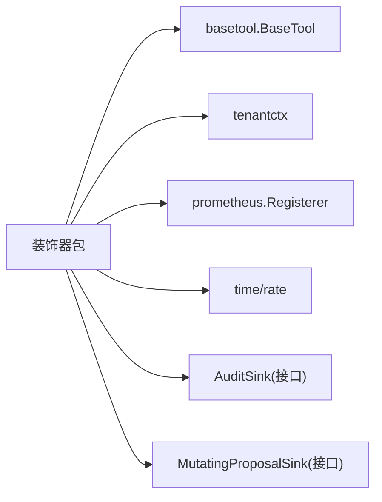

图表来源
- [chain.go:11-54](file://internal/manager/biz/aiops/tools/decorators/chain.go#L11-L54)
- [metric.go:14-78](file://internal/manager/biz/aiops/tools/decorators/metric.go#L14-L78)
- [ratelimit.go:29-40](file://internal/manager/biz/aiops/tools/decorators/ratelimit.go#L29-L40)
- [audit.go:10-35](file://internal/manager/biz/aiops/tools/decorators/audit.go#L10-L35)
- [review_gate.go:149-186](file://internal/manager/biz/aiops/tools/decorators/review_gate.go#L149-L186)

章节来源
- [chain.go:11-54](file://internal/manager/biz/aiops/tools/decorators/chain.go#L11-L54)

## 性能考量
- 指标最小化：指标装饰器仅使用低基数字段（name、result），避免高基数导致的内存与查询压力。
- 限流快速失败：令牌桶非阻塞，拒绝立即返回，避免占用资源。
- 审计最佳努力：审计结束阶段错误不传播，避免影响主流程。
- 指标内层：将指标置于链的最内层，避免装饰器开销污染耗时直方图。
- 审查独立超时：审查门控自带超时，不与工具超时竞争，减少误杀。

[本节为通用指导，无需特定文件引用]

## 故障排除指南
常见问题与定位建议
- 工具超时：检查 Timeout 装饰器是否生效，确认父上下文未提前取消；查看是否返回超时错误。
- 被限流：确认用户ID是否正确注入；检查限流速率与突发大小；观察是否返回限流错误。
- 审计缺失：确认 AuditSink 已注入；注意审计结束错误不会影响工具结果。
- 人类审批不可用：当需要人类审批但未接入审批代理时，会返回不可用错误；需在上层正确装配。
- 审查拒绝：审查门控拒绝时会返回可识别错误；检查审查输出是否包含明确的决策标记。

验证手段
- 单元测试覆盖链顺序与错误传播，可通过测试用例复现问题场景。

章节来源
- [decorators_test.go:188-236](file://internal/manager/biz/aiops/tools/decorators/decorators_test.go#L188-L236)
- [decorators_test.go:413-441](file://internal/manager/biz/aiops/tools/decorators/decorators_test.go#L413-L441)
- [basetool_decorated_test.go:39-71](file://internal/manager/biz/aiops/tools/basetool/basetool_decorated_test.go#L39-L71)
- [basetool_decorated_test.go:131-155](file://internal/manager/biz/aiops/tools/basetool/basetool_decorated_test.go#L131-L155)

## 结论
装饰器链通过统一接口与集中装配，实现了横切能力的可插拔与可观测。标准顺序确保了身份解析、SOP 门控、超时、审计、限流与指标的协同工作。通过接口解耦与默认值策略，系统既具备生产级健壮性，又便于扩展与测试。

[本节为总结，无需特定文件引用]

## 附录

### 自定义装饰器开发指南
- 接口契约：实现 BaseTool 的 Info 与 InvokableRun，保持无副作用的 Info 与幂等的 InvokableRun。
- 组合模式：在 Wrap 中按需求插入新装饰器，遵循“外层先于内层”的顺序原则。
- 错误语义：定义明确的错误类型，便于上层分类与展示。
- 可观测性：如需指标，使用低基数字段；如需审计，遵循“审计失败不影响业务”的原则。
- 并发安全：装饰器应线程安全，状态尽量外置或通过注入提供。

章节来源
- [basetool.go:30-56](file://internal/manager/biz/aiops/tools/basetool/basetool.go#L30-L56)
- [chain.go:56-131](file://internal/manager/biz/aiops/tools/decorators/chain.go#L56-L131)