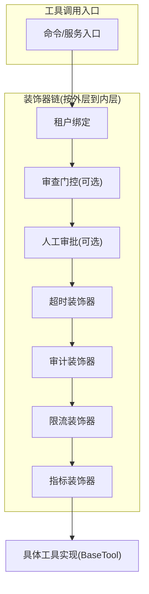
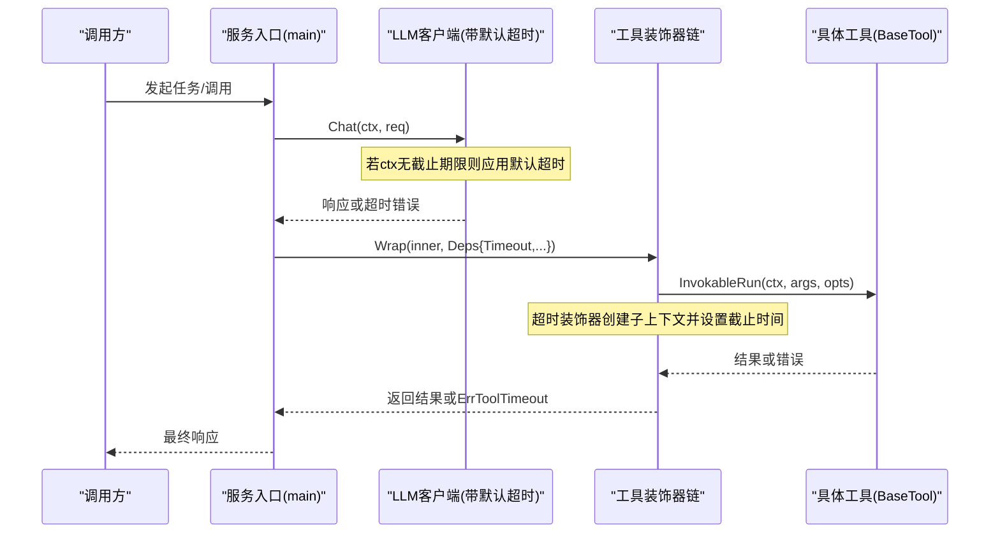
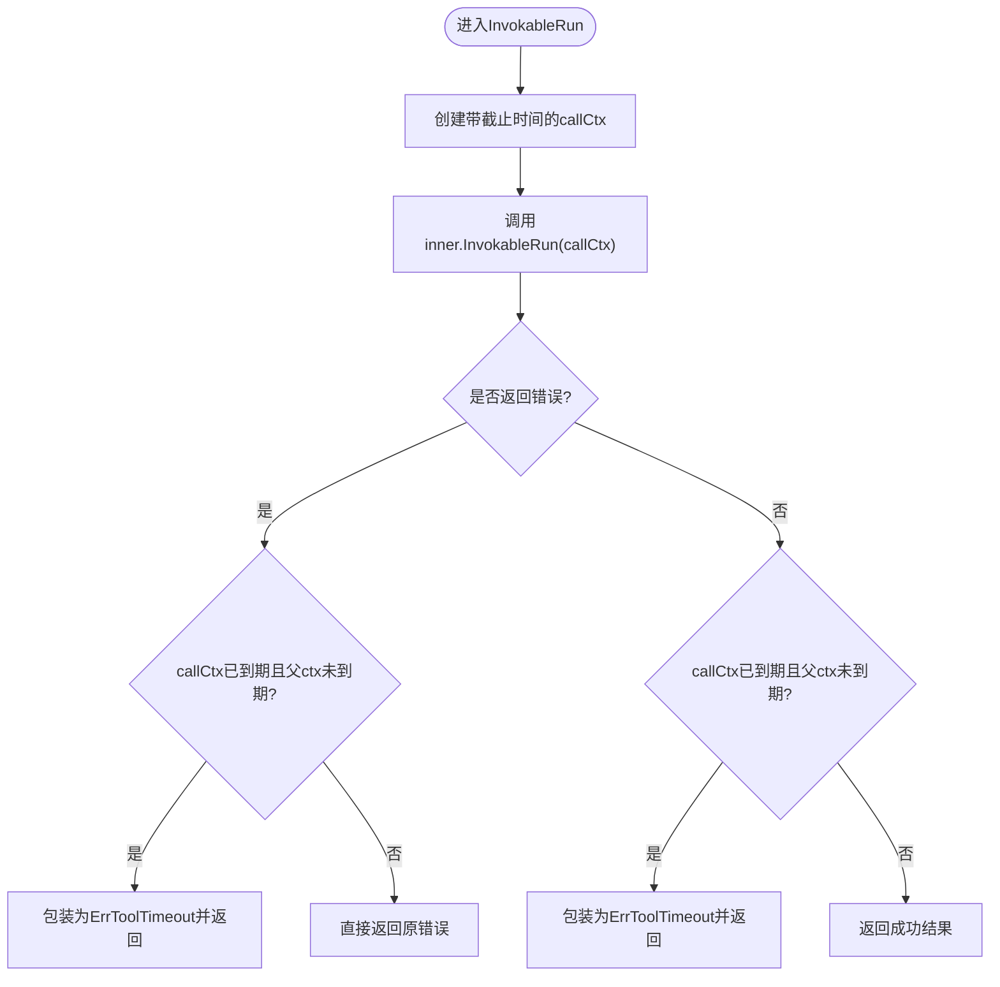
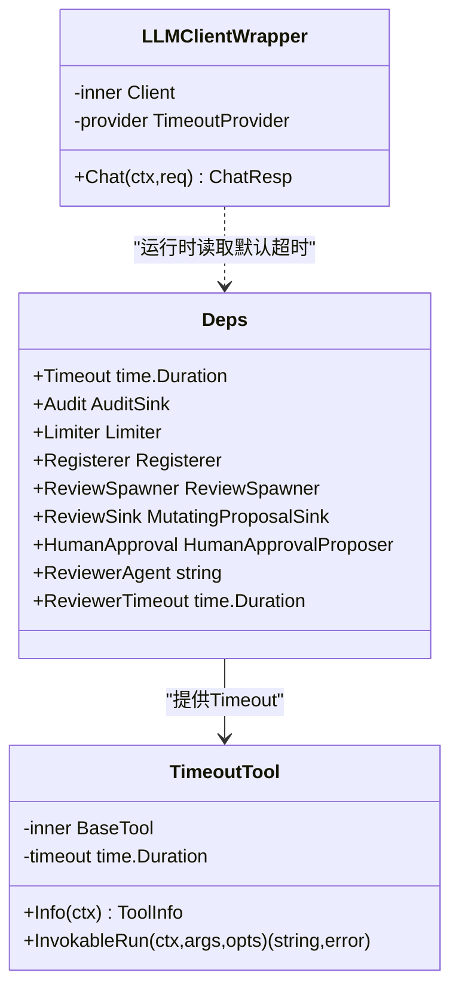
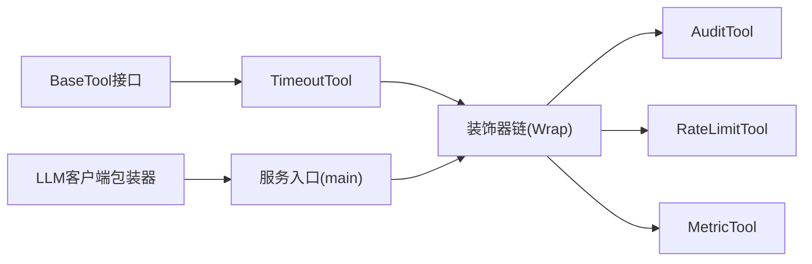

# 超时控制

<cite>
**本文引用的文件**
- [timeout.go](file://internal/manager/biz/aiops/tools/decorators/timeout.go)
- [chain.go](file://internal/manager/biz/aiops/tools/decorators/chain.go)
- [decorators_test.go](file://internal/manager/biz/aiops/tools/decorators/decorators_test.go)
- [audit.go](file://internal/manager/biz/aiops/tools/decorators/audit.go)
- [ratelimit.go](file://internal/manager/biz/aiops/tools/decorators/ratelimit.go)
- [main.go](file://cmd/ongrid/main.go)
- [client.go](file://internal/pkg/llm/client.go)
</cite>

## 目录
1. [简介](#简介)
2. [项目结构](#项目结构)
3. [核心组件](#核心组件)
4. [架构总览](#架构总览)
5. [详细组件分析](#详细组件分析)
6. [依赖关系分析](#依赖关系分析)
7. [性能与统计](#性能与统计)
8. [调优建议](#调优建议)
9. [故障排查](#故障排查)
10. [结论](#结论)

## 简介
本技术文档聚焦于“工具调用”的超时控制装饰器，系统性说明其实现原理、上下文取消机制、goroutine 管理方式、配置层次（全局默认值、工具级配置、调用级覆盖）、以及超时统计与性能影响。同时给出策略调优建议与故障恢复方法，帮助读者在生产环境中稳定、可控地使用超时能力。

## 项目结构
超时控制位于 AIOps 工具链的装饰器层，围绕 BaseTool 接口进行横切增强。标准装饰器链由 chain.go 统一组装，超时装饰器通过 context.WithTimeout 为每次工具调用设置截止时间，并在超时时返回可识别的错误类型，便于上层分类与观测。

图表来源
- [chain.go:56-131](file://internal/manager/biz/aiops/tools/decorators/chain.go#L56-L131)

章节来源
- [chain.go:56-131](file://internal/manager/biz/aiops/tools/decorators/chain.go#L56-L131)

## 核心组件
- 超时装饰器：为每次 InvokableRun 创建带截止时间的子上下文，拦截并包装超时错误，保证上层能区分“装饰器强加的超时”和“工具自身错误”。
- 装饰器链：统一装配顺序，确保超时在审计之后、限流之前，从而保留完整的执行日志与指标口径。
- 配置来源：全局默认超时、LLM 请求级默认超时、工具注册时覆盖、调用级显式超时。

章节来源
- [timeout.go:22-78](file://internal/manager/biz/aiops/tools/decorators/timeout.go#L22-L78)
- [chain.go:11-54](file://internal/manager/biz/aiops/tools/decorators/chain.go#L11-L54)

## 架构总览
下图展示了从命令入口到工具执行的完整链路，包括 LLM 客户端的默认超时包装与工具层的超时装饰器如何协同工作。

图表来源
- [client.go:135-161](file://internal/pkg/llm/client.go#L135-L161)
- [chain.go:106-131](file://internal/manager/biz/aiops/tools/decorators/chain.go#L106-L131)
- [timeout.go:55-78](file://internal/manager/biz/aiops/tools/decorators/timeout.go#L55-L78)

## 详细组件分析

### 超时装饰器（TimeoutTool）
- 职责：为每次工具调用创建带截止时间的上下文；当父上下文未过期而子上下文到期时，将错误包装为可识别的超时错误，便于上层分类。
- 关键行为：
  - 使用 context.WithTimeout 创建 callCtx，并在函数退出时 cancel。
  - 对 inner.InvokableRun 的结果进行兜底检查：即使工具忽略 ctx，也会在返回后再次校验 deadline，避免漏网之鱼。
  - 错误包装：当 callCtx.Err() 为 DeadlineExceeded 且父 ctx 未过期时，返回包含 ErrToolTimeout 的错误，附带超时时长信息。
- 默认值：构造时若传入零或负数，回退到全局默认超时。

图表来源
- [timeout.go:55-78](file://internal/manager/biz/aiops/tools/decorators/timeout.go#L55-L78)

章节来源
- [timeout.go:22-78](file://internal/manager/biz/aiops/tools/decorators/timeout.go#L22-L78)
- [decorators_test.go:73-105](file://internal/manager/biz/aiops/tools/decorators/decorators_test.go#L73-L105)

### 装饰器链（Wrap）
- 组装顺序（外层→内层）：tenant_bind → review_gate → human_approval → timeout → audit → ratelimit → metric。
- 设计考量：
  - 超时在审计之后，确保即使超时也会写入执行记录。
  - 限流在审计之后，使被限流的拒绝也能被审计记录。
  - 指标在最内层，仅统计工具本身耗时，不包含装饰器开销。
- 依赖注入：Deps 提供 Timeout、Audit、Limiter、Registerer 等横切能力，零值均有安全默认。

章节来源
- [chain.go:56-131](file://internal/manager/biz/aiops/tools/decorators/chain.go#L56-L131)

### 审计与指标（配合超时）
- 审计：在工具调用前后发射开始/结束事件，记录参数、用户、设备、耗时与错误。超时场景下，审计仍会记录开始与结束，并将错误设置为超时错误，便于追踪。
- 指标：在装饰器链最内层统计工具调用次数与耗时，避免将限流拒绝或装饰器开销计入工具耗时。

章节来源
- [audit.go:59-122](file://internal/manager/biz/aiops/tools/decorators/audit.go#L59-L122)
- [decorators_test.go:273-333](file://internal/manager/biz/aiops/tools/decorators/decorators_test.go#L273-L333)

### 限流（与超时的协作）
- 限流基于 per-(tool, user) 的令牌桶，非阻塞拒绝，返回可识别的限流错误。
- 与超时的关系：限流发生在超时之后，因此被限流的调用也会被审计记录为失败尝试，但不计入工具耗时指标。

章节来源
- [ratelimit.go:14-136](file://internal/manager/biz/aiops/tools/decorators/ratelimit.go#L14-L136)

### 配置层次与覆盖策略
- 全局默认超时（工具级）：装饰器链中的 DefaultTimeout，用于 WithTimeout 未显式指定时的回退。
- LLM 请求级默认超时：LLM 客户端包装器在 ctx 无截止期限时应用默认超时，适用于所有 LLM 提供商。
- 工具注册覆盖：某些需要更长耗时的工具可在注册时覆盖默认超时。
- 调用级覆盖：调用方可通过传入带截止期限的 ctx 或显式超时参数覆盖默认值。

图表来源
- [chain.go:11-54](file://internal/manager/biz/aiops/tools/decorators/chain.go#L11-L54)
- [timeout.go:22-47](file://internal/manager/biz/aiops/tools/decorators/timeout.go#L22-L47)
- [client.go:135-161](file://internal/pkg/llm/client.go#L135-L161)

章节来源
- [chain.go:11-54](file://internal/manager/biz/aiops/tools/decorators/chain.go#L11-L54)
- [timeout.go:22-47](file://internal/manager/biz/aiops/tools/decorators/timeout.go#L22-L47)
- [client.go:135-161](file://internal/pkg/llm/client.go#L135-L161)
- [main.go:769-772](file://cmd/ongrid/main.go#L769-L772)

## 依赖关系分析
- 超时装饰器依赖 basetool.BaseTool 接口，保持与具体工具实现的解耦。
- 装饰器链依赖审计、限流、指标等横切能力，并通过 Deps 注入，便于测试替换与生产定制。
- LLM 客户端包装器独立于工具层，提供统一的默认超时策略，避免各提供商重复实现。

图表来源
- [chain.go:106-131](file://internal/manager/biz/aiops/tools/decorators/chain.go#L106-L131)
- [client.go:135-161](file://internal/pkg/llm/client.go#L135-L161)

章节来源
- [chain.go:106-131](file://internal/manager/biz/aiops/tools/decorators/chain.go#L106-L131)
- [client.go:135-161](file://internal/pkg/llm/client.go#L135-L161)

## 性能与统计
- 超时开销：主要为 context.WithTimeout 的轻量级调度与 deadline 检查，几乎可忽略。
- 指标口径：指标装饰器位于链的最内层，统计的是工具本身的耗时，不包含超时、审计、限流的额外开销，保证度量准确性。
- 审计开销：审计在超时前记录开始、超时后记录结束，确保即使超时也有完整执行轨迹。
- 限流影响：限流在非阻塞路径中快速拒绝，避免无效调用占用资源；被限流的调用不会计入工具耗时指标。

章节来源
- [chain.go:69-101](file://internal/manager/biz/aiops/tools/decorators/chain.go#L69-L101)
- [audit.go:84-122](file://internal/manager/biz/aiops/tools/decorators/audit.go#L84-L122)
- [ratelimit.go:98-136](file://internal/manager/biz/aiops/tools/decorators/ratelimit.go#L98-L136)

## 调优建议
- 合理设置默认超时：
  - 工具级默认超时：根据工具典型耗时与 SLO 设定，避免过短导致误杀、过长导致资源占用。
  - LLM 请求级默认超时：结合模型响应时间与业务容忍度，设置合理的上限。
- 分层覆盖策略：
  - 对长耗时工具（如关联分析）在注册时覆盖默认超时。
  - 对交互式或外部依赖强的调用，在调用级传入更严格的超时以保护整体链路。
- 观察与反馈：
  - 关注审计中的超时错误比例与分布，定位热点工具。
  - 结合指标中的工具耗时直方图，评估超时阈值是否合适。
- 并发与背压：
  - 配合限流与批处理（如批量 fan-out），避免瞬时峰值压垮下游。
  - 对上游调用者增加重试与退避策略，但需考虑幂等性与去重。

[本节为通用指导，不直接分析具体文件]

## 故障排查
- 常见症状：
  - 频繁出现“工具超时”错误：检查默认超时是否过短、下游依赖是否抖动、是否存在慢查询。
  - 审计缺失：确认装饰器链顺序是否正确，超时是否在审计之后。
  - 指标异常：确认指标装饰器位置正确，未被限流或装饰器开销污染。
- 定位步骤：
  - 查看审计记录的开始/结束时间、错误类型与耗时，判断是否为装饰器超时。
  - 检查调用链上的 ctx 是否已携带截止期限，避免多层叠加导致过早超时。
  - 核对工具注册时的超时覆盖是否与预期一致。
- 恢复措施：
  - 临时放宽超时阈值以缓解压力，同时定位根因。
  - 对不稳定依赖增加熔断与降级策略。
  - 优化工具内部逻辑，减少阻塞点，提升可取消性（尊重 ctx.Done）。

章节来源
- [decorators_test.go:470-501](file://internal/manager/biz/aiops/tools/decorators/decorators_test.go#L470-L501)
- [audit.go:84-122](file://internal/manager/biz/aiops/tools/decorators/audit.go#L84-L122)
- [chain.go:69-101](file://internal/manager/biz/aiops/tools/decorators/chain.go#L69-L101)

## 结论
超时控制装饰器通过 context.WithTimeout 与明确的错误包装，为工具调用提供了可靠的时间边界保障。结合审计、限流与指标，形成了完整的可观测与防护体系。通过全局默认、工具覆盖与调用级控制的层次化配置，既能满足通用场景，又能灵活适配特殊需求。建议在上线前充分评估超时阈值，持续观察审计与指标，动态调优以平衡稳定性与性能。