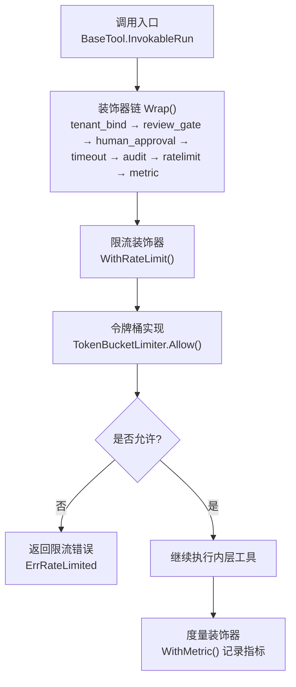
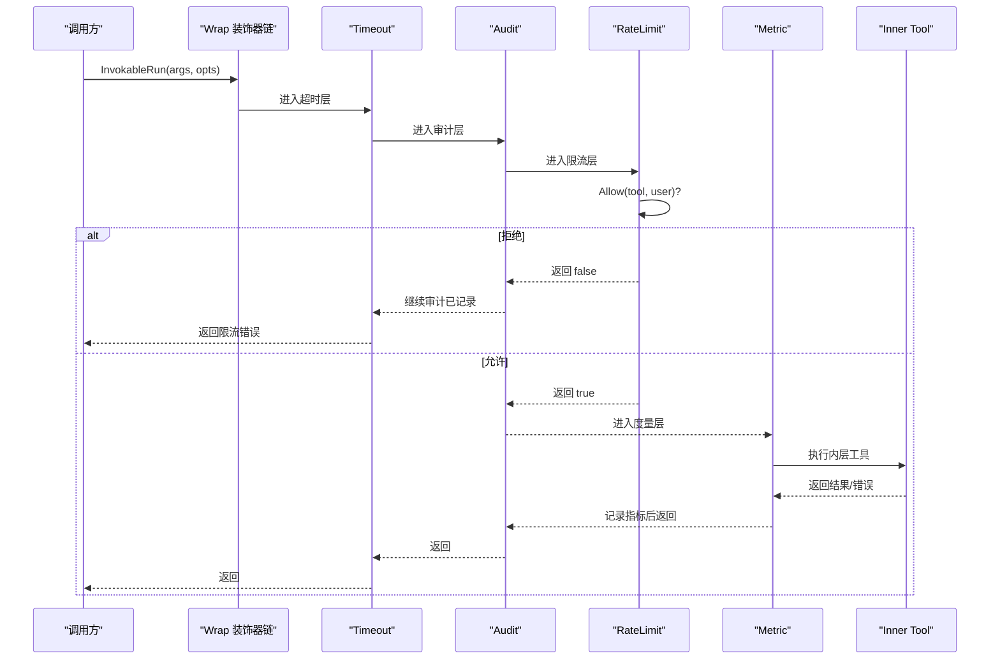
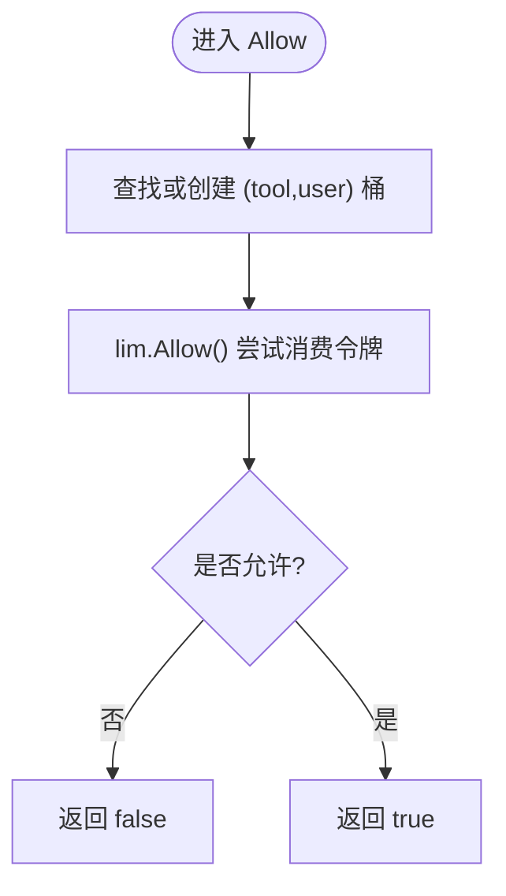
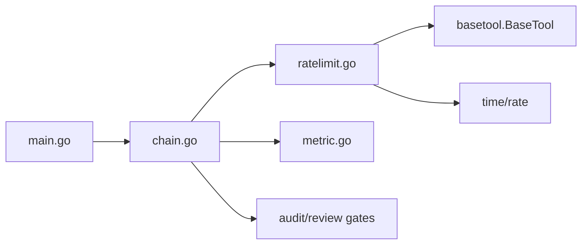

# 限流控制

<cite>
**本文引用的文件**
- [ratelimit.go](file://internal/manager/biz/aiops/tools/decorators/ratelimit.go)
- [chain.go](file://internal/manager/biz/aiops/tools/decorators/chain.go)
- [metric.go](file://internal/manager/biz/aiops/tools/decorators/metric.go)
- [decorators_test.go](file://internal/manager/biz/aiops/tools/decorators/decorators_test.go)
- [main.go](file://cmd/ongrid/main.go)
</cite>

## 目录
1. [简介](#简介)
2. [项目结构](#项目结构)
3. [核心组件](#核心组件)
4. [架构总览](#架构总览)
5. [详细组件分析](#详细组件分析)
6. [依赖关系分析](#依赖关系分析)
7. [性能考量](#性能考量)
8. [故障排除指南](#故障排除指南)
9. [结论](#结论)
10. [附录](#附录)

## 简介
本技术文档聚焦于“限流控制装饰器”的实现与使用，围绕令牌桶算法、配置选项（速率限制、突发处理、冷却时间）、统计与监控指标收集、策略调优与故障排除展开。该实现以装饰器模式嵌入工具调用链，确保在统一入口对每个“工具 + 用户”维度进行细粒度限流，并通过 Prometheus 指标暴露可观测性。

## 项目结构
限流相关代码位于 AIOPS 工具装饰器层：
- 限流核心：基于 golang.org/x/time/rate 的令牌桶实现，按（工具名，用户ID）维护独立桶。
- 装饰器链：将限流与其他横切关注点（超时、审计、度量等）组合为固定顺序的执行栈。
- 指标采集：通过 Prometheus 计数器与时序直方图记录调用次数与耗时。
- 应用装配：主程序在构造工具时注入限流器实例，默认使用全局默认速率。

图表来源
- [chain.go:56-131](file://internal/manager/biz/aiops/tools/decorators/chain.go#L56-L131)
- [ratelimit.go:98-135](file://internal/manager/biz/aiops/tools/decorators/ratelimit.go#L98-L135)
- [metric.go:79-122](file://internal/manager/biz/aiops/tools/decorators/metric.go#L79-L122)

章节来源
- [chain.go:11-54](file://internal/manager/biz/aiops/tools/decorators/chain.go#L11-L54)
- [ratelimit.go:14-27](file://internal/manager/biz/aiops/tools/decorators/ratelimit.go#L14-L27)

## 核心组件
- Limiter 接口：定义 Allow(ctx, toolName, userID) bool，用于判定一次调用是否被允许。
- TokenBucketLimiter：生产级实现，按（tool, user）懒创建 rate.Limiter；burst 默认等于 per-minute 速率，使空闲后的首次调用总是放行。
- RateLimitTool：装饰器包装，先查询 Limiter，拒绝则快速失败并返回 ErrRateLimited。
- Deps 与 Wrap：标准装饰器栈组装，限流位于审计之后、度量之前，保证审计覆盖拒绝场景且度量不污染拒绝开销。
- MetricTool：记录 ongrid_tool_invocations_total 与 ongrid_tool_duration_seconds 指标。

章节来源
- [ratelimit.go:29-96](file://internal/manager/biz/aiops/tools/decorators/ratelimit.go#L29-L96)
- [ratelimit.go:98-135](file://internal/manager/biz/aiops/tools/decorators/ratelimit.go#L98-L135)
- [chain.go:56-131](file://internal/manager/biz/aiops/tools/decorators/chain.go#L56-L131)
- [metric.go:14-122](file://internal/manager/biz/aiops/tools/decorators/metric.go#L14-L122)

## 架构总览
装饰器链顺序（由外到内）：租户绑定 → 审查门控 → 人工审批 → 超时 → 审计 → 限流 → 度量。该顺序确保：
- 审计能捕获所有尝试（包括被限流的拒绝）。
- 限流不影响度量直方图的准确性（拒绝不计入耗时）。
- 超时在审计之外，避免丢失超时分类信息。
- 度量在最内层，仅统计真实工具执行耗时。

图表来源
- [chain.go:56-131](file://internal/manager/biz/aiops/tools/decorators/chain.go#L56-L131)
- [ratelimit.go:98-135](file://internal/manager/biz/aiops/tools/decorators/ratelimit.go#L98-L135)
- [metric.go:79-122](file://internal/manager/biz/aiops/tools/decorators/metric.go#L79-L122)

## 详细组件分析

### 令牌桶限流器（TokenBucketLimiter）
- 算法选择：令牌桶（golang.org/x/time/rate），支持平滑速率与突发。
- 键空间：以（工具名，用户ID）为键，避免跨用户共享配额，也防止单用户其他工具被饥饿。
- 速率与突发：
  - 速率：per-minute 转换为 events/sec 作为 rate.Limit。
  - 突发：默认等于 per-minute 速率，使空闲窗口后的首次调用总是放行。
- 并发安全：内部 map 加互斥锁保护，懒初始化各桶。
- 非阻塞：Allow 不等待，直接返回是否允许；装饰器层将拒绝转为快速失败。

图表来源
- [ratelimit.go:80-96](file://internal/manager/biz/aiops/tools/decorators/ratelimit.go#L80-L96)

章节来源
- [ratelimit.go:49-96](file://internal/manager/biz/aiops/tools/decorators/ratelimit.go#L49-L96)

### 限流装饰器（RateLimitTool）
- 职责：在执行前检查 Limiter；若拒绝，立即返回 ErrRateLimited，不调用内层工具。
- 参数解析：从 InvokeOption 中解析 UserID，结合工具名生成限流键。
- 透传 Info：不改变工具元数据。

章节来源
- [ratelimit.go:98-135](file://internal/manager/biz/aiops/tools/decorators/ratelimit.go#L98-L135)

### 装饰器链（Wrap）与顺序
- 标准顺序：tenant_bind → review_gate → human_approval → timeout → audit → ratelimit → metric。
- 设计理由：
  - 审计在外侧，确保被限流的拒绝也被记录。
  - 限流在外侧于度量，避免拒绝开销污染耗时直方图。
  - 超时在审计外侧，确保超时也能产生审计行。
  - 度量最内侧，只统计真实工具执行耗时。

章节来源
- [chain.go:56-131](file://internal/manager/biz/aiops/tools/decorators/chain.go#L56-L131)

### 指标与监控（MetricTool）
- 指标名称：
  - ongrid_tool_invocations_total{name, result}：累计调用次数，按成功/失败拆分。
  - ongrid_tool_duration_seconds{name}：调用耗时直方图（指数分桶）。
- 注册策略：按 Registerer 缓存 collectors，避免重复注册导致 panic。
- 标签约束：仅使用 name/result，避免高基数标签（如用户/租户）。

章节来源
- [metric.go:14-122](file://internal/manager/biz/aiops/tools/decorators/metric.go#L14-L122)

### 应用装配与默认值
- 默认速率：DefaultRateLimit = 10 calls/min（每工具每用户）。
- 注入方式：主程序在构造工具时传入 NewTokenBucketLimiter(0)，0 表示回退到默认速率。
- 多工具复用：同一进程内多个工具共用同一 limiter 实例，按（tool,user）隔离。

章节来源
- [ratelimit.go:14-22](file://internal/manager/biz/aiops/tools/decorators/ratelimit.go#L14-L22)
- [main.go:1577-1584](file://cmd/ongrid/main.go#L1577-L1584)
- [main.go:2304-2318](file://cmd/ongrid/main.go#L2304-L2318)
- [main.go:2348-2349](file://cmd/ongrid/main.go#L2348-L2349)
- [main.go:4004-4005](file://cmd/ongrid/main.go#L4004-L4005)

## 依赖关系分析
- 外部依赖：golang.org/x/time/rate 提供令牌桶能力。
- 内部依赖：
  - basetool.BaseTool：被装饰的目标接口。
  - prometheus.Registerer：指标注册中心。
  - 审计与审查门控：通过 Deps 注入，与限流协作形成完整横切链路。

图表来源
- [ratelimit.go:1-12](file://internal/manager/biz/aiops/tools/decorators/ratelimit.go#L1-L12)
- [chain.go:1-10](file://internal/manager/biz/aiops/tools/decorators/chain.go#L1-L10)
- [metric.go:1-12](file://internal/manager/biz/aiops/tools/decorators/metric.go#L1-L12)
- [main.go:1577-1584](file://cmd/ongrid/main.go#L1577-L1584)

章节来源
- [chain.go:1-10](file://internal/manager/biz/aiops/tools/decorators/chain.go#L1-L10)
- [ratelimit.go:1-12](file://internal/manager/biz/aiops/tools/decorators/ratelimit.go#L1-L12)
- [metric.go:1-12](file://internal/manager/biz/aiops/tools/decorators/metric.go#L1-L12)

## 性能考量
- 非阻塞决策：Allow 不等待，避免线程阻塞放大延迟。
- 低开销：仅一次 map 查找与互斥锁保护；桶懒创建，减少内存占用。
- 指标精度：度量在限流之后，拒绝不计入耗时直方图，避免噪声。
- 突发友好：burst=rate 保证空闲后首请求通过，提升交互体验。
- 可扩展性：按（tool,user）隔离，避免热点冲突；可通过注入自定义 Limiter 扩展策略。

[本节为通用性能讨论，无需特定文件引用]

## 故障排除指南
- 现象：频繁出现“工具调用被限流”的错误。
  - 排查要点：
    - 确认当前（tool,user）是否已达到 per-minute 上限。
    - 检查 burst 设置是否过小导致突发受限。
    - 观察 ongrid_tool_invocations_total{name,error} 是否激增。
  - 参考路径：
    - [ratelimit.go:24-27](file://internal/manager/biz/aiops/tools/decorators/ratelimit.go#L24-L27)
    - [ratelimit.go:80-96](file://internal/manager/biz/aiops/tools/decorators/ratelimit.go#L80-L96)
    - [metric.go:43-59](file://internal/manager/biz/aiops/tools/decorators/metric.go#L43-L59)
- 现象：某些用户被限流，其他用户正常。
  - 排查要点：
    - 确认 UserID 是否正确解析（InvokeOption）。
    - 验证不同用户拥有独立桶（测试用例覆盖）。
  - 参考路径：
    - [decorators_test.go:238-254](file://internal/manager/biz/aiops/tools/decorators/decorators_test.go#L238-L254)
- 现象：被限流未产生审计记录。
  - 排查要点：
    - 确认审计在限流外侧（Wrap 顺序）。
  - 参考路径：
    - [chain.go:56-131](file://internal/manager/biz/aiops/tools/decorators/chain.go#L56-L131)

章节来源
- [ratelimit.go:24-27](file://internal/manager/biz/aiops/tools/decorators/ratelimit.go#L24-L27)
- [ratelimit.go:80-96](file://internal/manager/biz/aiops/tools/decorators/ratelimit.go#L80-L96)
- [metric.go:43-59](file://internal/manager/biz/aiops/tools/decorators/metric.go#L43-L59)
- [decorators_test.go:238-254](file://internal/manager/biz/aiops/tools/decorators/decorators_test.go#L238-L254)
- [chain.go:56-131](file://internal/manager/biz/aiops/tools/decorators/chain.go#L56-L131)

## 结论
本项目采用令牌桶实现“每工具每用户”的细粒度限流，并以装饰器链将其无缝集成到工具调用流程中。通过合理的链顺序与指标埋点，既保证了可观测性与审计完整性，又避免了限流对性能指标的干扰。默认速率与突发策略兼顾了 LLM 关联场景下的突发需求与后端保护。实际部署中可根据业务 SLO 调整速率与突发，并结合指标持续优化。

[本节为总结性内容，无需特定文件引用]

## 附录

### 限流算法与策略说明
- 令牌桶：适合稳定速率+突发场景，实现简单、开销低。
- 滑动窗口：未在实现中使用；如需更严格的瞬时峰值控制，可在 Limiter 接口之上扩展新实现。
- 冷却时间：当前实现无显式冷却期；如需“失败后冷却”，可在 Limiter 实现中叠加状态机逻辑。

[本节为概念性说明，无需特定文件引用]

### 配置项速查
- 速率限制：per-minute 速率（默认 10），通过 NewTokenBucketLimiter(ratePerMinute) 设置；0 表示使用默认。
- 突发处理：burst 默认等于 per-minute 速率，允许空闲后一次性触发多次。
- 冷却时间：当前未内置；可通过自定义 Limiter 实现添加。
- 指标开关：Registerer 为空时使用默认注册器；可通过替换 Registerer 控制指标输出。

章节来源
- [ratelimit.go:14-22](file://internal/manager/biz/aiops/tools/decorators/ratelimit.go#L14-L22)
- [ratelimit.go:66-78](file://internal/manager/biz/aiops/tools/decorators/ratelimit.go#L66-L78)
- [metric.go:29-62](file://internal/manager/biz/aiops/tools/decorators/metric.go#L29-L62)

### 监控指标清单
- ongrid_tool_invocations_total{name, result}：工具调用总量，按 success/error 区分。
- ongrid_tool_duration_seconds{name}：工具调用耗时直方图（秒）。

章节来源
- [metric.go:43-59](file://internal/manager/biz/aiops/tools/decorators/metric.go#L43-L59)

### 调优建议
- 提高稳定性：适当降低 per-minute 速率，或减小 burst，抑制突发风暴。
- 改善交互：保持 burst ≥ rate，确保空闲后首请求不被误杀。
- 精细化控制：为关键工具单独注入更小速率的 Limiter，保护下游系统。
- 观测驱动：基于 ongrid_tool_invocations_total 与 ongrid_tool_duration_seconds 评估效果，逐步迭代。

[本节为通用指导，无需特定文件引用]