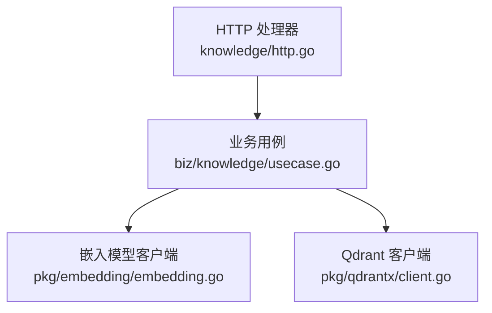
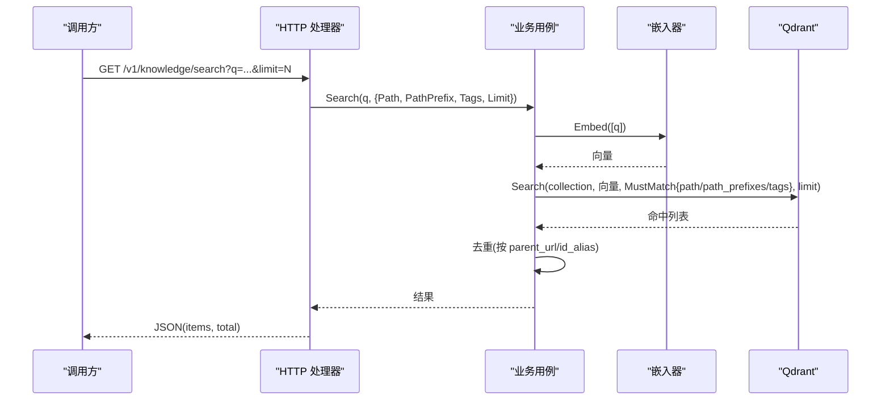
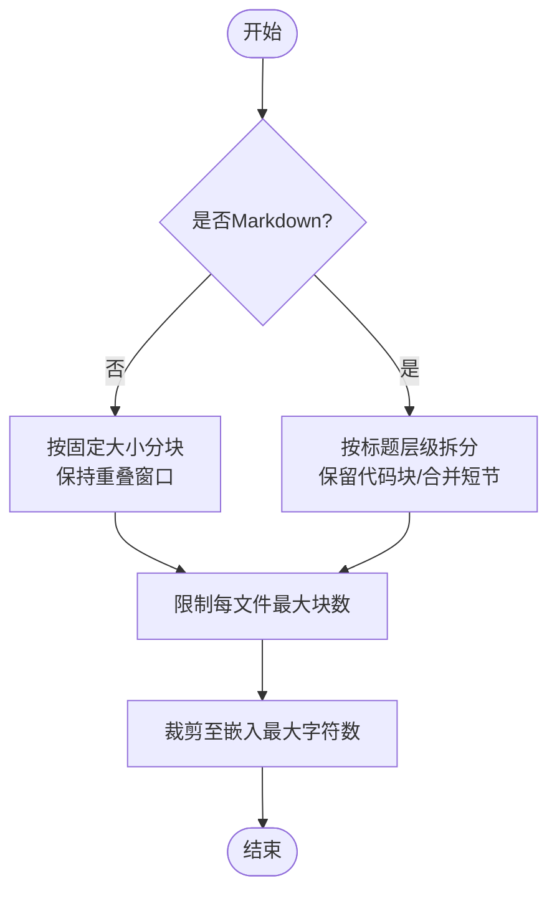
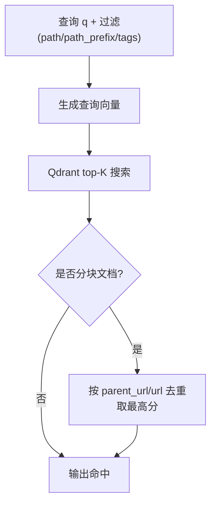
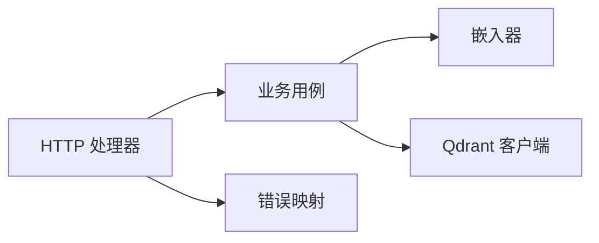

# RAG 检索引擎

<cite>
**本文引用的文件**
- [usecase.go](file://internal/manager/biz/knowledge/usecase.go)
- [client.go](file://internal/pkg/qdrantx/client.go)
- [embedding.go](file://internal/pkg/embedding/embedding.go)
- [http.go](file://internal/manager/server/knowledge/http.go)
- [chunk_test.go](file://internal/manager/biz/knowledge/chunk_test.go)
- [errs.go](file://internal/pkg/errs/errs.go)
</cite>

## 目录
1. [简介](#简介)
2. [项目结构](#项目结构)
3. [核心组件](#核心组件)
4. [架构总览](#架构总览)
5. [详细组件分析](#详细组件分析)
6. [依赖关系分析](#依赖关系分析)
7. [性能考虑](#性能考虑)
8. [故障排查指南](#故障排查指南)
9. [结论](#结论)
10. [附录](#附录)

## 简介
本技术文档面向 RAG（检索增强生成）检索子系统，聚焦向量嵌入、语义搜索、文本分块策略、向量维度配置与相似度计算；详述 Qdrant 向量数据库的集成方式（集合管理、索引优化、查询过滤）；说明查询重写与结果去重逻辑（路径前缀匹配、标签过滤、上下文提取）；给出批量处理、缓存机制与查询调优等性能策略；并覆盖错误处理、故障恢复、监控指标与调试工具使用。

## 项目结构
RAG 检索能力由三层组成：
- HTTP 服务层：暴露 /v1/knowledge/* 接口，负责参数校验、鉴权与响应封装。
- 业务用例层：实现知识入库、同步、搜索、列表、移动、删除等核心流程。
- 基础设施层：提供 Embedder（向量化）、Qdrant 客户端（向量存储与检索）。

图表来源
- [http.go:110-137](file://internal/manager/server/knowledge/http.go#L110-L137)
- [usecase.go:125-171](file://internal/manager/biz/knowledge/usecase.go#L125-L171)
- [embedding.go:72-85](file://internal/pkg/embedding/embedding.go#L72-L85)
- [client.go:48-116](file://internal/pkg/qdrantx/client.go#L48-L116)

章节来源
- [http.go:110-137](file://internal/manager/server/knowledge/http.go#L110-L137)
- [usecase.go:125-171](file://internal/manager/biz/knowledge/usecase.go#L125-L171)

## 核心组件
- 嵌入器（Embedder）：统一抽象，支持 OpenAI 兼容提供商与本地 ONNX 推理；通过环境变量配置模型、基地址、API Key 与期望维度。
- Qdrant 客户端：轻量 HTTP 封装，提供集合创建/检查、负载字段索引、Upsert、按 ID/过滤删除、Search、Scroll 等能力。
- 业务用例（Usecase）：负责文档生命周期管理、仓库同步、分块与嵌入、向量写入、过滤与去重、搜索与列表。
- HTTP 处理器：路由注册、请求解析、权限控制、审计事件注入、错误码映射。

章节来源
- [embedding.go:72-85](file://internal/pkg/embedding/embedding.go#L72-L85)
- [client.go:48-116](file://internal/pkg/qdrantx/client.go#L48-L116)
- [usecase.go:125-171](file://internal/manager/biz/knowledge/usecase.go#L125-L171)
- [http.go:110-137](file://internal/manager/server/knowledge/http.go#L110-L137)

## 架构总览
RAG 检索的关键数据流如下：
- 写入侧：文档/仓库内容 → 分块 → 调用 Embedder 生成向量 → Upsert 到 Qdrant（附带 payload：source_type、title、content、url、path、tags、repo_id 等）。
- 读取侧：用户查询 → 可选路径/标签过滤 → 调用 Embedder 生成查询向量 → Qdrant 余弦相似度 top-K → 去重（按父级/逻辑文档）→ 返回命中。

图表来源
- [http.go:425-456](file://internal/manager/server/knowledge/http.go#L425-L456)
- [usecase.go:754-823](file://internal/manager/biz/knowledge/usecase.go#L754-L823)
- [client.go:272-302](file://internal/pkg/qdrantx/client.go#L272-L302)
- [embedding.go:151-214](file://internal/pkg/embedding/embedding.go#L151-L214)

## 详细组件分析

### 向量嵌入与相似度计算
- 向量维度：由 Embedder.Dim() 决定；启动时根据 embedder 或环境变量 ONGRID_EMBEDDING_DIM 确保 Qdrant 集合维度一致。若集合已存在且维度不匹配且有数据，将拒绝重建以避免数据丢失。
- 相似度算法：Qdrant 集合以 Cosine 距离进行相似度计算；Search 返回 score 用于排序。
- 提供商适配：默认 OpenAI 兼容端点，支持智谱等需要 JWT 签名的场景；也支持本地 fastembed/ONNX 模式。

章节来源
- [usecase.go:135-170](file://internal/manager/biz/knowledge/usecase.go#L135-L170)
- [client.go:48-116](file://internal/pkg/qdrantx/client.go#L48-L116)
- [embedding.go:72-85](file://internal/pkg/embedding/embedding.go#L72-L85)
- [embedding.go:151-214](file://internal/pkg/embedding/embedding.go#L151-L214)

### 文本分块策略
- 通用分块：对非 Markdown 内容按字符数切分，保证相邻块重叠，避免跨切分丢失上下文；限制每文件最大块数，防止极端长文档导致开销失控。
- Markdown 分块：基于标题层级拆分，保留代码块内容；短节合并到前一节；超长节重复标题前缀并维持重叠窗口；无标题时回退到通用分块。
- 嵌入输入裁剪：为兼容不同提供商 token 上限，对每个嵌入输入做字符级裁剪（优先保留标题与开头），完整正文仍保存在 payload 中供展示。

图表来源
- [chunk_test.go:10-79](file://internal/manager/biz/knowledge/chunk_test.go#L10-L79)
- [chunk_test.go:81-321](file://internal/manager/biz/knowledge/chunk_test.go#L81-L321)
- [usecase.go:1328-1359](file://internal/manager/biz/knowledge/usecase.go#L1328-L1359)

章节来源
- [chunk_test.go:10-79](file://internal/manager/biz/knowledge/chunk_test.go#L10-L79)
- [chunk_test.go:81-321](file://internal/manager/biz/knowledge/chunk_test.go#L81-L321)
- [usecase.go:1328-1359](file://internal/manager/biz/knowledge/usecase.go#L1328-L1359)

### Qdrant 集成：集合、索引与过滤
- 集合管理：启动时 EnsureCollection 检查/创建集合，自动处理维度不一致时的安全策略（空集合可重建，有数据则报错提示）。
- 负载字段索引：为 source_type、repo_id、path、path_prefixes、tags 建立 keyword 索引，使服务端过滤高效执行；path_prefixes 用于严格的前缀匹配（避免全文分词带来的误匹配）。
- 查询过滤：Search/Scroll 支持 MustMatch 条件，字符串/数字精确匹配，[]string 表示 any-of 匹配（适用于 tags 数组），PrefixMatch 包装用于 text 类型字段的 prefix/fulltext 匹配。
- 分页与滚动：Scroll 支持 offset 与 limit，用于列表页；Search 支持 limit 与 with_payload。

章节来源
- [client.go:48-116](file://internal/pkg/qdrantx/client.go#L48-L116)
- [client.go:118-150](file://internal/pkg/qdrantx/client.go#L118-L150)
- [client.go:258-302](file://internal/pkg/qdrantx/client.go#L258-L302)
- [client.go:318-351](file://internal/pkg/qdrantx/client.go#L318-L351)
- [client.go:372-424](file://internal/pkg/qdrantx/client.go#L372-L424)
- [usecase.go:151-170](file://internal/manager/biz/knowledge/usecase.go#L151-L170)

### 查询重写与结果去重
- 查询重写：将 path 与 path_prefix 规范化后转换为 MustMatch 条件；当传入 path_prefix 时使用 path_prefixes 字段进行精确前缀匹配；tags 支持多值 any-of。
- 结果去重：
  - 搜索去重：按 parent_url 或 url 去重，避免同一文档多个 chunk 重复出现；手动单段文档直接透传。
  - 列表去重：按 id_alias 去重，优先选择 head chunk（chunk_index==0 或缺失），保证一个逻辑文档在列表中仅显示一次。
- 上下文提取：chunk 0 携带完整正文以便详情渲染；其他 chunk 仅承载片段参与检索。

图表来源
- [usecase.go:754-823](file://internal/manager/biz/knowledge/usecase.go#L754-L823)
- [usecase.go:485-564](file://internal/manager/biz/knowledge/usecase.go#L485-L564)
- [usecase.go:566-608](file://internal/manager/biz/knowledge/usecase.go#L566-L608)

章节来源
- [usecase.go:754-823](file://internal/manager/biz/knowledge/usecase.go#L754-L823)
- [usecase.go:485-564](file://internal/manager/biz/knowledge/usecase.go#L485-L564)
- [usecase.go:566-608](file://internal/manager/biz/knowledge/usecase.go#L566-L608)

### 批量处理与幂等性
- 批量嵌入：上传/同步时对文本分批调用 Embedder（批大小 32），减少网络往返与模型调用次数。
- 批量写入：Upsert 批量提交 points，降低 Qdrant 写入开销。
- 幂等更新：上传/编辑先按 (source_type=url) 清理旧版本，再重新分块嵌入与写入，避免残留高序号 chunk。

章节来源
- [usecase.go:279-340](file://internal/manager/biz/knowledge/usecase.go#L279-L340)
- [usecase.go:1025-1060](file://internal/manager/biz/knowledge/usecase.go#L1025-L1060)

### 仓库同步与内置知识库
- 仓库同步：克隆/拉取仓库，遍历 .md/.txt/.rst/.yaml/.yml/.toml/.json 等文件，分块嵌入并替换该仓库对应的 Qdrant 点集。
- 内置知识库：独立同步入口，将平台内置 vault 内容落地到 Qdrant（source_type=vault），支持云端与嵌入式两种源。

章节来源
- [usecase.go:1-15](file://internal/manager/biz/knowledge/usecase.go#L1-L15)
- [usecase.go:1025-1060](file://internal/manager/biz/knowledge/usecase.go#L1025-L1060)
- [http.go:545-565](file://internal/manager/server/knowledge/http.go#L545-L565)

## 依赖关系分析
- HTTP 处理器依赖业务用例 Service 接口，解耦路由与实现。
- 业务用例依赖 Embedder 与 QdrantClient 两个窄接口，便于测试注入与替换实现。
- Qdrant 客户端依赖标准 http.Client 与 JSON 编解码，屏蔽 REST API 细节。
- 错误处理统一通过 errs 包映射为 HTTP 状态码。

图表来源
- [http.go:42-72](file://internal/manager/server/knowledge/http.go#L42-L72)
- [usecase.go:43-75](file://internal/manager/biz/knowledge/usecase.go#L43-L75)
- [client.go:29-46](file://internal/pkg/qdrantx/client.go#L29-L46)
- [errs.go:28-53](file://internal/pkg/errs/errs.go#L28-L53)

章节来源
- [http.go:42-72](file://internal/manager/server/knowledge/http.go#L42-L72)
- [usecase.go:43-75](file://internal/manager/biz/knowledge/usecase.go#L43-L75)
- [client.go:29-46](file://internal/pkg/qdrantx/client.go#L29-L46)
- [errs.go:28-53](file://internal/pkg/errs/errs.go#L28-L53)

## 性能考虑
- 批量处理
  - 嵌入批处理：每次最多 32 条文本调用 Embedder，降低延迟与调用成本。
  - 写入批处理：批量 Upsert points，减少网络与序列化开销。
- 索引优化
  - 为常用过滤字段建立 keyword 索引（source_type、repo_id、path、path_prefixes、tags），避免全表扫描。
  - 使用 path_prefixes 数组实现严格前缀匹配，避免全文分词的宽松匹配。
- 查询调优
  - 搜索 over-fetch 策略：按 limit*5 上探（上限 200），确保去重后仍能返回 limit 个唯一文档。
  - 列表扫描放大：scroll 放大 8 倍（上限 10000），补偿非 head chunk 的去重丢弃。
  - 限制 limit 范围：搜索接口限制最大 50，避免过大结果集。
- 资源保护
  - 上传文件大小限制（8 MiB），防止内存与嵌入成本失控。
  - 每文件最大块数限制，避免极端长文档导致过度分块。
- 缓存机制
  - 当前实现未引入应用层缓存；可通过上游网关或 CDN 缓存只读列表接口以提升吞吐。
- 监控与可观测性
  - 可使用系统级 HTTP 请求度量（方法、路由、状态类）观察接口性能。
  - 建议在业务层增加自定义指标（如嵌入耗时、Qdrant 查询耗时、分块数量）以便定位瓶颈。

章节来源
- [usecase.go:782-792](file://internal/manager/biz/knowledge/usecase.go#L782-L792)
- [usecase.go:510-522](file://internal/manager/biz/knowledge/usecase.go#L510-L522)
- [http.go:425-456](file://internal/manager/server/knowledge/http.go#L425-L456)
- [http.go:288-324](file://internal/manager/server/knowledge/http.go#L288-L324)
- [chunk_test.go:69-79](file://internal/manager/biz/knowledge/chunk_test.go#L69-L79)

## 故障排查指南
- 常见问题
  - 维度不匹配：集合已存在且维度与期望不一致，且有数据时会拒绝重建，需人工备份后删除集合。
  - 缺少索引：未对过滤字段建立索引会导致全量扫描，影响性能。
  - 上传失败：不支持的文件类型或超过大小限制会返回无效参数错误。
  - 未配置嵌入器：未设置 API Key 或未启用嵌入器时，写操作不可用，读操作仍可浏览已有数据。
- 错误映射
  - 使用 errs.HTTPStatus 将内部错误映射为合适的 HTTP 状态码（404、400、401、403、409、429、501、500）。
- 调试建议
  - 查看 Qdrant 集合信息与点数，确认维度与数据量。
  - 检查 path_prefixes 是否正确生成与索引。
  - 验证搜索 MustMatch 条件是否符合预期（path vs path_prefixes）。
  - 对大文档关注分块数量与重叠窗口是否合理。

章节来源
- [client.go:48-116](file://internal/pkg/qdrantx/client.go#L48-L116)
- [client.go:118-150](file://internal/pkg/qdrantx/client.go#L118-L150)
- [http.go:603-612](file://internal/manager/server/knowledge/http.go#L603-L612)
- [errs.go:28-53](file://internal/pkg/errs/errs.go#L28-L53)

## 结论
本 RAG 检索引擎通过“分块 + 嵌入 + 向量检索 + 过滤去重”的流水线，实现了高质量的知识检索与上下文供给。借助 Qdrant 的余弦相似度与负载索引，结合严格的 path_prefixes 与 tags 过滤，保证了检索精度与性能。批量处理与幂等写入提升了吞吐与稳定性。未来可在应用层引入缓存与更丰富的监控指标，进一步优化端到端体验。

## 附录
- 关键配置项
  - 嵌入器：Provider、Model、BaseURL、APIKey、Dim（环境变量驱动）。
  - Qdrant：集合名（ongrid_knowledge）、向量维度（Cosine）、负载字段索引。
- 接口概览
  - 文档：/v1/knowledge/docs（CRUD）、/v1/knowledge/upload（上传）、/v1/knowledge/search（搜索）、/v1/knowledge/paths（路径统计）。
  - 仓库：/v1/knowledge/repos（CRUD）、/v1/knowledge/repos/{id}/sync（同步）、/v1/knowledge/vault/sync（内置库同步）。
  - SSH 身份：/v1/knowledge/ssh-identities（CRUD）。

章节来源
- [http.go:110-137](file://internal/manager/server/knowledge/http.go#L110-L137)
- [embedding.go:72-85](file://internal/pkg/embedding/embedding.go#L72-L85)
- [usecase.go:135-170](file://internal/manager/biz/knowledge/usecase.go#L135-L170)