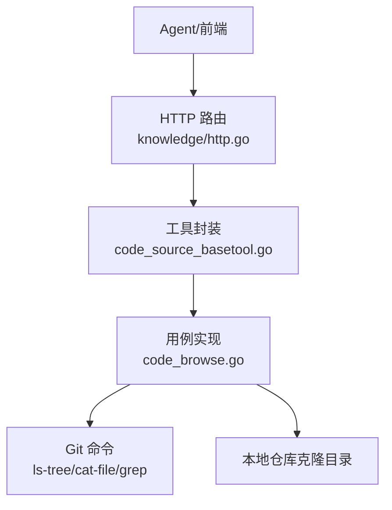
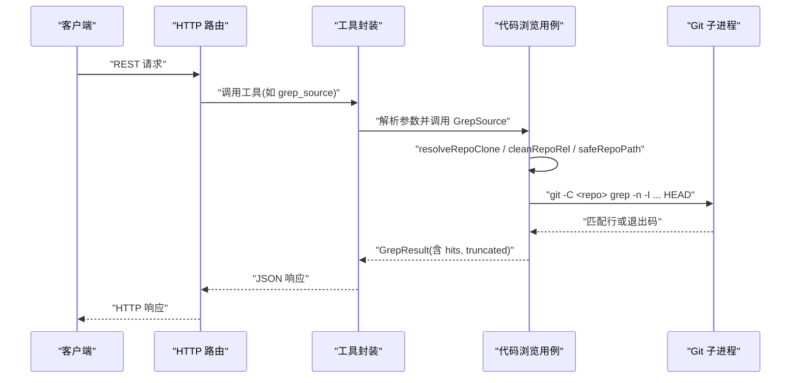
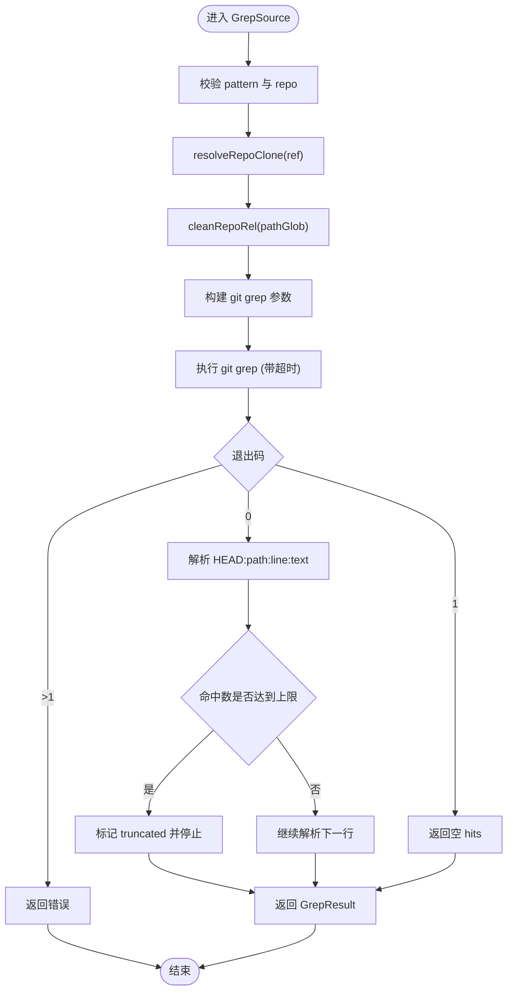
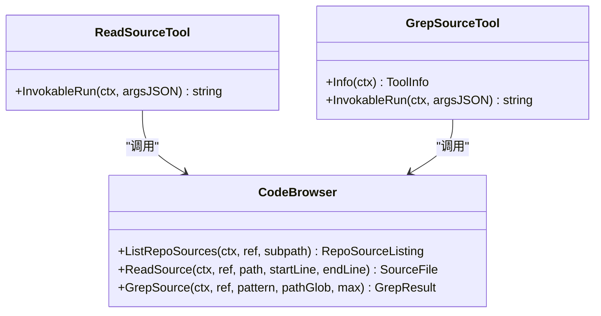
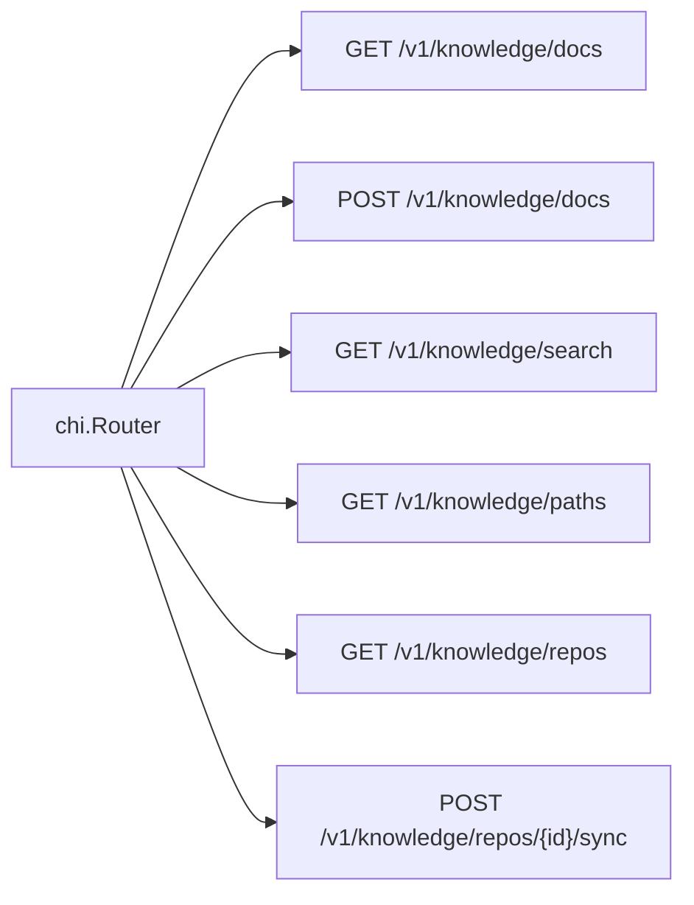
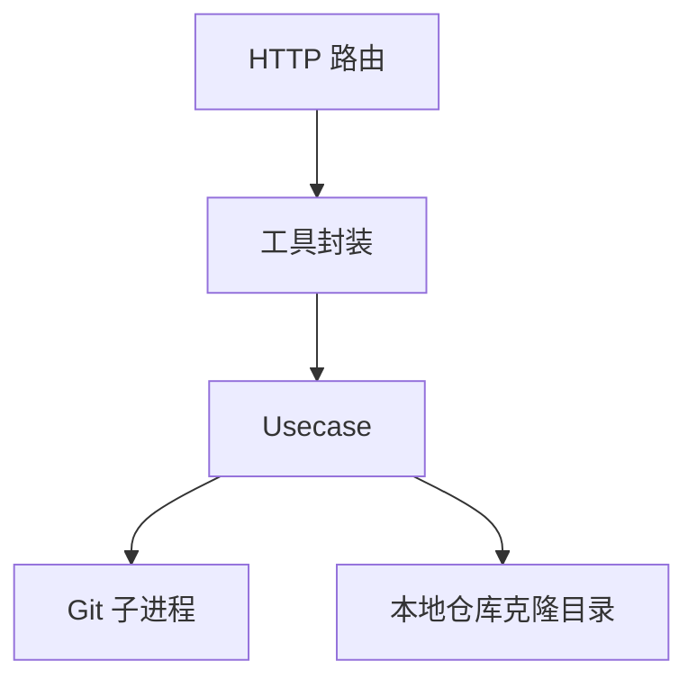

# 代码浏览与搜索

<cite>
**本文引用的文件**
- [internal/manager/biz/knowledge/code_browse.go](file://internal/manager/biz/knowledge/code_browse.go)
- [internal/manager/biz/knowledge/code_browse_test.go](file://internal/manager/biz/knowledge/code_browse_test.go)
- [internal/manager/biz/aiops/tools/code_source_basetool.go](file://internal/manager/biz/aiops/tools/code_source_basetool.go)
- [internal/manager/server/knowledge/http.go](file://internal/manager/server/knowledge/http.go)
- [internal/manager/server/operatorrun/http.go](file://internal/manager/server/operatorrun/http.go)
- [web/src/api/webshell.ts](file://web/src/api/webshell.ts)
- [web/src/pages/DeviceShell.tsx](file://web/src/pages/DeviceShell.tsx)
</cite>

## 目录
1. [简介](#简介)
2. [项目结构](#项目结构)
3. [核心组件](#核心组件)
4. [架构总览](#架构总览)
5. [详细组件分析](#详细组件分析)
6. [依赖关系分析](#依赖关系分析)
7. [性能考量](#性能考量)
8. [故障排查指南](#故障排查指南)
9. [结论](#结论)
10. [附录](#附录)

## 简介
本技术文档聚焦“代码浏览与搜索”能力，覆盖仓库源码的只读访问、基于 Git 的索引与检索、符号定位与上下文读取、以及面向 Agent 的工具化集成。系统通过本地克隆的 Git 仓库进行安全沙箱化的源码浏览与 grep 搜索，避免将源码嵌入 RAG；同时提供 HTTP API 与工具接口，便于前端与智能体调用。

## 项目结构
- 业务层（biz）：实现代码浏览用例（Usecase），封装对 Git 命令的安全调用、路径校验、结果截断等。
- 工具层（tools）：将代码浏览能力暴露为可被 Agent 调用的工具（如 list_repo_sources、read_source、grep_source）。
- 服务层（server）：注册知识模块的 HTTP 路由，包括代码仓库列表、同步、文档管理等。
- 前端（web）：提供 WebSocket 终端能力（与代码浏览无直接耦合，但体现实时通信模式）。

**图示来源**
- [internal/manager/server/knowledge/http.go:109-130](file://internal/manager/server/knowledge/http.go#L109-L130)
- [internal/manager/biz/aiops/tools/code_source_basetool.go:139-223](file://internal/manager/biz/aiops/tools/code_source_basetool.go#L139-L223)
- [internal/manager/biz/knowledge/code_browse.go:194-391](file://internal/manager/biz/knowledge/code_browse.go#L194-L391)

**章节来源**
- [internal/manager/server/knowledge/http.go:109-130](file://internal/manager/server/knowledge/http.go#L109-L130)
- [internal/manager/biz/knowledge/code_browse.go:1-391](file://internal/manager/biz/knowledge/code_browse.go#L1-L391)

## 核心组件
- 代码浏览用例（Usecase）：提供 ListRepoSources、ReadSource、GrepSource 三个只读能力，严格限制在单个仓库克隆目录内，支持二进制检测、大小限制、超时控制与结果截断。
- 工具封装：将上述能力包装为 Agent 可调用的工具，定义参数 Schema 与描述，统一返回 JSON。
- HTTP 路由：注册知识相关 REST 端点，包含仓库管理、文档管理与搜索等。

**章节来源**
- [internal/manager/biz/knowledge/code_browse.go:29-82](file://internal/manager/biz/knowledge/code_browse.go#L29-L82)
- [internal/manager/biz/aiops/tools/code_source_basetool.go:139-223](file://internal/manager/biz/aiops/tools/code_source_basetool.go#L139-L223)
- [internal/manager/server/knowledge/http.go:109-130](file://internal/manager/server/knowledge/http.go#L109-L130)

## 架构总览
下图展示从请求到 Git 命令执行的完整链路，强调安全边界（路径清洗、子进程隔离、超时与输出限制）。

**图示来源**
- [internal/manager/server/knowledge/http.go:109-130](file://internal/manager/server/knowledge/http.go#L109-L130)
- [internal/manager/biz/aiops/tools/code_source_basetool.go:139-223](file://internal/manager/biz/aiops/tools/code_source_basetool.go#L139-L223)
- [internal/manager/biz/knowledge/code_browse.go:319-391](file://internal/manager/biz/knowledge/code_browse.go#L319-L391)

## 详细组件分析

### 代码浏览用例（Usecase）
- 仓库解析 resolveRepoClone：支持按 ID、精确 URL、唯一子串三种方式解析到已注册的仓库及其本地克隆目录；若未同步则报错。
- 路径安全：cleanRepoRel 与 safeRepoPath 防止路径穿越，确保操作限定在仓库根目录内。
- 二进制检测：looksBinary 基于前缀 NUL 字节判断，拒绝读取二进制文件。
- 只读访问：
  - ListRepoSources：使用 git ls-tree 列出单层目录，隐藏 .git，目录优先排序，条目数上限。
  - ReadSource：使用 git cat-file blob 读取 HEAD 中的文件内容，支持行窗口读取，限制最大文件大小。
  - GrepSource：使用 git grep 在 HEAD 上执行正则搜索，跳过二进制，支持 pathspec 过滤，命中数上限。
- 超时与截断：所有外部命令带超时；结果集可截断并标记 truncated。

**图示来源**
- [internal/manager/biz/knowledge/code_browse.go:319-391](file://internal/manager/biz/knowledge/code_browse.go#L319-L391)

**章节来源**
- [internal/manager/biz/knowledge/code_browse.go:84-192](file://internal/manager/biz/knowledge/code_browse.go#L84-L192)
- [internal/manager/biz/knowledge/code_browse.go:194-317](file://internal/manager/biz/knowledge/code_browse.go#L194-L317)
- [internal/manager/biz/knowledge/code_browse.go:319-391](file://internal/manager/biz/knowledge/code_browse.go#L319-L391)

### 工具封装（BaseTool）
- 工具名称与描述：list_repo_sources、read_source、grep_source，附带 WhenToUse 说明，指导 Agent 在运维/故障分析中如何串联调用。
- 参数 Schema：以 JSON Schema 形式声明必填字段与约束（如 max_results 范围）。
- 调用流程：解析 JSON 参数 → 调用 Usecase 对应方法 → 统一编码为 JSON 字符串返回。

**图示来源**
- [internal/manager/biz/aiops/tools/code_source_basetool.go:139-223](file://internal/manager/biz/aiops/tools/code_source_basetool.go#L139-L223)

**章节来源**
- [internal/manager/biz/aiops/tools/code_source_basetool.go:26-38](file://internal/manager/biz/aiops/tools/code_source_basetool.go#L26-L38)
- [internal/manager/biz/aiops/tools/code_source_basetool.go:139-223](file://internal/manager/biz/aiops/tools/code_source_basetool.go#L139-L223)

### HTTP 路由与 API
- 知识模块路由：注册文档 CRUD、搜索、路径枚举、仓库管理（创建、同步、删除）、内置 Vault 同步等端点。
- 代码仓库相关端点：/v1/knowledge/repos、/v1/knowledge/repos/{id}/sync、/v1/knowledge/vault/sync。
- 统一错误处理：writeErr 将内部错误映射为标准 HTTP 状态码与错误码（unauthorized、forbidden、not-found、invalid、internal）。

**图示来源**
- [internal/manager/server/knowledge/http.go:109-130](file://internal/manager/server/knowledge/http.go#L109-L130)
- [internal/manager/server/operatorrun/http.go:240-260](file://internal/manager/server/operatorrun/http.go#L240-L260)

**章节来源**
- [internal/manager/server/knowledge/http.go:109-130](file://internal/manager/server/knowledge/http.go#L109-L130)
- [internal/manager/server/operatorrun/http.go:210-260](file://internal/manager/server/operatorrun/http.go#L210-L260)

### 测试与行为验证
- 单元测试覆盖：
  - 列表：目录优先、隐藏 .git、按路径子串或 ID 解析仓库。
  - 读取：整文件与行窗口读取、二进制拒绝、路径穿越拒绝。
  - 搜索：正则匹配、pathspec 过滤、无匹配返回空而非错误。
  - 错误：未找到、未同步仓库等场景。

**章节来源**
- [internal/manager/biz/knowledge/code_browse_test.go:90-200](file://internal/manager/biz/knowledge/code_browse_test.go#L90-L200)

## 依赖关系分析
- 组件耦合：
  - 工具封装依赖 Usecase 接口（CodeBrowser），便于替换实现或仅启用部分能力。
  - Usecase 依赖 Git 子进程与本地仓库克隆目录，不直接操作文件系统以外的路径。
  - HTTP 路由仅负责编排与鉴权，不承载复杂逻辑。
- 外部依赖：
  - Git 命令（ls-tree、cat-file、grep）作为底层实现。
  - 标准库 context、os/exec、path/filepath 用于超时、子进程与安全路径处理。

**图示来源**
- [internal/manager/biz/aiops/tools/code_source_basetool.go:139-223](file://internal/manager/biz/aiops/tools/code_source_basetool.go#L139-L223)
- [internal/manager/biz/knowledge/code_browse.go:194-391](file://internal/manager/biz/knowledge/code_browse.go#L194-L391)
- [internal/manager/server/knowledge/http.go:109-130](file://internal/manager/server/knowledge/http.go#L109-L130)

**章节来源**
- [internal/manager/biz/knowledge/code_browse.go:12-27](file://internal/manager/biz/knowledge/code_browse.go#L12-L27)
- [internal/manager/biz/aiops/tools/code_source_basetool.go:139-223](file://internal/manager/biz/aiops/tools/code_source_basetool.go#L139-L223)

## 性能考量
- 超时控制：所有 Git 子进程调用设置固定超时，避免大仓库导致长时间阻塞。
- 结果限制：
  - 单次 read_source 最大 512 KiB，防止内存与 LLM 上下文溢出。
  - grep 命中最多 200 条，目录列举最多 500 项，均支持 truncated 标志。
- 二进制跳过：grep 使用 -I 跳过二进制；read_source 主动检测 NUL 字节拒绝二进制。
- 路径裁剪：通过 pathspec 缩小搜索范围，减少不必要扫描。

[本节为通用性能建议，无需特定文件引用]

## 故障排查指南
- 常见错误与定位：
  - 未找到仓库：检查仓库是否已注册且 clone 目录存在（已同步）。
  - 路径穿越：确认传入路径不含 ..，并通过 cleanRepoRel/safeRepoPath 校验。
  - 二进制文件：read_source 会拒绝二进制；如需查看，请改用其他工具。
  - 无匹配结果：git grep 退出码 1 表示无匹配，应视为正常空结果。
- 调试建议：
  - 打印子进程命令与参数，确认 HEAD 引用与 pathspec。
  - 检查超时配置与仓库规模，必要时调整 max 或 path_glob。
  - 使用测试用例复现问题，验证路径与权限。

**章节来源**
- [internal/manager/biz/knowledge/code_browse.go:84-192](file://internal/manager/biz/knowledge/code_browse.go#L84-L192)
- [internal/manager/biz/knowledge/code_browse_test.go:126-200](file://internal/manager/biz/knowledge/code_browse_test.go#L126-L200)

## 结论
该代码浏览与搜索能力以“只读、沙箱化、可限制”为核心设计原则，通过 Git 子进程完成安全的源码访问与检索，并以工具化方式向 Agent 开放。配合 HTTP 路由与统一错误处理，形成稳定可扩展的代码导航基础。未来可在保持安全边界的前提下，扩展更多语义化索引与交叉引用能力。

[本节为总结性内容，无需特定文件引用]

## 附录

### API 参考（知识模块）
- 文档管理
  - GET /v1/knowledge/docs — 列出文档
  - POST /v1/knowledge/docs — 创建文档
  - PATCH /v1/knowledge/docs/{id} — 更新文档
  - DELETE /v1/knowledge/docs/{id} — 删除文档
- 搜索与路径
  - GET /v1/knowledge/search?q=... — 搜索文档
  - GET /v1/knowledge/paths — 列出路径（文件夹计数）
- 仓库管理
  - GET /v1/knowledge/repos — 列出仓库
  - POST /v1/knowledge/repos — 创建仓库
  - POST /v1/knowledge/repos/{id}/sync — 同步仓库
  - DELETE /v1/knowledge/repos/{id} — 删除仓库
- 内置 Vault 同步
  - POST /v1/knowledge/vault/sync — 触发平台内容同步

**章节来源**
- [internal/manager/server/knowledge/http.go:109-130](file://internal/manager/server/knowledge/http.go#L109-L130)

### 实时通信示例（WebSocket）
- 前端通过 WebSocket 建立会话，并在首帧发送 ShellOpen；支持预检 GET 获取 HTTP 状态（如 429/503/403）。
- 服务端使用 gorilla 升级协议，子协议约定为 ongrid.shell.v1。

**章节来源**
- [web/src/api/webshell.ts:1-181](file://web/src/api/webshell.ts#L1-L181)
- [web/src/pages/DeviceShell.tsx:190-226](file://web/src/pages/DeviceShell.tsx#L190-L226)