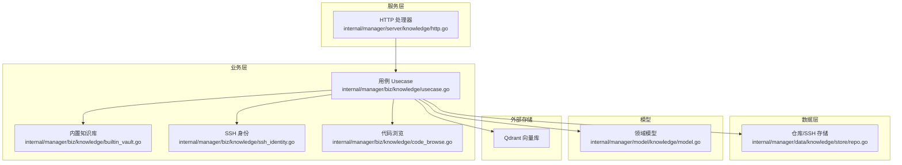
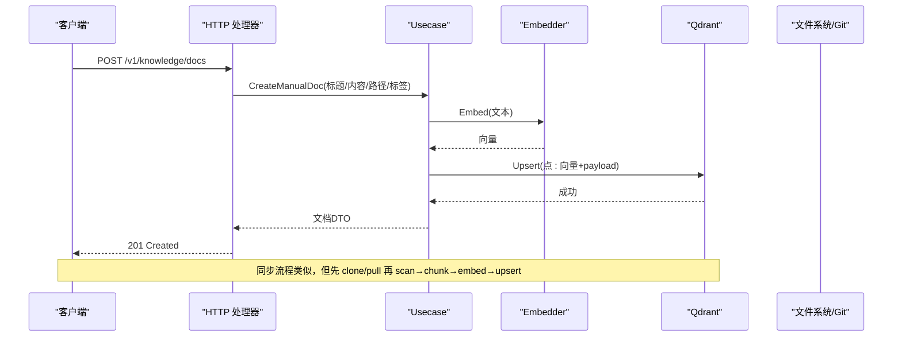
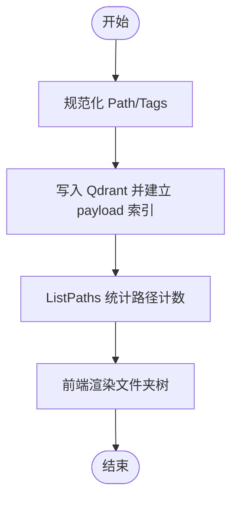
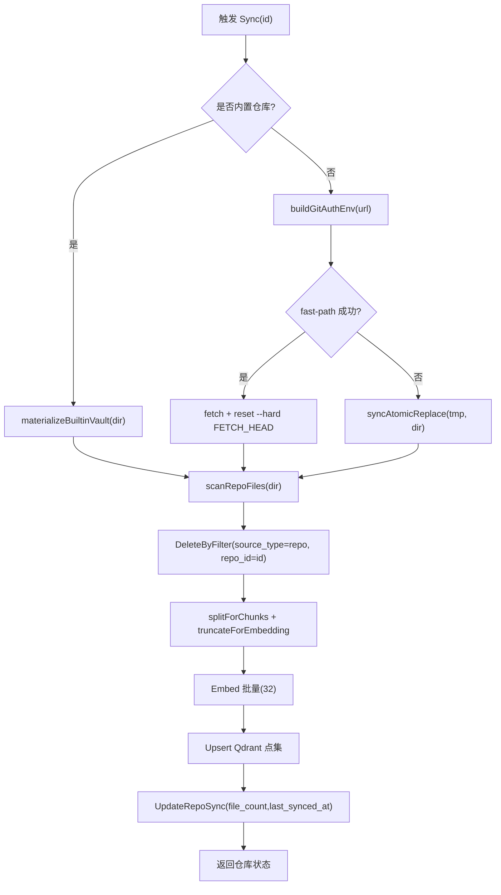
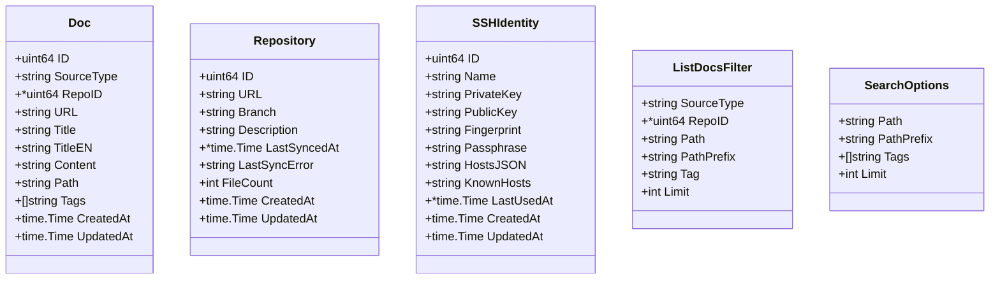
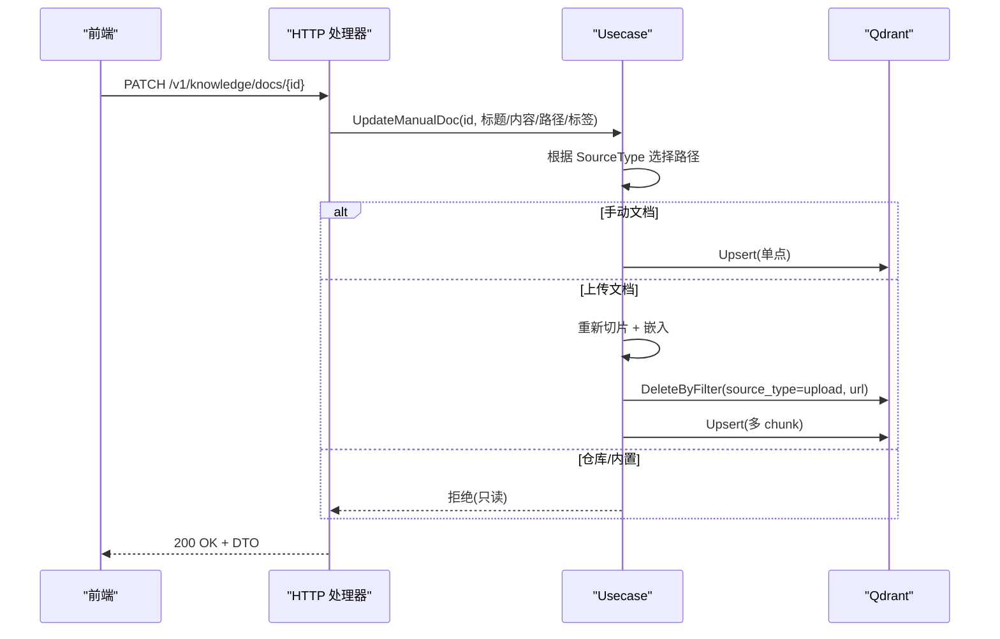
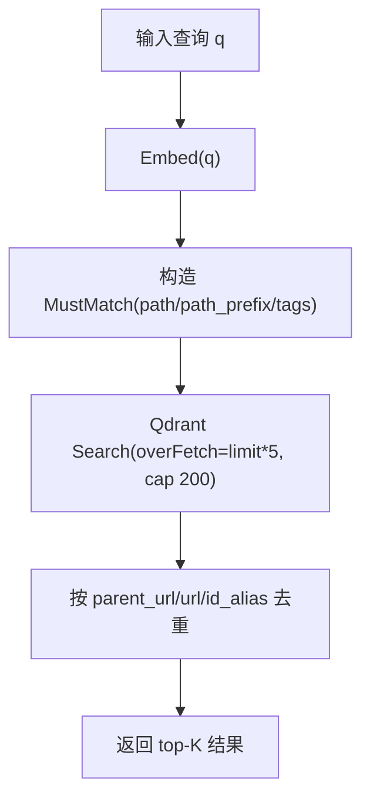
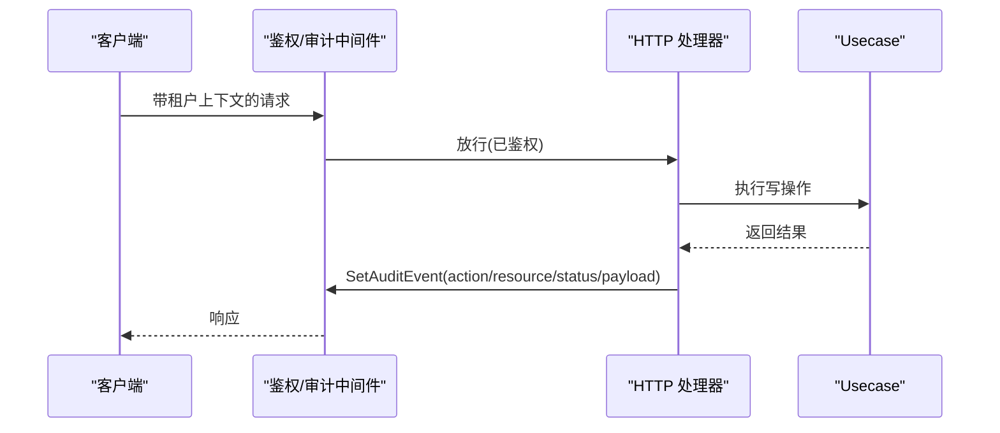
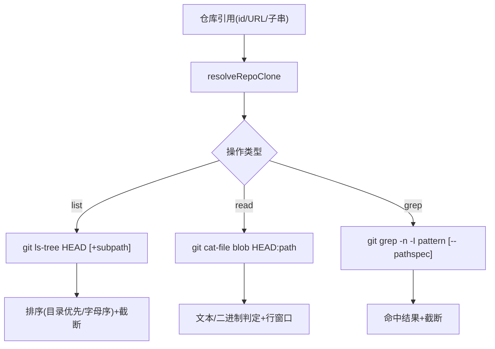
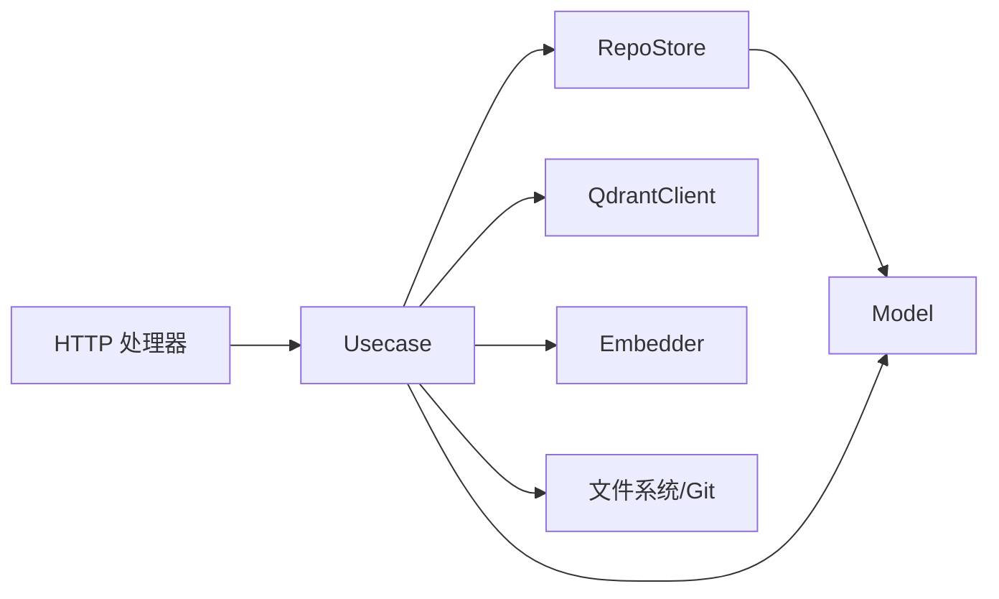

# 内置知识库

<cite>
**本文引用的文件**
- [usecase.go](file://internal/manager/biz/knowledge/usecase.go)
- [model.go](file://internal/manager/model/knowledge/model.go)
- [repo.go](file://internal/manager/data/knowledge/store/repo.go)
- [builtin_vault.go](file://internal/manager/biz/knowledge/builtin_vault.go)
- [http.go](file://internal/manager/server/knowledge/http.go)
- [ssh_identity.go](file://internal/manager/biz/knowledge/ssh_identity.go)
- [code_browse.go](file://internal/manager/biz/knowledge/code_browse.go)
</cite>

## 目录
1. [简介](#简介)
2. [项目结构](#项目结构)
3. [核心组件](#核心组件)
4. [架构总览](#架构总览)
5. [详细组件分析](#详细组件分析)
6. [依赖关系分析](#依赖关系分析)
7. [性能考量](#性能考量)
8. [故障排查指南](#故障排查指南)
9. [结论](#结论)
10. [附录](#附录)

## 简介
本技术文档面向内置知识库系统，覆盖预定义知识内容的组织结构、版本控制与同步机制、元数据模型、创建/编辑/维护流程、搜索与检索优化、权限控制与审计日志等。系统以“手动录入 + 组织上传 + Git 仓库同步 + 平台内置知识库”四种来源统一索引到向量数据库（Qdrant），并提供全文语义检索、路径/标签过滤、代码浏览与 grep 能力，同时通过 HTTP API 暴露完整 CRUD 与同步接口。

## 项目结构
知识库相关代码主要位于 manager 层的 biz、data、model、server 四个层次：
- model：领域模型（仓库、SSH 身份、文档、过滤器、搜索结果）
- data：轻量关系型存储（仅保存仓库注册与 SSH 身份信息；文档内容不持久化在 MySQL）
- biz：业务用例（切片、嵌入、上载、同步、搜索、删除、移动、代码浏览）
- server：HTTP 路由与请求处理（鉴权、审计事件注入、DTO 转换）

**图表来源**
- [http.go:110-137](file://internal/manager/server/knowledge/http.go#L110-L137)
- [usecase.go:96-170](file://internal/manager/biz/knowledge/usecase.go#L96-L170)
- [repo.go:20-30](file://internal/manager/data/knowledge/store/repo.go#L20-L30)
- [model.go:23-162](file://internal/manager/model/knowledge/model.go#L23-L162)

**章节来源**
- [http.go:110-137](file://internal/manager/server/knowledge/http.go#L110-L137)
- [usecase.go:96-170](file://internal/manager/biz/knowledge/usecase.go#L96-L170)
- [repo.go:20-30](file://internal/manager/data/knowledge/store/repo.go#L20-L30)
- [model.go:23-162](file://internal/manager/model/knowledge/model.go#L23-L162)

## 核心组件
- 用例 Usecase：封装文档的创建、更新、移动、删除、列表、搜索、Git 仓库同步、内置知识库同步、上传文件处理、切片与嵌入、去重与聚合。
- 模型 Model：定义 Repository、SSHIdentity、Doc、ListDocsFilter、SearchOptions、SearchHit 等数据结构。
- 存储 Store：管理 knowledge_repos、ssh_identities 表；文档本体不落地 MySQL，只存在于 Qdrant。
- HTTP Handler：提供 /v1/knowledge/* 路由，负责参数解析、鉴权、审计事件注入、DTO 序列化。
- 内置知识库 Vault：将平台预置 Markdown 资源内嵌至二进制，离线可用；支持云端优先、本地回退的同步策略。
- SSH 身份：支持私钥导入或服务器生成 ed25519 密钥对，按主机模式匹配用于 Git 克隆认证。
- 代码浏览：基于 git plumbing 提供只读的文件浏览、源码读取、grep 搜索，限制大小与超时，防止越界访问。

**章节来源**
- [usecase.go:173-824](file://internal/manager/biz/knowledge/usecase.go#L173-L824)
- [model.go:23-162](file://internal/manager/model/knowledge/model.go#L23-L162)
- [repo.go:20-169](file://internal/manager/data/knowledge/store/repo.go#L20-L169)
- [http.go:110-613](file://internal/manager/server/knowledge/http.go#L110-L613)
- [builtin_vault.go:12-110](file://internal/manager/biz/knowledge/builtin_vault.go#L12-L110)
- [ssh_identity.go:46-382](file://internal/manager/biz/knowledge/ssh_identity.go#L46-L382)
- [code_browse.go:29-391](file://internal/manager/biz/knowledge/code_browse.go#L29-L391)

## 架构总览
知识库采用“多源输入 → 切片/嵌入 → 向量检索”的统一管线：
- 手动文档：用户粘贴 Markdown，直接切片嵌入并写入 Qdrant。
- 组织上传：支持 .md/.txt/.pdf/.docx，先提取文本再切片嵌入。
- Git 仓库同步：clone/pull → 扫描可索引文件 → 切片嵌入 → 替换该仓库的 Qdrant 点集。
- 内置知识库：云端优先拉取，失败则使用内嵌快照；同样走切片嵌入管线。
- 搜索：将查询转为向量，结合 path/path_prefix/tags 等 payload 过滤进行余弦相似度检索，结果按父级去重返回。

**图表来源**
- [http.go:267-286](file://internal/manager/server/knowledge/http.go#L267-L286)
- [usecase.go:187-221](file://internal/manager/biz/knowledge/usecase.go#L187-L221)
- [usecase.go:924-1116](file://internal/manager/biz/knowledge/usecase.go#L924-L1116)

**章节来源**
- [http.go:267-286](file://internal/manager/server/knowledge/http.go#L267-L286)
- [usecase.go:187-221](file://internal/manager/biz/knowledge/usecase.go#L187-L221)
- [usecase.go:924-1116](file://internal/manager/biz/knowledge/usecase.go#L924-L1116)

## 详细组件分析

### 预定义知识内容与分类管理
- 分类体系：通过 Path（如“网络/DNS”）构建文件夹树，PathPrefix 支持前缀匹配；Tags 为自由标签，正交于 Path。
- 预置内容：内置知识库包含 concepts、diagnostics、reference、systems 等目录，涵盖概念文档、诊断案例、参考手册与系统知识。
- 展示与导航：ListPaths 统计各路径下的文档数，前端据此渲染树形目录。

**图表来源**
- [usecase.go:404-468](file://internal/manager/biz/knowledge/usecase.go#L404-L468)
- [usecase.go:705-745](file://internal/manager/biz/knowledge/usecase.go#L705-L745)
- [builtin_vault.go:12-110](file://internal/manager/biz/knowledge/builtin_vault.go#L12-L110)

**章节来源**
- [usecase.go:404-468](file://internal/manager/biz/knowledge/usecase.go#L404-L468)
- [usecase.go:705-745](file://internal/manager/biz/knowledge/usecase.go#L705-L745)
- [builtin_vault.go:12-110](file://internal/manager/biz/knowledge/builtin_vault.go#L12-L110)

### 版本控制与同步机制（Git 集成、增量更新、冲突解决）
- 仓库注册：URL 唯一键，支持分支与描述；首次同步 clone --depth=1，后续尝试 fast-path fetch+reset，失败回退到原子替换（临时目录 clone + rename）。
- 文件扫描：遍历 .md/.txt/.rst/.yaml/.yml/.toml/.json 等可索引文件，按标题与内容切片。
- 增量与幂等：每次同步先删除该仓库的旧点集，再批量 upsert；失败时保留旧状态或新状态，避免混合态。
- 冲突与错误：记录 last_sync_error 与 file_count；git 原始输出保存在错误信息中以便前端本地化提示。
- 内置知识库：云端优先（github.com/ongridio/vault），不可达时回退到内嵌快照；source_type=vault 独立于用户仓库。

**图表来源**
- [usecase.go:924-1116](file://internal/manager/biz/knowledge/usecase.go#L924-L1116)
- [builtin_vault.go:54-110](file://internal/manager/biz/knowledge/builtin_vault.go#L54-L110)

**章节来源**
- [usecase.go:924-1116](file://internal/manager/biz/knowledge/usecase.go#L924-L1116)
- [builtin_vault.go:54-110](file://internal/manager/biz/knowledge/builtin_vault.go#L54-L110)

### 元数据定义（标题、描述、标签、分类）
- Doc：包含 ID、SourceType、RepoID、URL、Title、TitleEN、Content、Path、Tags、时间戳。
- Repository：URL、Branch、Description、LastSyncedAt、LastSyncError、FileCount。
- SSHIdentity：Name、PrivateKey/PublicKey、Fingerprint、Passphrase、HostsJSON、KnownHosts、时间戳。
- 过滤器：ListDocsFilter 支持 source_type、repo_id、path、path_prefix、tag、limit；SearchOptions 支持 path/path_prefix/tags/limit。

**图表来源**
- [model.go:23-162](file://internal/manager/model/knowledge/model.go#L23-L162)

**章节来源**
- [model.go:23-162](file://internal/manager/model/knowledge/model.go#L23-L162)

### 创建、编辑与维护流程（Markdown 规范、审核与质量控制）
- 创建手动文档：校验标题与内容非空，截断标题长度，计算稳定 ID，切片嵌入后 upsert。
- 上传文档：支持 .md/.txt/.pdf/.docx，限制单文件大小（8 MiB），提取文本后切片嵌入；重复上传同名文件会幂等覆盖。
- 编辑文档：手动文档可直接更新标题/内容/路径/标签；上传文档重新切片嵌入；仓库/内置文档只读，需重新同步源。
- 移动文档：仅修改 Path；上传文档因 Path 存在于每个 chunk payload，需要重新嵌入。
- 删除文档：手动文档删除单点；上传文档按 url 删除所有 chunk；仓库/内置文档需注销源。

**图表来源**
- [http.go:364-387](file://internal/manager/server/knowledge/http.go#L364-L387)
- [usecase.go:353-402](file://internal/manager/biz/knowledge/usecase.go#L353-L402)
- [usecase.go:270-340](file://internal/manager/biz/knowledge/usecase.go#L270-L340)

**章节来源**
- [http.go:364-387](file://internal/manager/server/knowledge/http.go#L364-L387)
- [usecase.go:353-402](file://internal/manager/biz/knowledge/usecase.go#L353-L402)
- [usecase.go:270-340](file://internal/manager/biz/knowledge/usecase.go#L270-L340)

### 搜索与检索优化（全文索引、关键词匹配、语义搜索）
- 语义搜索：将查询文本嵌入为向量，使用 Qdrant 余弦相似度检索；支持 path/path_prefix/tags 作为服务端过滤条件，提升精度。
- 去重策略：对同一文档的多 chunk 结果按 parent_url/url/id_alias 去重，仅返回最高分片段。
- 列表与分页：ListDocs 使用 Scroll 并放大 limit 补偿 chunk 去重后的丢失；dedupeByIDAlias 优先 head chunk。
- 路径与标签索引：为 source_type、repo_id、path、path_prefixes、tags 建立 keyword 索引，避免全表扫描。

**图表来源**
- [usecase.go:747-824](file://internal/manager/biz/knowledge/usecase.go#L747-L824)
- [usecase.go:470-564](file://internal/manager/biz/knowledge/usecase.go#L470-L564)
- [usecase.go:151-170](file://internal/manager/biz/knowledge/usecase.go#L151-L170)

**章节来源**
- [usecase.go:747-824](file://internal/manager/biz/knowledge/usecase.go#L747-L824)
- [usecase.go:470-564](file://internal/manager/biz/knowledge/usecase.go#L470-L564)
- [usecase.go:151-170](file://internal/manager/biz/knowledge/usecase.go#L151-L170)

### 权限控制与访问管理、审计日志与变更追踪
- 鉴权：HTTP 路由通过 tenantctx 中间件进行租户上下文鉴权；写操作额外通过 casbin 中间件（write/delete 动作）进行授权。
- 审计：创建/同步/删除仓库等操作通过 auditmw.SetAuditEvent 注入审计事件，记录 action、resource_type、resource_id/name、status、payload。
- 变更追踪：仓库同步记录 last_synced_at、last_sync_error、file_count；删除仓库时记录被删 URL 与文件数，便于回溯。

**图表来源**
- [http.go:93-137](file://internal/manager/server/knowledge/http.go#L93-L137)
- [http.go:512-543](file://internal/manager/server/knowledge/http.go#L512-L543)
- [http.go:547-584](file://internal/manager/server/knowledge/http.go#L547-L584)

**章节来源**
- [http.go:93-137](file://internal/manager/server/knowledge/http.go#L93-L137)
- [http.go:512-543](file://internal/manager/server/knowledge/http.go#L512-L543)
- [http.go:547-584](file://internal/manager/server/knowledge/http.go#L547-L584)

### 代码浏览与源码检索（Agent 辅助）
- 列出源码：ListRepoSources 通过 git ls-tree 列出仓库一级目录，隐藏 .git，限制条目数量。
- 读取源码：ReadSource 通过 git cat-file blob 读取文件文本，限制最大字节数，拒绝二进制文件，支持行窗口。
- 搜索源码：GrepSource 通过 git grep 在 HEAD 树上搜索，限制命中数与超时，支持路径过滤。

**图表来源**
- [code_browse.go:84-145](file://internal/manager/biz/knowledge/code_browse.go#L84-L145)
- [code_browse.go:194-258](file://internal/manager/biz/knowledge/code_browse.go#L194-L258)
- [code_browse.go:260-317](file://internal/manager/biz/knowledge/code_browse.go#L260-L317)
- [code_browse.go:319-391](file://internal/manager/biz/knowledge/code_browse.go#L319-L391)

**章节来源**
- [code_browse.go:84-145](file://internal/manager/biz/knowledge/code_browse.go#L84-L145)
- [code_browse.go:194-258](file://internal/manager/biz/knowledge/code_browse.go#L194-L258)
- [code_browse.go:260-317](file://internal/manager/biz/knowledge/code_browse.go#L260-L317)
- [code_browse.go:319-391](file://internal/manager/biz/knowledge/code_browse.go#L319-L391)

## 依赖关系分析
- 耦合度：HTTP 层仅依赖 Service 接口；biz 层通过抽象接口与 Qdrant、Embedder、RepoStore 解耦，便于测试注入。
- 外部依赖：Qdrant（向量检索）、Embedder（向量化）、Git（仓库同步与代码浏览）、文件系统（克隆与内嵌资源）。
- 循环依赖：无；biz 层不反向依赖 server 层，store 仅依赖 model。

**图表来源**
- [http.go:42-72](file://internal/manager/server/knowledge/http.go#L42-L72)
- [usecase.go:43-75](file://internal/manager/biz/knowledge/usecase.go#L43-L75)
- [repo.go:24-30](file://internal/manager/data/knowledge/store/repo.go#L24-L30)
- [model.go:23-162](file://internal/manager/model/knowledge/model.go#L23-L162)

**章节来源**
- [http.go:42-72](file://internal/manager/server/knowledge/http.go#L42-L72)
- [usecase.go:43-75](file://internal/manager/biz/knowledge/usecase.go#L43-L75)
- [repo.go:24-30](file://internal/manager/data/knowledge/store/repo.go#L24-L30)
- [model.go:23-162](file://internal/manager/model/knowledge/model.go#L23-L162)

## 性能考量
- 切片与嵌入批处理：每批 32 条文本，降低单次请求负载与内存占用。
- 过取与去重：搜索时 overFetch 上限 200，随后按父级去重保证最终返回数量可控。
- 列表扩容：ListDocs 将底层 limit 放大至 8 倍（上限 10000）以补偿 chunk 去重带来的丢失。
- 路径前缀索引：path_prefixes 数组字段避免宽松分词导致的误匹配，提高过滤效率。
- 代码浏览限制：文件读取上限 512 KiB，grep 命中上限 200，命令超时 30 秒，防止大仓库拖慢系统。

[本节为通用指导，无需特定文件来源]

## 故障排查指南
- 未配置嵌入器：CreateManualDoc/UploadDoc/Search/Sync 在未配置 embedder 时返回“尚未接线”错误；需设置 ONGRID_EMBEDDING_API_KEY。
- 仓库同步失败：检查 last_sync_error 与 last_synced_at；确认 Git 认证（SSH 身份或 askpass）与网络可达性；必要时清理临时克隆目录。
- 内置知识库不可达：云端拉取失败自动回退到内嵌快照；若仍失败，检查 materialize 过程与磁盘空间。
- 上传失败：确认文件格式受支持且不超过 8 MiB；PDF/DOCX 需含文本层；重复上传同名文件会幂等覆盖。
- 搜索无结果：检查 path/path_prefix/tags 过滤是否过于严格；确认 Qdrant 集合与 payload 索引已创建。

**章节来源**
- [usecase.go:187-221](file://internal/manager/biz/knowledge/usecase.go#L187-L221)
- [usecase.go:924-1116](file://internal/manager/biz/knowledge/usecase.go#L924-L1116)
- [builtin_vault.go:118-155](file://internal/manager/biz/knowledge/builtin_vault.go#L118-L155)
- [http.go:288-354](file://internal/manager/server/knowledge/http.go#L288-L354)
- [usecase.go:151-170](file://internal/manager/biz/knowledge/usecase.go#L151-L170)

## 结论
内置知识库系统通过统一的切片/嵌入/检索管线整合了多种知识来源，具备完善的分类与元数据模型、健壮的 Git 同步机制、高效的语义搜索、安全的代码浏览能力以及完整的权限与审计保障。系统在离线场景下通过内嵌知识库确保可用性，在生产环境中通过云端优先策略保持内容时效性。建议持续优化嵌入质量、索引策略与检索体验，并完善密钥加密与更细粒度的访问控制。

[本节为总结性内容，无需特定文件来源]

## 附录
- API 概览（部分）：
  - GET /v1/knowledge/docs：列出文档（支持 source_type、repo_id、path、path_prefix、tag、limit）
  - GET /v1/knowledge/docs/{id}：获取单个文档
  - POST /v1/knowledge/docs：创建手动文档
  - PATCH /v1/knowledge/docs/{id}：更新手动文档
  - DELETE /v1/knowledge/docs/{id}：删除文档
  - GET /v1/knowledge/search：语义搜索（q、limit、path、path_prefix、tag）
  - GET /v1/knowledge/repos：列出仓库
  - POST /v1/knowledge/repos：注册仓库
  - POST /v1/knowledge/repos/{id}/sync：触发同步
  - DELETE /v1/knowledge/repos/{id}：注销仓库
  - POST /v1/knowledge/vault/sync：同步内置知识库
  - /v1/knowledge/upload：上传文件（.md/.txt/.pdf/.docx）
  - /v1/knowledge/ssh-identities：SSH 身份管理

**章节来源**
- [http.go:110-137](file://internal/manager/server/knowledge/http.go#L110-L137)
- [http.go:214-256](file://internal/manager/server/knowledge/http.go#L214-L256)
- [http.go:425-456](file://internal/manager/server/knowledge/http.go#L425-L456)
- [http.go:480-584](file://internal/manager/server/knowledge/http.go#L480-L584)