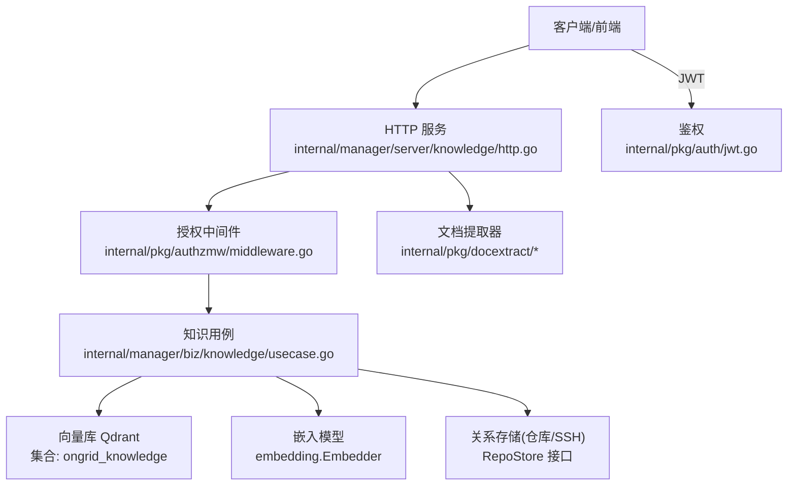
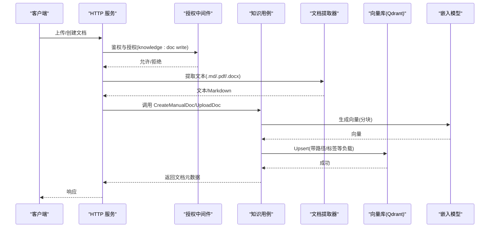
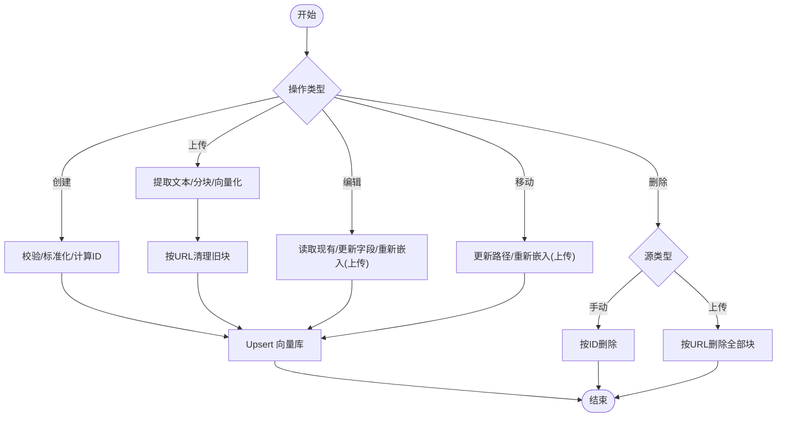
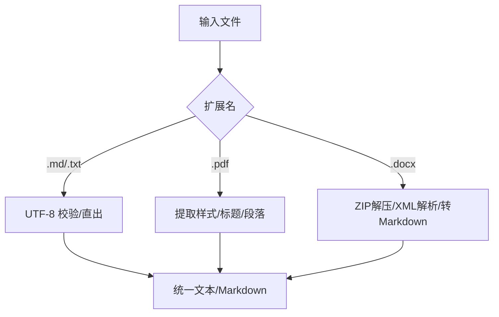
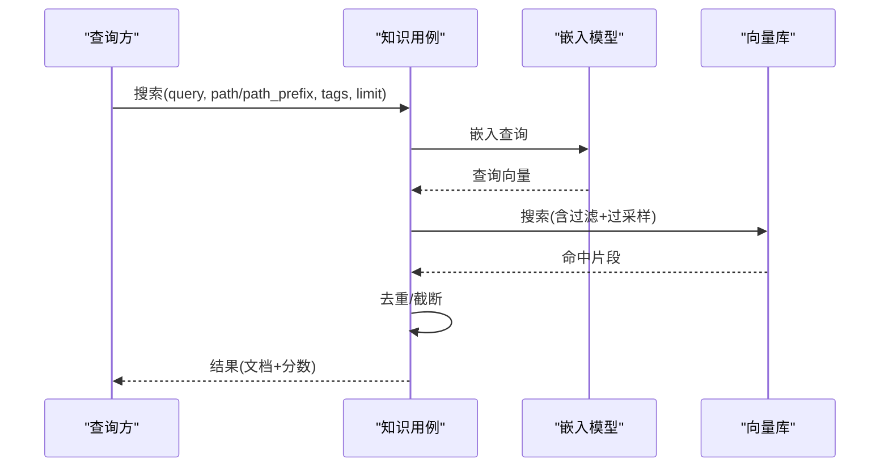
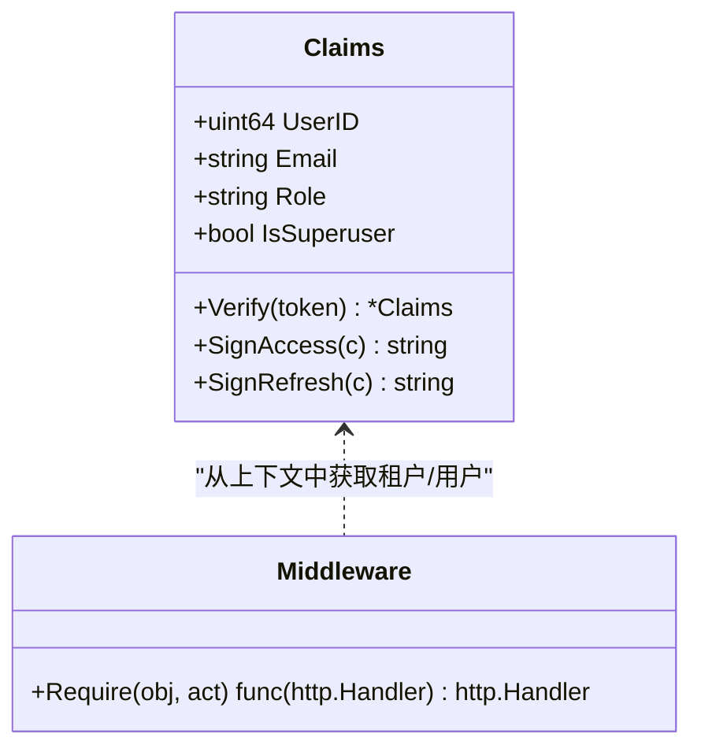
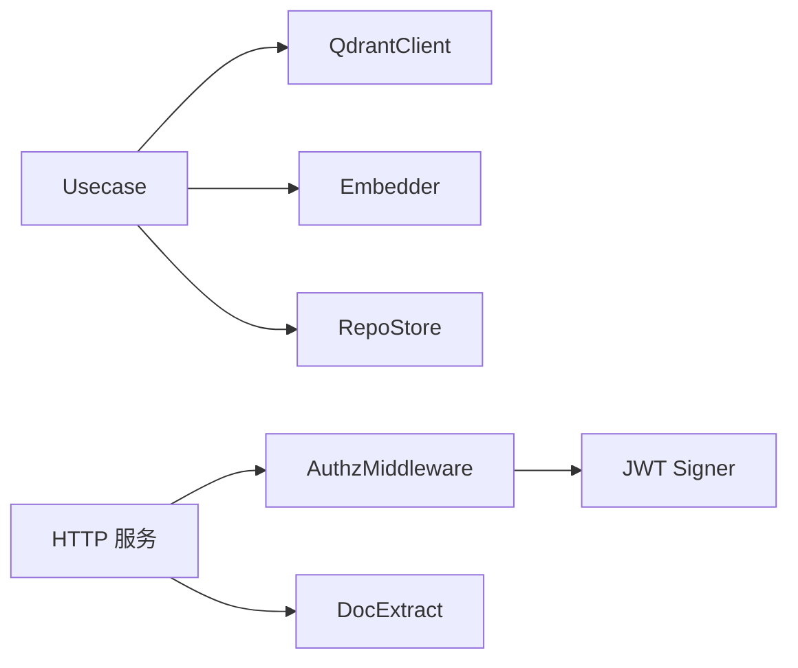

# 知识内容管理

<cite>
**本文引用的文件**
- [internal/manager/biz/knowledge/usecase.go](file://internal/manager/biz/knowledge/usecase.go)
- [internal/manager/model/knowledge/model.go](file://internal/manager/model/knowledge/model.go)
- [internal/pkg/docextract/extract.go](file://internal/pkg/docextract/extract.go)
- [internal/pkg/docextract/pdf2md.go](file://internal/pkg/docextract/pdf2md.go)
- [internal/pkg/docextract/docx2md.go](file://internal/pkg/docextract/docx2md.go)
- [internal/pkg/auth/jwt.go](file://internal/pkg/auth/jwt.go)
- [internal/pkg/authzmw/middleware.go](file://internal/pkg/authzmw/middleware.go)
- [internal/manager/server/knowledge/http.go](file://internal/manager/server/knowledge/http.go)
</cite>

## 目录
1. [简介](#简介)
2. [项目结构](#项目结构)
3. [核心组件](#核心组件)
4. [架构总览](#架构总览)
5. [详细组件分析](#详细组件分析)
6. [依赖关系分析](#依赖关系分析)
7. [性能考量](#性能考量)
8. [故障排查指南](#故障排查指南)
9. [结论](#结论)
10. [附录](#附录)

## 简介
本技术文档围绕“知识内容管理系统”展开，聚焦以下能力：
- 文档生命周期管理：创建、编辑、版本控制（基于向量库的幂等上载与重分块）、删除。
- 文档格式支持：Markdown、PDF、DOCX 的解析与转换为 Markdown，进入 RAG 索引流程。
- 元数据管理：标题、描述、标签、分类（路径）与作者信息（通过权限上下文承载）。
- 文档组织：文件夹结构（路径前缀体系）、标签体系、搜索过滤（路径、标签、语义检索）。
- 权限控制：读写权限、访问控制、审计日志（鉴权中间件与对象动作模型）。
- 协作功能：多人编辑（幂等重入）、评论反馈（可扩展至外部系统）、版本合并（基于稳定 URL 的重分块覆盖）。
- 导出与分享：以 Markdown 文本输出、链接分享（URL 作为逻辑标识）。
- 质量评估：完整性检查（必填字段校验）、格式验证（编码、可提取文本）、内容审核（可扩展策略）。

## 项目结构
知识内容管理相关代码主要分布在以下模块：
- 业务用例层：knowledge usecase，负责文档 CRUD、同步、搜索、路径与标签处理。
- 数据模型层：knowledge model，定义仓库、SSH 身份、文档、过滤器与搜索结果。
- 文档提取层：docextract，实现 PDF/DOCX/Markdown 到纯文本或 Markdown 的转换。
- 权限与鉴权：auth 与 authzmw，提供 JWT 签发/校验与基于对象的授权中间件。
- HTTP 服务层：server/knowledge，暴露 REST API 并接入鉴权与业务用例。

**图表来源**
- [internal/manager/server/knowledge/http.go](file://internal/manager/server/knowledge/http.go)
- [internal/pkg/authzmw/middleware.go](file://internal/pkg/authzmw/middleware.go)
- [internal/manager/biz/knowledge/usecase.go](file://internal/manager/biz/knowledge/usecase.go)
- [internal/pkg/docextract/extract.go](file://internal/pkg/docextract/extract.go)
- [internal/pkg/auth/jwt.go](file://internal/pkg/auth/jwt.go)

**章节来源**
- [internal/manager/biz/knowledge/usecase.go:1-171](file://internal/manager/biz/knowledge/usecase.go#L1-L171)
- [internal/manager/model/knowledge/model.go:1-162](file://internal/manager/model/knowledge/model.go#L1-L162)
- [internal/pkg/docextract/extract.go:1-132](file://internal/pkg/docextract/extract.go#L1-L132)
- [internal/pkg/auth/jwt.go:1-100](file://internal/pkg/auth/jwt.go#L1-L100)
- [internal/pkg/authzmw/middleware.go:1-98](file://internal/pkg/authzmw/middleware.go#L1-L98)

## 核心组件
- 知识用例（Usecase）
  - 职责：文档创建/上传/更新/移动/删除、列表与搜索、路径统计、仓库同步入口（由上层调度）。
  - 关键特性：对上传文件进行分块、向量化、幂等上载；维护路径前缀与标签索引；按 source_type 隔离 vault/repo/upload/manual。
- 文档提取器（docextract）
  - 职责：将 .md/.txt/.pdf/.docx 转为可索引文本；PDF 尝试保留标题层级；DOCX 解析段落、表格、编号与样式。
- 数据模型（model）
  - 职责：定义 Repository、SSHIdentity、Doc、ListDocsFilter、SearchOptions、SearchHit 等。
- 鉴权与授权（auth, authzmw）
  - 职责：JWT 签发/校验；基于对象与动作的授权（如 knowledge:doc read/write），支持超级用户短路。

**章节来源**
- [internal/manager/biz/knowledge/usecase.go:173-800](file://internal/manager/biz/knowledge/usecase.go#L173-L800)
- [internal/pkg/docextract/extract.go:21-46](file://internal/pkg/docextract/extract.go#L21-L46)
- [internal/manager/model/knowledge/model.go:23-162](file://internal/manager/model/knowledge/model.go#L23-L162)
- [internal/pkg/auth/jwt.go:16-99](file://internal/pkg/auth/jwt.go#L16-L99)
- [internal/pkg/authzmw/middleware.go:11-24](file://internal/pkg/authzmw/middleware.go#L11-L24)

## 架构总览
系统采用“API 层 + 鉴权中间件 + 业务用例 + 存储/向量库”的分层架构。文档在上传后进入提取与分块流程，随后向量化并写入向量库；查询时先嵌入查询语句，再结合路径/标签等过滤条件进行相似度检索。

**图表来源**
- [internal/manager/server/knowledge/http.go](file://internal/manager/server/knowledge/http.go)
- [internal/pkg/authzmw/middleware.go:57-97](file://internal/pkg/authzmw/middleware.go#L57-L97)
- [internal/manager/biz/knowledge/usecase.go:187-339](file://internal/manager/biz/knowledge/usecase.go#L187-L339)
- [internal/pkg/docextract/extract.go:30-46](file://internal/pkg/docextract/extract.go#L30-L46)

## 详细组件分析

### 文档生命周期管理
- 创建（手动粘贴）
  - 输入：标题、可选英文标题、内容、可选 URL、路径、标签。
  - 行为：校验必填项与长度限制，计算稳定 ID，写入向量库（单点）。
  - 关键点：未配置嵌入器时返回特定错误；路径标准化与标签去重。
- 上传（文件）
  - 输入：文件名、可选标题、内容、路径、标签。
  - 行为：根据扩展名选择提取策略；分块、向量化、批量 upsert；按 URL 幂等清理旧版本。
  - 关键点：upload 源类型隔离；头块携带标题；支持 .md/.markdown/.docx/.pdf。
- 编辑（手动/上传）
  - 手动：直接覆盖单点负载。
  - 上传：重新分块与嵌入，保持 CreatedAt 不变，更新 UpdatedAt。
- 移动（路径变更）
  - 仅修改路径；上传类文档需重新嵌入以更新每块的 path。
- 删除
  - 手动：按点 ID 删除。
  - 上传：按 URL 过滤删除所有块。
  - 只读源（vault/repo）：不允许单独删除，需注销/重新同步。

**图表来源**
- [internal/manager/biz/knowledge/usecase.go:187-402](file://internal/manager/biz/knowledge/usecase.go#L187-L402)
- [internal/manager/biz/knowledge/usecase.go:626-689](file://internal/manager/biz/knowledge/usecase.go#L626-L689)

**章节来源**
- [internal/manager/biz/knowledge/usecase.go:187-402](file://internal/manager/biz/knowledge/usecase.go#L187-L402)
- [internal/manager/biz/knowledge/usecase.go:626-689](file://internal/manager/biz/knowledge/usecase.go#L626-L689)

### 文档格式支持与转换
- 支持格式：.md/.markdown/.txt/.text/.pdf/.docx。
- 提取策略：
  - 文本类：UTF-8 校验后直接作为内容。
  - PDF：优先使用带样式的文本推断标题层级；回退为纯文本；无文本时提示需要 OCR。
  - DOCX：解压 ZIP，解析 XML，提取段落、表格、编号、样式，输出 Markdown；图片不提取。
- 限制与健壮性：
  - PDF/DOCX 空内容会返回友好错误。
  - DOCX 对 XML 部分大小进行限制，防止炸弹攻击。

**图表来源**
- [internal/pkg/docextract/extract.go:21-46](file://internal/pkg/docextract/extract.go#L21-L46)
- [internal/pkg/docextract/pdf2md.go:15-72](file://internal/pkg/docextract/pdf2md.go#L15-L72)
- [internal/pkg/docextract/docx2md.go:652-716](file://internal/pkg/docextract/docx2md.go#L652-L716)

**章节来源**
- [internal/pkg/docextract/extract.go:21-46](file://internal/pkg/docextract/extract.go#L21-L46)
- [internal/pkg/docextract/pdf2md.go:15-72](file://internal/pkg/docextract/pdf2md.go#L15-L72)
- [internal/pkg/docextract/docx2md.go:652-716](file://internal/pkg/docextract/docx2md.go#L652-L716)

### 文档元数据管理
- 字段说明：
  - 标题/英文标题：用于展示与回退；长度限制。
  - 内容：分块前的原始文本。
  - 路径：以“/”分隔的层级面包屑，支持根为空。
  - 标签：自由多标签，自动去重与空白清理。
  - 来源类型：manual/repo/url/vault/upload，决定可写性与同步范围。
  - 时间戳：创建与更新时间。
- 索引与过滤：
  - 路径前缀数组用于精确匹配文件夹树。
  - 标签数组用于包含匹配。
  - 列表与搜索均支持服务端过滤，提高精度。

**章节来源**
- [internal/manager/model/knowledge/model.go:90-162](file://internal/manager/model/knowledge/model.go#L90-L162)
- [internal/manager/biz/knowledge/usecase.go:404-468](file://internal/manager/biz/knowledge/usecase.go#L404-L468)
- [internal/manager/biz/knowledge/usecase.go:470-523](file://internal/manager/biz/knowledge/usecase.go#L470-L523)

### 文档组织与搜索过滤
- 文件夹结构：
  - 通过路径与路径前缀构建 SPA 树视图。
  - 列表路径统计忽略分块重复，确保每个逻辑文档计数一次。
- 搜索：
  - 语义检索：查询嵌入后与向量库余弦相似度排序。
  - 过滤：路径、路径前缀、标签在服务端应用后再打分。
  - 去重：按父级 URL 或 id_alias 去重，保证结果唯一。

**图表来源**
- [internal/manager/biz/knowledge/usecase.go:747-800](file://internal/manager/biz/knowledge/usecase.go#L747-L800)

**章节来源**
- [internal/manager/biz/knowledge/usecase.go:719-745](file://internal/manager/biz/knowledge/usecase.go#L719-L745)
- [internal/manager/biz/knowledge/usecase.go:747-800](file://internal/manager/biz/knowledge/usecase.go#L747-L800)

### 权限控制与审计
- 鉴权：
  - JWT 签发与校验，载荷包含用户 ID、邮箱、角色、是否超级用户。
- 授权：
  - 中间件要求认证上下文；超级用户短路放行。
  - 对象-动作模型：knowledge:doc 读写、knowledge:repo 注册等。
  - 未授权返回 401/403，并记录审计日志。
- 审计：
  - 中间件在拒绝时记录用户、对象、动作等信息。

**图表来源**
- [internal/pkg/auth/jwt.go:16-99](file://internal/pkg/auth/jwt.go#L16-L99)
- [internal/pkg/authzmw/middleware.go:35-97](file://internal/pkg/authzmw/middleware.go#L35-L97)

**章节来源**
- [internal/pkg/auth/jwt.go:16-99](file://internal/pkg/auth/jwt.go#L16-L99)
- [internal/pkg/authzmw/middleware.go:57-97](file://internal/pkg/authzmw/middleware.go#L57-L97)

### 协作功能（多人编辑、评论、版本合并）
- 多人编辑：
  - 上传类文档以 URL 为稳定标识，重传即幂等覆盖；先分块再清理旧块，避免脏数据。
- 评论反馈：
  - 当前代码未内建评论模块；可在 API 层扩展评论资源并通过鉴权中间件保护。
- 版本合并：
  - 基于“源类型+URL”的幂等上载实现覆盖式合并；对于 repo/vault 源，通过重新同步刷新。

**章节来源**
- [internal/manager/biz/knowledge/usecase.go:270-339](file://internal/manager/biz/knowledge/usecase.go#L270-L339)
- [internal/manager/biz/knowledge/usecase.go:353-402](file://internal/manager/biz/knowledge/usecase.go#L353-L402)

### 导出与分享
- 导出：
  - 文档内容以 Markdown 文本形式返回；上传类文档可通过 URL 再次下载/重导。
- 分享：
  - URL 作为逻辑标识，可用于链接分享；前端可据此渲染预览或跳转。

**章节来源**
- [internal/manager/model/knowledge/model.go:108-129](file://internal/manager/model/knowledge/model.go#L108-L129)
- [internal/manager/biz/knowledge/usecase.go:223-268](file://internal/manager/biz/knowledge/usecase.go#L223-L268)

### 质量评估（完整性、格式验证、内容审核）
- 完整性检查：
  - 标题与内容必填；长度限制；空内容拒绝。
- 格式验证：
  - UTF-8 校验；PDF/DOCX 无文本时返回明确错误；DOCX XML 大小限制。
- 内容审核：
  - 当前未内置审核策略；可在业务层插入审核钩子（例如在 upsert 前调用审核服务）。

**章节来源**
- [internal/manager/biz/knowledge/usecase.go:187-221](file://internal/manager/biz/knowledge/usecase.go#L187-L221)
- [internal/pkg/docextract/extract.go:30-46](file://internal/pkg/docextract/extract.go#L30-L46)
- [internal/pkg/docextract/pdf2md.go:74-88](file://internal/pkg/docextract/pdf2md.go#L74-L88)
- [internal/pkg/docextract/docx2md.go:622-641](file://internal/pkg/docextract/docx2md.go#L622-L641)

## 依赖关系分析
- 用例依赖：
  - 向量库客户端（QdrantClient）：集合确保、负载索引、Upsert、DeleteByFilter、Search、Scroll。
  - 嵌入模型（Embedder）：生成向量维度与嵌入。
  - 关系存储（RepoStore）：仓库与 SSH 身份 CRUD。
- 提取器依赖：
  - PDF：使用第三方库提取文本与样式。
  - DOCX：标准库 zip/xml 解析 OOXML。
- 鉴权依赖：
  - JWT 签名与校验；中间件注入租户上下文与授权判断。

**图表来源**
- [internal/manager/biz/knowledge/usecase.go:43-75](file://internal/manager/biz/knowledge/usecase.go#L43-L75)
- [internal/pkg/docextract/extract.go:8-19](file://internal/pkg/docextract/extract.go#L8-L19)
- [internal/pkg/auth/jwt.go:32-99](file://internal/pkg/auth/jwt.go#L32-L99)
- [internal/pkg/authzmw/middleware.go:43-97](file://internal/pkg/authzmw/middleware.go#L43-L97)

**章节来源**
- [internal/manager/biz/knowledge/usecase.go:43-75](file://internal/manager/biz/knowledge/usecase.go#L43-L75)
- [internal/pkg/docextract/extract.go:8-19](file://internal/pkg/docextract/extract.go#L8-L19)
- [internal/pkg/auth/jwt.go:32-99](file://internal/pkg/auth/jwt.go#L32-L99)
- [internal/pkg/authzmw/middleware.go:43-97](file://internal/pkg/authzmw/middleware.go#L43-L97)

## 性能考量
- 索引优化：
  - 为 source_type、repo_id、path、path_prefixes、tags 建立负载索引，避免全表扫描。
- 查询效率：
  - 列表与搜索采用过采样与去重策略，平衡精度与延迟。
- 分块与批处理：
  - 上传文档按批次嵌入与 upsert，降低单次请求压力。
- 安全限制：
  - DOCX XML 部分大小限制，防止内存膨胀。

**章节来源**
- [internal/manager/biz/knowledge/usecase.go:151-169](file://internal/manager/biz/knowledge/usecase.go#L151-L169)
- [internal/manager/biz/knowledge/usecase.go:506-523](file://internal/manager/biz/knowledge/usecase.go#L506-L523)
- [internal/manager/biz/knowledge/usecase.go:782-792](file://internal/manager/biz/knowledge/usecase.go#L782-L792)
- [internal/pkg/docextract/docx2md.go:132-135](file://internal/pkg/docextract/docx2md.go#L132-L135)

## 故障排查指南
- 常见错误与定位：
  - 未配置嵌入器：创建/上传/移动/搜索时报错，需设置嵌入 API Key。
  - 无效 UTF-8：文本类文件非 UTF-8 导致提取失败。
  - PDF/DOCX 无文本：提示需要 OCR，当前不支持。
  - 授权失败：401 未认证或 403 无权限，检查 JWT 与对象动作。
- 建议步骤：
  - 确认嵌入器已配置且维度一致。
  - 检查文件扩展名是否在支持列表。
  - 查看授权日志中的 user、obj、act 字段。
  - 对上传类文档，确认 URL 稳定性以避免重复索引。

**章节来源**
- [internal/manager/biz/knowledge/usecase.go:187-199](file://internal/manager/biz/knowledge/usecase.go#L187-L199)
- [internal/pkg/docextract/extract.go:30-46](file://internal/pkg/docextract/extract.go#L30-L46)
- [internal/pkg/authzmw/middleware.go:70-97](file://internal/pkg/authzmw/middleware.go#L70-L97)

## 结论
该知识内容管理系统以“用例 + 提取 + 向量库”为核心，提供了完整的文档生命周期管理能力，支持多种格式的解析与转换，具备严格的元数据与组织体系，以及完善的权限控制与审计机制。通过路径前缀与标签过滤、语义检索，实现了高精度的知识发现。未来可在评论、审核、导出格式等方面进一步扩展。

## 附录
- 术语
  - 源类型：manual/repo/url/vault/upload，表示文档来源与可写性。
  - 路径前缀：用于严格匹配文件夹树的数组字段。
  - id_alias：逻辑文档标识，用于去重。
- 最佳实践
  - 上传文档尽量使用稳定的 URL 命名，便于幂等覆盖。
  - 合理设置路径与标签，提升检索精度。
  - 在 API 层集成审核与评论模块，完善协作闭环。