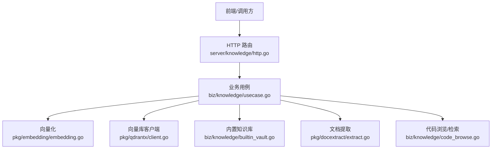
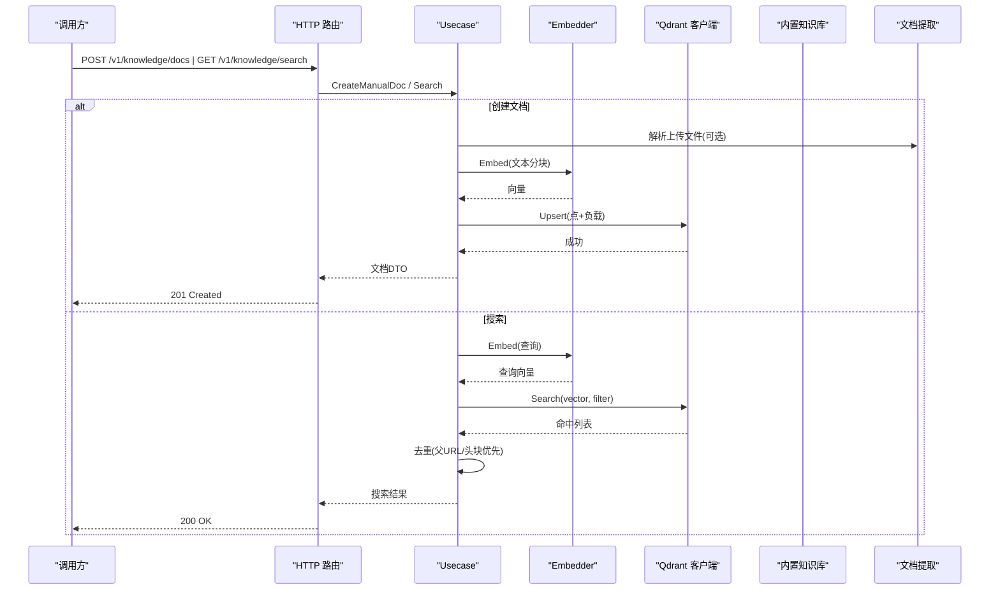
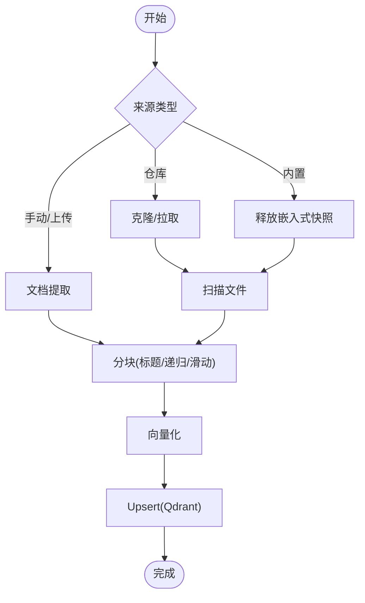
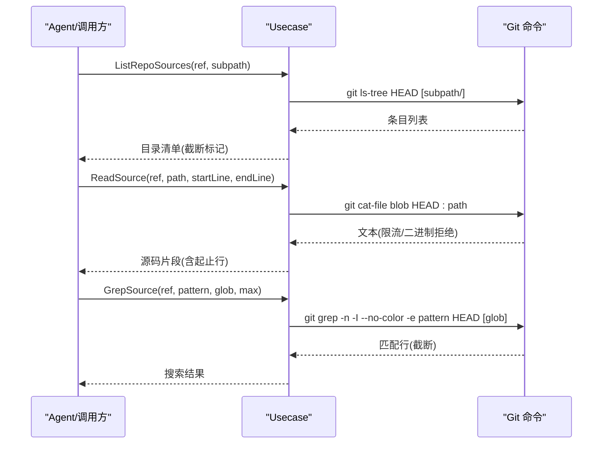
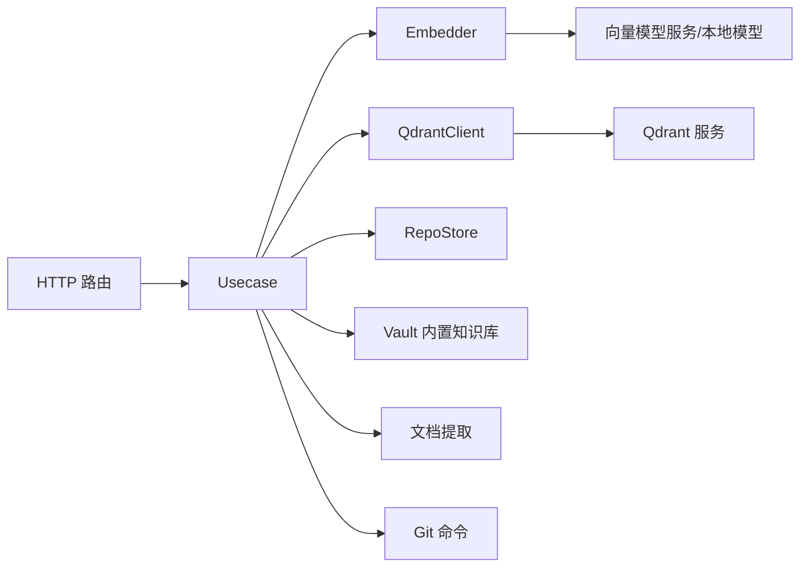

# 知识系统

<cite>
**本文引用的文件**
- [usecase.go](file://internal/manager/biz/knowledge/usecase.go)
- [http.go](file://internal/manager/server/knowledge/http.go)
- [client.go](file://internal/pkg/qdrantx/client.go)
- [embedding.go](file://internal/pkg/embedding/embedding.go)
- [builtin_vault.go](file://internal/manager/biz/knowledge/builtin_vault.go)
- [code_browse.go](file://internal/manager/biz/knowledge/code_browse.go)
- [extract.go](file://internal/pkg/docextract/extract.go)
- [model.go](file://internal/manager/model/knowledge/model.go)
</cite>

## 目录
1. [简介](#简介)
2. [项目结构](#项目结构)
3. [核心组件](#核心组件)
4. [架构总览](#架构总览)
5. [详细组件分析](#详细组件分析)
6. [依赖关系分析](#依赖关系分析)
7. [性能考量](#性能考量)
8. [故障排查指南](#故障排查指南)
9. [结论](#结论)
10. [附录](#附录)

## 简介
本技术文档面向知识系统的 RAG（检索增强生成）实现，覆盖以下方面：
- 文档索引、向量搜索与语义匹配机制
- 内置知识库的结构与组织方式（概念文档、诊断案例、参考手册）
- 代码搜索功能（代码库索引、语法分析与上下文提取）
- 知识内容的创建、更新与维护（Markdown 规范与元数据）
- 检索优化策略（缓存与查询重写）
- 知识质量评估与版本管理方案

该系统以“手动文档 + 仓库同步 + 内置知识库”三种来源统一入库，通过分块、向量化、向量检索与过滤去重，为上层 LLM/RAG 提供高相关性的上下文。

## 项目结构
知识系统位于 manager 层，按职责分层：
- HTTP 路由与 DTO：internal/manager/server/knowledge/http.go
- 业务用例（Usecase）：internal/manager/biz/knowledge/usecase.go
- 内置知识库（嵌入二进制）：internal/manager/biz/knowledge/builtin_vault.go
- 代码浏览与检索：internal/manager/biz/knowledge/code_browse.go
- 向量数据库客户端：internal/pkg/qdrantx/client.go
- 文本向量化（Embedder）：internal/pkg/embedding/embedding.go
- 文档提取（PDF/DOCX/MD/TXT）：internal/pkg/docextract/extract.go
- 领域模型：internal/manager/model/knowledge/model.go

**图表来源**
- [http.go:110-137](file://internal/manager/server/knowledge/http.go#L110-L137)
- [usecase.go:125-170](file://internal/manager/biz/knowledge/usecase.go#L125-L170)
- [client.go:48-116](file://internal/pkg/qdrantx/client.go#L48-L116)
- [embedding.go:72-85](file://internal/pkg/embedding/embedding.go#L72-L85)
- [builtin_vault.go:54-77](file://internal/manager/biz/knowledge/builtin_vault.go#L54-L77)
- [extract.go:21-46](file://internal/pkg/docextract/extract.go#L21-L46)
- [code_browse.go:84-145](file://internal/manager/biz/knowledge/code_browse.go#L84-L145)

**章节来源**
- [http.go:1-137](file://internal/manager/server/knowledge/http.go#L1-L137)
- [usecase.go:1-170](file://internal/manager/biz/knowledge/usecase.go#L1-L170)

## 核心组件
- 业务用例 Usecase：负责文档 CRUD、仓库同步、内置知识库同步、搜索、路径统计等；维护 qdrant 集合与负载字段索引。
- 向量库客户端 qdrantx：封装 Qdrant REST API，提供集合保障、Upsert、DeleteByFilter、Search、Scroll、GetPoints。
- 文本向量化 Embedder：抽象 Embedder 接口，支持 OpenAI 兼容服务与本地 ONNX（fastembed）两种提供者。
- 文档提取 docextract：将 .md/.txt/.pdf/.docx 转为纯文本，供后续分块与向量化。
- 内置知识库 vault：将平台知识库以嵌入资源形式随二进制发布，离线可用；首次启动可尝试云端克隆，失败回退到嵌入式快照。
- 代码浏览 code_browse：只读访问已克隆的代码仓库，支持列出目录、读取源码片段、git grep 搜索，用于 Agent 关联告警/日志与代码。

**章节来源**
- [usecase.go:173-824](file://internal/manager/biz/knowledge/usecase.go#L173-L824)
- [client.go:152-351](file://internal/pkg/qdrantx/client.go#L152-L351)
- [embedding.go:38-85](file://internal/pkg/embedding/embedding.go#L38-L85)
- [extract.go:21-46](file://internal/pkg/docextract/extract.go#L21-L46)
- [builtin_vault.go:12-47](file://internal/manager/biz/knowledge/builtin_vault.go#L12-L47)
- [code_browse.go:29-82](file://internal/manager/biz/knowledge/code_browse.go#L29-L82)

## 架构总览
知识系统采用“多源输入 → 标准化提取 → 分块 → 向量化 → 向量存储 → 检索与过滤 → 结果去重 → 返回”的流水线。

**图表来源**
- [http.go:267-354](file://internal/manager/server/knowledge/http.go#L267-L354)
- [http.go:425-456](file://internal/manager/server/knowledge/http.go#L425-L456)
- [usecase.go:187-221](file://internal/manager/biz/knowledge/usecase.go#L187-L221)
- [usecase.go:754-824](file://internal/manager/biz/knowledge/usecase.go#L754-L824)
- [client.go:160-175](file://internal/pkg/qdrantx/client.go#L160-L175)
- [client.go:272-302](file://internal/pkg/qdrantx/client.go#L272-L302)
- [extract.go:30-46](file://internal/pkg/docextract/extract.go#L30-L46)

## 详细组件分析

### RAG 流水线：文档索引与向量搜索
- 文档来源
  - 手动文档：用户粘贴 Markdown 或通过上传接口导入（支持 .md/.txt/.pdf/.docx）。
  - 仓库同步：注册 Git 仓库，拉取后扫描 .md/.txt/.rst/.yaml/.yml/.toml/.json 并索引。
  - 内置知识库：平台预置内容，优先尝试云端克隆，失败使用嵌入式快照。
- 分块策略
  - Markdown 优先按标题分段，再对正文递归切分，保留重叠以保持上下文连贯性；短标题段可合并到下一段以减少碎片。
  - 非 Markdown 或无标题时按固定字符窗口滑动切分，限制最大块数防止异常大文件。
- 向量化
  - 通过 Embedder 接口调用外部或本地模型，批量提交文本，返回同序向量。
- 存储与索引
  - 使用 Qdrant 集合，维度由 Embedder 决定；为 source_type、repo_id、path、path_prefixes、tags 建立负载索引以提升过滤性能。
  - 每个点携带负载：source_type、title、content、url、repo_id、path、tags、chunk_index、chunk_total、id_alias 等。
- 检索与去重
  - 支持 path/path_prefix/tags 服务端过滤；先 over-fetch 再在应用层按 parent_url/url 去重，确保长文档仅暴露最高分块。
  - 列表展示按 id_alias 去重，优先头块（chunk_index=0 或缺失），保证一个逻辑文档一行。

**图表来源**
- [usecase.go:270-340](file://internal/manager/biz/knowledge/usecase.go#L270-L340)
- [usecase.go:1025-1060](file://internal/manager/biz/knowledge/usecase.go#L1025-L1060)
- [usecase.go:1983-2010](file://internal/manager/biz/knowledge/usecase.go#L1983-L2010)
- [usecase.go:2018-2098](file://internal/manager/biz/knowledge/usecase.go#L2018-L2098)
- [client.go:160-175](file://internal/pkg/qdrantx/client.go#L160-L175)

**章节来源**
- [usecase.go:187-221](file://internal/manager/biz/knowledge/usecase.go#L187-L221)
- [usecase.go:270-340](file://internal/manager/biz/knowledge/usecase.go#L270-L340)
- [usecase.go:754-824](file://internal/manager/biz/knowledge/usecase.go#L754-L824)
- [usecase.go:1983-2098](file://internal/manager/biz/knowledge/usecase.go#L1983-L2098)
- [client.go:118-150](file://internal/pkg/qdrantx/client.go#L118-L150)

### 内置知识库结构与组织
- 位置与加载
  - 通过 go:embed 将内置知识库打包进二进制，避免对外部网络的强依赖。
  - 首次同步优先尝试从云端仓库克隆，失败则释放嵌入式快照到本地目录，随后走标准扫描→分块→向量化流程。
- 目录组织
  - concepts：概念文档（如可观测性、事件响应、告警）
  - diagnostics：诊断案例（网络、系统、数据库、K8s 等常见问题）
  - reference：参考手册（Linux 命令、PromQL 片段、索引主题）
  - systems：系统专题（容器、Linux、网络、可观测栈、调度、存储）
- 用途
  - 作为平台默认知识资产，无需额外配置即可被索引和检索。

**章节来源**
- [builtin_vault.go:12-47](file://internal/manager/biz/knowledge/builtin_vault.go#L12-L47)
- [builtin_vault.go:54-77](file://internal/manager/biz/knowledge/builtin_vault.go#L54-L77)

### 代码搜索与上下文提取
- 目标
  - 在不将代码嵌入 RAG 的前提下，为 Agent 提供对已克隆仓库的只读访问能力，以便关联告警/日志与具体代码。
- 能力
  - 列出仓库目录层级（隐藏 .git），支持子路径。
  - 读取源码文件（限制大小、跳过二进制），支持行范围窗口。
  - git grep 全文搜索（支持路径过滤），限制命中数量与超时。
- 安全与约束
  - 路径清理与校验，防止目录穿越；所有操作限定在单个仓库克隆目录内。
  - 通过 git plumbing 直接访问 HEAD 树对象，不依赖工作区状态。

**图表来源**
- [code_browse.go:194-258](file://internal/manager/biz/knowledge/code_browse.go#L194-L258)
- [code_browse.go:260-317](file://internal/manager/biz/knowledge/code_browse.go#L260-L317)
- [code_browse.go:319-390](file://internal/manager/biz/knowledge/code_browse.go#L319-L390)

**章节来源**
- [code_browse.go:29-82](file://internal/manager/biz/knowledge/code_browse.go#L29-L82)
- [code_browse.go:84-145](file://internal/manager/biz/knowledge/code_browse.go#L84-L145)
- [code_browse.go:194-390](file://internal/manager/biz/knowledge/code_browse.go#L194-L390)

### 文档模型与元数据
- 文档字段
  - ID、SourceType、RepoID、URL、Title、TitleEN、Content、Path、Tags、CreatedAt、UpdatedAt
- 元数据说明
  - Path：用“/”分隔的路径面包屑，用于文件夹视图与精确/前缀过滤。
  - Tags：标签数组，支持多值匹配。
  - SourceType：manual/upload/repo/vault，区分来源。
  - URL：原始来源地址或文件名，用于去重与归属。
  - RepoID：当来源为仓库时标识所属仓库。
- 列表与详情
  - 列表接口返回精简信息；详情接口可选择包含 Content。
  - 路径统计接口返回各路径下的文档计数，支撑前端树形视图。

**章节来源**
- [http.go:141-177](file://internal/manager/server/knowledge/http.go#L141-L177)
- [http.go:214-242](file://internal/manager/server/knowledge/http.go#L214-L242)
- [http.go:458-476](file://internal/manager/server/knowledge/http.go#L458-L476)
- [model.go](file://internal/manager/model/knowledge/model.go)

### 创建、更新与维护指南
- 创建文档
  - 手动文档：POST /v1/knowledge/docs，填写 title/content/path/tags。
  - 上传文档：POST /v1/knowledge/upload，支持 .md/.txt/.pdf/.docx，自动提取文本。
- 更新文档
  - PATCH /v1/knowledge/docs/{id}，可修改标题、内容、路径、标签；上传类文档会重新分块与向量化。
- 移动文档
  - PATCH /v1/knowledge/docs/{id}/move，仅变更路径；上传类文档会重新嵌入。
- 删除文档
  - DELETE /v1/knowledge/docs/{id}；上传类文档会按 url 清除所有分块。
- 仓库同步
  - 注册仓库：POST /v1/knowledge/repos
  - 触发同步：POST /v1/knowledge/repos/{id}/sync
  - 删除仓库：DELETE /v1/knowledge/repos/{id}
- 内置知识库同步
  - POST /v1/knowledge/vault/sync，优先云端克隆，失败回退嵌入式快照。

**章节来源**
- [http.go:267-354](file://internal/manager/server/knowledge/http.go#L267-L354)
- [http.go:364-423](file://internal/manager/server/knowledge/http.go#L364-L423)
- [http.go:499-543](file://internal/manager/server/knowledge/http.go#L499-L543)
- [http.go:545-565](file://internal/manager/server/knowledge/http.go#L545-L565)
- [usecase.go:187-221](file://internal/manager/biz/knowledge/usecase.go#L187-L221)
- [usecase.go:356-402](file://internal/manager/biz/knowledge/usecase.go#L356-L402)
- [usecase.go:626-689](file://internal/manager/biz/knowledge/usecase.go#L626-L689)

### 检索优化策略
- 查询重写与过滤
  - 支持 path/path_prefix/tags 在服务端进行过滤，减少无关候选集，提高精度。
- Over-fetch 与去重
  - 搜索时 over-fetch（最多 200）并在应用层按 parent_url/url 去重，确保长文档仅返回最高分块。
- 负载索引
  - 为关键字段建立 keyword 索引，避免全表扫描。
- 缓存建议（通用实践）
  - 可在上层对热门查询做短期缓存（基于 query + filters），注意失效策略（文档更新/同步后清空）。
  - 对路径/标签枚举结果可做轻量缓存，降低频繁统计开销。
- 查询重写（通用实践）
  - 结合业务词典与同义词扩展查询词；对拼写错误进行纠正；根据 path_prefix 自动注入领域限定。

**章节来源**
- [usecase.go:754-824](file://internal/manager/biz/knowledge/usecase.go#L754-L824)
- [client.go:118-150](file://internal/pkg/qdrantx/client.go#L118-L150)

### 知识质量评估与版本管理
- 质量评估
  - 相关性：通过检索分数与人工抽检评估；结合 path/tags 过滤提升精准度。
  - 完整性：检查长文档是否被合理分块且关键段落可被检索到。
  - 一致性：确保同一逻辑文档的头块承载完整内容，便于详情展示。
- 版本管理
  - 文档时间戳：CreatedAt/UpdatedAt 记录变更时间。
  - 仓库同步：每次同步更新 FileCount、LastSyncedAt、LastSyncError，便于追踪。
  - 内置知识库：云端/嵌入式来源不同，但均通过相同管道索引，便于对比与回滚。
  - 建议：对重要文档引入外部版本号（如 Git tag），在元数据中记录，便于审计与回溯。

**章节来源**
- [http.go:179-210](file://internal/manager/server/knowledge/http.go#L179-L210)
- [usecase.go:187-221](file://internal/manager/biz/knowledge/usecase.go#L187-L221)

## 依赖关系分析
- 模块耦合
  - HTTP 路由依赖 Service 接口，Service 由 Usecase 实现。
  - Usecase 依赖 Embedder、QdrantClient、RepoStore 等接口，便于测试替换与解耦。
  - QdrantClient 封装 REST 调用，屏蔽底层差异。
  - Embedder 抽象多种提供者，支持在线与离线模式。
- 外部依赖
  - Qdrant：向量数据库，提供集合、Upsert、Search、Scroll。
  - 向量模型：OpenAI 兼容服务或本地 ONNX 模型。
  - Git：用于仓库同步与代码浏览。
  - PDF/DOCX 解析库：用于文档提取。

**图表来源**
- [http.go:42-72](file://internal/manager/server/knowledge/http.go#L42-L72)
- [usecase.go:43-75](file://internal/manager/biz/knowledge/usecase.go#L43-L75)
- [client.go:29-46](file://internal/pkg/qdrantx/client.go#L29-L46)
- [embedding.go:38-85](file://internal/pkg/embedding/embedding.go#L38-L85)
- [code_browse.go:84-145](file://internal/manager/biz/knowledge/code_browse.go#L84-L145)

**章节来源**
- [usecase.go:43-75](file://internal/manager/biz/knowledge/usecase.go#L43-L75)
- [client.go:29-46](file://internal/pkg/qdrantx/client.go#L29-L46)
- [embedding.go:38-85](file://internal/pkg/embedding/embedding.go#L38-L85)

## 性能考量
- 分块与嵌入
  - 控制单文件大小与最大块数，避免一次嵌入过多文本导致内存与延迟压力。
  - 对 Markdown 优先按标题分段，减少无效切分，提高检索相关性。
- 向量检索
  - 使用负载索引与 MustMatch 过滤，减少候选集；over-fetch 后再去重，兼顾召回与精度。
- 列表与统计
  - 列表与路径统计使用 Scroll，设置合理 Limit，避免全量扫描。
- I/O 与并发
  - 对 git 命令设置超时，防止阻塞；批量 Upsert 减少网络往返。
- 缓存（建议）
  - 对高频查询与枚举结果做短期缓存，注意失效策略。

[本节为通用指导，不直接分析具体文件]

## 故障排查指南
- 无法创建/更新文档
  - 检查是否配置了 Embedder（API Key/Provider/BaseURL/Dim）。
  - 确认 Qdrant 集合存在且维度匹配；若维度不一致且已有数据，需手动处理集合。
- 搜索无结果
  - 检查是否设置了有效的 path/path_prefix/tags 过滤；必要时放宽条件。
  - 确认文档已被正确分块与向量化；查看对应 chunk 是否存在。
- 上传失败
  - 检查文件格式是否受支持；PDF/DOCX 需包含可提取文本。
  - 检查文件大小限制与 UTF-8 有效性。
- 仓库同步问题
  - 检查 SSH 身份或 HTTPS 凭据；确认仓库可达。
  - 查看 LastSyncError 与 FileCount，定位失败阶段。
- 代码浏览失败
  - 确认仓库已同步；路径必须合法且不越界；文件不能是二进制。

**章节来源**
- [usecase.go:187-221](file://internal/manager/biz/knowledge/usecase.go#L187-L221)
- [usecase.go:754-824](file://internal/manager/biz/knowledge/usecase.go#L754-L824)
- [client.go:48-116](file://internal/pkg/qdrantx/client.go#L48-L116)
- [extract.go:30-46](file://internal/pkg/docextract/extract.go#L30-L46)
- [code_browse.go:84-145](file://internal/manager/biz/knowledge/code_browse.go#L84-L145)

## 结论
该知识系统以清晰的层次化设计与可扩展的接口，实现了多源知识的统一索引与高效检索。通过 Markdown 智能分块、向量检索与服务端过滤，系统在准确性与性能之间取得平衡。内置知识库保障了开箱即用，代码浏览能力增强了与工程实践的联动。建议在运维侧完善缓存策略与质量评估流程，持续优化检索效果与用户体验。

[本节为总结，不直接分析具体文件]

## 附录
- API 概览
  - 文档：GET/POST/PATCH/DELETE /v1/knowledge/docs
  - 上传：POST /v1/knowledge/upload
  - 搜索：GET /v1/knowledge/search
  - 路径：GET /v1/knowledge/paths
  - 仓库：CRUD /v1/knowledge/repos，同步 /v1/knowledge/repos/{id}/sync
  - 内置知识库：POST /v1/knowledge/vault/sync

**章节来源**
- [http.go:110-137](file://internal/manager/server/knowledge/http.go#L110-L137)
- [http.go:214-242](file://internal/manager/server/knowledge/http.go#L214-L242)
- [http.go:425-456](file://internal/manager/server/knowledge/http.go#L425-L456)
- [http.go:458-476](file://internal/manager/server/knowledge/http.go#L458-L476)
- [http.go:499-565](file://internal/manager/server/knowledge/http.go#L499-L565)