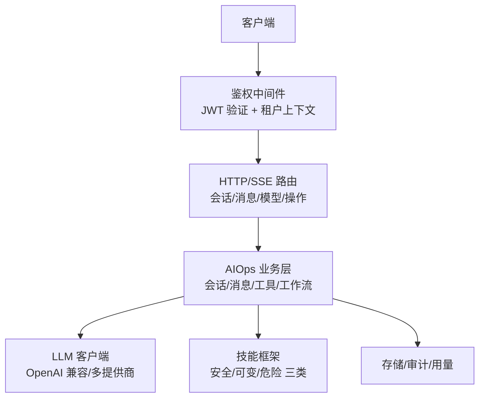
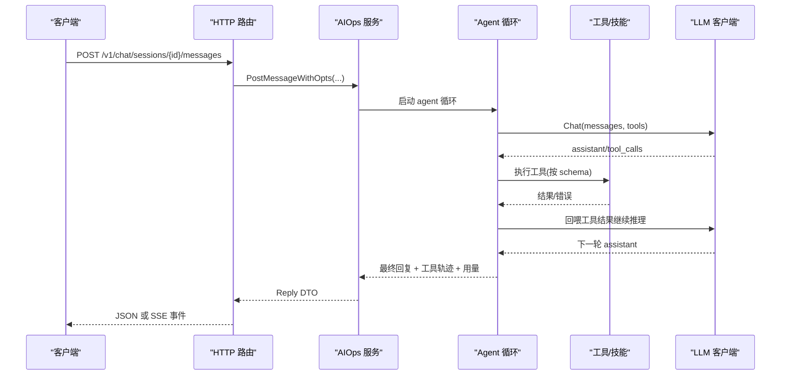
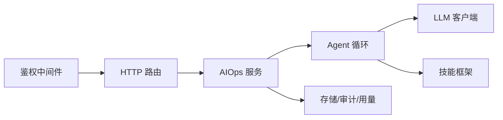
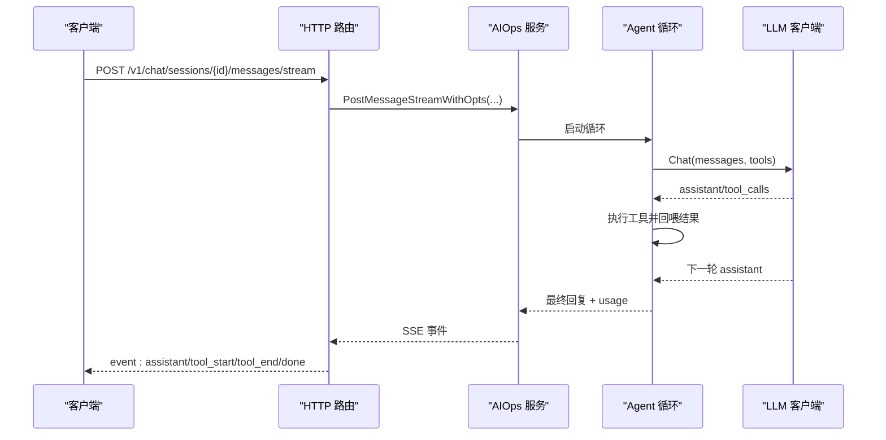

# AI Agent API

<cite>
**本文引用的文件**
- [aiops.proto](file://api/manager/aiops/v1/aiops.proto)
- [http.go](file://internal/manager/server/aiops/http.go)
- [client.go](file://internal/pkg/llm/client.go)
- [middleware.go](file://internal/pkg/auth/middleware.go)
- [types.go](file://internal/skill/types.go)
</cite>

## 目录
1. [简介](#简介)
2. [项目结构](#项目结构)
3. [核心组件](#核心组件)
4. [架构总览](#架构总览)
5. [详细组件分析](#详细组件分析)
6. [依赖关系分析](#依赖关系分析)
7. [性能与限流](#性能与限流)
8. [故障排查指南](#故障排查指南)
9. [结论](#结论)
10. [附录：API 参考与调用示例](#附录api-参考与调用示例)

## 简介
本文件为 AI Agent API 的权威技术文档，覆盖以下范围：
- RESTful 端点：对话会话创建、消息发送（阻塞与流式）、历史消息查询、会话管理、模型目录、操作审计等。
- gRPC 接口定义：AiopsService 服务、消息类型、流式事件、错误语义。
- 实时通信：SSE 事件推送协议与客户端接入方式。
- 认证与安全：JWT 鉴权、租户上下文注入、权限边界。
- 工具与工作流：LLM tool-calling 循环、技能（Skill）框架、审批与变更提案。
- 速率限制、错误处理与重试策略。
- 客户端集成指南与最佳实践。

## 项目结构
AI Agent 能力由三层组成：
- HTTP 路由层：提供 REST 与 SSE 接口，负责鉴权、参数校验、DTO 转换与错误映射。
- 业务与服务层：编排 agent 循环、工具执行、工作流、审计与用量统计。
- LLM 客户端层：封装 OpenAI 兼容接口，支持多提供商、预算控制、超时与指标上报。

图示来源
- [http.go:143-171](file://internal/manager/server/aiops/http.go#L143-L171)
- [middleware.go:21-53](file://internal/pkg/auth/middleware.go#L21-L53)
- [client.go:125-128](file://internal/pkg/llm/client.go#L125-L128)
- [types.go:18-26](file://internal/skill/types.go#L18-L26)

章节来源
- [http.go:143-171](file://internal/manager/server/aiops/http.go#L143-L171)
- [middleware.go:21-53](file://internal/pkg/auth/middleware.go#L21-L53)

## 核心组件
- 会话与会话消息：创建、列出、删除、重命名；消息历史与增量读取。
- 消息发送：阻塞式返回最终回复与工具轨迹；流式 SSE 逐片段推送。
- 模型目录：列出可用提供商与默认模型，供前端选择。
- 操作与审计：查看异步操作详情、执行用户可见动作、变更提案审计列表。
- LLM 客户端：统一 Chat 接口、预算检查、超时控制、指标与日志。
- 技能框架：声明式工具元数据、权限分级、跨边执行（host/manager）。

章节来源
- [http.go:448-537](file://internal/manager/server/aiops/http.go#L448-L537)
- [http.go:539-754](file://internal/manager/server/aiops/http.go#L539-L754)
- [http.go:855-998](file://internal/manager/server/aiops/http.go#L855-L998)
- [http.go:1180-1417](file://internal/manager/server/aiops/http.go#L1180-L1417)
- [client.go:125-128](file://internal/pkg/llm/client.go#L125-L128)
- [types.go:18-26](file://internal/skill/types.go#L18-L26)

## 架构总览

图示来源
- [http.go:508-537](file://internal/manager/server/aiops/http.go#L508-L537)
- [http.go:539-754](file://internal/manager/server/aiops/http.go#L539-L754)
- [client.go:387-507](file://internal/pkg/llm/client.go#L387-L507)
- [types.go:190-203](file://internal/skill/types.go#L190-L203)

## 详细组件分析

### RESTful 端点总览
- 会话管理
  - POST /v1/chat/sessions：创建会话，支持 scope、关联告警 incident、指定 agent_id。
  - GET /v1/chat/sessions：列出当前用户的会话，支持 limit/offset 与 related_incident_id。
  - DELETE /v1/chat/sessions/{id}：删除会话（硬删除）。
  - PATCH /v1/chat/sessions/{id}：重命名会话。
- 消息交互
  - POST /v1/chat/sessions/{id}/messages：阻塞发送消息，返回最终回复、工具轨迹与用量。
  - POST /v1/chat/sessions/{id}/messages/stream：SSE 流式发送，事件包括 assistant、tool_start、tool_end、done、error 等。
  - GET /v1/chat/sessions/{id}/messages：获取会话历史消息。
- 运行控制
  - POST /v1/chat/sessions/{id}/stop：中断正在进行的轮次。
- 模型与辅助
  - GET /v1/aiops/models：列出提供商与默认模型。
  - GET /v1/aiops/mentions/search：@提及搜索（可选后端）。
  - POST /v1/aiops/query-translate：自然语言转查询（需 LLM 客户端）。
- 代理与用户代理
  - GET /v1/agents：列出已加载的代理角色。
  - GET /v1/agents/{name}：获取代理详情。
  - POST /v1/agents/custom：创建用户自定义代理。
  - PATCH /v1/agents/custom/{name}：更新用户代理。
  - DELETE /v1/agents/custom/{name}：删除用户代理。
  - DELETE /v1/agents/{name}：通用删除（非内置/非默认）。
- 操作与审计
  - GET /v1/operations/{id}：查询异步操作详情与产物。
  - POST /v1/operations/{id}/actions/{action}：执行用户可见动作。
  - GET /v1/aiops/mutating-proposals：变更提案审计列表（支持过滤与分页）。
- 用量
  - GET /v1/usage/today：当日 token 用量汇总。

认证要求
- 所有端点均需通过鉴权中间件，携带 Authorization: Bearer <JWT> 或 ?token=<JWT>（WebSocket 场景）。
- 未认证返回 401；越权访问通常返回 404 以避免泄露资源存在性。

请求/响应要点
- 会话创建：title、scope_edge_ids（或 scope）、related_incident_id、agent_id。
- 消息发送：content、provider/model 覆盖、mentions、web_search_enabled、locale。
- 流式事件：event 名称与 data JSON 负载，包含 session_id、iteration、message_id、tool_call_id、status、duration_ms、arguments/result、usage 等。
- 错误格式：{ error, code }，code 如 unauthorized、invalid、budget-exceeded、edge-offline、not-wired-yet、internal 等。

章节来源
- [http.go:143-171](file://internal/manager/server/aiops/http.go#L143-L171)
- [http.go:448-537](file://internal/manager/server/aiops/http.go#L448-L537)
- [http.go:539-754](file://internal/manager/server/aiops/http.go#L539-L754)
- [http.go:756-853](file://internal/manager/server/aiops/http.go#L756-L853)
- [http.go:855-998](file://internal/manager/server/aiops/http.go#L855-L998)
- [http.go:1180-1417](file://internal/manager/server/aiops/http.go#L1180-L1417)
- [middleware.go:21-53](file://internal/pkg/auth/middleware.go#L21-L53)

### gRPC 接口定义（AiopsService）
服务与方法
- CreateChatSession：新建对话会话，scope 限定可触达 edge 集合。
- ListChatSessions：列出当前用户（或组织内授权）的会话。
- PostMessage：阻塞发送消息，等待 agent 收敛到最终答复，返回 assistant 终答、tool_calls 轨迹与 token 用量。
- StreamMessage：与 PostMessage 同语义，以 server-streaming 下发 StreamChunk（content_delta、tool_call_start、tool_call_result、done）。
- ListMessages：按游标读取某会话的历史消息（含 tool 调用）。

领域类型
- ChatRole：CHAT_ROLE_UNSPECIFIED、SYSTEM、USER、ASSISTANT、TOOL。
- ChatSession：会话元信息（id、org_id、user_id、title、scope_edge_ids、时间戳）。
- ToolCall/ToolResult：工具调用与结果，用于回喂 LLM。
- ChatMessage：消息体，role 与 tool_calls/tool_call_id/tool_name 组合表达不同角色。
- TokenUsage：prompt_tokens、completion_tokens、total_tokens。
- StreamChunk：oneof payload 四种形态。

错误处理
- 使用标准 gRPC 错误码；服务端在业务层将内部错误映射为合适的状态码与消息。
- 流式错误通过 Done 或单独的错误帧通知客户端。

章节来源
- [aiops.proto:11-29](file://api/manager/aiops/v1/aiops.proto#L11-L29)
- [aiops.proto:33-89](file://api/manager/aiops/v1/aiops.proto#L33-L89)
- [aiops.proto:93-169](file://api/manager/aiops/v1/aiops.proto#L93-L169)

### 实时通信（SSE 事件）
- 端点：POST /v1/chat/sessions/{id}/messages/stream
- 内容类型：text/event-stream；禁用缓存与代理缓冲。
- 事件类型
  - assistant：新增一条 assistant 消息（含 message_id、content、created_at、pending_tool_calls）。
  - tool_start：工具开始执行（tool_call_id、name、started_at、arguments）。
  - tool_end：工具结束（status success|error|timeout、ended_at、duration_ms、result）。
  - done：会话收敛完成（usage、iterations、final_message_id）。
  - error：终端失败（error、code）。
- 客户端建议
  - 连接后立即消费 : ok 心跳提示。
  - 对 tool_start/tool_end 进行状态机驱动渲染。
  - 遇到 error 终止并提示用户。

章节来源
- [http.go:539-754](file://internal/manager/server/aiops/http.go#L539-L754)

### 工具与工作流（Skill 框架）
- 权限分级
  - safe：只读无副作用。
  - mutating：可逆修改。
  - dangerous：不可逆或集群影响。
- 执行范围
  - ScopeHost：在边缘设备执行（需 edge_id）。
  - ScopeManager：在管理器进程执行（如网络搜索、外部 API）。
- 元数据与执行器
  - Metadata：key/name/description/class/scope/category/params/result_preview。
  - Executor：Metadata() + Execute(ctx, params)。
- 工作流
  - Agent 循环根据 LLM 的工具调用发起执行，收集结果后继续推理，直至收敛。
  - 可变/危险操作可能触发审批与变更提案审计。

章节来源
- [types.go:18-26](file://internal/skill/types.go#L18-L26)
- [types.go:47-61](file://internal/skill/types.go#L47-L61)
- [types.go:99-125](file://internal/skill/types.go#L99-L125)
- [types.go:190-203](file://internal/skill/types.go#L190-L203)

### 认证与租户上下文
- 中间件职责
  - 从 Authorization 或 ?token 提取 JWT。
  - 验证签名，写入 tenantctx（UserID、Email、Role、IsSuperuser）。
  - 失败返回 401。
- 路由级权限
  - 通过 callerFromCtx 获取 Caller（UserID、Role），进行资源归属与角色校验。
  - 非所有者访问返回 404 避免泄露存在性。

章节来源
- [middleware.go:21-53](file://internal/pkg/auth/middleware.go#L21-L53)
- [http.go:1109-1115](file://internal/manager/server/aiops/http.go#L1109-L1115)

## 依赖关系分析

图示来源
- [middleware.go:21-53](file://internal/pkg/auth/middleware.go#L21-L53)
- [http.go:143-171](file://internal/manager/server/aiops/http.go#L143-L171)
- [client.go:125-128](file://internal/pkg/llm/client.go#L125-L128)
- [types.go:190-203](file://internal/skill/types.go#L190-L203)

章节来源
- [http.go:143-171](file://internal/manager/server/aiops/http.go#L143-L171)
- [client.go:125-128](file://internal/pkg/llm/client.go#L125-L128)
- [types.go:190-203](file://internal/skill/types.go#L190-L203)

## 性能与限流
- 默认超时
  - LLM 客户端在无显式 deadline 时采用默认超时（约 120s），避免长时间挂起。
- 预算控制
  - 每次 Chat 前估算 prompt tokens 并进行预算检查；成功后记录实际用量。
  - 超预算返回 budget-exceeded。
- 指标与日志
  - 请求耗时、成功/失败计数、token 用量均上报指标；结构化日志不包含敏感内容。
- 流式优化
  - SSE 直接 flush，减少首字节延迟；禁用代理缓冲。
- 建议
  - 客户端设置合理超时与重试退避。
  - 对长任务使用流式接口，避免阻塞。
  - 监控预算与错误率，及时扩容或调整模型。

章节来源
- [client.go:37-44](file://internal/pkg/llm/client.go#L37-L44)
- [client.go:117-123](file://internal/pkg/llm/client.go#L117-L123)
- [client.go:387-507](file://internal/pkg/llm/client.go#L387-L507)
- [http.go:539-598](file://internal/manager/server/aiops/http.go#L539-L598)

## 故障排查指南
常见错误与定位
- unauthorized：缺少或无效 JWT；检查 Authorization 头或 ?token。
- invalid：请求体解析失败或参数不合法；检查 JSON 结构与必填字段。
- budget-exceeded：超出每日 token 预算；检查用量与配置。
- edge-offline：目标设备离线；检查设备状态与网络。
- not-wired-yet：功能未挂载（如 mentions 搜索、用户代理 CRUD）；检查部署配置。
- internal：未知错误；查看服务端日志与指标。

SSE 问题
- 未收到事件：确认 Content-Type 为 text/event-stream，且未启用代理缓冲。
- 连接中断：捕获 error 事件并重试；必要时重建连接。

章节来源
- [http.go:1145-1178](file://internal/manager/server/aiops/http.go#L1145-L1178)
- [http.go:539-754](file://internal/manager/server/aiops/http.go#L539-L754)
- [middleware.go:21-53](file://internal/pkg/auth/middleware.go#L21-L53)

## 结论
本 API 提供了完整的 AI Agent 能力：REST 与 gRPC 双通道、SSE 实时推送、工具与工作流编排、预算与超时控制、完善的鉴权与审计。建议客户端优先使用流式接口以获得更佳体验，并结合预算与错误码实现稳健的重试与降级策略。

## 附录：API 参考与调用示例

### REST 端点速查表
- 会话
  - POST /v1/chat/sessions
  - GET /v1/chat/sessions?limit=&offset=&related_incident_id=
  - DELETE /v1/chat/sessions/{id}
  - PATCH /v1/chat/sessions/{id}
- 消息
  - POST /v1/chat/sessions/{id}/messages
  - POST /v1/chat/sessions/{id}/messages/stream
  - GET /v1/chat/sessions/{id}/messages
- 控制
  - POST /v1/chat/sessions/{id}/stop
- 模型与辅助
  - GET /v1/aiops/models
  - GET /v1/aiops/mentions/search?q=&type=&limit=
  - POST /v1/aiops/query-translate
- 代理
  - GET /v1/agents
  - GET /v1/agents/{name}
  - POST /v1/agents/custom
  - PATCH /v1/agents/custom/{name}
  - DELETE /v1/agents/custom/{name}
  - DELETE /v1/agents/{name}
- 操作与审计
  - GET /v1/operations/{id}
  - POST /v1/operations/{id}/actions/{action}
  - GET /v1/aiops/mutating-proposals?tool_name=&decision=&limit=&offset=
- 用量
  - GET /v1/usage/today

认证
- 所有端点需要 Authorization: Bearer <JWT> 或 ?token=<JWT>。

请求/响应要点
- 会话创建：{ title, scope_edge_ids[], related_incident_id?, agent_id? }
- 消息发送：{ content, provider?, model?, mentions[], web_search_enabled?, locale? }
- 流式事件：event: assistant|tool_start|tool_end|done|error；data: JSON
- 错误：{ error, code }

章节来源
- [http.go:143-171](file://internal/manager/server/aiops/http.go#L143-L171)
- [http.go:448-537](file://internal/manager/server/aiops/http.go#L448-L537)
- [http.go:539-754](file://internal/manager/server/aiops/http.go#L539-L754)
- [http.go:855-998](file://internal/manager/server/aiops/http.go#L855-L998)
- [http.go:1180-1417](file://internal/manager/server/aiops/http.go#L1180-L1417)
- [middleware.go:21-53](file://internal/pkg/auth/middleware.go#L21-L53)

### gRPC 方法速查
- AiopsService.CreateChatSession
- AiopsService.ListChatSessions
- AiopsService.PostMessage
- AiopsService.StreamMessage (server-streaming)
- AiopsService.ListMessages

消息类型
- ChatSession、ChatMessage、ToolCall、ToolResult、TokenUsage、StreamChunk（ContentDelta/ToolCallStart/ToolCallResult/Done）

章节来源
- [aiops.proto:11-29](file://api/manager/aiops/v1/aiops.proto#L11-L29)
- [aiops.proto:33-89](file://api/manager/aiops/v1/aiops.proto#L33-L89)
- [aiops.proto:93-169](file://api/manager/aiops/v1/aiops.proto#L93-L169)

### 典型调用流程（序列图）

图示来源
- [http.go:539-754](file://internal/manager/server/aiops/http.go#L539-L754)
- [client.go:387-507](file://internal/pkg/llm/client.go#L387-L507)

### 客户端集成建议
- 使用流式接口提升用户体验；对每个事件类型建立状态机。
- 设置合理的超时与重试策略（指数退避、幂等保护）。
- 监听 error 事件并友好提示；必要时回退到阻塞接口。
- 遵循预算与用量提示，避免频繁短轮询。
- 在 WebSocket 场景下使用 ?token 传递鉴权。

[本节为通用指导，无需特定文件来源]