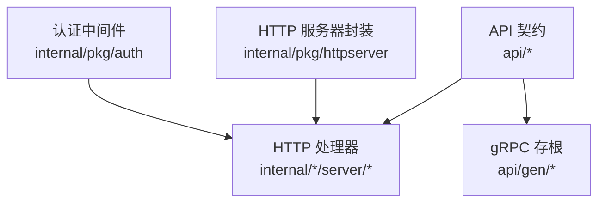
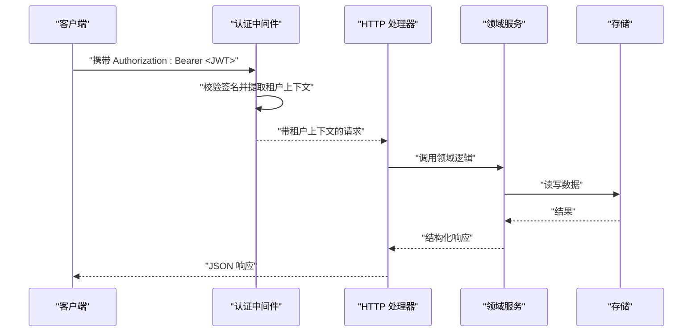
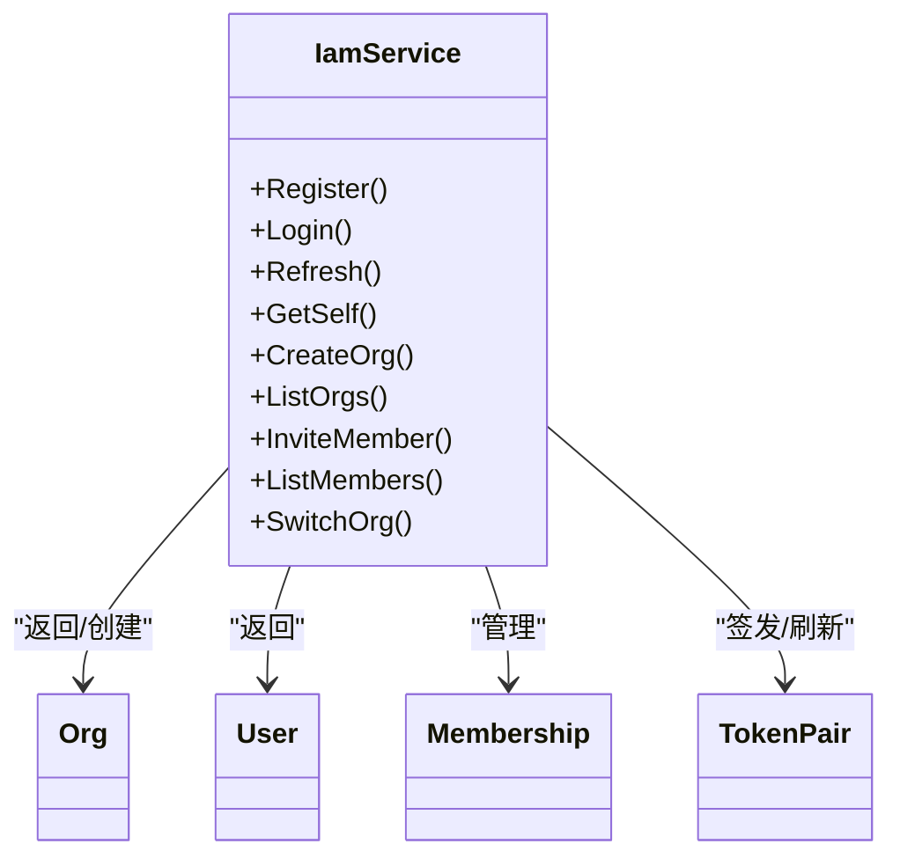
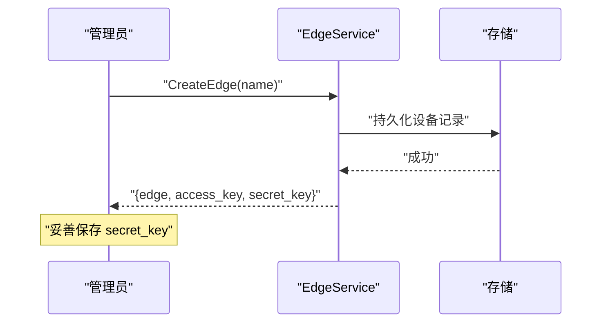
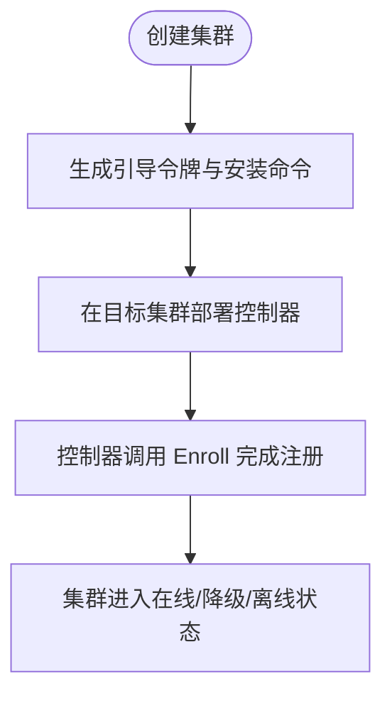
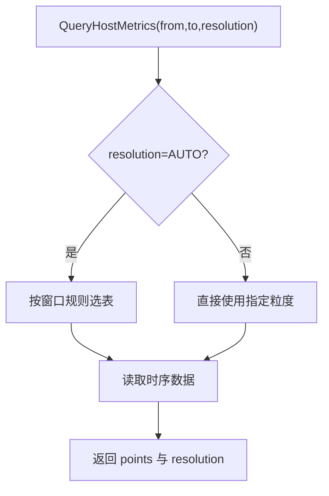
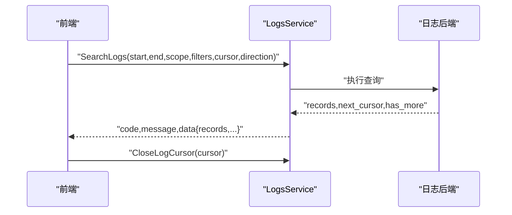
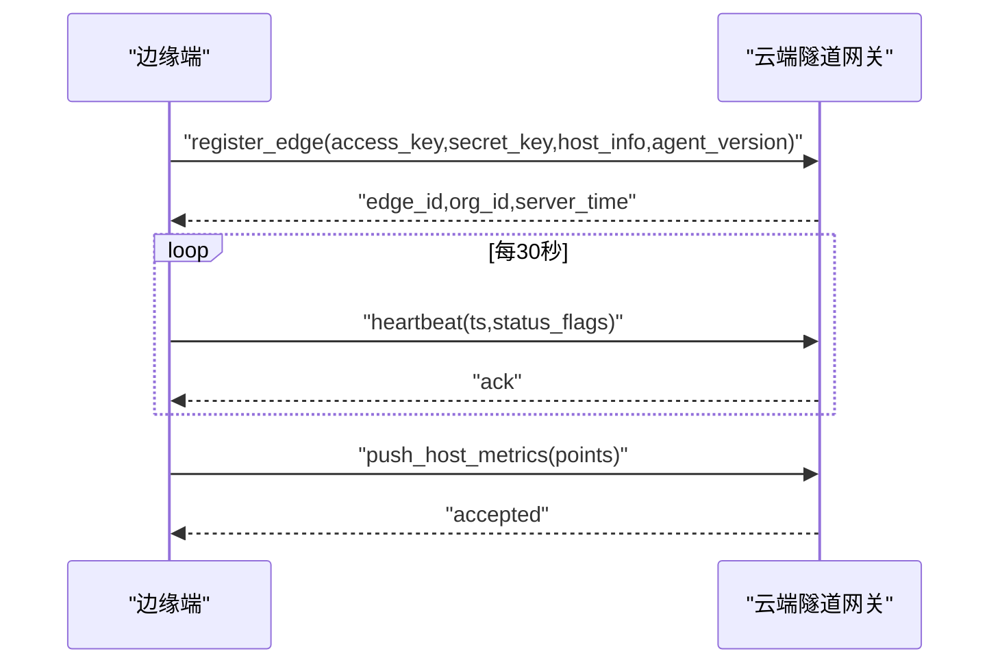
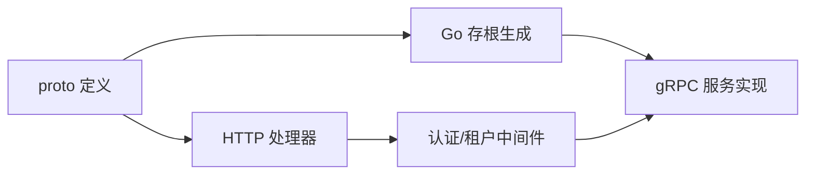

# API 参考

<cite>
**本文引用的文件**
- [api/README.md](file://api/README.md)
- [api/buf.yaml](file://api/buf.yaml)
- [api/buf.gen.yaml](file://api/buf.gen.yaml)
- [api/iam/v1/iam.proto](file://api/iam/v1/iam.proto)
- [api/manager/edge/v1/edge.proto](file://api/manager/edge/v1/edge.proto)
- [api/manager/alert/v1/alert.proto](file://api/manager/alert/v1/alert.proto)
- [api/manager/logs/v1/logs.proto](file://api/manager/logs/v1/logs.proto)
- [api/manager/metric/v1/metric.proto](file://api/manager/metric/v1/metric.proto)
- [api/manager/k8s/v1/k8s.proto](file://api/manager/k8s/v1/k8s.proto)
- [api/manager/setting/v1/setting.proto](file://api/manager/setting/v1/setting.proto)
- [api/tunnel/v1/tunnel.proto](file://api/tunnel/v1/tunnel.proto)
- [internal/pkg/auth/middleware.go](file://internal/pkg/auth/middleware.go)
- [internal/pkg/httpserver/server.go](file://internal/pkg/httpserver/server.go)
</cite>

## 目录
1. [简介](#简介)
2. [项目结构](#项目结构)
3. [核心组件](#核心组件)
4. [架构总览](#架构总览)
5. [详细组件分析](#详细组件分析)
6. [依赖关系分析](#依赖关系分析)
7. [性能与可用性](#性能与可用性)
8. [故障排查指南](#故障排查指南)
9. [结论](#结论)
10. [附录：客户端集成与最佳实践](#附录客户端集成与最佳实践)

## 简介
本参考文档面向使用 ongrid 平台的管理员、开发者与系统集成方，系统化说明 RESTful API、gRPC 接口以及隧道（tunnel）消息的契约与用法。项目采用“单一事实来源”的 proto 定义作为公共 API 契约；REST 路由由手写 HTTP 处理器实现，MVP 阶段未使用 grpc-gateway。认证通过 JWT Bearer Token 或 WebSocket 查询参数 token 注入租户上下文，所有 org_id/user_id 等敏感标识均从令牌或路径解析，不直接接受用户输入。

## 项目结构
- API 契约集中位于 api 目录，按业务域划分 v1 版本：
  - IAM：身份与组织管理
  - Manager：边缘设备、Kubernetes、指标、日志、告警、设置等
  - Tunnel：边云双向通信的消息体（非 gRPC，基于 geminio 隧道）
- 生成配置：buf.yaml/buf.gen.yaml 控制 lint、breaking 检测与 Go/gRPC stub 生成
- HTTP 服务封装在 internal/pkg/httpserver，统一优雅关停
- 认证中间件在 internal/pkg/auth，负责 JWT 校验与租户上下文注入

**图示来源**
- [api/README.md:1-42](file://api/README.md#L1-L42)
- [api/buf.yaml:1-10](file://api/buf.yaml#L1-L10)
- [api/buf.gen.yaml:1-12](file://api/buf.gen.yaml#L1-L12)
- [internal/pkg/httpserver/server.go:1-60](file://internal/pkg/httpserver/server.go#L1-L60)
- [internal/pkg/auth/middleware.go:1-68](file://internal/pkg/auth/middleware.go#L1-L68)

**章节来源**
- [api/README.md:1-42](file://api/README.md#L1-L42)
- [api/buf.yaml:1-10](file://api/buf.yaml#L1-L10)
- [api/buf.gen.yaml:1-12](file://api/buf.gen.yaml#L1-L12)
- [internal/pkg/httpserver/server.go:1-60](file://internal/pkg/httpserver/server.go#L1-L60)
- [internal/pkg/auth/middleware.go:1-68](file://internal/pkg/auth/middleware.go#L1-L68)

## 核心组件
- 身份与组织（IAM）
  - 注册、登录、刷新令牌、获取当前用户及成员资格、创建/列举组织、邀请成员、切换组织
- 边缘设备（Edge）
  - 创建/列举/详情/删除设备、轮换密钥、批量安装配置（Enrollment Profile）、设备入网、升级任务（创建/列表/详情/重试）
- Kubernetes（K8s）
  - 集群注册与健康、节点/工作负载/Pod/事件查询、操作审计、引导令牌轮换、内部 Enroll
- 指标（Metric）
  - 主机指标查询（自动/原始/聚合粒度）
- 日志（Logs）
  - 搜索、字段与值枚举、直方图、上下文、后端配置与管理、连接检查、内置 Loki 选择
- 告警（Alert）
  - 事件（Incident）列表、详情、确认、解决
- 设置（Setting）
  - LLM 配置校验与保存（多提供商模型探测与原子落库）
- 隧道（Tunnel）
  - 边云消息体：注册、心跳、指标上报、进程/网络快照、K8s 资源描述与写动作、网络发现、SNMP 探测等

**章节来源**
- [api/iam/v1/iam.proto:9-42](file://api/iam/v1/iam.proto#L9-L42)
- [api/manager/edge/v1/edge.proto:10-61](file://api/manager/edge/v1/edge.proto#L10-L61)
- [api/manager/k8s/v1/k8s.proto:9-27](file://api/manager/k8s/v1/k8s.proto#L9-L27)
- [api/manager/metric/v1/metric.proto:9-17](file://api/manager/metric/v1/metric.proto#L9-L17)
- [api/manager/logs/v1/logs.proto:9-25](file://api/manager/logs/v1/logs.proto#L9-L25)
- [api/manager/alert/v1/alert.proto:9-14](file://api/manager/alert/v1/alert.proto#L9-L14)
- [api/manager/setting/v1/setting.proto:7-17](file://api/manager/setting/v1/setting.proto#L7-L17)
- [api/tunnel/v1/tunnel.proto:1-18](file://api/tunnel/v1/tunnel.proto#L1-L18)

## 架构总览
- 协议层
  - REST：手写 HTTP 处理器，遵循 proto 中定义的请求/响应类型
  - gRPC：按 buf 配置生成 Go 存根与服务接口（require_unimplemented_servers=true）
  - Tunnel：JSON 编码的消息体，通过 geminio 隧道传输，非 gRPC
- 安全层
  - JWT Bearer Token 或 ?token= 查询参数进行鉴权
  - 租户上下文（org_id/user_id/role）由中间件注入，不在请求体中暴露
- 生命周期
  - HTTP Server 支持优雅关停，监听端口统一由 httpserver 封装

**图示来源**
- [internal/pkg/auth/middleware.go:10-53](file://internal/pkg/auth/middleware.go#L10-L53)
- [internal/pkg/httpserver/server.go:19-59](file://internal/pkg/httpserver/server.go#L19-L59)

## 详细组件分析

### 身份与组织（IAM）
- 服务与方法
  - Register/Login/Refresh：账号与令牌生命周期
  - GetSelf：当前用户与其成员资格
  - CreateOrg/ListOrgs：组织管理
  - InviteMember/ListMembers：成员邀请与列表
  - SwitchOrg：切换组织并签发新令牌
- 关键消息
  - Org/User/Membership/TokenPair
  - 各 RPC 的 Request/Response 均独立定义，便于向前兼容
- 认证与权限
  - 所有 RPC 不接收 org_id/user_id，由中间件从 JWT 与 URL path 注入
  - 角色用于后续授权判断

**图示来源**
- [api/iam/v1/iam.proto:9-42](file://api/iam/v1/iam.proto#L9-L42)
- [api/iam/v1/iam.proto:44-171](file://api/iam/v1/iam.proto#L44-L171)

**章节来源**
- [api/iam/v1/iam.proto:9-171](file://api/iam/v1/iam.proto#L9-L171)

### 边缘设备（Edge）
- 服务与方法
  - 设备生命周期：CreateEdge/ListEdges/GetEdge/DeleteEdge/RotateSecret
  - 批量安装：Create/List/DeleteEnrollmentProfile，RevokeEnrollmentProfile（已弃用）
  - 设备入网：EnrollEdge（使用一次性安装令牌鉴权）
  - 升级任务：Create/List/Get/RetryUpgradeJob
- 关键消息
  - Edge/HostInfo/EnrollmentProfile/UpgradeJob/UpgradeJobItem
  - 状态枚举：EdgeStatus、EnrollmentAssignmentMode、UpgradeJob*Status
- 安全要点
  - SecretKey 仅首次响应明文返回，服务端仅存哈希
  - EnrollEdge 使用 Authorization: Bearer <enrollment_token>，不使用用户 JWT

**图示来源**
- [api/manager/edge/v1/edge.proto:10-61](file://api/manager/edge/v1/edge.proto#L10-L61)
- [api/manager/edge/v1/edge.proto:122-172](file://api/manager/edge/v1/edge.proto#L122-L172)

**章节来源**
- [api/manager/edge/v1/edge.proto:10-317](file://api/manager/edge/v1/edge.proto#L10-L317)

### Kubernetes（K8s）
- 服务与方法
  - 集群：Create/List/Get/Health/DeleteCluster，RotateBootstrapToken
  - 资源：ListNodes/ListWorkloads/ListPods/ListEvents
  - 附件：ListEdgeAttachments
  - 内部入口：Enroll（一次性集群引导令牌鉴权）
- 关键消息
  - KubernetesCluster/KubernetesNode/KubernetesWorkload/KubernetesPod/KubernetesEvent
  - ActionAudit：统一的写操作审计读模型
- 模式与能力
  - 集群模式、能力集、节点覆盖统计

**图示来源**
- [api/manager/k8s/v1/k8s.proto:9-27](file://api/manager/k8s/v1/k8s.proto#L9-L27)
- [api/manager/k8s/v1/k8s.proto:83-94](file://api/manager/k8s/v1/k8s.proto#L83-L94)
- [api/manager/k8s/v1/k8s.proto:369-390](file://api/manager/k8s/v1/k8s.proto#L369-L390)

**章节来源**
- [api/manager/k8s/v1/k8s.proto:9-391](file://api/manager/k8s/v1/k8s.proto#L9-L391)

### 指标（Metric）
- 服务与方法
  - QueryHostMetrics：按 edge_id 与时间范围查询主机指标点
- 关键消息
  - Resolution：AUTO/RAW/M5/H1
  - HostMetricPoint：CPU/内存/负载/网络/磁盘等指标点
- 读取策略
  - AUTO 根据窗口大小自动选择表：≤6h→RAW，≤7d→M5，>7d→H1

**图示来源**
- [api/manager/metric/v1/metric.proto:9-17](file://api/manager/metric/v1/metric.proto#L9-L17)
- [api/manager/metric/v1/metric.proto:19-55](file://api/manager/metric/v1/metric.proto#L19-L55)

**章节来源**
- [api/manager/metric/v1/metric.proto:9-55](file://api/manager/metric/v1/metric.proto#L9-L55)

### 日志（Logs）
- 服务与方法
  - 搜索：SearchLogs/Cursor 分页
  - 元信息：GetLogFields/GetLogFieldValues/GetLogHistogram
  - 上下文：GetLogContext
  - 后端管理：Get/Put/Test/Select LogBackend，连接检查
  - 内置 Loki：SelectLoki
- 关键消息
  - LogScope/LogKeywords/LogFieldFilter/LogRecord/SearchLogsData
  - LogBackend/LogBackendType/LogBackendStatus/连接状态枚举
- 错误与状态
  - 多数响应包含 code/message/data 三元组，便于前端统一处理

**图示来源**
- [api/manager/logs/v1/logs.proto:9-25](file://api/manager/logs/v1/logs.proto#L9-L25)
- [api/manager/logs/v1/logs.proto:76-114](file://api/manager/logs/v1/logs.proto#L76-L114)
- [api/manager/logs/v1/logs.proto:227-285](file://api/manager/logs/v1/logs.proto#L227-L285)

**章节来源**
- [api/manager/logs/v1/logs.proto:9-346](file://api/manager/logs/v1/logs.proto#L9-L346)

### 告警（Alert）
- 服务与方法
  - ListIncidents/GetIncident/AcknowledgeIncident/ResolveIncident
- 关键消息
  - AlertIncident：规则键/名称、严重级别、状态、摘要、目标、运行手册链接、时间戳
  - 枚举：AlertSeverity、AlertIncidentStatus

**章节来源**
- [api/manager/alert/v1/alert.proto:9-88](file://api/manager/alert/v1/alert.proto#L9-L88)

### 设置（Setting）
- 服务与方法
  - ValidateLLMConfiguration：草稿配置最小验证
  - ValidateAndSaveLLMConfiguration：全量模型校验后原子保存，空 api_key 表示显式禁用
- 关键消息
  - 请求/响应包含 provider、base_url、default_model、models、latency_ms、code/detail 等

**章节来源**
- [api/manager/setting/v1/setting.proto:7-72](file://api/manager/setting/v1/setting.proto#L7-L72)

### 隧道（Tunnel）消息
- 传输方式
  - 非 gRPC，通过 geminio 隧道以 JSON 编码传输（MVP），未来可切换为二进制
- 主要方法（按方向）
  - 边→云：register_edge、heartbeat、push_host_metrics、report_plugin_config_applied、push_network_discovery
  - 云→边：get_host_load、get_process_list、get_netstat、describe_k8s_resource、query_k8s_logs、execute_k8s_action、probe_network_snmp
- 关键消息
  - HostInfo/HostMetricPoint、Kubernetes 各类 Snapshot/Ref、NetworkDiscoveryCandidate、SNMP 探测参数与结果

**图示来源**
- [api/tunnel/v1/tunnel.proto:1-18](file://api/tunnel/v1/tunnel.proto#L1-L18)
- [api/tunnel/v1/tunnel.proto:73-117](file://api/tunnel/v1/tunnel.proto#L73-L117)

**章节来源**
- [api/tunnel/v1/tunnel.proto:1-524](file://api/tunnel/v1/tunnel.proto#L1-L524)

## 依赖关系分析
- 版本与兼容性
  - 包命名约定：ongrid.<bc>[.<subdomain>].v<major>
  - 每个 RPC 拥有独立的 Request/Response 类型，利于向前兼容
  - 使用 optional 谨慎；仅在承载语义时使用
  - buf breaking 在 CI 中检测破坏性变更
- 外部依赖
  - 生成器：protocolbuffers/go、grpc/go
  - 标准库：google.protobuf.Timestamp、Empty、Struct

**图示来源**
- [api/README.md:22-32](file://api/README.md#L22-L32)
- [api/buf.gen.yaml:1-12](file://api/buf.gen.yaml#L1-L12)
- [api/buf.yaml:1-10](file://api/buf.yaml#L1-L10)

**章节来源**
- [api/README.md:22-42](file://api/README.md#L22-L42)
- [api/buf.yaml:1-10](file://api/buf.yaml#L1-L10)
- [api/buf.gen.yaml:1-12](file://api/buf.gen.yaml#L1-L12)

## 性能与可用性
- 指标读取
  - 自动分辨率策略减少大窗口查询压力
- 日志查询
  - Cursor 分页与 has_more 控制拉取节奏
- 隧道心跳
  - 固定周期心跳维持连接健康
- 服务关停
  - 优雅关停避免中断进行中请求

[本节提供通用指导，不直接分析具体文件]

## 故障排查指南
- 认证失败
  - 现象：401 Unauthorized
  - 原因：缺少 Bearer Token、Token 无效或过期
  - 处理：检查 Authorization 头或 WebSocket ?token= 参数；重新登录或刷新令牌
- 组织越权
  - 现象：403 Forbidden
  - 原因：尝试访问非所属组织资源
  - 处理：使用正确 org_id 或通过 SwitchOrg 切换组织
- 日志后端不可达
  - 现象：连接检查失败
  - 原因：网络/证书/凭据问题
  - 处理：核对 endpoint、CA、凭据引用与 TLS 设置，重新测试并选择后端
- 升级任务失败
  - 现象：部分设备失败/超时
  - 处理：查看 UpgradeJobItem 的错误码与消息，必要时 RetryUpgradeJob

**章节来源**
- [internal/pkg/auth/middleware.go:21-53](file://internal/pkg/auth/middleware.go#L21-L53)
- [api/manager/logs/v1/logs.proto:287-337](file://api/manager/logs/v1/logs.proto#L287-L337)
- [api/manager/edge/v1/edge.proto:232-316](file://api/manager/edge/v1/edge.proto#L232-L316)

## 结论
本参考文档基于仓库中的 proto 定义与基础设施代码，系统梳理了 ongrid 的 REST、gRPC 与隧道消息契约，明确了认证、版本与兼容性策略，并提供了常见流程的可视化说明。建议在实际集成时严格遵循消息结构与错误码约定，结合 Cursor/分页与自动分辨率等机制优化性能，同时重视令牌与密钥的安全管理。

[本节总结性内容，不直接分析具体文件]

## 附录：客户端集成与最佳实践
- 认证与租户
  - 使用 Authorization: Bearer <JWT>；WebSocket 可用 ?token=<jwt>
  - 不要自行构造 org_id/user_id，全部由服务端注入
- 版本与向后兼容
  - 遵循 v<major> 命名；新增字段优先使用 optional
  - 利用 buf breaking 保障契约稳定
- 速率限制与重试
  - 对高频接口（如指标/日志）实施指数退避重试
  - 合理设置 limit/page_size/cursor，避免单次过大负载
- 错误处理
  - 统一解析 code/message/data 三元组（日志等）
  - 针对 401/403/4xx/5xx 做差异化提示与恢复
- 示例调用（以路径代替代码片段）
  - 登录与刷新令牌：参考 [api/iam/v1/iam.proto:84-113](file://api/iam/v1/iam.proto#L84-L113)
  - 创建边缘设备：参考 [api/manager/edge/v1/edge.proto:124-133](file://api/manager/edge/v1/edge.proto#L124-L133)
  - 查询主机指标：参考 [api/manager/metric/v1/metric.proto:42-55](file://api/manager/metric/v1/metric.proto#L42-L55)
  - 搜索日志：参考 [api/manager/logs/v1/logs.proto:76-114](file://api/manager/logs/v1/logs.proto#L76-L114)
  - 隧道注册与心跳：参考 [api/tunnel/v1/tunnel.proto:73-117](file://api/tunnel/v1/tunnel.proto#L73-L117)

**章节来源**
- [internal/pkg/auth/middleware.go:10-68](file://internal/pkg/auth/middleware.go#L10-L68)
- [api/iam/v1/iam.proto:84-113](file://api/iam/v1/iam.proto#L84-L113)
- [api/manager/edge/v1/edge.proto:124-133](file://api/manager/edge/v1/edge.proto#L124-L133)
- [api/manager/metric/v1/metric.proto:42-55](file://api/manager/metric/v1/metric.proto#L42-L55)
- [api/manager/logs/v1/logs.proto:76-114](file://api/manager/logs/v1/logs.proto#L76-L114)
- [api/tunnel/v1/tunnel.proto:73-117](file://api/tunnel/v1/tunnel.proto#L73-L117)