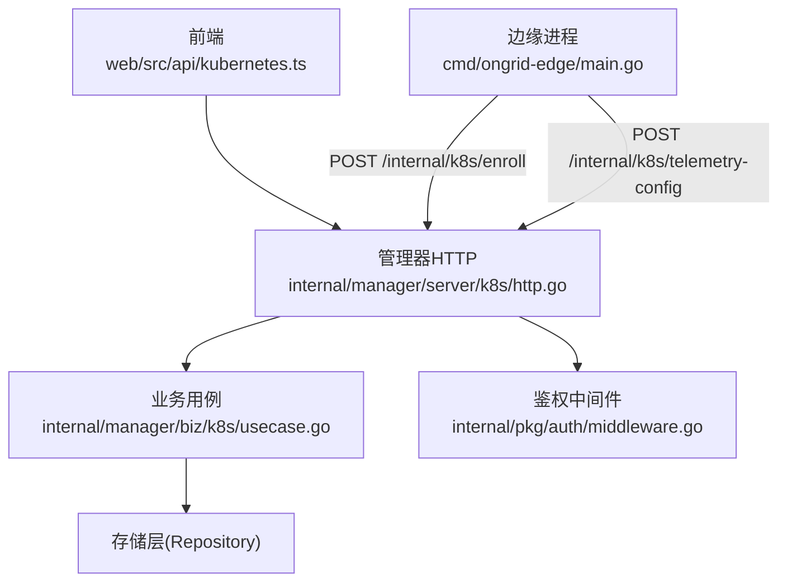
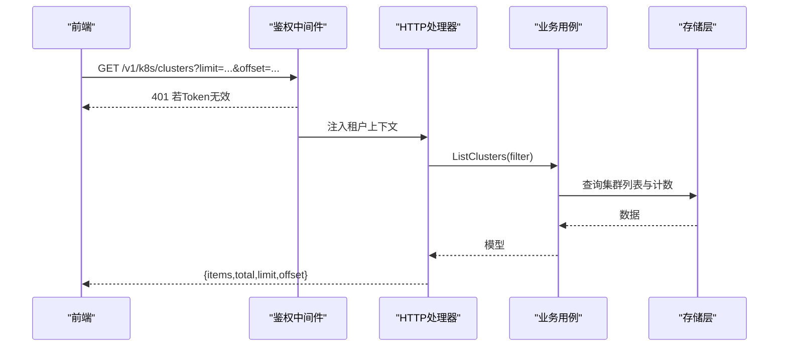
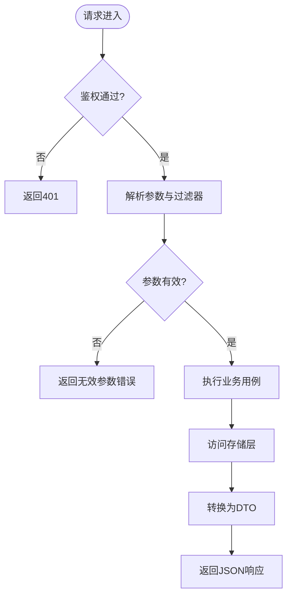
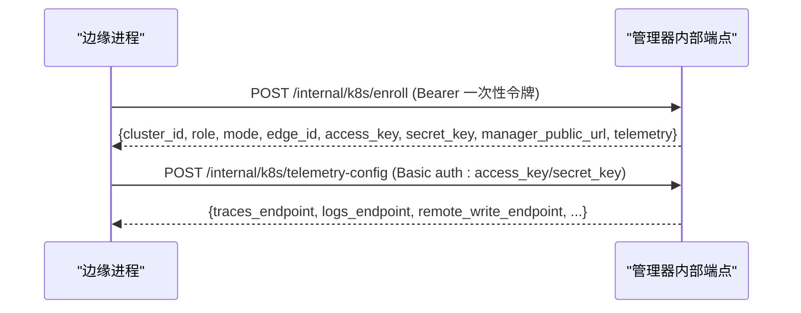
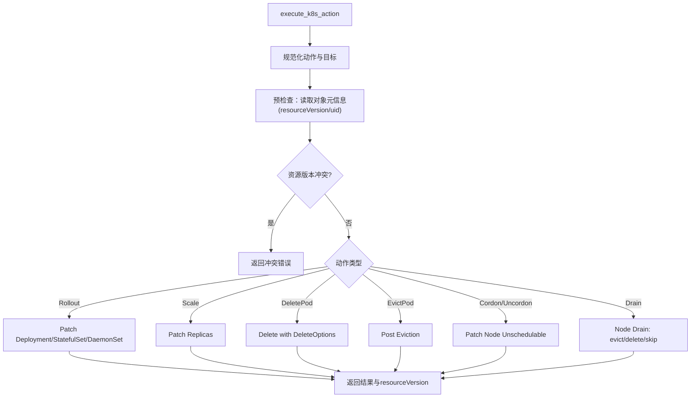
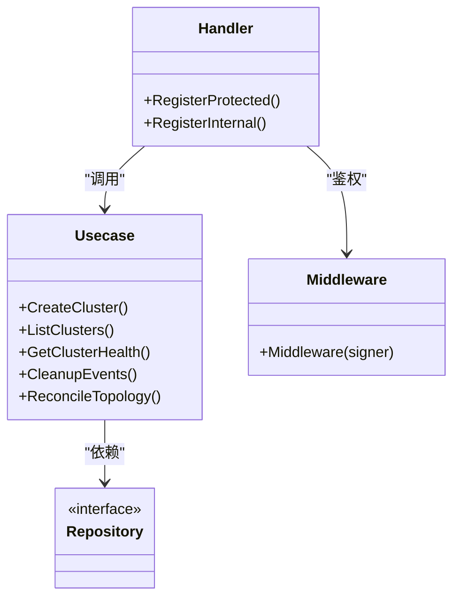

# Kubernetes 管理 API

<cite>
**本文引用的文件**
- [k8s.proto](file://api/manager/k8s/v1/k8s.proto)
- [http.go](file://internal/manager/server/k8s/http.go)
- [usecase.go](file://internal/manager/biz/k8s/usecase.go)
- [status.go](file://internal/manager/biz/k8s/status.go)
- [actions.go](file://internal/edgeagent/k8s/actions.go)
- [middleware.go](file://internal/pkg/auth/middleware.go)
- [main.go](file://cmd/ongrid-edge/main.go)
- [kubernetes.ts](file://web/src/api/kubernetes.ts)
</cite>

## 目录
1. [简介](#简介)
2. [项目结构](#项目结构)
3. [核心组件](#核心组件)
4. [架构总览](#架构总览)
5. [详细组件分析](#详细组件分析)
6. [依赖关系分析](#依赖关系分析)
7. [性能考虑](#性能考虑)
8. [故障排查指南](#故障排查指南)
9. [结论](#结论)
10. [附录：API 参考与调用示例](#附录api-参考与调用示例)

## 简介
本文件为 ongrid 的 Kubernetes 管理 API 文档，覆盖集群注册、状态查询、资源监控（节点、工作负载、Pod、事件）以及写操作审计等能力。API 以 RESTful 风格暴露于管理器侧，并通过内部端点完成边缘侧（Kubernetes 控制器/节点）的自动注册与遥测配置同步。鉴权采用 JWT Bearer Token，部分内部端点使用一次性引导令牌或边设备凭据进行认证。

## 项目结构
- API 定义位于 protobuf，生成后端服务契约与前端类型。
- 管理器 HTTP 路由在 server/k8s 中实现，负责参数校验、权限控制、DTO 转换与分页。
- 业务逻辑在 biz/k8s 中实现，包含集群生命周期、资源列表、健康统计、事件清理、拓扑同步等。
- 边缘侧通过 cmd/ongrid-edge 完成注册、遥测配置刷新、指标与清单上报。
- 前端通过 web/src/api/kubernetes.ts 封装所有 REST 调用。

图表来源
- [http.go:93-106](file://internal/manager/server/k8s/http.go#L93-L106)
- [usecase.go:224-274](file://internal/manager/biz/k8s/usecase.go#L224-L274)
- [middleware.go:21-53](file://internal/pkg/auth/middleware.go#L21-L53)
- [main.go:537-668](file://cmd/ongrid-edge/main.go#L537-L668)

章节来源
- [http.go:93-106](file://internal/manager/server/k8s/http.go#L93-L106)
- [usecase.go:224-274](file://internal/manager/biz/k8s/usecase.go#L224-L274)
- [middleware.go:21-53](file://internal/pkg/auth/middleware.go#L21-L53)
- [main.go:537-668](file://cmd/ongrid-edge/main.go#L537-L668)

## 核心组件
- 管理器 HTTP 处理器：提供受保护与内部两类端点，统一处理请求、鉴权、分页、错误响应。
- 业务用例：实现集群创建/删除、节点/工作负载/Pod/事件查询、健康汇总、事件保留策略、拓扑同步、遥测配置刷新。
- 边缘侧代理：负责集群注册、遥测配置获取、指标与清单上报。
- 鉴权中间件：解析 Bearer Token，注入租户上下文，未认证返回 401。
- 前端客户端：封装所有 REST 调用与类型定义。

章节来源
- [http.go:93-106](file://internal/manager/server/k8s/http.go#L93-L106)
- [usecase.go:501-549](file://internal/manager/biz/k8s/usecase.go#L501-L549)
- [main.go:537-668](file://cmd/ongrid-edge/main.go#L537-L668)
- [middleware.go:21-53](file://internal/pkg/auth/middleware.go#L21-L53)
- [kubernetes.ts:190-298](file://web/src/api/kubernetes.ts#L190-L298)

## 架构总览
管理器对外暴露 v1 接口用于集群管理与资源查询；内部接口用于边缘侧注册与遥测配置同步。请求经鉴权中间件后进入处理器，再委派到业务用例，最终访问存储层并返回 DTO。

图表来源
- [middleware.go:21-53](file://internal/pkg/auth/middleware.go#L21-L53)
- [http.go:222-267](file://internal/manager/server/k8s/http.go#L222-L267)
- [usecase.go:551-569](file://internal/manager/biz/k8s/usecase.go#L551-L569)

## 详细组件分析

### 管理器 HTTP 端点
- 受保护端点（需管理员或超级用户）：
  - POST /v1/k8s/clusters：创建集群，返回集群信息与引导令牌、安装命令。
  - POST /v1/k8s/clusters/{cluster_id}/rotate-token：轮换引导令牌。
  - DELETE /v1/k8s/clusters/{cluster_id}?force=true|false：删除集群。
  - GET /v1/k8s/clusters/{cluster_id}/actions：列出写操作审计记录（需管理员）。
- 通用查询端点（需鉴权）：
  - GET /v1/k8s/clusters：列表与分页。
  - GET /v1/k8s/clusters/{cluster_id}：获取集群详情。
  - GET /v1/k8s/clusters/{cluster_id}/health：健康统计（降级工作负载、Pending/CrashLoopBackOff/OOM/ImagePullBackOff Pod、NotReady 节点、命名空间摘要）。
  - GET /v1/k8s/clusters/{cluster_id}/nodes：节点列表与分页，支持 issue_only 过滤问题节点。
  - GET /v1/k8s/clusters/{cluster_id}/workloads：工作负载列表，支持 namespace、kind、q、issue_only、group_replica_sets。
  - GET /v1/k8s/clusters/{cluster_id}/pods：Pod 列表，支持 namespace、node_name、phase、reason、q、issue_only。
  - GET /v1/k8s/clusters/{cluster_id}/events：事件列表，支持 namespace、type、reason、involved_kind、involved_name、q、issue_only。
  - GET /v1/k8s/edge-attachments：边缘附件列表（控制器/节点与集群关联）。
- 内部端点（非用户直接调用）：
  - POST /internal/k8s/enroll：边缘侧注册，使用一次性引导令牌鉴权。
  - POST /internal/k8s/telemetry-config：刷新遥测配置，使用边设备凭据鉴权。

章节来源
- [http.go:93-106](file://internal/manager/server/k8s/http.go#L93-L106)
- [http.go:193-217](file://internal/manager/server/k8s/http.go#L193-L217)
- [http.go:219-267](file://internal/manager/server/k8s/http.go#L219-L267)
- [http.go:269-291](file://internal/manager/server/k8s/http.go#L269-L291)
- [http.go:293-325](file://internal/manager/server/k8s/http.go#L293-L325)
- [http.go:327-371](file://internal/manager/server/k8s/http.go#L327-L371)
- [http.go:373-418](file://internal/manager/server/k8s/http.go#L373-L418)
- [http.go:420-466](file://internal/manager/server/k8s/http.go#L420-L466)
- [http.go:468-502](file://internal/manager/server/k8s/http.go#L468-L502)
- [http.go:504-553](file://internal/manager/server/k8s/http.go#L504-L553)
- [http.go:555-578](file://internal/manager/server/k8s/http.go#L555-L578)

### 业务用例与数据流
- 集群创建：校验名称与模式，生成控制器与节点引导令牌，持久化集群，回填拓扑，返回安装命令。
- 列表与计数：统一限制 limit（默认值与上限），支持 offset，按过滤器查询并计算总数。
- 健康统计：聚合工作负载与 Pod 异常计数，命名空间维度摘要。
- 事件保留：按 TTL 与每集群最大数量定期清理历史事件。
- 拓扑同步：将集群与节点映射到通用拓扑图，维护成员关系与清理。
- 遥测配置刷新：基于边设备凭据验证，返回 traces/logs/remote_write 目标配置。

图表来源
- [middleware.go:21-53](file://internal/pkg/auth/middleware.go#L21-L53)
- [http.go:222-267](file://internal/manager/server/k8s/http.go#L222-L267)
- [usecase.go:501-549](file://internal/manager/biz/k8s/usecase.go#L501-L549)

章节来源
- [usecase.go:501-549](file://internal/manager/biz/k8s/usecase.go#L501-L549)
- [usecase.go:551-569](file://internal/manager/biz/k8s/usecase.go#L551-L569)
- [usecase.go:685-759](file://internal/manager/biz/k8s/usecase.go#L685-L759)
- [usecase.go:283-338](file://internal/manager/biz/k8s/usecase.go#L283-L338)
- [usecase.go:340-370](file://internal/manager/biz/k8s/usecase.go#L340-L370)
- [http.go:163-186](file://internal/manager/server/k8s/http.go#L163-L186)

### 边缘侧注册与遥测配置
- 注册流程：边缘进程读取环境变量（集群ID、角色、节点信息等），调用 /internal/k8s/enroll，携带一次性引导令牌，成功后获得边设备凭据与遥测配置。
- 遥测配置刷新：边缘进程周期性调用 /internal/k8s/telemetry-config，使用边设备凭据鉴权，更新本地遥测目标（traces/logs/remote_write）。

图表来源
- [main.go:537-668](file://cmd/ongrid-edge/main.go#L537-L668)
- [http.go:504-553](file://internal/manager/server/k8s/http.go#L504-L553)
- [http.go:555-578](file://internal/manager/server/k8s/http.go#L555-L578)

章节来源
- [main.go:537-668](file://cmd/ongrid-edge/main.go#L537-L668)
- [http.go:504-553](file://internal/manager/server/k8s/http.go#L504-L553)
- [http.go:555-578](file://internal/manager/server/k8s/http.go#L555-L578)

### 写操作审计与动作执行
- 写操作审计：列出经过 ReviewGate 或人工审批的写操作记录，屏蔽敏感字段（如一次性令牌）。
- 动作执行（边缘侧）：支持 rollout_restart、scale、delete_pod、evict_pod、cordon、uncordon、drain 等操作，带 dry-run、grace_period、resourceVersion 预条件与重试机制。

图表来源
- [actions.go:37-141](file://internal/edgeagent/k8s/actions.go#L37-L141)
- [actions.go:143-264](file://internal/edgeagent/k8s/actions.go#L143-L264)
- [actions.go:267-400](file://internal/edgeagent/k8s/actions.go#L267-L400)
- [actions.go:421-544](file://internal/edgeagent/k8s/actions.go#L421-L544)

章节来源
- [http.go:108-131](file://internal/manager/server/k8s/http.go#L108-L131)
- [actions.go:37-141](file://internal/edgeagent/k8s/actions.go#L37-L141)
- [actions.go:143-264](file://internal/edgeagent/k8s/actions.go#L143-L264)
- [actions.go:267-400](file://internal/edgeagent/k8s/actions.go#L267-L400)
- [actions.go:421-544](file://internal/edgeagent/k8s/actions.go#L421-L544)

## 依赖关系分析
- HTTP 处理器依赖业务用例与存储层抽象，解耦具体实现。
- 业务用例依赖 Repository、EdgeIssuer、TopologyMirror、RemoteWriteResolver、TelemetryTargetResolver 等接口，便于替换与测试。
- 鉴权中间件独立于业务，仅负责 JWT 验证与租户上下文注入。
- 边缘侧通过环境变量与内部端点完成注册与配置同步，不直接依赖管理器外部 API。

图表来源
- [http.go:24-45](file://internal/manager/server/k8s/http.go#L24-L45)
- [usecase.go:224-274](file://internal/manager/biz/k8s/usecase.go#L224-L274)
- [middleware.go:21-53](file://internal/pkg/auth/middleware.go#L21-L53)

章节来源
- [http.go:24-45](file://internal/manager/server/k8s/http.go#L24-L45)
- [usecase.go:224-274](file://internal/manager/biz/k8s/usecase.go#L224-L274)
- [middleware.go:21-53](file://internal/pkg/auth/middleware.go#L21-L53)

## 性能考虑
- 列表分页：所有列表接口支持 limit/offset，默认与上限由服务端限制，避免大结果集。
- 健康统计：聚合计数与命名空间摘要，减少前端多次请求。
- 事件保留：按 TTL 与每集群最大数量清理，控制存储增长。
- 遥测配置刷新：边缘侧周期性刷新，降低网络开销。
- 动作执行：dry-run、grace_period、resourceVersion 预条件与重试，提高安全性与稳定性。

[本节为通用指导，无需特定文件引用]

## 故障排查指南
- 401 未认证：检查 Authorization: Bearer <token> 是否有效；WebSocket 升级可使用 ?token=<jwt>。
- 403 禁止：管理员或超级用户才能访问受限端点；确认租户上下文中的角色。
- 404 不存在：集群 ID 或资源不存在；检查路径与参数。
- 429 过多尝试：内部注册端点有并发限制，稍后重试。
- 资源版本冲突：写操作时 resourceVersion 不一致，先读取最新对象再提交。
- 事件过多：调整事件保留策略或增加清理频率。

章节来源
- [middleware.go:21-53](file://internal/pkg/auth/middleware.go#L21-L53)
- [http.go:580-588](file://internal/manager/server/k8s/http.go#L580-L588)
- [http.go:504-515](file://internal/manager/server/k8s/http.go#L504-L515)
- [actions.go:59-62](file://internal/edgeagent/k8s/actions.go#L59-L62)

## 结论
该 Kubernetes 管理 API 提供了完整的集群注册、资源监控与健康诊断能力，结合边缘侧自动注册与遥测配置同步，形成端到端的可观测性与运维闭环。通过严格的鉴权、分页与保留策略，确保系统安全与性能。建议在生产环境启用管理员权限控制、合理配置事件保留与遥测目标，并关注健康统计与事件告警。

[本节为总结，无需特定文件引用]

## 附录：API 参考与调用示例

### 认证要求
- 受保护端点：Authorization: Bearer <JWT>。
- 内部注册端点：Authorization: Bearer <一次性引导令牌>。
- 内部遥测配置端点：Basic Auth（access_key/secret_key）。

章节来源
- [middleware.go:21-53](file://internal/pkg/auth/middleware.go#L21-L53)
- [http.go:504-553](file://internal/manager/server/k8s/http.go#L504-L553)
- [http.go:555-578](file://internal/manager/server/k8s/http.go#L555-L578)

### 常用端点与方法
- 集群管理
  - POST /v1/k8s/clusters：创建集群，返回 cluster、bootstrap_token、node_bootstrap_token、install_command。
  - GET /v1/k8s/clusters：列表，支持 status、mode、name、limit、offset。
  - GET /v1/k8s/clusters/{id}：获取集群详情。
  - POST /v1/k8s/clusters/{id}/rotate-token：轮换引导令牌。
  - DELETE /v1/k8s/clusters/{id}?force=true|false：删除集群。
- 健康与附件
  - GET /v1/k8s/clusters/{id}/health：健康统计。
  - GET /v1/k8s/edge-attachments：边缘附件列表。
- 资源监控
  - GET /v1/k8s/clusters/{id}/nodes：节点列表，支持 q、issue_only、limit、offset。
  - GET /v1/k8s/clusters/{id}/workloads：工作负载列表，支持 namespace、kind、q、issue_only、group_replica_sets、limit、offset。
  - GET /v1/k8s/clusters/{id}/pods：Pod 列表，支持 namespace、node_name、phase、reason、q、issue_only、limit、offset。
  - GET /v1/k8s/clusters/{id}/events：事件列表，支持 namespace、type、reason、involved_kind、involved_name、q、issue_only、limit、offset。
- 审计
  - GET /v1/k8s/clusters/{id}/actions：写操作审计记录，需管理员。

章节来源
- [http.go:93-106](file://internal/manager/server/k8s/http.go#L93-L106)
- [http.go:193-217](file://internal/manager/server/k8s/http.go#L193-L217)
- [http.go:219-267](file://internal/manager/server/k8s/http.go#L219-L267)
- [http.go:269-291](file://internal/manager/server/k8s/http.go#L269-L291)
- [http.go:293-325](file://internal/manager/server/k8s/http.go#L293-L325)
- [http.go:327-371](file://internal/manager/server/k8s/http.go#L327-L371)
- [http.go:373-418](file://internal/manager/server/k8s/http.go#L373-L418)
- [http.go:420-466](file://internal/manager/server/k8s/http.go#L420-L466)
- [http.go:468-502](file://internal/manager/server/k8s/http.go#L468-L502)
- [http.go:108-131](file://internal/manager/server/k8s/http.go#L108-L131)

### 调用示例（前端封装）
- 创建集群：调用 createKubernetesCluster({ name, uid?, mode? })。
- 列出集群：调用 listKubernetesClusters({ status?, mode?, name?, limit?, offset? })。
- 获取集群健康：调用 getKubernetesClusterHealth(id)。
- 列出节点：调用 listKubernetesNodes(clusterID, { q?, issue_only?, limit?, offset? })。
- 列出工作负载：调用 listKubernetesWorkloads(clusterID, { namespace?, kind?, q?, issue_only?, group_replica_sets?, limit?, offset? })。
- 列出 Pod：调用 listKubernetesPods(clusterID, { namespace?, node_name?, phase?, reason?, q?, issue_only?, limit?, offset? })。
- 列出事件：调用 listKubernetesEvents(clusterID, { namespace?, type?, reason?, involved_kind?, involved_name?, q?, issue_only?, limit?, offset? })。
- 列出审计：调用 listKubernetesActionAudits(clusterID, { limit?, offset? })。

章节来源
- [kubernetes.ts:190-298](file://web/src/api/kubernetes.ts#L190-L298)

### 边缘侧连接与订阅
- 连接注册：边缘进程调用 /internal/k8s/enroll，使用一次性引导令牌，获取边设备凭据与遥测配置。
- 遥测配置刷新：边缘进程周期性调用 /internal/k8s/telemetry-config，使用边设备凭据鉴权，更新 traces/logs/remote_write 目标。

章节来源
- [main.go:537-668](file://cmd/ongrid-edge/main.go#L537-L668)
- [http.go:504-553](file://internal/manager/server/k8s/http.go#L504-L553)
- [http.go:555-578](file://internal/manager/server/k8s/http.go#L555-L578)