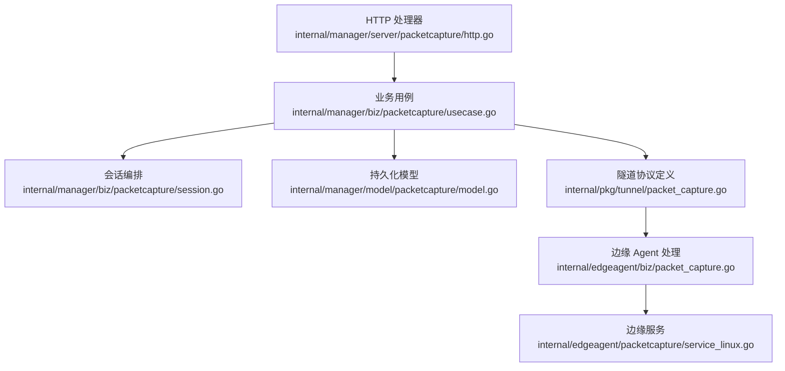
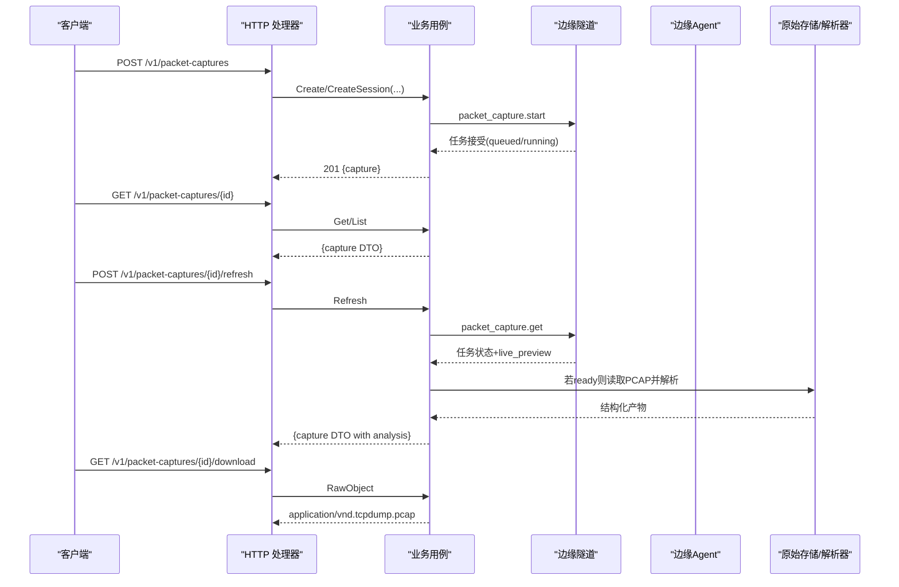
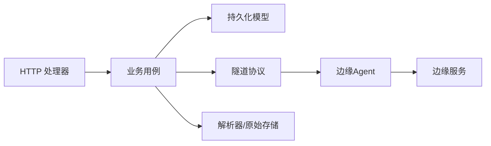

# 抓包分析 API

<cite>
**本文引用的文件**
- [packet_capture.proto](file://api/manager/packetcapture/v1/packet_capture.proto)
- [http.go](file://internal/manager/server/packetcapture/http.go)
- [usecase.go](file://internal/manager/biz/packetcapture/usecase.go)
- [session.go](file://internal/manager/biz/packetcapture/session.go)
- [model.go](file://internal/manager/model/packetcapture/model.go)
- [packet_capture.go](file://internal/pkg/tunnel/packet_capture.go)
- [types.go](file://internal/pkg/tunnel/types.go)
- [packet_capture.go](file://internal/edgeagent/biz/packet_capture.go)
- [service_linux.go](file://internal/edgeagent/packetcapture/service_linux.go)
</cite>

## 目录
1. [简介](#简介)
2. [项目结构](#项目结构)
3. [核心组件](#核心组件)
4. [架构总览](#架构总览)
5. [详细组件分析](#详细组件分析)
6. [依赖关系分析](#依赖关系分析)
7. [性能与存储策略](#性能与存储策略)
8. [故障排查指南](#故障排查指南)
9. [结论](#结论)
10. [附录：API 端点速查](#附录api-端点速查)

## 简介
本文件面向网络运维、SRE 和开发者，系统化说明“抓包分析”相关 RESTful API 的设计与用法。内容覆盖：
- 抓包任务创建、状态刷新、取消、停止
- 数据包列表与详情查询（基于已解析的元数据）
- 实时预览字段
- pcap 原始文件下载与鉴权
- 多边缘设备会话式抓包（跨节点协同）
- 协议分析与流量统计（会话级聚合）
- 过滤、限流、保留策略与性能优化建议
- 常见错误与排障步骤

## 项目结构
抓包能力由四层组成：
- HTTP 接口层：暴露 RESTful 路由，负责鉴权、参数校验、响应封装
- 业务用例层：编排任务生命周期、状态机迁移、与边缘隧道通信、解析产物入库
- 持久化模型层：定义数据库表结构与字段
- 边缘侧实现：通过隧道在边缘执行 AF_PACKET 抓包，返回任务状态与原始数据

图表来源
- [http.go:32-47](file://internal/manager/server/packetcapture/http.go#L32-L47)
- [usecase.go:262-380](file://internal/manager/biz/packetcapture/usecase.go#L262-L380)
- [session.go:58-110](file://internal/manager/biz/packetcapture/session.go#L58-L110)
- [model.go:36-127](file://internal/manager/model/packetcapture/model.go#L36-L127)
- [packet_capture.go:5-22](file://internal/pkg/tunnel/packet_capture.go#L5-L22)
- [packet_capture.go:15-134](file://internal/edgeagent/biz/packet_capture.go#L15-L134)
- [service_linux.go:79-110](file://internal/edgeagent/packetcapture/service_linux.go#L79-L110)

章节来源
- [http.go:32-47](file://internal/manager/server/packetcapture/http.go#L32-L47)
- [usecase.go:262-380](file://internal/manager/biz/packetcapture/usecase.go#L262-L380)
- [session.go:58-110](file://internal/manager/biz/packetcapture/session.go#L58-L110)
- [model.go:36-127](file://internal/manager/model/packetcapture/model.go#L36-L127)
- [packet_capture.go:5-22](file://internal/pkg/tunnel/packet_capture.go#L5-L22)
- [packet_capture.go:15-134](file://internal/edgeagent/biz/packet_capture.go#L15-L134)
- [service_linux.go:79-110](file://internal/edgeagent/packetcapture/service_linux.go#L79-L110)

## 核心组件
- HTTP 处理器：注册 /v1/packet-captures 与 /v1/packet-capture-sessions 系列路由，统一鉴权、分页、错误码映射
- 业务用例：创建/刷新/取消/停止抓包；拉取边缘任务状态；读取原始 PCAP；调用解析器生成结构化产物；维护状态机
- 会话编排：批量创建跨边缘抓包任务，汇总分析结果，支持延迟启动与部分失败
- 持久化模型：记录抓包请求、目标、过滤器、限制、时间戳、产物 ID、错误信息等
- 隧道协议：定义 manager-to-edge 的 RPC 方法名与消息体，确保不泄露本地路径
- 边缘服务：队列化执行抓包，支持进度上报、优雅停止、只读读取完成产物

章节来源
- [http.go:32-47](file://internal/manager/server/packetcapture/http.go#L32-L47)
- [usecase.go:262-380](file://internal/manager/biz/packetcapture/usecase.go#L262-L380)
- [session.go:58-110](file://internal/manager/biz/packetcapture/session.go#L58-L110)
- [model.go:36-127](file://internal/manager/model/packetcapture/model.go#L36-L127)
- [packet_capture.go:5-22](file://internal/pkg/tunnel/packet_capture.go#L5-L22)
- [service_linux.go:79-110](file://internal/edgeagent/packetcapture/service_linux.go#L79-L110)

## 架构总览
下图展示一次抓包从 HTTP 到边缘执行的完整流程，包括状态刷新、原始数据回传、解析与产物发布。

图表来源
- [http.go:421-453](file://internal/manager/server/packetcapture/http.go#L421-L453)
- [http.go:315-369](file://internal/manager/server/packetcapture/http.go#L315-L369)
- [usecase.go:262-380](file://internal/manager/biz/packetcapture/usecase.go#L262-L380)
- [usecase.go:445-520](file://internal/manager/biz/packetcapture/usecase.go#L445-L520)
- [usecase.go:602-716](file://internal/manager/biz/packetcapture/usecase.go#L602-L716)
- [packet_capture.go:5-22](file://internal/pkg/tunnel/packet_capture.go#L5-L22)

## 详细组件分析

### HTTP 接口层
- 路由注册：提供会话与抓包的 CRUD、刷新、取消、停止、下载等端点
- 鉴权：所有写操作需具备 writer 角色；读操作需认证上下文
- 错误码：统一映射 not-found/unauthorized/forbidden/invalid/conflict/internal
- 下载：以二进制流输出 pcap，设置安全头与文件名

章节来源
- [http.go:32-47](file://internal/manager/server/packetcapture/http.go#L32-L47)
- [http.go:68-81](file://internal/manager/server/packetcapture/http.go#L68-L81)
- [http.go:594-600](file://internal/manager/server/packetcapture/http.go#L594-L600)
- [http.go:662-687](file://internal/manager/server/packetcapture/http.go#L662-L687)
- [http.go:395-419](file://internal/manager/server/packetcapture/http.go#L395-L419)

### 业务用例层
- 创建抓包：规范化输入、去重幂等键、解析设备到 edge、写入持久化、下发边缘任务
- 刷新抓包：轮询边缘任务状态，更新 captured_bytes/packets/live_preview，必要时进入解析流程
- 取消/停止：分别丢弃未完成数据或保留已刷新的前缀
- 原始对象读取：校验大小与哈希，支持本地或远程读取
- 解析产物：将 raw PCAP 转为结构化 JSON，包含摘要、数据包列表、元信息

章节来源
- [usecase.go:262-380](file://internal/manager/biz/packetcapture/usecase.go#L262-L380)
- [usecase.go:445-520](file://internal/manager/biz/packetcapture/usecase.go#L445-L520)
- [usecase.go:522-600](file://internal/manager/biz/packetcapture/usecase.go#L522-L600)
- [usecase.go:414-443](file://internal/manager/biz/packetcapture/usecase.go#L414-L443)
- [usecase.go:602-716](file://internal/manager/biz/packetcapture/usecase.go#L602-L716)

### 会话编排层
- 多目标会话：为多个边缘设备创建抓包成员，支持延迟启动与错开时间
- 会话分析：聚合各成员的解析结果，计算流、事件时间线、缺失边缘提示
- 协调控制：批量刷新、取消、停止成员，维护会话状态（collecting/partial/ready/cancelled/failed）

章节来源
- [session.go:58-110](file://internal/manager/biz/packetcapture/session.go#L58-L110)
- [session.go:195-250](file://internal/manager/biz/packetcapture/session.go#L195-L250)
- [session.go:252-394](file://internal/manager/biz/packetcapture/session.go#L252-L394)

### 持久化模型
- 抓包记录：包含请求快照、目标、过滤器、限制、时间戳、产物 ID、错误信息、存活时间等
- 会话记录：公共 ID、状态、计划开始时间、时钟质量、分析 JSON 等

章节来源
- [model.go:36-127](file://internal/manager/model/packetcapture/model.go#L36-L127)

### 隧道协议与边缘侧
- 方法名：start/get/read/cancel/stop
- 消息体：捕获 ID、接口、命名空间、过滤器、时长、字节/包上限、snaplen、混杂模式、计划开始时间
- 边缘服务：队列化执行，单实例并发保护，支持进度上报与优雅停止，只读读取已完成产物

章节来源
- [packet_capture.go:5-22](file://internal/pkg/tunnel/packet_capture.go#L5-L22)
- [packet_capture.go:24-114](file://internal/pkg/tunnel/packet_capture.go#L24-L114)
- [packet_capture.go:15-134](file://internal/edgeagent/biz/packet_capture.go#L15-L134)
- [service_linux.go:79-110](file://internal/edgeagent/packetcapture/service_linux.go#L79-L110)
- [service_linux.go:282-313](file://internal/edgeagent/packetcapture/service_linux.go#L282-L313)

## 依赖关系分析
- HTTP 处理器依赖业务用例，业务用例依赖持久化、隧道调用、解析器与原始存储
- 边缘侧通过隧道与 manager 通信，避免直接暴露文件系统路径
- 会话编排依赖用例的批量能力与分析聚合逻辑

图表来源
- [http.go:32-47](file://internal/manager/server/packetcapture/http.go#L32-L47)
- [usecase.go:262-380](file://internal/manager/biz/packetcapture/usecase.go#L262-L380)
- [packet_capture.go:5-22](file://internal/pkg/tunnel/packet_capture.go#L5-L22)
- [service_linux.go:79-110](file://internal/edgeagent/packetcapture/service_linux.go#L79-L110)

章节来源
- [http.go:32-47](file://internal/manager/server/packetcapture/http.go#L32-L47)
- [usecase.go:262-380](file://internal/manager/biz/packetcapture/usecase.go#L262-L380)
- [packet_capture.go:5-22](file://internal/pkg/tunnel/packet_capture.go#L5-L22)
- [service_linux.go:79-110](file://internal/edgeagent/packetcapture/service_linux.go#L79-L110)

## 性能与存储策略
- 抓取限制
  - 默认时长、最大字节数、最大包数、snaplen 均有上限与默认值，防止资源耗尽
  - 可通过请求参数调整，但受服务端约束
- 保留策略
  - 原始 PCAP 与解析产物均有时效性，过期后自动清理
  - 失败任务会清理原始对象并删除记录，避免残留
- 并发与队列
  - 边缘侧同一时刻仅运行一个抓包，队列长度有限制，避免内存与磁盘压力
- 实时预览
  - 刷新时携带 live_preview 片段，便于前端快速预览
- 下载与鉴权
  - 公开下载需认证；内部下载支持 token 鉴权，校验 SHA256 与大小一致性

章节来源
- [usecase.go:262-380](file://internal/manager/biz/packetcapture/usecase.go#L262-L380)
- [usecase.go:602-716](file://internal/manager/biz/packetcapture/usecase.go#L602-L716)
- [service_linux.go:79-110](file://internal/edgeagent/packetcapture/service_linux.go#L79-L110)
- [http.go:371-393](file://internal/manager/server/packetcapture/http.go#L371-L393)

## 故障排查指南
- 无法创建抓包
  - 检查 device_id 是否有效、接口名是否合法、网络命名空间是否合规
  - 查看返回的错误码与错误详情
- 任务长时间 pending
  - 调用 refresh 获取边缘任务状态与 live_preview
  - 确认边缘服务是否可用、队列是否已满
- 下载失败或校验失败
  - 确认 capture 状态为 ready 且存在原始对象
  - 校验返回的 size 与 sha256 是否与记录一致
- 会话部分失败
  - 查看 member_errors，定位不可达的边缘或失败的成员
  - 使用 stop 保留部分成功的数据，再重新分析

章节来源
- [http.go:662-687](file://internal/manager/server/packetcapture/http.go#L662-L687)
- [usecase.go:262-380](file://internal/manager/biz/packetcapture/usecase.go#L262-L380)
- [usecase.go:445-520](file://internal/manager/biz/packetcapture/usecase.go#L445-L520)
- [usecase.go:602-716](file://internal/manager/biz/packetcapture/usecase.go#L602-L716)
- [session.go:58-110](file://internal/manager/biz/packetcapture/session.go#L58-L110)

## 结论
该抓包分析 API 提供了端到端的网络诊断能力：从创建、监控、下载到解析与聚合，兼顾安全性与性能。通过会话机制可跨多边缘设备协同抓包，结合结构化产物与实时预览，显著提升问题定位效率。建议在生产环境合理配置抓取限制与保留策略，并结合错误码与日志进行排障。

## 附录：API 端点速查
以下列出主要 RESTful 端点、方法与用途。具体请求/响应字段请参考对应源码中的 DTO 与模型定义。

- 会话管理
  - GET /api/v1/packet-capture-sessions
    - 作用：列出抓包会话，支持 limit/offset 分页
    - 认证：需要
  - GET /api/v1/packet-capture-sessions/{publicID}
    - 作用：获取会话详情与成员抓包列表
    - 认证：需要
  - POST /api/v1/packet-capture-sessions
    - 作用：创建多边缘抓包会话，支持 targets、filter、duration、max_bytes、max_packets、snaplen、promiscuous、title、description
    - 认证：writer 角色
  - POST /api/v1/packet-capture-sessions/{publicID}/refresh
    - 作用：刷新会话状态与成员状态，聚合分析结果
    - 认证：writer 角色
  - POST /api/v1/packet-capture-sessions/{publicID}/cancel
    - 作用：取消会话中所有非终态成员
    - 认证：writer 角色
  - POST /api/v1/packet-capture-sessions/{publicID}/stop
    - 作用：优雅停止会话中活跃成员，保留已刷新的数据
    - 认证：writer 角色

- 抓包管理
  - GET /api/v1/packet-captures
    - 作用：列出抓包任务，支持 device_id/edge_id/state/limit/offset 过滤
    - 认证：需要
  - GET /api/v1/packet-captures/{id}
    - 作用：获取单个抓包任务详情（含 live_preview、analysis）
    - 认证：需要
  - POST /api/v1/packet-captures
    - 作用：创建单个抓包任务（device_id、interface、network_namespace、filter、duration_seconds、max_bytes、max_packets、snaplen、promiscuous、title、description、request_idempotency_key）
    - 认证：writer 角色
  - POST /api/v1/packet-captures/{id}/refresh
    - 作用：刷新任务状态，必要时触发解析与产物发布
    - 认证：writer 角色
  - POST /api/v1/packet-captures/{id}/cancel
    - 作用：取消任务，丢弃未完成数据
    - 认证：writer 角色
  - POST /api/v1/packet-captures/{id}/stop
    - 作用：优雅停止任务，保留已刷新的数据
    - 认证：writer 角色
  - GET /api/v1/packet-captures/artifacts/{artifactID}
    - 作用：按公开 artifact ID 获取抓包任务详情
    - 认证：需要
  - GET /api/v1/packet-captures/{id}/download
    - 作用：下载原始 pcap 文件（application/vnd.tcpdump.pcap）
    - 认证：需要

- 内部接口（仅供系统内部使用）
  - GET /internal/packet-captures/{id}/download
    - 作用：带 token 鉴权的原始 pcap 下载，校验 SHA256 与大小
    - 认证：Bearer Token + 校验

常用场景示例（描述性）
- 启动抓包：POST /api/v1/packet-captures，传入 device_id、interface、filter、duration_seconds、max_bytes、max_packets、snaplen、promiscuous
- 查看状态：GET /api/v1/packet-captures/{id} 或 POST /api/v1/packet-captures/{id}/refresh
- 下载 pcap：GET /api/v1/packet-captures/{id}/download
- 多边缘会话：POST /api/v1/packet-capture-sessions，targets 指定多个 device_id/interface，后续用 publicID 刷新与停止

章节来源
- [http.go:32-47](file://internal/manager/server/packetcapture/http.go#L32-L47)
- [http.go:263-339](file://internal/manager/server/packetcapture/http.go#L263-L339)
- [http.go:341-369](file://internal/manager/server/packetcapture/http.go#L341-L369)
- [http.go:421-486](file://internal/manager/server/packetcapture/http.go#L421-L486)
- [http.go:488-592](file://internal/manager/server/packetcapture/http.go#L488-L592)
- [http.go:64-66](file://internal/manager/server/packetcapture/http.go#L64-L66)