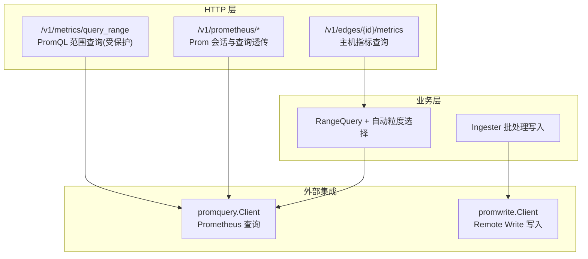
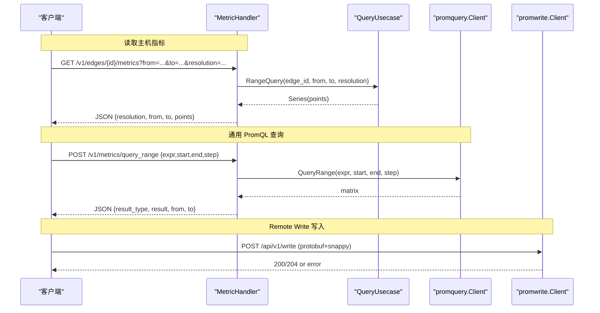
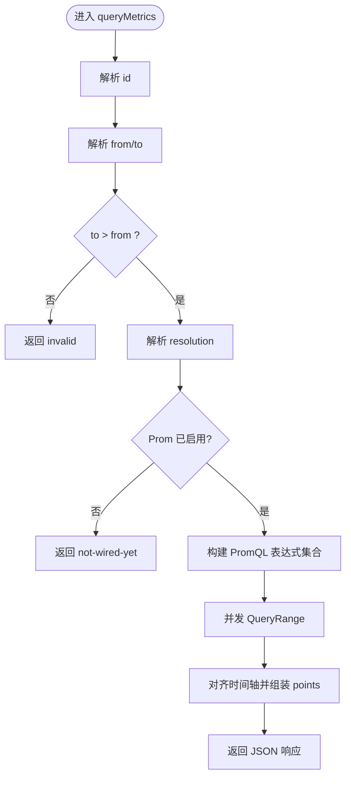
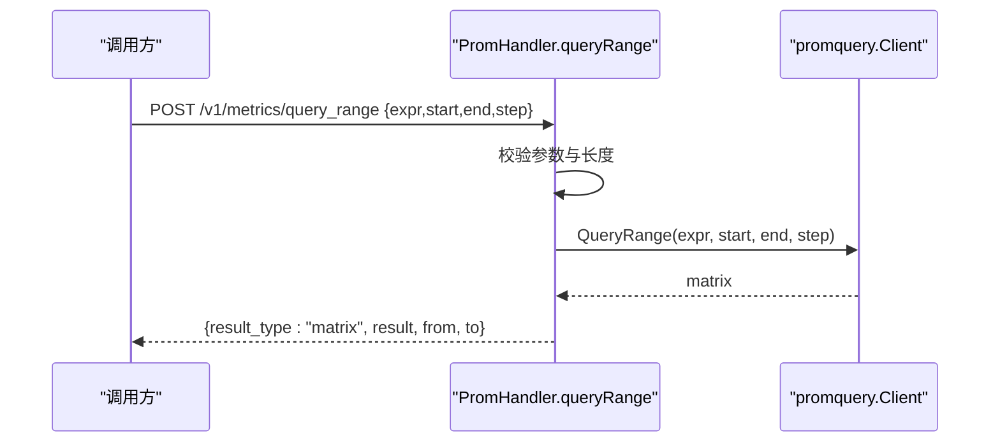
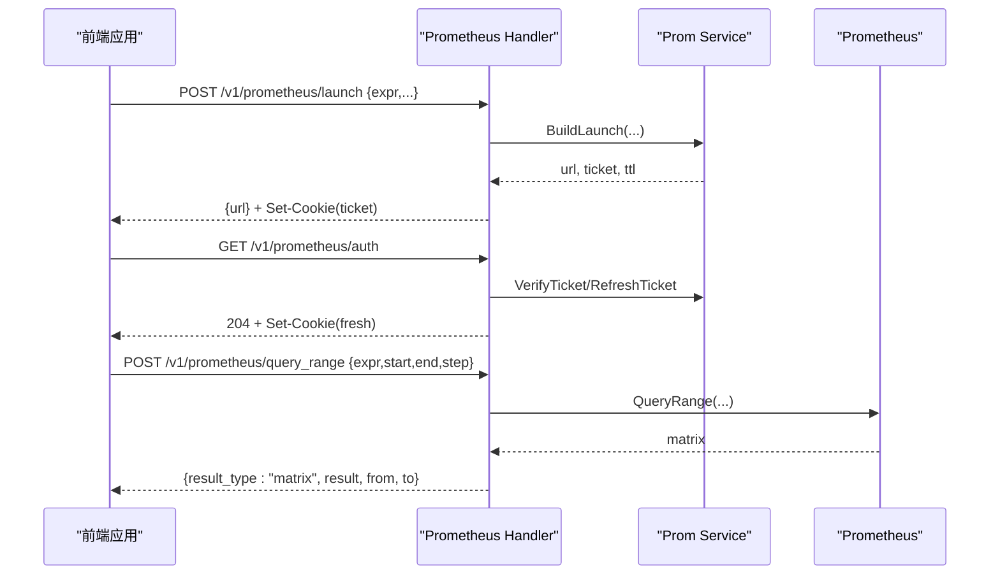
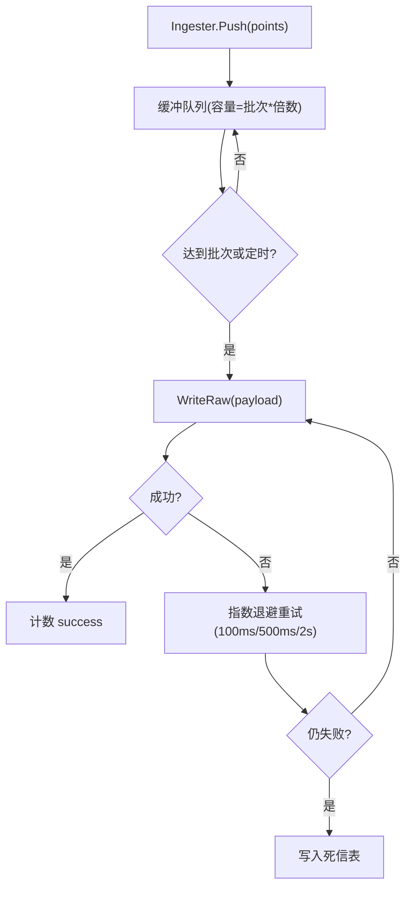
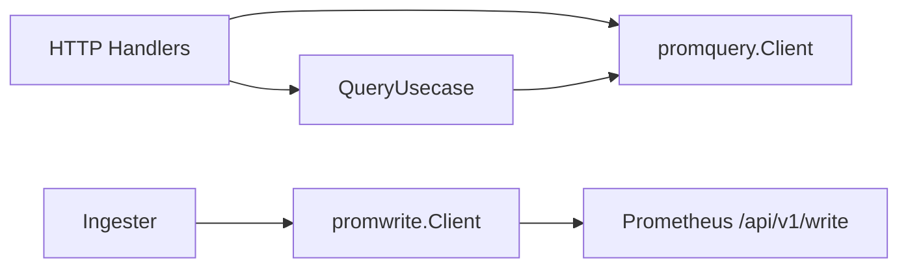

# 指标管理 API

<cite>
**本文引用的文件**
- [metric.proto](file://api/manager/metric/v1/metric.proto)
- [http.go](file://internal/manager/server/metric/http.go)
- [prom_handler.go](file://internal/manager/server/metric/prom_handler.go)
- [query.go](file://internal/manager/biz/metric/query.go)
- [ingester.go](file://internal/manager/biz/metric/ingester.go)
- [http.go](file://internal/manager/server/prometheus/http.go)
- [client.go](file://internal/pkg/promwrite/client.go)
</cite>

## 目录
1. [简介](#简介)
2. [项目结构](#项目结构)
3. [核心组件](#核心组件)
4. [架构总览](#架构总览)
5. [详细组件分析](#详细组件分析)
6. [依赖关系分析](#依赖关系分析)
7. [性能与保留策略](#性能与保留策略)
8. [故障排查指南](#故障排查指南)
9. [结论](#结论)
10. [附录：API 参考与示例](#附录api-参考与示例)

## 简介
本文件面向“指标管理”能力，覆盖指标的采集、写入、查询与分析相关 RESTful 端点。重点包括：
- 主机指标读取接口（按边缘节点维度查询时序数据）
- Prometheus Remote Write 写入通道（通过客户端将样本推送到远端 Prometheus）
- 通用 PromQL 查询透传（受认证保护，用于前端可视化）
- 自动粒度选择、聚合、错误处理与可观测性

该文档同时提供调用示例、数据保留策略说明、性能优化建议以及监控集成与故障排查指引。

## 项目结构
指标管理在代码中由三层组成：
- HTTP 层：注册路由、参数校验、统一错误响应
- 业务层：范围查询、自动粒度选择、批量写入与重试
- 外部集成层：Prometheus 查询客户端、Remote Write 客户端

图表来源
- [prom_handler.go:71-74](file://internal/manager/server/metric/prom_handler.go#L71-L74)
- [http.go:56-63](file://internal/manager/server/prometheus/http.go#L56-L63)
- [query.go:70-119](file://internal/manager/biz/metric/query.go#L70-L119)
- [ingester.go:120-161](file://internal/manager/biz/metric/ingester.go#L120-L161)
- [client.go:126-176](file://internal/pkg/promwrite/client.go#L126-L176)

章节来源
- [prom_handler.go:71-74](file://internal/manager/server/metric/prom_handler.go#L71-L74)
- [http.go:56-63](file://internal/manager/server/prometheus/http.go#L56-L63)
- [query.go:70-119](file://internal/manager/biz/metric/query.go#L70-L119)
- [ingester.go:120-161](file://internal/manager/biz/metric/ingester.go#L120-L161)
- [client.go:126-176](file://internal/pkg/promwrite/client.go#L126-L176)

## 核心组件
- 主机指标查询处理器
  - 路径：GET /v1/edges/{id}/metrics
  - 功能：根据 from/to/resolution 返回主机 CPU/内存/负载/网络/磁盘使用等时序点；支持自动粒度选择或指定步长
- PromQL 范围查询（受保护）
  - 路径：POST /v1/metrics/query_range
  - 功能：对上游 Prometheus 执行 PromQL 范围查询并返回矩阵结果
- Prometheus 会话与查询透传
  - 路径：POST /v1/prometheus/launch、GET /v1/prometheus/auth、POST /v1/prometheus/query_range
  - 功能：生成临时访问凭证、刷新会话、透传 PromQL 查询
- 指标写入（Remote Write）
  - 通过 promwrite.Client 将样本以 Protocol Buffers + Snappy 压缩 POST 到远端 Prometheus 的 /api/v1/write

章节来源
- [prom_handler.go:71-74](file://internal/manager/server/metric/prom_handler.go#L71-L74)
- [http.go:56-63](file://internal/manager/server/prometheus/http.go#L56-L63)
- [client.go:126-176](file://internal/pkg/promwrite/client.go#L126-L176)

## 架构总览
下图展示了从请求进入、业务处理到外部系统交互的完整链路。

图表来源
- [prom_handler.go:76-226](file://internal/manager/server/metric/prom_handler.go#L76-L226)
- [prom_handler.go:319-393](file://internal/manager/server/metric/prom_handler.go#L319-L393)
- [client.go:126-176](file://internal/pkg/promwrite/client.go#L126-L176)

## 详细组件分析

### 主机指标查询：GET /v1/edges/{id}/metrics
- 方法：GET
- URL：/v1/edges/{id}/metrics
- 查询参数
  - from：RFC3339 时间戳，必填
  - to：RFC3339 时间戳，必填且必须晚于 from
  - resolution：可选，支持 auto|raw|5m|1h 或 Go 时长字符串（如 15s、1m、5m 等），默认 auto
- 成功响应体字段
  - resolution：实际采用的粒度
  - from/to：请求时间边界
  - points：数组，每个元素包含 ts、cpu/mem/load/net/disk 等指标（原始采样 avg==max；聚合桶提供 avg/max 或 sum）
- 错误响应
  - 统一 JSON 格式：{error, code}
  - 常见 code：invalid、not-wired-yet、unauthorized、forbidden、edge-offline、not-found、internal
- 行为要点
  - 当未启用 Prometheus 时返回 not-wired-yet
  - 自动粒度选择：auto 会根据窗口大小选择 raw/5m/1h；也可传入具体 duration 作为 step
  - 标签隔离：服务端强制使用 edge_id 或 device_id 匹配，避免跨边泄露

图表来源
- [prom_handler.go:76-226](file://internal/manager/server/metric/prom_handler.go#L76-L226)
- [http.go:85-126](file://internal/manager/server/metric/http.go#L85-L126)

章节来源
- [prom_handler.go:76-226](file://internal/manager/server/metric/prom_handler.go#L76-L226)
- [http.go:85-126](file://internal/manager/server/metric/http.go#L85-L126)

### 通用 PromQL 范围查询：POST /v1/metrics/query_range
- 方法：POST
- URL：/v1/metrics/query_range
- 请求体（JSON）
  - expr：PromQL 表达式，必填，长度限制 4KB
  - start/end：RFC3339 时间戳，必填且 end > start
  - step：Go 时长字符串，必填且 > 0
- 成功响应体字段
  - result_type：固定为 "matrix"
  - result：Prometheus 矩阵结果原样透传
  - from/to：请求时间边界
- 错误处理
  - 参数校验失败返回 invalid
  - 未启用 Prometheus 返回 not-wired-yet
  - 其他错误包装为 invalid 并附带上游错误信息

图表来源
- [prom_handler.go:319-393](file://internal/manager/server/metric/prom_handler.go#L319-L393)

章节来源
- [prom_handler.go:319-393](file://internal/manager/server/metric/prom_handler.go#L319-L393)

### Prometheus 会话与查询透传：/v1/prometheus/*
- POST /v1/prometheus/launch
  - 作用：为当前登录用户生成一个短期有效的 Prometheus 访问票据（Cookie）
  - 请求体：expr、range_input、end_input、step_input
  - 响应：{url}，浏览器重定向至带票据的 Prometheus UI
- GET /v1/prometheus/auth
  - 作用：验证并滑动刷新票据 Cookie，保持 Grafana/SPA 面板持续可用
  - 响应：204 No Content
- POST /v1/prometheus/query_range
  - 作用：受保护的 PromQL 范围查询透传，返回 matrix 结果
  - 请求体：expr、start、end、step（同 /v1/metrics/query_range）
  - 响应：{result_type, result, from, to}

图表来源
- [http.go:56-63](file://internal/manager/server/prometheus/http.go#L56-L63)
- [http.go:76-137](file://internal/manager/server/prometheus/http.go#L76-L137)
- [http.go:166-243](file://internal/manager/server/prometheus/http.go#L166-L243)

章节来源
- [http.go:56-63](file://internal/manager/server/prometheus/http.go#L56-L63)
- [http.go:76-137](file://internal/manager/server/prometheus/http.go#L76-L137)
- [http.go:166-243](file://internal/manager/server/prometheus/http.go#L166-L243)

### 指标写入：Prometheus Remote Write
- 协议：Protocol Buffers + Snappy 压缩
- 目标端点：远端 Prometheus 的 /api/v1/write（由 EndpointResolver 动态解析）
- 客户端：promwrite.Client
  - 每次 Write 会构造 TimeSeries 列表并发送 POST 请求
  - 超时：默认 10s（可通过注入 http.Client 调整）
  - 错误：非 2xx 会记录日志并返回错误
- 典型用法
  - 由 Edge Agent 或内部 Ingester 将主机指标转换为 Sample 后调用 Write
  - 上层 Ingester 负责批处理、退避重试与死信落盘

图表来源
- [ingester.go:120-161](file://internal/manager/biz/metric/ingester.go#L120-L161)
- [ingester.go:200-247](file://internal/manager/biz/metric/ingester.go#L200-L247)
- [client.go:126-176](file://internal/pkg/promwrite/client.go#L126-L176)

章节来源
- [ingester.go:120-161](file://internal/manager/biz/metric/ingester.go#L120-L161)
- [ingester.go:200-247](file://internal/manager/biz/metric/ingester.go#L200-L247)
- [client.go:126-176](file://internal/pkg/promwrite/client.go#L126-L176)

## 依赖关系分析
- HTTP 层依赖业务层与外部客户端
  - metric handler 依赖 promquery.Client 进行查询
  - prometheus handler 依赖 promquery.Client 与 promwrite.Client（间接通过服务层）
- 业务层封装了查询与写入策略
  - QueryUsecase 负责范围校验与自动粒度选择
  - Ingester 负责批处理、重试与死信
- 外部依赖
  - Prometheus：查询与远程写入
  - 数据库：历史聚合表（由旧路径或 ingester 写入，读路径已由 Prom 替代）

图表来源
- [prom_handler.go:71-74](file://internal/manager/server/metric/prom_handler.go#L71-L74)
- [query.go:70-119](file://internal/manager/biz/metric/query.go#L70-L119)
- [ingester.go:120-161](file://internal/manager/biz/metric/ingester.go#L120-L161)
- [client.go:126-176](file://internal/pkg/promwrite/client.go#L126-L176)

章节来源
- [prom_handler.go:71-74](file://internal/manager/server/metric/prom_handler.go#L71-L74)
- [query.go:70-119](file://internal/manager/biz/metric/query.go#L70-L119)
- [ingester.go:120-161](file://internal/manager/biz/metric/ingester.go#L120-L161)
- [client.go:126-176](file://internal/pkg/promwrite/client.go#L126-L176)

## 性能与保留策略
- 自动粒度选择
  - 窗口 ≤ 6h → raw（10s 级）
  - 窗口 ≤ 7d → 5m 聚合
  - 窗口 > 7d → 1h 聚合
  - 也支持传入具体 step（如 15s、1m、5m 等）
- 查询性能
  - 主机指标查询并发发起多个 PromQL range 查询，合并对齐时间轴
  - 查询超时上限 30s，防止慢查询阻塞
- 写入性能
  - Ingester 批处理默认 500 条/批，定时 5s 刷新
  - 写失败采用指数退避重试，最终失败写入死信表
  - Remote Write 单次请求默认 10s 超时
- 数据保留
  - 历史聚合粒度由自动选择决定；长期数据走 1h 聚合
  - 死信表用于异常批次的兜底保存，便于后续恢复

章节来源
- [query.go:14-36](file://internal/manager/biz/metric/query.go#L14-L36)
- [query.go:70-119](file://internal/manager/biz/metric/query.go#L70-L119)
- [prom_handler.go:98-107](file://internal/manager/server/metric/prom_handler.go#L98-L107)
- [prom_handler.go:162-163](file://internal/manager/server/metric/prom_handler.go#L162-L163)
- [ingester.go:45-57](file://internal/manager/biz/metric/ingester.go#L45-L57)
- [ingester.go:200-247](file://internal/manager/biz/metric/ingester.go#L200-L247)
- [client.go:50-54](file://internal/pkg/promwrite/client.go#L50-L54)

## 故障排查指南
- 常见问题定位
  - 空面板/无数据：检查 edge_id 与 device_id 是否一致；若不一致需通过 HostDeviceResolver 映射
  - 未启用 Prometheus：返回 not-wired-yet，需确认配置与连接
  - 参数错误：检查 from/to 顺序、step 是否为正数、expr 长度是否超限
  - 写入失败：关注 Ingester 的 dropped 与 flush_failures 指标，查看死信表
- 关键指标与日志
  - ongrid_ingest_writes_total：写入成功/失败计数
  - ongrid_ingest_flush_failures_total：刷新失败原因分类
  - ongrid_ingest_dropped_total：缓冲区满导致丢弃
  - ongrid_ingest_batch_size：批大小分布
- 错误码映射
  - invalid：参数不合法
  - unauthorized/forbidden：鉴权失败
  - not-wired-yet：Prometheus 未启用或未连接
  - edge-offline/not-found/internal：其他业务或系统错误

章节来源
- [prom_handler.go:114-130](file://internal/manager/server/metric/prom_handler.go#L114-L130)
- [prom_handler.go:319-393](file://internal/manager/server/metric/prom_handler.go#L319-L393)
- [http.go:226-258](file://internal/manager/server/metric/http.go#L226-L258)
- [ingester.go:59-107](file://internal/manager/biz/metric/ingester.go#L59-L107)
- [ingester.go:173-198](file://internal/manager/biz/metric/ingester.go#L173-L198)
- [ingester.go:200-247](file://internal/manager/biz/metric/ingester.go#L200-L247)

## 结论
本指标管理 API 提供了统一的指标读取与查询入口，并通过自动粒度选择与并发查询提升性能；写入侧通过 Ingester 批处理与重试机制保障可靠性。Prometheus 集成既支持直接查询，也支持通过会话机制安全地暴露查询能力。结合错误码与指标体系，便于快速定位问题与优化性能。

## 附录：API 参考与示例

### 主机指标查询
- 端点：GET /v1/edges/{id}/metrics
- 参数
  - from：RFC3339 时间戳
  - to：RFC3339 时间戳，必须晚于 from
  - resolution：auto|raw|5m|1h 或时长（如 15s、1m、5m）
- 响应
  - resolution：实际粒度
  - from/to：时间边界
  - points：时序点数组（含 cpu/mem/load/net/disk 等）
- 示例
  - curl -G "https://host/api/v1/edges/123/metrics" --data-urlencode "from=2025-01-01T00:00:00Z" --data-urlencode "to=2025-01-01T01:00:00Z" --data-urlencode "resolution=5m"

章节来源
- [prom_handler.go:76-226](file://internal/manager/server/metric/prom_handler.go#L76-L226)
- [http.go:85-126](file://internal/manager/server/metric/http.go#L85-L126)

### PromQL 范围查询（受保护）
- 端点：POST /v1/metrics/query_range
- 请求体
  - expr：PromQL 表达式（≤4KB）
  - start/end：RFC3339 时间戳，end > start
  - step：时长字符串，> 0
- 响应
  - result_type："matrix"
  - result：Prometheus 矩阵结果
  - from/to：时间边界
- 示例
  - curl -X POST "https://host/api/v1/metrics/query_range" \
      -H "Content-Type: application/json" \
      -d '{"expr":"node_cpu_seconds_total","start":"2025-01-01T00:00:00Z","end":"2025-01-01T01:00:00Z","step":"1m"}'

章节来源
- [prom_handler.go:319-393](file://internal/manager/server/metric/prom_handler.go#L319-L393)

### Prometheus 会话与查询透传
- 生成票据：POST /v1/prometheus/launch
  - 请求体：expr、range_input、end_input、step_input
  - 响应：{url}，设置 Cookie 票据
- 刷新票据：GET /v1/prometheus/auth
  - 响应：204 No Content，可能刷新 Cookie
- 查询透传：POST /v1/prometheus/query_range
  - 请求体：expr、start、end、step
  - 响应：{result_type:"matrix", result, from, to}
- 示例
  - launch：curl -X POST "https://host/api/v1/prometheus/launch" -H "Content-Type: application/json" -d '{"expr":"up"}'
  - auth：curl -G "https://host/api/v1/prometheus/auth"
  - query_range：curl -X POST "https://host/api/v1/prometheus/query_range" -H "Content-Type: application/json" -d '{"expr":"up","start":"2025-01-01T00:00:00Z","end":"2025-01-01T01:00:00Z","step":"1m"}'

章节来源
- [http.go:56-63](file://internal/manager/server/prometheus/http.go#L56-L63)
- [http.go:76-137](file://internal/manager/server/prometheus/http.go#L76-L137)
- [http.go:166-243](file://internal/manager/server/prometheus/http.go#L166-L243)

### 指标上报（Remote Write）
- 协议：Protocol Buffers + Snappy 压缩
- 目标：远端 Prometheus /api/v1/write
- 客户端：promwrite.Client
- 示例（概念）
  - 构造 Sample（labels、value、ts_ms）
  - 调用 Write(samples)
  - 处理 200/204 成功或非 2xx 错误

章节来源
- [client.go:126-176](file://internal/pkg/promwrite/client.go#L126-L176)