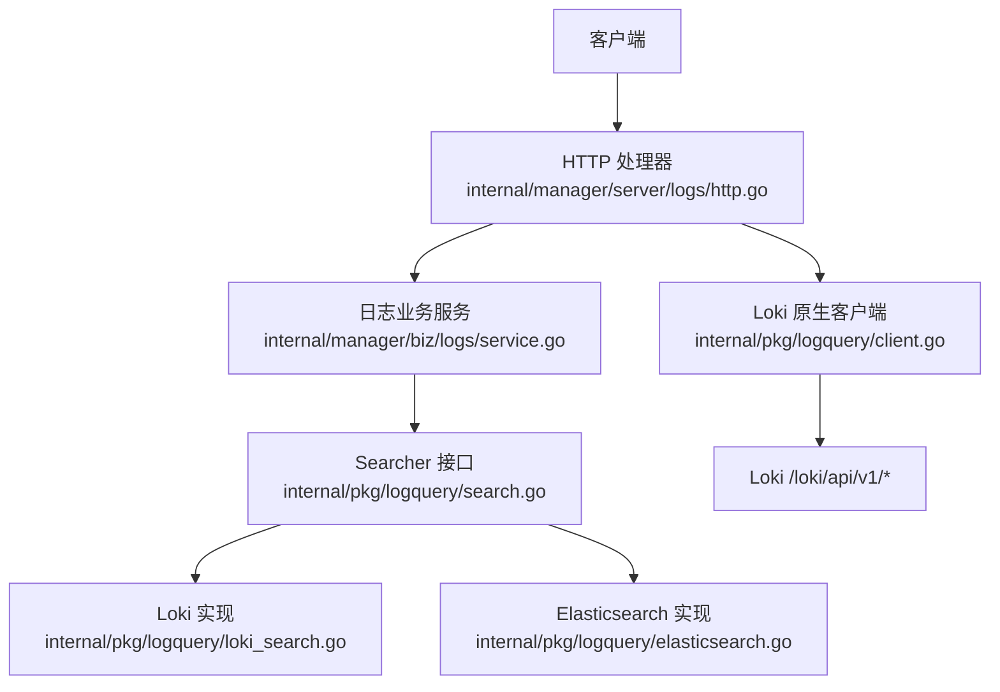
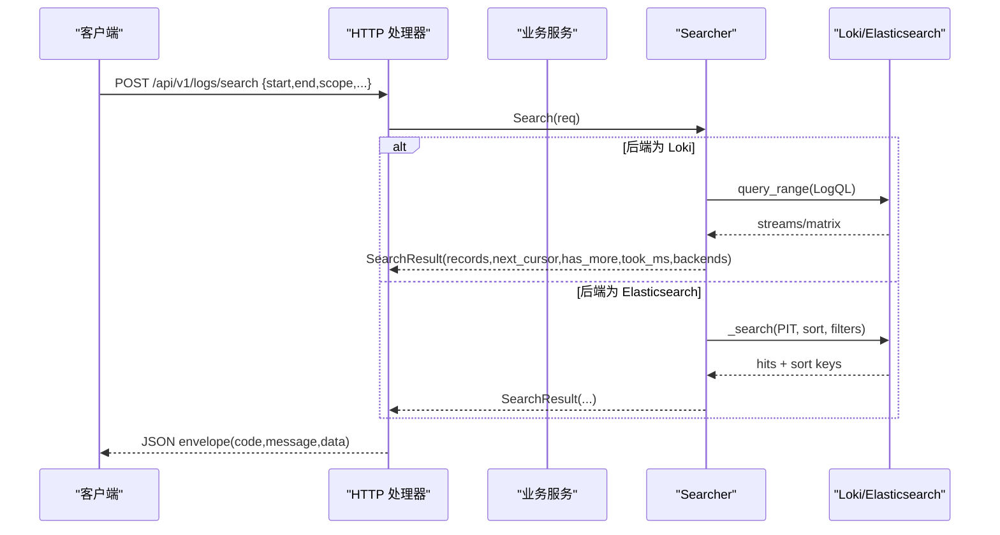
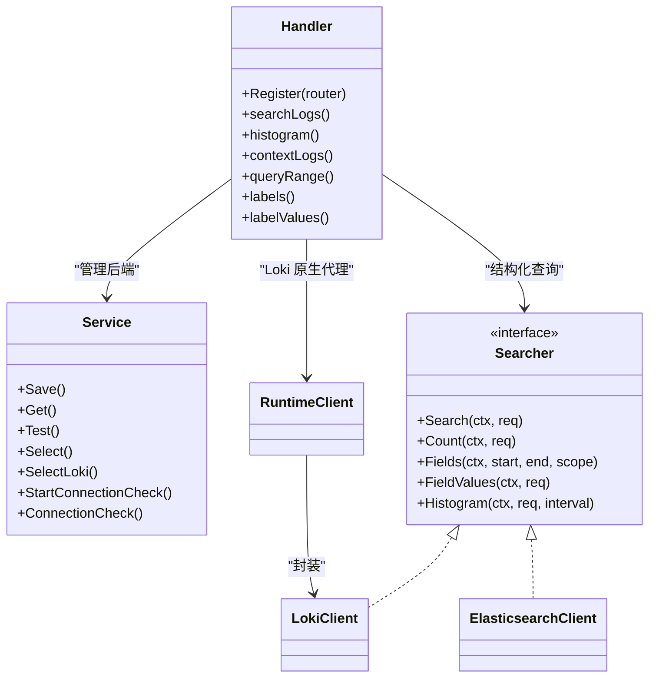

# 日志查询 API

<cite>
**本文引用的文件**
- [logs.proto](file://api/manager/logs/v1/logs.proto)
- [search.go](file://internal/pkg/logquery/search.go)
- [client.go](file://internal/pkg/logquery/client.go)
- [runtime_client.go](file://internal/pkg/logquery/runtime_client.go)
- [loki_search.go](file://internal/pkg/logquery/loki_search.go)
- [elasticsearch.go](file://internal/pkg/logquery/elasticsearch.go)
- [logql_portable.go](file://internal/pkg/logquery/logql_portable.go)
- [http.go](file://internal/manager/server/logs/http.go)
- [service.go](file://internal/manager/biz/logs/service.go)
</cite>

## 目录
1. [简介](#简介)
2. [项目结构](#项目结构)
3. [核心组件](#核心组件)
4. [架构总览](#架构总览)
5. [详细组件分析](#详细组件分析)
6. [依赖关系分析](#依赖关系分析)
7. [性能与优化](#性能与优化)
8. [故障排除指南](#故障排除指南)
9. [结论](#结论)
10. [附录：API 参考与示例](#附录api-参考与示例)

## 简介
本文件为“日志查询 API”的权威文档，覆盖日志搜索、查询与分析相关的 RESTful 端点；说明 HTTP 方法、URL 模式、请求参数与响应格式；涵盖 LogQL 查询语法、日志过滤、聚合分析；记录日志后端配置、数据源管理与查询性能优化；提供常用场景的调用示例（搜索、时间范围、字段过滤等）；说明分页处理、结果排序与导出方式；并给出查询优化建议与故障排除指南。

## 项目结构
日志查询能力由三层构成：
- 管理面 HTTP 服务层：暴露 REST 接口，负责鉴权、限流、参数校验与错误映射。
- 业务逻辑与服务编排层：管理日志后端配置、选择、连通性检查、Grafana 同步等。
- 查询适配层：后端无关的 Searcher 抽象，分别以 Loki 和 Elasticsearch 实现，统一对外行为。

图表来源
- [http.go:100-118](file://internal/manager/server/logs/http.go#L100-L118)
- [service.go:230-265](file://internal/manager/biz/logs/service.go#L230-L265)
- [search.go:138-159](file://internal/pkg/logquery/search.go#L138-L159)
- [loki_search.go:30-118](file://internal/pkg/logquery/loki_search.go#L30-L118)
- [elasticsearch.go:88-175](file://internal/pkg/logquery/elasticsearch.go#L88-L175)
- [client.go:124-171](file://internal/pkg/logquery/client.go#L124-L171)

章节来源
- [http.go:100-118](file://internal/manager/server/logs/http.go#L100-L118)
- [service.go:230-265](file://internal/manager/biz/logs/service.go#L230-L265)
- [search.go:138-159](file://internal/pkg/logquery/search.go#L138-L159)

## 核心组件
- 后端无关的日志查询接口 Searcher：定义 Search、Count、Fields、FieldValues、Histogram 等方法，屏蔽 Loki/Elasticsearch 差异。
- Loki 适配器：基于 /loki/api/v1/query_range、/label/* 等接口实现搜索、计数、直方图、字段值枚举。
- Elasticsearch 适配器：基于固定索引模式与 PIT（Point-in-Time）实现分页搜索、分组计数、直方图。
- 运行时客户端 RuntimeClient：支持动态解析 Loki 端点、Basic Auth、TLS 设置，缓存 HTTP 客户端。
- HTTP 处理器：注册 REST 路由，封装请求/响应、限流、超时、错误码映射。
- 业务服务：管理外部日志后端（Elasticsearch）配置、选择、测试、连接检查，以及内置 Loki 切换。

章节来源
- [search.go:138-159](file://internal/pkg/logquery/search.go#L138-L159)
- [loki_search.go:30-118](file://internal/pkg/logquery/loki_search.go#L30-L118)
- [elasticsearch.go:88-175](file://internal/pkg/logquery/elasticsearch.go#L88-L175)
- [runtime_client.go:16-51](file://internal/pkg/logquery/runtime_client.go#L16-L51)
- [http.go:100-118](file://internal/manager/server/logs/http.go#L100-L118)
- [service.go:303-507](file://internal/manager/biz/logs/service.go#L303-L507)

## 架构总览
系统通过统一的 SearchRequest/SearchResult 模型屏蔽后端差异，REST 层仅关注协议与策略；业务层负责后端生命周期管理；查询层按当前选定的后端执行具体查询。

图表来源
- [http.go:310-332](file://internal/manager/server/logs/http.go#L310-L332)
- [loki_search.go:30-118](file://internal/pkg/logquery/loki_search.go#L30-L118)
- [elasticsearch.go:88-175](file://internal/pkg/logquery/elasticsearch.go#L88-L175)

## 详细组件分析

### REST 端点总览
所有端点均返回统一信封：{code, message, data}。

- 搜索与游标
  - POST /api/v1/logs/search
    - 请求体：SearchRequest（start/end/scope/keywords/filters/limit/cursor/direction）
    - 响应：SearchResult（records/next_cursor/has_more/took_ms/backends）
  - POST /api/v1/logs/cursor/close
    - 请求体：{cursor}
    - 作用：释放后端侧游标资源（如 Elasticsearch PIT）

- 元数据与辅助
  - GET /api/v1/logs/fields?start&end
    - 返回：允许查询的字段列表（name/type/searchable/aggregatable）
  - POST /api/v1/logs/field-values
    - 请求体：{field,start,end,scope,limit}
    - 返回：字段取值集合（受限于 limit）
  - POST /api/v1/logs/histogram
    - 请求体：{search,interval}
    - 返回：时间桶统计（start,count）
  - POST /api/v1/logs/context
    - 请求体：{timestamp,scope,before,after}
    - 返回：指定时间点前后若干条日志

- 后端管理（需管理员角色）
  - GET /api/v1/logs/backend
  - PUT /api/v1/logs/backend
  - POST /api/v1/logs/backend/{id}/test
  - POST /api/v1/logs/backend/{id}/select
  - POST /api/v1/logs/backend/loki/select
  - POST /api/v1/logs/backend/connection-check
  - GET /api/v1/logs/backend/connection-check
  - POST /api/v1/logs/backend/{id}/connection-check
  - GET /api/v1/logs/backend/{id}/connection-check

- 原生 Loki 代理（供 SPA 直接查询内置 Loki）
  - GET /api/v1/logs/query_range?query&start&end&limit&step&direction
  - GET /api/v1/logs/labels?start&end
  - GET /api/v1/logs/labels/{name}/values?start&end

章节来源
- [http.go:100-118](file://internal/manager/server/logs/http.go#L100-L118)
- [http.go:310-332](file://internal/manager/server/logs/http.go#L310-L332)
- [http.go:403-421](file://internal/manager/server/logs/http.go#L403-L421)
- [http.go:427-449](file://internal/manager/server/logs/http.go#L427-L449)
- [http.go:455-482](file://internal/manager/server/logs/http.go#L455-L482)
- [http.go:488-546](file://internal/manager/server/logs/http.go#L488-L546)
- [http.go:555-658](file://internal/manager/server/logs/http.go#L555-L658)
- [http.go:125-282](file://internal/manager/server/logs/http.go#L125-L282)

### 搜索请求与响应模型
- SearchRequest
  - start/end：必填，时间窗口（最大 30 天）
  - scope：设备/集群/命名空间/工作负载/Pod/容器/节点/服务名/来源/级别/文件/单元等维度过滤
  - keywords：include/exclude/mode（any/all/phrase）
  - filters：字段级过滤（eq/neq/in/exists/prefix），最多 20 个
  - limit：默认 200，最大 1000
  - cursor：分页游标
  - direction：backward/forward，默认 backward
- SearchResult
  - records：日志条目（id/timestamp/message/severity_text/severity_number/backend/attributes/resource_attributes/trace_id/span_id/observed_timestamp）
  - next_cursor：下一页游标
  - has_more：是否还有更多
  - took_ms：耗时毫秒
  - backends：实际使用的后端名称

章节来源
- [search.go:78-109](file://internal/pkg/logquery/search.go#L78-L109)
- [search.go:257-338](file://internal/pkg/logquery/search.go#L257-L338)
- [search.go:368-420](file://internal/pkg/logquery/search.go#L368-L420)

### 字段与过滤规则
- 允许字段：device_id、cluster_id、namespace、workload、pod、container、node、service_name、source_id、level、file、unit、trace_id、span_id、message
- 字段类型与可聚合性由 AllowedFields() 暴露
- 过滤操作符：
  - eq/neq：单值或列表
  - in：多值匹配
  - exists：存在性判断
  - prefix：前缀匹配
- 关键词模式：
  - any：任一包含
  - all：全部包含
  - phrase：短语匹配

章节来源
- [search.go:368-420](file://internal/pkg/logquery/search.go#L368-L420)
- [search.go:24-47](file://internal/pkg/logquery/search.go#L24-L47)

### 分页与排序
- 方向：backward（默认，最新在前）、forward
- 游标：
  - Loki：基于时间戳+skip 的轻量游标
  - Elasticsearch：基于 search_after + PIT 的稳定游标
- 关闭游标：POST /api/v1/logs/cursor/close（释放服务端状态）

章节来源
- [loki_search.go:30-118](file://internal/pkg/logquery/loki_search.go#L30-L118)
- [elasticsearch.go:88-175](file://internal/pkg/logquery/elasticsearch.go#L88-L175)
- [http.go:334-355](file://internal/manager/server/logs/http.go#L334-L355)

### 聚合与直方图
- 直方图：POST /api/v1/logs/histogram，传入 interval（如 1m/5m/1h）
- 分组计数：内部用于告警评估，支持 group_by 维度（device_id/cluster_id/source_id/namespace/service_name），上限 5 维，最多 10000 组

章节来源
- [http.go:455-482](file://internal/manager/server/logs/http.go#L455-L482)
- [search.go:161-184](file://internal/pkg/logquery/search.go#L161-L184)
- [loki_search.go:130-230](file://internal/pkg/logquery/loki_search.go#L130-L230)
- [elasticsearch.go:214-302](file://internal/pkg/logquery/elasticsearch.go#L214-L302)

### LogQL 查询支持
- 当使用内置 Loki 时，可通过 /api/v1/logs/query_range 直接提交 LogQL 查询（含 metric 表达式）。
- 当使用 Elasticsearch 时，系统提供“可移植 LogQL 子集”编译为后端无关的 SearchRequest，限制如下：
  - 必须以流选择器开头 {label=value...}
  - 支持 =、!=、=~、!~ 标签匹配
  - 支持 |=、!=、|~、!~ 行过滤
  - 不支持 parser/unwrap/metric 表达式（仅在 Loki 可用）
  - 大小写不敏感正则仅 Loki 可用
  - 限制查询长度与 limit（最大 5000）

章节来源
- [http.go:555-615](file://internal/manager/server/logs/http.go#L555-L615)
- [logql_portable.go:21-84](file://internal/pkg/logquery/logql_portable.go#L21-L84)
- [logql_portable.go:114-174](file://internal/pkg/logquery/logql_portable.go#L114-L174)
- [logql_portable.go:262-320](file://internal/pkg/logquery/logql_portable.go#L262-L320)

### 后端配置与管理
- 支持的日志后端：
  - 内置 Loki（无需配置，直接选择）
  - 外部 Elasticsearch（需配置 endpoint、index pattern、API key、CA/TLS 等）
- 关键端点：
  - GET/PUT /api/v1/logs/backend：获取/保存后端配置
  - POST /api/v1/logs/backend/{id}/test：测试连通性与权限
  - POST /api/v1/logs/backend/{id}/select：选择生效
  - POST /api/v1/logs/backend/loki/select：切换到内置 Loki
  - connection-check：启动/查询各 Edge 的真实写入连通性

- 安全与凭据：
  - 读写 API Key 必须不同
  - 凭据通过引用存储，避免明文落库
  - 可选自定义 CA、TLS 跳过验证（仅测试环境）

章节来源
- [http.go:125-282](file://internal/manager/server/logs/http.go#L125-L282)
- [service.go:303-507](file://internal/manager/biz/logs/service.go#L303-L507)
- [service.go:705-739](file://internal/manager/biz/logs/service.go#L705-L739)

### 数据源与运行时客户端
- RuntimeClient：每次调用前解析 Loki 端点、Basic Auth、TLS 设置，缓存 HTTP 客户端，变更时重建。
- Base URL 解析：支持静态或运行时解析，便于热更新。
- 单租户头：对 Loki 读取请求注入 X-Scope-OrgID: ongrid。

章节来源
- [runtime_client.go:16-51](file://internal/pkg/logquery/runtime_client.go#L16-L51)
- [runtime_client.go:53-97](file://internal/pkg/logquery/runtime_client.go#L53-L97)
- [client.go:46-51](file://internal/pkg/logquery/client.go#L46-L51)
- [client.go:124-171](file://internal/pkg/logquery/client.go#L124-L171)

## 依赖关系分析
- HTTP 处理器依赖业务服务与 Searcher；业务服务依赖仓库、凭据解析、Grafana 同步等。
- Searcher 是 Loki 与 Elasticsearch 的共同抽象，确保上层稳定。
- 运行时客户端解耦 Loki 地址与认证，支持热更新。

图表来源
- [http.go:100-118](file://internal/manager/server/logs/http.go#L100-L118)
- [service.go:230-265](file://internal/manager/biz/logs/service.go#L230-L265)
- [search.go:138-159](file://internal/pkg/logquery/search.go#L138-L159)
- [runtime_client.go:16-51](file://internal/pkg/logquery/runtime_client.go#L16-L51)

章节来源
- [http.go:100-118](file://internal/manager/server/logs/http.go#L100-L118)
- [service.go:230-265](file://internal/manager/biz/logs/service.go#L230-L265)
- [search.go:138-159](file://internal/pkg/logquery/search.go#L138-L159)

## 性能与优化
- 时间窗口限制：最大 30 天，避免全量扫描。
- 限制与并发：
  - 单次搜索 limit 最大 1000，Loki 原生查询 limit 最大 5000
  - 结构化搜索并发上限 8，超限时返回 429 Retry-After
- 游标与分页：
  - 优先使用 cursor 进行分页，减少重复扫描
  - Elasticsearch 使用 PIT + search_after，避免深翻页开销
- 聚合优化：
  - 直方图使用 count_over_time/date_histogram 高效聚合
  - 分组计数限制维度数量与组数，防止高基数爆炸
- 网络与内存：
  - 响应体限制（Loki 8MiB，ES 16MiB/32MiB）
  - 合理设置 step 与 limit，避免大结果集

章节来源
- [search.go:13-22](file://internal/pkg/logquery/search.go#L13-L22)
- [http.go:35-37](file://internal/manager/server/logs/http.go#L35-L37)
- [http.go:571-579](file://internal/manager/server/logs/http.go#L571-L579)
- [client.go:257-270](file://internal/pkg/logquery/client.go#L257-L270)
- [elasticsearch.go:19-31](file://internal/pkg/logquery/elasticsearch.go#L19-L31)

## 故障排除指南
- 常见错误码与含义
  - LOG_QUERY_INVALID：请求参数非法（时间范围、limit、字段、过滤器等）
  - LOG_QUERY_TIMEOUT：查询超时
  - LOG_BACKEND_ERROR：后端请求失败
  - LOG_BACKEND_INVALID：后端配置无效
  - LOG_BACKEND_NOT_FOUND：未找到后端
  - LOG_BACKEND_CONFLICT：冲突（如读写密钥相同）
  - UNAUTHORIZED/FORBIDDEN：未认证或非管理员角色
- 排查步骤
  - 确认 start/end 有效且不超过最大窗口
  - 检查 scope/filters/keywords 是否符合白名单与约束
  - 使用 /api/v1/logs/fields 与 /api/v1/logs/field-values 验证字段可用性
  - 使用 /api/v1/logs/backend/{id}/test 验证后端连通性与权限
  - 使用 connection-check 查看各 Edge 真实写入状态
  - 对于 Elasticsearch，确认 index pattern、API key 权限与版本要求（8.16+）

章节来源
- [http.go:731-784](file://internal/manager/server/logs/http.go#L731-L784)
- [service.go:450-507](file://internal/manager/biz/logs/service.go#L450-L507)
- [elasticsearch.go:426-520](file://internal/pkg/logquery/elasticsearch.go#L426-L520)

## 结论
该日志查询 API 通过后端无关的 Searcher 抽象，统一了 Loki 与 Elasticsearch 的行为，提供稳定的 REST 接口与强大的过滤、聚合能力。结合严格的参数校验、分页游标、并发控制与资源保护，既满足日常排障需求，也为告警与 AIOps 提供了可靠的数据基础。

## 附录：API 参考与示例

### 常用场景与示例
- 搜索最近 1 小时的关键字日志
  - POST /api/v1/logs/search
  - 请求体：
    - start: 当前时间 -1h
    - end: 当前时间
    - keywords.include: ["error"]
    - keywords.mode: "any"
    - limit: 100
    - direction: "backward"
  - 响应：records/next_cursor/has_more/took_ms/backends

- 按命名空间与 Pod 过滤
  - POST /api/v1/logs/search
  - 请求体：
    - scope.namespaces: ["default"]
    - scope.pods: ["app-xxx-yyy"]
    - start/end: 指定时间窗口
    - limit: 200

- 字段值枚举
  - POST /api/v1/logs/field-values
  - 请求体：
    - field: "level"
    - start/end: 时间窗口
    - limit: 50

- 直方图聚合
  - POST /api/v1/logs/histogram
  - 请求体：
    - search: {start,end,scope,keywords,filters}
    - interval: "5m"

- 上下文日志
  - POST /api/v1/logs/context
  - 请求体：
    - timestamp: 目标时间
    - before: 50
    - after: 50
    - scope: 可选

- 原生 LogQL 查询（仅内置 Loki）
  - GET /api/v1/logs/query_range?query={job="app"} |~ "error"&start=...&end=...&limit=1000&direction=backward

- 分页
  - 首次请求后，若 has_more=true，则使用 next_cursor 发起下一次搜索
  - 完成后调用 /api/v1/logs/cursor/close 释放游标

章节来源
- [http.go:310-332](file://internal/manager/server/logs/http.go#L310-L332)
- [http.go:427-449](file://internal/manager/server/logs/http.go#L427-L449)
- [http.go:455-482](file://internal/manager/server/logs/http.go#L455-L482)
- [http.go:488-546](file://internal/manager/server/logs/http.go#L488-L546)
- [http.go:555-615](file://internal/manager/server/logs/http.go#L555-L615)
- [http.go:334-355](file://internal/manager/server/logs/http.go#L334-L355)