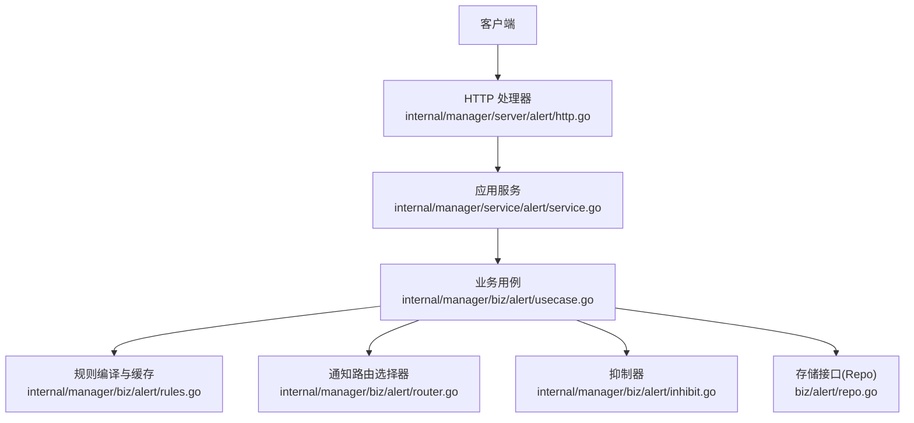
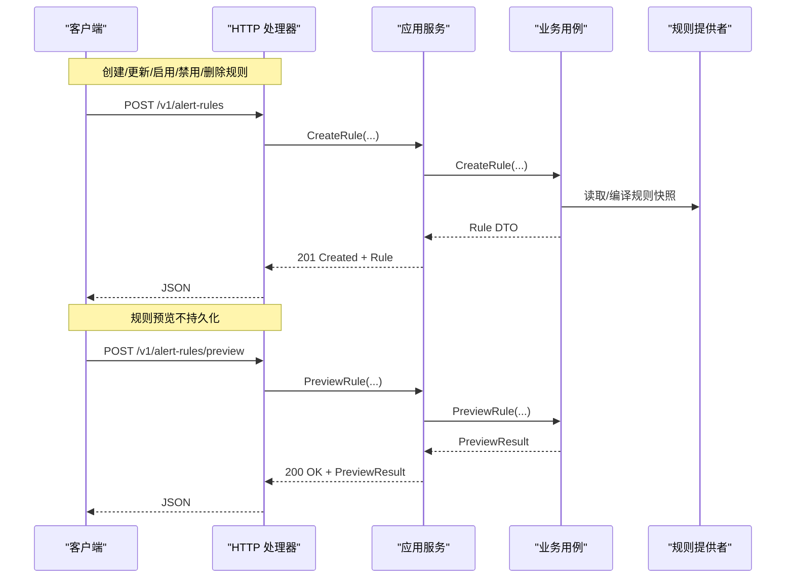
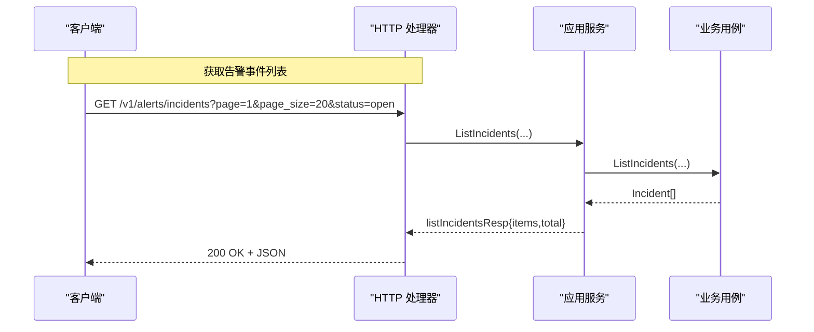
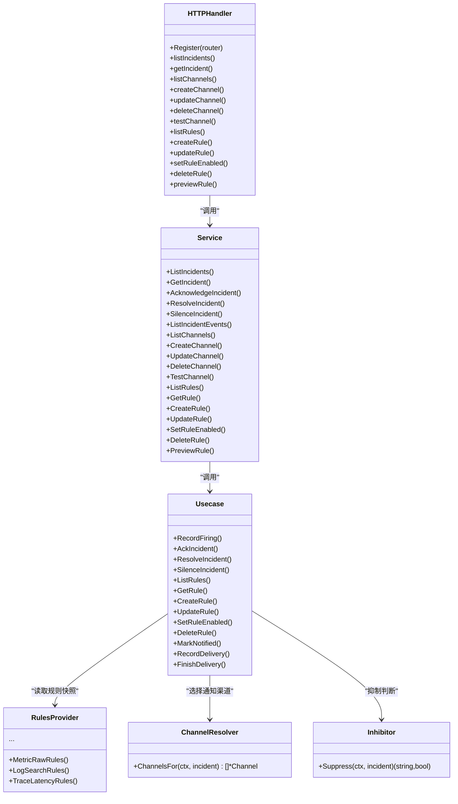

# 监控告警 API

<cite>
**本文引用的文件**
- [alert.proto](file://api/manager/alert/v1/alert.proto)
- [notification.proto](file://api/manager/notification/v1/notification.proto)
- [http.go](file://internal/manager/server/alert/http.go)
- [service.go](file://internal/manager/service/alert/service.go)
- [usecase.go](file://internal/manager/biz/alert/usecase.go)
- [rules.go](file://internal/manager/biz/alert/rules.go)
- [router.go](file://internal/manager/biz/alert/router.go)
- [inhibit.go](file://internal/manager/biz/alert/inhibit.go)
</cite>

## 目录
1. [简介](#简介)
2. [项目结构](#项目结构)
3. [核心组件](#核心组件)
4. [架构总览](#架构总览)
5. [详细组件分析](#详细组件分析)
6. [依赖关系分析](#依赖关系分析)
7. [性能与速率限制](#性能与速率限制)
8. [故障排查指南](#故障排查指南)
9. [结论](#结论)
10. [附录：API 参考与示例](#附录api-参考与示例)

## 简介
本文件为“监控告警”子系统的 RESTful API 文档，覆盖告警规则管理、告警事件查询与管理、通知渠道配置与测试等能力。文档基于后端 HTTP 路由与服务实现，结合 Protobuf 定义，说明各端点的 HTTP 方法、URL 模式、请求/响应结构与认证方式，并给出常用调用示例。同时解释告警去重、抑制、静音（silence）与通知路由机制在 API 层面的使用方式，并提供错误处理、速率限制与性能优化建议。

## 项目结构
告警子系统采用分层设计：
- HTTP 层：负责路由注册、参数解析、鉴权、审计日志与响应封装。
- 服务层：对业务用例进行输入校验、DTO 转换与边界保护。
- 业务层：实现告警生命周期、规则编译、去重、抑制、静音、通知路由等核心逻辑。
- 数据层：通过 Repo 接口访问存储（不在本文展开）。

图表来源
- [http.go:154-180](file://internal/manager/server/alert/http.go#L154-L180)
- [service.go:207-238](file://internal/manager/service/alert/service.go#L207-L238)
- [usecase.go:80-119](file://internal/manager/biz/alert/usecase.go#L80-L119)
- [rules.go:333-397](file://internal/manager/biz/alert/rules.go#L333-L397)
- [router.go:31-111](file://internal/manager/biz/alert/router.go#L31-L111)
- [inhibit.go:25-73](file://internal/manager/biz/alert/inhibit.go#L25-L73)

章节来源
- [http.go:154-180](file://internal/manager/server/alert/http.go#L154-L180)
- [service.go:207-238](file://internal/manager/service/alert/service.go#L207-L238)

## 核心组件
- HTTP 处理器：提供告警事件、通知渠道、告警规则、运行时信息、调查触发等端点。
- 应用服务：统一校验、分页、DTO 映射、预览与测试通道等。
- 业务用例：记录告警触发、状态迁移、静音、抑制、通知投递、规则 CRUD、预览等。
- 规则系统：支持多种规则类型（指标、日志、链路等），具备缓存与编译期校验。
- 通知路由：按严重级别、作用域、规则级通道钉选策略选择目标渠道。
- 抑制器：内置抑制规则，避免次生告警风暴。

章节来源
- [http.go:25-56](file://internal/manager/server/alert/http.go#L25-L56)
- [service.go:27-173](file://internal/manager/service/alert/service.go#L27-L173)
- [usecase.go:141-174](file://internal/manager/biz/alert/usecase.go#L141-L174)
- [rules.go:218-236](file://internal/manager/biz/alert/rules.go#L218-L236)
- [router.go:11-16](file://internal/manager/biz/alert/router.go#L11-L16)
- [inhibit.go:11-18](file://internal/manager/biz/alert/inhibit.go#L11-L18)

## 架构总览
下图展示一次“创建告警规则并预览”的端到端流程，以及“获取告警事件列表”的流程。

图表来源
- [http.go:735-789](file://internal/manager/server/alert/http.go#L735-L789)
- [service.go:596-664](file://internal/manager/service/alert/service.go#L596-L664)
- [rules.go:387-497](file://internal/manager/biz/alert/rules.go#L387-L497)

图表来源
- [http.go:254-282](file://internal/manager/server/alert/http.go#L254-L282)
- [service.go:240-259](file://internal/manager/service/alert/service.go#L240-L259)

## 详细组件分析

### 告警事件管理 API
- 列出事件：GET /v1/alerts/incidents
  - 查询参数：status、severity、query、page、page_size
  - 响应：{ items: Incident[], total: number }
  - 认证：需要已登录用户上下文（未认证返回 401）
- 获取单个事件：GET /v1/alerts/incidents/{id}
  - 响应：Incident
- 事件时间线：GET /v1/alerts/incidents/{id}/events?limit=200
  - 响应：{ items: Event[], total: number }
- 确认事件：POST /v1/alerts/incidents/{id}/ack
  - 请求体：{ note?: string }
  - 响应：Incident
- 解决事件：POST /v1/alerts/incidents/{id}/resolve
  - 请求体：{ note?: string }
  - 响应：Incident
- 静音事件：POST /v1/alerts/incidents/{id}/silence
  - 请求体：{ until: string, reason: string }
  - until 支持时长（如 30m）、RFC3339 或 Unix 秒；reason 必填
  - 响应：Incident
- 调查（可选功能）：
  - GET /v1/alerts/incidents/{id}/investigation：返回调查状态或报告
  - POST /v1/alerts/incidents/{id}/investigation：强制触发调查（异步）
- 运行时信息：GET /v1/alerts/runtime-info：返回评估间隔与通知冷却等元信息

章节来源
- [http.go:154-180](file://internal/manager/server/alert/http.go#L154-L180)
- [http.go:254-523](file://internal/manager/server/alert/http.go#L254-L523)
- [http.go:311-408](file://internal/manager/server/alert/http.go#L311-L408)
- [service.go:240-395](file://internal/manager/service/alert/service.go#L240-L395)

### 通知渠道管理 API
- 列出渠道：GET /v1/notification-channels?page=1&page_size=20
  - 响应：{ items: Channel[], total: number }
- 获取渠道：GET /v1/notification-channels/{id}
  - 响应：Channel
- 创建渠道：POST /v1/notification-channels
  - 请求体：{ name, type, endpoint, secret?, enabled }
  - 认证：管理员权限
  - 响应：Channel（201 Created）
- 更新渠道：PUT /v1/notification-channels/{id}
  - 请求体：同创建
  - 响应：Channel
- 删除渠道：DELETE /v1/notification-channels/{id}
  - 若被规则引用则拒绝删除
  - 响应：204 No Content
- 测试渠道：POST /v1/notification-channels/{id}/test
  - 发送一条测试消息，返回 { accepted, message }
  - 认证：管理员权限

章节来源
- [http.go:557-699](file://internal/manager/server/alert/http.go#L557-L699)
- [service.go:397-556](file://internal/manager/service/alert/service.go#L397-L556)

### 告警规则管理 API
- 列出规则：GET /v1/alert-rules?scope=...
  - 响应：{ items: Rule[], total: number }
- 获取规则：GET /v1/alert-rules/{id}
  - 响应：Rule
- 创建规则：POST /v1/alert-rules
  - 请求体：ruleReq（包含 rule_key、kind、name、scope_type、join_mode、severity、enabled、conditions/spec、labels、runbook_url、notify_channel_ids、notify_window_seconds、notify_min_fires）
  - 认证：管理员权限
  - 响应：Rule（201 Created）
- 更新规则：PUT /v1/alert-rules/{id}
  - 请求体：同创建
  - 响应：Rule
- 启用/禁用规则：POST /v1/alert-rules/{id}/enabled
  - 请求体：{ enabled: boolean }
  - 响应：Rule
- 删除规则：DELETE /v1/alert-rules/{id}
  - 内置规则不可删除
  - 响应：204 No Content
- 规则预览：POST /v1/alert-rules/preview
  - 请求体：rulePreviewReq（含 lookback_seconds）
  - 仅运行不持久化，用于编辑器试算
  - 响应：PreviewResult

章节来源
- [http.go:701-800](file://internal/manager/server/alert/http.go#L701-L800)
- [service.go:558-716](file://internal/manager/service/alert/service.go#L558-L716)

### 认证与权限
- 所有端点均要求已认证用户上下文；未认证返回 401。
- 写操作（创建/更新/删除规则与渠道、启用/禁用规则、测试渠道）要求管理员权限。
- 变更操作会写入审计日志（例如事件确认、解决、静音、渠道增删改、规则增删改）。

章节来源
- [http.go:254-282](file://internal/manager/server/alert/http.go#L254-L282)
- [http.go:592-699](file://internal/manager/server/alert/http.go#L592-L699)
- [http.go:735-800](file://internal/manager/server/alert/http.go#L735-L800)

### 告警去重、抑制与静音
- 去重：同一 dedupe_key 的告警会合并到同一个 Incident，重复触发仅增加计数与更新时间。
- 抑制：内置抑制器会在特定场景抑制次生告警（如 edge_offline 抑制主机级告警；pipeline 采集失败抑制 scrape_down）。
- 静音：可对单条事件设置静音截止时间与原因；也可通过全局静音匹配器抑制后续通知。

章节来源
- [usecase.go:342-513](file://internal/manager/biz/alert/usecase.go#L342-L513)
- [inhibit.go:25-73](file://internal/manager/biz/alert/inhibit.go#L25-L73)
- [usecase.go:176-227](file://internal/manager/biz/alert/usecase.go#L176-L227)

### 通知路由与发送策略
- 路由选择：根据事件严重级别与作用域过滤启用的渠道；支持规则级“钉选”特定渠道。
- 发送策略（dampening）：可按规则维度配置“窗口内最小触发次数”与“通知窗口”，减少告警风暴。
- 投递追踪：每次投递尝试记录状态（成功/失败），并在事件时间线中可见。

章节来源
- [router.go:31-111](file://internal/manager/biz/alert/router.go#L31-L111)
- [service.go:121-173](file://internal/manager/service/alert/service.go#L121-L173)
- [usecase.go:547-607](file://internal/manager/biz/alert/usecase.go#L547-L607)

## 依赖关系分析

图表来源
- [http.go:25-56](file://internal/manager/server/alert/http.go#L25-L56)
- [service.go:207-238](file://internal/manager/service/alert/service.go#L207-L238)
- [usecase.go:80-119](file://internal/manager/biz/alert/usecase.go#L80-L119)
- [rules.go:218-236](file://internal/manager/biz/alert/rules.go#L218-L236)
- [router.go:11-16](file://internal/manager/biz/alert/router.go#L11-L16)
- [inhibit.go:11-18](file://internal/manager/biz/alert/inhibit.go#L11-L18)

章节来源
- [http.go:25-56](file://internal/manager/server/alert/http.go#L25-L56)
- [service.go:207-238](file://internal/manager/service/alert/service.go#L207-L238)
- [usecase.go:80-119](file://internal/manager/biz/alert/usecase.go#L80-L119)

## 性能与速率限制
- 规则预览：默认 10 秒超时，避免长查询阻塞。
- 事件列表：支持分页；total 通过独立计数接口获取，避免大结果集扫描。
- 通知测试：单次测试有 10 秒超时，避免外部渠道慢响应影响。
- 规则缓存：规则快照周期性刷新（默认 30 秒），降低频繁 DB 压力。
- 建议：
  - 合理设置 page_size，避免过大导致响应体积膨胀。
  - 使用 severity/status/query 过滤缩小结果集。
  - 对高频轮询的列表接口，使用增量或更长的轮询间隔。
  - 规则预览时选择合适的 lookback_seconds，避免过长历史查询。

章节来源
- [service.go:642-664](file://internal/manager/service/alert/service.go#L642-L664)
- [rules.go:333-355](file://internal/manager/biz/alert/rules.go#L333-L355)
- [service.go:517-556](file://internal/manager/service/alert/service.go#L517-L556)

## 故障排查指南
- 401 未认证：检查请求是否携带有效会话/令牌。
- 403 无权限：写操作需管理员权限。
- 400 参数无效：检查必填字段、格式（如 until 时间格式）、规则 kind/scope/join_mode 合法性。
- 404 资源不存在：ID 错误或资源已被删除。
- 409 冲突：rule_key 重复。
- 422/400 删除受限：删除渠道前需解除规则关联。
- 通知失败：查看事件时间线的投递失败原因；使用“测试渠道”验证外部可达性。
- 抑制生效：检查是否存在更高优先级告警（如 edge_offline）导致抑制。
- 静音未生效：确认静音截止时间在未来且匹配范围正确。

章节来源
- [http.go:254-282](file://internal/manager/server/alert/http.go#L254-L282)
- [http.go:592-699](file://internal/manager/server/alert/http.go#L592-L699)
- [http.go:735-800](file://internal/manager/server/alert/http.go#L735-L800)
- [service.go:493-511](file://internal/manager/service/alert/service.go#L493-L511)
- [usecase.go:342-513](file://internal/manager/biz/alert/usecase.go#L342-L513)

## 结论
该告警 API 提供了完整的规则管理、事件查询与通知渠道管理能力，并通过去重、抑制、静音与路由机制保障告警质量与可运维性。建议在大规模部署中合理使用分页、过滤与预览能力，并结合通知渠道测试与事件时间线进行问题定位。

## 附录：API 参考与示例

### 端点清单
- 告警事件
  - GET /v1/alerts/incidents
  - GET /v1/alerts/incidents/{id}
  - GET /v1/alerts/incidents/{id}/events
  - POST /v1/alerts/incidents/{id}/ack
  - POST /v1/alerts/incidents/{id}/resolve
  - POST /v1/alerts/incidents/{id}/silence
  - GET /v1/alerts/incidents/{id}/investigation
  - POST /v1/alerts/incidents/{id}/investigation
  - GET /v1/alerts/runtime-info
- 通知渠道
  - GET /v1/notification-channels
  - GET /v1/notification-channels/{id}
  - POST /v1/notification-channels
  - PUT /v1/notification-channels/{id}
  - DELETE /v1/notification-channels/{id}
  - POST /v1/notification-channels/{id}/test
- 告警规则
  - GET /v1/alert-rules
  - GET /v1/alert-rules/{id}
  - POST /v1/alert-rules
  - PUT /v1/alert-rules/{id}
  - POST /v1/alert-rules/{id}/enabled
  - DELETE /v1/alert-rules/{id}
  - POST /v1/alert-rules/preview

章节来源
- [http.go:154-180](file://internal/manager/server/alert/http.go#L154-L180)

### 请求/响应模型（节选）
- Incident：包含 id、rule_key、rule_name、severity、status、summary、target_*、runbook_url、fired_at、updated_at、acknowledged_at、resolved_at 等字段。
- Event：包含 id、incident_id、event_type、status_after、severity、title、message、actor_type、operator_user_id、reason、occurred_at、created_at。
- Channel：包含 id、name、type、enabled、endpoint_masked、created_at、updated_at。
- Rule：包含 id、rule_key、kind、name、source_type、scope_type、join_mode、severity、enabled、conditions/spec、labels、runbook_url、notify_channel_ids、notify_window_seconds、notify_min_fires、created_at、updated_at。

章节来源
- [alert.proto:16-87](file://api/manager/alert/v1/alert.proto#L16-L87)
- [notification.proto:19-90](file://api/manager/notification/v1/notification.proto#L19-L90)
- [service.go:35-173](file://internal/manager/service/alert/service.go#L35-L173)

### 常用调用示例
- 创建告警规则（metric_threshold 友好表单）
  - 方法：POST /v1/alert-rules
  - 请求体要点：rule_key、kind=metric_threshold、name、scope_type、severity、enabled、conditions[]（metric/operator/threshold/window/for/aggregator）、labels、runbook_url、notify_channel_ids、notify_window_seconds、notify_min_fires
  - 响应：201 Created + Rule
- 规则预览
  - 方法：POST /v1/alert-rules/preview
  - 请求体：同创建但允许部分字段为空，lookback_seconds 控制回溯时长
  - 响应：200 OK + PreviewResult（fire_count、series、samples、threshold、unit、skipped_reason）
- 获取告警事件列表
  - 方法：GET /v1/alerts/incidents?page=1&page_size=20&status=open&severity=critical
  - 响应：200 OK + { items: Incident[], total: number }
- 确认/解决事件
  - 方法：POST /v1/alerts/incidents/{id}/ack | /resolve
  - 请求体：{ note?: string }
  - 响应：200 OK + Incident
- 静音事件
  - 方法：POST /v1/alerts/incidents/{id}/silence
  - 请求体：{ until: "30m"|"2026-01-01T00:00:00Z"|1717000000, reason: "维护中" }
  - 响应：200 OK + Incident
- 创建/测试通知渠道
  - 方法：POST /v1/notification-channels
  - 请求体：{ name, type: "webhook"|"slack"|"feishu"|"dingtalk", endpoint, secret?, enabled }
  - 测试：POST /v1/notification-channels/{id}/test → { accepted, message }

章节来源
- [http.go:735-789](file://internal/manager/server/alert/http.go#L735-L789)
- [service.go:596-664](file://internal/manager/service/alert/service.go#L596-L664)
- [http.go:254-282](file://internal/manager/server/alert/http.go#L254-L282)
- [http.go:458-523](file://internal/manager/server/alert/http.go#L458-L523)
- [http.go:592-699](file://internal/manager/server/alert/http.go#L592-L699)

### 告警去重、抑制与路由的使用要点
- 去重：相同 dedupe_key 的事件将合并到同一 Incident；可通过规则 spec 或条件构造合适的 key。
- 抑制：当存在更高优先级告警（如 edge_offline）时，相关次生告警会被抑制；可在事件时间线中看到抑制原因。
- 路由：可通过规则级 notify_channel_ids 钉选特定渠道；否则按严重级别与作用域匹配全局渠道。
- 发送策略：通过 notify_window_seconds 与 notify_min_fires 组合，实现“窗口内至少 N 次才通知”的降噪策略。

章节来源
- [usecase.go:342-513](file://internal/manager/biz/alert/usecase.go#L342-L513)
- [inhibit.go:25-73](file://internal/manager/biz/alert/inhibit.go#L25-L73)
- [router.go:31-111](file://internal/manager/biz/alert/router.go#L31-L111)
- [service.go:121-173](file://internal/manager/service/alert/service.go#L121-L173)