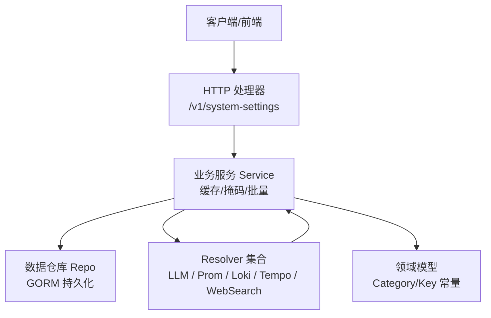
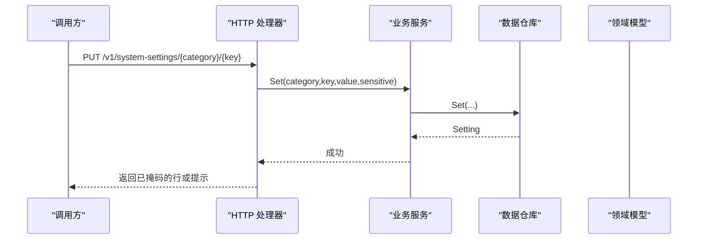
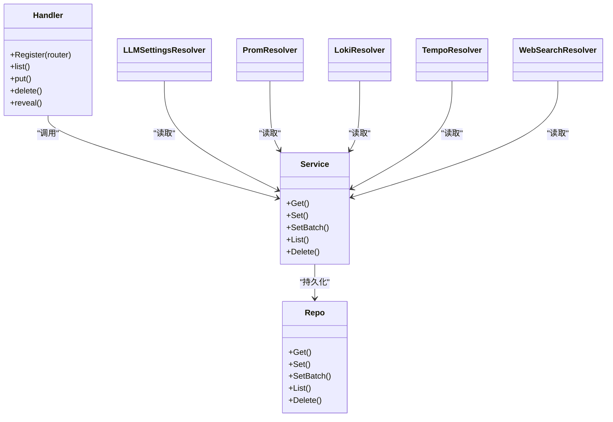
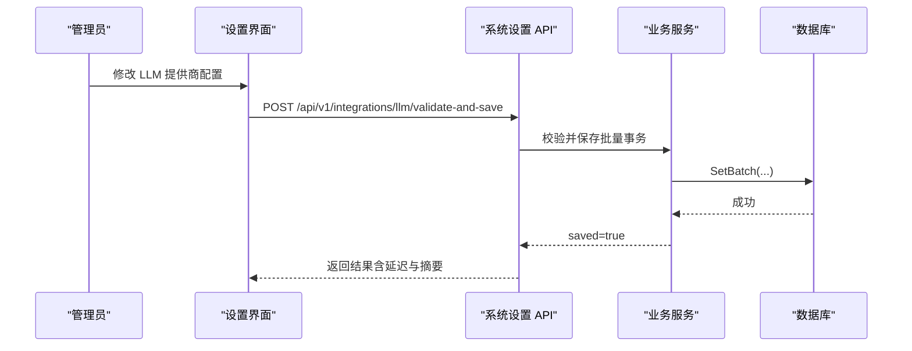

# 系统设置 API

<cite>
**本文引用的文件**
- [setting.proto](file://api/manager/setting/v1/setting.proto)
- [http.go](file://internal/manager/server/setting/http.go)
- [service.go](file://internal/manager/biz/setting/service.go)
- [repo.go](file://internal/manager/data/setting/store/repo.go)
- [model.go](file://internal/manager/model/setting/model.go)
- [llm.go](file://internal/manager/biz/setting/llm.go)
- [telemetry.go](file://internal/manager/biz/setting/telemetry.go)
- [websearch.go](file://internal/manager/biz/setting/websearch.go)
- [promauth.go](file://internal/manager/biz/setting/promauth.go)
- [probe.go](file://internal/manager/biz/setting/probe.go)
</cite>

## 目录
1. [简介](#简介)
2. [项目结构](#项目结构)
3. [核心组件](#核心组件)
4. [架构总览](#架构总览)
5. [详细组件分析](#详细组件分析)
6. [依赖关系分析](#依赖关系分析)
7. [性能考虑](#性能考虑)
8. [故障排除指南](#故障排除指南)
9. [结论](#结论)
10. [附录：API 参考与示例](#附录api-参考与示例)

## 简介
本文件面向系统管理员与集成开发者，系统化说明“系统设置”相关的 RESTful 端点与配置能力，覆盖：
- 系统参数管理（通用键值配置）
- LLM 提供商配置（多模型、默认模型、校验与保存）
- 遥测与可观测性集成（Prometheus、Loki、Tempo、Grafana）
- 内置 Web Search 能力（SearXNG/Tavily/Brave）
- 配置验证、热更新、审计与回滚策略
- 权限控制、错误码与最佳实践

## 项目结构
系统设置由四层构成：HTTP 层暴露 REST 接口；业务服务层提供缓存、掩码与批量写入；数据访问层基于 GORM 持久化；领域模型定义类别与键名。LLM、遥测、Web Search 等通过 Resolver 从同一配置中心读取，实现运行时热更新。

图表来源
- [http.go:45-50](file://internal/manager/server/setting/http.go#L45-L50)
- [service.go:52-70](file://internal/manager/biz/setting/service.go#L52-L70)
- [repo.go:15-23](file://internal/manager/data/setting/store/repo.go#L15-L23)
- [model.go:35-46](file://internal/manager/model/setting/model.go#L35-L46)

章节来源
- [http.go:45-50](file://internal/manager/server/setting/http.go#L45-L50)
- [service.go:52-70](file://internal/manager/biz/setting/service.go#L52-L70)
- [repo.go:15-23](file://internal/manager/data/setting/store/repo.go#L15-L23)
- [model.go:35-46](file://internal/manager/model/setting/model.go#L35-L46)

## 核心组件
- HTTP 处理器：提供系统设置的列表、更新、删除与明文揭示接口，统一鉴权与审计。
- 业务服务：进程内缓存、敏感字段掩码、批量原子写入、缺失行语义处理。
- 数据仓库：基于 GORM 的 upsert/list/delete，事务化批量写入。
- 领域模型：统一的 Category/Key 命名空间，支撑 LLM、Prom、Loki、Tempo、WebSearch 等。
- Resolver：将 system_settings 映射为各子系统所需配置，支持环境变量兜底与热更新。

章节来源
- [http.go:27-50](file://internal/manager/server/setting/http.go#L27-L50)
- [service.go:29-70](file://internal/manager/biz/setting/service.go#L29-L70)
- [repo.go:15-23](file://internal/manager/data/setting/store/repo.go#L15-L23)
- [model.go:35-46](file://internal/manager/model/setting/model.go#L35-L46)

## 架构总览
系统设置以“配置即服务”的方式被多个子系统消费。HTTP 层负责安全与审计；Service 层保证一致性与性能；Repo 层确保幂等与事务；Resolver 抽象出不同子系统的读路径，屏蔽存储细节。

图表来源
- [http.go:81-137](file://internal/manager/server/setting/http.go#L81-L137)
- [service.go:108-131](file://internal/manager/biz/setting/service.go#L108-L131)
- [repo.go:43-64](file://internal/manager/data/setting/store/repo.go#L43-L64)

## 详细组件分析

### 通用系统设置 REST 接口
- 认证与权限
  - 读取：任意已认证用户可读，敏感值在服务层自动掩码。
  - 写入/删除/揭示：需要 admin 角色。
- 路由与方法
  - GET /v1/system-settings?category=...
    - 响应：{ items[], total }
  - PUT /v1/system-settings/{category}/{key}
    - 请求体：{ value, sensitive? }
    - 行为：upsert，自动识别敏感键后缀（*_api_key/_secret/_token/_password），也可显式指定 sensitive。
  - DELETE /v1/system-settings/{category}/{key}
    - 无响应体，204 No Content
  - GET /v1/system-settings/{category}/{key}/reveal
    - 仅 admin，返回 { value } 明文
- 错误码与消息
  - unauthorized/forbidden/not-found/invalid-argument/internal
- 审计
  - 写操作记录 ActionSettingUpdate/Delete，资源标识 category/key，payload 包含敏感标记与值提示（前缀+省略号）。

章节来源
- [http.go:45-50](file://internal/manager/server/setting/http.go#L45-L50)
- [http.go:67-137](file://internal/manager/server/setting/http.go#L67-L137)
- [http.go:139-190](file://internal/manager/server/setting/http.go#L139-L190)
- [http.go:246-280](file://internal/manager/server/setting/http.go#L246-L280)

### LLM 提供商配置与校验
- 能力
  - 草稿校验：对未落库的配置发起最小模型请求，返回稳定错误码与延迟。
  - 校验并保存：对同一份草稿中的全部模型逐一探测，通过后原子保存；空 api_key 表示显式禁用该提供商。
- 协议
  - POST /api/v1/integrations/llm/test
    - 请求：provider, api_key, base_url, default_model, models[]
    - 响应：valid, code, provider, model, detail, latency_ms
  - POST /api/v1/integrations/llm/validate-and-save
    - 请求：同 test
    - 响应：valid, code, provider, model, detail, latency_ms, saved, disabled
- 运行期解析
  - 多提供商：openai/anthropic/zhipu/gemini/deepseek/kimi/custom
  - 每提供商键：api_key/base_url/models(default_model)
  - 默认提供商：default_provider
  - 兼容旧版 openai_model 单模型键
- 热更新
  - 通过 Service 缓存与上层 MultiClient 缓存，编辑后快速生效。

章节来源
- [setting.proto:7-71](file://api/manager/setting/v1/setting.proto#L7-L71)
- [llm.go:12-53](file://internal/manager/biz/setting/llm.go#L12-L53)
- [llm.go:126-224](file://internal/manager/biz/setting/llm.go#L126-L224)
- [model.go:79-149](file://internal/manager/model/setting/model.go#L79-L149)

### 遥测与可观测性集成
- Prometheus
  - 键：query_url, remote_write_url, bearer_token, basic_user/basic_password, tls_insecure, tls_ca_pem
  - 行为：查询 URL 与远写 URL 解析，鉴权头注入，变更约 5s 生效（含外层 TTL）。
- Loki
  - 键：url, basic_user/basic_password, tls_insecure
  - 行为：URL/鉴权/TLS 解析；测试连接探针调用 /ready。
- Tempo
  - 键：url, basic_user/basic_password, tls_insecure
  - 行为：OTLP HTTP 推送端点或查询端点探测；测试连接根据路径选择 /ready 或 OTLP 探测。
- Grafana
  - 键：root_url, sa_token/api_key, org_id
  - 行为：用于 UI 跳转与 API 调用。

章节来源
- [model.go:151-204](file://internal/manager/model/setting/model.go#L151-L204)
- [promauth.go:11-91](file://internal/manager/biz/setting/promauth.go#L11-L91)
- [telemetry.go:10-123](file://internal/manager/biz/setting/telemetry.go#L10-L123)
- [probe.go:17-106](file://internal/manager/biz/setting/probe.go#L17-L106)

### 内置 Web Search 能力
- 提供商选择：searxng（默认）、tavily、brave
- 键：provider, searxng_url, tavily_api_key, brave_api_key
- 行为：按优先级推断 provider；测试连接会执行一次轻量搜索并返回样本标题。

章节来源
- [model.go:206-241](file://internal/manager/model/setting/model.go#L206-L241)
- [websearch.go:10-94](file://internal/manager/biz/setting/websearch.go#L10-L94)
- [probe.go:108-279](file://internal/manager/biz/setting/probe.go#L108-L279)

### 配置验证、热更新与备份恢复
- 验证
  - LLM：ValidateLLMConfiguration 与 ValidateAndSaveLLMConfiguration 提供端到端连通性检查与原子保存。
  - 遥测：Loki/Tempo/WebSearch 提供“测试连接”探针，快速反馈可达性与鉴权状态。
- 热更新
  - Service 进程内缓存 + 上层 5-60s TTL，无需重启即可生效。
- 备份与恢复
  - 基于 system_settings 表导出/导入（category/key/value/sensitive），结合 SetBatch 事务保证一致性。
  - 建议配合外部数据库快照与变更审计日志进行回滚。

章节来源
- [setting.proto:7-71](file://api/manager/setting/v1/setting.proto#L7-L71)
- [service.go:133-165](file://internal/manager/biz/setting/service.go#L133-L165)
- [repo.go:66-89](file://internal/manager/data/setting/store/repo.go#L66-L89)
- [probe.go:17-106](file://internal/manager/biz/setting/probe.go#L17-L106)

### 权限控制、变更审计与回滚策略
- 权限
  - 读取：已认证用户；敏感值始终掩码。
  - 写入/删除/揭示：需 admin 角色。
- 审计
  - 写/删操作记录到审计事件，包含 action/resource/status/payload（值提示）。
- 回滚
  - 使用 SetBatch 原子提交一组配置；失败则整体回滚。
  - 结合审计日志与 DB 快照，可定位并恢复到上一版本。

章节来源
- [http.go:81-137](file://internal/manager/server/setting/http.go#L81-L137)
- [http.go:169-190](file://internal/manager/server/setting/http.go#L169-L190)
- [service.go:133-165](file://internal/manager/biz/setting/service.go#L133-L165)

## 依赖关系分析
- HTTP 层依赖 Service 接口，不直接访问 DB。
- Service 依赖 Repo 与领域模型常量，维护缓存与掩码策略。
- Repo 依赖 GORM 与模型实体，提供 upsert/list/delete。
- Resolver 依赖 Service 与模型常量，向各子系统提供配置。

图表来源
- [http.go:27-50](file://internal/manager/server/setting/http.go#L27-L50)
- [service.go:29-70](file://internal/manager/biz/setting/service.go#L29-L70)
- [repo.go:15-23](file://internal/manager/data/setting/store/repo.go#L15-L23)
- [llm.go:12-53](file://internal/manager/biz/setting/llm.go#L12-L53)
- [promauth.go:11-40](file://internal/manager/biz/setting/promauth.go#L11-L40)
- [telemetry.go:10-83](file://internal/manager/biz/setting/telemetry.go#L10-L83)
- [websearch.go:10-27](file://internal/manager/biz/setting/websearch.go#L10-L27)

## 性能考虑
- 进程内缓存：Service 使用 map + RWMutex 缓存 (category|key)，减少 DB 往返。
- 多层 TTL：Service 缓存 + 上层组件（如 llm.MultiClient、promauth 5s TTL）叠加，兼顾一致性与性能。
- 批量写入：SetBatch 在事务中一次性 upsert，避免部分提交导致的不一致。
- 掩码开销：仅在 List 时进行敏感值掩码，避免频繁计算。

章节来源
- [service.go:49-70](file://internal/manager/biz/setting/service.go#L49-L70)
- [service.go:205-222](file://internal/manager/biz/setting/service.go#L205-L222)
- [repo.go:66-89](file://internal/manager/data/setting/store/repo.go#L66-L89)
- [promauth.go:11-25](file://internal/manager/biz/setting/promauth.go#L11-L25)

## 故障排除指南
- 无法列出或更新配置
  - 确认已认证且具备相应角色；检查 category/key 是否合法。
- 敏感值显示异常
  - 确认 key 后缀匹配 *_api_key/_secret/_token/_password，或显式传入 sensitive=true。
- LLM 校验失败
  - 检查 provider、base_url、models、default_model 是否一致；查看返回 code 与 detail。
- 遥测“测试连接”失败
  - 核对 URL、鉴权、TLS 设置；确认目标服务 /ready 或 OTLP 端点可达。
- 配置未生效
  - 等待缓存刷新（通常数秒至数十秒）；必要时调用 InvalidateAll（运维场景）。

章节来源
- [http.go:67-137](file://internal/manager/server/setting/http.go#L67-L137)
- [http.go:192-209](file://internal/manager/server/setting/http.go#L192-L209)
- [setting.proto:19-71](file://api/manager/setting/v1/setting.proto#L19-L71)
- [probe.go:17-106](file://internal/manager/biz/setting/probe.go#L17-L106)
- [service.go:235-242](file://internal/manager/biz/setting/service.go#L235-L242)

## 结论
系统设置 API 提供了统一的运行时配置管理能力，覆盖 LLM、遥测与搜索等关键能力。通过缓存、掩码、批量事务与审计机制，在保证安全与一致性的同时实现了热更新与良好性能。建议在生产环境中结合备份、审计与回滚策略，形成完整的配置治理闭环。

## 附录：API 参考与示例

### 通用系统设置
- 列出配置
  - 方法：GET
  - 路径：/v1/system-settings?category={category}
  - 响应：{ items[], total }
- 更新配置
  - 方法：PUT
  - 路径：/v1/system-settings/{category}/{key}
  - 请求体：{ value, sensitive? }
  - 响应：单个 SettingDTO（已掩码）
- 删除配置
  - 方法：DELETE
  - 路径：/v1/system-settings/{category}/{key}
  - 响应：204 No Content
- 揭示明文
  - 方法：GET
  - 路径：/v1/system-settings/{category}/{key}/reveal
  - 响应：{ value }

章节来源
- [http.go:45-50](file://internal/manager/server/setting/http.go#L45-L50)
- [http.go:67-137](file://internal/manager/server/setting/http.go#L67-L137)
- [http.go:139-190](file://internal/manager/server/setting/http.go#L139-L190)

### LLM 提供商配置
- 测试配置
  - 方法：POST
  - 路径：/api/v1/integrations/llm/test
  - 请求体：{ provider, api_key, base_url, default_model, models[] }
  - 响应：{ valid, code, provider, model, detail, latency_ms }
- 校验并保存
  - 方法：POST
  - 路径：/api/v1/integrations/llm/validate-and-save
  - 请求体：同上
  - 响应：{ valid, code, provider, model, detail, latency_ms, saved, disabled }

章节来源
- [setting.proto:7-71](file://api/manager/setting/v1/setting.proto#L7-L71)

### 遥测与搜索集成
- Loki/Tempo 测试连接
  - 通过对应 Resolver 的 Probe 实现，调用 /ready 或 OTLP 端点，返回成功或错误信息。
- Web Search 测试连接
  - 根据 provider 执行轻量搜索，返回 provider 与样本标题。

章节来源
- [probe.go:17-106](file://internal/manager/biz/setting/probe.go#L17-L106)
- [probe.go:108-279](file://internal/manager/biz/setting/probe.go#L108-L279)

### 常用配置键参考
- LLM：openai/anthropic/zhipu/gemini/deepseek/kimi/custom 的 api_key/base_url/models/default_model；default_provider
- Prometheus：query_url/remote_write_url/bearer_token/basic_user/basic_password/tls_insecure/tls_ca_pem
- Loki/Tempo：url/basic_user/basic_password/tls_insecure
- Grafana：root_url/sa_token/api_key/org_id
- Web Search：provider/searxng_url/tavily_api_key/brave_api_key

章节来源
- [model.go:79-241](file://internal/manager/model/setting/model.go#L79-L241)

### 典型调用流程（序列图）

图表来源
- [setting.proto:44-71](file://api/manager/setting/v1/setting.proto#L44-L71)
- [service.go:133-165](file://internal/manager/biz/setting/service.go#L133-L165)
- [repo.go:66-89](file://internal/manager/data/setting/store/repo.go#L66-L89)