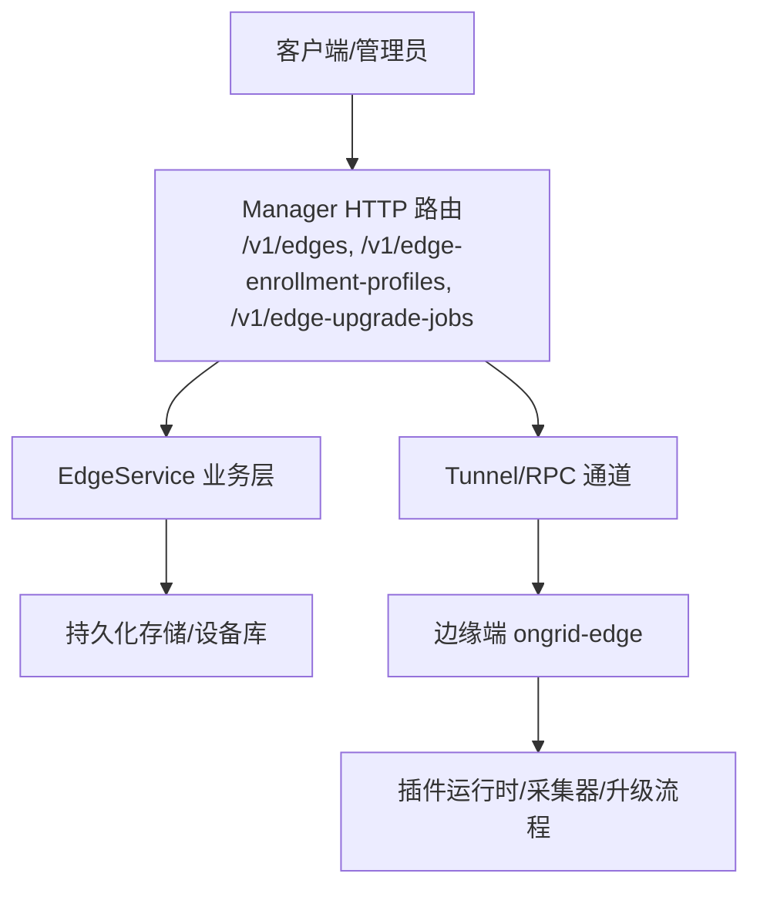
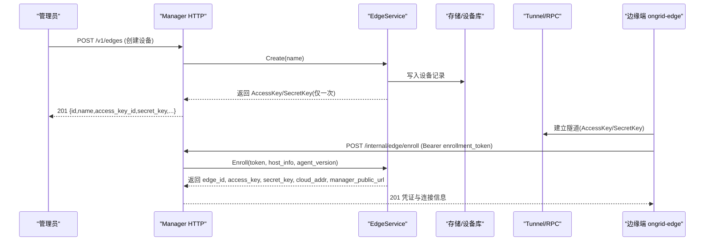
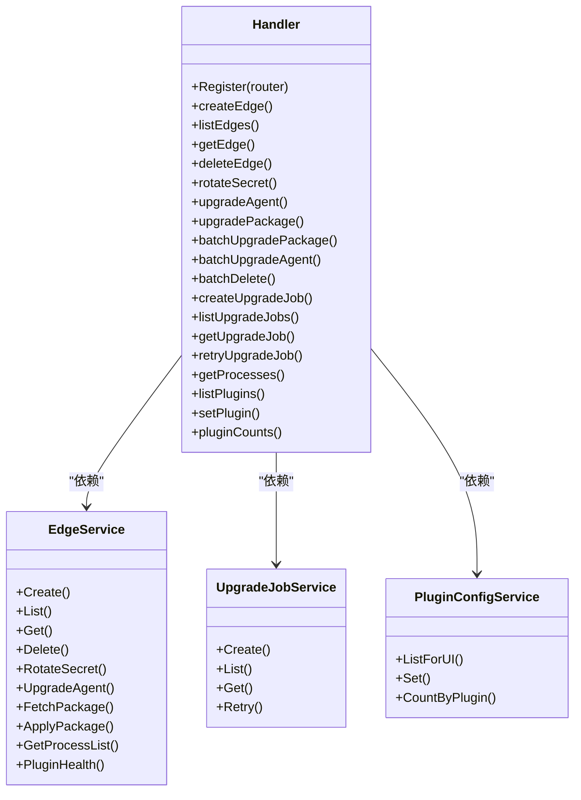

# 边缘设备 API

<cite>
**本文引用的文件**
- [edge.proto](file://api/manager/edge/v1/edge.proto)
- [http.go](file://internal/manager/server/edge/http.go)
- [enrollment_http.go](file://internal/manager/server/edge/enrollment_http.go)
- [upgrade_job_http.go](file://internal/manager/server/edge/upgrade_job_http.go)
- [main.go](file://cmd/ongrid-edge/main.go)
- [enroll.go](file://cmd/ongrid-edge/enroll.go)
- [middleware.go](file://internal/pkg/auth/middleware.go)
</cite>

## 目录
1. [简介](#简介)
2. [项目结构](#项目结构)
3. [核心组件](#核心组件)
4. [架构总览](#架构总览)
5. [详细组件分析](#详细组件分析)
6. [依赖关系分析](#依赖关系分析)
7. [性能考虑](#性能考虑)
8. [故障诊断指南](#故障诊断指南)
9. [结论](#结论)
10. [附录：API 参考与调用示例](#附录api-参考与调用示例)

## 简介
本文件面向“边缘设备”相关 RESTful API，覆盖边缘节点注册、管理、升级、插件配置、状态同步与命令执行等能力。文档基于仓库中的 gRPC 定义与 HTTP 处理器实现，提供统一的接口说明、认证与安全机制、部署要点与排障建议，并给出常用场景的调用示例（以路径与字段为准，不直接粘贴代码）。

## 项目结构
- API 契约：通过 protobuf 定义 EdgeService 及领域模型，作为云端与边缘侧交互的权威规范。
- 管理器 HTTP 层：在 manager 服务中暴露 REST 路由，负责设备生命周期、批量操作、升级任务编排、插件配置等。
- 边缘端进程：边端二进制负责与云端建立隧道、上报主机信息、接收升级指令、运行插件与工具能力。

**图示来源**
- [http.go:150-199](file://internal/manager/server/edge/http.go#L150-L199)
- [enrollment_http.go:45-63](file://internal/manager/server/edge/enrollment_http.go#L45-L63)
- [main.go:138-149](file://cmd/ongrid-edge/main.go#L138-L149)

**章节来源**
- [edge.proto:10-61](file://api/manager/edge/v1/edge.proto#L10-L61)
- [http.go:150-199](file://internal/manager/server/edge/http.go#L150-L199)
- [enrollment_http.go:45-63](file://internal/manager/server/edge/enrollment_http.go#L45-L63)
- [main.go:138-149](file://cmd/ongrid-edge/main.go#L138-L149)

## 核心组件
- 设备管理：创建、列表、详情、删除、密钥轮换。
- 批量安装配置（Enrollment Profile）：创建、列出、撤销/删除，用于非 K8s 环境的批量下发。
- 设备注册（Enroll）：使用一次性令牌换取独立凭证，完成设备上线。
- 升级能力：
  - 单设备远程升级（指定 URL+SHA256）。
  - 整数包升级（自动解析 bundle，两阶段 fetch_package + apply_package）。
  - 批量升级与持久化升级任务（分页查询、重试失败项）。
- 插件配置与健康：按设备查看/设置插件配置，获取运行时健康快照。
- 进程列表：只读的主机进程探测能力。

**章节来源**
- [http.go:150-199](file://internal/manager/server/edge/http.go#L150-L199)
- [enrollment_http.go:45-63](file://internal/manager/server/edge/enrollment_http.go#L45-L63)
- [upgrade_job_http.go:81-198](file://internal/manager/server/edge/upgrade_job_http.go#L81-L198)
- [edge.proto:10-61](file://api/manager/edge/v1/edge.proto#L10-L61)

## 架构总览
边缘设备通过隧道与云端通信；管理器对外暴露 REST 接口，内部通过业务层与存储、Tunnel/RPC 协作。设备注册采用“安装令牌”短期授权，避免长期凭据泄露风险。升级支持“远程二进制”和“整数包”两种模式，并提供持久化任务以应对网络波动与大规模分批推进。

**图示来源**
- [http.go:428-452](file://internal/manager/server/edge/http.go#L428-L452)
- [enrollment_http.go:219-258](file://internal/manager/server/edge/enrollment_http.go#L219-L258)
- [main.go:138-149](file://cmd/ongrid-edge/main.go#L138-L149)

## 详细组件分析

### 设备管理（CRUD 与密钥轮换）
- 创建设备
  - 方法/路径：POST /v1/edges
  - 请求体：name
  - 响应：id, name, access_key_id, secret_key, created_at
  - 认证：JWT（鉴权中间件），写操作需 admin 或具备 edge:* write 权限
- 列出设备
  - 方法/路径：GET /v1/edges
  - 查询参数：status, name, limit, offset
  - 响应：items[], total
- 获取设备详情
  - 方法/路径：GET /v1/edges/{id}
  - 响应：id, name, status, roles, access_key_id, last_seen_at, last_registered_at, created_at, updated_at, agent_version, device_id, host_info
- 删除设备
  - 方法/路径：DELETE /v1/edges/{id}
  - 响应：204 No Content
- 密钥轮换
  - 方法/路径：POST /v1/edges/{id}/rotate-secret
  - 响应：secret_key（新密钥仅此次返回）

安全与权限
- 全局 JWT 鉴权中间件从 Authorization: Bearer <token> 或 ?token=<jwt> 提取并校验，将租户上下文注入请求。
- 写/删操作受角色或策略控制（admin 或 edge:* 资源动作）。

**章节来源**
- [http.go:150-199](file://internal/manager/server/edge/http.go#L150-L199)
- [http.go:428-580](file://internal/manager/server/edge/http.go#L428-L580)
- [middleware.go:10-68](file://internal/pkg/auth/middleware.go#L10-L68)

### 批量安装配置（Enrollment Profile）
- 创建配置
  - 方法/路径：POST /v1/edge-enrollment-profiles
  - 请求体：name, assignment_mode, cluster_node_id?, expires_in_hours, max_uses
  - 响应：profile + enrollment_token（一次性令牌）
- 列出配置
  - 方法/路径：GET /v1/edge-enrollment-profiles?page=...&page_size=...
  - 响应：items[], total, page, page_size
- 撤销/删除配置
  - 方法/路径：POST /v1/edge-enrollment-profiles/{id}/revoke
  - 方法/路径：DELETE /v1/edge-enrollment-profiles/{id}
  - 响应：204 No Content

注意
- 列表接口永不返回 enrollment_token。
- 撤销/删除后未领取的命令立即失效；已领取的独立凭证不受影响。

**章节来源**
- [enrollment_http.go:45-56](file://internal/manager/server/edge/enrollment_http.go#L45-L56)
- [enrollment_http.go:112-204](file://internal/manager/server/edge/enrollment_http.go#L112-L204)
- [edge.proto:30-48](file://api/manager/edge/v1/edge.proto#L30-L48)

### 设备注册（Enroll）
- 方法/路径：POST /internal/edge/enroll
- 认证：Authorization: Bearer <enrollment_token>（不使用用户 JWT）
- 请求体：host_info, agent_version?
- 响应：edge_id, access_key, secret_key, cloud_addr, manager_public_url
- 限制：服务端对并发进行限流，防止滥用

典型流程
- 管理员先创建 Enrollment Profile，获得 enrollment_token。
- 边缘端在首次启动时携带 token 调用该接口，换取独立凭证并建立隧道。

**章节来源**
- [enrollment_http.go:58-63](file://internal/manager/server/edge/enrollment_http.go#L58-L63)
- [enrollment_http.go:219-258](file://internal/manager/server/edge/enrollment_http.go#L219-L258)
- [enroll.go:40-141](file://cmd/ongrid-edge/enroll.go#L40-L141)

### 升级能力
- 单设备远程升级
  - 方法/路径：POST /v1/edges/{id}/upgrade
  - 请求体：url, sha256
  - 响应：staged_path, bytes
- 整数包升级（推荐）
  - 方法/路径：POST /v1/edges/{id}/upgrade-package
  - 请求体（可选）：arch?, version?
  - 行为：自动解析当前架构与版本对应的 bundle，分两步执行 fetch_package（下载并校验）与 apply_package（应用并退出）
  - 响应：version, staged_path, bytes, manifest_files, applied, apply_error?
- 批量升级
  - 方法/路径：POST /v1/edges/batch/upgrade-package, /v1/edges/batch/upgrade, /v1/edges/batch/delete
  - 请求体：ids[] 及对应操作的附加字段
  - 响应：total, succeeded, failed, results[]
- 持久化升级任务
  - 创建：POST /v1/edge-upgrade-jobs
  - 列表：GET /v1/edge-upgrade-jobs?page=&page_size=&cluster_node_id?
  - 详情：GET /v1/edge-upgrade-jobs/{id}
  - 重试：POST /v1/edge-upgrade-jobs/{id}/retry
  - 响应：job 摘要 + items 明细（含状态、尝试次数、错误码/消息、观察版本、批次号等）

安全与校验
- 远程升级要求 url 与 sha256 同时存在；边缘端会再次校验后再落盘。
- 整数包升级根据设备真实架构选择 bundle，拒绝不匹配请求。

**章节来源**
- [http.go:592-737](file://internal/manager/server/edge/http.go#L592-L737)
- [http.go:739-800](file://internal/manager/server/edge/http.go#L739-L800)
- [upgrade_job_http.go:81-198](file://internal/manager/server/edge/upgrade_job_http.go#L81-L198)
- [edge.proto:50-61](file://api/manager/edge/v1/edge.proto#L50-L61)

### 插件配置与健康
- 列出插件配置与健康
  - 方法/路径：GET /v1/edges/{id}/plugins
  - 响应：items[]（plugin_name, enabled, spec, health）
- 设置插件配置
  - 方法/路径：PUT /v1/edges/{id}/plugins/{name}
  - 请求体：SetInput（enabled, spec 等）
  - 响应：更新后的行数据
- 插件计数
  - 方法/路径：GET /v1/integrations/plugin-counts
  - 响应：counts{}

健康信息包含状态、最近错误、重启次数、PID、目标健康快照等，便于定位插件问题。

**章节来源**
- [http.go:195-198](file://internal/manager/server/edge/http.go#L195-L198)
- [http.go:203-338](file://internal/manager/server/edge/http.go#L203-L338)

### 进程列表（只读）
- 方法/路径：GET /v1/edges/{id}/processes
- 用途：监控页面与 LLM 工具使用的只读主机进程探测能力

**章节来源**
- [http.go:192-194](file://internal/manager/server/edge/http.go#L192-L194)

### 认证与权限
- 全局鉴权：JWT Bearer，支持 WebSocket 回退查询参数。
- 资源级权限：写/删操作需要 admin 或通过策略（edge:* 资源 + write/delete 动作）。
- 设备注册：使用一次性 enrollment_token，不在请求体中暴露用户身份。

**章节来源**
- [middleware.go:10-68](file://internal/pkg/auth/middleware.go#L10-L68)
- [http.go:132-148](file://internal/manager/server/edge/http.go#L132-L148)
- [enrollment_http.go:58-63](file://internal/manager/server/edge/enrollment_http.go#L58-L63)

## 依赖关系分析
- HTTP 路由到业务层的解耦：Handler 通过接口依赖 EdgeService、UpgradeJobService、PluginConfigService 等，便于测试替换。
- 设备与主机事实分离：设备 listing/detail 通过 Device 仓储反查 host_info，保持向后兼容。
- 升级任务持久化：通过 UpgradeJobService 提供后台持续执行与收敛检查，HTTP 仅做触发与查询。

**图示来源**
- [http.go:39-124](file://internal/manager/server/edge/http.go#L39-L124)
- [http.go:150-199](file://internal/manager/server/edge/http.go#L150-L199)
- [upgrade_job_http.go:81-198](file://internal/manager/server/edge/upgrade_job_http.go#L81-L198)

**章节来源**
- [http.go:39-124](file://internal/manager/server/edge/http.go#L39-L124)
- [http.go:150-199](file://internal/manager/server/edge/http.go#L150-L199)
- [upgrade_job_http.go:81-198](file://internal/manager/server/edge/upgrade_job_http.go#L81-L198)

## 性能考虑
- 批量操作限流：批量 ID 上限与并发度限制，避免风暴式 RPC 导致管理器过载。
- 升级任务分批：持久化任务支持 batch_size/current_batch/total_batches，便于灰度与回滚。
- 注册限流：enroll 接口通过信号量限制并发，降低暴力尝试风险。
- 插件健康：心跳聚合，快速发现崩溃与异常目标。

[本节为通用指导，无需具体文件引用]

## 故障诊断指南
- 401/403：检查 JWT 是否有效、是否携带正确 role；确认写/删操作是否具备 edge:* 权限。
- 400/无效参数：检查 JSON 字段与类型；注册接口 body 大小受限且禁止未知字段。
- 503/未就绪：升级包解析器未挂载或未配置；插件配置服务未接入。
- 升级失败：查看升级任务 items 的 error_code/error_message；必要时重试失败项。
- 设备离线：确认隧道是否正常建立；检查 cloud_addr 与证书配置；核对 enrollment_token 是否过期或被撤销。

**章节来源**
- [enrollment_http.go:274-285](file://internal/manager/server/edge/enrollment_http.go#L274-L285)
- [http.go:501-521](file://internal/manager/server/edge/http.go#L501-L521)
- [upgrade_job_http.go:152-198](file://internal/manager/server/edge/upgrade_job_http.go#L152-L198)

## 结论
本 API 围绕“设备全生命周期管理 + 安全注册 + 可观测升级 + 插件治理”构建，兼顾易用性与安全性。通过一次性令牌、细粒度权限、分批任务与插件健康体系，满足多环境、大规模边缘设备的运维诉求。

[本节为总结性内容，无需具体文件引用]

## 附录：API 参考与调用示例

### 设备管理
- 创建设备
  - POST /v1/edges
  - 请求体：{"name":"..."}
  - 响应：{"id":...,"name":"...","access_key_id":"...","secret_key":"...","created_at":"..."}
- 列出设备
  - GET /v1/edges?status=online|offline|all&name=...&limit=...&offset=...
  - 响应：{"items":[...],"total":...}
- 获取详情
  - GET /v1/edges/{id}
  - 响应：{id,name,status,roles,access_key_id,last_seen_at,last_registered_at,created_at,updated_at,agent_version,device_id,host_info}
- 删除设备
  - DELETE /v1/edges/{id} → 204
- 密钥轮换
  - POST /v1/edges/{id}/rotate-secret → {"secret_key":"..."}

### 批量安装配置
- 创建配置
  - POST /v1/edge-enrollment-profiles
  - 请求体：{"name":"...","assignment_mode":"...","cluster_node_id":...?,"expires_in_hours":...,"max_uses":...}
  - 响应：{"profile":{...},"enrollment_token":"..."}
- 列出配置
  - GET /v1/edge-enrollment-profiles?page=...&page_size=...
  - 响应：{"items":[...],"total":...,"page":...,"page_size":...}
- 撤销/删除
  - POST /v1/edge-enrollment-profiles/{id}/revoke → 204
  - DELETE /v1/edge-enrollment-profiles/{id} → 204

### 设备注册
- POST /internal/edge/enroll
- 认证：Authorization: Bearer <enrollment_token>
- 请求体：{"host_info":{...},"agent_version":"..."}
- 响应：{"edge_id":...,"access_key":"...","secret_key":"...","cloud_addr":"...","manager_public_url":"..."}

### 升级
- 单设备远程升级
  - POST /v1/edges/{id}/upgrade
  - 请求体：{"url":"...","sha256":"..."}
  - 响应：{"staged_path":"...","bytes":...}
- 整数包升级
  - POST /v1/edges/{id}/upgrade-package
  - 请求体（可选）：{"arch":"...","version":"..."}
  - 响应：{"version":"...","staged_path":"...","bytes":...,"manifest_files":...,"applied":true|false,"apply_error":"...?"}
- 批量升级
  - POST /v1/edges/batch/upgrade-package | /v1/edges/batch/upgrade | /v1/edges/batch/delete
  - 请求体：{"ids":[...], ...}
  - 响应：{"total":...,"succeeded":...,"failed":...,"results":[...]}
- 持久化升级任务
  - 创建：POST /v1/edge-upgrade-jobs → 202
  - 列表：GET /v1/edge-upgrade-jobs?page=...&page_size=...&cluster_node_id?...
  - 详情：GET /v1/edge-upgrade-jobs/{id}
  - 重试：POST /v1/edge-upgrade-jobs/{id}/retry → 202

### 插件与进程
- 列出插件与健康
  - GET /v1/edges/{id}/plugins → {"items":[{"plugin_name":"...","enabled":...,"spec":{...},"health":{...}}]}
- 设置插件
  - PUT /v1/edges/{id}/plugins/{name} → 200
- 插件计数
  - GET /v1/integrations/plugin-counts → {"counts":{...}}
- 进程列表
  - GET /v1/edges/{id}/processes

### 认证与安全
- 全局鉴权：Authorization: Bearer <JWT>
- 写/删操作：需要 admin 或 edge:* 资源 + write/delete 动作
- 设备注册：使用一次性 enrollment_token，不落盘长期凭据

### 常见调用示例（步骤说明）
- 设备注册
  1) 管理员创建 Enrollment Profile，获取 enrollment_token
  2) 边缘端调用 /internal/edge/enroll，传入 host_info 与 agent_version
  3) 使用返回的 access_key/secret_key 建立隧道并完成后续工作
- 批量升级
  1) 调用 /v1/edges/batch/upgrade-package，传入 ids[] 与可选 arch/version
  2) 若需更精细控制，使用 /v1/edge-upgrade-jobs 创建持久化任务并轮询结果
- 插件治理
  1) 列出插件与实时健康
  2) 按需启用/禁用或调整 spec
  3) 关注 health.last_error 与 restart_count 进行排障

[本节为接口参考与示例说明，不直接粘贴代码]