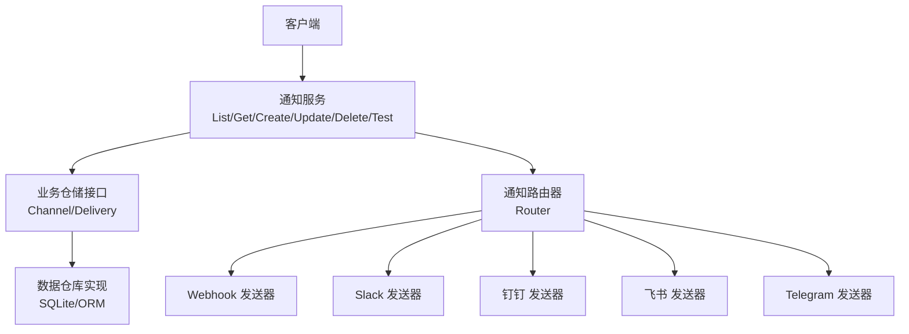
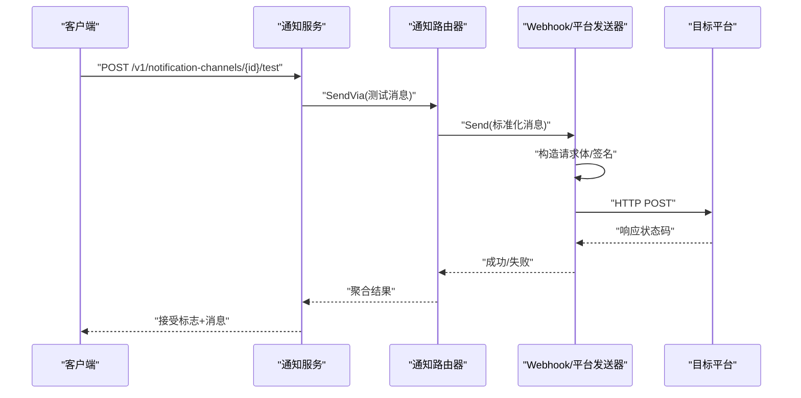
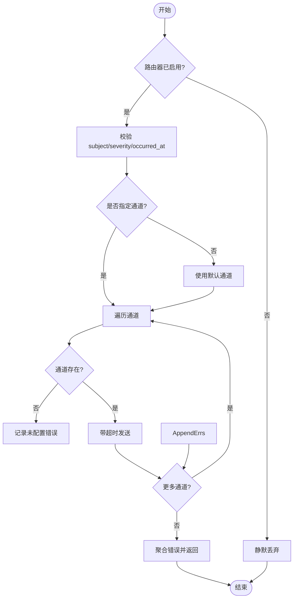
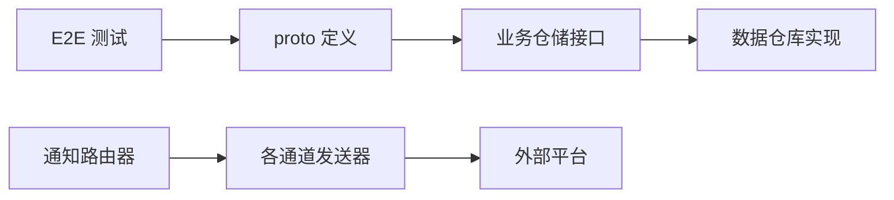

# 通知渠道 API

<cite>
**本文引用的文件**
- [notification.proto](file://api/manager/notification/v1/notification.proto)
- [notify.go](file://internal/pkg/notify/notify.go)
- [webhook.go](file://internal/pkg/notify/webhook.go)
- [repo.go（biz）](file://internal/manager/biz/alert/repo.go)
- [store repo.go](file://internal/manager/data/alert/store/repo.go)
- [notify_channel_crud_test.go](file://tests/e2e/notify_channel_crud_test.go)
</cite>

## 目录
1. [简介](#简介)
2. [项目结构](#项目结构)
3. [核心组件](#核心组件)
4. [架构总览](#架构总览)
5. [详细组件分析](#详细组件分析)
6. [依赖关系分析](#依赖关系分析)
7. [性能与可靠性](#性能与可靠性)
8. [故障排除指南](#故障排除指南)
9. [结论](#结论)
10. [附录：API 参考与示例](#附录api-参考与示例)

## 简介
本文件面向“通知渠道”能力，覆盖以下主题：
- 通知渠道配置（创建、查询、更新、删除、测试连通性）
- 消息发送（标准化消息模型、多通道分发）
- 模板管理（各通道的消息格式化策略）
- 发送历史与重试（投递记录、可重试任务）
- 认证与安全（鉴权、签名、密钥不落盘回显）
- 限流与超时（通道级超时、路由级开关）
- 集成指南与排错建议

本系统支持多种通知渠道：Webhook、Slack、钉钉、飞书、Telegram。所有通道通过统一的标准化消息模型进行投递，便于统一格式、审计与重试。

## 项目结构
通知能力由三层组成：
- 接口层：gRPC/HTTP 暴露的通道 CRUD 与测试端点（基于 proto 定义）
- 业务层：通道与投递记录的仓储接口与实现（CRUD、分页、软删除、引用检查）
- 发送层：通用 Webhook 与平台适配（Slack/钉钉/飞书/Telegram），统一路由与超时控制

图表来源
- [notification.proto:10-17](file://api/manager/notification/v1/notification.proto#L10-L17)
- [notify.go:39-156](file://internal/pkg/notify/notify.go#L39-L156)
- [webhook.go:18-314](file://internal/pkg/notify/webhook.go#L18-L314)
- [repo.go（biz）:76-99](file://internal/manager/biz/alert/repo.go#L76-L99)
- [store repo.go:657-771](file://internal/manager/data/alert/store/repo.go#L657-L771)

章节来源
- [notification.proto:10-17](file://api/manager/notification/v1/notification.proto#L10-L17)
- [notify.go:39-156](file://internal/pkg/notify/notify.go#L39-L156)
- [webhook.go:18-314](file://internal/pkg/notify/webhook.go#L18-L314)
- [repo.go（biz）:76-99](file://internal/manager/biz/alert/repo.go#L76-L99)
- [store repo.go:657-771](file://internal/manager/data/alert/store/repo.go#L657-L771)

## 核心组件
- 标准化消息模型：包含主题、正文、严重级别、来源、去重键、标签、发生时间等字段，用于统一跨通道表达。
- 通道路由器：负责启用开关、默认通道、超时控制、按名称分发到具体发送器，并聚合错误。
- 通道发送器：针对各平台封装请求体构造、签名与 HTTP 调用；失败时返回错误以便上层重试或记录。
- 通道仓储：提供通道列表、创建、更新、删除、启用状态切换、以及“被规则引用计数”保护。
- 投递记录：每次发送尝试均落库，支持按状态筛选与重试。

章节来源
- [notify.go:22-37](file://internal/pkg/notify/notify.go#L22-L37)
- [notify.go:39-156](file://internal/pkg/notify/notify.go#L39-L156)
- [webhook.go:18-314](file://internal/pkg/notify/webhook.go#L18-L314)
- [repo.go（biz）:76-99](file://internal/manager/biz/alert/repo.go#L76-L99)
- [store repo.go:657-771](file://internal/manager/data/alert/store/repo.go#L657-L771)

## 架构总览
下图展示一次“测试通道”的端到端流程：客户端调用测试端点 → 路由校验 → 构建消息 → 选择发送器 → 签名与 HTTP 调用 → 返回结果。

图表来源
- [notification.proto:10-17](file://api/manager/notification/v1/notification.proto#L10-L17)
- [notify.go:132-156](file://internal/pkg/notify/notify.go#L132-L156)
- [webhook.go:220-258](file://internal/pkg/notify/webhook.go#L220-L258)

## 详细组件分析

### 通道类型与枚举
- 支持的通道类型包括：Webhook、Slack、Feishu（飞书）、DingTalk（钉钉）。Telegram 在发送层已实现，可通过 Webhook 方式接入。
- 通道对象包含 ID、名称、类型、是否启用、掩码后的 endpoint、创建/更新时间等。

章节来源
- [notification.proto:19-35](file://api/manager/notification/v1/notification.proto#L19-L35)

### 通道 CRUD 与分页
- 列表：支持分页参数 page/page_size，返回 channels 数组与 total。
- 获取：按 id 获取单个通道。
- 创建：传入 name、type、endpoint、enabled。
- 更新：按 id 更新 name、endpoint、enabled。
- 删除：按 id 删除（软删除，保留审计）。
- 安全：任何读接口不返回 secret；列表中的 endpoint 会做掩码处理。

章节来源
- [notification.proto:37-90](file://api/manager/notification/v1/notification.proto#L37-L90)
- [notify_channel_crud_test.go:50-196](file://tests/e2e/notify_channel_crud_test.go#L50-L196)
- [repo.go（biz）:76-99](file://internal/manager/biz/alert/repo.go#L76-L99)
- [store repo.go:657-771](file://internal/manager/data/alert/store/repo.go#L657-L771)

### 通道测试
- 提供测试端点，使用当前通道配置发送一条测试消息，返回是否接受及提示信息。
- 适用于新配置后快速验证连通性与签名是否正确。

章节来源
- [notification.proto:10-17](file://api/manager/notification/v1/notification.proto#L10-L17)
- [notification.proto:83-90](file://api/manager/notification/v1/notification.proto#L83-L90)

### 消息模型与格式化
- 标准化消息字段：subject、body、severity、source、dedupe_key、labels、occurred_at。
- Slack：使用 attachments 格式，带颜色条与结构化字段（严重级别、来源、规则、事件、设备、去重键）。
- 飞书：text 消息，可选 timestamp + sign 签名。
- 钉钉：text 消息，可选 URL 签名参数。
- Telegram：sendMessage，chat_id 在请求体中。
- 通用 Webhook：直接发送标准化 JSON，可选 HMAC 签名头。

章节来源
- [notify.go:22-37](file://internal/pkg/notify/notify.go#L22-L37)
- [webhook.go:41-192](file://internal/pkg/notify/webhook.go#L41-L192)
- [webhook.go:260-314](file://internal/pkg/notify/webhook.go#L260-L314)

### 路由与发送流程
- 路由器维护 enabled 开关、超时、默认通道集合与已注册发送器映射。
- Send：若无显式通道则使用默认通道；对每个通道执行带超时的发送，聚合错误。
- SendVia：为数据库存储的通道动态构建发送器并发送，同样受 enabled 与超时控制。
- ChannelNames：用于就绪检查与诊断。

图表来源
- [notify.go:47-156](file://internal/pkg/notify/notify.go#L47-L156)

章节来源
- [notify.go:47-156](file://internal/pkg/notify/notify.go#L47-L156)

### 发送历史与重试
- 每次发送尝试都会写入投递记录，包含状态、尝试次数、提供者消息 ID、响应体、错误信息、发送与完成时间。
- 提供查询“可重试投递”的接口，供后台重试任务消费。

章节来源
- [repo.go（biz）:97-99](file://internal/manager/biz/alert/repo.go#L97-L99)
- [store repo.go:657-771](file://internal/manager/data/alert/store/repo.go#L657-L771)

## 依赖关系分析
- 接口层依赖业务仓储接口，业务仓储对接数据仓库实现。
- 发送层依赖各平台适配器，并通过路由器统一调度。
- 测试用例保障 CRUD 生命周期与“secret 不回显”的安全约束。

图表来源
- [notification.proto:10-17](file://api/manager/notification/v1/notification.proto#L10-L17)
- [repo.go（biz）:76-99](file://internal/manager/biz/alert/repo.go#L76-L99)
- [store repo.go:657-771](file://internal/manager/data/alert/store/repo.go#L657-L771)
- [notify.go:39-156](file://internal/pkg/notify/notify.go#L39-L156)
- [webhook.go:18-314](file://internal/pkg/notify/webhook.go#L18-L314)
- [notify_channel_crud_test.go:50-196](file://tests/e2e/notify_channel_crud_test.go#L50-L196)

章节来源
- [notification.proto:10-17](file://api/manager/notification/v1/notification.proto#L10-L17)
- [repo.go（biz）:76-99](file://internal/manager/biz/alert/repo.go#L76-L99)
- [store repo.go:657-771](file://internal/manager/data/alert/store/repo.go#L657-L771)
- [notify.go:39-156](file://internal/pkg/notify/notify.go#L39-L156)
- [webhook.go:18-314](file://internal/pkg/notify/webhook.go#L18-L314)
- [notify_channel_crud_test.go:50-196](file://tests/e2e/notify_channel_crud_test.go#L50-L196)

## 性能与可靠性
- 超时控制：每个通道发送均受路由器配置的超时限制，避免阻塞。
- 批量与聚合：对多个通道并发或顺序发送的错误会被聚合返回，便于上层重试与告警。
- 软删除：通道删除采用软删除，保留历史投递记录与审计。
- 限流策略：当前代码未内置全局限流；可在网关或上游限流。若需通道级限流，建议在发送器或路由器扩展。
- 重试机制：通过投递记录表与“可重试投递”查询接口支撑后台重试任务。

章节来源
- [notify.go:47-156](file://internal/pkg/notify/notify.go#L47-L156)
- [repo.go（biz）:97-99](file://internal/manager/biz/alert/repo.go#L97-L99)
- [store repo.go:657-771](file://internal/manager/data/alert/store/repo.go#L657-L771)

## 故障排除指南
- 无法列出/创建/更新/删除通道：检查鉴权与权限；确认分页参数与过滤条件；注意删除前是否有规则引用该通道。
- 测试通道失败：核对 endpoint、签名（飞书/钉钉）、Webhook 签名头（通用 Webhook）；查看返回状态码与错误信息。
- 消息未送达：检查通道是否启用；确认默认通道是否配置；查看投递记录的状态与错误信息。
- 敏感信息泄露：确保读接口不返回 secret；列表中的 endpoint 会做掩码处理。

章节来源
- [notify_channel_crud_test.go:50-196](file://tests/e2e/notify_channel_crud_test.go#L50-L196)
- [webhook.go:220-258](file://internal/pkg/notify/webhook.go#L220-L258)
- [repo.go（biz）:91-99](file://internal/manager/biz/alert/repo.go#L91-L99)

## 结论
本通知渠道 API 以标准化消息为核心，结合统一的路由器与各平台适配器，提供了可扩展、可观测、可重试的通知能力。通过严格的读写分离与“secret 不回显”策略，保障了安全性；通过投递记录与重试接口，提升了可靠性。

## 附录：API 参考与示例

### 认证与鉴权
- 所有管理端点需要鉴权（如访问令牌），请在请求头携带凭据。
- 通道 secret 仅写可读，不会在任何读接口返回。

章节来源
- [notify_channel_crud_test.go:50-196](file://tests/e2e/notify_channel_crud_test.go#L50-L196)

### 通道管理端点
- 列表通道
  - 方法：GET
  - 路径：/api/v1/notification-channels
  - 查询参数：page, page_size
  - 响应：items（通道列表）、total、page、page_size
  - 说明：endpoint 会做掩码处理；不包含 secret
- 获取通道
  - 方法：GET
  - 路径：/api/v1/notification-channels/{id}
  - 响应：通道对象（不含 secret）
- 创建通道
  - 方法：POST
  - 路径：/api/v1/notification-channels
  - 请求体：name, type, endpoint, secret, enabled
  - 响应：通道对象（不含 secret）
- 更新通道
  - 方法：PUT
  - 路径：/api/v1/notification-channels/{id}
  - 请求体：name, type, endpoint, secret, enabled
  - 响应：通道对象（不含 secret）
- 删除通道
  - 方法：DELETE
  - 路径：/api/v1/notification-channels/{id}
  - 响应：空或 204
- 测试通道
  - 方法：POST
  - 路径：/api/v1/notification-channels/{id}/test
  - 响应：accepted, message

章节来源
- [notification.proto:10-17](file://api/manager/notification/v1/notification.proto#L10-L17)
- [notification.proto:37-90](file://api/manager/notification/v1/notification.proto#L37-L90)
- [notify_channel_crud_test.go:50-196](file://tests/e2e/notify_channel_crud_test.go#L50-L196)

### 消息发送与模板
- 标准化消息字段
  - subject：必填
  - severity：info/warning/critical（默认 info）
  - body：可选
  - source：可选
  - dedupe_key：可选
  - labels：可选（例如 rule、incident_id、device_id）
  - occurred_at：可选，默认当前 UTC 时间
- 模板与格式化
  - Slack：attachments 格式，带颜色条与结构化字段
  - 飞书：text 消息，可选 timestamp + sign
  - 钉钉：text 消息，可选 URL 签名
  - Telegram：sendMessage，chat_id 在请求体
  - 通用 Webhook：直接发送标准化 JSON，可选 HMAC 签名头

章节来源
- [notify.go:22-37](file://internal/pkg/notify/notify.go#L22-L37)
- [webhook.go:41-192](file://internal/pkg/notify/webhook.go#L41-L192)
- [webhook.go:260-314](file://internal/pkg/notify/webhook.go#L260-L314)

### 发送历史与重试
- 投递记录字段：status、attempt_count、provider_message_id、response_json、err_msg、sent_at、finished_at
- 查询可重试投递：根据最大尝试次数与截止时间筛选

章节来源
- [repo.go（biz）:97-99](file://internal/manager/biz/alert/repo.go#L97-L99)
- [store repo.go:657-771](file://internal/manager/data/alert/store/repo.go#L657-L771)

### 常用场景示例（描述性）
- 配置 Slack 通道：创建类型为 Slack 的通道，endpoint 为 Incoming Webhook URL；发送时将自动格式化为 attachments。
- 配置飞书机器人：创建类型为 Feishu 的通道，endpoint 为自定义机器人地址；如需签名，设置 secret，发送时会自动附加 timestamp 与 sign。
- 配置钉钉机器人：创建类型为 DingTalk 的通道，endpoint 为自定义机器人地址；如需签名，设置 secret，发送时会自动追加 timestamp 与 sign 参数。
- 配置通用 Webhook：创建类型为 Webhook 的通道，endpoint 为目标回调地址；如需签名，设置 secret，发送时会添加 X-Ongrid-Signature 头。
- 测试通道：调用测试端点，验证连通性与签名是否正确。
- 查询发送历史：根据投递记录的状态与时间范围，定位失败原因并触发重试。

章节来源
- [webhook.go:41-192](file://internal/pkg/notify/webhook.go#L41-L192)
- [webhook.go:274-314](file://internal/pkg/notify/webhook.go#L274-L314)
- [notify_channel_crud_test.go:50-196](file://tests/e2e/notify_channel_crud_test.go#L50-L196)