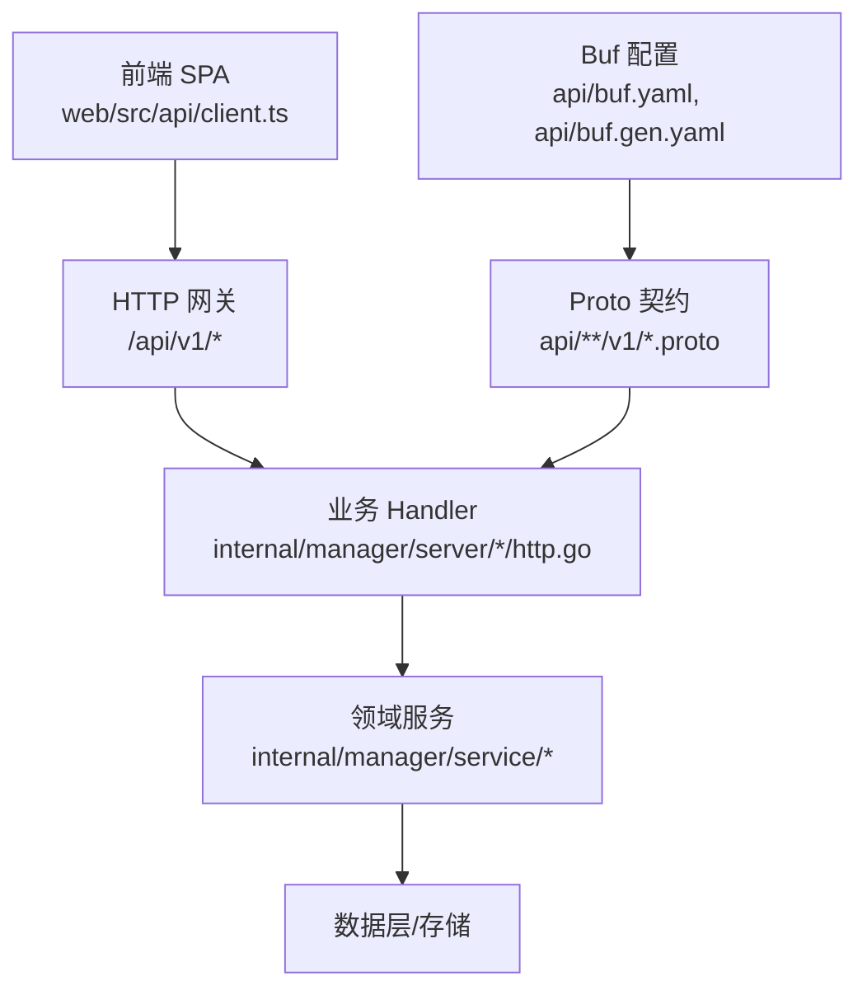
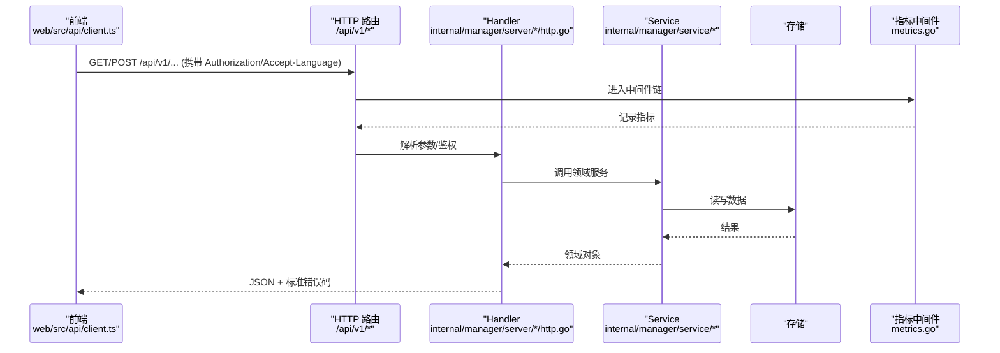
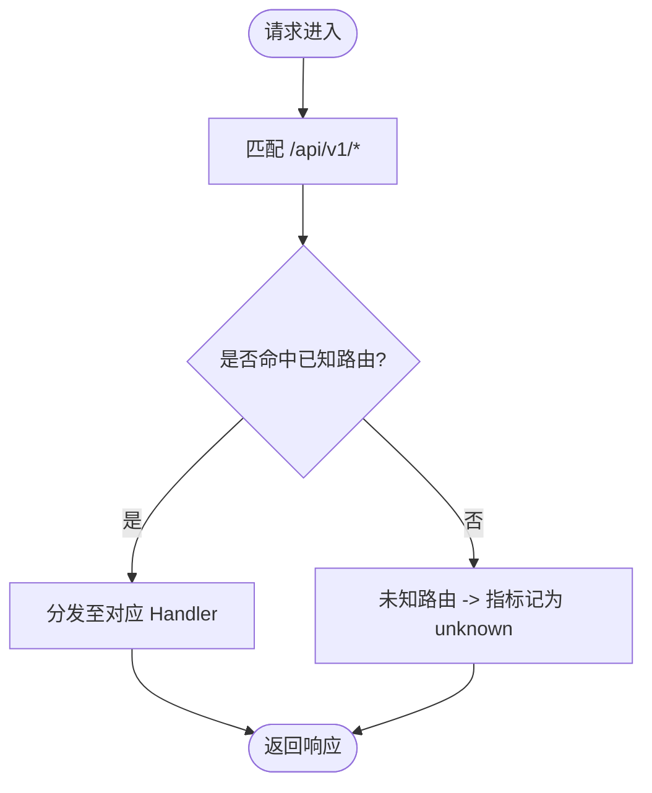
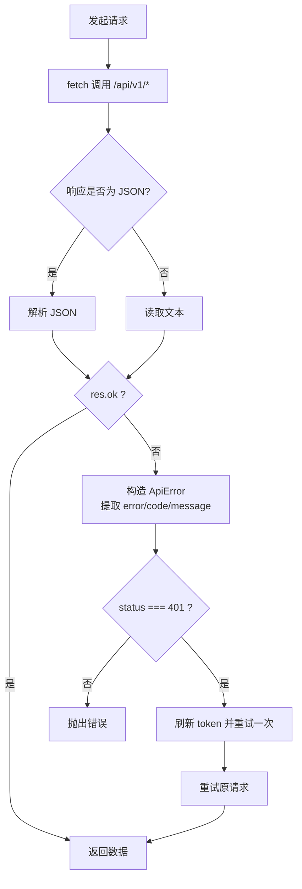
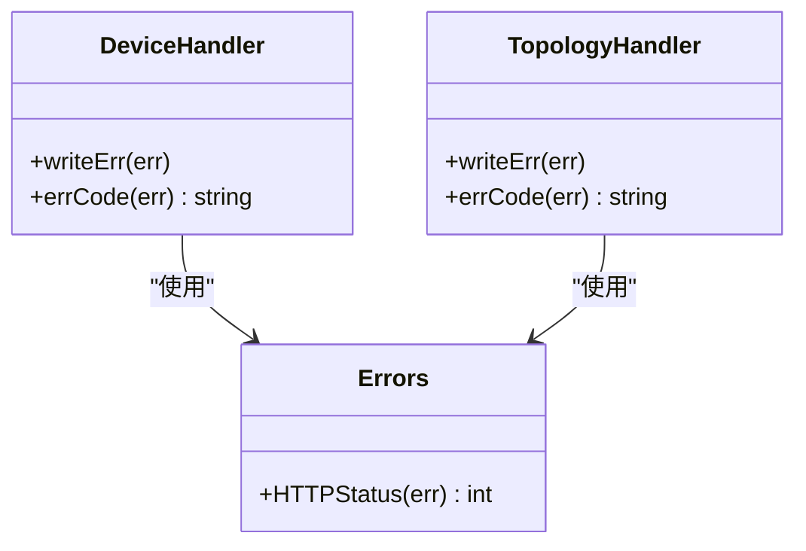
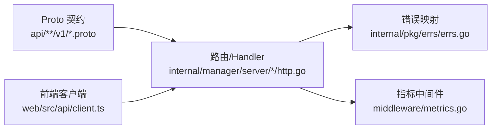

# API 版本管理

<cite>
**本文引用的文件**
- [api/README.md](file://api/README.md)
- [api/buf.yaml](file://api/buf.yaml)
- [api/buf.gen.yaml](file://api/buf.gen.yaml)
- [api/iam/v1/iam.proto](file://api/iam/v1/iam.proto)
- [api/manager/edge/v1/edge.proto](file://api/manager/edge/v1/edge.proto)
- [web/src/api/client.ts](file://web/src/api/client.ts)
- [web/src/api/operations.ts](file://web/src/api/operations.ts)
- [internal/pkg/errs/errs.go](file://internal/pkg/errs/errs.go)
- [internal/manager/server/middleware/metrics.go](file://internal/manager/server/middleware/metrics.go)
- [internal/manager/server/device/http.go](file://internal/manager/server/device/http.go)
- [internal/manager/server/topology/http.go](file://internal/manager/server/topology/http.go)
- [tests/e2e/testenv/env.go](file://tests/e2e/testenv/env.go)
</cite>

## 目录
1. [简介](#简介)
2. [项目结构](#项目结构)
3. [核心组件](#核心组件)
4. [架构总览](#架构总览)
5. [详细组件分析](#详细组件分析)
6. [依赖关系分析](#依赖关系分析)
7. [性能与可观测性](#性能与可观测性)
8. [故障排查指南](#故障排查指南)
9. [结论](#结论)
10. [附录：版本迁移与测试实践](#附录版本迁移与测试实践)

## 简介
本文件面向 ongrid 项目的 API 版本管理，围绕以下目标展开：
- 明确版本策略与设计原则：向后兼容、废弃接口治理、迁移路径。
- 说明 URL 路径中的版本标识机制（如 /api/v1）。
- 解释请求头中的版本协商机制（Accept-Version）与客户端版本检测现状。
- 给出前端对多版本响应的兼容性处理与降级策略。
- 提供新增 API 版本与迁移的具体步骤示例。
- 制定版本测试策略与自动化验证流程。

## 项目结构
本项目采用“单一真相源”的 proto 契约定义公共 API，HTTP 路由由手写 Go handler 实现，并通过 buf 进行 lint 与破坏性变更检测。API 根路径统一为 /api/v1，前端通过集中式 HTTP 客户端发起请求。

图表来源
- [web/src/api/client.ts:24-59](file://web/src/api/client.ts#L24-L59)
- [api/README.md:1-42](file://api/README.md#L1-L42)
- [api/buf.yaml:1-10](file://api/buf.yaml#L1-L10)
- [api/buf.gen.yaml:1-12](file://api/buf.gen.yaml#L1-L12)

章节来源
- [api/README.md:1-42](file://api/README.md#L1-L42)
- [api/buf.yaml:1-10](file://api/buf.yaml#L1-L10)
- [api/buf.gen.yaml:1-12](file://api/buf.gen.yaml#L1-L12)
- [web/src/api/client.ts:24-59](file://web/src/api/client.ts#L24-L59)

## 核心组件
- 契约与版本边界
  - Proto 包命名约定包含 major 版本号（如 ongrid.manager.edge.v1），每个服务一个 .proto 文件，消息按 RPC 拆分以支持向前兼容。
  - 使用 buf breaking 在 CI 中检测破坏性变更，确保版本演进可控。
- 路由与版本前缀
  - 前端统一将 BASE 设为 /api/v1，所有请求均带 v1 路径前缀。
- 错误模型与状态码
  - 统一的错误映射工具将领域错误转换为 HTTP 状态码与稳定错误码字符串，便于前后端一致处理。
- 可观测性与审计
  - 中间件记录请求指标（方法、路由模式、状态码、耗时），有助于评估版本变更的影响面。

章节来源
- [api/README.md:22-42](file://api/README.md#L22-L42)
- [api/manager/edge/v1/edge.proto:1-61](file://api/manager/edge/v1/edge.proto#L1-L61)
- [web/src/api/client.ts:24-59](file://web/src/api/client.ts#L24-L59)
- [internal/pkg/errs/errs.go:28-53](file://internal/pkg/errs/errs.go#L28-L53)
- [internal/manager/server/middleware/metrics.go:1-34](file://internal/manager/server/middleware/metrics.go#L1-L34)

## 架构总览
下图展示从前端到后端的请求链路，以及版本前缀、认证、错误映射与指标采集的位置。

图表来源
- [web/src/api/client.ts:27-115](file://web/src/api/client.ts#L27-L115)
- [internal/manager/server/middleware/metrics.go:18-34](file://internal/manager/server/middleware/metrics.go#L18-L34)
- [internal/manager/server/device/http.go:646-699](file://internal/manager/server/device/http.go#L646-L699)
- [internal/manager/server/topology/http.go:628-675](file://internal/manager/server/topology/http.go#L628-L675)

## 详细组件分析

### 版本策略与协议设计
- 版本边界
  - 通过 proto package 中的 v<major> 表达主版本边界；每个服务的消息与 RPC 集中在单个 .proto 文件中，降低跨文件耦合。
- 向后兼容保证
  - 每个 RPC 拥有独立的 Request/Response 类型，便于增量扩展字段。
  - 使用 optional 谨慎声明可选字段，避免不必要的负载与歧义。
- 废弃接口治理
  - 通过 proto option deprecated = true 标记废弃 RPC，配合文档与客户端引导迁移。
- 组织上下文隔离
  - org_id 不来自请求体，而是从 JWT claims 或 URL path 注入，避免越权与误用。

章节来源
- [api/README.md:22-33](file://api/README.md#L22-L33)
- [api/manager/edge/v1/edge.proto:10-44](file://api/manager/edge/v1/edge.proto#L10-L44)
- [api/iam/v1/iam.proto:9-11](file://api/iam/v1/iam.proto#L9-L11)

### URL 路径中的版本标识机制
- 统一前缀
  - 前端 BASE 固定为 /api/v1，所有 API 调用均以该前缀访问，简化路由管理与版本隔离。
- 路由模式
  - 后端基于 chi 路由树，指标中间件按编译期路由模式统计，有利于识别不同版本的流量分布。

图表来源
- [web/src/api/client.ts:24-59](file://web/src/api/client.ts#L24-L59)
- [internal/manager/server/middleware/metrics.go:18-34](file://internal/manager/server/middleware/metrics.go#L18-L34)

章节来源
- [web/src/api/client.ts:24-59](file://web/src/api/client.ts#L24-L59)
- [internal/manager/server/middleware/metrics.go:18-34](file://internal/manager/server/middleware/metrics.go#L18-L34)

### 请求头中的版本协商机制与客户端版本检测
- Accept-Version
  - 当前代码库未发现显式读取 Accept-Version 头的逻辑。建议在后端中间层增加版本协商能力，以便未来平滑过渡到多版本并存。
- 语言与内容协商
  - 前端发送 Accept-Language，用于 AI 输出等场景的语言适配，体现内容协商思路。
- 客户端版本检测
  - 边缘设备注册时上报 agent_version，服务端可用于灰度与兼容性判断。

章节来源
- [web/src/api/client.ts:33-40](file://web/src/api/client.ts#L33-L40)
- [api/manager/edge/v1/edge.proto:219-222](file://api/manager/edge/v1/edge.proto#L219-L222)

### 前端如何处理不同版本的 API 响应
- 统一客户端封装
  - 集中式 request 函数负责鉴权、重试、刷新 token、错误提取与抛出 ApiError。
- 字段兼容与降级
  - 通过 normalizeOperation 等归一化函数，优先取新字段名，回退到旧字段名，缺失时提供默认值，增强对历史响应的容错。
- 错误提示
  - 根据 HTTP 状态码与错误体 code/message 生成用户可读的错误信息，并在 401 时尝试刷新 token 后重试。

图表来源
- [web/src/api/client.ts:27-115](file://web/src/api/client.ts#L27-L115)
- [web/src/api/operations.ts:52-86](file://web/src/api/operations.ts#L52-L86)

章节来源
- [web/src/api/client.ts:27-115](file://web/src/api/client.ts#L27-L115)
- [web/src/api/operations.ts:52-86](file://web/src/api/operations.ts#L52-L86)

### 后端错误模型与状态码映射
- 统一映射
  - 通过 errs.HTTPStatus 将领域错误映射为标准 HTTP 状态码，并输出稳定的错误码字符串（如 not-found、unauthorized、invalid 等）。
- 一致性
  - 各模块 handler 复用 writeJSON/writeErr 与 errCode 逻辑，保证错误响应格式一致。

图表来源
- [internal/pkg/errs/errs.go:28-53](file://internal/pkg/errs/errs.go#L28-L53)
- [internal/manager/server/device/http.go:646-699](file://internal/manager/server/device/http.go#L646-L699)
- [internal/manager/server/topology/http.go:628-675](file://internal/manager/server/topology/http.go#L628-L675)

章节来源
- [internal/pkg/errs/errs.go:28-53](file://internal/pkg/errs/errs.go#L28-L53)
- [internal/manager/server/device/http.go:646-699](file://internal/manager/server/device/http.go#L646-L699)
- [internal/manager/server/topology/http.go:628-675](file://internal/manager/server/topology/http.go#L628-L675)

## 依赖关系分析
- 契约驱动
  - 前端与后端共享 proto 生成的类型（或通过文档约定），buf 保障契约稳定性。
- 路由与中间件
  - chi 路由树承载 /api/v1 下的所有资源；metrics 中间件对每条请求打点，便于版本流量分析。
- 错误与日志
  - 错误映射集中化，审计中间件仅记录显式标注的用户行为，避免噪音。

图表来源
- [api/README.md:1-42](file://api/README.md#L1-L42)
- [internal/manager/server/middleware/metrics.go:1-34](file://internal/manager/server/middleware/metrics.go#L1-L34)
- [internal/pkg/errs/errs.go:28-53](file://internal/pkg/errs/errs.go#L28-L53)
- [web/src/api/client.ts:27-115](file://web/src/api/client.ts#L27-L115)

章节来源
- [api/README.md:1-42](file://api/README.md#L1-L42)
- [internal/manager/server/middleware/metrics.go:1-34](file://internal/manager/server/middleware/metrics.go#L1-L34)
- [internal/pkg/errs/errs.go:28-53](file://internal/pkg/errs/errs.go#L28-L53)
- [web/src/api/client.ts:27-115](file://web/src/api/client.ts#L27-L115)

## 性能与可观测性
- 指标采集
  - 中间件按 chi 编译期路由模式记录请求数与耗时，未知路由归入 unknown，控制基数。
- 建议
  - 在引入新版本路由时，结合指标看板观察 QPS、延迟与错误率变化，快速定位问题。

章节来源
- [internal/manager/server/middleware/metrics.go:1-34](file://internal/manager/server/middleware/metrics.go#L1-L34)

## 故障排查指南
- 常见错误码与含义
  - 401 unauthorized、403 forbidden、404 not-found、400 invalid、409 conflict、501 not-wired-yet、500 internal。
- 前端处理
  - 401 自动刷新 token 并重试一次；若仍失败则登出；其他错误通过 code/message 展示给用户。
- 定位手段
  - 查看 metrics 面板中 route 维度指标；结合审计日志确认具体操作。

章节来源
- [internal/pkg/errs/errs.go:28-53](file://internal/pkg/errs/errs.go#L28-L53)
- [web/src/api/client.ts:82-115](file://web/src/api/client.ts#L82-L115)
- [internal/manager/server/device/http.go:669-699](file://internal/manager/server/device/http.go#L669-L699)
- [internal/manager/server/topology/http.go:651-675](file://internal/manager/server/topology/http.go#L651-L675)

## 结论
- 本项目通过 proto 契约与 buf 保障 API 版本演进的稳定性；URL 路径统一使用 /api/v1 作为版本边界。
- 前端通过集中式客户端与字段归一化提升兼容性；后端通过统一错误映射与中间件指标提升可维护性。
- 建议在后续迭代中补充 Accept-Version 协商与更完善的废弃接口治理流程，以实现更平滑的多版本共存与迁移。

## 附录：版本迁移与测试实践

### 如何添加新版本的 API（示例步骤）
- 定义契约
  - 在 api/<service>/v2/ 下新增 .proto 文件，遵循现有命名与消息拆分约定。
- 生成与校验
  - 运行 make proto 生成 stub；CI 中 buf breaking 会检测破坏性变更。
- 实现路由与 Handler
  - 在 internal/manager/server/<service>/ 下新增 v2 路由与 handler，复用错误映射与指标中间件。
- 前端适配
  - 如需新增 BASE 或路由前缀，可在前端客户端中新增常量或工厂方法；同时完善字段归一化逻辑。
- 发布与监控
  - 上线后观察 metrics 面板，确认新路由的 QPS、延迟与错误率符合预期。

章节来源
- [api/README.md:34-42](file://api/README.md#L34-L42)
- [api/buf.yaml:1-10](file://api/buf.yaml#L1-L10)
- [api/buf.gen.yaml:1-12](file://api/buf.gen.yaml#L1-L12)
- [web/src/api/client.ts:27-115](file://web/src/api/client.ts#L27-L115)
- [internal/manager/server/middleware/metrics.go:18-34](file://internal/manager/server/middleware/metrics.go#L18-L34)

### 废弃接口处理与迁移指南
- 标记废弃
  - 在 proto 中使用 option deprecated = true 标记废弃 RPC，并更新文档说明替代方案。
- 客户端引导
  - 前端在调用处给出提示或自动切换到新接口；必要时保留兼容分支一段时间。
- 服务端兼容
  - 在过渡期内保持旧接口可用，但限制流量或输出告警；逐步下线。

章节来源
- [api/manager/edge/v1/edge.proto:41-44](file://api/manager/edge/v1/edge.proto#L41-L44)
- [web/src/api/operations.ts:52-86](file://web/src/api/operations.ts#L52-L86)

### 版本测试策略与自动化验证
- 单元测试
  - 针对错误映射、参数解析、DTO 转换编写单测，覆盖边界与异常路径。
- 集成/E2E
  - 通过 tests/e2e/testenv 提供的 DoJSON 工具，向 /api/v1/* 发起真实请求，断言状态码与响应体。
- CI 检查
  - 使用 buf breaking 检测破坏性变更；结合指标与日志在预发环境验证版本影响。

章节来源
- [tests/e2e/testenv/env.go:348-381](file://tests/e2e/testenv/env.go#L348-L381)
- [api/buf.yaml:7-10](file://api/buf.yaml#L7-L10)