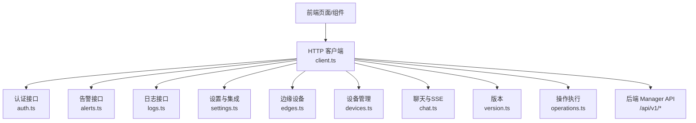
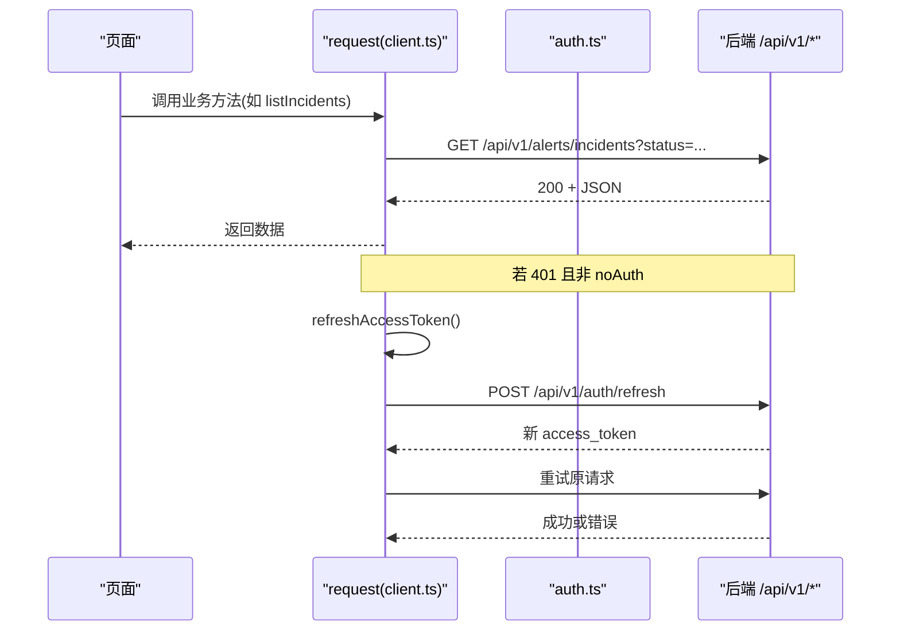
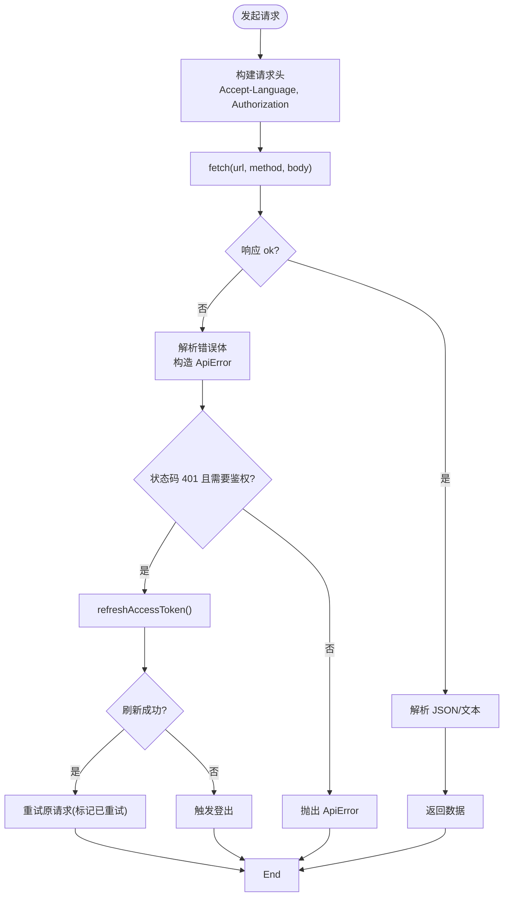
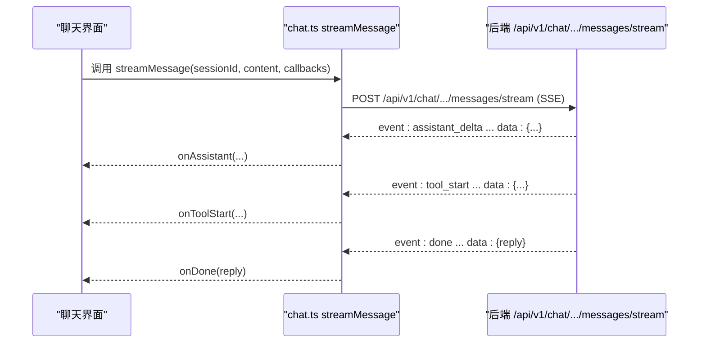
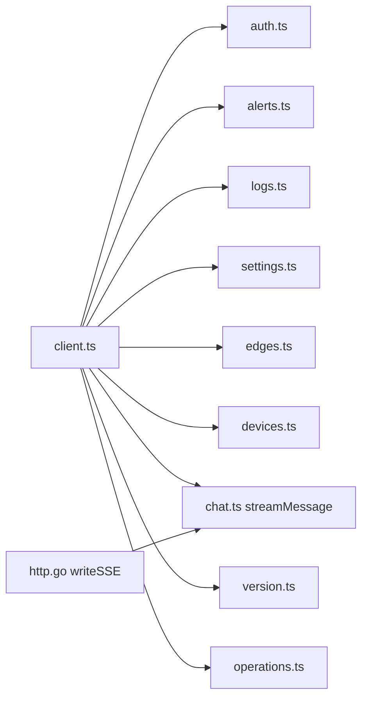

# API 集成

<cite>
**本文引用的文件**
- [web/src/api/client.ts](file://web/src/api/client.ts)
- [web/src/api/auth.ts](file://web/src/api/auth.ts)
- [web/src/api/alerts.ts](file://web/src/api/alerts.ts)
- [web/src/api/logs.ts](file://web/src/api/logs.ts)
- [web/src/api/settings.ts](file://web/src/api/settings.ts)
- [web/src/api/edges.ts](file://web/src/api/edges.ts)
- [web/src/api/devices.ts](file://web/src/api/devices.ts)
- [web/src/api/chat.ts](file://web/src/api/chat.ts)
- [web/src/api/version.ts](file://web/src/api/version.ts)
- [web/src/api/operations.ts](file://web/src/api/operations.ts)
- [internal/manager/server/operatorrun/http.go](file://internal/manager/server/operatorrun/http.go)
- [internal/manager/biz/aiops/graph/callbacks/sse.go](file://internal/manager/biz/aiops/graph/callbacks/sse.go)
</cite>

## 目录
1. [简介](#简介)
2. [项目结构](#项目结构)
3. [核心组件](#核心组件)
4. [架构总览](#架构总览)
5. [详细组件分析](#详细组件分析)
6. [依赖关系分析](#依赖关系分析)
7. [性能考虑](#性能考虑)
8. [故障排查指南](#故障排查指南)
9. [结论](#结论)
10. [附录：使用示例与最佳实践](#附录使用示例与最佳实践)

## 简介
本技术文档面向 Ongrid 前端 API 集成层，系统性说明 HTTP 客户端设计、请求拦截器、响应处理器、错误重试机制；覆盖认证、告警管理、日志查询、设置管理等模块；并解释 WebSocket 与 SSE 的实时连接实现（包括断线重连策略建议）、API 版本管理与向后兼容处理；最后提供调用示例与调试、性能优化最佳实践。

## 项目结构
前端 API 层位于 web/src/api，采用“按领域拆分”的文件组织方式：
- client.ts：统一的 HTTP 客户端，封装请求头、鉴权、错误处理、自动刷新 token、重试逻辑。
- auth.ts：认证相关接口（登录、刷新、当前用户）。
- alerts.ts：告警规则、事件、调查、通知通道等。
- logs.ts：日志搜索、字段枚举、后端配置与连通性检查、Loki 查询。
- settings.ts：系统设置、Grafana/Loki/Prom/Tempo/WebSearch/LLM 集成测试与同步。
- edges.ts / devices.ts：边缘设备与主机设备的生命周期、升级、指标、网络发现。
- chat.ts：会话消息、SSE 流式响应、工具调用事件。
- version.ts：版本信息。
- operations.ts：操作执行与产物，含前后端字段兼容处理。

图表来源
- [web/src/api/client.ts:24-115](file://web/src/api/client.ts#L24-L115)
- [web/src/api/auth.ts:19-29](file://web/src/api/auth.ts#L19-L29)
- [web/src/api/alerts.ts:31-525](file://web/src/api/alerts.ts#L31-L525)
- [web/src/api/logs.ts:82-274](file://web/src/api/logs.ts#L82-L274)
- [web/src/api/settings.ts:19-157](file://web/src/api/settings.ts#L19-L157)
- [web/src/api/edges.ts:65-469](file://web/src/api/edges.ts#L65-L469)
- [web/src/api/devices.ts:134-198](file://web/src/api/devices.ts#L134-L198)
- [web/src/api/chat.ts:147-361](file://web/src/api/chat.ts#L147-L361)
- [web/src/api/version.ts:7-9](file://web/src/api/version.ts#L7-L9)
- [web/src/api/operations.ts:28-87](file://web/src/api/operations.ts#L28-L87)

章节来源
- [web/src/api/client.ts:24-115](file://web/src/api/client.ts#L24-L115)

## 核心组件
- 统一请求函数 request：负责构造 URL、请求头、Body、发送 fetch、解析 JSON/文本、统一错误抛出 ApiError、401 时自动刷新 token 并重试一次。
- 自动刷新 token：refreshAccessToken 串行化并发刷新，成功后更新本地会话，失败则触发登出。
- 业务模块：各 api/*.ts 暴露类型与函数，屏蔽路径拼接、参数编码、响应解包细节。
- SSE 流式客户端：streamMessage 基于 ReadableStream 解析 event/data 帧，分发到回调。

章节来源
- [web/src/api/client.ts:4-163](file://web/src/api/client.ts#L4-L163)
- [web/src/api/chat.ts:253-361](file://web/src/api/chat.ts#L253-L361)

## 架构总览
HTTP 客户端作为所有 API 调用的入口，集中处理鉴权、国际化语言头、错误与重试。业务模块通过 request 访问后端 /api/v1/* 路由。SSE 用于聊天流式输出，WebSocket 在终端场景由页面组件直接管理连接。

图表来源
- [web/src/api/client.ts:27-115](file://web/src/api/client.ts#L27-L115)
- [web/src/api/client.ts:117-163](file://web/src/api/client.ts#L117-L163)
- [web/src/api/auth.ts:19-29](file://web/src/api/auth.ts#L19-L29)

## 详细组件分析

### HTTP 客户端与错误重试
- 请求拦截器：
  - 自动附加 Accept-Language（来自 i18n），便于 LLM 驱动端点输出语言一致。
  - 非 noAuth 请求自动附加 Authorization: Bearer <token>。
  - 自动序列化 JSON 或透传 FormData。
- 响应处理器：
  - 根据 Content-Type 解析 JSON 或文本。
  - 非 2xx 统一抛 ApiError，携带 status、code、payload。
  - 401 且非 noAuth：尝试刷新 token，成功后重试一次；刷新失败则登出。
- 重试机制：
  - 仅针对 401 且存在有效 refresh_token 的情况，避免无意义重试。
  - 防止并发刷新：refreshInFlight 保证同一时刻只有一个刷新请求。

图表来源
- [web/src/api/client.ts:27-115](file://web/src/api/client.ts#L27-L115)
- [web/src/api/client.ts:117-163](file://web/src/api/client.ts#L117-L163)

章节来源
- [web/src/api/client.ts:4-163](file://web/src/api/client.ts#L4-L163)

### 认证接口
- 登录：POST /api/v1/auth/login，noAuth=true，返回 access_token、refresh_token、role 等。
- 刷新：POST /api/v1/auth/refresh，noAuth=true，传入 refresh_token。
- 当前用户：GET /api/v1/auth/self，返回 email、role、id。

章节来源
- [web/src/api/auth.ts:1-30](file://web/src/api/auth.ts#L1-L30)

### 告警管理
- 事件：listIncidents、getIncident、ackIncident、resolveIncident、silenceIncident、listIncidentEvents。
- 调查：getIncidentInvestigation、triggerIncidentInvestigation。
- 规则：CRUD、启用/禁用、预览（previewRule）及内置规则元数据与多语言标签。
- 通知通道：CRUD、测试通道。
- 运行时信息：获取评估器间隔与冷却时间。

章节来源
- [web/src/api/alerts.ts:31-525](file://web/src/api/alerts.ts#L31-L525)

### 日志查询与后端管理
- 搜索：searchLogs（支持 scope、关键词、字段过滤、分页游标、方向）。
- 字段与值：listLogFields、listLogFieldValues。
- 直方图：getLogHistogram。
- 后端配置：get/save/select/test，连接状态检查（按全局或单个后端）。
- Loki 查询：queryLogsRange、labels/values 枚举。

章节来源
- [web/src/api/logs.ts:82-274](file://web/src/api/logs.ts#L82-L274)

### 设置与集成
- 系统设置：list/set/delete/reveal（敏感字段明文读取）。
- Grafana：test/sync、同步 Loki 数据源。
- Prometheus/Loki/Tempo/WebSearch：连接测试。
- LLM：配置校验与保存、失效缓存。

章节来源
- [web/src/api/settings.ts:19-157](file://web/src/api/settings.ts#L19-L157)

### 边缘设备与主机设备
- 边缘：创建、列表、详情、删除、密钥轮换、批量升级/删除、升级任务、进程查看、指标查询、PromQL 透传。
- 设备：列表、详情、网络发现候选、SNMP 扫描、网络轮询配置、删除、关联边缘。

章节来源
- [web/src/api/edges.ts:65-469](file://web/src/api/edges.ts#L65-L469)
- [web/src/api/devices.ts:134-198](file://web/src/api/devices.ts#L134-L198)

### 聊天与会话（含 SSE）
- 会话：创建、重命名、停止、历史消息、删除。
- 消息：postMessage（普通响应）、streamMessage（SSE 流式）。
- SSE 事件：assistant/tool_start/tool_end/approval_pending/done/error，前端解析 event/data 帧并分发回调。
- 模型目录：listModels。

图表来源
- [web/src/api/chat.ts:253-361](file://web/src/api/chat.ts#L253-L361)
- [internal/manager/biz/aiops/graph/callbacks/sse.go:22-50](file://internal/manager/biz/aiops/graph/callbacks/sse.go#L22-L50)
- [internal/manager/server/operatorrun/http.go:210-224](file://internal/manager/server/operatorrun/http.go#L210-L224)

章节来源
- [web/src/api/chat.ts:73-361](file://web/src/api/chat.ts#L73-L361)

### 版本与兼容性
- 版本接口：GET /api/v1/version，返回 manager_version。
- 向后兼容：operations.ts 对后端返回字段大小写进行兼容映射，确保新旧版本字段差异不影响前端展示。

章节来源
- [web/src/api/version.ts:7-9](file://web/src/api/version.ts#L7-L9)
- [web/src/api/operations.ts:28-87](file://web/src/api/operations.ts#L28-L87)

## 依赖关系分析
- client.ts 被所有 api/*.ts 复用，形成单一出口，降低重复代码与不一致行为。
- auth.ts 依赖 client.ts 的 noAuth 能力以绕过鉴权。
- chat.ts 除使用 client.ts 外，还直接基于 fetch + ReadableStream 实现 SSE。
- 后端 SSE 写入通过 http.go 的 writeSSE 辅助函数，统一 event/data 格式与 flush。

图表来源
- [web/src/api/client.ts:27-115](file://web/src/api/client.ts#L27-L115)
- [web/src/api/auth.ts:19-29](file://web/src/api/auth.ts#L19-L29)
- [web/src/api/chat.ts:253-361](file://web/src/api/chat.ts#L253-L361)
- [internal/manager/server/operatorrun/http.go:210-224](file://internal/manager/server/operatorrun/http.go#L210-L224)

章节来源
- [web/src/api/client.ts:27-115](file://web/src/api/client.ts#L27-L115)
- [web/src/api/chat.ts:253-361](file://web/src/api/chat.ts#L253-L361)
- [internal/manager/server/operatorrun/http.go:210-224](file://internal/manager/server/operatorrun/http.go#L210-L224)

## 性能考虑
- 请求合并与节流：
  - 刷新 token 使用单例 Promise 防抖，避免并发刷新风暴。
- 网络开销：
  - 日志搜索支持 cursor 分页与 limit，减少单次负载。
  - PromQL 透传限制表达式长度与超时，避免大查询拖垮系统。
- 渲染性能：
  - SSE 增量推送（assistant_delta）减少全量重绘。
  - 告警规则预览（previewRule）只读侧通道，不持久化。
- 缓存与失效：
  - LLM 配置变更后主动 invalidate 路由缓存，缩短生效延迟。

[本节为通用指导，无需特定文件引用]

## 故障排查指南
- 常见错误：
  - 网络错误：request 捕获 AbortError 与网络异常，抛出 ApiError。
  - 401 未授权：自动刷新 token；若刷新失败则登出。
  - SSE 错误：streamMessage 在初始响应非 2xx 时抛出 ApiError；流中 error 事件通过回调上报。
- 定位步骤：
  - 检查浏览器 Network 面板中的请求路径、状态码、响应体。
  - 确认 Authorization 头是否正确注入。
  - 对于 SSE，检查 event 类型与 data 是否按预期到达。
  - 对于日志搜索，验证 start/end、scope、filters 是否合理。
- 后端错误码：
  - 后端统一错误体包含 error/code，前端会提取并显示。

章节来源
- [web/src/api/client.ts:61-115](file://web/src/api/client.ts#L61-L115)
- [web/src/api/chat.ts:282-297](file://web/src/api/chat.ts#L282-L297)
- [internal/manager/server/operatorrun/http.go:240-260](file://internal/manager/server/operatorrun/http.go#L240-L260)

## 结论
该 API 集成层通过统一的 HTTP 客户端实现了鉴权、错误处理与自动重试，业务模块职责清晰、类型完备；SSE 流式通信满足聊天实时体验；版本兼容与字段归一化提升了稳定性。建议在后续迭代中补充 WebSocket 断线重连策略与更细粒度的重试退避策略，进一步提升健壮性。

[本节为总结性内容，无需特定文件引用]

## 附录：使用示例与最佳实践

### 典型调用流程（以告警为例）
- 列出告警：调用 listIncidents({ status, severity, page, pageSize })，内部拼接查询参数并请求 /api/v1/alerts/incidents。
- 确认/解决/静音：分别调用 ackIncident、resolveIncident、silenceIncident，附带 note 或 until/reason。
- 预览规则：调用 previewRule(input, lookbackSeconds)，用于规则编辑前试算。

章节来源
- [web/src/api/alerts.ts:31-55](file://web/src/api/alerts.ts#L31-L55)
- [web/src/api/alerts.ts:459-464](file://web/src/api/alerts.ts#L459-L464)

### SSE 流式聊天
- 调用 streamMessage(sessionId, content, callbacks, opts, signal)：
  - 设置 Accept: text/event-stream。
  - 解析 event/data 帧，分发 onAssistant/onToolStart/onToolEnd/onApprovalPending/onDone/onError。
  - 支持 AbortSignal 取消流。

章节来源
- [web/src/api/chat.ts:253-361](file://web/src/api/chat.ts#L253-L361)

### 日志搜索与后端切换
- 搜索：searchLogs(input, signal) 支持关键字、字段过滤、游标分页。
- 后端管理：get/save/select/test 以及 connection-check，便于运维验证连通性。

章节来源
- [web/src/api/logs.ts:82-110](file://web/src/api/logs.ts#L82-L110)
- [web/src/api/logs.ts:158-218](file://web/src/api/logs.ts#L158-L218)

### 设置与集成测试
- 系统设置：list/set/delete/reveal，敏感字段按需明文读取。
- 集成测试：testGrafanaConnection/testPromConnection/testLokiConnection/testTempoConnection/testWebSearchConnection/testLLMConfiguration。

章节来源
- [web/src/api/settings.ts:19-157](file://web/src/api/settings.ts#L19-L157)

### 版本管理与向后兼容
- 版本：getManagerVersion 获取 manager_version。
- 兼容：operations.ts 对后端返回字段大小写进行兼容映射，确保新旧版本一致。

章节来源
- [web/src/api/version.ts:7-9](file://web/src/api/version.ts#L7-L9)
- [web/src/api/operations.ts:28-87](file://web/src/api/operations.ts#L28-L87)

### 调试工具与最佳实践
- 调试建议：
  - 使用浏览器开发者工具的 Network 面板观察请求与 SSE 事件。
  - 在控制台打印 ApiError 的 status、code、payload，快速定位问题。
  - 对长耗时操作（如日志搜索）传入 AbortSignal，支持取消。
- 最佳实践：
  - 尽量使用分页与游标，控制单次数据量。
  - 对敏感配置使用 revealSetting 按需明文读取，避免常驻明文。
  - 对 SSE 流，务必监听 onError 并在必要时清理资源。

[本节为通用指导，无需特定文件引用]