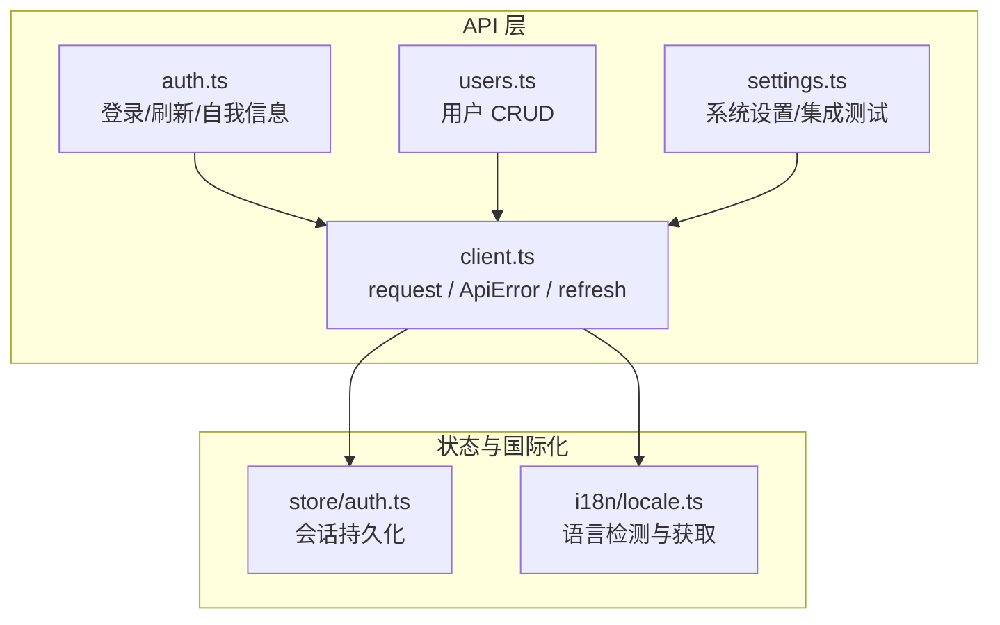
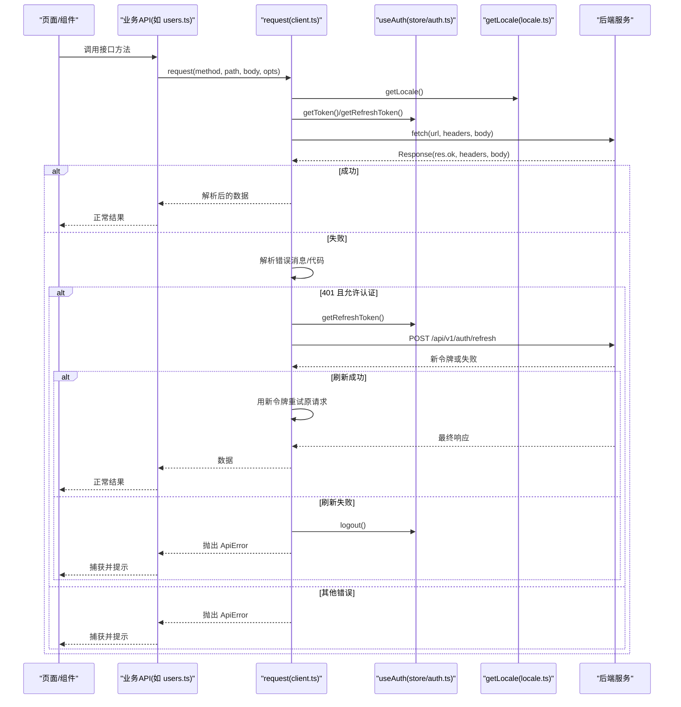
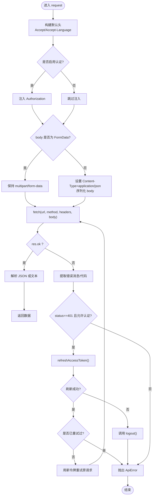
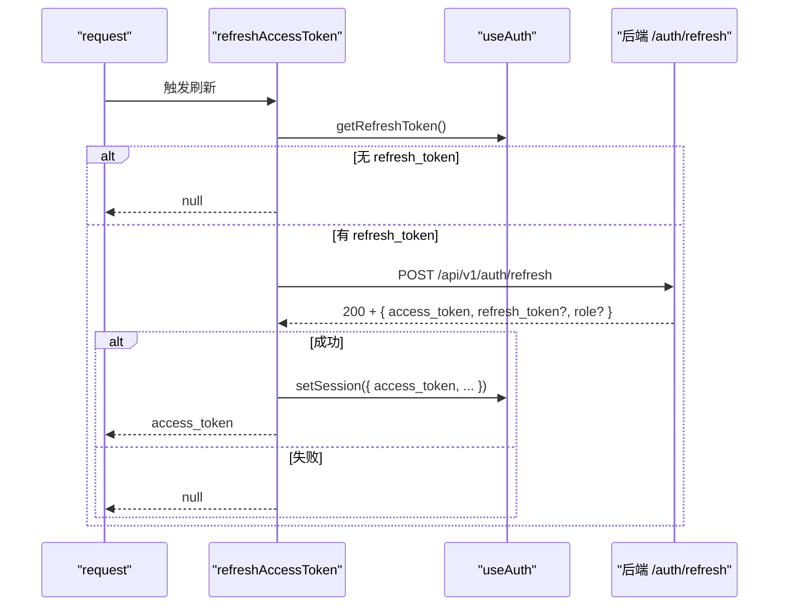
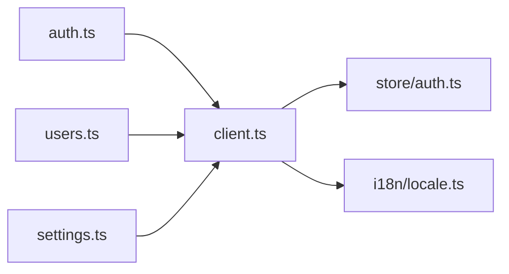

# HTTP 客户端

<cite>
**本文引用的文件**
- [web/src/api/client.ts](file://web/src/api/client.ts)
- [web/src/store/auth.ts](file://web/src/store/auth.ts)
- [web/src/i18n/locale.ts](file://web/src/i18n/locale.ts)
- [web/src/api/auth.ts](file://web/src/api/auth.ts)
- [web/src/api/users.ts](file://web/src/api/users.ts)
- [web/src/api/settings.ts](file://web/src/api/settings.ts)
</cite>

## 目录
1. [简介](#简介)
2. [项目结构](#项目结构)
3. [核心组件](#核心组件)
4. [架构总览](#架构总览)
5. [详细组件分析](#详细组件分析)
6. [依赖关系分析](#依赖关系分析)
7. [性能考虑](#性能考虑)
8. [故障排查指南](#故障排查指南)
9. [结论](#结论)
10. [附录：使用示例与最佳实践](#附录使用示例与最佳实践)

## 简介
本技术文档聚焦于前端 HTTP 客户端实现，围绕以下目标展开：
- 深入解释 ApiError 类的设计与实现（错误类型、状态码处理、错误信息格式化）。
- 详细说明 request 函数的核心功能（支持 GET/POST/PUT/DELETE/PATCH、路径拼接、请求头设置、响应解析）。
- 解释自动令牌刷新机制的实现原理（refreshAccessToken 的工作流程、并发控制、错误处理）。
- 说明请求拦截器的实现（认证令牌注入、语言偏好设置、Content-Type 处理）。
- 提供具体调用 API 的示例，展示如何处理各种响应情况。
- 总结错误处理策略与调试技巧。

## 项目结构
HTTP 客户端位于 web/src/api 目录下，核心为 client.ts；认证状态由 zustand store 管理；国际化语言通过 locale.ts 提供；各业务模块以独立的 API 封装文件组织，统一基于 request 函数发起网络请求。

图表来源
- [web/src/api/client.ts:27-115](file://web/src/api/client.ts#L27-L115)
- [web/src/store/auth.ts:20-41](file://web/src/store/auth.ts#L20-L41)
- [web/src/i18n/locale.ts:56-65](file://web/src/i18n/locale.ts#L56-L65)
- [web/src/api/auth.ts:19-29](file://web/src/api/auth.ts#L19-L29)
- [web/src/api/users.ts:59-100](file://web/src/api/users.ts#L59-L100)
- [web/src/api/settings.ts:19-156](file://web/src/api/settings.ts#L19-L156)

章节来源
- [web/src/api/client.ts:24-163](file://web/src/api/client.ts#L24-L163)
- [web/src/store/auth.ts:1-50](file://web/src/store/auth.ts#L1-L50)
- [web/src/i18n/locale.ts:1-102](file://web/src/i18n/locale.ts#L1-L102)
- [web/src/api/auth.ts:1-30](file://web/src/api/auth.ts#L1-L30)
- [web/src/api/users.ts:1-101](file://web/src/api/users.ts#L1-L101)
- [web/src/api/settings.ts:1-157](file://web/src/api/settings.ts#L1-L157)

## 核心组件
- ApiError：统一的异常类型，携带 status、code、payload，便于上层区分错误来源与上下文。
- request：通用请求函数，负责构建 URL、设置请求头、发送请求、解析响应、统一错误抛出与自动重试。
- refreshAccessToken：自动刷新访问令牌的内部函数，具备并发去重与失败回退逻辑。
- 认证与国际化注入：在请求前注入 Authorization 与 Accept-Language，并依据 body 类型设置 Content-Type。

章节来源
- [web/src/api/client.ts:4-15](file://web/src/api/client.ts#L4-L15)
- [web/src/api/client.ts:27-115](file://web/src/api/client.ts#L27-L115)
- [web/src/api/client.ts:117-162](file://web/src/api/client.ts#L117-L162)
- [web/src/store/auth.ts:43-49](file://web/src/store/auth.ts#L43-L49)
- [web/src/i18n/locale.ts:56-65](file://web/src/i18n/locale.ts#L56-L65)

## 架构总览
请求从业务 API 模块进入，统一经 request 函数处理。请求头包含 Accept、Accept-Language、可选 Authorization 与 Content-Type。响应按 content-type 解析 JSON 或文本。若返回非 2xx，则尝试从响应体提取错误消息与 code；遇到 401 且未禁用认证时触发自动刷新，成功后原地重试一次。刷新过程通过全局 Promise 进行并发控制，避免重复刷新风暴。

图表来源
- [web/src/api/client.ts:27-115](file://web/src/api/client.ts#L27-L115)
- [web/src/api/client.ts:117-162](file://web/src/api/client.ts#L117-L162)
- [web/src/store/auth.ts:20-41](file://web/src/store/auth.ts#L20-L41)
- [web/src/i18n/locale.ts:56-65](file://web/src/i18n/locale.ts#L56-L65)

## 详细组件分析

### ApiError 设计与实现
- 字段
  - status：HTTP 状态码；网络错误时为 0。
  - code：服务端返回的错误码（可选）。
  - payload：原始响应体（对象或字符串），便于上层做更细粒度的展示或重试判断。
- 构造与命名
  - name 固定为 'ApiError'，便于 catch 中通过 instanceof 识别。
- 使用建议
  - 在 UI 层捕获 ApiError，优先显示 message；对 code/payload 可做日志记录或特定分支处理。

章节来源
- [web/src/api/client.ts:4-15](file://web/src/api/client.ts#L4-L15)

### request 函数：核心能力
- 支持的 HTTP 方法
  - GET、POST、PUT、DELETE、PATCH。
- 路径处理
  - 若传入 path 以 http 开头则直接使用；否则拼接 BASE=/api/v1，并保证路径以 / 开头。
- 请求头设置
  - 默认设置 Accept=application/json 与 Accept-Language=getLocale()。
  - 若非 noAuth，自动注入 Authorization=Bearer <token>。
  - 当 body 非 FormData 时，设置 Content-Type=application/json 并序列化。
- 响应解析
  - 根据 content-type 决定解析 JSON 或读取文本；JSON 解析失败时降级为 null。
- 错误处理与自动重试
  - 非 2xx 时，优先从响应体提取 error/message/code 作为错误消息；纯文本响应会截断过长内容。
  - 401 且允许认证时，调用 refreshAccessToken；若刷新成功且本次尚未重试，则以新令牌重试一次。
  - 刷新失败时调用 useAuth.logout() 强制登出。
  - 网络异常（AbortError）直接透传；其他网络错误包装为 ApiError(status=0)。

图表来源
- [web/src/api/client.ts:27-115](file://web/src/api/client.ts#L27-L115)
- [web/src/api/client.ts:117-162](file://web/src/api/client.ts#L117-L162)

章节来源
- [web/src/api/client.ts:27-115](file://web/src/api/client.ts#L27-L115)

### 自动令牌刷新机制（refreshAccessToken）
- 并发控制
  - 使用模块级变量 refreshInFlight 缓存正在进行的刷新 Promise；同一时刻仅发起一次刷新，后续调用复用该 Promise。
- 刷新流程
  - 读取 refresh_token，若无则直接返回 null。
  - 向 /api/v1/auth/refresh 发起 POST，携带 { refresh_token }。
  - 若响应非 2xx 或返回体缺少 access_token，视为刷新失败，返回 null。
  - 成功时更新本地会话（access_token、refresh_token、role、email），并返回新的 access_token。
- 错误处理
  - 刷新过程中任何异常均被捕获并返回 null；finally 确保刷新标志位释放。
- 与 request 的协作
  - 401 时触发刷新；刷新成功后以 _retryingAfterRefresh=true 重试一次，避免无限循环。
  - 刷新失败则强制登出，引导用户重新登录。

图表来源
- [web/src/api/client.ts:117-162](file://web/src/api/client.ts#L117-L162)
- [web/src/store/auth.ts:20-41](file://web/src/store/auth.ts#L20-L41)

章节来源
- [web/src/api/client.ts:117-162](file://web/src/api/client.ts#L117-L162)
- [web/src/store/auth.ts:20-41](file://web/src/store/auth.ts#L20-L41)

### 请求拦截器：认证、语言与 Content-Type
- 认证令牌注入
  - 通过 getToken() 获取当前 access_token，并在非 noAuth 场景下注入 Authorization 头。
- 语言偏好设置
  - 通过 getLocale() 获取当前 UI 语言，注入 Accept-Language，使后端可据此生成对应语言的输出（如 LLM 相关端点）。
- Content-Type 处理
  - 当 body 为 FormData 时，不设置 Content-Type，交由浏览器设置 multipart/form-data 及 boundary。
  - 其他对象/数组等 body 会被 JSON.stringify 并设置 Content-Type=application/json。

章节来源
- [web/src/api/client.ts:33-57](file://web/src/api/client.ts#L33-L57)
- [web/src/i18n/locale.ts:56-65](file://web/src/i18n/locale.ts#L56-L65)
- [web/src/store/auth.ts:43-49](file://web/src/store/auth.ts#L43-L49)

### 使用示例与最佳实践
- 登录与刷新
  - 使用 auth.ts 中的 login/refresh/getSelf 等方法，这些方法内部调用 request，并针对无需认证的接口传入 noAuth。
- 用户管理
  - users.ts 提供了 getMe/listUsers/createUser/patchUser/deleteUser 等封装，统一走 request。
- 系统设置与集成测试
  - settings.ts 封装了系统设置的增删改查以及 Grafana/Loki/Tempo/WebSearch/LLM 等集成连通性测试接口。
- 错误处理模式
  - 在调用处捕获 ApiError，优先显示 message；必要时根据 code/payload 做差异化处理。
  - 对于 401，客户端已自动刷新并重试一次；若仍失败，通常意味着权限或服务端问题，应提示用户或引导重新登录。

章节来源
- [web/src/api/auth.ts:19-29](file://web/src/api/auth.ts#L19-L29)
- [web/src/api/users.ts:59-100](file://web/src/api/users.ts#L59-L100)
- [web/src/api/settings.ts:19-156](file://web/src/api/settings.ts#L19-L156)

## 依赖关系分析
- client.ts 依赖
  - store/auth.ts：获取/设置 token、刷新 token、登出。
  - i18n/locale.ts：获取当前语言用于 Accept-Language。
- 业务 API 模块依赖
  - auth.ts、users.ts、settings.ts 等均依赖 client.ts 的 request 与 ApiError。
- 耦合与内聚
  - 请求逻辑集中在 client.ts，业务模块只关注参数与类型定义，内聚度高、耦合度低。
  - 通过 RequestOpts.noAuth 与 _retryingAfterRefresh 等选项灵活控制行为，避免硬编码分支。

图表来源
- [web/src/api/client.ts:1-3](file://web/src/api/client.ts#L1-L3)
- [web/src/api/auth.ts:1-29](file://web/src/api/auth.ts#L1-L29)
- [web/src/api/users.ts:15-100](file://web/src/api/users.ts#L15-L100)
- [web/src/api/settings.ts:1-156](file://web/src/api/settings.ts#L1-L156)

章节来源
- [web/src/api/client.ts:1-3](file://web/src/api/client.ts#L1-L3)
- [web/src/api/auth.ts:1-29](file://web/src/api/auth.ts#L1-L29)
- [web/src/api/users.ts:15-100](file://web/src/api/users.ts#L15-L100)
- [web/src/api/settings.ts:1-156](file://web/src/api/settings.ts#L1-L156)

## 性能考虑
- 并发刷新控制
  - 通过 refreshInFlight 避免多次并发刷新造成资源浪费与竞态。
- 最小化请求头
  - 仅在需要时注入 Authorization；FormData 场景不设置 Content-Type，减少多余头部。
- 响应解析优化
  - 仅在 content-type 为 application/json 时解析 JSON，否则直接取文本，降低不必要的开销。
- 重试策略
  - 仅在 401 且刷新成功时重试一次，避免无限重试导致的雪崩。

[本节为通用指导，不直接分析具体文件]

## 故障排查指南
- 常见问题定位
  - 401 持续出现：检查 refresh_token 是否存在、后端 /auth/refresh 是否正常、setSession 是否正确更新。
  - 网络错误（status=0）：检查 AbortError 是否被误吞、网络连通性与代理配置。
  - 中文/英文输出不符：确认 getLocale() 返回值与后端是否遵循 Accept-Language。
- 调试技巧
  - 在 catch 中打印 ApiError.status/code/payload，快速定位服务端错误码与详情。
  - 对关键请求增加日志（URL、method、headers、body 摘要），注意脱敏敏感信息。
  - 使用浏览器开发者工具的 Network 面板观察请求头与响应体，验证 Authorization 与 Accept-Language 是否正确注入。

章节来源
- [web/src/api/client.ts:62-112](file://web/src/api/client.ts#L62-L112)
- [web/src/api/client.ts:117-162](file://web/src/api/client.ts#L117-L162)

## 结论
该 HTTP 客户端以简洁而健壮的方式实现了通用请求能力：统一的错误模型、自动化的认证与刷新、完善的请求头与响应解析、以及清晰的模块化组织。通过集中式拦截与标准化错误处理，业务模块可以专注于领域逻辑，提升可维护性与扩展性。

[本节为总结性内容，不直接分析具体文件]

## 附录：使用示例与最佳实践
- 基本调用
  - 使用业务 API 模块的方法（如 users.ts 中的 getMe/listUsers），内部已封装 request 调用。
- 带参数的请求
  - 传递对象作为 body 将自动序列化为 JSON；上传文件请使用 FormData 并避免手动设置 Content-Type。
- 错误处理
  - 捕获 ApiError，优先显示 message；对 code/payload 做日志记录或特定分支处理。
  - 401 场景下，客户端会自动刷新并重试一次；若仍失败，提示用户重新登录。
- 语言与国际化
  - 通过 Accept-Language 影响后端输出语言；如需覆盖，可在 opts.headers 中自定义。

章节来源
- [web/src/api/users.ts:59-100](file://web/src/api/users.ts#L59-L100)
- [web/src/api/settings.ts:19-156](file://web/src/api/settings.ts#L19-L156)
- [web/src/api/client.ts:33-57](file://web/src/api/client.ts#L33-L57)
- [web/src/api/client.ts:82-112](file://web/src/api/client.ts#L82-L112)