# 业务接口

<cite>
**本文引用的文件**
- [api/README.md](file://api/README.md)
- [alert.proto](file://api/manager/alert/v1/alert.proto)
- [logs.proto](file://api/manager/logs/v1/logs.proto)
- [setting.proto](file://api/manager/setting/v1/setting.proto)
- [edge.proto](file://api/manager/edge/v1/edge.proto)
- [k8s.proto](file://api/manager/k8s/v1/k8s.proto)
- [metric.proto](file://api/manager/metric/v1/metric.proto)
- [aiops.proto](file://api/manager/aiops/v1/aiops.proto)
- [knowledge_http.go](file://internal/manager/server/knowledge/http.go)
- [device_http.go](file://internal/manager/server/device/http.go)
- [alert_http.go](file://internal/manager/server/alert/http.go)
- [logs_http.go](file://internal/manager/server/logs/http.go)
</cite>

## 目录
1. [简介](#简介)
2. [项目结构](#项目结构)
3. [核心组件](#核心组件)
4. [架构总览](#架构总览)
5. [详细组件分析](#详细组件分析)
6. [依赖关系分析](#依赖关系分析)
7. [性能考虑](#性能考虑)
8. [故障排查指南](#故障排查指南)
9. [结论](#结论)
10. [附录：接口速查与示例](#附录接口速查与示例)

## 简介
本技术文档面向业务接口的调用方与维护者，系统性说明告警管理、日志查询、系统设置、设备管理与知识库等模块的 API 设计、数据模型、请求/响应格式、时间戳与状态映射、分页与游标机制、批量与异步任务处理策略，以及错误处理与性能优化建议。所有对外契约以 proto 定义为准，HTTP 路由由手写 handler 实现（非 gRPC-Gateway）。

## 项目结构
- 公共契约集中位于 api/ 目录，按业务域划分 v1 版本；每个服务一个 .proto 文件，统一约定 ID 使用 uint64、时间使用 google.protobuf.Timestamp、org_id 不通过请求体传入而由中间件注入。
- HTTP 路由与处理器位于 internal/manager/server/*，按领域拆分；handler 负责参数校验、权限控制、DTO 转换、错误码映射与审计埋点。
- 业务逻辑位于 internal/manager/biz/*，数据访问位于 internal/manager/data/*，领域模型位于 internal/manager/model/*。

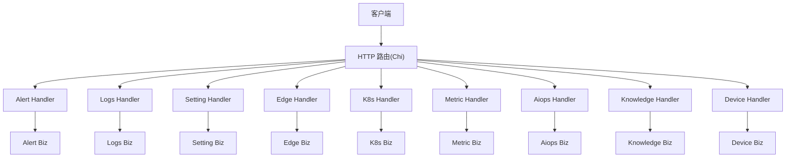

图表来源
- [api/README.md:1-42](file://api/README.md#L1-L42)
- [knowledge_http.go:109-137](file://internal/manager/server/knowledge/http.go#L109-L137)
- [device_http.go:40-66](file://internal/manager/server/device/http.go#L40-L66)

章节来源
- [api/README.md:1-42](file://api/README.md#L1-L42)

## 核心组件
- 告警管理：事件生命周期（创建、确认、静默、解决）、规则与通道、运行时信息。
- 日志查询：后端无关的日志搜索、字段枚举、直方图、上下文、后端配置与连通性检查。
- 系统设置：LLM 集成配置的校验与原子保存。
- 设备管理：主机设备清单、角色与可达性、网络发现候选与 SNMP 扫描。
- 知识库：文档 CRUD、路径树、搜索、Git 仓库同步、内置 Vault 同步、SSH 身份管理。
- 边缘设备：注册、列表、详情、密钥轮换、批量安装配置、升级任务。
- Kubernetes：集群注册、健康、节点/工作负载/Pod/事件、操作审计、引导令牌轮换。
- 指标：主机时序指标查询（自动粒度选择）。
- AIOps：对话会话、消息发送（阻塞/流式）、工具调用轨迹与用量统计。

章节来源
- [alert.proto:9-88](file://api/manager/alert/v1/alert.proto#L9-L88)
- [logs.proto:9-346](file://api/manager/logs/v1/logs.proto#L9-L346)
- [setting.proto:7-72](file://api/manager/setting/v1/setting.proto#L7-L72)
- [edge.proto:10-317](file://api/manager/edge/v1/edge.proto#L10-L317)
- [k8s.proto:9-391](file://api/manager/k8s/v1/k8s.proto#L9-L391)
- [metric.proto:9-55](file://api/manager/metric/v1/metric.proto#L9-L55)
- [aiops.proto:9-170](file://api/manager/aiops/v1/aiops.proto#L9-L170)
- [knowledge_http.go:109-137](file://internal/manager/server/knowledge/http.go#L109-L137)
- [device_http.go:40-66](file://internal/manager/server/device/http.go#L40-L66)

## 架构总览
- 契约优先：所有对外 RPC/REST 契约在 proto 中定义，生成 Go 类型供 handler 与 biz 复用。
- 组织隔离：org_id 由中间件从 JWT/URL 注入，不在请求体中出现，避免越权。
- 分层清晰：HTTP 层只做协议适配、鉴权、DTO 转换；biz 层承载业务；data 层负责持久化。
- 可插拔后端：日志支持内置 Loki 与外部 Elasticsearch，提供测试与切换能力。
- 批处理与异步：升级任务、仓库同步、连接性检查等采用后台任务+轮询/回调模式。

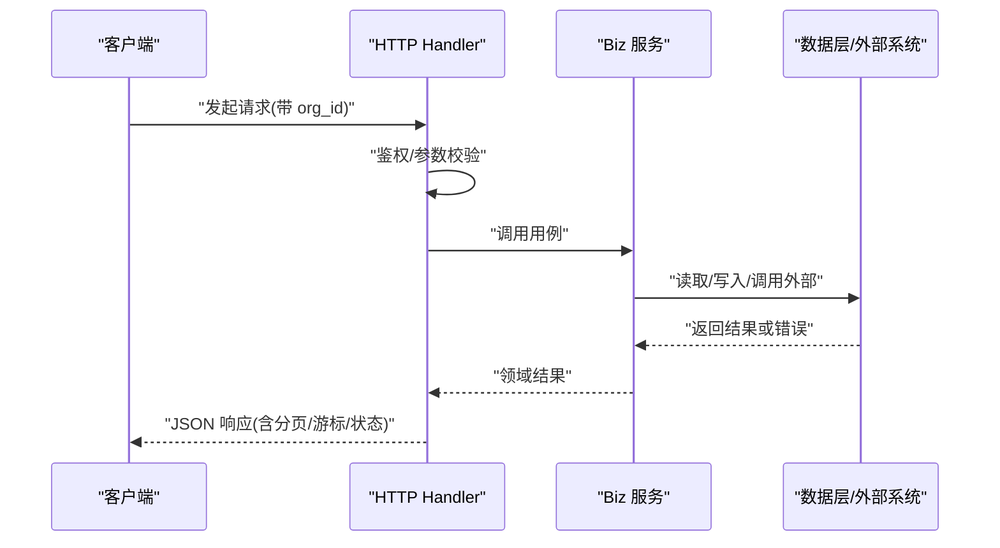

图表来源
- [api/README.md:22-32](file://api/README.md#L22-L32)
- [knowledge_http.go:597-612](file://internal/manager/server/knowledge/http.go#L597-L612)
- [device_http.go:669-696](file://internal/manager/server/device/http.go#L669-L696)

## 详细组件分析

### 告警管理（Alert）
- 能力
  - 事件列表：支持按状态、严重级别、全文检索、分页。
  - 事件详情：按 id 获取单条事件。
  - 事件操作：确认（带备注）、解决（带备注）。
- 数据模型要点
  - 严重级别：info/warning/critical。
  - 事件状态：open/acknowledged/silenced/resolved。
  - 时间字段：fired_at/updated_at/acknowledged_at/resolved_at。
- 分页
  - page/page_size + total。
- 时间处理
  - 使用 google.protobuf.Timestamp，前后端需做时区与序列化一致性处理。
- 典型流程

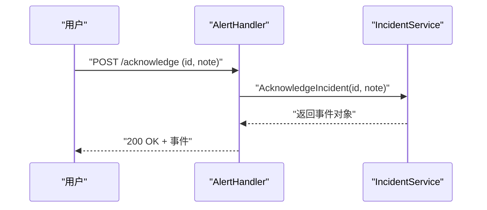

图表来源
- [alert.proto:9-88](file://api/manager/alert/v1/alert.proto#L9-L88)

章节来源
- [alert.proto:9-88](file://api/manager/alert/v1/alert.proto#L9-L88)
- [alert_http.go:106-136](file://internal/manager/server/alert/http.go#L106-L136)

### 日志查询（Logs）
- 能力
  - 搜索：时间范围、作用域（设备/集群/命名空间/工作负载/Pod/容器/服务名/源/级别/文件/节点/单元）、关键词匹配模式、字段过滤、排序方向、游标翻页。
  - 元数据：字段枚举、字段值枚举、时间直方图、上下文（前后 N 条）。
  - 后端管理：查看/设置/测试/选择外部 ES 或内置 Loki、连接性检查（按 edge 维度）。
- 数据模型要点
  - LogRecord：id/timestamp/message/severity_text/severity_number/backend/attributes/resource_attributes/trace/span/observed_timestamp。
  - SearchLogsData：records/next_cursor/has_more/took_ms/backends。
  - LogBackend：类型、状态、端点、凭据引用、CA/TLS、Kibana URL、检测版本、最近测试时间等。
- 分页与游标
  - cursor + has_more + next_cursor；适合大结果集流式拉取。
- 时间处理
  - start/end/observed_timestamp 均为 Timestamp；注意跨时区展示。
- 后端选择与连通性
  - SelectLogBackend/StartLogBackendConnectionCheck/GetLogBackendConnectionCheck 支持异步检查与聚合统计（online/verified/pending/failed/offline）。
- 典型流程（搜索日志）

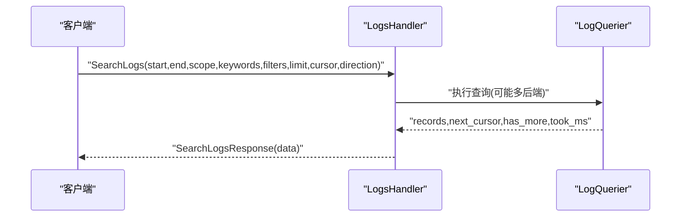

图表来源
- [logs.proto:76-114](file://api/manager/logs/v1/logs.proto#L76-L114)
- [logs.proto:189-346](file://api/manager/logs/v1/logs.proto#L189-L346)

章节来源
- [logs.proto:9-346](file://api/manager/logs/v1/logs.proto#L9-L346)
- [logs_http.go:771-784](file://internal/manager/server/logs/http.go#L771-L784)

### 系统设置（Setting）
- 能力
  - 校验 LLM 配置：最小请求探测，返回稳定错误码与安全摘要。
  - 校验并保存：同一份草稿全部模型通过后原子落库；空 api_key 表示显式禁用。
- 数据模型要点
  - provider：openai/anthropic/zhipu/gemini/deepseek/kimi/custom。
  - base_url：命名提供商留空用默认端点；custom 必填。
  - models：保存后暴露给调用方的完整模型列表。
  - latency_ms：用于前端体验反馈。
- 典型流程

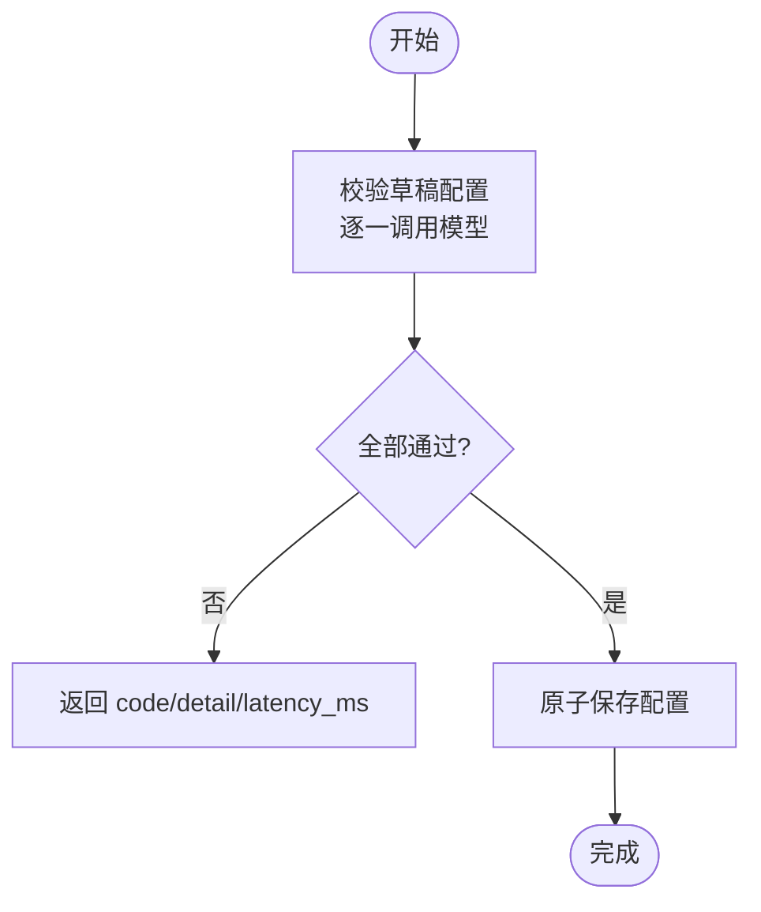

图表来源
- [setting.proto:7-72](file://api/manager/setting/v1/setting.proto#L7-L72)

章节来源
- [setting.proto:7-72](file://api/manager/setting/v1/setting.proto#L7-L72)

### 设备管理（Device）
- 能力
  - 设备清单：支持按名称/主机名/在线状态/角色过滤，limit/offset 分页。
  - 设备详情：主机信息、实时资源使用率、拓扑节点关联。
  - 角色管理：管理员更新角色集合。
  - 网络发现：候选列表、SNMP 扫描、提升为正式设备、轮询配置。
- 数据模型要点
  - deviceItem：包含 CPU/内存/磁盘使用率、在线状态、最后心跳时间、可达性状态（网络设备）。
  - networkCandidateItem：观察来源、置信度、接口/链路快照。
- 权限
  - 写操作需要 admin 角色。
- 典型流程（列出设备）

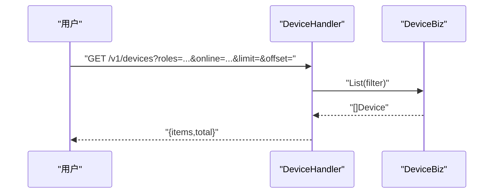

图表来源
- [device_http.go:40-66](file://internal/manager/server/device/http.go#L40-L66)
- [device_http.go:193-264](file://internal/manager/server/device/http.go#L193-L264)

章节来源
- [device_http.go:40-66](file://internal/manager/server/device/http.go#L40-L66)
- [device_http.go:193-264](file://internal/manager/server/device/http.go#L193-L264)
- [device_http.go:669-696](file://internal/manager/server/device/http.go#L669-L696)

### 知识库（Knowledge）
- 能力
  - 文档：列表/详情/创建/更新/移动/删除/上传（md/txt/pdf/docx，最大 8MiB）。
  - 搜索：全文关键词搜索，支持 path/path_prefix/tag 过滤，limit 上限 50。
  - 仓库：注册 Git 仓库、触发同步、删除；内置 Vault 同步专用端点。
  - SSH 身份：列表/创建/生成/更新/删除。
- 数据模型要点
  - docDTO：ID 以 string 序列化以避免 JS 精度丢失；source_type/repo_id/url/title/title_en/content/path/tags/时间戳。
  - repoDTO：url/branch/description/last_synced_at/file_count/is_builtin/时间戳。
- 权限与审计
  - 写操作受 casbin 中间件保护；关键变更记录审计事件。
- 典型流程（上传文档）

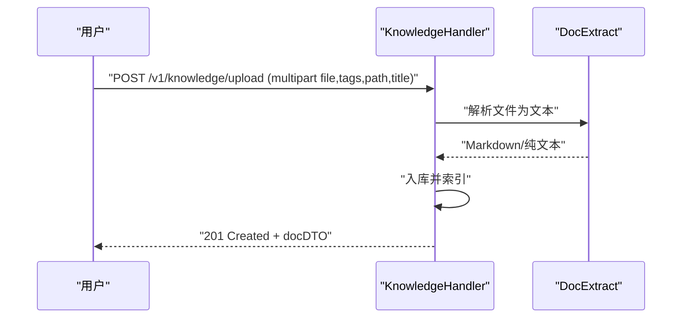

图表来源
- [knowledge_http.go:288-354](file://internal/manager/server/knowledge/http.go#L288-L354)
- [knowledge_http.go:141-177](file://internal/manager/server/knowledge/http.go#L141-L177)

章节来源
- [knowledge_http.go:109-137](file://internal/manager/server/knowledge/http.go#L109-L137)
- [knowledge_http.go:214-242](file://internal/manager/server/knowledge/http.go#L214-L242)
- [knowledge_http.go:288-354](file://internal/manager/server/knowledge/http.go#L288-L354)
- [knowledge_http.go:425-456](file://internal/manager/server/knowledge/http.go#L425-L456)
- [knowledge_http.go:480-565](file://internal/manager/server/knowledge/http.go#L480-L565)
- [knowledge_http.go:597-612](file://internal/manager/server/knowledge/http.go#L597-L612)

### 边缘设备（Edge）
- 能力
  - 设备：创建（签发 AccessKey/SecretKey）、列表（在线状态过滤）、详情、删除、密钥轮换。
  - 批量安装：创建/列表/删除安装配置；EnrollEdge 领取独立凭证。
  - 升级任务：创建/列表/详情/重试，支持分批与逐设备明细。
- 数据模型要点
  - EdgeStatus：online/offline。
  - UpgradeJob/UpgradeJobItem：任务级与设备级状态机（queued/running/succeeded/partial_failed/failed 等），批次进度。
- 典型流程（创建升级任务）

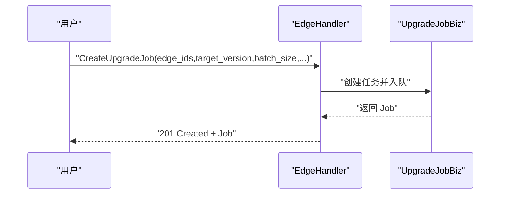

图表来源
- [edge.proto:10-61](file://api/manager/edge/v1/edge.proto#L10-L61)
- [edge.proto:232-317](file://api/manager/edge/v1/edge.proto#L232-L317)

章节来源
- [edge.proto:10-317](file://api/manager/edge/v1/edge.proto#L10-L317)

### Kubernetes
- 能力
  - 集群：创建（返回 bootstrap_token/install_command/node_bootstrap_token）、列表、详情、健康、删除、引导令牌轮换。
  - 资源：节点/工作负载/Pod/事件列表，支持 issue_only 过滤问题项。
  - 审计：统一的操作审计视图（脱敏 args_json）。
  - 内部 Enroll：一次性引导令牌认证，上报能力与版本。
- 数据模型要点
  - KubernetesCluster：状态、控制器信息、库存同步延迟/滞后、能力矩阵、节点覆盖统计。
  - Workload/Pod/Event：丰富的元数据与时间戳。
- 典型流程（创建集群）

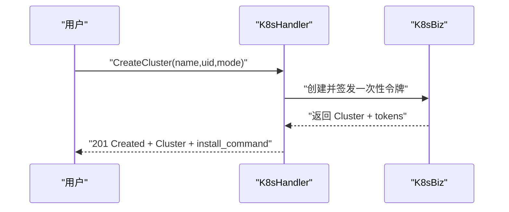

图表来源
- [k8s.proto:9-27](file://api/manager/k8s/v1/k8s.proto#L9-L27)
- [k8s.proto:83-94](file://api/manager/k8s/v1/k8s.proto#L83-L94)

章节来源
- [k8s.proto:9-391](file://api/manager/k8s/v1/k8s.proto#L9-L391)

### 指标（Metric）
- 能力
  - QueryHostMetrics：按 edge_id 与时间窗口查询主机指标，支持 AUTO/RAW/M5/H1 粒度选择；响应回显实际采用的粒度。
- 数据模型要点
  - HostMetricPoint：cpu_pct/mem_pct/load1/5/15/net_rx_bps/net_tx_bps/disk_used_pct。
- 典型流程

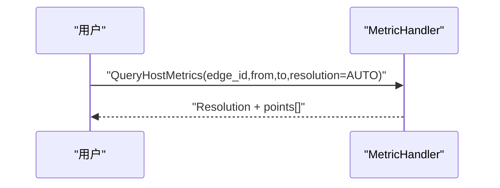

图表来源
- [metric.proto:9-55](file://api/manager/metric/v1/metric.proto#L9-L55)

章节来源
- [metric.proto:9-55](file://api/manager/metric/v1/metric.proto#L9-L55)

### AIOps（对话与工具）
- 能力
  - 会话：创建/列表。
  - 消息：PostMessage（阻塞等待收敛）、StreamMessage（SSE/WebSocket 流式片段）。
  - 历史：ListMessages（after_id 游标）。
- 数据模型要点
  - ChatSession/ChatMessage/ToolCall/ToolResult/TokenUsage。
  - StreamChunk：content_delta/tool_call_start/tool_call_result/done。
- 典型流程（流式对话）

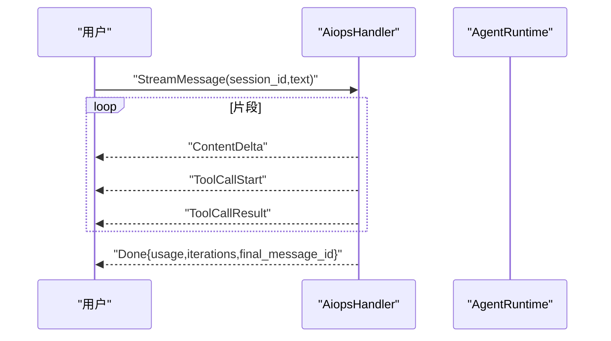

图表来源
- [aiops.proto:9-29](file://api/manager/aiops/v1/aiops.proto#L9-L29)
- [aiops.proto:128-158](file://api/manager/aiops/v1/aiops.proto#L128-L158)

章节来源
- [aiops.proto:9-170](file://api/manager/aiops/v1/aiops.proto#L9-L170)

## 依赖关系分析
- 契约到实现
  - 所有 proto 定义作为单一事实来源；HTTP 路由在 server/* 手写实现，严格遵循契约中的字段与语义。
- 模块耦合
  - 日志模块与外部后端（Loki/ES）解耦，通过后端抽象与测试/选择接口降低耦合。
  - 设备与网络发现模块可选启用（NetworkDiscovery 为空时降级）。
- 外部依赖
  - 指标写入走 edge tunnel push_host_metrics + Ingester，不经过 MetricService。
  - AIOps 依赖 LLM 提供商与工具注册表。

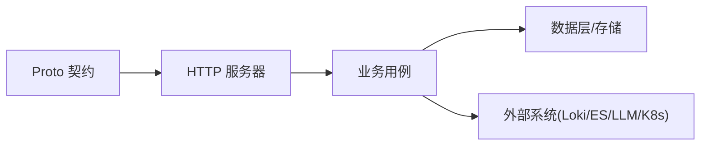

图表来源
- [api/README.md:1-42](file://api/README.md#L1-L42)
- [metric.proto:9-17](file://api/manager/metric/v1/metric.proto#L9-L17)

章节来源
- [api/README.md:1-42](file://api/README.md#L1-L42)
- [metric.proto:9-17](file://api/manager/metric/v1/metric.proto#L9-L17)

## 性能考虑
- 分页与游标
  - 告警/设备/知识库/日志均提供分页；日志使用 cursor 游标减少深翻页成本。
- 时间窗口与粒度
  - 指标查询按窗口自动选择 RAW/M5/H1，避免长跨度全量扫描。
- 批量与异步
  - 升级任务分批次推进，支持重试失败项；仓库同步与连接性检查异步执行，前端轮询状态。
- 传输与体积
  - 知识库上传限制 8MiB，防止过大文件导致内存压力；日志字段值与直方图按需返回。
- 缓存与只读
  - 列表接口尽量使用只读查询；敏感字段（如 SecretKey）仅一次明文返回，服务端存哈希。

[本节为通用指导，不直接分析具体文件]

## 故障排查指南
- 统一错误码
  - 设备模块将错误映射为 not-found/unauthorized/forbidden/conflict/invalid/not-wired-yet/internal。
  - 日志后端错误映射为 LOG_BACKEND_* 系列错误码，超时返回 GatewayTimeout。
- 常见原因
  - 参数非法：字段类型/取值范围不符（如 unknown role、limit 超限）。
  - 未授权：缺少租户上下文或角色不足。
  - 后端不可达：ES/Loki 连接失败或证书问题。
- 定位步骤
  - 检查请求参数与分页/游标是否合法。
  - 查看日志后端选择与测试报告（edges 维度的 online/verified/pending/failed/offline）。
  - 对升级任务查看 items 明细的错误码与错误消息。

章节来源
- [device_http.go:669-696](file://internal/manager/server/device/http.go#L669-L696)
- [logs_http.go:771-784](file://internal/manager/server/logs/http.go#L771-L784)

## 结论
本系统以 proto 契约为核心，围绕告警、日志、设置、设备、知识库、边缘、Kubernetes、指标与 AIOps 构建统一的业务接口体系。通过严格的参数校验、清晰的错误码、分页与游标、批量与异步任务机制，兼顾了易用性与可扩展性。建议在调用侧做好时间与时区处理、分页/游标迭代、错误码分支与重试策略，以获得稳定高效的集成体验。

## 附录：接口速查与示例

### 告警管理
- 列表事件
  - 方法/路径：GET /v1/alerts/incidents
  - 查询参数：status_filter、severity_filter、query、page、page_size
  - 响应：incidents[]、total、page、page_size
- 确认事件
  - 方法/路径：POST /v1/alerts/incidents/{id}/acknowledge
  - 请求体：note
  - 响应：incident
- 解决事件
  - 方法/路径：POST /v1/alerts/incidents/{id}/resolve
  - 请求体：note
  - 响应：incident

章节来源
- [alert.proto:9-88](file://api/manager/alert/v1/alert.proto#L9-L88)

### 日志查询
- 搜索日志
  - 方法/路径：POST /v1/logs/search
  - 请求体：start、end、scope、keywords、filters、limit、cursor、direction
  - 响应：code、message、data{records[], next_cursor, has_more, took_ms, backends[]}
- 字段与值
  - GET /v1/logs/fields
  - GET /v1/logs/field-values?field=...&start=...&end=...&scope=...&limit=...
- 直方图
  - POST /v1/logs/histogram
  - 请求体：search、interval
- 上下文
  - POST /v1/logs/context
  - 请求体：record_id、timestamp、scope、before、after、backend
- 后端管理
  - GET/PUT/TEST/SELECT /v1/logs/backend
  - 连接性检查：START/GET /v1/logs/backend/connection-check

章节来源
- [logs.proto:76-114](file://api/manager/logs/v1/logs.proto#L76-L114)
- [logs.proto:125-187](file://api/manager/logs/v1/logs.proto#L125-L187)
- [logs.proto:189-346](file://api/manager/logs/v1/logs.proto#L189-L346)

### 系统设置（LLM）
- 校验配置
  - 方法/路径：POST /api/v1/integrations/llm/test
  - 请求体：provider、api_key、base_url、default_model、models[]
  - 响应：valid、code、provider、model、detail、latency_ms
- 校验并保存
  - 方法/路径：POST /api/v1/integrations/llm/validate-and-save
  - 请求体：同校验
  - 响应：valid、code、provider、model、detail、latency_ms、saved、disabled

章节来源
- [setting.proto:7-72](file://api/manager/setting/v1/setting.proto#L7-L72)

### 设备管理
- 列表设备
  - 方法/路径：GET /v1/devices
  - 查询参数：hostname、name、roles（逗号分隔）、online、limit、offset
  - 响应：items[]、total
- 设备详情
  - 方法/路径：GET /v1/devices/{id}
  - 响应：设备对象
- 更新名称/描述
  - 方法/路径：PATCH /v1/devices/{id}
  - 请求体：name?、description?
  - 响应：204 No Content
- 更新角色
  - 方法/路径：PATCH /v1/devices/{id}/roles
  - 请求体：roles[]
  - 响应：204 No Content
- 删除设备
  - 方法/路径：DELETE /v1/devices/{id}
  - 响应：204 No Content
- 网络发现
  - 候选列表：GET /v1/network-discovery/candidates
  - 扫描并提升：POST /v1/network-discovery/candidates/{id}/snmp-scan
  - 提升：POST /v1/network-discovery/candidates/{id}/promote
  - 轮询配置：PATCH /v1/devices/{id}/network/polling

章节来源
- [device_http.go:40-66](file://internal/manager/server/device/http.go#L40-L66)
- [device_http.go:193-264](file://internal/manager/server/device/http.go#L193-L264)
- [device_http.go:320-349](file://internal/manager/server/device/http.go#L320-L349)
- [device_http.go:472-555](file://internal/manager/server/device/http.go#L472-L555)

### 知识库
- 文档
  - 列表：GET /v1/knowledge/docs?source_type=&path=&path_prefix=&tag=&repo_id=&limit=
  - 详情：GET /v1/knowledge/docs/{id}
  - 创建：POST /v1/knowledge/docs {title,title_en,content,url,path,tags[]}
  - 更新：PATCH /v1/knowledge/docs/{id} {title?,title_en?,content?,path?,tags?}
  - 移动：PATCH /v1/knowledge/docs/{id}/move {path}
  - 删除：DELETE /v1/knowledge/docs/{id}
  - 上传：POST /v1/knowledge/upload (multipart file,tags,path,title)
- 搜索
  - GET /v1/knowledge/search?q=&limit=&path=&path_prefix=&tag=...
- 仓库
  - 列表：GET /v1/knowledge/repos
  - 注册：POST /v1/knowledge/repos {url,branch?,description?}
  - 同步：POST /v1/knowledge/repos/{id}/sync
  - 删除：DELETE /v1/knowledge/repos/{id}
  - 内置 Vault 同步：POST /v1/knowledge/vault/sync
- SSH 身份
  - 列表：GET /v1/knowledge/ssh-identities
  - 创建：POST /v1/knowledge/ssh-identities
  - 生成：POST /v1/knowledge/ssh-identities/generate
  - 更新：PATCH /v1/knowledge/ssh-identities/{id}
  - 删除：DELETE /v1/knowledge/ssh-identities/{id}

章节来源
- [knowledge_http.go:109-137](file://internal/manager/server/knowledge/http.go#L109-L137)
- [knowledge_http.go:214-242](file://internal/manager/server/knowledge/http.go#L214-L242)
- [knowledge_http.go:267-286](file://internal/manager/server/knowledge/http.go#L267-L286)
- [knowledge_http.go:288-354](file://internal/manager/server/knowledge/http.go#L288-L354)
- [knowledge_http.go:364-410](file://internal/manager/server/knowledge/http.go#L364-L410)
- [knowledge_http.go:425-456](file://internal/manager/server/knowledge/http.go#L425-L456)
- [knowledge_http.go:480-565](file://internal/manager/server/knowledge/http.go#L480-L565)

### 边缘设备
- 创建设备
  - 方法/路径：POST /v1/edges
  - 请求体：name
  - 响应：edge、access_key、secret_key（仅此次明文）
- 列表设备
  - 方法/路径：GET /v1/edges?status_filter=online|offline|all&page=&page_size=&name=
  - 响应：edges[]、total、page、page_size
- 详情/删除/轮换密钥
  - GET /v1/edges/{id}
  - DELETE /v1/edges/{id}
  - POST /v1/edges/{id}/rotate-secret
- 批量安装
  - 创建配置：POST /v1/edges/enrollment-profiles
  - 列表：GET /v1/edges/enrollment-profiles
  - 删除：DELETE /v1/edges/enrollment-profiles/{id}
  - 领取：POST /v1/edges/enroll（Authorization: Bearer <enrollment_token>）
- 升级任务
  - 创建：POST /v1/edges/upgrade-jobs
  - 列表：GET /v1/edges/upgrade-jobs
  - 详情：GET /v1/edges/upgrade-jobs/{id}
  - 重试：POST /v1/edges/upgrade-jobs/{id}/retry

章节来源
- [edge.proto:10-61](file://api/manager/edge/v1/edge.proto#L10-L61)
- [edge.proto:124-230](file://api/manager/edge/v1/edge.proto#L124-L230)
- [edge.proto:232-317](file://api/manager/edge/v1/edge.proto#L232-L317)

### Kubernetes
- 集群
  - 创建：POST /v1/kubernetes/clusters {name,uid,mode}
  - 列表：GET /v1/kubernetes/clusters?status=&mode=&name=&limit=&offset=
  - 详情：GET /v1/kubernetes/clusters/{id}
  - 健康：GET /v1/kubernetes/clusters/{id}/health
  - 删除：DELETE /v1/kubernetes/clusters/{id}?force=
  - 轮换引导令牌：POST /v1/kubernetes/clusters/{id}/rotate-bootstrap-token
- 资源
  - 节点：GET /v1/kubernetes/nodes?cluster_id=&q=&issue_only=&limit=&offset=
  - 工作负载：GET /v1/kubernetes/workloads?cluster_id=&namespace=&kind=&q=&issue_only=&group_replica_sets=&limit=&offset=
  - Pod：GET /v1/kubernetes/pods?cluster_id=&namespace=&node_name=&phase=&reason=&q=&issue_only=&limit=&offset=
  - 事件：GET /v1/kubernetes/events?cluster_id=&namespace=&type=&reason=&involved_kind=&involved_name=&q=&issue_only=&limit=&offset=
- 审计
  - 列表：GET /v1/kubernetes/action-audits?cluster_id=&limit=&offset=
- 内部注册
  - Enroll：一次性令牌认证，上报 cluster/node/role/capabilities/agent_version

章节来源
- [k8s.proto:9-27](file://api/manager/k8s/v1/k8s.proto#L9-L27)
- [k8s.proto:83-177](file://api/manager/k8s/v1/k8s.proto#L83-L177)
- [k8s.proto:179-367](file://api/manager/k8s/v1/k8s.proto#L179-L367)
- [k8s.proto:369-391](file://api/manager/k8s/v1/k8s.proto#L369-L391)

### 指标
- 查询主机指标
  - 方法/路径：POST /v1/metrics/host
  - 请求体：edge_id、from、to、resolution（AUTO/RAW/M5/H1）
  - 响应：edge_id、resolution、points[]

章节来源
- [metric.proto:9-55](file://api/manager/metric/v1/metric.proto#L9-L55)

### AIOps
- 会话
  - 创建：POST /v1/aiops/chat-sessions {title, scope_edge_ids[]}
  - 列表：GET /v1/aiops/chat-sessions?page=&page_size=
- 消息
  - 阻塞：POST /v1/aiops/messages {session_id,text}
  - 流式：POST /v1/aiops/messages/stream {session_id,text}
- 历史
  - 列表：GET /v1/aiops/messages?session_id=&after_id=&limit=

章节来源
- [aiops.proto:9-29](file://api/manager/aiops/v1/aiops.proto#L9-L29)
- [aiops.proto:93-170](file://api/manager/aiops/v1/aiops.proto#L93-L170)