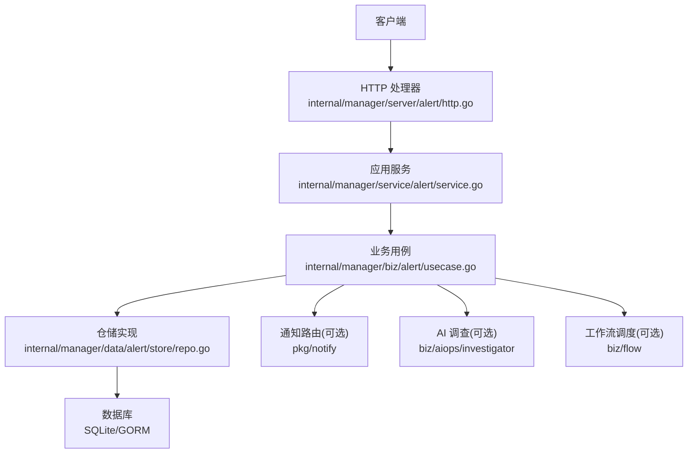
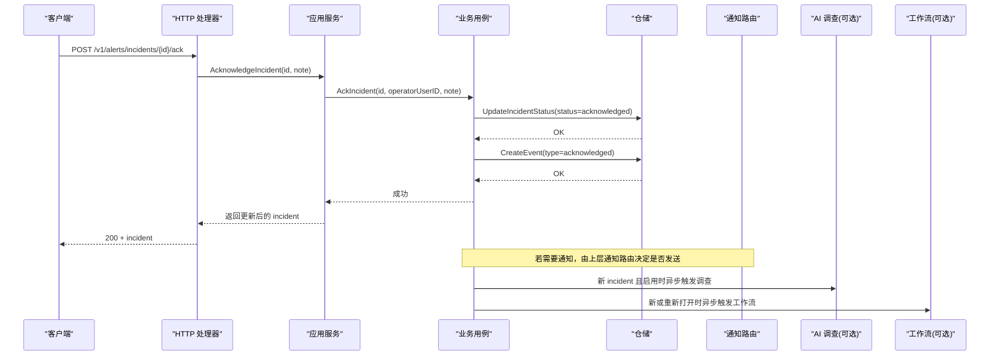
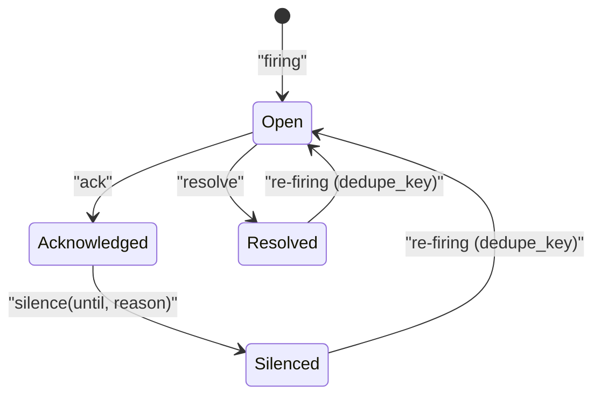
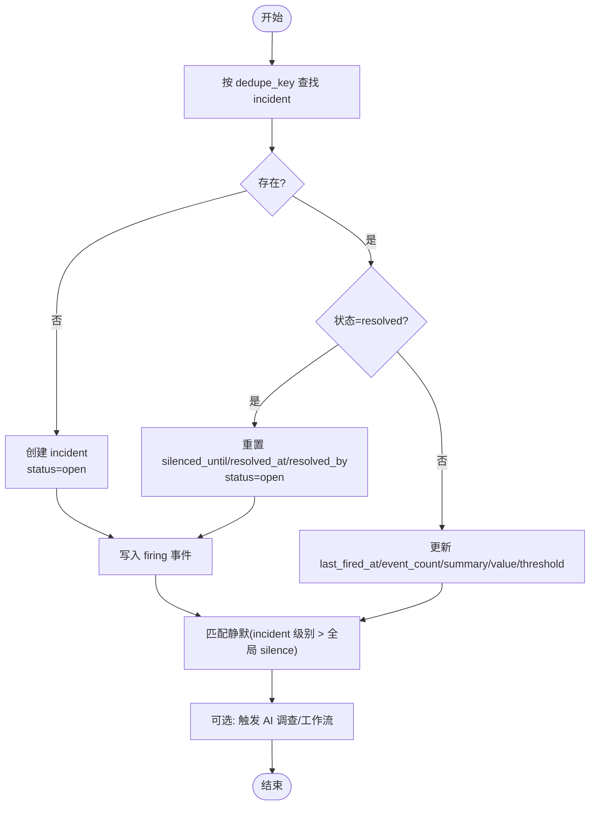
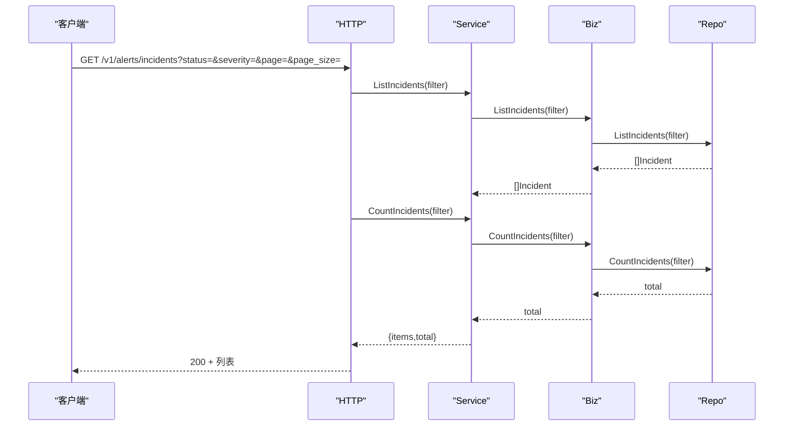
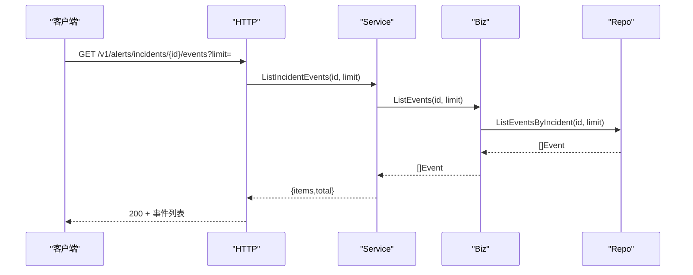
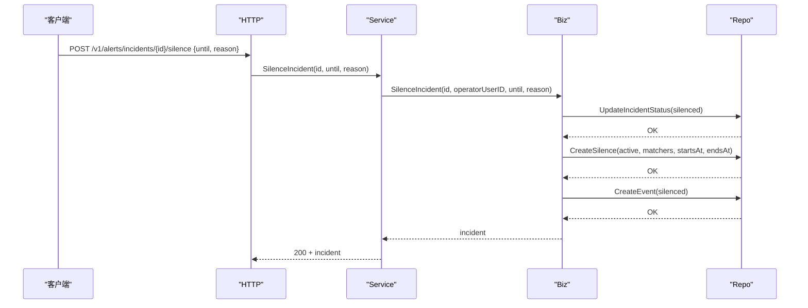
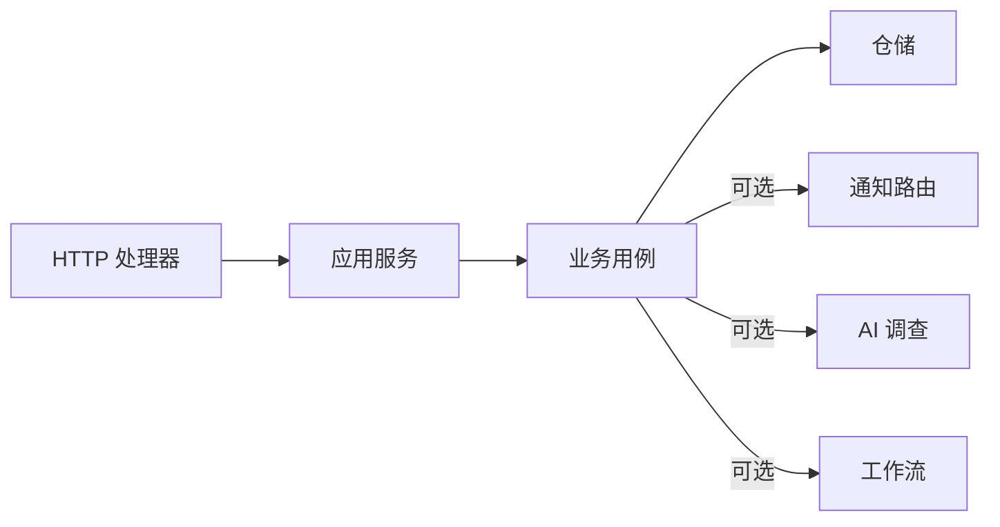

# 告警事件管理

<cite>
**本文引用的文件**
- [alert.proto](file://api/manager/alert/v1/alert.proto)
- [usecase.go](file://internal/manager/biz/alert/usecase.go)
- [repo.go](file://internal/manager/data/alert/store/repo.go)
- [http.go](file://internal/manager/server/alert/http.go)
- [service.go](file://internal/manager/service/alert/service.go)
- [model.go](file://internal/manager/model/alert/model.go)
</cite>

## 目录
1. [简介](#简介)
2. [项目结构](#项目结构)
3. [核心组件](#核心组件)
4. [架构总览](#架构总览)
5. [详细组件分析](#详细组件分析)
6. [依赖关系分析](#依赖关系分析)
7. [性能考虑](#性能考虑)
8. [故障排查指南](#故障排查指南)
9. [结论](#结论)
10. [附录：API 与使用示例](#附录api-与使用示例)

## 简介
本技术文档聚焦于告警事件（Incident）的完整生命周期管理与查询能力，覆盖状态变更（open、acknowledged、silenced、resolved）、事件历史审计、确认/解决/静音操作的参数与返回、以及分页筛选与时间范围等查询方式。同时给出错误处理策略与性能优化建议，并提供可直接参考的 API 调用路径与请求体结构说明。

## 项目结构
告警事件管理采用分层设计：
- HTTP 层：路由注册、鉴权、参数解析、审计埋点
- 服务层：传输对象与领域对象的转换、校验、分页计算
- 业务层：事件生命周期、去重、静默匹配、通知节流、AI 调查触发、工作流触发
- 数据层：GORM 仓储实现，负责持久化、索引与计数
- 模型层：实体定义、常量、枚举值

图表来源
- [http.go:154-181](file://internal/manager/server/alert/http.go#L154-L181)
- [service.go:240-395](file://internal/manager/service/alert/service.go#L240-L395)
- [usecase.go:141-285](file://internal/manager/biz/alert/usecase.go#L141-L285)
- [repo.go:25-75](file://internal/manager/data/alert/store/repo.go#L25-L75)

章节来源
- [http.go:154-181](file://internal/manager/server/alert/http.go#L154-L181)
- [service.go:240-395](file://internal/manager/service/alert/service.go#L240-L395)
- [usecase.go:141-285](file://internal/manager/biz/alert/usecase.go#L141-L285)
- [repo.go:25-75](file://internal/manager/data/alert/store/repo.go#L25-L75)

## 核心组件
- HTTP 处理器：提供 RESTful 接口，包括事件列表、详情、事件历史、确认/解决/静音、规则与通道管理等
- 应用服务：将 HTTP DTO 转换为领域输入，执行分页与基础校验
- 业务用例：实现事件生命周期、去重键、静默匹配、通知节流、AI 调查与工作流触发
- 仓储：基于 GORM 的数据访问，支持按状态、严重级别、规则键、设备 ID 过滤与分页；提供精确总数统计
- 模型：定义 Incident、Event、Silence、Rule、Channel、Delivery 等实体及状态常量

章节来源
- [http.go:254-555](file://internal/manager/server/alert/http.go#L254-L555)
- [service.go:240-395](file://internal/manager/service/alert/service.go#L240-L395)
- [usecase.go:141-285](file://internal/manager/biz/alert/usecase.go#L141-L285)
- [repo.go:25-75](file://internal/manager/data/alert/store/repo.go#L25-L75)
- [model.go:11-49](file://internal/manager/model/alert/model.go#L11-L49)

## 架构总览
告警事件从产生到消亡的关键流程如下：
- 事件创建与去重：根据 dedupe_key 判断是否新建或复用现有 incident，更新 firing 次数与最新值
- 状态流转：open → acknowledged → silenced → resolved；支持 reopen（resolved 再次触发时回到 open）
- 事件历史：每次 firing、ack、resolve、silence、通知投递均写入事件表，形成时间线
- 静默匹配：incident 级别的 silenced_until 与全局 silence 行共同决定通知是否被抑制
- 通知节流：last_notified_at 控制冷却期，避免频繁通知
- 可选扩展：AI 调查自动触发、工作流自动触发

图表来源
- [http.go:458-467](file://internal/manager/server/alert/http.go#L458-L467)
- [service.go:305-343](file://internal/manager/service/alert/service.go#L305-L343)
- [usecase.go:168-174](file://internal/manager/biz/alert/usecase.go#L168-L174)
- [repo.go:147-173](file://internal/manager/data/alert/store/repo.go#L147-L173)
- [usecase.go:476-504](file://internal/manager/biz/alert/usecase.go#L476-L504)

## 详细组件分析

### 事件生命周期与状态机
- 初始状态：open
- 确认：acknowledged（记录 acknowledged_at、acknowledged_by）
- 静音：silenced（设置 silenced_until，并创建对应的 Silence 行）
- 解决：resolved（记录 resolved_at、resolved_by）
- 重新打开：当 resolved 的 incident 再次触发相同 dedupe_key，自动回退为 open，并清空 silenced_until/resolved_at/resolved_by

图表来源
- [model.go:11-23](file://internal/manager/model/alert/model.go#L11-L23)
- [repo.go:147-173](file://internal/manager/data/alert/store/repo.go#L147-L173)
- [repo.go:202-229](file://internal/manager/data/alert/store/repo.go#L202-L229)
- [usecase.go:349-444](file://internal/manager/biz/alert/usecase.go#L349-L444)

章节来源
- [model.go:11-23](file://internal/manager/model/alert/model.go#L11-L23)
- [repo.go:147-173](file://internal/manager/data/alert/store/repo.go#L147-L173)
- [repo.go:202-229](file://internal/manager/data/alert/store/repo.go#L202-L229)
- [usecase.go:349-444](file://internal/manager/biz/alert/usecase.go#L349-L444)

### 事件创建与去重（RecordFiring）
- 去重键：默认由 scope_type、device_id、rule 组成，也可自定义 dedupe_key
- 新建 incident：首次触发写入 incident 行，event_count=1，first_fired_at/last_fired_at 初始化
- 重复触发：仅更新 last_fired_at、event_count、summary/value/threshold，不改变 ack/silence/resolve 状态
- 重新打开：resolved 再次触发时，重置 silenced_until/resolved_at/resolved_by，状态切回 open
- 事件写入：每次 firing/reopen 都写入 event 表，保证时间线完整
- 静默匹配：incident 级别 silenced_until 优先；否则匹配 active 的 silence 行
- 可选行为：新 incident 触发 AI 调查；新或重新打开触发工作流

图表来源
- [usecase.go:349-513](file://internal/manager/biz/alert/usecase.go#L349-L513)
- [repo.go:175-229](file://internal/manager/data/alert/store/repo.go#L175-L229)

章节来源
- [usecase.go:349-513](file://internal/manager/biz/alert/usecase.go#L349-L513)
- [repo.go:175-229](file://internal/manager/data/alert/store/repo.go#L175-L229)

### 事件查询与分页
- 列表接口：GET /v1/alerts/incidents
- 筛选条件：
  - status_filter：精确匹配 open/acknowledged/silenced/resolved
  - severity_filter：精确匹配严重级别
  - query：用于前端搜索（在 service 层透传，具体实现可结合 rule/device 等字段）
  - page/page_size：分页参数
- 总数：CountIncidents 返回与列表过滤一致的总数，避免“徽章数与页面不一致”的问题
- 排序：按 last_fired_at DESC 与 id DESC

图表来源
- [http.go:254-282](file://internal/manager/server/alert/http.go#L254-L282)
- [service.go:240-273](file://internal/manager/service/alert/service.go#L240-L273)
- [repo.go:25-75](file://internal/manager/data/alert/store/repo.go#L25-L75)

章节来源
- [http.go:254-282](file://internal/manager/server/alert/http.go#L254-L282)
- [service.go:240-273](file://internal/manager/service/alert/service.go#L240-L273)
- [repo.go:25-75](file://internal/manager/data/alert/store/repo.go#L25-L75)

### 事件历史与操作审计
- 获取方法：GET /v1/alerts/incidents/{id}/events?limit=200
- 事件类型：firing、repeat_suppressed、acknowledged、silenced、resolved、reopened、notification_sent/failed、ai_initial_diagnosis 等
- 操作者信息：operator_user_id/actor_type/actor_id，区分系统或用户操作
- 审计：HTTP 层对 ack/resolve/silence 等操作通过中间件记录审计事件，包含资源类型、ID、名称、状态与负载

图表来源
- [http.go:470-488](file://internal/manager/server/alert/http.go#L470-L488)
- [service.go:345-369](file://internal/manager/service/alert/service.go#L345-L369)
- [repo.go:376-386](file://internal/manager/data/alert/store/repo.go#L376-L386)

章节来源
- [http.go:470-488](file://internal/manager/server/alert/http.go#L470-L488)
- [service.go:345-369](file://internal/manager/service/alert/service.go#L345-L369)
- [repo.go:376-386](file://internal/manager/data/alert/store/repo.go#L376-L386)

### 确认、解决、静音操作
- 确认（Acknowledge）
  - 接口：POST /v1/alerts/incidents/{id}/ack
  - 请求体：{ "note": "可选备注" }
  - 行为：更新 incident.status=acknowledged，记录 acknowledged_at/acknowledged_by，写入 acknowledged 事件
  - 返回：更新后的 incident
- 解决（Resolve）
  - 接口：POST /v1/alerts/incidents/{id}/resolve
  - 请求体：{ "note": "可选备注" }
  - 行为：更新 incident.status=resolved，记录 resolved_at/resolved_by，写入 resolved 事件
  - 返回：更新后的 incident
- 静音（Silence）
  - 接口：POST /v1/alerts/incidents/{id}/silence
  - 请求体：{ "until": "持续时间/RFC3339/unix秒", "reason": "必填原因" }
  - 行为：更新 incident.status=silenced，设置 silenced_until；创建 Silence 行（active），匹配器包含 device_id/rule 等；写入 silenced 事件
  - 返回：更新后的 incident

图表来源
- [http.go:490-523](file://internal/manager/server/alert/http.go#L490-L523)
- [service.go:371-395](file://internal/manager/service/alert/service.go#L371-L395)
- [usecase.go:176-227](file://internal/manager/biz/alert/usecase.go#L176-L227)
- [repo.go:388-393](file://internal/manager/data/alert/store/repo.go#L388-L393)

章节来源
- [http.go:458-523](file://internal/manager/server/alert/http.go#L458-L523)
- [service.go:305-395](file://internal/manager/service/alert/service.go#L305-L395)
- [usecase.go:168-227](file://internal/manager/biz/alert/usecase.go#L168-L227)
- [repo.go:147-173](file://internal/manager/data/alert/store/repo.go#L147-L173)
- [repo.go:388-393](file://internal/manager/data/alert/store/repo.go#L388-L393)

### 通知投递与节流
- 投递记录：RecordDelivery 插入 pending 投递，FinishDelivery 更新为 success/failed 并写入对应事件
- 节流：MarkIncidentNotified 更新 last_notified_at，firing 路径读取该字段进行冷却抑制
- 抑制：Inhibited 事件记录抑制原因（如规则抑制、通道抑制等）

章节来源
- [usecase.go:515-607](file://internal/manager/biz/alert/usecase.go#L515-L607)
- [repo.go:231-246](file://internal/manager/data/alert/store/repo.go#L231-L246)

### 规则与通道（关联告警）
- 规则：支持 metric/log/trace 多种 kind，metric_threshold 为 UI 友好表单，保存时转为 metric_raw
- 通道：webhook/slack/feishu/dingtalk/wecom/telegram 等，支持测试投递
- 规则与通道绑定：可通过 notify_channel_ids_json 指定特定通道

章节来源
- [model.go:61-184](file://internal/manager/model/alert/model.go#L61-L184)
- [model.go:299-366](file://internal/manager/model/alert/model.go#L299-L366)
- [service.go:558-716](file://internal/manager/service/alert/service.go#L558-L716)

## 依赖关系分析
- HTTP 层依赖服务层接口，不直接访问业务或数据层
- 服务层封装 DTO 与领域对象转换，统一校验与分页
- 业务层依赖仓储接口，屏蔽存储细节；可选依赖通知、AI、工作流
- 仓储层基于 GORM，提供事务与索引优化

图表来源
- [http.go:106-181](file://internal/manager/server/alert/http.go#L106-L181)
- [service.go:210-226](file://internal/manager/service/alert/service.go#L210-L226)
- [usecase.go:80-119](file://internal/manager/biz/alert/usecase.go#L80-L119)

章节来源
- [http.go:106-181](file://internal/manager/server/alert/http.go#L106-L181)
- [service.go:210-226](file://internal/manager/service/alert/service.go#L210-L226)
- [usecase.go:80-119](file://internal/manager/biz/alert/usecase.go#L80-L119)

## 性能考虑
- 分页与总数分离：CountIncidents 与 ListIncidents 使用相同过滤条件，确保总数准确且不因分页降低
- 排序优化：按 last_fired_at DESC 与 id DESC，利用索引提升列表性能
- 去重键：dedupe_key 唯一索引，避免重复 incident 写入
- 事件写入：事件写失败不影响 incident 主流程，降级为警告日志
- 通知节流：last_notified_at 减少重复通知压力
- 静默匹配：incident 级别 silenced_until 优先，减少不必要的通知路由开销
- 预览与查询：PreviewRule 使用 10s 超时，避免长查询阻塞

章节来源
- [repo.go:25-75](file://internal/manager/data/alert/store/repo.go#L25-L75)
- [usecase.go:446-470](file://internal/manager/biz/alert/usecase.go#L446-L470)
- [service.go:642-664](file://internal/manager/service/alert/service.go#L642-L664)

## 故障排查指南
- 未连接仓储：返回 ErrNotWiredYet，检查服务构造与依赖注入
- 参数无效：如 incident id 为空、silence until 为空或过去时间、rule_key 非法等，返回 ErrInvalid
- 冲突：rule_key 已存在返回 ErrConflict；删除内置规则返回 ErrForbidden
- 未找到：incident/channel/rule 不存在返回 ErrNotFound
- 通知失败：FinishDelivery 记录 failed 事件与错误消息，便于追踪
- 静默未生效：检查 incident.silenced_until 与 active silence 行的 starts_at/ends_at 窗口

章节来源
- [usecase.go:141-174](file://internal/manager/biz/alert/usecase.go#L141-L174)
- [usecase.go:176-227](file://internal/manager/biz/alert/usecase.go#L176-L227)
- [repo.go:77-86](file://internal/manager/data/alert/store/repo.go#L77-L86)
- [repo.go:147-173](file://internal/manager/data/alert/store/repo.go#L147-L173)
- [usecase.go:569-607](file://internal/manager/biz/alert/usecase.go#L569-L607)

## 结论
本系统提供了完整的告警事件生命周期管理能力，涵盖状态变更、事件历史、静默与节流、通知投递与审计。通过清晰的分层设计与严格的参数校验，保证了系统的稳定性与可维护性。配合分页与索引优化，可在大规模场景下保持良好性能。

## 附录：API 与使用示例

### 事件列表与分页
- 接口：GET /v1/alerts/incidents
- 查询参数：
  - status_filter：open/acknowledged/silenced/resolved
  - severity_filter：info/warning/critical
  - query：搜索关键字（由服务层透传）
  - page：页码，默认 1
  - page_size：每页数量，默认 20
- 响应：{ items: [], total: number }

章节来源
- [http.go:254-282](file://internal/manager/server/alert/http.go#L254-L282)
- [service.go:240-273](file://internal/manager/service/alert/service.go#L240-L273)

### 事件详情
- 接口：GET /v1/alerts/incidents/{id}
- 响应：incident 对象（包含 rule_key、rule_name、severity、status、summary、target_*、runbook_url、fired_at、updated_at、acknowledged_at、resolved_at 等）

章节来源
- [http.go:284-301](file://internal/manager/server/alert/http.go#L284-L301)
- [service.go:275-288](file://internal/manager/service/alert/service.go#L275-L288)

### 事件历史
- 接口：GET /v1/alerts/incidents/{id}/events?limit=200
- 响应：{ items: [], total: number }，每条事件包含 event_type、status_after、severity、title、message、actor_type、operator_user_id、reason、occurred_at、created_at

章节来源
- [http.go:470-488](file://internal/manager/server/alert/http.go#L470-L488)
- [service.go:345-369](file://internal/manager/service/alert/service.go#L345-L369)

### 确认事件
- 接口：POST /v1/alerts/incidents/{id}/ack
- 请求体：{ "note": "可选备注" }
- 响应：更新后的 incident

章节来源
- [http.go:458-467](file://internal/manager/server/alert/http.go#L458-L467)
- [service.go:305-324](file://internal/manager/service/alert/service.go#L305-L324)

### 解决事件
- 接口：POST /v1/alerts/incidents/{id}/resolve
- 请求体：{ "note": "可选备注" }
- 响应：更新后的 incident

章节来源
- [http.go:464-467](file://internal/manager/server/alert/http.go#L464-L467)
- [service.go:326-343](file://internal/manager/service/alert/service.go#L326-L343)

### 静音事件
- 接口：POST /v1/alerts/incidents/{id}/silence
- 请求体：{ "until": "持续时间/RFC3339/unix秒", "reason": "必填原因" }
- 响应：更新后的 incident

章节来源
- [http.go:490-523](file://internal/manager/server/alert/http.go#L490-L523)
- [service.go:371-395](file://internal/manager/service/alert/service.go#L371-L395)

### gRPC 接口（Proto）
- 服务：AlertService
- 方法：ListIncidents、GetIncident、AcknowledgeIncident、ResolveIncident
- 枚举：AlertSeverity、AlertIncidentStatus
- 消息：AlertIncident、ListIncidentsRequest/Response、GetIncidentRequest/Response、AcknowledgeIncidentRequest/Response、ResolveIncidentRequest/Response

章节来源
- [alert.proto:9-87](file://api/manager/alert/v1/alert.proto#L9-L87)