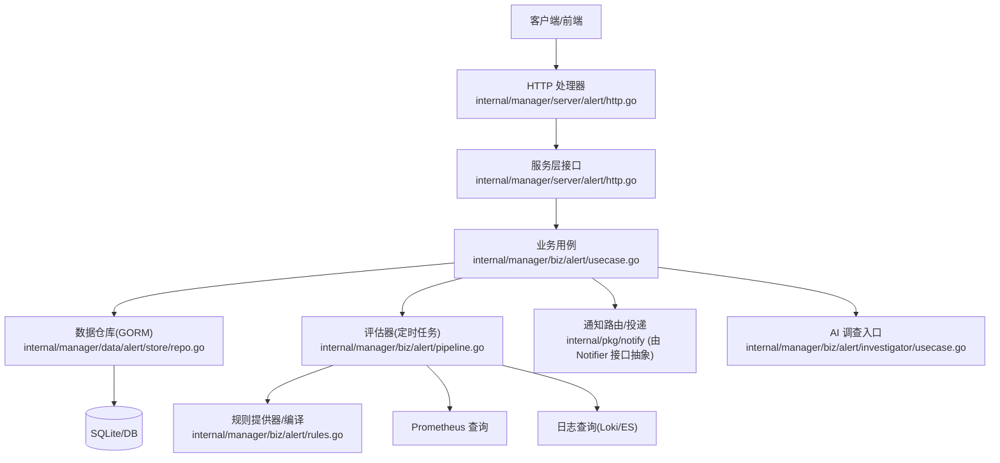
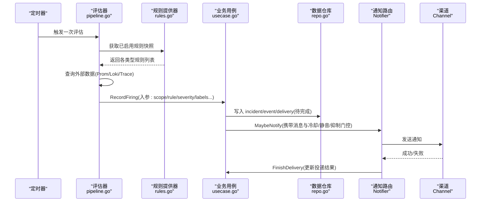
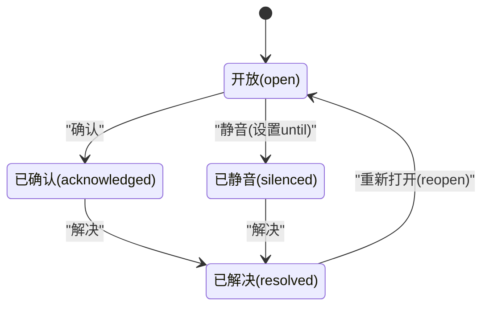
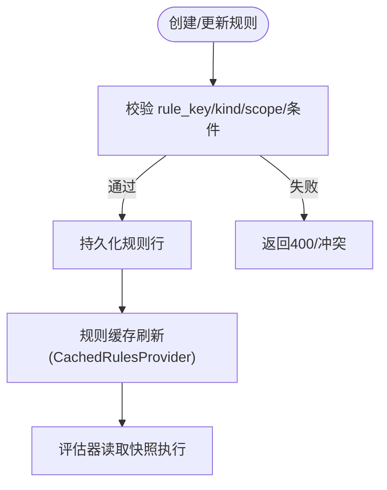
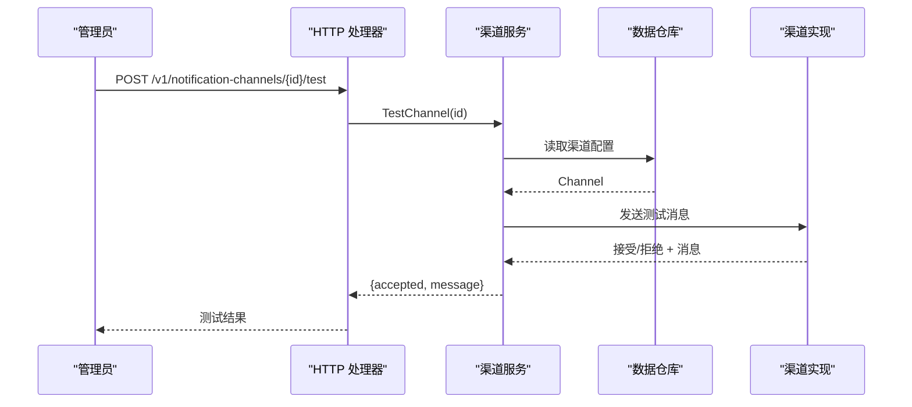
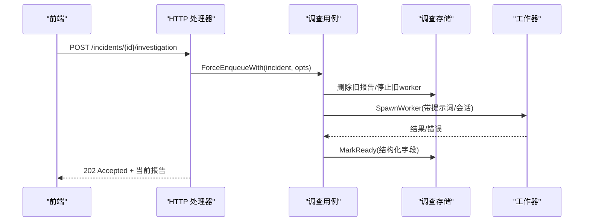
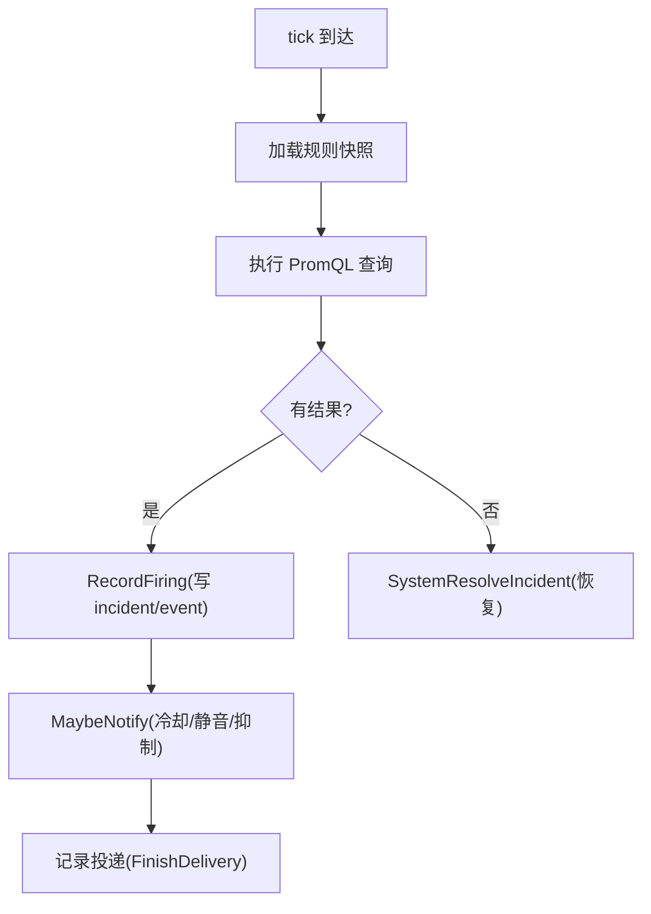
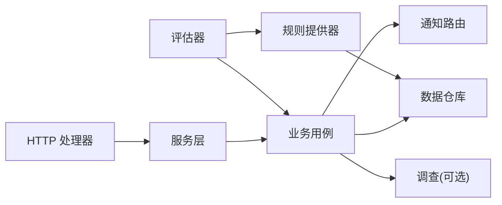

# 告警管理接口

<cite>
**本文引用的文件**
- [alert.proto](file://api/manager/alert/v1/alert.proto)
- [notification.proto](file://api/manager/notification/v1/notification.proto)
- [http.go](file://internal/manager/server/alert/http.go)
- [usecase.go](file://internal/manager/biz/alert/usecase.go)
- [pipeline.go](file://internal/manager/biz/alert/pipeline.go)
- [rules.go](file://internal/manager/biz/alert/rules.go)
- [repo.go](file://internal/manager/data/alert/store/repo.go)
- [model.go](file://internal/manager/model/alert/model.go)
- [investigator_usecase.go](file://internal/manager/biz/alert/investigator/usecase.go)
</cite>

## 目录
1. [简介](#简介)
2. [项目结构](#项目结构)
3. [核心组件](#核心组件)
4. [架构总览](#架构总览)
5. [详细组件分析](#详细组件分析)
6. [依赖关系分析](#依赖关系分析)
7. [性能考虑](#性能考虑)
8. [故障排查指南](#故障排查指南)
9. [结论](#结论)
10. [附录：API 与使用示例](#附录api-与使用示例)

## 简介
本技术文档围绕告警管理子系统，系统阐述告警事件、规则管理与通知渠道的 API 设计、数据模型、处理流程与最佳实践。重点覆盖：
- 告警事件的增删改查与状态变更（确认、解决、静音）
- 事件历史查询与调查功能（含 AI 自动根因分析）
- 告警规则的定义与管理（指标阈值、异常检测、日志匹配、链路追踪等）
- 通知渠道的配置与测试方法
- 错误处理策略与性能优化建议
- 具体使用示例（创建规则、处理事件、配置渠道）

## 项目结构
告警管理采用分层架构：HTTP 层暴露 RESTful 接口；服务层负责鉴权、参数校验与审计；业务用例实现告警生命周期、规则编译与执行、通知路由；数据层通过 GORM 持久化到数据库；评估器按周期轮询外部数据源（Prometheus/Loki/Trace）触发告警。

**图表来源**
- [http.go:154-180](file://internal/manager/server/alert/http.go#L154-L180)
- [usecase.go:141-174](file://internal/manager/biz/alert/usecase.go#L141-L174)
- [pipeline.go:172-224](file://internal/manager/biz/alert/pipeline.go#L172-L224)
- [rules.go:218-236](file://internal/manager/biz/alert/rules.go#L218-L236)
- [repo.go:25-75](file://internal/manager/data/alert/store/repo.go#L25-L75)

**章节来源**
- [http.go:154-180](file://internal/manager/server/alert/http.go#L154-L180)
- [model.go:216-386](file://internal/manager/model/alert/model.go#L216-L386)

## 核心组件
- 告警事件（Incident/Event/Silence/Delivery）：承载告警生命周期、事件时间线、静音窗口与投递记录。
- 规则（Rule）：定义触发条件与发送策略，支持多种类型（指标、日志、链路）。
- 通知渠道（Channel）：Webhook、Slack、飞书、钉钉、企业微信、Telegram 等，支持最小严重级别与范围过滤。
- 评估器（PipelineEvaluator）：周期性执行规则，调用 Usecase 记录触发并驱动通知。
- 业务用例（Usecase）：封装事件状态机、静音、重复抑制、通知冷却、投递记录、规则 CRUD。
- 调查（Investigator）：可选的 AI 根因分析，支持手动重跑与自动回灌。

**章节来源**
- [model.go:216-386](file://internal/manager/model/alert/model.go#L216-L386)
- [usecase.go:141-174](file://internal/manager/biz/alert/usecase.go#L141-L174)
- [pipeline.go:96-170](file://internal/manager/biz/alert/pipeline.go#L96-L170)
- [rules.go:218-236](file://internal/manager/biz/alert/rules.go#L218-L236)

## 架构总览
告警从“规则定义 → 评估触发 → 事件持久化 → 通知路由 → 投递记录”的全链路如下：

**图表来源**
- [pipeline.go:172-224](file://internal/manager/biz/alert/pipeline.go#L172-L224)
- [rules.go:333-497](file://internal/manager/biz/alert/rules.go#L333-L497)
- [usecase.go:349-513](file://internal/manager/biz/alert/usecase.go#L349-L513)
- [repo.go:347-386](file://internal/manager/data/alert/store/repo.go#L347-L386)

## 详细组件分析

### 告警事件与状态机
- 事件类型：firing、repeat_suppressed、acknowledged、silenced、resolved、reopened、note、notification_sent/failed、inhibited、ai_initial_diagnosis。
- 状态流转：open → acknowledged/silenced → resolved；silenced 可带 until 时间；resolved 后可 reopen。
- 关键操作：
  - 确认：AckIncident
  - 解决：ResolveIncident
  - 静音：SilenceIncident（需 reason 与 future until）
  - 查询：ListIncidents / GetIncident / ListEventsByIncident

**图表来源**
- [model.go:11-23](file://internal/manager/model/alert/model.go#L11-L23)
- [usecase.go:168-174](file://internal/manager/biz/alert/usecase.go#L168-L174)
- [usecase.go:176-227](file://internal/manager/biz/alert/usecase.go#L176-L227)

**章节来源**
- [model.go:11-23](file://internal/manager/model/alert/model.go#L11-L23)
- [usecase.go:141-174](file://internal/manager/biz/alert/usecase.go#L141-L174)
- [usecase.go:176-227](file://internal/manager/biz/alert/usecase.go#L176-L227)
- [repo.go:147-173](file://internal/manager/data/alert/store/repo.go#L147-L173)

### 规则定义与管理
- 规则种类（kind）：
  - 指标类：metric_raw（任意 PromQL）、metric_anomaly（基线偏离）、metric_forecast（线性预测）、metric_burn_rate（多窗口燃烧率）
  - 日志类：log_search（后端中立结构化查询）、log_match/log_volume（兼容 Loki/LogQL）
  - 链路类：trace_latency、trace_error_rate
- 规则字段要点：rule_key（唯一键）、scope_type（host/global/monitoring_pipeline）、join_mode（all/any）、severity、enabled、conditions_json、labels/annotations/runbook_url、notify_channel_ids_json、发送策略（notify_window_seconds + notify_min_fires）
- 规则生命周期：Create/Update/SetEnabled/Delete；Preview 用于预览命中情况；CachedRulesProvider 定期刷新规则快照供评估器使用。

**图表来源**
- [usecase.go:661-738](file://internal/manager/biz/alert/usecase.go#L661-L738)
- [rules.go:333-497](file://internal/manager/biz/alert/rules.go#L333-L497)

**章节来源**
- [model.go:91-114](file://internal/manager/model/alert/model.go#L91-L114)
- [usecase.go:642-738](file://internal/manager/biz/alert/usecase.go#L642-L738)
- [rules.go:218-236](file://internal/manager/biz/alert/rules.go#L218-L236)
- [rules.go:333-497](file://internal/manager/biz/alert/rules.go#L333-L497)

### 通知渠道配置与测试
- 渠道类型：webhook、slack、feishu、dingtalk、wecom、telegram
- 能力：CRUD、启用开关、最小严重级别过滤、范围过滤（scope_type）
- 测试：TestChannel 对目标渠道发起一次探测请求，返回 accepted/message
- 路由：每条规则可通过 notify_channel_ids_json 绑定特定渠道；未绑定时按渠道全局过滤逻辑选择

**图表来源**
- [http.go:683-699](file://internal/manager/server/alert/http.go#L683-L699)
- [repo.go:657-767](file://internal/manager/data/alert/store/repo.go#L657-L767)

**章节来源**
- [notification.proto:10-17](file://api/manager/notification/v1/notification.proto#L10-L17)
- [http.go:557-699](file://internal/manager/server/alert/http.go#L557-L699)
- [repo.go:657-767](file://internal/manager/data/alert/store/repo.go#L657-L767)

### 事件历史与调查
- 事件历史：GET /v1/alerts/incidents/{id}/events 返回最近的事件条目（firing、ack、silence、resolve、通知结果等）
- 调查：
  - GET /v1/alerts/incidents/{id}/investigation 获取报告（status: not_started/pending/running/ready/failed/skipped）
  - POST /v1/alerts/incidents/{id}/investigation 强制触发调查（删除旧报告、停止运行中 worker、新建）
  - 自动触发：新 incident 且 investigator 已启用时异步派发；支持并发限制、超时、语言偏好

**图表来源**
- [http.go:311-408](file://internal/manager/server/alert/http.go#L311-L408)
- [investigator_usecase.go:456-523](file://internal/manager/biz/alert/investigator/usecase.go#L456-L523)
- [investigator_usecase.go:576-693](file://internal/manager/biz/alert/investigator/usecase.go#L576-L693)

**章节来源**
- [http.go:311-408](file://internal/manager/server/alert/http.go#L311-L408)
- [investigator_usecase.go:321-439](file://internal/manager/biz/alert/investigator/usecase.go#L321-L439)
- [investigator_usecase.go:576-693](file://internal/manager/biz/alert/investigator/usecase.go#L576-L693)

### 评估器与触发路径
- 评估器每 tick 执行 metric_raw/anomaly/forecast/burn_rate、log_match/log_volume、log_search、trace_* 等子评估
- metric_raw：表达式即谓词，Prom 返回向量即命中的系列；缺失系列视为恢复，自动 resolve
- 去重键：pipeline:{rule}:{labelset}，避免同一主题重复告警
- 设备离线：通过 device_last_seen_seconds_ago gauge + metric_raw 规则实现

**图表来源**
- [pipeline.go:195-224](file://internal/manager/biz/alert/pipeline.go#L195-L224)
- [pipeline.go:289-408](file://internal/manager/biz/alert/pipeline.go#L289-L408)
- [usecase.go:349-513](file://internal/manager/biz/alert/usecase.go#L349-L513)

**章节来源**
- [pipeline.go:96-170](file://internal/manager/biz/alert/pipeline.go#L96-L170)
- [pipeline.go:195-224](file://internal/manager/biz/alert/pipeline.go#L195-L224)
- [pipeline.go:289-408](file://internal/manager/biz/alert/pipeline.go#L289-L408)

## 依赖关系分析
- HTTP 处理器依赖服务层接口（IncidentService/ChannelService/RuleService），服务层再委托业务用例与数据仓库
- 业务用例依赖 Notifier（通知路由）、Investigator（可选）、WorkflowDispatcher（可选）、RuleCacheRefresher（可选）
- 数据仓库基于 GORM，提供 Incident/Event/Silence/Rule/Channel/Delivery 的 CRUD 与统计
- 评估器依赖 Prometheus/Loki/Trace 查询客户端，规则提供器提供编译后的规则集合

**图表来源**
- [http.go:25-56](file://internal/manager/server/alert/http.go#L25-L56)
- [usecase.go:21-91](file://internal/manager/biz/alert/usecase.go#L21-L91)
- [rules.go:218-236](file://internal/manager/biz/alert/rules.go#L218-L236)
- [repo.go:16-23](file://internal/manager/data/alert/store/repo.go#L16-L23)

**章节来源**
- [http.go:25-56](file://internal/manager/server/alert/http.go#L25-L56)
- [usecase.go:21-91](file://internal/manager/biz/alert/usecase.go#L21-L91)
- [rules.go:218-236](file://internal/manager/biz/alert/rules.go#L218-L236)
- [repo.go:16-23](file://internal/manager/data/alert/store/repo.go#L16-L23)

## 性能考虑
- 规则缓存：CachedRulesProvider 以原子指针交换快照，避免读锁竞争；默认 30s 刷新
- 评估间隔与冷却：PipelineEvaluator 默认 interval=5min，cooldown=10min；可按部署调整
- 去重与抑制：dedupe_key 避免风暴；silence 与 inhibit 门控减少无效通知
- 投递重试：delivery 表维护失败重试预算，后台 worker 拉取重试
- 设备离线指标：device_last_seen_seconds_ago gauge 每 tick 刷新，避免陈旧 series 持续告警
- 调查并发：MaxConcurrent 限制同时运行的调查 worker，超限直接跳过并记录 skipped

**章节来源**
- [rules.go:333-497](file://internal/manager/biz/alert/rules.go#L333-L497)
- [pipeline.go:139-170](file://internal/manager/biz/alert/pipeline.go#L139-L170)
- [repo.go:298-316](file://internal/manager/data/alert/store/repo.go#L298-L316)
- [investigator_usecase.go:115-169](file://internal/manager/biz/alert/investigator/usecase.go#L115-L169)

## 故障排查指南
- 401/403：未认证或无权限；检查调用方身份与管理员权限
- 400：参数校验失败（如 rule_key 格式、kind 不支持、条件缺失、静音 until 非未来时间）
- 404：资源不存在（incident/channel/rule 未找到）
- 409：冲突（rule_key 重复）
- 503：功能未启用（如调查未接入 LLM）
- 通知失败：查看 delivery 表的 error_message 与 attempt_count；必要时重试或修复渠道配置
- 规则不生效：检查 enabled、scope_type、join_mode、conditions_json 是否合法；查看规则缓存刷新日志

**章节来源**
- [http.go:249-252](file://internal/manager/server/alert/http.go#L249-L252)
- [usecase.go:661-738](file://internal/manager/biz/alert/usecase.go#L661-L738)
- [usecase.go:176-227](file://internal/manager/biz/alert/usecase.go#L176-L227)
- [repo.go:657-767](file://internal/manager/data/alert/store/repo.go#L657-L767)

## 结论
本系统通过清晰的层次划分与可扩展的规则体系，实现了从数据采集到告警触达的完整闭环。借助规则缓存、冷却/静音/抑制、投递重试与调查能力，既保证了高吞吐下的稳定性，又提供了强大的运维诊断体验。建议在大规模场景下合理设置评估间隔、冷却时间与调查并发上限，并结合发送策略（窗口+最少触发次数）控制通知风暴。

## 附录：API 与使用示例

### 告警事件 API（REST）
- 列表：GET /v1/alerts/incidents?status=&severity=&query=&page=&page_size=
- 详情：GET /v1/alerts/incidents/{id}
- 事件历史：GET /v1/alerts/incidents/{id}/events?limit=
- 确认：POST /v1/alerts/incidents/{id}/ack { note }
- 解决：POST /v1/alerts/incidents/{id}/resolve { note }
- 静音：POST /v1/alerts/incidents/{id}/silence { until, reason }
- 运行时信息：GET /v1/alerts/runtime-info

**章节来源**
- [http.go:154-180](file://internal/manager/server/alert/http.go#L154-L180)
- [http.go:254-555](file://internal/manager/server/alert/http.go#L254-L555)

### 通知渠道 API（REST）
- 列表：GET /v1/notification-channels?page=&page_size=
- 详情：GET /v1/notification-channels/{id}
- 创建：POST /v1/notification-channels { name, type, endpoint, secret?, enabled }
- 更新：PUT /v1/notification-channels/{id} { name, type, endpoint, secret?, enabled }
- 删除：DELETE /v1/notification-channels/{id}
- 测试：POST /v1/notification-channels/{id}/test

**章节来源**
- [http.go:557-699](file://internal/manager/server/alert/http.go#L557-L699)

### 规则管理 API（REST）
- 列表：GET /v1/alert-rules?scope=
- 详情：GET /v1/alert-rules/{id}
- 创建：POST /v1/alert-rules { rule_key, kind, name, scope_type, join_mode, severity, enabled, conditions[], spec, labels, runbook_url, notify_channel_ids, notify_window_seconds, notify_min_fires }
- 预览：POST /v1/alert-rules/preview { ...ruleReq..., lookback_seconds }
- 更新：PUT /v1/alert-rules/{id} { ...ruleReq... }
- 启用/禁用：POST /v1/alert-rules/{id}/enabled { enabled }
- 删除：DELETE /v1/alert-rules/{id}

**章节来源**
- [http.go:701-800](file://internal/manager/server/alert/http.go#L701-L800)

### 调查 API（REST）
- 获取报告：GET /v1/alerts/incidents/{id}/investigation
- 强制触发：POST /v1/alerts/incidents/{id}/investigation

**章节来源**
- [http.go:311-408](file://internal/manager/server/alert/http.go#L311-L408)

### gRPC 协议（AlertService/NotificationService）
- AlertService：ListIncidents、GetIncident、AcknowledgeIncident、ResolveIncident
- NotificationService：ListChannels、GetChannel、CreateChannel、UpdateChannel、DeleteChannel、TestChannel

**章节来源**
- [alert.proto:9-14](file://api/manager/alert/v1/alert.proto#L9-L14)
- [notification.proto:10-17](file://api/manager/notification/v1/notification.proto#L10-L17)

### 使用示例（步骤说明）
- 创建指标阈值规则（metric_threshold → 保存时转为 metric_raw）
  - 在 UI 或 API 提交 kind=metric_threshold 与条件数组；服务端将其编译为 metric_raw 的 PromQL 表达式并持久化
  - 参考：[usecase.go:774-781](file://internal/manager/biz/alert/usecase.go#L774-L781)
- 处理告警事件
  - 确认：POST /v1/alerts/incidents/{id}/ack { note }
  - 静音：POST /v1/alerts/incidents/{id}/silence { until, reason }
  - 解决：POST /v1/alerts/incidents/{id}/resolve { note }
  - 参考：[http.go:458-555](file://internal/manager/server/alert/http.go#L458-L555)
- 配置通知渠道
  - 创建 webhook/slack/飞书/钉钉等渠道，填写 endpoint 与必要密钥
  - 使用测试接口验证连通性
  - 参考：[http.go:592-699](file://internal/manager/server/alert/http.go#L592-L699)