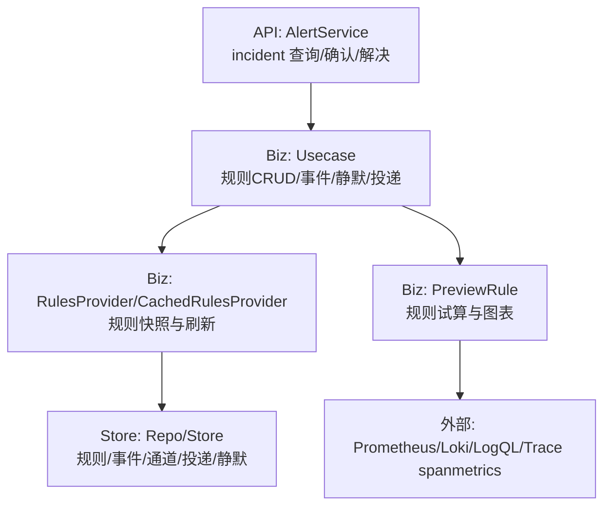
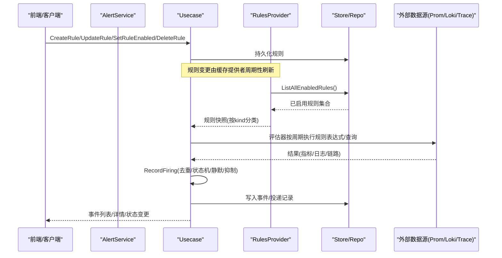
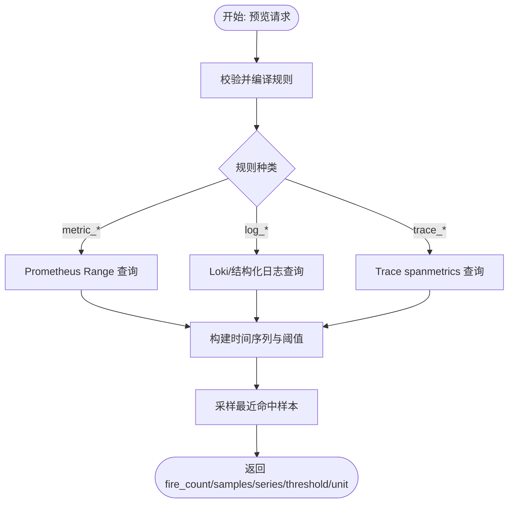
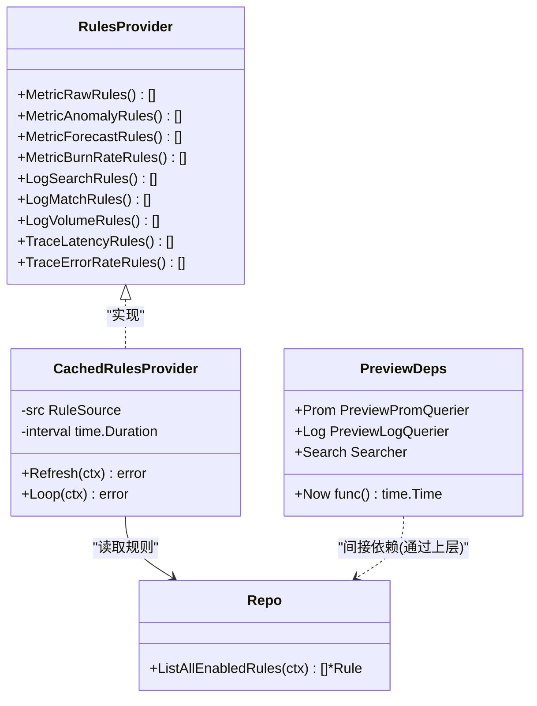

# 告警规则管理

<cite>
**本文引用的文件**
- [alert.proto](file://api/manager/alert/v1/alert.proto)
- [rules.go](file://internal/manager/biz/alert/rules.go)
- [usecase.go](file://internal/manager/biz/alert/usecase.go)
- [preview.go](file://internal/manager/biz/alert/preview.go)
- [model.go](file://internal/manager/model/alert/model.go)
- [types.go](file://internal/manager/data/alert/store/types.go)
- [seed_rules.go](file://internal/manager/data/alert/store/seed_rules.go)
</cite>

## 目录
1. [简介](#简介)
2. [项目结构](#项目结构)
3. [核心组件](#核心组件)
4. [架构总览](#架构总览)
5. [详细组件分析](#详细组件分析)
6. [依赖关系分析](#依赖关系分析)
7. [性能考量](#性能考量)
8. [故障排查指南](#故障排查指南)
9. [结论](#结论)
10. [附录](#附录)

## 简介
本技术文档面向“告警规则管理”子系统，系统性说明规则定义、条件配置、作用域与连接模式、启用/禁用/删除与批量操作、预览试算（含图表展示）、以及模板与内置规则的使用方式。系统支持多种规则类型：指标阈值（PromQL）、异常检测、日志匹配/统计、链路追踪延迟与错误率、SLO燃烧率等，并通过统一的编译与执行管线进行调度与评估。

## 项目结构
告警规则管理涉及三层：
- API 层：对外暴露事件（Incident）查询与状态流转接口（ack/resolve）。
- 业务层（biz）：规则编译、预览、执行、通知投递、静默抑制、工作流触发等。
- 数据层（store/model）：规则、事件、通道、投递、静默等实体与存储接口。

图示来源
- [alert.proto:9-14](file://api/manager/alert/v1/alert.proto#L9-L14)
- [usecase.go:80-119](file://internal/manager/biz/alert/usecase.go#L80-L119)
- [rules.go:218-236](file://internal/manager/biz/alert/rules.go#L218-L236)
- [types.go:50-74](file://internal/manager/data/alert/store/types.go#L50-L74)
- [preview.go:96-155](file://internal/manager/biz/alert/preview.go#L96-L155)

章节来源
- [alert.proto:9-14](file://api/manager/alert/v1/alert.proto#L9-L14)
- [usecase.go:80-119](file://internal/manager/biz/alert/usecase.go#L80-L119)
- [rules.go:218-236](file://internal/manager/biz/alert/rules.go#L218-L236)
- [types.go:50-74](file://internal/manager/data/alert/store/types.go#L50-L74)
- [preview.go:96-155](file://internal/manager/biz/alert/preview.go#L96-L155)

## 核心组件
- 规则模型与种类
  - 支持种类：metric_raw、metric_anomaly、metric_forecast、metric_burn_rate、log_search、log_match、log_volume、trace_latency、trace_error_rate。
  - 作用域：host、global、monitoring_pipeline。
  - 连接模式：all、any（用于多条件组合判定）。
- 规则提供者与缓存
  - StaticRulesProvider：静态注入，便于测试与无库部署。
  - CachedRulesProvider：定时从数据源加载并原子替换快照，供评估器使用。
- 用例（Usecase）
  - 规则CRUD：CreateRule/UpdateRule/SetRuleEnabled/DeleteRule/ListRules/GetRule。
  - 事件与实例：RecordFiring、Ack/Resolve/Silence、Delivery 记录与完成。
  - 发送策略：按规则维度设置窗口与最小触发次数以抑制通知风暴。
- 预览（Preview）
  - 对输入规则进行校验与编译，调用对应后端（Prom/Loki/LogQL/Trace）在回溯窗口内试算，返回命中样本与时间序列用于图表渲染。
- 内置规则与模板
  - 启动时通过种子脚本写入默认规则（如 CPU/内存/磁盘/设备离线/采集失败等），可被用户覆盖或禁用。

章节来源
- [model.go:51-184](file://internal/manager/model/alert/model.go#L51-L184)
- [rules.go:29-211](file://internal/manager/biz/alert/rules.go#L29-L211)
- [rules.go:218-236](file://internal/manager/biz/alert/rules.go#L218-L236)
- [usecase.go:642-738](file://internal/manager/biz/alert/usecase.go#L642-L738)
- [preview.go:18-63](file://internal/manager/biz/alert/preview.go#L18-L63)
- [seed_rules.go:25-54](file://internal/manager/data/alert/store/seed_rules.go#L25-L54)

## 架构总览
下图展示了规则从创建到生效、评估、事件生成与通知投递的整体流程。

图示来源
- [rules.go:333-497](file://internal/manager/biz/alert/rules.go#L333-L497)
- [usecase.go:349-513](file://internal/manager/biz/alert/usecase.go#L349-L513)
- [types.go:50-74](file://internal/manager/data/alert/store/types.go#L50-L74)
- [preview.go:96-155](file://internal/manager/biz/alert/preview.go#L96-L155)

## 详细组件分析

### 规则类型与条件配置
- 指标类
  - metric_raw：直接运行 PromQL 表达式作为谓词，任何返回的向量项即视为触发。
  - metric_anomaly：基于滚动基线（均值±标准差或中位数+MAD）计算偏离度，超过阈值触发；支持 for_seconds  dwell。
  - metric_forecast：线性外推 predict_linear 在未来窗口内是否越界。
  - metric_burn_rate：SRE 多窗口多燃烧率 SLO 告警，所有窗口同时满足才触发。
- 日志类
  - log_search：后端无关的结构化日志搜索（keywords/scope/filters/window/group_by/threshold）。
  - log_match/log_volume：兼容 Loki/LogQL 的旧形态，内部会迁移为 log_search 的规范形式。
- 链路追踪类
  - trace_latency：基于 spanmetrics 直方图分位值判断延迟越界。
  - trace_error_rate：基于调用总量与错误码比例计算错误率。

关键参数说明
- PromQL 表达式：metric_raw 直接使用；其他类型会转换为对应的 PromQL/Loki 查询。
- 阈值与比较符：">"," >=","<"," <=","==","!=" 等，结合数值阈值或百分比。
- 时间窗口：BaselineWindow/FitWindow/Window 等，控制历史范围与步长。
- 作用域：host/global/monitoring_pipeline，决定规则影响范围。
- 连接模式：all/any，控制多条件组合逻辑。

章节来源
- [rules.go:29-211](file://internal/manager/biz/alert/rules.go#L29-L211)
- [rules.go:524-796](file://internal/manager/biz/alert/rules.go#L524-L796)
- [model.go:51-184](file://internal/manager/model/alert/model.go#L51-L184)

### 作用域与连接模式
- 作用域
  - host：针对单台主机/设备的指标或资源。
  - global：全局范围，常用于系统健康或采集管道健康。
  - monitoring_pipeline：监控流水线自身健康（如 scrape_down、prom_write_total）。
- 连接模式
  - all：所有条件必须同时满足。
  - any：任一条件满足即可。

章节来源
- [model.go:51-59](file://internal/manager/model/alert/model.go#L51-L59)
- [usecase.go:740-800](file://internal/manager/biz/alert/usecase.go#L740-L800)

### 规则的启用/禁用、删除与批量操作
- 启用/禁用：SetRuleEnabled 切换 enabled 标志，影响评估器是否加载该规则。
- 删除：DeleteRule 仅允许删除自定义规则；内置规则禁止删除，需通过禁用或覆盖。
- 批量：可通过 Store 层的 ListRuleRows/UpdateRuleEnabled 配合过滤条件实现批量启停（例如按 scope_type/source_type 筛选后批量更新）。

章节来源
- [usecase.go:707-738](file://internal/manager/biz/alert/usecase.go#L707-L738)
- [types.go:50-74](file://internal/manager/data/alert/store/types.go#L50-L74)

### 规则预览（试算）与图表展示
- 入口：PreviewRule 接收 RuleInput + 回溯秒数，不持久化，仅做只读验证与试算。
- 支持类型：metric_anomaly/forecast/burn_rate/raw、log_search/match/volume、trace_latency/error_rate。
- 输出：
  - fire_count/first_fire_at/last_fire_at：命中统计与首末时间。
  - samples：最近若干条命中样本（包含标签、值、摘要）。
  - series：时间序列点集，用于编辑器绘制折线图与阈值参考线。
  - threshold/unit：阈值与单位提示，辅助可视化。
- 数据源：Prometheus（PromQL range）、Loki（LogQL count_over_time/histogram）、结构化日志 Searcher、Trace spanmetrics。

图示来源
- [preview.go:96-155](file://internal/manager/biz/alert/preview.go#L96-L155)
- [preview.go:157-246](file://internal/manager/biz/alert/preview.go#L157-L246)
- [preview.go:278-367](file://internal/manager/biz/alert/preview.go#L278-L367)
- [preview.go:463-588](file://internal/manager/biz/alert/preview.go#L463-L588)
- [preview.go:590-666](file://internal/manager/biz/alert/preview.go#L590-L666)
- [preview.go:704-791](file://internal/manager/biz/alert/preview.go#L704-L791)

章节来源
- [preview.go:18-63](file://internal/manager/biz/alert/preview.go#L18-L63)
- [preview.go:96-155](file://internal/manager/biz/alert/preview.go#L96-L155)
- [preview.go:278-367](file://internal/manager/biz/alert/preview.go#L278-L367)
- [preview.go:463-588](file://internal/manager/biz/alert/preview.go#L463-L588)
- [preview.go:590-666](file://internal/manager/biz/alert/preview.go#L590-L666)
- [preview.go:704-791](file://internal/manager/biz/alert/preview.go#L704-L791)

### 规则模板与内置规则
- 内置规则：启动时通过种子函数写入默认规则（CPU/内存/磁盘/Load/设备离线/采集失败/Prom写入失败/磁盘使用率>85%/Swap高/文件描述符耗尽等），均使用 metric_raw 表达。
- 模板：metric_threshold 是友好的前端输入表单，保存时会被编译为 metric_raw 的 PromQL 表达式，便于用户快速创建常见阈值规则。
- 使用建议：优先使用内置规则作为起点，按需调整阈值与作用域；复杂场景可直接编写 metric_raw 表达式。

章节来源
- [seed_rules.go:25-54](file://internal/manager/data/alert/store/seed_rules.go#L25-L54)
- [seed_rules.go:64-128](file://internal/manager/data/alert/store/seed_rules.go#L64-L128)
- [seed_rules.go:130-188](file://internal/manager/data/alert/store/seed_rules.go#L130-L188)
- [seed_rules.go:190-220](file://internal/manager/data/alert/store/seed_rules.go#L190-L220)
- [seed_rules.go:222-331](file://internal/manager/data/alert/store/seed_rules.go#L222-L331)
- [usecase.go:740-800](file://internal/manager/biz/alert/usecase.go#L740-L800)

## 依赖关系分析
- 规则提供者依赖数据源（Repo/Store）获取已启用规则，并以不可变快照形式提供给评估器。
- 预览模块依赖 Prometheus/Loki/结构化日志 Searcher/Trace spanmetrics 进行只读查询。
- 用例层依赖通知路由与工作流分发器，但保持可选注入，保证解耦。

图示来源
- [rules.go:218-236](file://internal/manager/biz/alert/rules.go#L218-L236)
- [rules.go:333-497](file://internal/manager/biz/alert/rules.go#L333-L497)
- [preview.go:86-94](file://internal/manager/biz/alert/preview.go#L86-L94)

章节来源
- [rules.go:218-236](file://internal/manager/biz/alert/rules.go#L218-L236)
- [rules.go:333-497](file://internal/manager/biz/alert/rules.go#L333-L497)
- [preview.go:86-94](file://internal/manager/biz/alert/preview.go#L86-L94)

## 性能考量
- 规则快照原子替换：CachedRulesProvider 使用原子指针交换快照，避免并发读取时的不一致。
- 预览降采样：当时间序列点数过多时，采用等间隔下采样（保留末尾点）以控制前端渲染开销。
- 日志/指标查询步长：预览中对不同 kind 选择合适的 step（如 5m/60s），平衡精度与负载。
- 通知抑制：通过规则级 NotifyWindowSeconds/NotifyMinFires 与冷却机制减少重复通知。

章节来源
- [rules.go:333-497](file://internal/manager/biz/alert/rules.go#L333-L497)
- [preview.go:65-73](file://internal/manager/biz/alert/preview.go#L65-L73)
- [preview.go:230-237](file://internal/manager/biz/alert/preview.go#L230-L237)
- [usecase.go:632-640](file://internal/manager/biz/alert/usecase.go#L632-L640)

## 故障排查指南
- 规则编译失败：查看日志中的 compile failed 条目，定位 rule_id/rule_key 与错误原因（如 expr 为空、method 不支持、window/predict_seconds 非法等）。
- 预览跳过：若返回 skipped_reason，检查对应后端是否配置（Prom/Loki/Searcher）或字段是否缺失。
- 内置规则无法删除：内置规则禁止删除，应改为禁用或通过 UI 编辑覆盖。
- 通知未送达：检查 Delivery 记录与 FinishDelivery 的错误信息，确认通道配置与匹配策略。

章节来源
- [rules.go:387-497](file://internal/manager/biz/alert/rules.go#L387-L497)
- [preview.go:157-164](file://internal/manager/biz/alert/preview.go#L157-L164)
- [usecase.go:721-738](file://internal/manager/biz/alert/usecase.go#L721-L738)
- [usecase.go:547-607](file://internal/manager/biz/alert/usecase.go#L547-L607)

## 结论
本系统提供统一、可扩展的告警规则管理能力，覆盖指标、日志、链路等多源信号，支持灵活的阈值/窗口/作用域/连接模式配置，并提供强大的预览能力与丰富的内置规则模板。通过规则快照与异步通知、静默抑制、工作流联动，兼顾了实时性与稳定性。建议在生产环境中以内置规则为基线，逐步扩展自定义规则，并利用预览功能反复验证表达式与阈值。

## 附录
- API 概览（事件相关）
  - 列出事件、获取事件、确认事件、解决事件。
- 数据模型要点
  - Incident/Event/Silence/Rule/Channel/Delivery 等实体的关键字段与状态。
- 常用内置规则示例
  - CPU/内存/磁盘/Load/设备离线/采集失败/Prom写入失败/磁盘使用率>85%/Swap高/文件描述符耗尽。

章节来源
- [alert.proto:9-87](file://api/manager/alert/v1/alert.proto#L9-L87)
- [model.go:216-386](file://internal/manager/model/alert/model.go#L216-L386)
- [seed_rules.go:64-331](file://internal/manager/data/alert/store/seed_rules.go#L64-L331)