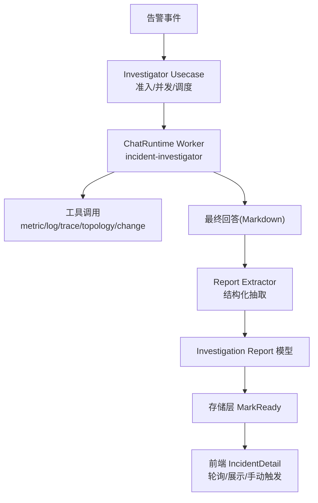
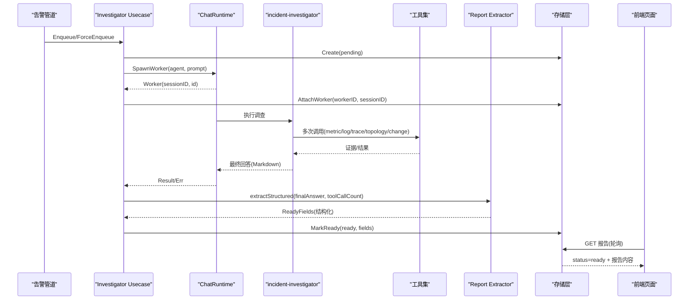
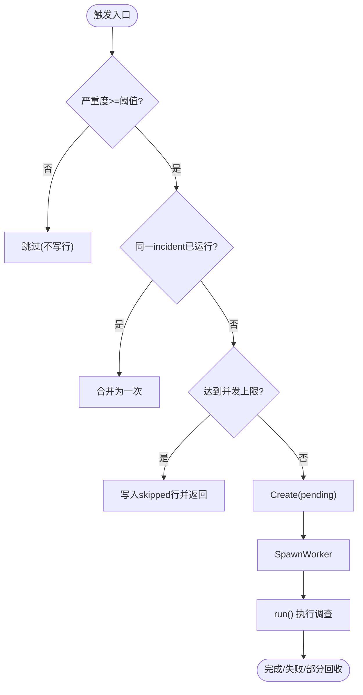
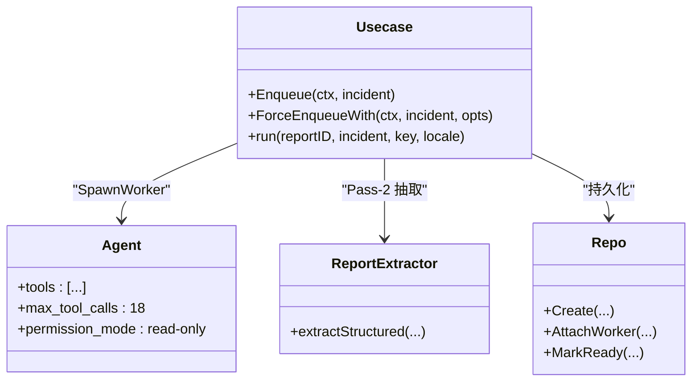
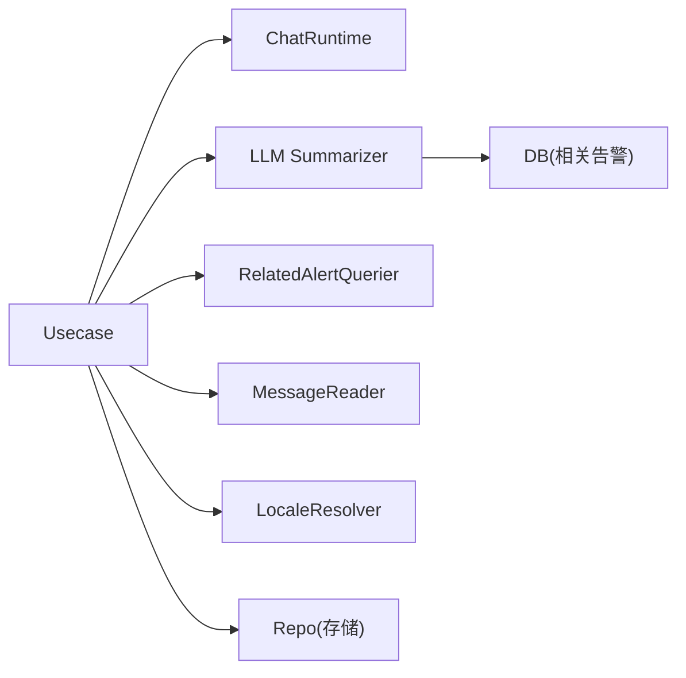

# 调查分析管理

<cite>
**本文引用的文件**
- [internal/manager/biz/alert/investigator/usecase.go](file://internal/manager/biz/alert/investigator/usecase.go)
- [internal/manager/model/alert/investigation.go](file://internal/manager/model/alert/investigation.go)
- [internal/manager/biz/alert/investigator/report_extractor.go](file://internal/manager/biz/alert/investigator/report_extractor.go)
- [agents/incident-investigator.md](file://agents/incident-investigator.md)
- [cmd/ongrid/main.go](file://cmd/ongrid/main.go)
- [internal/manager/server/alert/http.go](file://internal/manager/server/alert/http.go)
- [web/src/pages/IncidentDetail.tsx](file://web/src/pages/IncidentDetail.tsx)
- [internal/manager/data/alert/store/investigation_repo.go](file://internal/manager/data/alert/store/investigation_repo.go)
</cite>

## 目录
1. [简介](#简介)
2. [项目结构](#项目结构)
3. [核心组件](#核心组件)
4. [架构总览](#架构总览)
5. [详细组件分析](#详细组件分析)
6. [依赖关系分析](#依赖关系分析)
7. [性能与成本考量](#性能与成本考量)
8. [故障排查指南](#故障排查指南)
9. [结论](#结论)
10. [附录](#附录)

## 简介
本技术文档聚焦于“AI 驱动的告警调查”能力，覆盖自动根因分析与证据收集、调查任务的触发机制（自动与手动）、调查报告的结构与内容、调查证据的获取方式、建议动作的处理（危险等级分类与命令），以及调查状态的监控与进度跟踪。目标是帮助读者理解从告警到可操作结论的全链路实现与使用方式。

## 项目结构
围绕调查分析的关键代码分布在以下模块：
- 业务编排与调度：investigator usecase（任务准入、并发控制、工作器生命周期）
- 报告结构化提取：report extractor（将 LLM 输出抽取为结构化字段）
- 数据模型：investigation report 模型（状态、证据、建议、置信度等）
- Agent 定义：incident-investigator（工具集、预算、输出格式）
- 启动装配与 HTTP 接口：main.go 装配、HTTP 触发端点
- 前端展示：IncidentDetail（状态轮询、报告渲染、手动触发）
- 存储落库：investigation_repo（就绪落库）

图表来源
- [internal/manager/biz/alert/investigator/usecase.go:321-439](file://internal/manager/biz/alert/investigator/usecase.go#L321-L439)
- [agents/incident-investigator.md:1-121](file://agents/incident-investigator.md#L1-L121)
- [internal/manager/biz/alert/investigator/report_extractor.go:34-135](file://internal/manager/biz/alert/investigator/report_extractor.go#L34-L135)
- [internal/manager/model/alert/investigation.go:19-102](file://internal/manager/model/alert/investigation.go#L19-L102)
- [internal/manager/data/alert/store/investigation_repo.go:169-199](file://internal/manager/data/alert/store/investigation_repo.go#L169-L199)
- [web/src/pages/IncidentDetail.tsx:372-461](file://web/src/pages/IncidentDetail.tsx#L372-L461)

章节来源
- [internal/manager/biz/alert/investigator/usecase.go:321-439](file://internal/manager/biz/alert/investigator/usecase.go#L321-L439)
- [agents/incident-investigator.md:1-121](file://agents/incident-investigator.md#L1-L121)
- [internal/manager/biz/alert/investigator/report_extractor.go:34-135](file://internal/manager/biz/alert/investigator/report_extractor.go#L34-L135)
- [internal/manager/model/alert/investigation.go:19-102](file://internal/manager/model/alert/investigation.go#L19-L102)
- [internal/manager/data/alert/store/investigation_repo.go:169-199](file://internal/manager/data/alert/store/investigation_repo.go#L169-L199)
- [web/src/pages/IncidentDetail.tsx:372-461](file://web/src/pages/IncidentDetail.tsx#L372-L461)

## 核心组件
- 调查编排（Usecase）
  - 负责告警事件的调查准入（严重度阈值、去重窗口、并发上限）、创建报告行、派生 worker、超时控制、失败回退与部分结果抢救。
- 调查 Agent（incident-investigator）
  - 定义工具集、最大调用次数、只读权限、输出格式（根因、因果链、现象、置信度与验证）。
- 报告提取器（Report Extractor）
  - 对 worker 的最终回答进行二次 LLM 抽取，产出结构化字段（根因、影响窗口、定位目标、证据链、建议动作、置信度及因子）。
- 数据模型（InvestigationReport）
  - 承载报告状态、证据、建议、审计会话、工具调用计数等。
- 存储落库（Repo）
  - 提供创建、更新状态、附加 worker/会话、就绪落库等操作。
- 前端页面（IncidentDetail）
  - 轮询报告状态、展示报告内容、支持手动触发重新分析。

章节来源
- [internal/manager/biz/alert/investigator/usecase.go:114-196](file://internal/manager/biz/alert/investigator/usecase.go#L114-L196)
- [agents/incident-investigator.md:1-121](file://agents/incident-investigator.md#L1-L121)
- [internal/manager/biz/alert/investigator/report_extractor.go:22-33](file://internal/manager/biz/alert/investigator/report_extractor.go#L22-L33)
- [internal/manager/model/alert/investigation.go:19-102](file://internal/manager/model/alert/investigation.go#L19-L102)
- [internal/manager/data/alert/store/investigation_repo.go:169-199](file://internal/manager/data/alert/store/investigation_repo.go#L169-L199)
- [web/src/pages/IncidentDetail.tsx:372-461](file://web/src/pages/IncidentDetail.tsx#L372-L461)

## 架构总览
调查流程由“事件驱动 + 异步 worker + 结构化抽取 + 持久化 + 前端轮询”构成。关键路径如下：
- 自动触发：告警管道在 incident 新建时调用 InvestigateAsync，进入 EnqueueWith 完成准入检查并后台运行 run。
- 手动触发：HTTP 端点调用 ForceEnqueueWith，清理旧报告并重新入队。
- Worker 执行：spawn incident-investigator agent，按预算调用工具收集证据，生成 Markdown 最终回答。
- 结构化抽取：Pass-2 抽取 JSON 结构，填充 root_cause、affected_window、pinpoint_target、evidence、suggested_actions、confidence 等。
- 落库与展示：MarkReady 写入报告；前端每 5 秒轮询 pending/running 状态，ready 后渲染完整报告。

图表来源
- [internal/manager/biz/alert/investigator/usecase.go:576-693](file://internal/manager/biz/alert/investigator/usecase.go#L576-L693)
- [internal/manager/biz/alert/investigator/report_extractor.go:34-135](file://internal/manager/biz/alert/investigator/report_extractor.go#L34-L135)
- [internal/manager/data/alert/store/investigation_repo.go:169-199](file://internal/manager/data/alert/store/investigation_repo.go#L169-L199)
- [web/src/pages/IncidentDetail.tsx:398-461](file://web/src/pages/IncidentDetail.tsx#L398-L461)

## 详细组件分析

### 调查任务触发机制（自动与手动）
- 自动触发
  - 入口：InvestigateAsync -> Enqueue -> EnqueueWith
  - 准入门控：严重度阈值、进程内防重（inflight）、全局并发上限（semaphore）
  - 行为：创建 pending 报告行，后台 goroutine 运行 run()，超时控制、错误降级为非阻塞
- 手动触发
  - 入口：HTTP POST /v1/alerts/incidents/{id}/investigation -> ForceEnqueueWith
  - 行为：停止并删除已有报告（避免重复），释放 inflight 锁，再走正常 Enqueue 流程
  - 语言：通过 Accept-Language 传入 locale，影响提示词与输出语言

图表来源
- [internal/manager/biz/alert/investigator/usecase.go:321-439](file://internal/manager/biz/alert/investigator/usecase.go#L321-L439)
- [internal/manager/server/alert/http.go:384-408](file://internal/manager/server/alert/http.go#L384-L408)

章节来源
- [internal/manager/biz/alert/investigator/usecase.go:321-439](file://internal/manager/biz/alert/investigator/usecase.go#L321-L439)
- [internal/manager/server/alert/http.go:384-408](file://internal/manager/server/alert/http.go#L384-L408)
- [cmd/ongrid/main.go:1771-1800](file://cmd/ongrid/main.go#L1771-L1800)

### 调查 Agent 与工具调用
- Agent：incident-investigator
  - 角色：只读模式，禁止执行变更类技能
  - 工具集：get_incident_detail、correlate_incident、query_promql、query_logql、query_traceql、query_change_events、expand_topology、find_topology_node、主机资源/文件查询等
  - 预算：max_tool_calls=18，max_turns=40，强调“死分支立刻砍”，空结果两次即换方向
- 工具调用记录
  - 通过 chatruntime 会话 transcript 统计 tool 消息条数作为 tool_call_count
  - 证据链（evidence）来自结构化抽取阶段，每条包含 step、tool、summary，并可下钻到原始 tool call 记录

图表来源
- [agents/incident-investigator.md:1-121](file://agents/incident-investigator.md#L1-L121)
- [internal/manager/biz/alert/investigator/usecase.go:576-693](file://internal/manager/biz/alert/investigator/usecase.go#L576-L693)
- [internal/manager/biz/alert/investigator/report_extractor.go:34-135](file://internal/manager/biz/alert/investigator/report_extractor.go#L34-L135)
- [internal/manager/data/alert/store/investigation_repo.go:169-199](file://internal/manager/data/alert/store/investigation_repo.go#L169-L199)

章节来源
- [agents/incident-investigator.md:1-121](file://agents/incident-investigator.md#L1-L121)
- [internal/manager/biz/alert/investigator/usecase.go:779-800](file://internal/manager/biz/alert/investigator/usecase.go#L779-L800)

### 调查报告结构与内容
- 根因（root_cause）：一句话定性，指向源头（进程/变更/上游服务/配置）
- 影响窗口（affected_window）：ISO-8601 起止时间范围
- 定位目标（pinpoint_target）：设备、进程、服务、命令行等
- 相关告警（related_alerts）：同时间段内可能同源的其他 incident
- 证据链（evidence）：有序的工具调用摘要，含 step/tool/summary
- 建议动作（suggested_actions）：标签、类别、危险等级、命令、深链跳转
- 长文（findings_md）：完整 Markdown 叙述
- 置信度（confidence）：0-1 自评分，附带 confidence_factors_json 透明因子
- 审计与会话（audit_session_id、worker_id、tool_call_count）：用于追踪与诊断

章节来源
- [internal/manager/model/alert/investigation.go:19-102](file://internal/manager/model/alert/investigation.go#L19-L102)
- [internal/manager/biz/alert/investigator/report_extractor.go:22-33](file://internal/manager/biz/alert/investigator/report_extractor.go#L22-L33)
- [internal/manager/biz/alert/investigator/report_extractor.go:192-211](file://internal/manager/biz/alert/investigator/report_extractor.go#L192-L211)

### 调查证据的获取方法
- 证据来源
  - 指标（PromQL）、日志（LogQL）、链路（TraceQL）、拓扑（expand_topology）、变更事件（query_change_events）、主机资源/文件等
- 证据组织
  - Agent 按因果链逐步上溯，每一步以工具调用为依据，形成证据序列
  - 结构化抽取阶段将证据序列整理为 evidence 数组，便于前端展示与下钻
- 工具调用记录
  - 通过会话消息中的 role="tool" 条目统计 tool_call_count
  - 证据项可关联到 chat_tool_calls 原始记录，支持深度回溯

章节来源
- [agents/incident-investigator.md:63-93](file://agents/incident-investigator.md#L63-L93)
- [internal/manager/biz/alert/investigator/usecase.go:779-800](file://internal/manager/biz/alert/investigator/usecase.go#L779-L800)
- [internal/manager/model/alert/investigation.go:63-66](file://internal/manager/model/alert/investigation.go#L63-L66)

### 调查建议的处理方式（危险等级与命令）
- 建议动作字段
  - label：动作描述
  - category：mutate/capacity/observe（变更/容量/观测）
  - danger：high/medium/low/none（危险等级）
  - command：可选的命令片段
  - deeplink：可选的深链跳转
- 前端展示
  - 使用 DangerBadge 显示危险等级与类别，支持命令复制与跳转
- 安全约束
  - Agent 为只读模式，禁止执行变更类技能；建议动作仅展示，不直接执行

章节来源
- [internal/manager/biz/alert/investigator/report_extractor.go:192-211](file://internal/manager/biz/alert/investigator/report_extractor.go#L192-L211)
- [web/src/pages/IncidentDetail.tsx:696-720](file://web/src/pages/IncidentDetail.tsx#L696-L720)
- [agents/incident-investigator.md:41-46](file://agents/incident-investigator.md#L41-L46)

### 调查状态监控与进度跟踪
- 状态机
  - pending：排队中
  - running：进行中（worker 已启动）
  - ready：已完成（报告就绪）
  - failed：失败（LLM/超时/错误）
  - skipped：跳过（严重度不足/去重/并发限制）
  - not_started：未开始（新告警等待异步入队）
- 前端轮询
  - 每 5 秒轮询，pending/running 持续刷新；not_started 最多轮询 6 次（约 30 秒）后转为手动触发按钮
- 后端保障
  - AttachWorker 提前绑定 worker/session，便于中途崩溃恢复与审计
  - 超过最大步数（MaxStep）时尝试抢救部分结果，降低空失败概率

章节来源
- [internal/manager/model/alert/investigation.go:27-33](file://internal/manager/model/alert/investigation.go#L27-L33)
- [web/src/pages/IncidentDetail.tsx:398-461](file://web/src/pages/IncidentDetail.tsx#L398-L461)
- [internal/manager/biz/alert/investigator/usecase.go:627-664](file://internal/manager/biz/alert/investigator/usecase.go#L627-L664)

## 依赖关系分析
- 组件耦合
  - Usecase 依赖 ChatRuntime（worker 调度）、LLM Summarizer（结构化抽取）、RelatedAlertQuerier（相关告警）、MessageReader（会话消息读取）、LocaleResolver（语言设置）
  - Report Extractor 依赖 LLM 客户端与 DB 查询（相关告警）
  - Repo 封装数据库访问，统一落库语义
- 外部依赖
  - LLM 路由与多 Provider（默认 provider + 模型选择）
  - 工具注册表（工具超时、鉴权、限流）
- 潜在循环依赖
  - 通过窄接口（interface）解耦，避免循环引用
- 集成点
  - HTTP 端点（POST 触发）、前端 SPA（GET 轮询）、AIOps 运行时（chatruntime）

图表来源
- [internal/manager/biz/alert/investigator/usecase.go:171-196](file://internal/manager/biz/alert/investigator/usecase.go#L171-L196)
- [internal/manager/biz/alert/investigator/report_extractor.go:14-20](file://internal/manager/biz/alert/investigator/report_extractor.go#L14-L20)

章节来源
- [internal/manager/biz/alert/investigator/usecase.go:171-196](file://internal/manager/biz/alert/investigator/usecase.go#L171-L196)
- [internal/manager/biz/alert/investigator/report_extractor.go:14-20](file://internal/manager/biz/alert/investigator/report_extractor.go#L14-L20)

## 性能与成本考量
- 并发控制
  - 全局并发上限（默认 5），超限时写入 skipped 行，避免队列堆积
- 超时与预算
  - worker 超时（默认 5 分钟），summarizer 超时（默认 120 秒）
  - Agent 工具调用预算（~18 次），对话轮次上限（~40），防止空转
- 去重与节流
  - 进程内 inflight 防重（按 incident_id），DB 唯一索引保证幂等
- 工具超时优化
  - 抓包工具（capture pcap）放宽至 45 秒，确保证据采集在同一 turn 完成
- 成本保护
  - 严重度阈值过滤低价值告警，避免无谓 LLM 消耗

章节来源
- [internal/manager/biz/alert/investigator/usecase.go:114-169](file://internal/manager/biz/alert/investigator/usecase.go#L114-L169)
- [internal/manager/biz/alert/investigator/usecase.go:207-240](file://internal/manager/biz/alert/investigator/usecase.go#L207-L240)
- [cmd/ongrid/main.go:4009-4020](file://cmd/ongrid/main.go#L4009-L4020)
- [agents/incident-investigator.md:47-51](file://agents/incident-investigator.md#L47-L51)

## 故障排查指南
- 常见状态与原因
  - skipped：严重度不足、去重窗口命中、并发上限被占用
  - failed：spawn 失败、LLM 错误、超时、空最终回答
  - not_started：告警过新或功能未启用，等待异步入队
- 定位步骤
  - 查看报告 status_reason 获取跳过/失败原因
  - 通过 audit_session_id 查看完整会话 transcript，确认工具调用轨迹
  - 检查 tool_call_count 是否异常低（可能过早终止）
  - 若 MaxStep 超限，系统会尝试抢救部分结果，关注 findings_md 前缀说明
- 修复建议
  - 调整 MinSeverity、DedupWindow、MaxConcurrent、WorkerTimeout 等参数
  - 检查 LLM 提供商可用性与配额
  - 确认 ChatRuntime 与工具注册表正确装配

章节来源
- [internal/manager/model/alert/investigation.go:27-42](file://internal/manager/model/alert/investigation.go#L27-L42)
- [internal/manager/biz/alert/investigator/usecase.go:634-664](file://internal/manager/biz/alert/investigator/usecase.go#L634-L664)
- [internal/manager/biz/alert/investigator/usecase.go:769-777](file://internal/manager/biz/alert/investigator/usecase.go#L769-L777)

## 结论
本系统通过“准入门控 + 异步 worker + 结构化抽取 + 持久化 + 前端轮询”的闭环，实现了 AI 驱动的告警根因分析与证据收集。其设计在保证成本可控的前提下，提供了可追溯的证据链、可操作的建议动作与透明的置信度评估。自动与手动触发机制兼顾了实时性与灵活性，状态机与轮询策略确保了良好的用户体验。

## 附录
- 关键配置与环境变量
  - ONGRID_INVESTIGATOR_ENABLED：启用/禁用调查功能
  - ONGRID_INVESTIGATOR_MAX_CONCURRENT：最大并发 worker 数
  - ONGRID_INVESTIGATOR_SUMMARIZER_PROVIDER/MODEL：结构化抽取的 LLM 路由
  - DefaultLocale：默认输出语言（en/zh）
- 参考端点
  - POST /v1/alerts/incidents/{id}/investigation：手动触发调查
  - GET /v1/alerts/incidents/{id}/investigation：获取报告（轮询）

章节来源
- [cmd/ongrid/main.go:1771-1800](file://cmd/ongrid/main.go#L1771-L1800)
- [internal/manager/server/alert/http.go:384-408](file://internal/manager/server/alert/http.go#L384-L408)
- [internal/manager/biz/alert/investigator/usecase.go:114-169](file://internal/manager/biz/alert/investigator/usecase.go#L114-L169)