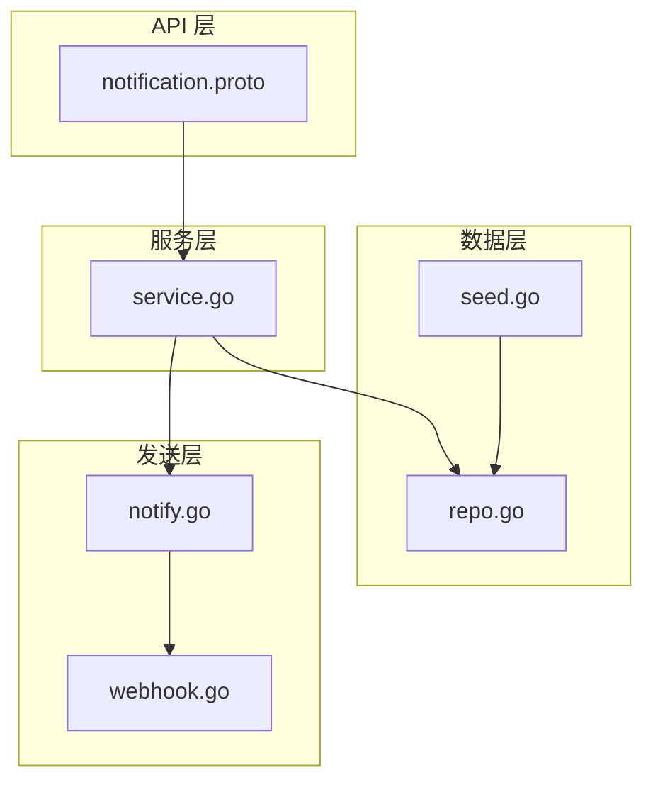
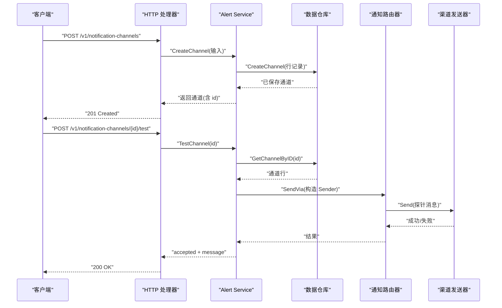
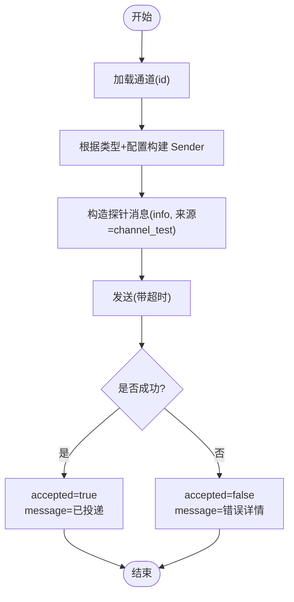
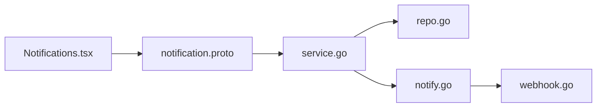

# 通知渠道管理

<cite>
**本文引用的文件**
- [notification.proto](file://api/manager/notification/v1/notification.proto)
- [notify.go](file://internal/pkg/notify/notify.go)
- [webhook.go](file://internal/pkg/notify/webhook.go)
- [service.go](file://internal/manager/service/alert/service.go)
- [repo.go](file://internal/manager/data/alert/store/repo.go)
- [seed.go](file://internal/manager/data/alert/store/seed.go)
- [usecase.go](file://internal/manager/biz/alert/usecase.go)
- [channel_sender_test.go](file://internal/manager/biz/alert/channel_sender_test.go)
- [http_test.go](file://internal/manager/server/alert/http_test.go)
- [notify_channel_crud_test.go](file://tests/e2e/notify_channel_crud_test.go)
- [notify_signed_test.go](file://tests/e2e/notify_signed_test.go)
- [Notifications.tsx](file://web/src/pages/settings/Notifications.tsx)
</cite>

## 目录
1. [简介](#简介)
2. [项目结构](#项目结构)
3. [核心组件](#核心组件)
4. [架构总览](#架构总览)
5. [详细组件分析](#详细组件分析)
6. [依赖关系分析](#依赖关系分析)
7. [性能考量](#性能考量)
8. [故障排查指南](#故障排查指南)
9. [结论](#结论)
10. [附录](#附录)

## 简介
本技术文档围绕“通知渠道管理”展开，覆盖支持的渠道类型（Webhook、Slack、飞书、钉钉、企业微信、Telegram）、渠道的创建/更新/删除/测试接口、参数配置方法（端点地址、认证信息、消息格式）、启用/禁用与批量操作、测试流程与响应验证，以及常见渠道配置示例和故障排查建议。文档基于仓库中的 API 定义、服务实现、数据持久化、发送器实现及端到端测试进行梳理，确保读者既能理解整体架构，也能落地配置与排障。

## 项目结构
通知渠道管理涉及四层：
- API 层：gRPC/HTTP 接口契约（proto）
- 服务层：业务编排（CRUD、测试、权限校验）
- 数据层：存储与迁移（GORM Repo）
- 发送层：各渠道适配器（Webhook、Slack、飞书、钉钉、企业微信、Telegram）

图表来源
- [notification.proto:10-25](file://api/manager/notification/v1/notification.proto#L10-L25)
- [service.go:432-556](file://internal/manager/service/alert/service.go#L432-L556)
- [repo.go:271-316](file://internal/manager/data/alert/store/repo.go#L271-L316)
- [notify.go:22-171](file://internal/pkg/notify/notify.go#L22-L171)
- [webhook.go:18-314](file://internal/pkg/notify/webhook.go#L18-L314)

章节来源
- [notification.proto:10-25](file://api/manager/notification/v1/notification.proto#L10-L25)
- [service.go:432-556](file://internal/manager/service/alert/service.go#L432-L556)
- [repo.go:271-316](file://internal/manager/data/alert/store/repo.go#L271-L316)
- [notify.go:22-171](file://internal/pkg/notify/notify.go#L22-L171)
- [webhook.go:18-314](file://internal/pkg/notify/webhook.go#L18-L314)

## 核心组件
- 通道类型枚举与模型：在 proto 中定义了 Webhook、Slack、Feishu、DingTalk 等类型，以及通道的元数据字段（id、name、type、enabled、endpoint_masked、时间戳）。
- 路由与发送器：Router 负责按名称或显式 Sender 投递消息；每种渠道通过 webhook.go 中的 Sender 实现封装请求体构建与签名逻辑。
- 服务层 CRUD 与测试：Service 提供 List/Get/Create/Update/Delete/TestChannel，其中 TestChannel 会构造探针消息并直接调用对应 Sender 进行真实投递。
- 数据持久化：Repo 提供分页查询、按名/ID 获取、启用列表、软删除、以及从环境变量启动时同步种子通道。
- 前端界面：Settings 页面支持新建、编辑、删除、测试通道，并按语言环境排序展示不同渠道卡片。

章节来源
- [notification.proto:19-35](file://api/manager/notification/v1/notification.proto#L19-L35)
- [notify.go:22-171](file://internal/pkg/notify/notify.go#L22-L171)
- [webhook.go:18-314](file://internal/pkg/notify/webhook.go#L18-L314)
- [service.go:432-556](file://internal/manager/service/alert/service.go#L432-L556)
- [repo.go:271-316](file://internal/manager/data/alert/store/repo.go#L271-L316)
- [Notifications.tsx:30-124](file://web/src/pages/settings/Notifications.tsx#L30-L124)

## 架构总览
下图展示了从 HTTP/gRPC 请求到最终投递的完整链路，包括鉴权、服务编排、数据访问与发送器执行。

图表来源
- [notification.proto:10-17](file://api/manager/notification/v1/notification.proto#L10-L17)
- [service.go:432-556](file://internal/manager/service/alert/service.go#L432-L556)
- [repo.go:271-316](file://internal/manager/data/alert/store/repo.go#L271-L316)
- [notify.go:92-156](file://internal/pkg/notify/notify.go#L92-L156)
- [webhook.go:220-258](file://internal/pkg/notify/webhook.go#L220-L258)

## 详细组件分析

### 通道类型与消息模型
- 通道类型：proto 中定义了 Webhook、Slack、Feishu、DingTalk；前端还暴露了 WeCom、Telegram 类型用于 UI 选择。
- 消息模型：统一 Message 包含主题、正文、严重级别、来源、去重键、标签、发生时间；各渠道发送器将其转换为各自协议的消息体。

章节来源
- [notification.proto:19-35](file://api/manager/notification/v1/notification.proto#L19-L35)
- [notify.go:22-31](file://internal/pkg/notify/notify.go#L22-L31)
- [Notifications.tsx:30-124](file://web/src/pages/settings/Notifications.tsx#L30-L124)

### 通道创建、更新、删除与测试接口
- 创建通道：POST /v1/notification-channels，输入 name、type、endpoint、enabled；服务端写入数据库并返回通道对象。
- 更新通道：PUT/PATCH /v1/notification-channels/{id}，可改 name、type、endpoint、enabled；secret 采用“无变更 vs 清空”语义。
- 删除通道：DELETE /v1/notification-channels/{id}，若被规则引用则拒绝删除，避免告警静默降级。
- 测试通道：POST /v1/notification-channels/{id}/test，构造探针消息并尝试真实投递，返回 accepted 与 message。

章节来源
- [notification.proto:10-17](file://api/manager/notification/v1/notification.proto#L10-L17)
- [service.go:432-556](file://internal/manager/service/alert/service.go#L432-L556)
- [http_test.go:329-373](file://internal/manager/server/alert/http_test.go#L329-L373)
- [notify_channel_crud_test.go:178-213](file://tests/e2e/notify_channel_crud_test.go#L178-L213)

### 通道参数配置方法
- 通用 Webhook：endpoint 为接收地址；可选 secret 会在请求体上计算 HMAC-SHA256，并通过自定义头 X-Ongrid-Signature 传递。
- Slack：使用 Incoming Webhook URL；不依赖 secret；消息体以 attachments 格式渲染，带颜色条与结构化字段。
- 飞书：endpoint 为自定义机器人 webhook；可选 secret 会在 JSON body 中附加 timestamp 与 sign（HMAC-SHA256 base64）。
- 钉钉：endpoint 为自定义机器人 webhook；可选 secret 会追加到 URL 查询参数 timestamp 与 sign（HMAC-SHA256 base64）。
- 企业微信：endpoint 为群机器人 webhook（key 在 URL 中）；消息体与钉钉一致。
- Telegram：endpoint 为 sendMessage 完整 URL（含 bot token），chat_id 放在 JSON body 中；不使用 secret/sign 路径。

章节来源
- [webhook.go:27-45](file://internal/pkg/notify/webhook.go#L27-L45)
- [webhook.go:141-192](file://internal/pkg/notify/webhook.go#L141-L192)
- [webhook.go:274-314](file://internal/pkg/notify/webhook.go#L274-L314)
- [usecase.go:1520-1549](file://internal/manager/biz/alert/usecase.go#L1520-L1549)

### 启用/禁用与批量操作
- 启用/禁用：通道行包含 enabled 字段；服务层 UpdateChannel 可切换；数据层 ListEnabledChannels 仅返回 enabled=true 的通道供告警路由使用。
- 批量操作：当前未提供批量启停接口；可通过多次调用更新接口或使用脚本批量更新数据库（谨慎操作）。

章节来源
- [repo.go:285-296](file://internal/manager/data/alert/store/repo.go#L285-L296)
- [service.go:458-491](file://internal/manager/service/alert/service.go#L458-L491)

### 通道测试功能详解
- 触发方式：调用测试接口传入通道 id。
- 内部流程：读取通道行 → 根据 ChannelType + ConfigJSON 构造具体 Sender → 构造 info 级别的探针消息 → 设置超时 → 调用 Send → 返回 accepted 与 message。
- 行为特性：测试不受全局通知开关影响，强制尝试真实投递，便于定位上游问题。

图表来源
- [service.go:513-556](file://internal/manager/service/alert/service.go#L513-L556)
- [usecase.go:1520-1549](file://internal/manager/biz/alert/usecase.go#L1520-L1549)
- [notify.go:92-156](file://internal/pkg/notify/notify.go#L92-L156)

### 常见渠道配置示例
- Webhook：填写 endpoint 与可选 secret；下游需校验 X-Ongrid-Signature。
- Slack：填写 Incoming Webhook URL；无需 secret。
- 飞书：填写自定义机器人 webhook URL；可选 secret 开启签名校验。
- 钉钉：填写自定义机器人 webhook URL；可选 secret 开启 URL 加签。
- 企业微信：填写群机器人 webhook URL（key 在 URL 中）。
- Telegram：填写 sendMessage 完整 URL（含 bot token），并在配置中指定 chat_id（作为 secret 字段承载）。

章节来源
- [webhook.go:27-45](file://internal/pkg/notify/webhook.go#L27-L45)
- [webhook.go:141-192](file://internal/pkg/notify/webhook.go#L141-L192)
- [webhook.go:274-314](file://internal/pkg/notify/webhook.go#L274-L314)
- [usecase.go:1520-1549](file://internal/manager/biz/alert/usecase.go#L1520-L1549)

### 前端界面与交互
- 页面支持新建、编辑、删除、测试通道；按语言环境排序显示不同渠道卡片。
- 测试按钮调用后端测试接口，展示成功/失败结果。

章节来源
- [Notifications.tsx:30-124](file://web/src/pages/settings/Notifications.tsx#L30-L124)
- [Notifications.tsx:397-444](file://web/src/pages/settings/Notifications.tsx#L397-L444)

## 依赖关系分析
- 服务层依赖数据仓库进行通道持久化，同时依赖通知路由器与发送器完成投递。
- 发送器对平台签名机制有强依赖（如飞书、钉钉的 HMAC 签名）。
- 前端依赖 API 契约进行 CRUD 与测试。

图表来源
- [service.go:432-556](file://internal/manager/service/alert/service.go#L432-L556)
- [repo.go:271-316](file://internal/manager/data/alert/store/repo.go#L271-L316)
- [notify.go:22-171](file://internal/pkg/notify/notify.go#L22-L171)
- [webhook.go:18-314](file://internal/pkg/notify/webhook.go#L18-L314)
- [notification.proto:10-25](file://api/manager/notification/v1/notification.proto#L10-L25)
- [Notifications.tsx:30-124](file://web/src/pages/settings/Notifications.tsx#L30-L124)

章节来源
- [service.go:432-556](file://internal/manager/service/alert/service.go#L432-L556)
- [repo.go:271-316](file://internal/manager/data/alert/store/repo.go#L271-L316)
- [notify.go:22-171](file://internal/pkg/notify/notify.go#L22-L171)
- [webhook.go:18-314](file://internal/pkg/notify/webhook.go#L18-L314)
- [notification.proto:10-25](file://api/manager/notification/v1/notification.proto#L10-L25)
- [Notifications.tsx:30-124](file://web/src/pages/settings/Notifications.tsx#L30-L124)

## 性能考量
- 发送超时：Router 默认超时控制，避免慢下游阻塞；测试接口也设置了固定超时。
- 并发投递：Router 对每个通道顺序发送，可在高吞吐场景下考虑并行化改造。
- 网络重试：当前未内置重试；建议在外部网关或下游侧做幂等处理。
- 日志与审计：告警事件表记录每次投递状态，便于追踪与复盘。

[本节为通用指导，不直接分析具体文件]

## 故障排查指南
- 无法创建/更新/删除：检查权限（非管理员可能受限）、必填字段（name/type/endpoint）、删除保护（被规则引用时拒绝）。
- 测试失败：
  - 检查 endpoint 是否正确（URL 是否可达、域名解析正常）。
  - 检查签名配置（飞书/钉钉 secret 是否与平台一致；Webhook 的 X-Ongrid-Signature 是否匹配）。
  - 查看测试返回 message 中的错误详情。
- 通道未生效：确认 enabled=true；检查 ListEnabledChannels 是否包含该通道；确认 Router 默认通道配置。
- 历史投递记录：通过告警事件页查看投递状态与错误信息。

章节来源
- [http_test.go:329-373](file://internal/manager/server/alert/http_test.go#L329-L373)
- [service.go:493-511](file://internal/manager/service/alert/service.go#L493-L511)
- [service.go:513-556](file://internal/manager/service/alert/service.go#L513-L556)
- [repo.go:285-296](file://internal/manager/data/alert/store/repo.go#L285-L296)

## 结论
通知渠道管理提供了统一的通道抽象与多平台适配能力，支持常见的 IM 与 Webhook 渠道，具备完善的 CRUD 与测试能力。通过配置 endpoint 与可选 secret，即可快速接入目标平台；通过测试接口可快速验证链路连通性。建议在生产环境中结合告警事件审计与必要的重试策略，保障通知的可靠性与可观测性。

[本节为总结性内容，不直接分析具体文件]

## 附录
- 端到端测试参考：
  - 通道 CRUD 流程与删除后列表一致性验证。
  - 飞书/钉钉签名请求验证（timestamp、sign 位置与算法）。
- 相关测试文件路径：
  - [notify_channel_crud_test.go](file://tests/e2e/notify_channel_crud_test.go)
  - [notify_signed_test.go](file://tests/e2e/notify_signed_test.go)

章节来源
- [notify_channel_crud_test.go:178-213](file://tests/e2e/notify_channel_crud_test.go#L178-L213)
- [notify_signed_test.go:187-235](file://tests/e2e/notify_signed_test.go#L187-L235)