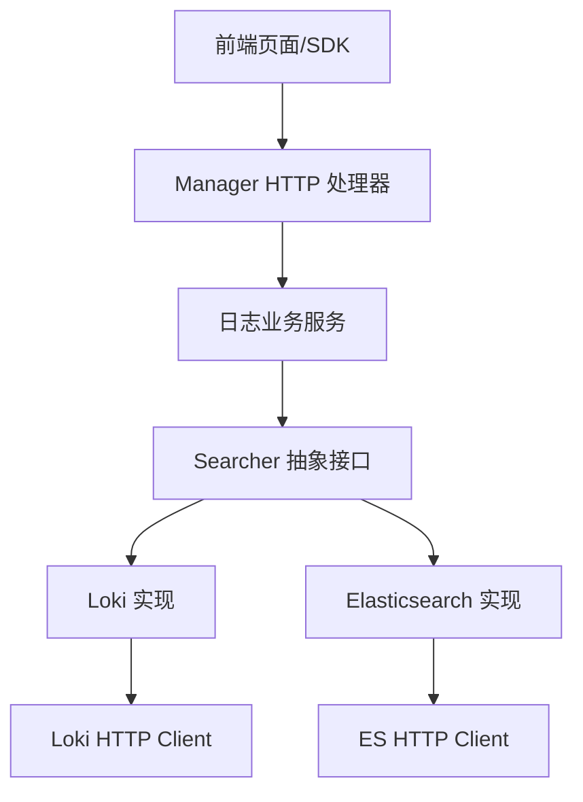
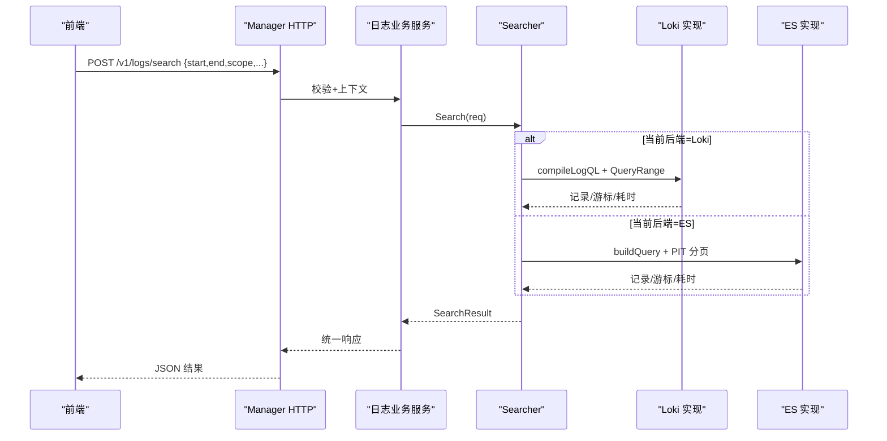
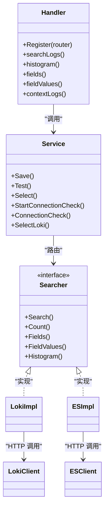

# 日志查询接口

<cite>
**本文引用的文件**
- [logs.proto](file://api/manager/logs/v1/logs.proto)
- [search.go](file://internal/pkg/logquery/search.go)
- [client.go](file://internal/pkg/logquery/client.go)
- [runtime_client.go](file://internal/pkg/logquery/runtime_client.go)
- [loki_search.go](file://internal/pkg/logquery/loki_search.go)
- [elasticsearch.go](file://internal/pkg/logquery/elasticsearch.go)
- [http.go](file://internal/manager/server/logs/http.go)
- [service.go](file://internal/manager/biz/logs/service.go)
- [logs.ts](file://web/src/api/logs.ts)
</cite>

## 目录
1. [简介](#简介)
2. [项目结构](#项目结构)
3. [核心组件](#核心组件)
4. [架构总览](#架构总览)
5. [详细组件分析](#详细组件分析)
6. [依赖关系分析](#依赖关系分析)
7. [性能与优化建议](#性能与优化建议)
8. [故障排查指南](#故障排查指南)
9. [结论](#结论)
10. [附录：API 参考与使用示例](#附录api-参考与使用示例)

## 简介
本技术文档面向“日志查询接口”，覆盖后端中性（backend-neutral）的日志搜索、查询与分析能力，包括时间范围、关键词过滤、字段筛选、排序、分页游标、聚合统计、直连 Loki 查询等。系统同时支持两种数据源：内置 Loki 与外部 Elasticsearch，并通过统一接口屏蔽差异。文档还包含参数校验规则、兼容性说明、错误处理策略、性能优化建议以及前端调用方式与示例路径。

## 项目结构
日志查询相关代码主要分布在以下层次：
- API 定义：gRPC/HTTP 协议与消息体在 proto 中定义
- HTTP 路由与处理器：Manager 侧暴露 REST 接口
- 业务服务：选择后端、配置管理、连接检查、Grafana 同步等
- 查询抽象层：Searcher 接口与请求/响应模型
- 后端实现：Loki 与 Elasticsearch 的具体查询实现
- 前端 SDK：TypeScript 封装了所有日志查询 API

图表来源
- [http.go:100-118](file://internal/manager/server/logs/http.go#L100-L118)
- [service.go:230-265](file://internal/manager/biz/logs/service.go#L230-L265)
- [search.go:138-159](file://internal/pkg/logquery/search.go#L138-L159)
- [client.go:53-171](file://internal/pkg/logquery/client.go#L53-L171)
- [elasticsearch.go:40-86](file://internal/pkg/logquery/elasticsearch.go#L40-L86)

章节来源
- [http.go:100-118](file://internal/manager/server/logs/http.go#L100-L118)
- [service.go:230-265](file://internal/manager/biz/logs/service.go#L230-L265)
- [search.go:138-159](file://internal/pkg/logquery/search.go#L138-L159)

## 核心组件
- 协议与消息体：定义统一的日志查询请求/响应、字段、直方图、后端管理等消息
- 搜索抽象：Searcher 接口提供 Search、Count、Fields、FieldValues、Histogram 等方法
- 后端实现：
  - Loki：通过 /loki/api/v1/query_range 和 /query 实现流式检索、计数、直方图
  - Elasticsearch：通过 _search/_count 及 composite aggregation 实现检索、分组计数、直方图
- 运行时客户端：RuntimeClient 动态解析 Loki 端点并缓存 HTTP 客户端
- HTTP 处理器：注册 REST 路由，负责鉴权、限流、超时、错误映射
- 业务服务：后端选择、配置保存、测试、连接检查、Grafana 数据源同步

章节来源
- [logs.proto:11-25](file://api/manager/logs/v1/logs.proto#L11-L25)
- [search.go:138-159](file://internal/pkg/logquery/search.go#L138-L159)
- [client.go:53-171](file://internal/pkg/logquery/client.go#L53-L171)
- [runtime_client.go:16-51](file://internal/pkg/logquery/runtime_client.go#L16-L51)
- [http.go:100-118](file://internal/manager/server/logs/http.go#L100-L118)
- [service.go:303-507](file://internal/manager/biz/logs/service.go#L303-L507)

## 架构总览
日志查询采用“后端中性”设计：上层只依赖 Searcher 接口，底层可切换 Loki 或 Elasticsearch。HTTP 层将请求标准化为 SearchRequest，交由业务服务路由到当前选定的后端；对于需要直连 Loki 的场景（如 Grafana 或调试），提供独立的 query_range/labels 接口。

图表来源
- [http.go:310-331](file://internal/manager/server/logs/http.go#L310-L331)
- [loki_search.go:31-118](file://internal/pkg/logquery/loki_search.go#L31-L118)
- [elasticsearch.go:88-175](file://internal/pkg/logquery/elasticsearch.go#L88-L175)

## 详细组件分析

### 1) 协议与消息体（Proto）
- 搜索请求：包含 start/end、scope（设备/集群/命名空间/工作负载/容器/节点/服务名/来源/级别/文件/单元）、keywords（include/exclude/mode）、filters（field/operator/values）、limit、cursor、direction
- 搜索结果：records、next_cursor、has_more、took_ms、backends
- 字段与值：GetLogFields/GetLogFieldValues
- 直方图：GetLogHistogram（interval）
- 上下文：GetLogContext（record_id/timestamp/scope/before/after/backend）
- 后端管理：Get/Put/Test/Select 后端、连接检查、选择内置 Loki

章节来源
- [logs.proto:76-114](file://api/manager/logs/v1/logs.proto#L76-L114)
- [logs.proto:125-187](file://api/manager/logs/v1/logs.proto#L125-L187)
- [logs.proto:189-346](file://api/manager/logs/v1/logs.proto#L189-L346)

### 2) 搜索抽象与参数规范（SearchRequest）
- 时间窗口：必须提供 start/end，且 end > start，最大窗口 30 天
- 默认限制：limit 默认 200，最大 1000
- 方向：默认 backward（最新优先），可选 forward
- 关键词模式：any/all/phrase
- Scope 维度：device_ids、cluster_ids、namespaces、workloads、pods、containers、nodes、service_names、source_ids、levels、files、units
- 字段过滤器：支持 eq/neq/in/exists/prefix，字段白名单由 LookupField 控制
- 游标：用于分页，内部编码为 base64 的 JSON，含后端类型、时间戳、skip/sort 信息
- 分组维度：group_by 仅允许 device_id、cluster_id、source_id、namespace、service_name，最多 5 个

章节来源
- [search.go:13-22](file://internal/pkg/logquery/search.go#L13-L22)
- [search.go:78-109](file://internal/pkg/logquery/search.go#L78-L109)
- [search.go:257-338](file://internal/pkg/logquery/search.go#L257-L338)
- [search.go:186-209](file://internal/pkg/logquery/search.go#L186-L209)
- [search.go:368-420](file://internal/pkg/logquery/search.go#L368-L420)

### 3) Loki 实现
- 查询编译：将 scope/filters/keywords 编译为 LogQL 匹配器与行级过滤
- 分页：基于时间戳与 skip 的游标；向后/向前翻页时通过 ±1ns 边界避免漏条
- 计数：使用 count_over_time 瞬时查询，保证相邻桶不重复计数
- 直方图：按 interval 生成矩阵结果，必要时 offset 对齐 epoch 网格
- 字段值：若字段已索引且无 scope，直接走 label values；否则扫描记录去重
- 记录解码：从 streams 中提取 timestamp/message/attributes/resource_attributes，并标准化 severity

章节来源
- [loki_search.go:31-118](file://internal/pkg/logquery/loki_search.go#L31-L118)
- [loki_search.go:130-230](file://internal/pkg/logquery/loki_search.go#L130-L230)
- [loki_search.go:318-388](file://internal/pkg/logquery/loki_search.go#L318-L388)
- [loki_search.go:390-526](file://internal/pkg/logquery/loki_search.go#L390-L526)
- [loki_search.go:563-644](file://internal/pkg/logquery/loki_search.go#L563-L644)

### 4) Elasticsearch 实现
- 查询构建：基于 bool/filter/must/must_not 子句，keyword 使用 match_phrase，filter 使用 term/terms/exists/prefix
- 分页：使用 PIT（Point-in-Time）+ search_after，确保稳定有序
- 计数：_count API，时间范围使用 gte/lte
- 分组计数：composite aggregation 分页遍历，避免高基数截断
- 直方图：date_histogram 固定间隔，extended/hard bounds 限定范围
- 权限与版本：ProbeInfo 校验版本（要求 8.16+），RequirePrivileges 验证读写权限
- 资源释放：CloseCursor 关闭 PIT，失败路径也清理 PIT

章节来源
- [elasticsearch.go:88-175](file://internal/pkg/logquery/elasticsearch.go#L88-L175)
- [elasticsearch.go:190-302](file://internal/pkg/logquery/elasticsearch.go#L190-L302)
- [elasticsearch.go:362-424](file://internal/pkg/logquery/elasticsearch.go#L362-L424)
- [elasticsearch.go:426-520](file://internal/pkg/logquery/elasticsearch.go#L426-L520)
- [elasticsearch.go:553-669](file://internal/pkg/logquery/elasticsearch.go#L553-L669)
- [elasticsearch.go:717-771](file://internal/pkg/logquery/elasticsearch.go#L717-L771)

### 5) HTTP 处理器与路由
- 路由：
  - POST /v1/logs/search
  - POST /v1/logs/cursor/close
  - GET /v1/logs/fields
  - POST /v1/logs/field-values
  - POST /v1/logs/histogram
  - POST /v1/logs/context
  - GET/PUT /v1/logs/backend
  - POST /v1/logs/backend/{id}/test
  - POST /v1/logs/backend/loki/select
  - POST /v1/logs/backend/{id}/select
  - POST/GET /v1/logs/backend/connection-check
  - GET /v1/logs/query_range
  - GET /v1/logs/labels
  - GET /v1/logs/labels/{name}/values
- 限流与并发：结构化搜索有并发槽位限制，超限时返回 429 并带 Retry-After
- 超时：搜索请求 30s 超时
- 错误映射：参数错误→400；后端错误→502；超时→504

章节来源
- [http.go:100-118](file://internal/manager/server/logs/http.go#L100-L118)
- [http.go:310-331](file://internal/manager/server/logs/http.go#L310-L331)
- [http.go:731-748](file://internal/manager/server/logs/http.go#L731-L748)

### 6) 业务服务（后端选择与管理）
- 保存/测试/选择后端：校验写/读凭据不同、存储受管密钥、探测版本与权限、迁移告警规则、通知 Edge
- 连接检查：为每个 Edge 下发探针，轮询写入可见性以标记 verified
- 选择内置 Loki：无需 Edge 验证，但需配置 Loki 目标
- Grafana 同步：异步更新数据源配置

章节来源
- [service.go:303-507](file://internal/manager/biz/logs/service.go#L303-L507)
- [service.go:509-739](file://internal/manager/biz/logs/service.go#L509-L739)
- [service.go:1142-1244](file://internal/manager/biz/logs/service.go#L1142-L1244)
- [service.go:1246-1328](file://internal/manager/biz/logs/service.go#L1246-L1328)

### 7) 前端 SDK（TypeScript）
- 封装了 searchLogs、closeLogCursor、listLogFields、listLogFieldValues、getLogHistogram、currentLogBackend、saveLogBackend、testLogBackend、selectLogBackend、connection-check、selectLoki、queryLogsRange、labels 等
- 类型定义与后端一致，便于 IDE 提示与校验

章节来源
- [logs.ts:82-110](file://web/src/api/logs.ts#L82-L110)
- [logs.ts:158-222](file://web/src/api/logs.ts#L158-L222)
- [logs.ts:241-273](file://web/src/api/logs.ts#L241-L273)

## 依赖关系分析
- HTTP 处理器依赖业务服务，业务服务依赖 Searcher 抽象
- Searcher 有两个实现：Loki 与 Elasticsearch
- Loki 实现依赖低层 client.QueryRange/LabelNames/LabelValues
- RuntimeClient 动态解析 Loki 端点并复用 HTTP 客户端
- 业务服务维护后端选择状态、凭据、Grafana 同步与 Edge 连接检查

图表来源
- [http.go:100-118](file://internal/manager/server/logs/http.go#L100-L118)
- [service.go:230-265](file://internal/manager/biz/logs/service.go#L230-L265)
- [search.go:138-159](file://internal/pkg/logquery/search.go#L138-L159)
- [client.go:53-171](file://internal/pkg/logquery/client.go#L53-L171)
- [elasticsearch.go:40-86](file://internal/pkg/logquery/elasticsearch.go#L40-L86)

章节来源
- [http.go:100-118](file://internal/manager/server/logs/http.go#L100-L118)
- [service.go:230-265](file://internal/manager/biz/logs/service.go#L230-L265)
- [search.go:138-159](file://internal/pkg/logquery/search.go#L138-L159)

## 性能与优化建议
- 时间窗口：尽量缩小 start/end，最大窗口 30 天；大窗口会显著增加后端压力
- 限制与分页：合理设置 limit（默认 200，最大 1000），使用 cursor 分页；对 ES 使用 PIT 分页，避免全量加载
- 关键词与过滤器：
  - keywords.mode=any 适合快速定位；all/phrase 更严格但开销更大
  - filters 优先使用已索引字段（如 device_id、level）以减少扫描
- 直方图：选择合适的 interval；过小的 interval 会增加查询次数
- 并发与限流：结构化搜索有并发上限，遇到 429 应退避重试
- 后端选择：
  - Loki：适合流式浏览与简单聚合；注意 label 大小写与 unknown_service 归一化
  - ES：适合复杂过滤与高基数聚合；注意 PIT 生命周期与权限
- 网络与超时：HTTP 客户端默认 30s；长查询建议分片或降低 limit

[本节为通用指导，不直接分析具体文件]

## 故障排查指南
- 参数错误（400）：常见于非法字段、不支持的操作符、空值、超出长度、无效游标、时间窗口非法
- 后端错误（502）：Loki/ES 不可达、权限不足、版本不兼容、集群 UUID 不一致
- 超时（504）：窗口过大、limit 过高、关键字过于宽泛；建议缩小范围或拆分查询
- 游标失效：跨后端或方向变化会导致游标无效；重新发起查询
- 连接检查失败：确认 Edge 在线、探针可见、写/读凭据正确、版本一致

章节来源
- [http.go:731-748](file://internal/manager/server/logs/http.go#L731-L748)
- [elasticsearch.go:426-520](file://internal/pkg/logquery/elasticsearch.go#L426-L520)
- [service.go:1142-1244](file://internal/manager/biz/logs/service.go#L1142-L1244)

## 结论
本日志查询接口通过后端中性抽象，统一了 Loki 与 Elasticsearch 的差异，提供一致的搜索、统计、聚合与导出能力。配合严格的参数校验、分页游标、并发限流与错误映射，既保证了易用性，又兼顾了可扩展性与稳定性。建议在大规模场景下结合时间窗口、字段索引、合理 limit 与 interval 进行性能调优，并利用连接检查与权限探测保障部署质量。

[本节为总结，不直接分析具体文件]

## 附录：API 参考与使用示例

### 1) 搜索日志
- 方法：POST /v1/logs/search
- 请求体：SearchLogsRequest（start/end、scope、keywords、filters、limit、cursor、direction）
- 响应：SearchLogsResponse（code/message/data）
- 示例（前端 SDK）：searchLogs(input)

章节来源
- [http.go:310-331](file://internal/manager/server/logs/http.go#L310-L331)
- [logs.proto:76-114](file://api/manager/logs/v1/logs.proto#L76-L114)
- [logs.ts:82-84](file://web/src/api/logs.ts#L82-L84)

### 2) 获取字段与字段值
- 字段列表：GET /v1/logs/fields?start=&end=
- 字段值：POST /v1/logs/field-values（field、start、end、scope、limit）
- 示例（前端 SDK）：listLogFields、listLogFieldValues

章节来源
- [http.go:100-118](file://internal/manager/server/logs/http.go#L100-L118)
- [logs.proto:125-156](file://api/manager/logs/v1/logs.proto#L125-L156)
- [logs.ts:90-106](file://web/src/api/logs.ts#L90-L106)

### 3) 直方图统计
- 方法：POST /v1/logs/histogram
- 请求体：{search: SearchLogsRequest, interval: string}
- 响应：GetLogHistogramResponse（data: buckets[]）
- 示例（前端 SDK）：getLogHistogram

章节来源
- [http.go:100-118](file://internal/manager/server/logs/http.go#L100-L118)
- [logs.proto:158-172](file://api/manager/logs/v1/logs.proto#L158-L172)
- [logs.ts:108-110](file://web/src/api/logs.ts#L108-L110)

### 4) 日志上下文
- 方法：POST /v1/logs/context
- 请求体：record_id、timestamp、scope、before、after、backend
- 响应：GetLogContextResponse（data: records[]）

章节来源
- [http.go:100-118](file://internal/manager/server/logs/http.go#L100-L118)
- [logs.proto:174-187](file://api/manager/logs/v1/logs.proto#L174-L187)

### 5) 后端管理
- 获取/保存/测试/选择后端：/v1/logs/backend、/v1/logs/backend/{id}/test、/v1/logs/backend/{id}/select
- 选择内置 Loki：/v1/logs/backend/loki/select
- 连接检查：/v1/logs/backend/connection-check（POST/GET）
- 示例（前端 SDK）：getLogBackend、saveLogBackend、testLogBackend、selectLogBackend、startLogBackendConnectionCheck、getLogBackendConnectionCheck、selectLokiLogBackend

章节来源
- [http.go:100-118](file://internal/manager/server/logs/http.go#L100-L118)
- [logs.proto:189-346](file://api/manager/logs/v1/logs.proto#L189-L346)
- [logs.ts:158-222](file://web/src/api/logs.ts#L158-L222)

### 6) 直连 Loki（调试/高级用法）
- 查询范围：GET /v1/logs/query_range?query=&start=&end=&limit=&step=&direction=
- 标签列表：GET /v1/logs/labels?start=&end=
- 标签值：GET /v1/logs/labels/{name}/values?start=&end=
- 示例（前端 SDK）：queryLogsRange、listLogLabels、listLogLabelValues

章节来源
- [http.go:100-118](file://internal/manager/server/logs/http.go#L100-L118)
- [client.go:120-230](file://internal/pkg/logquery/client.go#L120-L230)
- [logs.ts:241-273](file://web/src/api/logs.ts#L241-L273)

### 7) 参数配置速查
- 时间范围：start/end（RFC3339 或 Unix 时间），最大窗口 30 天
- 关键词：include/exclude/mode（any/all/phrase）
- 字段筛选：field/operator/values（eq/neq/in/exists/prefix）
- 排序：direction（backward/forward）
- 分页：cursor（后端相关，跨后端或方向变化需重置）
- 聚合：interval（直方图），group_by（仅后端支持分组计数时使用）

章节来源
- [search.go:257-338](file://internal/pkg/logquery/search.go#L257-L338)
- [loki_search.go:390-526](file://internal/pkg/logquery/loki_search.go#L390-L526)
- [elasticsearch.go:593-669](file://internal/pkg/logquery/elasticsearch.go#L593-L669)

### 8) 使用示例（路径引用）
- 前端搜索日志：见 [logs.ts:82-84](file://web/src/api/logs.ts#L82-L84)
- 前端获取字段值：见 [logs.ts:98-106](file://web/src/api/logs.ts#L98-L106)
- 前端直方图：见 [logs.ts:108-110](file://web/src/api/logs.ts#L108-L110)
- 前端后端管理：见 [logs.ts:158-222](file://web/src/api/logs.ts#L158-L222)
- 前端直连 Loki：见 [logs.ts:241-273](file://web/src/api/logs.ts#L241-L273)