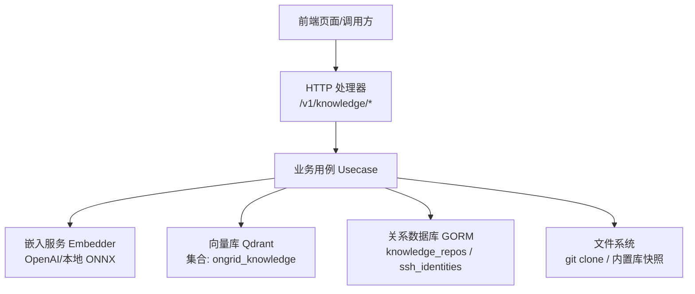
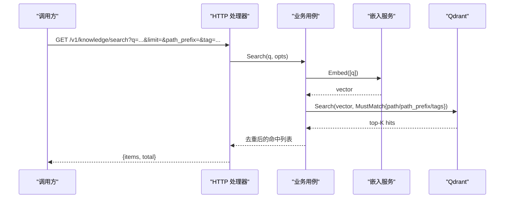
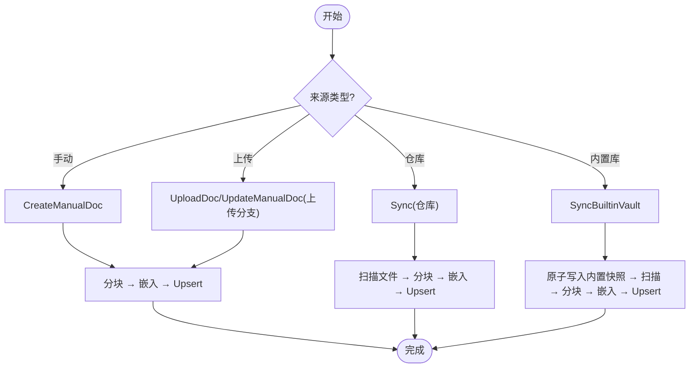
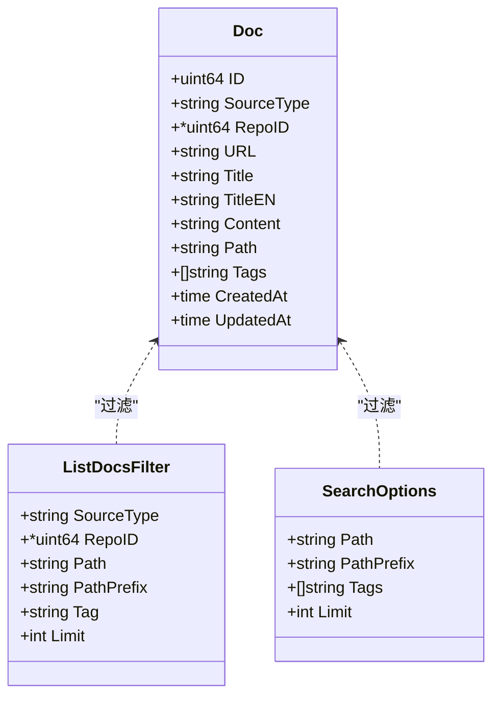
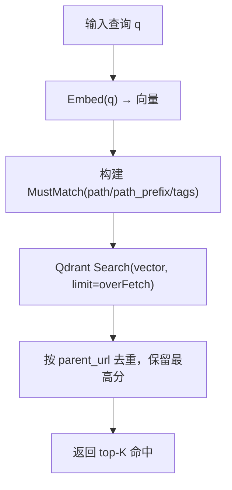
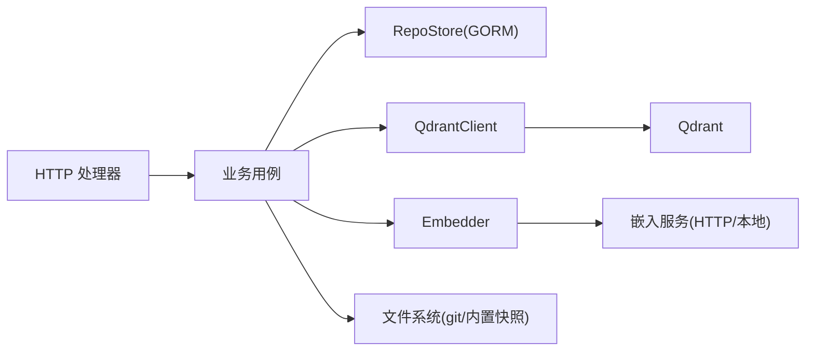

# 知识库接口

<cite>
**本文引用的文件**
- [usecase.go](file://internal/manager/biz/knowledge/usecase.go)
- [http.go](file://internal/manager/server/knowledge/http.go)
- [repo.go](file://internal/manager/data/knowledge/store/repo.go)
- [model.go](file://internal/manager/model/knowledge/model.go)
- [builtin_vault.go](file://internal/manager/biz/knowledge/builtin_vault.go)
- [embedding.go](file://internal/pkg/embedding/embedding.go)
- [client.go](file://internal/pkg/qdrantx/client.go)
- [knowledge.ts](file://web/src/api/knowledge.ts)
</cite>

## 目录
1. [简介](#简介)
2. [项目结构](#项目结构)
3. [核心组件](#核心组件)
4. [架构总览](#架构总览)
5. [详细组件分析](#详细组件分析)
6. [依赖关系分析](#依赖关系分析)
7. [性能与缓存](#性能与缓存)
8. [故障排查指南](#故障排查指南)
9. [结论](#结论)
10. [附录：API 参考与使用示例](#附录api-参考与使用示例)

## 简介
本技术文档面向“知识库”能力，覆盖知识内容的创建、编辑、搜索、版本管理（通过仓库同步）、分类与标签、权限控制、检索算法与结果优化、内容同步机制与缓存策略。系统采用“向量检索 + 结构化过滤”的混合方案：文档正文以分块向量化后存入 Qdrant，元数据（来源类型、仓库 ID、路径、标签等）作为负载字段并建立索引，以实现高召回与高精确度的检索体验。同时提供 Git 仓库同步与内置知识库（平台预置素材）同步能力，支持组织上传文档与手动录入。

## 项目结构
知识库功能由四层组成：
- HTTP 层：路由注册、鉴权中间件、请求/响应 DTO 转换、审计事件注入。
- 业务层（Usecase）：编排文档生命周期、分块与嵌入、Qdrant 写入/查询、仓库同步、内置库同步。
- 数据层：MySQL/GORM 存储仓库注册与 SSH 身份；Qdrant 存储向量与文档负载。
- 模型层：统一的 Doc、Repository、SSHIdentity、过滤器与搜索结果结构。

图表来源
- [http.go:110-137](file://internal/manager/server/knowledge/http.go#L110-L137)
- [usecase.go:125-171](file://internal/manager/biz/knowledge/usecase.go#L125-L171)
- [client.go:48-116](file://internal/pkg/qdrantx/client.go#L48-L116)
- [repo.go:17-22](file://internal/manager/data/knowledge/store/repo.go#L17-L22)

章节来源
- [http.go:1-137](file://internal/manager/server/knowledge/http.go#L1-L137)
- [usecase.go:1-171](file://internal/manager/biz/knowledge/usecase.go#L1-L171)
- [model.go:1-162](file://internal/manager/model/knowledge/model.go#L1-L162)

## 核心组件
- HTTP 处理器：暴露 RESTful 接口，负责参数校验、DTO 映射、权限与审计。
- 业务用例：实现文档 CRUD、搜索、列表、路径统计、仓库同步、内置库同步、上传与移动。
- 嵌入器：将文本转为向量，支持 OpenAI 兼容 API 或本地 ONNX 模型。
- Qdrant 客户端：集合与索引管理、Upsert、按负载过滤的 Search/Scroll、按 ID 获取/删除。
- 数据持久化：GORM 管理仓库注册与 SSH 身份；文档本体在 Qdrant。
- 模型定义：Doc、Repository、SSHIdentity、ListDocsFilter、SearchOptions、SearchHit。

章节来源
- [http.go:42-72](file://internal/manager/server/knowledge/http.go#L42-L72)
- [usecase.go:43-108](file://internal/manager/biz/knowledge/usecase.go#L43-L108)
- [embedding.go:38-48](file://internal/pkg/embedding/embedding.go#L38-L48)
- [client.go:29-46](file://internal/pkg/qdrantx/client.go#L29-L46)
- [model.go:23-162](file://internal/manager/model/knowledge/model.go#L23-L162)

## 架构总览
知识库采用“向量检索 + 结构化过滤”的双通道设计：
- 写路径：手动录入/上传/仓库同步/内置库同步 → 分块 → 嵌入 → Upsert 到 Qdrant。
- 读路径：关键词搜索 → 嵌入查询向量 → Qdrant 向量检索 + 负载过滤（path/path_prefix/tags/source_type/repo_id）→ 去重与排序 → 返回命中。

图表来源
- [http.go:425-456](file://internal/manager/server/knowledge/http.go#L425-L456)
- [usecase.go:749-800](file://internal/manager/biz/knowledge/usecase.go#L749-L800)
- [client.go:272-302](file://internal/pkg/qdrantx/client.go#L272-L302)
- [embedding.go:150-214](file://internal/pkg/embedding/embedding.go#L150-L214)

## 详细组件分析

### 文档生命周期与版本管理
- 手动创建：POST /v1/knowledge/docs，生成稳定 ID，分块/嵌入后 Upsert。
- 上传文件：POST /v1/knowledge/upload，解析 .md/.txt/.pdf/.docx，分块/嵌入，按 URL 去重重写。
- 更新文档：PATCH /v1/knowledge/docs/{id}，支持标题、内容、路径、标签；上传类文档会重新分块与嵌入。
- 移动文档：PATCH /v1/knowledge/docs/{id}/move，仅变更路径；上传类文档需重新嵌入。
- 删除文档：DELETE /v1/knowledge/docs/{id}，手动单点删除；上传类按 URL 批量删除；仓库/内置库文档不可单独删。
- 仓库同步：POST /v1/knowledge/repos/{id}/sync，拉取/克隆 → 扫描文件 → 分块/嵌入 → 替换该仓库的点集。
- 内置库同步：POST /v1/knowledge/vault/sync，优先从云端仓库克隆，失败回退到二进制内嵌快照。

图表来源
- [usecase.go:187-221](file://internal/manager/biz/knowledge/usecase.go#L187-L221)
- [usecase.go:233-340](file://internal/manager/biz/knowledge/usecase.go#L233-L340)
- [usecase.go:353-402](file://internal/manager/biz/knowledge/usecase.go#L353-L402)
- [usecase.go:626-689](file://internal/manager/biz/knowledge/usecase.go#L626-L689)
- [builtin_vault.go:54-77](file://internal/manager/biz/knowledge/builtin_vault.go#L54-L77)

章节来源
- [http.go:214-423](file://internal/manager/server/knowledge/http.go#L214-L423)
- [usecase.go:187-402](file://internal/manager/biz/knowledge/usecase.go#L187-L402)
- [usecase.go:626-689](file://internal/manager/biz/knowledge/usecase.go#L626-L689)
- [builtin_vault.go:54-77](file://internal/manager/biz/knowledge/builtin_vault.go#L54-L77)

### 分类、标签与路径树
- 路径（Path）：以“/”分隔的层级面包屑，如“网络/DNS”，用于文件夹树展示与精确匹配。
- 路径前缀（PathPrefix）：基于展开的 path_prefixes 数组进行严格前缀匹配，避免全文分词误匹配。
- 标签（Tags）：自由多标签，支持任意匹配。
- 列表与计数：ListPaths 聚合所有非空 Path，结合 repo URL 目录推导，构建 SPA 的文件夹树视图。

图表来源
- [model.go:90-162](file://internal/manager/model/knowledge/model.go#L90-L162)

章节来源
- [usecase.go:404-468](file://internal/manager/biz/knowledge/usecase.go#L404-L468)
- [usecase.go:485-523](file://internal/manager/biz/knowledge/usecase.go#L485-L523)
- [usecase.go:705-745](file://internal/manager/biz/knowledge/usecase.go#L705-L745)

### 权限控制与审计
- 读写分离：读取接口无需额外授权；写操作（创建/更新/移动/删除/同步）通过 writeMW/deleteMW 接入可选的 Casbin 中间件。
- 资源对象：knowledge:doc、knowledge:repo。
- 审计：仓库创建/同步/删除均记录审计事件（Action、ResourceType、ResourceID、Status、Payload）。

章节来源
- [http.go:74-107](file://internal/manager/server/knowledge/http.go#L74-L107)
- [http.go:110-137](file://internal/manager/server/knowledge/http.go#L110-L137)
- [http.go:499-543](file://internal/manager/server/knowledge/http.go#L499-L543)
- [http.go:567-584](file://internal/manager/server/knowledge/http.go#L567-L584)

### 检索算法与结果优化
- 向量检索：对查询文本调用 Embedder 得到向量，使用 Qdrant 余弦相似度 Top-K。
- 服务器端过滤：在评分前应用 MustMatch（path/path_prefix/tags/source_type/repo_id），提升精确度。
- 过采样与去重：为处理长文档多分块命中，先 over-fetch（最多 5x 或上限 200），再按父级 URL 去重，保留最高分片段。
- 列表去重：ListDocs/ListPaths 使用 id_alias 去重，优先 head chunk（chunk_index==0 或缺失）。

图表来源
- [usecase.go:749-800](file://internal/manager/biz/knowledge/usecase.go#L749-L800)
- [client.go:272-302](file://internal/pkg/qdrantx/client.go#L272-L302)

章节来源
- [usecase.go:749-800](file://internal/manager/biz/knowledge/usecase.go#L749-L800)
- [usecase.go:525-564](file://internal/manager/biz/knowledge/usecase.go#L525-L564)

### 内容同步机制
- 仓库同步：
  - 克隆/拉取至本地目录（默认 /var/lib/ongrid/repos/<id>）。
  - 扫描 .md/.txt/.rst/.yaml/.yml/.toml/.json 等文件。
  - 分块 → 嵌入 → Upsert；删除旧点集后替换为新点集，保证幂等。
  - 更新 last_synced_at、last_sync_error、file_count。
- 内置库同步：
  - 优先尝试从云端仓库克隆；失败则使用二进制内嵌快照。
  - 原子写入（临时目录 + rename），避免并发读者看到半写状态。
  - 后续走相同扫描/分块/嵌入流程。

章节来源
- [usecase.go:1-15](file://internal/manager/biz/knowledge/usecase.go#L1-L15)
- [builtin_vault.go:12-47](file://internal/manager/biz/knowledge/builtin_vault.go#L12-L47)
- [builtin_vault.go:54-77](file://internal/manager/biz/knowledge/builtin_vault.go#L54-L77)
- [repo.go:72-87](file://internal/manager/data/knowledge/store/repo.go#L72-L87)

### 缓存策略
- 无显式应用层缓存：列表与搜索直接通过 Qdrant Scroll/Search 实时读取。
- 索引加速：启动时确保 payload 索引（source_type、repo_id、path、path_prefixes、tags），避免全表扫描。
- 集合维度一致性：EnsureCollection 检查并拒绝不匹配的维度，防止隐式错误。

章节来源
- [usecase.go:135-170](file://internal/manager/biz/knowledge/usecase.go#L135-L170)
- [client.go:48-116](file://internal/pkg/qdrantx/client.go#L48-L116)
- [client.go:118-150](file://internal/pkg/qdrantx/client.go#L118-L150)

## 依赖关系分析
- HTTP 处理器依赖业务 Service 接口，解耦具体实现。
- 业务用例依赖：
  - RepoStore（GORM）：仓库注册与 SSH 身份。
  - QdrantClient：集合/索引/CRUD/搜索。
  - Embedder：文本转向量。
- 外部依赖：
  - Qdrant：向量数据库。
  - 嵌入服务：OpenAI 兼容 API 或本地 ONNX。
  - Git：仓库同步（SSH 或 HTTPS）。

图表来源
- [http.go:42-72](file://internal/manager/server/knowledge/http.go#L42-L72)
- [usecase.go:43-108](file://internal/manager/biz/knowledge/usecase.go#L43-L108)
- [client.go:29-46](file://internal/pkg/qdrantx/client.go#L29-L46)
- [embedding.go:38-48](file://internal/pkg/embedding/embedding.go#L38-L48)

章节来源
- [http.go:42-72](file://internal/manager/server/knowledge/http.go#L42-L72)
- [usecase.go:43-108](file://internal/manager/biz/knowledge/usecase.go#L43-L108)

## 性能与缓存
- 列表分页与过采样：ListDocs 使用 Scroll 并放大 scanLimit，配合 id_alias 去重，保证逻辑条目数稳定。
- 搜索过采样：Search 设置 overFetch（最多 5x 或 200），避免长文档多分块抢占 Top-K。
- 索引优化：确保关键字段索引，减少过滤时的全量扫描。
- 上传大小限制：单次上传最大 8 MiB，控制内存与嵌入成本。
- 并发安全：内置库同步使用原子写入，避免并发读者读到半写状态。

章节来源
- [usecase.go:506-523](file://internal/manager/biz/knowledge/usecase.go#L506-L523)
- [usecase.go:782-792](file://internal/manager/biz/knowledge/usecase.go#L782-L792)
- [usecase.go:151-170](file://internal/manager/biz/knowledge/usecase.go#L151-L170)
- [http.go:288-323](file://internal/manager/server/knowledge/http.go#L288-L323)
- [builtin_vault.go:54-77](file://internal/manager/biz/knowledge/builtin_vault.go#L54-L77)

## 故障排查指南
- 未配置嵌入器：创建/更新/搜索报错提示需设置 API Key。
- Qdrant 集合维度不一致：EnsureCollection 检测到维度不匹配且已有数据时会明确报错，需清理重建。
- 上传失败：检查文件格式、大小限制、解析错误。
- 搜索结果为空：确认 MustMatch 过滤条件是否过严；检查 path/path_prefix/tags 是否正确；确认已建立索引。
- 列表为空：确认 source_type/repo_id 过滤；确认 chunk_index 历史数据兼容（新逻辑已放宽）。
- 同步失败：检查 Git SSH 身份、网络连通性、仓库权限；查看 last_sync_error。

章节来源
- [usecase.go:187-191](file://internal/manager/biz/knowledge/usecase.go#L187-L191)
- [usecase.go:754-757](file://internal/manager/biz/knowledge/usecase.go#L754-L757)
- [client.go:80-86](file://internal/pkg/qdrantx/client.go#L80-L86)
- [http.go:296-354](file://internal/manager/server/knowledge/http.go#L296-L354)
- [repo.go:72-87](file://internal/manager/data/knowledge/store/repo.go#L72-L87)

## 结论
知识库接口通过“向量检索 + 结构化过滤”的组合，兼顾召回率与精确度；提供灵活的分类与标签体系、严格的权限与审计、健壮的同步机制与幂等写入。通过合理的索引与过采样策略，系统在大规模文档场景下仍保持良好性能。建议在生产环境：
- 正确配置嵌入器与 Qdrant 集合维度。
- 合理设置 path/path_prefix/tags 过滤以提升精度。
- 定期执行仓库同步与内置库同步，保持索引新鲜。
- 监控 last_sync_error 与 Qdrant 指标，及时处理异常。

## 附录：API 参考与使用示例

### 接口总览
- 文档
  - GET /v1/knowledge/docs — 列出文档（支持 source_type、repo_id、path、path_prefix、tag、limit）
  - GET /v1/knowledge/docs/{id} — 获取单个文档详情
  - POST /v1/knowledge/docs — 创建手动文档
  - PATCH /v1/knowledge/docs/{id} — 更新文档（标题/内容/路径/标签）
  - PATCH /v1/knowledge/docs/{id}/move — 移动文档到新路径
  - DELETE /v1/knowledge/docs/{id} — 删除文档
  - POST /v1/knowledge/upload — 上传文件（.md/.txt/.pdf/.docx）
- 搜索
  - GET /v1/knowledge/search — 向量搜索（q、limit、path、path_prefix、tag）
- 路径树
  - GET /v1/knowledge/paths — 返回各路径及文档计数
- 仓库
  - GET /v1/knowledge/repos — 列出已注册仓库
  - POST /v1/knowledge/repos — 注册仓库
  - POST /v1/knowledge/repos/{id}/sync — 触发同步
  - DELETE /v1/knowledge/repos/{id} — 注销仓库并清理其文档
- 内置库
  - POST /v1/knowledge/vault/sync — 同步平台内置知识库
- SSH 身份
  - GET /v1/knowledge/ssh-identities
  - POST /v1/knowledge/ssh-identities
  - POST /v1/knowledge/ssh-identities/generate
  - PATCH /v1/knowledge/ssh-identities/{id}
  - DELETE /v1/knowledge/ssh-identities/{id}

章节来源
- [http.go:110-137](file://internal/manager/server/knowledge/http.go#L110-L137)
- [http.go:214-456](file://internal/manager/server/knowledge/http.go#L214-L456)
- [http.go:480-584](file://internal/manager/server/knowledge/http.go#L480-L584)

### 使用示例（前端调用）
- 列出文档：调用 listDocs({ source_type:'manual', path_prefix:'网络/' })
- 搜索：调用 searchKnowledge('DNS 解析失败', { limit:10, path_prefix:'网络/' })
- 上传：构造 FormData 包含 file、title、path、tags，调用 uploadDoc
- 同步仓库：调用 syncRepo(id)
- 同步内置库：调用 syncVault()

章节来源
- [knowledge.ts:62-157](file://web/src/api/knowledge.ts#L62-L157)
- [knowledge.ts:159-188](file://web/src/api/knowledge.ts#L159-L188)
- [knowledge.ts:190-247](file://web/src/api/knowledge.ts#L190-L247)