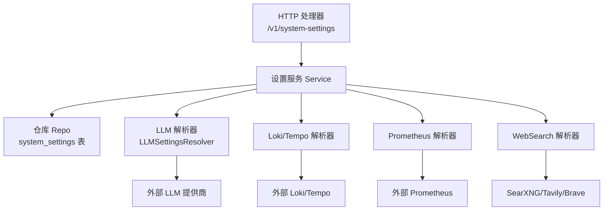
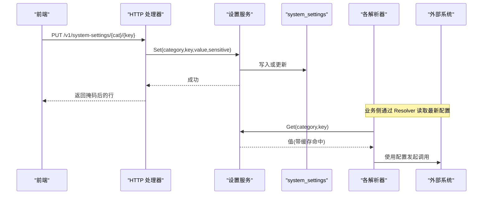
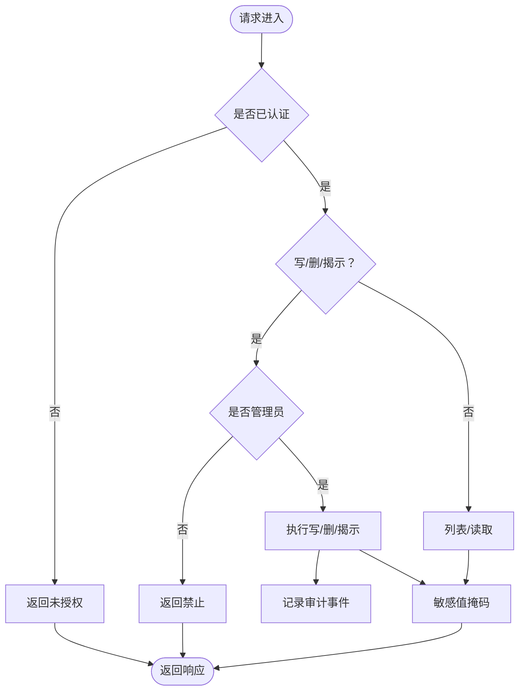
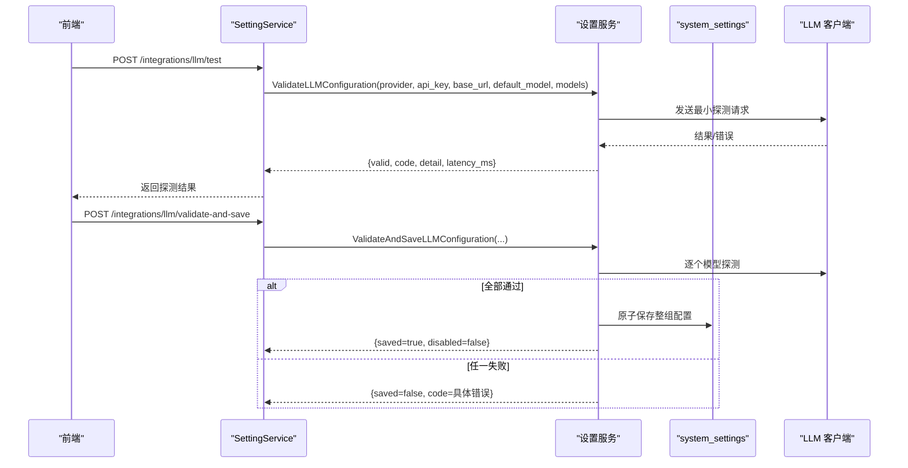
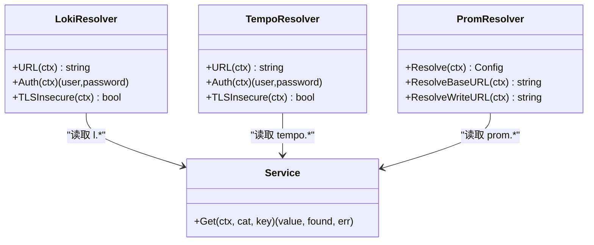
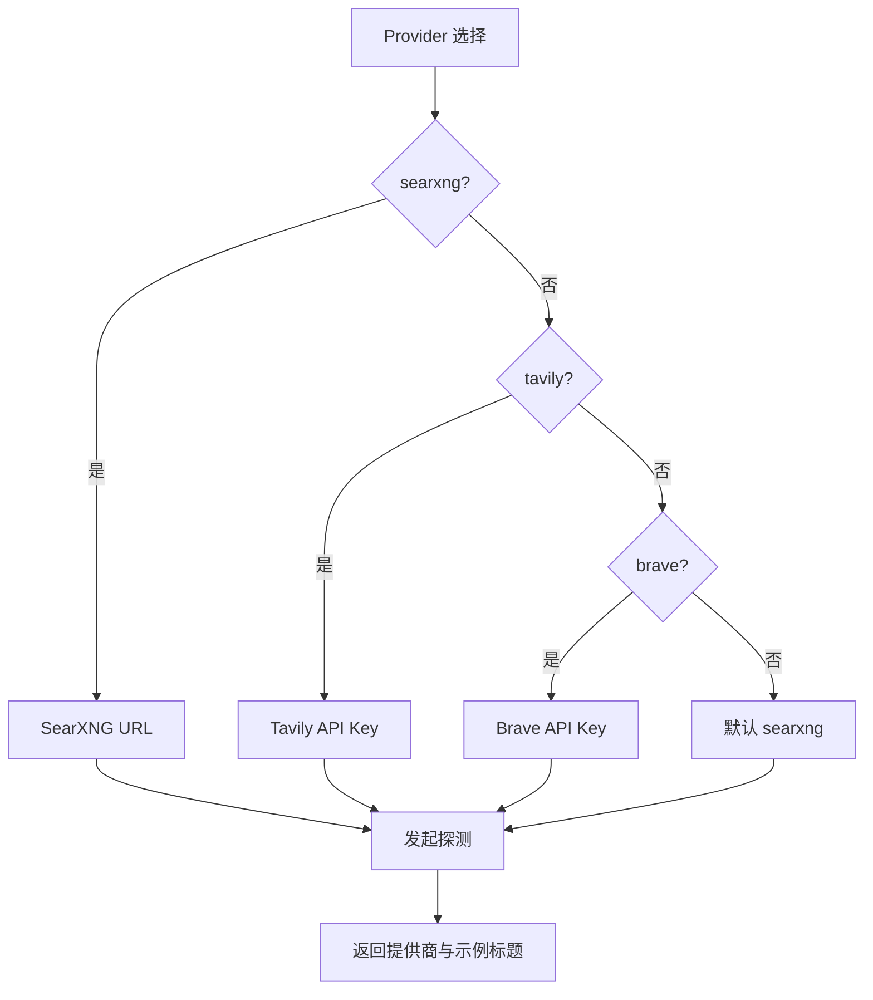
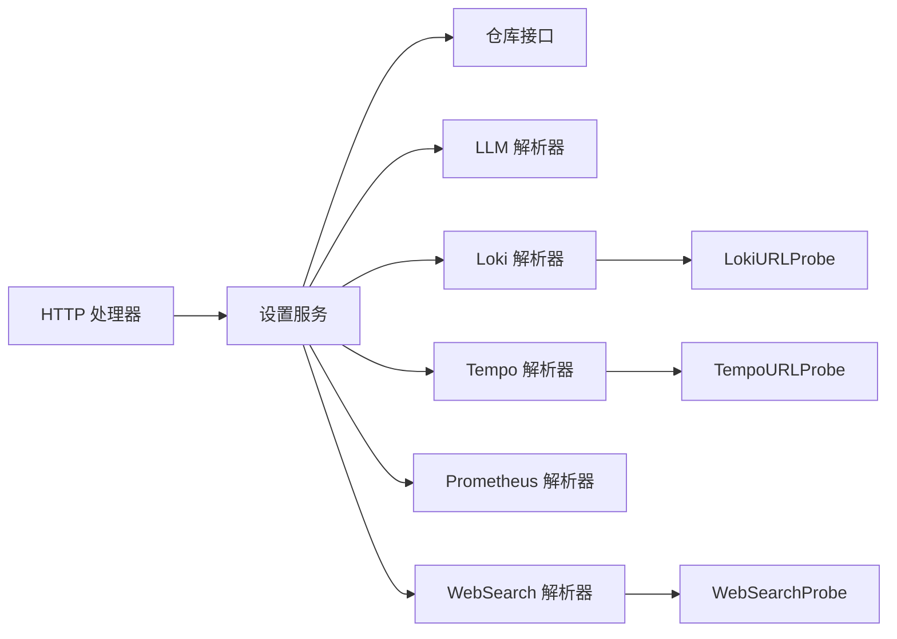

# 系统设置接口

<cite>
**本文引用的文件**
- [setting.proto](file://api/manager/setting/v1/setting.proto)
- [service.go](file://internal/manager/biz/setting/service.go)
- [http.go](file://internal/manager/server/setting/http.go)
- [model.go](file://internal/manager/model/setting/model.go)
- [llm.go](file://internal/manager/biz/setting/llm.go)
- [probe.go](file://internal/manager/biz/setting/probe.go)
- [telemetry.go](file://internal/manager/biz/setting/telemetry.go)
- [promauth.go](file://internal/manager/biz/setting/promauth.go)
- [websearch.go](file://internal/manager/biz/setting/websearch.go)
</cite>

## 目录
1. [简介](#简介)
2. [项目结构](#项目结构)
3. [核心组件](#核心组件)
4. [架构总览](#架构总览)
5. [详细组件分析](#详细组件分析)
6. [依赖关系分析](#依赖关系分析)
7. [性能考虑](#性能考虑)
8. [故障排查指南](#故障排查指南)
9. [结论](#结论)
10. [附录](#附录)

## 简介
本技术文档聚焦于“系统设置”能力，覆盖运行时配置管理、AI 模型集成、监控与可观测性集成、通知渠道（搜索）以及安全认证等配置项的 API 设计、数据模型、验证规则、默认值处理、导入导出与批量更新机制、热更新策略与错误处理。读者将了解如何通过 HTTP 接口与内部服务访问系统设置，以及如何以最小成本完成多供应商 AI 模型的配置与切换。

## 项目结构
系统设置由三层构成：
- 协议层：定义 LLM 配置的探测与保存接口（gRPC/HTTP）。
- 服务层：提供进程内缓存、敏感字段掩码、批量写入、缺失行回退等能力。
- 存储与解析层：基于 key/value 表 system_settings 持久化；各 Resolver 从该表读取并组合为外部系统的连接信息。

图表来源
- [http.go:45-50](file://internal/manager/server/setting/http.go#L45-L50)
- [service.go:29-37](file://internal/manager/biz/setting/service.go#L29-L37)
- [llm.go:126-224](file://internal/manager/biz/setting/llm.go#L126-L224)
- [telemetry.go:10-123](file://internal/manager/biz/setting/telemetry.go#L10-L123)
- [promauth.go:11-91](file://internal/manager/biz/setting/promauth.go#L11-L91)
- [websearch.go:10-94](file://internal/manager/biz/setting/websearch.go#L10-L94)

章节来源
- [http.go:1-50](file://internal/manager/server/setting/http.go#L1-L50)
- [service.go:1-70](file://internal/manager/biz/setting/service.go#L1-L70)
- [model.go:1-46](file://internal/manager/model/setting/model.go#L1-L46)

## 核心组件
- 设置服务 Service：提供 Get/Set/SetBatch/SetIfAbsent/List/Delete 等操作，内置进程级缓存与敏感字段掩码策略，保证热更新与一致性。
- HTTP 处理器：暴露 /v1/system-settings 的 CRUD 与 reveal 接口，读开放给已认证用户，写需管理员角色，自动标记敏感键并审计。
- LLM 配置：支持多提供商（OpenAI、Anthropic、Zhipu、Gemini、DeepSeek、Kimi、Custom），含模型列表、默认模型、BaseURL 与 API Key 的校验与原子保存。
- 监控与可观测性：Loki、Tempo、Prometheus 的配置通过 Resolver 动态读取，支持 Basic/Bearer 认证与 TLS 选项。
- WebSearch：选择 SearXNG/Tavily/Brave 作为内置搜索技能的后端，并提供“测试连接”探针。

章节来源
- [service.go:72-165](file://internal/manager/biz/setting/service.go#L72-L165)
- [http.go:67-190](file://internal/manager/server/setting/http.go#L67-L190)
- [llm.go:126-224](file://internal/manager/biz/setting/llm.go#L126-L224)
- [telemetry.go:10-123](file://internal/manager/biz/setting/telemetry.go#L10-L123)
- [promauth.go:11-91](file://internal/manager/biz/setting/promauth.go#L11-L91)
- [websearch.go:10-94](file://internal/manager/biz/setting/websearch.go#L10-L94)

## 架构总览
系统设置采用“配置即数据”的设计：所有运行时开关与凭据统一存储在 system_settings 表中，按 category/key 组织。服务层在读写时进行校验、掩码与缓存失效；各业务模块通过 Resolver 按需读取最新配置，实现无重启热更新。

图表来源
- [http.go:81-137](file://internal/manager/server/setting/http.go#L81-L137)
- [service.go:108-165](file://internal/manager/biz/setting/service.go#L108-L165)
- [llm.go:126-224](file://internal/manager/biz/setting/llm.go#L126-L224)
- [telemetry.go:42-123](file://internal/manager/biz/setting/telemetry.go#L42-L123)
- [promauth.go:53-91](file://internal/manager/biz/setting/promauth.go#L53-L91)

## 详细组件分析

### 1) 通用系统设置 API（/v1/system-settings）
- 路由
  - GET /v1/system-settings?category=... 列出某分类下的所有设置（敏感值自动掩码）。
  - PUT /v1/system-settings/{category}/{key} 写入单个设置（需管理员）。
  - DELETE /v1/system-settings/{category}/{key} 删除设置（需管理员）。
  - GET /v1/system-settings/{category}/{key}/reveal 获取明文值（仅管理员，用于 UI 显示）。
- 权限与审计
  - 读：已认证用户即可；敏感值始终掩码。
  - 写/删/揭示：需要 admin 角色；写操作记录审计事件，包含资源 ID、敏感标志与值提示（前缀+省略号）。
- 敏感字段策略
  - 自动识别：键名后缀 _api_key/_secret/_token/_password 视为敏感。
  - 列表响应掩码：保留首尾各 4 字符，中间用 "***"；长度≤8 则全掩码。
- 错误码映射
  - unauthorized/forbidden/not-found/invalid-argument/internal。

图表来源
- [http.go:67-190](file://internal/manager/server/setting/http.go#L67-L190)
- [http.go:192-209](file://internal/manager/server/setting/http.go#L192-L209)
- [http.go:246-280](file://internal/manager/server/setting/http.go#L246-L280)

章节来源
- [http.go:45-50](file://internal/manager/server/setting/http.go#L45-L50)
- [http.go:67-190](file://internal/manager/server/setting/http.go#L67-L190)
- [service.go:205-259](file://internal/manager/biz/setting/service.go#L205-L259)

### 2) AI 模型配置（LLM）
- 支持的提供商：openai、anthropic、zhipu、gemini、deepseek、kimi、custom。
- 配置项（每提供商）：
  - api_key：密钥（敏感）。
  - base_url：自定义端点（custom 必填）。
  - models：JSON 数组形式的模型清单（去重、顺序保持）。
  - default_model：默认模型（必须出现在 models 中；若不存在则注入到列表头部）。
  - 兼容旧版 openai_model 单模型字段。
- 默认提供商：default_provider；为空时按字母序取第一个可用提供商。
- 校验与保存
  - ValidateLLMConfiguration：对草稿配置发起最小请求，返回稳定错误码与延迟、摘要。
  - ValidateAndSaveLLMConfiguration：对同一份草稿中的全部模型逐一探测，全部通过后原子保存；空 api_key 表示显式禁用该提供商。
- 解析与回退
  - 解析优先级：DB > 环境变量默认 > 列表首项。
  - custom 若无 base_url 将被跳过，避免误发至 OpenAI。

图表来源
- [setting.proto:7-17](file://api/manager/setting/v1/setting.proto#L7-L17)
- [setting.proto:19-71](file://api/manager/setting/v1/setting.proto#L19-L71)
- [llm.go:126-224](file://internal/manager/biz/setting/llm.go#L126-L224)

章节来源
- [setting.proto:7-71](file://api/manager/setting/v1/setting.proto#L7-L71)
- [llm.go:126-224](file://internal/manager/biz/setting/llm.go#L126-L224)
- [model.go:79-149](file://internal/manager/model/setting/model.go#L79-L149)

### 3) 监控与可观测性集成（Loki/Tempo/Prometheus）
- Loki
  - 配置：url、basic_user、basic_password、tls_insecure。
  - 解析：LokiResolver 提供 URL/Auth/TLSInsecure；当 DB 缺省时回退到环境默认。
  - 连通性：LokiURLProbe 向 /ready 发起 GET 探测（支持 BasicAuth 与可选 TLS 跳过）。
- Tempo
  - 配置：url、basic_user、basic_password、tls_insecure。
  - 解析：TempoResolver 提供 OTLP HTTP 推送端点；当 DB 缺省时回退到环境默认。
  - 连通性：TempoURLProbe 区分 /v1/traces 与查询端点；TempoReadinessProbe 检查查询端点 /ready。
- Prometheus
  - 配置：query_url、remote_write_url、bearer_token、basic_user、basic_password、tls_insecure、tls_ca_pem。
  - 解析：PromResolver 同时实现鉴权、查询基址与远写端点解析；远写端点优先使用 remote_write_url，否则拼接 query_url + /api/v1/write。

图表来源
- [telemetry.go:10-123](file://internal/manager/biz/setting/telemetry.go#L10-L123)
- [promauth.go:11-91](file://internal/manager/biz/setting/promauth.go#L11-L91)
- [service.go:72-106](file://internal/manager/biz/setting/service.go#L72-L106)

章节来源
- [telemetry.go:10-123](file://internal/manager/biz/setting/telemetry.go#L10-L123)
- [promauth.go:11-91](file://internal/manager/biz/setting/promauth.go#L11-L91)
- [model.go:151-204](file://internal/manager/model/setting/model.go#L151-L204)

### 4) 通知渠道（WebSearch 技能）
- 提供商选择：searxng（默认）、tavily、brave。
- 配置项：provider、searxng_url、tavily_api_key、brave_api_key。
- 解析：WebSearchResolver 根据 provider 与密钥推断实际后端；未知值回退到 searxng。
- 连通性：WebSearchProbe 针对所选提供商执行轻量查询，返回提供商名与示例标题，便于 UI 确认。

图表来源
- [websearch.go:10-94](file://internal/manager/biz/setting/websearch.go#L10-L94)
- [probe.go:108-152](file://internal/manager/biz/setting/probe.go#L108-L152)

章节来源
- [websearch.go:10-94](file://internal/manager/biz/setting/websearch.go#L10-L94)
- [probe.go:108-152](file://internal/manager/biz/setting/probe.go#L108-L152)
- [model.go:206-241](file://internal/manager/model/setting/model.go#L206-L241)

### 5) 平台与 Agent 行为开关
- 平台级：network_discovery_enabled（默认启用，确保新安装能发现节点）。
- Agent 级：write_enabled（控制写工具可见性）、llm_timeout_seconds（超时秒数）、output_locale（输出语言，zh/en）。
- 读取：通过 Service.Get 配合业务逻辑进行默认值与范围校验。

章节来源
- [model.go:48-71](file://internal/manager/model/setting/model.go#L48-L71)
- [service.go:184-203](file://internal/manager/biz/setting/service.go#L184-L203)

## 依赖关系分析
- HTTP 处理器依赖 SettingService 接口，解耦了存储与展示。
- Service 依赖 Repo 抽象，屏蔽底层存储细节；内置 RWMutex 保护 map 缓存。
- 各 Resolver 仅依赖 Service.Get，形成单向依赖，避免循环引用。
- 探针（Probe）依赖对应 Resolver 获取目标地址与认证信息，再发起网络探测。

图表来源
- [http.go:27-50](file://internal/manager/server/setting/http.go#L27-L50)
- [service.go:29-37](file://internal/manager/biz/setting/service.go#L29-L37)
- [llm.go:126-224](file://internal/manager/biz/setting/llm.go#L126-L224)
- [telemetry.go:10-123](file://internal/manager/biz/setting/telemetry.go#L10-L123)
- [promauth.go:11-91](file://internal/manager/biz/setting/promauth.go#L11-L91)
- [websearch.go:10-94](file://internal/manager/biz/setting/websearch.go#L10-L94)
- [probe.go:17-81](file://internal/manager/biz/setting/probe.go#L17-L81)

## 性能考虑
- 进程内缓存：Service 使用 map + RWMutex 缓存 (category,key)->value，显著降低热点路径（如每次 Chat）的数据库往返。
- 批量写入：SetBatch 原子提交后一次性失效相关缓存，避免部分更新导致的脏读。
- 解析器 TTL：LLM 与 Prometheus 等上层组件自带短 TTL（例如 60s），结合 Service 缓存实现秒级热更新。
- 探针超时：对外部服务的连通性探测限制在 5-8 秒，避免阻塞 UI。

章节来源
- [service.go:49-70](file://internal/manager/biz/setting/service.go#L49-L70)
- [service.go:133-165](file://internal/manager/biz/setting/service.go#L133-L165)
- [llm.go:126-133](file://internal/manager/biz/setting/llm.go#L126-L133)
- [promauth.go:11-25](file://internal/manager/biz/setting/promauth.go#L11-L25)
- [probe.go:21-35](file://internal/manager/biz/setting/probe.go#L21-L35)

## 故障排查指南
- 常见错误码
  - unauthorized：未登录或会话无效。
  - forbidden：非管理员尝试写/删/揭示。
  - not-found：读取不存在的设置键。
  - invalid-argument：参数缺失或格式错误。
  - internal：服务端异常。
- 敏感值不可见
  - 列表接口始终掩码；如需明文请使用 reveal 接口（需管理员）。
- LLM 配置校验失败
  - 使用 ValidateLLMConfiguration 获取稳定错误码与延迟；ValidateAndSaveLLMConfiguration 会拒绝部分通过的草稿。
  - custom 提供商必须提供 base_url，否则会被跳过。
- 监控集成不可达
  - 使用对应 Probe 进行连通性测试；注意 BasicAuth 与 TLS 跳过选项。
  - 检查 URL 末尾斜杠与端口是否正确。
- 缓存导致配置未生效
  - 写操作会自动失效对应缓存；若手动修改数据库，可调用 InvalidateAll 清空缓存。

章节来源
- [http.go:246-280](file://internal/manager/server/setting/http.go#L246-L280)
- [service.go:235-242](file://internal/manager/biz/setting/service.go#L235-L242)
- [setting.proto:19-71](file://api/manager/setting/v1/setting.proto#L19-L71)
- [probe.go:292-349](file://internal/manager/biz/setting/probe.go#L292-L349)

## 结论
系统设置以统一的 key/value 表承载运行时配置，通过服务层缓存与解析器模式实现跨组件的热更新与最小侵入。LLM 配置提供端到端的校验与原子保存，监控与搜索集成提供便捷的连通性探测。结合严格的权限控制、敏感字段掩码与审计日志，可在保障安全的前提下快速迭代系统能力。

## 附录

### A. 配置项速查（按分类）
- llm：openai/anthropic/zhipu/gemini/deepseek/kimi/custom 的 api_key、base_url、models、default_model；default_provider。
- prom：query_url、remote_write_url、bearer_token、basic_user、basic_password、tls_insecure、tls_ca_pem。
- grafana：root_url、sa_token、api_key、org_id。
- loki：url、basic_user、basic_password、tls_insecure。
- tempo：url、basic_user、basic_password、tls_insecure。
- websearch：provider、searxng_url、tavily_api_key、brave_api_key。
- platform：network_discovery_enabled。
- agent：write_enabled、llm_timeout_seconds、output_locale。

章节来源
- [model.go:35-241](file://internal/manager/model/setting/model.go#L35-L241)

### B. 使用示例（步骤说明）
- 配置 OpenAI 模型
  1) 调用 ValidateLLMConfiguration，传入 provider=openai、api_key、base_url（可选）、default_model、models。
  2) 若 valid=true，调用 ValidateAndSaveLLMConfiguration 保存整组配置。
  3) 通过 /v1/system-settings?category=llm 查看掩码后的列表；必要时使用 reveal 获取明文。
- 配置 Loki
  1) PUT /v1/system-settings/loki/url 设置地址；PUT basic_user/basic_password/tls_insecure。
  2) 使用 LokiURLProbe 测试连接。
- 配置 Prometheus
  1) PUT /v1/system-settings/prom/query_url 与 optional remote_write_url。
  2) 设置 bearer_token 或 basic 认证。
- 配置 WebSearch
  1) PUT /v1/system-settings/websearch/provider 选择 searxng/tavily/brave。
  2) 根据 provider 填写相应密钥或 URL。
  3) 使用 WebSearchProbe 测试连通性。

章节来源
- [setting.proto:7-71](file://api/manager/setting/v1/setting.proto#L7-L71)
- [http.go:45-50](file://internal/manager/server/setting/http.go#L45-L50)
- [probe.go:17-81](file://internal/manager/biz/setting/probe.go#L17-L81)
- [websearch.go:40-94](file://internal/manager/biz/setting/websearch.go#L40-L94)