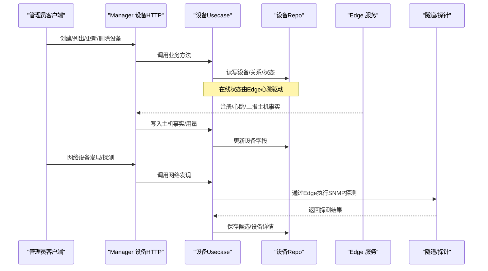
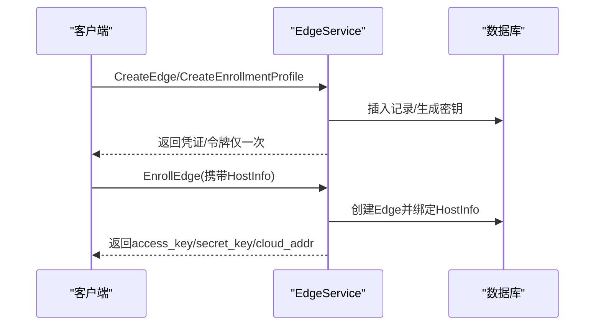
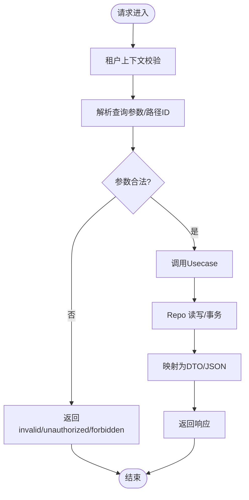
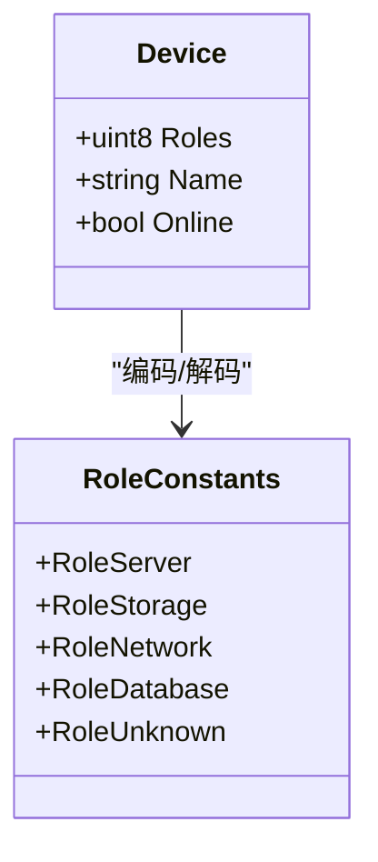
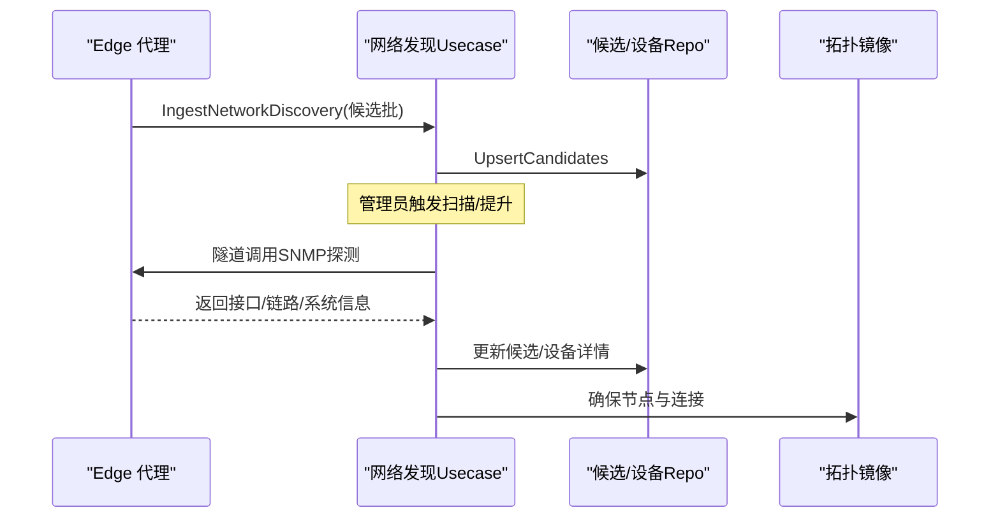
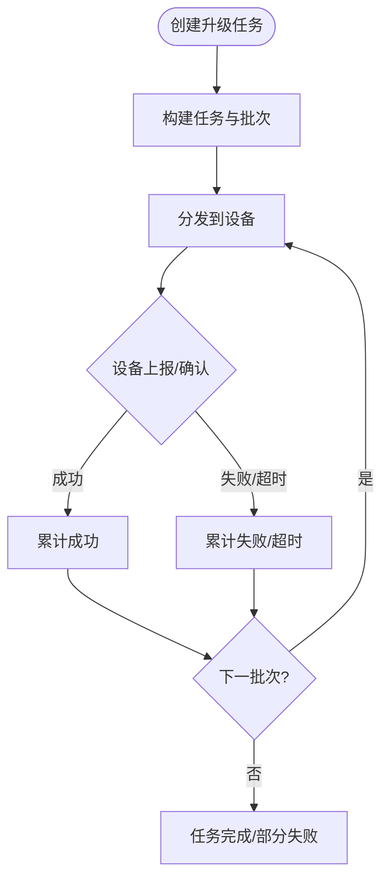
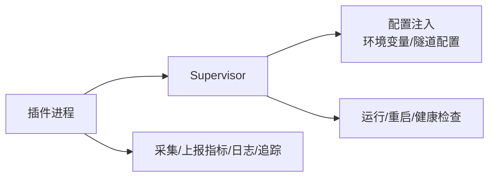
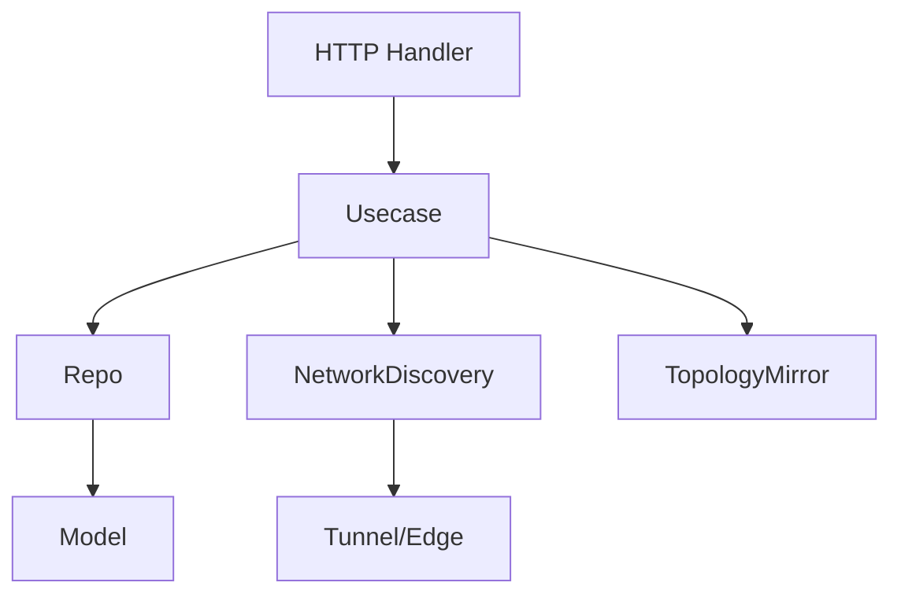

# 设备管理接口

<cite>
**本文引用的文件**
- [edge.proto](file://api/manager/edge/v1/edge.proto)
- [http.go](file://internal/manager/server/device/http.go)
- [usecase.go](file://internal/manager/biz/device/usecase.go)
- [device.go](file://internal/manager/data/device/store/device.go)
- [model.go](file://internal/manager/model/device/model.go)
- [network_discovery.go](file://internal/manager/biz/device/network_discovery.go)
- [supervisor.go](file://internal/edgeagent/plugins/supervisor.go)
- [plugin.go](file://internal/edgeagent/plugins/plugin.go)
- [config_tunnel.go](file://internal/edgeagent/plugins/config_tunnel.go)
</cite>

## 目录
1. [简介](#简介)
2. [项目结构](#项目结构)
3. [核心组件](#核心组件)
4. [架构总览](#架构总览)
5. [详细组件分析](#详细组件分析)
6. [依赖关系分析](#依赖关系分析)
7. [性能考虑](#性能考虑)
8. [故障排查指南](#故障排查指南)
9. [结论](#结论)
10. [附录：API 与使用示例](#附录api-与使用示例)

## 简介
本技术文档面向“边缘设备”和“网络设备”的设备管理能力，覆盖设备的注册、发现、状态监控、配置管理、分组与标签（角色）、批量操作、能力检测与插件体系，以及设备通信协议与错误处理策略。文档以代码级为依据，提供架构图、序列图、流程图与接口清单，帮助开发者快速理解并正确使用设备管理接口。

## 项目结构
本项目将“设备（Device）”与“边缘代理（Edge）”解耦：
- Edge 代表可在线的代理身份（AccessKey/SecretKey、在线状态、最后在线时间）。
- Device 代表被监控的主机或网络设备实体（主机事实、容量、实时用量、角色、拓扑节点关联）。
- 通过多对多关系表 edge_devices 将 Edge 与 Device 关联，支持“host”与“discovered”两种关系类型。

```mermaid
graph TB
subgraph "管理器"
A["HTTP 路由<br/>/v1/devices*"]
B["业务用例 Usecase"]
C["数据仓库 Repo"]
D["模型 Model"]
end
subgraph "边缘侧"
E["Edge 服务<br/>注册/心跳/上报"]
F["插件体系<br/>指标/日志/追踪"]
end
A --> B --> C --> D
E < --> A
F --> E
```

图表来源
- [http.go:32-66](file://internal/manager/server/device/http.go#L32-L66)
- [usecase.go:16-60](file://internal/manager/biz/device/usecase.go#L16-L60)
- [device.go:21-30](file://internal/manager/data/device/store/device.go#L21-L30)
- [model.go:29-102](file://internal/manager/model/device/model.go#L29-L102)
- [edge.proto:10-61](file://api/manager/edge/v1/edge.proto#L10-L61)

章节来源
- [http.go:32-66](file://internal/manager/server/device/http.go#L32-L66)
- [usecase.go:16-60](file://internal/manager/biz/device/usecase.go#L16-L60)
- [device.go:21-30](file://internal/manager/data/device/store/device.go#L21-L30)
- [model.go:29-102](file://internal/manager/model/device/model.go#L29-L102)
- [edge.proto:10-61](file://api/manager/edge/v1/edge.proto#L10-L61)

## 核心组件
- HTTP 层：暴露 /v1/devices 系列 REST 接口，负责鉴权、参数校验、响应封装与错误码映射。
- 业务层：Usecase 聚合设备、边端关系、网络发现、拓扑镜像等能力，提供统一编排。
- 数据层：Repo 基于 GORM 实现设备持久化、在线状态同步、软删除与一致性修复。
- 模型层：定义设备、角色位、边端关系、网络设备等领域模型。
- 边缘侧：Edge 服务负责注册、心跳、上报主机事实与网络发现结果；插件体系扩展采集能力。

章节来源
- [http.go:32-66](file://internal/manager/server/device/http.go#L32-L66)
- [usecase.go:16-60](file://internal/manager/biz/device/usecase.go#L16-L60)
- [device.go:21-30](file://internal/manager/data/device/store/device.go#L21-L30)
- [model.go:29-102](file://internal/manager/model/device/model.go#L29-L102)

## 架构总览
设备管理的端到端流程包括：
- 设备注册与凭证签发（EdgeService）
- 设备上线与状态同步（心跳/最后在线时间）
- 主机事实与用量上报（HostInfo、Usage）
- 网络设备发现与 SNMP 探测（NetworkDiscovery）
- 设备角色分组与标签（Roles）
- 批量升级任务（UpgradeJob）



图表来源
- [edge.proto:10-61](file://api/manager/edge/v1/edge.proto#L10-L61)
- [http.go:193-350](file://internal/manager/server/device/http.go#L193-L350)
- [usecase.go:62-155](file://internal/manager/biz/device/usecase.go#L62-L155)
- [device.go:81-201](file://internal/manager/data/device/store/device.go#L81-L201)
- [network_discovery.go:138-289](file://internal/manager/biz/device/network_discovery.go#L138-L289)

## 详细组件分析

### 设备注册与凭证管理（EdgeService）
- 功能要点
  - 创建 Edge：签发 AccessKey/SecretKey，仅响应体明文返回一次，服务端存储 SecretKey 哈希。
  - 列表/详情/删除：分页、按在线状态过滤、模糊搜索名称。
  - 密钥轮换：重新生成 SecretKey，旧密钥立即失效。
  - 批量安装配置（Enrollment Profile）：用于非 Kubernetes Edge 批量部署，令牌仅响应体返回。
  - 设备领取（EnrollEdge）：使用安装令牌换取独立 Edge 凭证，并返回云地址与公开 URL。
  - 批量升级任务：创建/查询/重试升级作业，支持分批与状态明细。



图表来源
- [edge.proto:10-61](file://api/manager/edge/v1/edge.proto#L10-L61)
- [edge.proto:99-230](file://api/manager/edge/v1/edge.proto#L99-L230)

章节来源
- [edge.proto:10-61](file://api/manager/edge/v1/edge.proto#L10-L61)
- [edge.proto:99-230](file://api/manager/edge/v1/edge.proto#L99-L230)

### 设备生命周期与状态监控（HTTP + Usecase + Repo）
- 功能要点
  - 列表/详情：支持按角色、在线状态、主机名、名称、IP 前缀过滤与分页。
  - 更新名称/描述：管理员权限。
  - 更新角色：将字符串角色集合编码为位掩码，支持“unknown”清空所有位。
  - 删除：仅允许离线设备删除，同时清理关联 Edge 凭证与拓扑节点。
  - 在线状态：由 Edge 心跳驱动，Repo 维护 online/last_seen_at，并提供孤儿设备修复。



图表来源
- [http.go:68-82](file://internal/manager/server/device/http.go#L68-L82)
- [http.go:193-350](file://internal/manager/server/device/http.go#L193-L350)
- [usecase.go:81-155](file://internal/manager/biz/device/usecase.go#L81-L155)
- [device.go:174-201](file://internal/manager/data/device/store/device.go#L174-L201)

章节来源
- [http.go:68-82](file://internal/manager/server/device/http.go#L68-L82)
- [http.go:193-350](file://internal/manager/server/device/http.go#L193-L350)
- [usecase.go:81-155](file://internal/manager/biz/device/usecase.go#L81-L155)
- [device.go:174-201](file://internal/manager/data/device/store/device.go#L174-L201)

### 设备分组与标签（角色 Roles）
- 设计要点
  - 角色以位掩码存储，支持 server/storage/network/database 组合。
  - API 接收字符串数组，内部编码为位掩码；“unknown”表示清空所有位。
  - 列表接口支持按角色过滤与“未知”筛选。



图表来源
- [model.go:75-190](file://internal/manager/model/device/model.go#L75-L190)
- [http.go:203-227](file://internal/manager/server/device/http.go#L203-L227)
- [usecase.go:97-126](file://internal/manager/biz/device/usecase.go#L97-L126)

章节来源
- [model.go:75-190](file://internal/manager/model/device/model.go#L75-L190)
- [http.go:203-227](file://internal/manager/server/device/http.go#L203-L227)
- [usecase.go:97-126](file://internal/manager/biz/device/usecase.go#L97-L126)

### 网络设备发现与 SNMP 探测
- 功能要点
  - 候选收集：Edge 上报 ARP/LLDP/SNMP 观察，去重后入库为候选。
  - 手动扫描：通过隧道向 Edge 发起一次性 SNMP 探测，验证设备能力。
  - 提升为设备：管理员确认后，将候选提升为正式网络设备，建立拓扑连接。
  - 周期性轮询：启用后按间隔定时通过 Edge 拉取 SNMP 指标，更新可达性与接口信息。



图表来源
- [network_discovery.go:544-591](file://internal/manager/biz/device/network_discovery.go#L544-L591)
- [network_discovery.go:422-461](file://internal/manager/biz/device/network_discovery.go#L422-L461)
- [network_discovery.go:310-380](file://internal/manager/biz/device/network_discovery.go#L310-L380)
- [network_discovery.go:208-289](file://internal/manager/biz/device/network_discovery.go#L208-L289)

章节来源
- [network_discovery.go:544-591](file://internal/manager/biz/device/network_discovery.go#L544-L591)
- [network_discovery.go:422-461](file://internal/manager/biz/device/network_discovery.go#L422-L461)
- [network_discovery.go:310-380](file://internal/manager/biz/device/network_discovery.go#L310-L380)
- [network_discovery.go:208-289](file://internal/manager/biz/device/network_discovery.go#L208-L289)

### 批量升级任务（Edge 批量运维）
- 功能要点
  - 创建升级任务：指定目标版本、是否强制重装、可选集群节点范围。
  - 任务状态：排队/运行/成功/部分失败/失败，包含批次进度。
  - 明细跟踪：逐设备项的状态、尝试次数、错误码/消息、观测版本。
  - 重试：仅重试失败或超时的设备。



图表来源
- [edge.proto:232-316](file://api/manager/edge/v1/edge.proto#L232-L316)

章节来源
- [edge.proto:232-316](file://api/manager/edge/v1/edge.proto#L232-L316)

### 插件管理与能力检测（边缘侧）
- 插件体系
  - 插件进程由 Supervisor 管理，支持子进程隔离、重启、配置注入。
  - 插件类型涵盖自定义指标、数据库指标、主机指标、日志、追踪等。
  - 配置通过环境变量与隧道配置注入，支持日志凭据安全传递。



图表来源
- [supervisor.go](file://internal/edgeagent/plugins/supervisor.go)
- [plugin.go](file://internal/edgeagent/plugins/plugin.go)
- [config_tunnel.go](file://internal/edgeagent/plugins/config_tunnel.go)

章节来源
- [supervisor.go](file://internal/edgeagent/plugins/supervisor.go)
- [plugin.go](file://internal/edgeagent/plugins/plugin.go)
- [config_tunnel.go](file://internal/edgeagent/plugins/config_tunnel.go)

## 依赖关系分析
- HTTP 层依赖业务用例，业务用例依赖数据仓库与可选的网络发现、拓扑镜像。
- 数据仓库依赖 GORM 与模型，提供一致性的增删改查与事务。
- 网络发现依赖隧道调用 Edge 进行 SNMP 探测，并通过拓扑镜像维护设备关系。
- 边缘侧插件通过 Supervisor 管理，受配置与安全机制保护。



图表来源
- [http.go:32-66](file://internal/manager/server/device/http.go#L32-L66)
- [usecase.go:16-60](file://internal/manager/biz/device/usecase.go#L16-L60)
- [network_discovery.go:82-122](file://internal/manager/biz/device/network_discovery.go#L82-L122)
- [device.go:21-30](file://internal/manager/data/device/store/device.go#L21-L30)
- [model.go:29-102](file://internal/manager/model/device/model.go#L29-L102)

章节来源
- [http.go:32-66](file://internal/manager/server/device/http.go#L32-L66)
- [usecase.go:16-60](file://internal/manager/biz/device/usecase.go#L16-L60)
- [network_discovery.go:82-122](file://internal/manager/biz/device/network_discovery.go#L82-L122)
- [device.go:21-30](file://internal/manager/data/device/store/device.go#L21-L30)
- [model.go:29-102](file://internal/manager/model/device/model.go#L29-L102)

## 性能考虑
- 列表与过滤：角色过滤使用 IN 列表优化命中索引；限制与偏移控制负载。
- 在线状态：通过心跳与后台修复任务保持设备可见性，避免 JOIN 开销。
- 网络发现：候选批量入库、去重与上限控制；SNMP 探测串行化以避免阻塞交互请求。
- 插件管理：子进程隔离与重启，降低采集器故障对主进程影响。

[本节为通用指导，不直接分析具体文件]

## 故障排查指南
- 常见错误码
  - not-found：资源不存在
  - unauthorized/forbidden：鉴权失败或无权限
  - conflict：状态冲突（如未满足前置条件）
  - invalid：参数非法
  - not-wired-yet：依赖未装配（如网络发现未启用）
  - internal：内部错误
- 排查建议
  - 检查租户上下文与管理员权限。
  - 确认设备离线后再删除，避免并发冲突。
  - 网络设备提升需先完成 SNMP 验证。
  - 查看网络轮询错误信息与可达性状态。
  - 升级任务关注 item 级别的 error_code 与 error_message。

章节来源
- [http.go:669-696](file://internal/manager/server/device/http.go#L669-L696)
- [usecase.go:136-155](file://internal/manager/biz/device/usecase.go#L136-L155)
- [network_discovery.go:138-206](file://internal/manager/biz/device/network_discovery.go#L138-L206)
- [edge.proto:232-316](file://api/manager/edge/v1/edge.proto#L232-L316)

## 结论
本系统通过清晰的边界划分（Edge/Device）、稳健的持久化与一致性修复、可扩展的网络发现与插件体系，提供了完整的设备管理能力。借助统一的 HTTP 接口与明确的错误码，开发者可以高效地实现设备注册、发现、监控、配置与批量运维。

[本节为总结，不直接分析具体文件]

## 附录：API 与使用示例

### 设备管理 REST 接口（/v1/devices）
- GET /v1/devices：列出设备，支持 roles、online、hostname、name、ip_address、limit、offset 过滤。
- GET /v1/devices/{id}：获取设备详情。
- PATCH /v1/devices/{id}：更新名称/描述（管理员）。
- PATCH /v1/devices/{id}/roles：更新角色（管理员）。
- DELETE /v1/devices/{id}：删除设备（管理员，必须离线）。
- GET /v1/devices/{id}/edges：查看设备关联的 Edge。
- GET /v1/devices/{id}/network：查看已提升的网络设备详情。
- GET /v1/network-discovery/candidates：列出网络发现候选。
- POST /v1/network-discovery/candidates/{id}/snmp-scan：对候选进行 SNMP 探测。
- PATCH /v1/devices/{id}/network/polling：配置周期性 SNMP 轮询。

章节来源
- [http.go:40-66](file://internal/manager/server/device/http.go#L40-L66)
- [http.go:193-555](file://internal/manager/server/device/http.go#L193-L555)

### 边缘设备 gRPC 接口（EdgeService）
- CreateEdge：创建 Edge，返回 AccessKey/SecretKey。
- ListEdges：分页列出 Edge，支持在线状态过滤与名称搜索。
- GetEdge：获取 Edge 详情。
- DeleteEdge：删除 Edge（终止在线隧道）。
- RotateSecret：轮换 SecretKey。
- CreateEnrollmentProfile/ListEnrollmentProfiles/DeleteEnrollmentProfile：批量安装配置管理。
- EnrollEdge：使用安装令牌领取 Edge 凭证。
- CreateUpgradeJob/ListUpgradeJobs/GetUpgradeJob/RetryUpgradeJob：批量升级任务管理。

章节来源
- [edge.proto:10-61](file://api/manager/edge/v1/edge.proto#L10-L61)
- [edge.proto:99-316](file://api/manager/edge/v1/edge.proto#L99-L316)

### 使用示例（概念性步骤）
- 注册设备
  - 调用 EdgeService.CreateEdge 获取凭证，部署 Edge 代理。
  - Edge 启动后调用 EnrollEdge 完成注册并建立连接。
- 发现网络设备
  - 在设备页面查看网络发现候选，必要时执行 SNMP 扫描。
  - 管理员确认后提升为网络设备，并配置轮询。
- 批量升级
  - 创建升级任务，选择目标版本与范围，监控任务与设备项状态。
  - 对失败或超时项执行重试。

[本节为概念性说明，不直接分析具体文件]